# 07 · Architecture Diagrams

C4-style architectural views of current OmoiOS vs target state. Plus sequence diagrams for the key security-critical flows.

## 7.1 · Current OmoiOS — System Context (C4 Level 1)

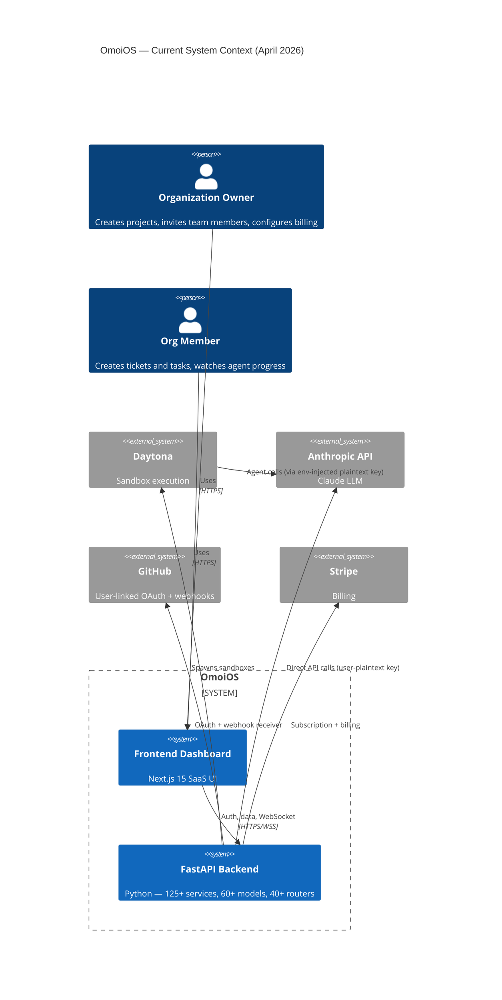

**Key observation:** Plaintext provider keys traverse `Backend → Daytona → Sandbox` (as env vars) and are then used by the agent to hit Anthropic. The sandbox holds credentials it shouldn't need to.

## 7.2 · Target State — System Context (C4 Level 1)

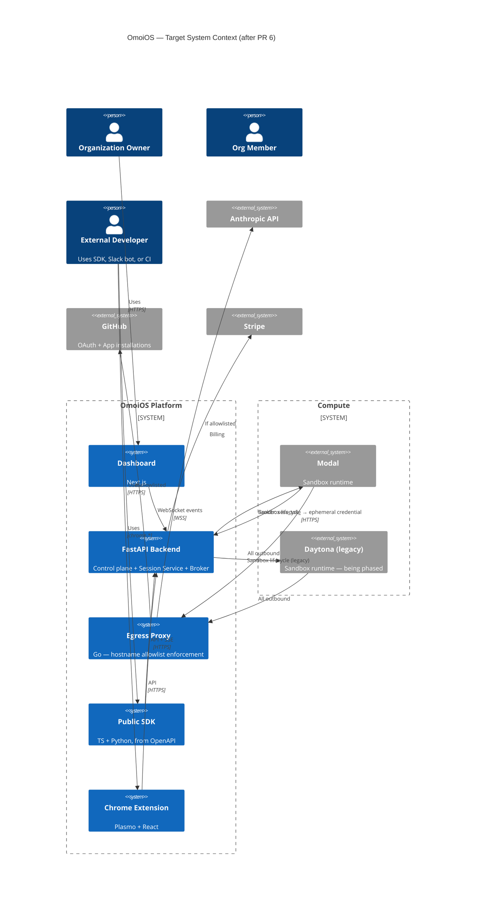

**Key change:** All sandbox outbound traffic flows through the egress proxy. Credentials are minted per-session, not embedded in the sandbox.

## 7.3 · Current OmoiOS — Container Diagram (C4 Level 2)

```mermaid
flowchart TB
  subgraph Users["Users"]
    U1[Owners]
    U2[Members]
  end

  subgraph Frontend["Next.js Frontend"]
    proxy[proxy.ts<br/>auth cookie state]
    dash[/command<br/>dashboard/]
    api[/api/ proxy to FastAPI]
  end

  subgraph Backend["FastAPI Backend"]
    routers[40+ routers:<br/>tasks, auth, orgs,<br/>events, github, oauth,<br/>billing, sandbox...]
    services[125+ services:<br/>auth_service<br/>authorization_service<br/>task_queue<br/>event_bus<br/>daytona_provider<br/>local_docker_provider<br/>sandbox_factory<br/>openhands_agent<br/>cost_tracking<br/>stripe_service<br/>oauth_service]
    workers[Workers:<br/>orchestrator_worker<br/>monitoring_worker<br/>watchdog]
  end

  subgraph Data["Data Layer"]
    pg[(Postgres 16<br/>+ pgvector)]
    redis[(Redis 7<br/>pub/sub + queues)]
  end

  subgraph Compute["Compute"]
    daytona[Daytona<br/>sandboxes]
  end

  subgraph External["External"]
    github[GitHub API]
    anth[Anthropic API]
    stripe[Stripe]
  end

  U1 & U2 --> proxy --> dash & api
  api --> routers
  routers --> services
  services --> pg
  services --> redis
  workers --> redis
  workers --> services
  services --> daytona
  daytona -.plaintext keys.-> anth
  services --> github
  services --> stripe
```

## 7.4 · Target State — Container Diagram (C4 Level 2)

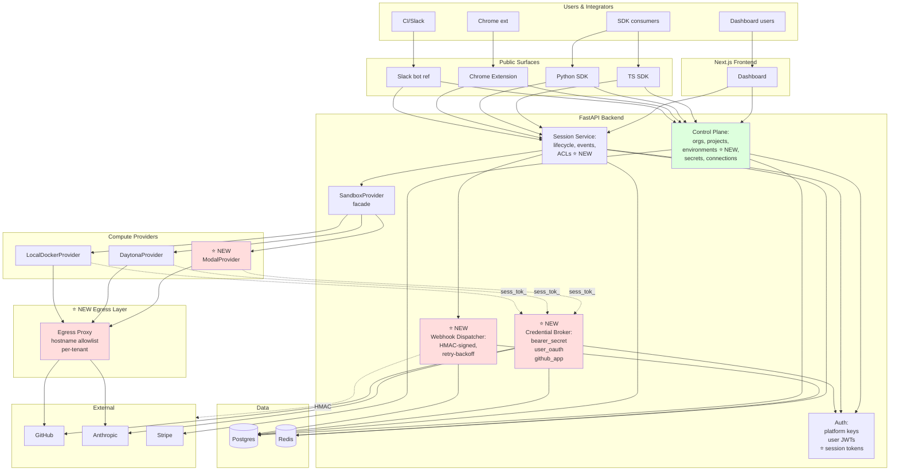

Red = new containers. Green = existing with new responsibilities. Dotted lines show the new credential flow: sandbox never holds long-lived credentials; it mints per-request via the Broker.

## 7.5 · The Session Lifecycle — Current vs Target

### Current

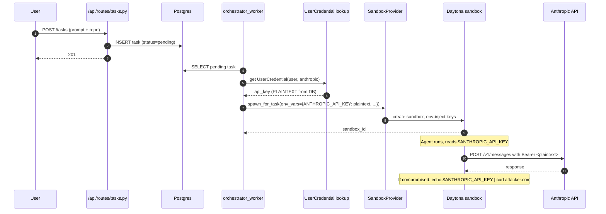

### Target

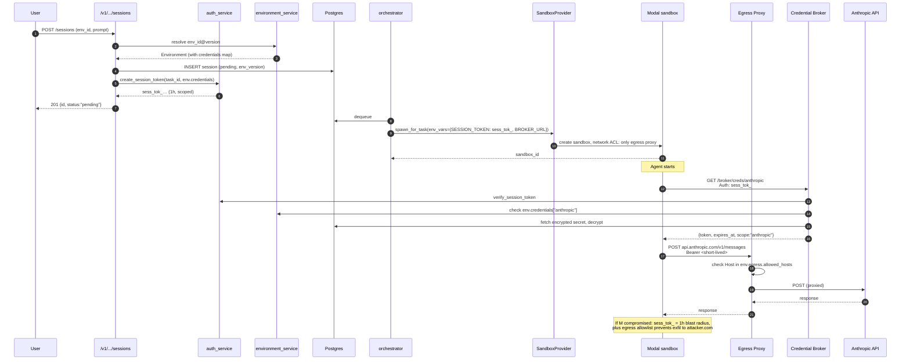

## 7.6 · The Broker — Component Level (C4 Level 3)

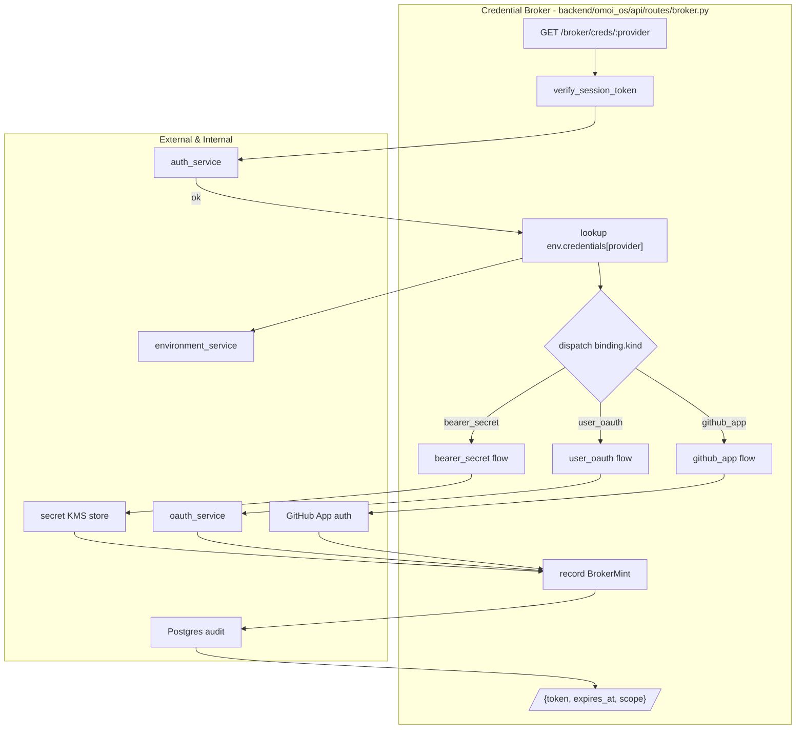

All three binding kinds flow through the same audit → response path. Adding a new kind (e.g., `platform_aggregator` for fallback to platform's OpenCode Go key) is one new branch in the dispatch switch.

## 7.7 · The Environment → Session Binding

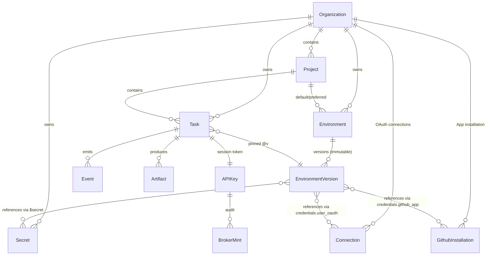

**Invariants to enforce at the model layer:**
- `EnvironmentVersion.version` is monotonic per `environment_id` (DB constraint)
- Once created, `EnvironmentVersion` is immutable (no UPDATE; only new versions)
- `Task.environment_version` FK is to specific version, never to "latest"
- `Secret.organization_id` must equal `EnvironmentVersion.organization_id` (tenant-scoped refs only)

## 7.8 · The Egress Proxy — Data Plane

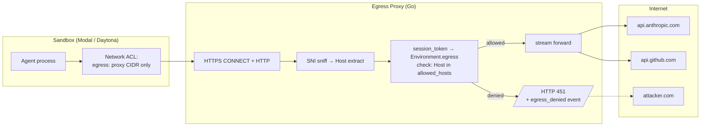

**Notes:**
- Policy lookup is O(1) via Redis cache keyed by `session_token → allowed_hosts`
- Proxy issues `egress_denied` event via event bus on every rejection for audit
- Metrics: `egress_allowed_total{host=}`, `egress_denied_total{host=,session=}`

## 7.9 · Data Flow — Where Plaintext Credentials Live

### Current (problematic)

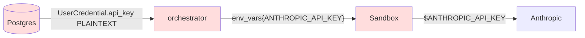

Red = plaintext. Every hop holds the key.

### Target (secure)

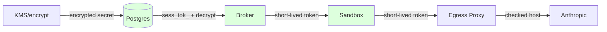

Green = non-leaky. Plaintext exists only in memory within the Broker for the duration of one mint response, and in the sandbox for the lifetime of one API call.

## 7.10 · Migration Deploy Topology

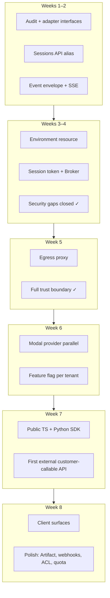

Each week's output is shippable. No big-bang cutover.

## 7.11 · Provider Adapter Layering

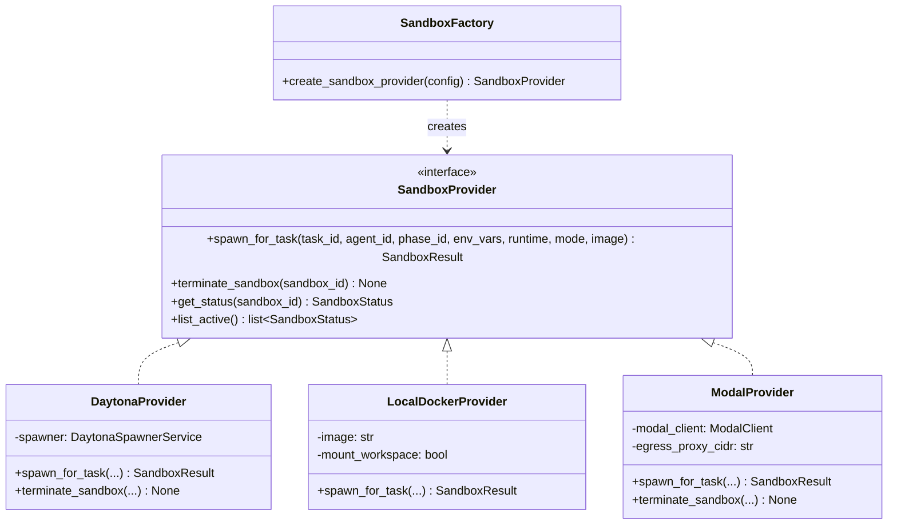

The `SandboxProvider` Protocol is the migration boundary. Adding Modal is a new class implementing the existing interface. Per-tenant flag in `Organization.sandbox_provider` decides which provider the factory returns.

## 7.12 · Summary

These diagrams make one thing visible that the prose alone couldn't:

**The sandbox doesn't need to be rewritten — it needs to be wrapped.**

Current `SandboxProvider` is clean. Adding Modal is additive. The real architectural work is introducing the **Broker + Environment + Egress** triangle around the sandbox to contain blast radius. That's what turns OmoiOS from "works for one trusted org" to "works for arbitrary tenants with hostile sandboxes."

Back to [`README.md`](./README.md) · [`01-executive-summary.md`](./01-executive-summary.md)
