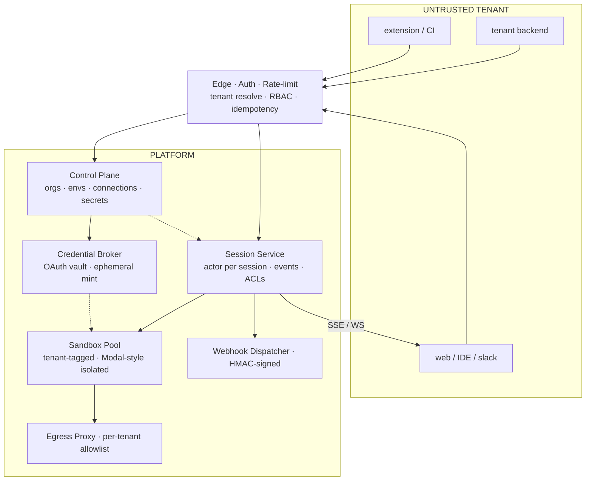

# Multi-Tenant Background Agent API — Spec v0.2

Ramp's Inspect works because every user shares one codebase, one set of secrets, one trust boundary. Taking it outward means the trust boundary moves **per request**. This spec is the minimal surface that survives that shift.

## Files

| # | File | What's in it |
|---|------|---|
| 00 | `00-overview.md` | this file — design decisions + architecture diagram |
| 01 | `01-auth-and-tenancy.md` | three token types, tenant scoping, token exchange |
| 02 | `02-resources.md` | Organization, Workspace, Environment, Session, Artifact |
| 03 | `03-sessions-api.md` | endpoints, create/stream/cancel/fork, event envelope |
| 04 | `04-credentials.md` | OAuth connections, secrets, Credential Broker flow |
| 05 | `05-environments.md` | build modes, egress allowlist, versioning |
| 06 | `06-streaming-and-webhooks.md` | SSE vs WS vs webhooks, event types, signatures |
| 07 | `07-multiplayer.md` | ACLs, sharing, presence over WebSocket |
| 08 | `08-quotas-and-errors.md` | limits, error codes, quota dimensions |
| 09 | `09-sdks.md` | TypeScript + Python SDK shape and usage |
| 10 | `10-client-patterns.md` | Slack bot, CI/GitHub Action, web + IDE |
| 11 | `11-chrome-extension-plasmo.md` | full Plasmo + React walkthrough |
| 12 | `12-next-steps.md` | incremental implementation order |
| 13 | `13-better-auth-integration.md` | **auth implementation** — Better Auth plugins + custom extensions |
| 14 | `14-omo-opencode-sandbox.md` | OmO + OpenCode config, providers, fallbacks, sandbox env mapping |
| 15 | `15-modal-integration.md` | Modal sandbox orchestration — TS SDK state, build vs runtime split |
| 16 | `16-deployment-topology.md` | **deployment decision** — Next.js + Modal Functions, no FastAPI |
| 17 | `17-omoi-os-adaptation.md` | **adapting the spec to your existing FastAPI codebase** (read first if you have omoi_os) |
| 18 | `18-sdk-and-client-patterns.md` | **SDK surface + 30 client use cases** (incl. ReactGrab extension walkthrough) |

## Six design decisions

1. **Pooled compute, siloed data.** One sandbox pool, but each sandbox tagged by tenant and network-policy-blocked from cross-tenant traffic at the egress proxy. Storage partitioned per org.
2. **Three-tier auth.** Platform API key (server↔server), user JWT (humans), session token (the sandbox itself). Never collapse these — the sandbox will be attacked.
3. **Credentials via delegation, never storage.** Tenants connect GitHub/GitLab/etc. via OAuth. Broker mints ephemeral, scoped tokens on demand. Raw refresh tokens never leave the vault.
4. **Environments are declarative and versioned.** Every session pins to an `env_…@vN`. Customers build images, platform snapshots them. Rolling updates are opt-in.
5. **Async-first, three streaming modes.** `POST /sessions` returns in <200ms. Events via SSE (simple), WebSocket (multiplayer + input), or webhooks (server↔server).
6. **Multiplayer is an ACL, not a feature.** Sessions have owners/editors/viewers within an org. Cross-org sharing is explicitly unsupported. Presence rides the WebSocket.

## Architecture

Click-through sections:
- **edge** → [01 Auth](./01-auth-and-tenancy.md)
- **control plane** → [02 Resources](./02-resources.md)
- **session service** → [03 Sessions](./03-sessions-api.md)
- **credential broker** → [04 Credentials](./04-credentials.md)
- **sandbox / egress** → [05 Environments](./05-environments.md)
- **webhooks** → [06 Streaming](./06-streaming-and-webhooks.md)
