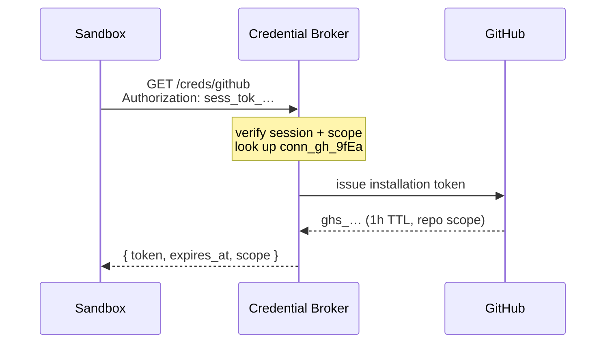

# 04 · Credentials

The hardest part of externalizing Inspect. The platform must never store raw customer credentials in a form the agent can exfiltrate. Three layers:

### A · Connections (OAuth)
Tenants authorize GitHub, GitLab, Linear, Jira, etc. via OAuth. Refresh tokens live in a KMS-wrapped vault. The API exposes only a `connection_id`; the raw token is never returned by any endpoint.

### B · Secrets (BYOC / raw values)
For things without OAuth (DB URLs, private API keys), tenants `POST` them to `/secrets` and get back a `sec_…` reference. Environments and sessions reference these by ID only. Secrets are decrypted only inside the sandbox boundary.

### C · Ephemeral delegation (Credential Broker)
When a sandbox needs a token, it calls the Broker over its session token. The Broker checks session ACL, environment's declared scopes, policy limits, then mints a short-lived token bound to the session.

## Broker flow

The Broker enforces: a sandbox can only request scopes declared in its environment. A session for repo `payments-service` cannot mint a token for repo `customer-data`.

## Endpoints

| Method | Path | Purpose |
|---|---|---|
| `POST` | `/v1/organizations/{org}/connections/oauth/start` | Returns provider consent URL. |
| `GET` | `/v1/organizations/{org}/connections/oauth/callback` | Completes OAuth. |
| `GET` | `/v1/organizations/{org}/connections` | List. **Never returns tokens.** |
| `POST` | `/v1/organizations/{org}/secrets` | Create a secret. Body is write-only. |
| `GET` | `/v1/organizations/{org}/secrets` | Metadata only; no values. |
