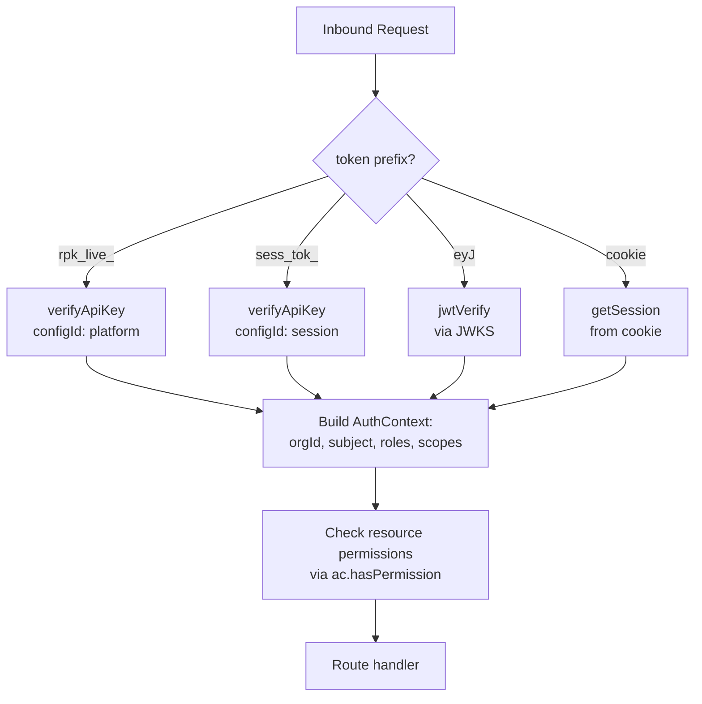

# 13 · Better Auth Integration

This supersedes the conceptual auth design in [`01`](./01-auth-and-tenancy.md). Better Auth's plugin ecosystem covers ~70% of the auth surface natively; the rest is built as first-class Better Auth plugins so everything sits in one coherent system.

> Verified against Better Auth docs via Context7, April 2026. All plugin APIs (`apiKey`, `organization`, `jwt`, `genericOAuth`, `createAccessControl`) confirmed against current documentation.

## 1 · Plugin mapping

| Spec concern | Better Auth primitive | Custom code |
|---|---|---|
| Tenant / organization | `organization` plugin | none — 1:1 mapping |
| Workspace | `organization.teams` (enabled) | none — teams *are* workspaces |
| Platform API key (`rpk_live_…`) | `apiKey` plugin, `references: "organization"` | none |
| Session token (`sess_tok_…`) | `apiKey` plugin, separate config, `expiresIn: 3600` | create-on-session-create hook |
| User JWT | `jwt` plugin + JWKS endpoint | custom claims for active org |
| RBAC (owner / editor / viewer) | `createAccessControl` + `organization.roles` | custom resource statements |
| **User-linked OAuth** (personal GitHub, GitLab, Linear) | `socialProviders` + `auth.api.getAccessToken` | **none — auto-refresh built in** |
| **Org-wide OAuth** (GitHub App installation) | — (use GitHub App, not OAuth) | installation handler + token minter |
| Credential Broker | — | **custom plugin** (see §8) |
| Webhook dispatcher | — | custom plugin (signing only) |

## 2 · Schema

Better Auth generates these tables via its migration tool — run `pnpm better-auth generate` after installing plugins.

**From plugins:**
- `user`, `session`, `account` (core)
- `organization`, `member`, `invitation`, `team`, `teamMember` (organization plugin)
- `apiKey` (apiKey plugin)
- `jwks` (jwt plugin, stores signing keys)

**We add** (separate migrations, own tables, `organizationId` FK):
- `environment`, `environmentVersion`
- `session_exec` (agent execution session — named to avoid collision with `session`)
- `artifact`
- `secret` (BYOC values; envelope-encrypted)
- `githubInstallation` (org-wide GitHub App installations; see §7 Model B)
- `webhookSubscription`, `webhookDelivery`
- `brokerMint` (audit log for every credential minted, see §8)

**Note:** user-linked OAuth (personal GitHub/GitLab/Linear) needs no custom table — Better Auth's `account` table already stores `accessToken` + `refreshToken` + `accessTokenExpiresAt` per user per provider.

## 3 · Server config — `auth.ts`

```ts
import { betterAuth } from "better-auth"
import { organization, jwt, genericOAuth } from "better-auth/plugins"
import { apiKey } from "@better-auth/api-key"
import { createAccessControl } from "better-auth/plugins/access"
import { ac, owner, admin, editor, viewer } from "./permissions"

export const auth = betterAuth({
  database: {
    // your drizzle/prisma/kysely adapter here
  },
  baseURL: process.env.BASE_URL!,

  plugins: [
    // --- organization = tenant, teams = workspaces ---
    organization({
      ac,
      roles: { owner, admin, editor, viewer },
      teams: { enabled: true },
      allowUserToCreateOrganization: async (user) => user.plan !== "free",
      async sendInvitationEmail({ email, organization, inviter, id }) {
        await sendInvite({
          to: email,
          org: organization.name,
          inviter: inviter.user.email,
          link: `${process.env.BASE_URL}/accept-invite/${id}`,
        })
      },
    }),

    // --- two apiKey configs: platform keys + session tokens ---
    apiKey({
      enableMetadata: true,
      rateLimit: {
        enabled: true,
        timeWindow: 60_000,        // 1 min
        maxRequests: 600,          // 10 rps default, override per-key
      },
      configs: [
        {
          configId: "platform",
          defaultPrefix: "rpk_live_",
          references: "organization",
          defaultExpiresIn: null,   // long-lived
        },
        {
          configId: "session",
          defaultPrefix: "sess_tok_",
          references: "organization",
          defaultExpiresIn: 3_600,  // 1h sliding
        },
      ],
    }),

    // --- user JWT with JWKS for downstream services ---
    jwt({
      jwt: {
        issuer: process.env.BASE_URL!,
        audience: process.env.BASE_URL!,
        expirationTime: "15m",
        // Embed active org + member roles in the token so downstream
        // services don't have to round-trip.
        getSubject: (s) => s.user.id,
        additionalClaims: async (session) => ({
          org: session.session.activeOrganizationId,
          roles: await getRolesForActiveOrg(session),
        }),
      },
    }),

    // --- our custom plugins (§8) ---
    credentialBroker(),
    webhookDispatcher(),
  ],

  // --- user-linked OAuth providers (§7 Model A).
  //     Better Auth auto-refreshes expired tokens on getAccessToken().
  socialProviders: {
    github: {
      clientId:     process.env.GITHUB_OAUTH_CLIENT_ID!,
      clientSecret: process.env.GITHUB_OAUTH_CLIENT_SECRET!,
      scope: ["repo", "workflow", "read:org"],
    },
    gitlab: {
      clientId:     process.env.GITLAB_OAUTH_CLIENT_ID!,
      clientSecret: process.env.GITLAB_OAUTH_CLIENT_SECRET!,
      scope: ["api", "read_repository", "write_repository"],
      accessType: "offline",
      prompt: "consent",
    },
    google: {
      clientId:     process.env.GOOGLE_CLIENT_ID!,
      clientSecret: process.env.GOOGLE_CLIENT_SECRET!,
      accessType: "offline",
      prompt: "select_account consent",
    },
  },
})
```

## 4 · Access control — `permissions.ts`

Custom resources for the agent platform on top of the built-in `organization` / `member` / `team` / `apiKey` / `invitation` resources.

```ts
import { createAccessControl } from "better-auth/plugins/access"
import { defaultStatements, ownerAc, adminAc, memberAc }
  from "better-auth/plugins/organization/access"

const statements = {
  ...defaultStatements,         // organization, member, team, invitation
  apiKey:      ["create", "read", "update", "delete"],

  // --- agent platform resources ---
  session_exec: ["create", "read", "cancel", "reply", "fork", "share"],
  environment:  ["create", "read", "update", "build", "delete"],
  secret:       ["create", "read", "delete"],           // "read" = see metadata, never value
  connection:   ["create", "read", "revoke"],
  webhook:      ["create", "read", "delete"],
  usage:        ["read"],
} as const

export const ac = createAccessControl(statements)

// Owner inherits admin + all custom resources
export const owner = ac.newRole({
  ...ownerAc.statements,
  apiKey:       ["create", "read", "update", "delete"],
  session_exec: ["create", "read", "cancel", "reply", "fork", "share"],
  environment:  ["create", "read", "update", "build", "delete"],
  secret:       ["create", "read", "delete"],
  connection:   ["create", "read", "revoke"],
  webhook:      ["create", "read", "delete"],
  usage:        ["read"],
})

export const admin = ac.newRole({
  ...adminAc.statements,
  apiKey:       ["create", "read", "update", "delete"],
  session_exec: ["create", "read", "cancel", "reply", "fork", "share"],
  environment:  ["create", "read", "update", "build"],
  secret:       ["create", "read"],
  connection:   ["create", "read", "revoke"],
  webhook:      ["create", "read"],
  usage:        ["read"],
})

export const editor = ac.newRole({
  ...memberAc.statements,
  session_exec: ["create", "read", "cancel", "reply", "fork"],
  environment:  ["read"],
  secret:       ["read"],
  usage:        ["read"],
})

export const viewer = ac.newRole({
  ...memberAc.statements,
  session_exec: ["read"],
  environment:  ["read"],
  usage:        ["read"],
})
```

## 5 · Three token types in practice

### a) Platform API key — `rpk_live_…`

Minted by an admin from the dashboard. Long-lived, per-org.

```ts
// In your dashboard API route, guarded by user session:
const { key } = await auth.api.createApiKey({
  body: {
    configId: "platform",
    name: "production-backend",
    organizationId: activeOrgId,
    metadata: { env: "prod", created_by_ui: true },
    rateLimitEnabled: true,
    rateLimitTimeWindow: 60_000,
    rateLimitMax: 1200,          // 20 rps burst
  },
  headers: req.headers,
})
// key is the plaintext — return once, never again.
```

Verifying on an inbound request:

```ts
const result = await auth.api.verifyApiKey({
  body: {
    configId: "platform",
    key: req.headers.authorization!.replace("Bearer ", ""),
    permissions: { session_exec: ["create"] },
  },
})
if (!result.valid) return new Response("forbidden", { status: 403 })

const orgId = result.key!.organizationId!        // tenant scope
```

### b) User JWT — `eyJ…`

Issued from the browser or via server-side token exchange.

```ts
// Browser: after the user signs in via Better Auth, request a JWT.
const res = await fetch("/api/auth/token", { credentials: "include" })
const { token } = await res.json()

// Downstream service verifies via JWKS:
import { jwtVerify, createRemoteJWKSet } from "jose"
const JWKS = createRemoteJWKSet(new URL(`${BASE_URL}/api/auth/jwks`))
const { payload } = await jwtVerify(token, JWKS, {
  issuer: BASE_URL,
  audience: BASE_URL,
})
// payload.org, payload.roles are our custom claims
```

### c) Session token — `sess_tok_…`

Minted **per agent-execution session** at creation time. Scoped to that session's declared resources via the `permissions` field on the API key.

```ts
// When the platform creates a new agent-execution session:
async function provisionSandbox(exec: SessionExec) {
  const env = await db.environment.findById(exec.environmentId)

  const { key: sessionToken } = await auth.api.createApiKey({
    body: {
      configId: "session",                 // 1h TTL from config
      name: `sandbox-${exec.id}`,
      organizationId: exec.organizationId,
      metadata: {
        session_exec_id: exec.id,
        environment_id:  exec.environmentId,
      },
      permissions: {
        // Only this session's credentials, via broker.
        broker: env.egress.allowed_hosts.map(h => `mint:${h}`),
      },
      remaining: 10_000,                   // hard cap on broker calls
    },
  })

  // Hand the token to the sandbox at boot.
  await modal.launch({ env, secrets: { SESSION_TOKEN: sessionToken } })
}
```

The sandbox presents `sess_tok_…` to the Credential Broker (§8). The Broker calls `auth.api.verifyApiKey` with the required `broker:<host>` permission.

## 6 · Organization ↔ Workspace via teams

With `teams: { enabled: true }` the organization plugin gives us `/organization/create-team`, `/organization/add-member-to-team`, etc. A workspace *is* a team.

```ts
// Tenant admin creates a workspace
await authClient.organization.createTeam({
  name: "payments-service",
  organizationId: activeOrg.id,
})

// Scoping a session to a workspace — the workspace_id on sessions
// is just a teamId, foreign-key to the `team` table.
```

One design note: the organization plugin's built-in roles are applied *per-organization*. If you want different roles per workspace (e.g. Alice is `editor` in `payments-service` but `viewer` in `customer-data`), you need to either (a) store workspace-level roles yourself on `teamMember`, or (b) keep roles at org level and gate workspace access at the resource layer. Start with (b); move to (a) only if customers ask.

## 7 · OAuth connections — two models, both native

The earlier draft of this doc proposed a custom `orgScopedConnections` plugin. **Scrap that.** Better Auth already does everything we need, across two distinct models for two distinct use cases.

### Model A — user-linked accounts (Better Auth native, zero custom code)

For "this user is giving the agent access to their personal GitHub / GitLab / Linear." Better Auth's `linkSocialAccount` flow handles the OAuth dance, stores `accessToken` + `refreshToken` in the `account` table, and **auto-refreshes expired tokens** on retrieval.

**Configure providers** in the Better Auth server config:

```ts
export const auth = betterAuth({
  socialProviders: {
    github: {
      clientId:     process.env.GITHUB_OAUTH_CLIENT_ID!,
      clientSecret: process.env.GITHUB_OAUTH_CLIENT_SECRET!,
      scope: ["repo", "workflow", "read:org"],
    },
    gitlab: {
      clientId:     process.env.GITLAB_OAUTH_CLIENT_ID!,
      clientSecret: process.env.GITLAB_OAUTH_CLIENT_SECRET!,
      scope: ["api", "read_repository", "write_repository"],
      // Refresh token issuance:
      accessType: "offline",
      prompt: "consent",
    },
    google: {
      clientId:     process.env.GOOGLE_CLIENT_ID!,
      clientSecret: process.env.GOOGLE_CLIENT_SECRET!,
      accessType: "offline",
      prompt: "select_account consent",
    },
  },
  plugins: [ /* …organization, apiKey, jwt, etc. */ ],
})
```

**User connects from the dashboard:**

```ts
// Browser
await authClient.linkSocial({
  provider: "github",
  callbackURL: "/settings/connections?connected=github",
})
```

**Server-side retrieval (with auto-refresh):**

```ts
// Inside the Credential Broker — see §8
const { accessToken } = await auth.api.getAccessToken({
  body: {
    providerId: "github",
    userId:     session_exec.createdBy,   // the user who started the session
  },
})
// Expired? Better Auth refreshes transparently and updates the account row.
```

That's it. No custom plugin, no custom schema, no envelope encryption to manage — Better Auth handles all of it via the existing `account` table.

### Model B — GitHub App installation (org-wide, our code — but simpler than OAuth)

For "the tenant's *organization* has authorized the agent platform against repos X, Y, Z." Survives the authorizing user leaving the company. This is the **correct primitive** for org-wide access, and GitHub App installations don't use OAuth refresh tokens at all — they mint short-lived installation access tokens from a JWT signed by the app's private key.

One table, one handler:

```ts
// schema migration, separate from Better Auth's tables
export const githubInstallation = table("github_installation", {
  id:                string().primaryKey(),
  organizationId:    string().references(organization.id).notNull(),
  installationId:    integer().notNull().unique(),   // from GitHub
  accountLogin:      string().notNull(),              // "acme-corp"
  repositorySelection: string().notNull(),            // "all" | "selected"
  createdAt:         timestamp().defaultNow(),
})
```

**Install flow:**

```ts
// Dashboard: admin clicks "Install on GitHub"
// 1. Redirect to https://github.com/apps/<app-name>/installations/new
//    with `state` = orgId (signed with our session secret)
// 2. GitHub redirects back with ?installation_id=12345&setup_action=install
// 3. Handler:

app.get("/integrations/github/setup", async (req, res) => {
  const session = await auth.api.getSession({ headers: req.headers })
  if (!session) return res.status(401).end()

  const { installation_id, state } = req.query
  const { orgId } = verifySignedState(state)          // check it matches session's active org
  await assertOrgPermission(session, orgId, { connection: ["create"] })

  const installation = await octokit.apps.getInstallation({ installation_id })

  await db.insert(githubInstallation).values({
    id:                  ulid(),
    organizationId:      orgId,
    installationId:      Number(installation_id),
    accountLogin:        installation.data.account.login,
    repositorySelection: installation.data.repository_selection,
  })

  res.redirect("/settings/integrations?installed=github")
})
```

**Minting a scoped installation token** (done by the Broker, §8):

```ts
import { createAppAuth } from "@octokit/auth-app"

const appAuth = createAppAuth({
  appId:      process.env.GITHUB_APP_ID!,
  privateKey: process.env.GITHUB_APP_PRIVATE_KEY!,
})

async function mintGithubAppToken(orgId: string, repos: string[]) {
  const install = await db.query.githubInstallation.findFirst({
    where: eq(githubInstallation.organizationId, orgId),
  })
  if (!install) throw new Error("not_installed")

  // Installation token, scoped to only the repos this session's environment
  // declared. ~1h TTL, minted fresh each time.
  const { token, expiresAt } = await appAuth({
    type: "installation",
    installationId: install.installationId,
    repositoryNames: repos,            // ["acme/payments-service"]
    permissions: { contents: "write", pull_requests: "write" },
  })

  return { token, expiresAt, scope: repos.join(",") }
}
```

### When to use which

| Scenario | Use |
|---|---|
| Developer signs up, wants agent to work on their personal repos | **Model A** — user-linked GitHub |
| Developer wants agent to work on their personal Linear issues | **Model A** — user-linked Linear |
| Tenant org wants agent to work on shared team repos | **Model B** — GitHub App installation |
| Tenant's CI integration creates sessions via platform API key | **Model B** — no user context available |
| Slack bot command from any org member creates a session | **Model B** — user from Slack may not have linked personal GitHub |

Ship Model A first (zero new code beyond provider configs in `socialProviders`). Add Model B when a customer asks for shared-repo access. GitLab has an equivalent "group access token" flow; Bitbucket has "workspace OAuth consumers."

## 8 · Credential Broker

The Broker is the sandbox-facing service that mints provider credentials. It receives `sess_tok_…` from a sandbox, verifies scope, and returns an ephemeral token — with three code paths depending on what the session needs.

```ts
export const credentialBroker = (): BetterAuthPlugin => ({
  id: "credential-broker",

  endpoints: {
    mintCreds: {
      path: "/broker/creds/:provider",
      method: "GET",
      handler: async (ctx) => {
        // 1. Verify the session token.
        const auth = ctx.headers.authorization?.replace("Bearer ", "")
        const host = providerToHost(ctx.params.provider)
        const result = await ctx.callApi("api-key:verify", {
          configId: "session",
          key: auth,
          permissions: { broker: [`mint:${host}`] },
        })
        if (!result.valid) return ctx.json({ error: "forbidden" }, 403)

        const { organizationId, metadata } = result.key
        const execId = metadata.session_exec_id
        const exec   = await ctx.db.session_exec.findById(execId)
        const env    = await ctx.db.environment.findVersion(
          exec.environmentId, exec.environmentVersion,
        )

        // 2. Dispatch by provider type.
        const binding = env.credentials[ctx.params.provider]
        if (!binding) return ctx.json({ error: "not_declared" }, 404)

        let credential
        switch (binding.kind) {
          case "github_app":
            // Model B: mint installation token scoped to declared repos.
            credential = await mintGithubAppToken(
              organizationId,
              binding.repositories,
            )
            break

          case "user_oauth":
            // Model A: pull user's linked account token via Better Auth.
            // auto-refresh handled for us.
            const { accessToken } = await ctx.api.getAccessToken({
              body: {
                providerId: binding.provider,
                userId:     exec.createdBy,
              },
            })
            credential = { token: accessToken, expiresAt: null, scope: binding.scope }
            break

          case "bearer_secret":
            // LLM providers (Anthropic, OpenAI, etc.): stored secret,
            // passthrough. The env var just needs to exist in the sandbox.
            const secret = await ctx.db.secret.findOne({
              organizationId,
              id: binding.secretId,
            })
            credential = {
              token:     await kms.decrypt(secret.encryptedValue),
              expiresAt: null,
              scope:     binding.provider,
            }
            break

          default:
            return ctx.json({ error: "unknown_binding" }, 500)
        }

        // 3. Log for audit + billing.
        await ctx.db.brokerMint.create({
          sessionExecId: execId,
          provider:      ctx.params.provider,
          bindingKind:   binding.kind,
          scope:         credential.scope,
          expiresAt:     credential.expiresAt,
        })

        return ctx.json(credential)
      },
    },
  },
})
```

**The `env.credentials` shape** — declared in the environment, resolved at mint time:

```json
"credentials": {
  "github": {
    "kind": "github_app",
    "repositories": ["acme/payments-service"]
  },
  "linear": {
    "kind": "user_oauth",
    "provider": "linear",
    "scope": "read write"
  },
  "anthropic": {
    "kind": "bearer_secret",
    "secretId": "sec_ant_prod",
    "provider": "anthropic"
  }
}
```

This replaces the looser `"egress.allowed_hosts"`-plus-implicit-OAuth model from earlier drafts. Every credential the sandbox can ask for is explicitly declared in the environment, with an explicit binding type. The Broker refuses anything not in that map.

**Three binding kinds cover every case:**

- `github_app` — Model B. No refresh token storage; mints from app private key. Scoped to declared repos only.
- `user_oauth` — Model A. Better Auth's `getAccessToken` handles refresh. Needs a `userId` (the session creator).
- `bearer_secret` — for LLM provider keys and any other "static API key" (database URLs, third-party API keys). Pulls from the `secret` resource, decrypts, passes through. No refresh logic needed.

## 9 · Request lifecycle

Every inbound request hits this middleware chain before the route handler sees it:



**Key detail:** every code path produces the same `AuthContext` shape — `{ orgId, subjectId, subjectKind, roles }` — so downstream route handlers never care which token type got them there.

```ts
// middleware/auth.ts
export async function resolveAuth(req: Request): Promise<AuthContext> {
  const hdr = req.headers.get("authorization")?.replace("Bearer ", "")

  if (hdr?.startsWith("rpk_live_")) {
    const r = await auth.api.verifyApiKey({ body: { configId: "platform", key: hdr }})
    if (!r.valid) throw new AuthError(401)
    return { orgId: r.key!.organizationId!, subjectKind: "platform_key",
             subjectId: r.key!.id, roles: ["admin"] }
  }

  if (hdr?.startsWith("sess_tok_")) {
    const r = await auth.api.verifyApiKey({ body: { configId: "session", key: hdr }})
    if (!r.valid) throw new AuthError(401)
    return { orgId: r.key!.organizationId!, subjectKind: "session",
             subjectId: r.key!.metadata.session_exec_id, roles: [] }
  }

  if (hdr?.startsWith("eyJ")) {
    const { payload } = await jwtVerify(hdr, JWKS, { issuer: BASE_URL, audience: BASE_URL })
    return { orgId: payload.org as string, subjectKind: "user",
             subjectId: payload.sub!, roles: (payload.roles as string[]) ?? [] }
  }

  // Fallback: browser session cookie
  const s = await auth.api.getSession({ headers: req.headers })
  if (!s) throw new AuthError(401)
  return { orgId: s.session.activeOrganizationId!, subjectKind: "user",
           subjectId: s.user.id, roles: await getRolesForActiveOrg(s) }
}
```

## 10 · What this buys us

- **Zero custom code** for: org CRUD, invitations, team CRUD, role assignment, member listing, API key CRUD, API key rate limiting, JWT minting, JWKS rotation, OAuth authorize/callback flow, **OAuth token refresh**, user-linked account storage.
- **Schema migrations handled** — `pnpm better-auth generate` outputs Drizzle/Prisma migrations for all plugin tables.
- **Uniform verification surface** — `auth.api.verifyApiKey` handles both platform and session keys; `jwtVerify` handles user tokens; `auth.api.getSession` handles browser cookies. One `resolveAuth` middleware unifies all four.
- **RBAC is one function call** — `ac.hasPermission({ role, permissions: { session_exec: ["cancel"] } })` for in-process checks, or `/organization/has-permission` for remote checks.
- **Credentials split cleanly along trust boundaries.** User-linked accounts (Model A) use Better Auth's native storage + auto-refresh — zero custom code. Org-wide access (Model B) uses GitHub App installations, which are the correct primitive for "survives users leaving" and don't even need refresh-token storage.
- **Everything migrates cleanly** as Better Auth ships new plugins (e.g. when their webhook plugin matures, swap ours out).
