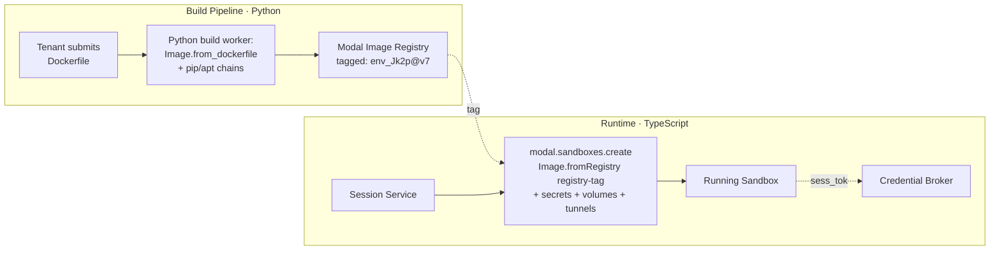

# 15 · Modal Sandbox Integration

How the spec's `Environment` + `Session` primitives map onto Modal sandboxes, and where to draw the line between the Modal TypeScript SDK (good enough for runtime) and Python (still needed for image building).

> Verified against `modal-labs/libmodal` via DeepWiki, April 2026. Status: Modal TS SDK is in beta, approaching feature parity. Sandbox runtime surface is production-ready; image building is the one real gap.

## 1 · TS SDK state, honestly

**Production-ready in TS** — safe to build the runtime path entirely on the TS SDK:
- `ModalClient` with token auth via env vars or constructor
- `sandboxes.create` with full `SandboxCreateParams` (cpu, memory, gpu, timeout, idleTimeout, env, secrets, volumes, tunnels, network blocking, cloud/region pinning)
- `sandbox.exec` with streaming stdout/stderr and `wait()` for exit code
- `sandbox.filesystem.read` / `sandbox.filesystem.write`
- `sandbox.snapshotFilesystem(path)` — creates snapshots
- `sandbox.tunnels()` — full multi-port tunnel support, returns URLs
- Volumes (`volumes.fromName({ createIfMissing: true })`) and Secrets (`secrets.fromName`, `secrets.fromObject`)
- Queues

**Not yet in TS** — do these in Python or work around:
- **Booting a new sandbox from a snapshot ID** — snapshots *create* works, but *restoring* from one isn't wired up yet. This is the biggest gap for a Ramp-Inspect-style fast-start architecture.
- **Image builder chain** — no `debian_slim().apt_install(...).pip_install(...)`. Only `fromRegistry()` + `.dockerfileCommands([...])`. Adequate but verbose.
- **Modal Dicts** (Queues are in; Dicts aren't)
- **Container lifecycle hooks**
- **Sandbox `.map()`** — no parallel batch API

**Will never be in TS (by design)** — Python-only:
- Defining Modal Functions (`@app.function`). Modal's team has explicitly said this stays Python-only.

**What this means for the platform:** you can run, control, and tear down sandboxes entirely from TS. You can't define Modal Functions from TS — but for a coding-agent platform you don't need them. Sandboxes + secrets + volumes + tunnels are the entire API surface.

## 2 · The build-vs-runtime split

A clean decomposition that matches the current SDK maturity:



**Build path is Python** — because `Image.debian_slim().apt_install().pip_install()` + layer caching + dependency resolution + build-time secrets is where Python's SDK shines and where TS hasn't caught up. This is a batch job, not a latency-sensitive path, so running it in Python via a Modal Function is fine.

**Runtime path is TypeScript** — because your `Session Service` (from [`03`](./03-sessions-api.md)) is a TS app, and you want sandbox orchestration in the same process as Better Auth, your SDK, and your event streaming. No cross-language bridge for the hot path.

## 3 · Authentication in a multi-tenant platform

Modal auth is workspace-scoped: one Modal token pair = one Modal workspace's quota and billing.

**Recommended setup** — one Modal workspace for the whole platform, sandboxes tagged per tenant:

```ts
import { ModalClient } from "modal";

// Single platform-wide Modal client. Tokens come from platform secrets,
// never touched by per-tenant code paths.
export const modal = new ModalClient({
  tokenId:     process.env.MODAL_TOKEN_ID!,
  tokenSecret: process.env.MODAL_TOKEN_SECRET!,
  environment: process.env.MODAL_ENV ?? "production",
});
```

**Do not pass per-tenant tokens to Modal.** The platform is the billing subject. Tenancy isolation is enforced by:
1. Tagging every sandbox with `org_id` in its `name` and `env`
2. Per-tenant Secrets (so one tenant's Anthropic key is never in another tenant's sandbox)
3. The egress proxy (platform-side, not Modal-side — see §6)
4. Modal quotas at the workspace level, platform-enforced per-tenant (see §9)

If you ever want tenant-owned Modal workspaces (BYO-compute), that's a Phase 7 concern — don't design for it now.

## 4 · `Environment` resource → Modal primitives

The `Environment` in [`02 §Environment`](./02-resources.md) maps one-to-one onto Modal primitives. Here's the full translation for the OmO-flavored env from [`14`](./14-omo-opencode-sandbox.md):

```ts
import { modal } from "~/lib/modal";
import type { Environment, SessionExec } from "~/lib/types";

export async function buildSandboxParams(
  exec: SessionExec,
  env: Environment,
  sessionToken: string,        // sess_tok_… from Better Auth apiKey plugin
) {
  const app = await modal.apps.fromName(
    `agent-${exec.organizationId}`,    // one App per tenant — just for namespacing
    { createIfMissing: true },
  );

  // env.image is our Environment resource; translate to Modal Image.
  let image;
  switch (env.image.kind) {
    case "platform":
      // Pre-built platform image, e.g. omo-runtime:2026-04
      image = modal.images.fromRegistry(env.image.ref);
      break;
    case "snapshot":
      // Pre-built tenant image from our build pipeline (§5).
      // env.image.ref = "registry.platform.internal/tenant_2fJx/payments:v7"
      image = modal.images.fromRegistry(env.image.ref, {
        secret: await modal.secrets.fromName("internal-registry-creds"),
      });
      break;
    case "dockerfile":
      // Fallback for small tenants — inline Dockerfile commands.
      image = modal.images
        .fromRegistry(env.image.base ?? "debian:bookworm-slim")
        .dockerfileCommands(env.image.commands);
      break;
  }

  // env.credentials (from 13 §8) resolves to Modal Secrets + direct env.
  const modalSecrets = await Promise.all(
    Object.entries(env.credentials ?? {}).map(async ([provider, binding]) => {
      if (binding.kind !== "bearer_secret") return null;
      // Bearer secrets are materialized into per-session Modal Secrets
      // at session-create time. They live only as long as the sandbox.
      const plaintext = await kms.decrypt(
        (await db.secret.findById(binding.secretId))!.encryptedValue,
      );
      return modal.secrets.fromObject({
        [providerToEnvVar(provider)]: plaintext,
      });
    }),
  ).then((xs) => xs.filter(Boolean));

  return {
    app,
    image,
    params: {
      name: `sess-${exec.id}`,          // tag for debuggability
      cpu:        env.resources.cpu,
      memory:     env.resources.memory_gb * 1024,
      timeout:    env.resources.timeout_sec * 1000,  // ms
      idleTimeout: 5 * 60 * 1000,        // kill if idle 5 min
      workdir:    env.workdir ?? "/workspace",
      command:    ["sleep", "infinity"],  // keep alive; we exec into it

      env: {
        // Platform-injected: the session token for broker calls.
        SESSION_TOKEN:       sessionToken,
        BROKER_URL:          `${process.env.BASE_URL}/broker`,
        PLATFORM_SESSION_ID: exec.id,
        PLATFORM_ORG_ID:     exec.organizationId,
      },
      secrets: modalSecrets,
      encryptedPorts: env.exposed_ports ?? [],   // for editor iframe (§7)

      // Volume for the tenant's workspace — persisted across sessions
      // in this workspace_id.
      volumes: env.persistent_volume
        ? {
            "/workspace": await modal.volumes.fromName(
              `ws-${exec.workspaceId}`,
              { createIfMissing: true },
            ),
          }
        : undefined,
    },
  };
}
```

**Three things worth calling out:**

1. **One Modal App per tenant org, not per session.** Apps are a namespace primitive in Modal; reusing one per tenant keeps sandbox listings in the Modal dashboard readable and avoids the overhead of `fromName({ createIfMissing: true })` creating new Apps on every request.

2. **Bearer secrets are materialized into fresh Modal Secrets per session.** The alternative — pre-creating Modal Secrets that hold plaintext tenant keys — leaves long-lived plaintext in Modal's storage. Minting per-session is a little slower but keeps plaintext scoped to one sandbox's lifetime.

3. **Volumes scoped to `workspace_id`, not `session_id`.** Matches the spec: workspaces are persistent (a "repo set"), sessions are ephemeral. The same volume mounts across every session in one workspace, giving you fast repeat runs.

## 5 · Build pipeline (Python side, ~50 lines)

Only Python-side code the platform runs. One Modal Function that takes a tenant's Dockerfile spec and outputs a registry tag.

```python
# modal_build_worker.py — deployed via `modal deploy`
import modal

app = modal.App("platform-image-builder")

@app.function(
    image=modal.Image.debian_slim().pip_install("docker"),
    secrets=[modal.Secret.from_name("internal-registry-creds")],
    timeout=30 * 60,  # 30 min for heavy builds
)
def build_environment_image(spec: dict) -> dict:
    """
    spec = {
      "org_id":        "org_2fJxKk9",
      "env_id":        "env_Jk2p",
      "version":       7,
      "base":          "debian:bookworm-slim",
      "dockerfile":    "...",        # or
      "chain": [                     # higher-level, Python-only
        {"op": "apt_install", "args": ["git", "curl"]},
        {"op": "pip_install", "args": ["requests"]},
        {"op": "run",         "args": ["echo 'ready' > /tmp/ok"]},
      ],
      "env":           {...},
      "workdir":       "/workspace",
    }
    """
    img = modal.Image.from_registry(spec["base"])

    for step in spec.get("chain", []):
        if step["op"] == "apt_install": img = img.apt_install(*step["args"])
        if step["op"] == "pip_install": img = img.pip_install(*step["args"])
        if step["op"] == "run":         img = img.run_commands(*step["args"])

    if "dockerfile" in spec:
        img = img.dockerfile_commands(spec["dockerfile"].splitlines())

    # Force a build and push to our internal registry.
    tag = f"registry.platform.internal/{spec['org_id']}/{spec['env_id']}:v{spec['version']}"
    img._push_to_registry(tag)   # hypothetical; use Modal's image export path

    return {
      "tag":       tag,
      "digest":    img._digest(),
      "built_at":  int(time.time()),
    }
```

Called from the TS side:

```ts
// When tenant POSTs a new environment version:
import { spawn } from "child_process";

async function buildEnvironmentVersion(envId: string, spec: BuildSpec) {
  // Invoke the Python build function via Modal's HTTP gateway.
  // Modal Functions expose .web() endpoints or we can shell out to
  // `modal run` from a background job queue.
  const res = await fetch(
    `https://${MODAL_WORKSPACE}.modal.run/build-environment-image`,
    {
      method: "POST",
      headers: { Authorization: `Bearer ${process.env.MODAL_TOKEN_ID}` },
      body: JSON.stringify(spec),
    },
  );
  const { tag, digest } = await res.json();

  await db.environmentVersion.create({
    environmentId: envId,
    version: spec.version,
    image: { kind: "snapshot", ref: tag, digest },
  });
}
```

This is the cross-language bridge — but it's a build-time bridge, not a request-time bridge. The hot path (create session → boot sandbox → stream events) never leaves TypeScript.

## 6 · Egress: Modal's `blockNetwork` + `cidrAllowlist` is not enough alone

Modal gives you `blockNetwork` (full deny) and `cidrAllowlist` (IP allowlist). That's a useful outer layer, but for the platform's per-tenant allowlist from [`05`](./05-environments.md) you want **hostname-based** rules, not IPs — because `api.anthropic.com` resolves to a rotating CloudFront pool.

**Two-layer model that works:**

```ts
params: {
  // Layer 1 — Modal network control. Block everything by default.
  blockNetwork: true,
  // Allowlist only the platform's own egress proxy.
  cidrAllowlist: [`${process.env.EGRESS_PROXY_CIDR}/32`],

  env: {
    // Layer 2 — in-sandbox egress. Force all HTTP(S) through our proxy,
    // which enforces hostname-level allowlists from env.egress.allowed_hosts.
    HTTP_PROXY:  `http://${process.env.EGRESS_PROXY_HOST}:3128`,
    HTTPS_PROXY: `http://${process.env.EGRESS_PROXY_HOST}:3128`,
    NO_PROXY:    "localhost,127.0.0.1",
  },
}
```

The egress proxy is a platform-owned service that reads the session's `environment.egress.allowed_hosts` and enforces per-request. Modal just ensures the sandbox can't bypass it by hitting arbitrary IPs.

## 7 · Hosted editor iframe — via Modal tunnels

The `urls.editor` field on [`Session`](./02-resources.md#session--sess_) maps onto a Modal tunnel. Expose a port from the sandbox, get a public HTTPS URL, embed in an iframe.

```ts
// After sandbox boot, inside a sidecar process in the sandbox,
// run something like code-server / openvscode-server on port 8443.

const sandbox = await modal.sandboxes.create(app, image, {
  ...params,
  encryptedPorts: [8443],      // TLS-terminated by Modal
});

const tunnels = await sandbox.tunnels();
const editorUrl = tunnels[8443].url;   // https://xxx-8443.modal.run

await db.session_exec.update(exec.id, {
  urls: {
    events_sse:  `${process.env.BASE_URL}/v1/.../events`,
    websocket:   `${process.env.BASE_URL}/v1/.../ws`,
    editor:      editorUrl,
  },
});
```

One wrinkle: Modal tunnel URLs are **publicly reachable** — anyone with the URL can connect. You need an auth check at the editor itself. The sandbox-side code-server should verify the user JWT (mounted as an env var or pulled via the broker on each connection) before accepting WebSocket traffic.

## 8 · Fast starts without snapshot-restore (yet)

Ramp's Inspect boots in seconds because they restore from a snapshot. That's blocked in TS for now. Three workarounds, in order of effort:

**A. Pre-built images with deps already installed** — use the Modal Image layer cache. Every tenant's `env_Jk2p@v7` is a fully-baked image; boot time is just the container start, not `pip install`. Gets you to 5–10s.

**B. Warm pool of idle sandboxes per tenant** — keep N sandboxes running per active tenant, hand one out on `POST /sessions`, boot a new one in the background. 1–2s perceived start. More expensive; only for paying tenants with active usage.

**C. Wait for TS snapshot-restore** — it's on Modal's roadmap. Until then, A+B cover the gap.

Concrete start code for option B:

```ts
// background worker — per tenant, keep 2 warm sandboxes
export async function maintainWarmPool(orgId: string, target = 2) {
  const warm = await db.warmSandbox.findMany({ organizationId: orgId, state: "idle" });

  for (let i = warm.length; i < target; i++) {
    const { app, image, params } = await buildSandboxParams(
      { organizationId: orgId, /* placeholder */ } as any,
      platformDefaultEnvironment,
      /*sessionToken*/ "pending",   // rebind on claim
    );
    const sb = await modal.sandboxes.create(app, image, params);
    await db.warmSandbox.create({
      organizationId: orgId,
      modalSandboxId: sb.id,
      state: "idle",
    });
  }
}

// on POST /sessions — try to claim a warm one first
export async function allocateSandbox(exec: SessionExec): Promise<Sandbox> {
  const warm = await db.warmSandbox.findFirstAndUpdate(
    { organizationId: exec.organizationId, state: "idle" },
    { state: "claimed", claimedFor: exec.id },
  );
  if (warm) {
    const sb = await modal.sandboxes.fromId(warm.modalSandboxId);
    // Inject the real session token + env via an exec call.
    await sb.exec(["sh", "-c", `export SESSION_TOKEN=${exec.sessionToken}`]);
    return sb;
  }
  // Cold path: build + boot from scratch.
  const { app, image, params } = await buildSandboxParams(exec, ...);
  return modal.sandboxes.create(app, image, params);
}
```

There's a catch: you can't cleanly inject a new env var into a running sandbox — `sb.exec` with `export` only affects that shell. Real solution is to pass the session token as the *first argument* to an agent bootstrap script that's already running and listening for it. Ramp's Inspect does something similar.

## 9 · Two-tier concurrency

OmO caps per-provider concurrency *inside* one sandbox ([`14 §8`](./14-omo-opencode-sandbox.md#8--concurrency)). Modal caps *across* sandboxes at workspace level. Neither is tenant-aware. You need:

```ts
// Before calling modal.sandboxes.create:
await assertTenantQuota(exec.organizationId, {
  concurrent_sessions:      tenant.limits.concurrent_sessions,
  monthly_compute_seconds:  tenant.limits.monthly_compute_seconds,
});
```

Read `concurrent_sessions` from a fast counter (Redis `INCR` with TTL, or a Postgres counter table with advisory locks). Decrement on `sandbox.terminate()` — including in error paths. This is the "noisy neighbor" prevention from [`08`](./08-quotas-and-errors.md).

## 10 · Lifecycle hooks the SDK doesn't give you

Modal doesn't emit platform-level lifecycle events for sandboxes — no "sandbox ended" webhook. Your session service has to poll or observe termination through its own exec path. Pattern that works:

```ts
// Spawn a supervising task per sandbox.
async function supervise(exec: SessionExec, sb: Sandbox) {
  try {
    await sb.wait();  // blocks until sandbox exits (timeout, terminate, OOM)
  } finally {
    await db.session_exec.update(exec.id, { status: "ended", endedAt: new Date() });
    await emitEvent(exec.id, { type: "session.succeeded" /* or failed */ });
    await kv.decr(`org:${exec.organizationId}:concurrent_sessions`);
  }
}
```

Run these supervisors in whatever actor system the session service uses — if you're on Rivet (from the project memory), one actor per session is the right mapping; the actor's lifetime == sandbox's lifetime.

## 11 · What changes in the spec

Three small additions, nothing breaking:

1. **`Environment.image.kind` gets a `"registry"` entry** — separate from `"platform"` and `"snapshot"` — for tenant-built images that live in the platform's internal registry. Currently [`02`](./02-resources.md) has `platform | dockerfile | snapshot`; `registry` clarifies the "tenant built via our Python pipeline, reference by tag" case.

2. **`Environment.exposed_ports: number[]`** — declares which ports get Modal tunnels at create time. Required for hosted editor support.

3. **`Environment.persistent_volume: boolean`** (or explicit `volume_name`) — declares whether a Modal Volume should be mounted at `/workspace` and persisted across sessions in this workspace.

## 12 · Three next steps

1. **Build the minimum viable sandbox boot in TS first.** `modal.sandboxes.create` with `fromRegistry("omo-runtime:2026-04")`, a few Secrets, a tunnel for the editor, and `sb.exec` to run a bootstrap script. ~100 lines of TS, no Python needed. Proves the runtime path before the build pipeline exists.

2. **Decide whether the build pipeline needs Python at all for MVP.** If tenants can only supply a base image + a `dockerfileCommands` array, you can do everything in TS via `Image.dockerfileCommands`. You lose the ergonomics of `.apt_install().pip_install()`, but you ship a TS-only platform. Revisit the Python build worker only when a customer asks for it.

3. **Validate tunnel auth before Phase 5 (client surfaces).** Modal tunnel URLs are public-by-default. Put a real auth check on the editor sidecar before any prospect sees the hosted-IDE feature — it's a one-click data exfiltration vector otherwise.

## Reflective question

The TS SDK's biggest gap right now is **snapshot-restore**. Without it, the best cold-start time is 5–10 seconds even with a warm image. With it, Ramp-Inspect-class 1–2 second starts are achievable.

**Is that 5–10 second cold start acceptable for the user experience you want?** Two different kinds of product hide behind that answer:

- If the primary surface is the Slack bot or CI integration (from [`10`](./10-client-patterns.md)), 10 seconds is invisible — the user is already context-switched.
- If the primary surface is the Chrome extension or web editor (from [`11`](./11-chrome-extension-plasmo.md)), 10 seconds is the difference between "feels instant" and "feels slow."

The answer probably determines whether you ship with the TS SDK as-is or invest in a warm pool from day one.
