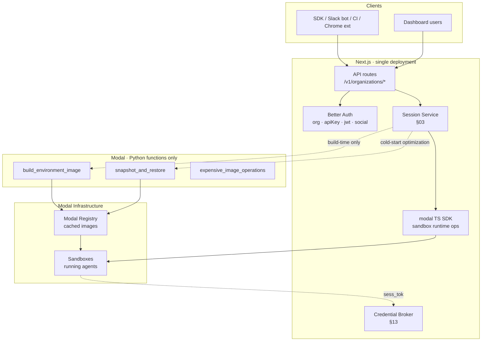

# 16 · Deployment Topology — Next.js + Modal Python (no FastAPI)

> **If you have an existing FastAPI codebase (e.g. omoi_os):** this document does not apply to you. See [`17-omoi-os-adaptation.md`](./17-omoi-os-adaptation.md) instead. This file is greenfield advice for someone with zero existing Python code.

**Decision:** Python exists in this system only as Modal Functions. There is no FastAPI service, no separate Python deployment, no language-boundary protocol to design. Next.js calls Modal Functions via HTTPS when (and only when) Python-specific Modal features are needed.

This document records the decision and its consequences.

## 1 · What was considered

| Pattern | Shape | Deployments | Verdict |
|---|---|---|---|
| FastAPI as public API | Next.js = dashboard, FastAPI = customer API | 2 | ❌ contradicts "Next.js owns public API" |
| FastAPI as internal sidecar | Next.js + FastAPI on localhost | 1–2 (depends on how you count) | ⚠️ overkill for Modal-only Python |
| **Modal Functions only** | **Next.js + Modal-hosted Python** | **1 (Next.js) + `modal deploy`** | **✅ chosen** |
| `child_process.spawn('python')` | Python runs inline in Next.js container | 1 | ❌ no concurrent execution, no cold-start isolation, hard to scale |

## 2 · Why Modal Functions win here

The decision is driven by three facts:

1. **Python is needed only for narrow Modal SDK features.** Snapshot-restore, `.apt_install().pip_install()` chains, `Image.debian_slim()` ergonomics, Modal Dicts, `sandbox.map()`. Everything else the platform does has a TypeScript path.
2. **Modal Functions *are* Python-as-a-service, operated by someone else.** You don't run the server, scale the server, patch the server, or pay for it when idle. You deploy Python code; Modal handles the rest.
3. **Modal has a TypeScript client that calls Python Functions typed.** The cross-language bridge is already solved — no hand-rolled REST contract.

A FastAPI sidecar for this use case would be building infrastructure Modal already provides for free.

## 3 · The call graph



**Two distinct paths:**

- **Hot path (every session):** Client → Next.js API route → Session Service → Modal TS SDK → running sandbox. Never touches Python.
- **Cold path (environment builds, snapshots):** Session Service → Modal Function (Python) → Modal Registry. Runs rarely, batch-style.

## 4 · What lives where

### Next.js (single deployment)

- **Everything public-facing** — REST endpoints, SDK surface, dashboard UI
- **Better Auth** and all its plugins (TS-only library)
- **Credential Broker** (from [`13 §8`](./13-better-auth-integration.md))
- **Session Service** — session lifecycle, event streaming (SSE/WS), ACL enforcement
- **Modal TS SDK calls** — `sandboxes.create`, `sandbox.exec`, `sandbox.filesystem.*`, `sandbox.tunnels()`, `sandbox.terminate()`, volumes, secrets
- **Egress proxy** (a separate Next.js route or a sidecar)
- **Webhook dispatcher**

### Modal Python Functions (deployed via `modal deploy`)

- **Environment image builder** — the Python Function from [`15 §5`](./15-modal-integration.md), with the full `Image.debian_slim().apt_install().pip_install()` chain. Invoked when a tenant creates or updates an `Environment`.
- **Snapshot management** — when TS SDK gets snapshot-restore later, this migrates to TS. For now: a Python function that takes a running sandbox's snapshot ID, creates a new sandbox from it, and returns the new sandbox ID to TS.
- **Anything else Python-only that appears later** — all goes in the `modal/` directory of the monorepo.

### Nowhere

- **No FastAPI.** Ever, unless a use case appears that (a) needs Python, (b) needs persistent state or long-lived sockets, and (c) doesn't fit Modal Functions. Revisit then, not now.

## 5 · Repository layout

```
platform/
├── apps/
│   └── web/                    # Next.js app (the deployment)
│       ├── app/
│       │   ├── api/            # public API routes
│       │   │   └── v1/
│       │   │       └── organizations/[org]/sessions/…
│       │   ├── (dashboard)/    # dashboard UI
│       │   └── auth/           # Better Auth handler
│       ├── lib/
│       │   ├── auth.ts         # Better Auth config (§13 §3)
│       │   ├── modal.ts        # ModalClient singleton
│       │   ├── broker.ts       # Credential Broker plugin
│       │   └── sandbox.ts      # buildSandboxParams from §15 §4
│       └── sdk/                # @platform/agent-sdk
├── modal/
│   ├── pyproject.toml
│   ├── build_environment.py    # @app.function for image builds
│   ├── snapshots.py            # @app.function for snapshot ops
│   └── deploy.py               # modal deploy entrypoint
└── packages/
    └── types/                  # shared TS types
```

One deploy target: `apps/web`. The `modal/` directory deploys separately via `modal deploy` — but it's not a *service you operate*, it's code you ship to Modal. They operate it.

## 6 · Calling a Modal Function from Next.js

Modal Functions are exposed as typed endpoints from the TS SDK:

```ts
// lib/modal-functions.ts
import { modal } from "./modal";

// Reference the deployed Python function by App + name.
const buildEnvImageFn = await modal.functions.lookup({
  app: "platform-image-builder",
  name: "build_environment_image",
});

export async function buildEnvironmentImage(spec: BuildSpec): Promise<BuiltImage> {
  // .call() is synchronous-over-RPC; for long-running builds use .spawn()
  // which returns a handle you can poll.
  const handle = await buildEnvImageFn.spawn(spec);

  // Poll or await — builds can take minutes.
  const result = await handle.get({ timeout: 30 * 60 * 1000 });

  return result as BuiltImage;
}
```

```ts
// app/api/v1/organizations/[org]/environments/route.ts
export async function POST(req: Request, { params }: Ctx) {
  const authCtx = await resolveAuth(req);
  await assertPermission(authCtx, { environment: ["create", "build"] });

  const body = await req.json();

  // Kick off the Python build, non-blocking.
  const handle = await buildEnvImageFn.spawn({
    org_id:  authCtx.orgId,
    env_id:  body.env_id,
    version: body.version,
    chain:   body.chain,
  });

  // Store the handle ID so we can poll status.
  const env = await db.environmentVersion.create({
    environmentId: body.env_id,
    version:       body.version,
    buildStatus:   "building",
    buildHandle:   handle.id,
  });

  return Response.json(env, { status: 202 });
}
```

Status polling runs as a background job — it reads `buildHandle`, calls `handle.get({ timeout: 0 })` to check readiness, updates `buildStatus` when done.

## 7 · Auth across the boundary

Modal Functions authenticate Modal-to-Modal. **Your Modal token is the platform's identity**, not the tenant's. The tenant never sees Modal. Tenant identity is carried as function arguments — `spec.org_id` is validated by the Python Function against its input, but the Python Function trusts Next.js to have authenticated the caller.

This is the right trust model for this architecture: **Next.js is the security boundary; Modal is the compute boundary.** They have different jobs.

```python
# modal/build_environment.py
@app.function(
    image=modal.Image.debian_slim().pip_install("docker"),
    secrets=[modal.Secret.from_name("internal-registry-creds")],
    timeout=30 * 60,
)
def build_environment_image(spec: dict) -> dict:
    # spec.org_id is trusted — Next.js already verified the caller
    # had permission to build for this org. We just namespace the output.
    tag = f"registry.platform.internal/{spec['org_id']}/{spec['env_id']}:v{spec['version']}"
    # … build, push, return …
```

If you ever want to be more paranoid — e.g. defense-in-depth against a compromised Next.js — you can have the Python Function verify a short-lived platform JWT in the spec. But for Phase 1 through Phase 5 ([`12`](./12-next-steps.md)), "Next.js is trusted" is the right security model, because anyone who can call Modal as the platform has already compromised your Next.js deployment and you have bigger problems.

## 8 · The monorepo question

One codebase. Turborepo or pnpm workspaces on the TS side; uv / poetry on the Python side. Shared types go in `packages/types` — but only data shapes, because Python and TS type systems don't share structural types. Use OpenAPI or JSON Schema as the source of truth if you want single-source typed contracts; otherwise just keep the Python signatures in Python and the TS types in TS and accept some duplication at the boundary (it's literally ~5 function signatures).

```bash
# Development
pnpm dev                 # starts Next.js
modal serve modal/deploy.py  # hot-reload Python functions in Modal's dev mode

# Deployment
pnpm deploy              # deploys Next.js to Vercel/Railway/Fly
modal deploy modal/deploy.py # deploys Python functions to Modal
```

These two deploys are independent. Python changes don't require Next.js redeploys and vice versa. That's actually a feature — your Modal Functions can be updated on a different cadence from your API.

## 9 · What breaks this architecture

Three scenarios where you'd revisit and add FastAPI:

1. **Long-lived Python state.** If you need a Python service that holds in-memory state across requests — a vector DB client with a warm connection pool, a loaded ML model, a stateful orchestrator — Modal Functions cold-start on every invocation (though they can stay warm). At high request rates, FastAPI wins.
2. **Python on the hot path.** If *every* session request needs to call Python, Modal Function RPC overhead (~100–300ms) becomes the platform's p50 latency. Today the hot path is 100% TS; that's not a risk.
3. **Python libraries on the public API surface.** If you want to expose, say, a `/v1/organizations/{org}/analyze` endpoint that uses pandas/sklearn, and you want that endpoint in the public SDK, then a Python web framework makes sense. Your answer ruled this out ("Next.js owns public API") so this doesn't apply.

None of these are current needs. Revisit if they appear.

## 10 · What changes in earlier docs

Minor edits to align:

- [`15 §5`](./15-modal-integration.md) already sketches the Python build worker — it's accurate, just rename "build pipeline runs in Python" to "build pipeline runs as Modal Functions."
- [`12`](./12-next-steps.md) Phase 4 step 14 ("environment versioning + build pipeline") gets a clarification: the build worker is a Modal Function, not a FastAPI endpoint, not a Celery task.
- No schema changes in [`02`](./02-resources.md) — the `Environment` resource is unaffected.
- No changes to [`13`](./13-better-auth-integration.md) — Better Auth, Broker, RBAC all stay in Next.js exactly as designed.

## 11 · Three next steps

1. **Set up the `modal/` directory with one stub Function.** `@app.function def ping(): return {"ok": True}`. Deploy it, call it from a Next.js route via `modal.functions.lookup().call({})`. Verify the whole loop works before you build the real image-build worker. ~30 minutes of work; de-risks the entire cross-language decision.

2. **Decide the Python dependency manager.** uv is the fast modern choice; poetry is the incumbent. Modal supports both. Pick one and stick to it — switching later is annoying because Modal caches lockfiles into images.

3. **Document the "when to add FastAPI" tripwire.** Add to `12-next-steps.md` the three scenarios from §9 above as explicit revisit triggers. Easier to add FastAPI later with clear reasoning than to remove it once someone's built on it.

## Reflective question

Modal Functions are, ergonomically, *extremely* close to FastAPI routes. Both are decorated Python functions that take input and return output; both are called over HTTPS. The difference is who runs the server.

**If you find yourself reaching for FastAPI six months from now, will it be because you hit one of the three real limits in §9 — or because you want local development ergonomics that Modal Functions don't give you?**

That second reason is a legitimate complaint but a solvable one (`modal serve` is decent; `modal run` for one-offs is fine). Worth noticing the difference between "Modal Functions don't fit this workload" and "I want to write FastAPI instead of Modal Functions." The second is a preference, not a requirement, and it's the one most likely to cost you a deployment surface you don't need.
