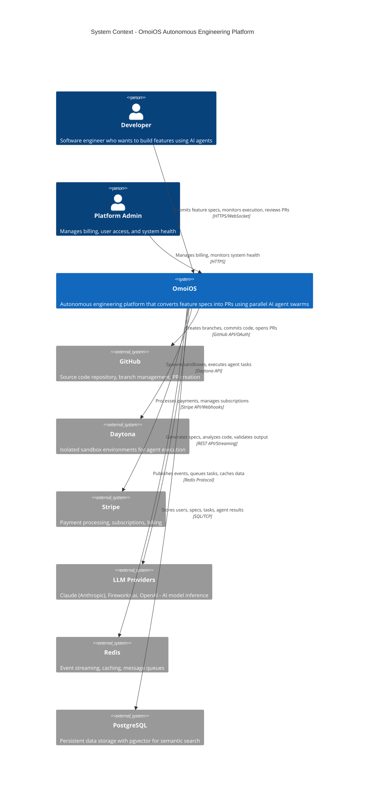
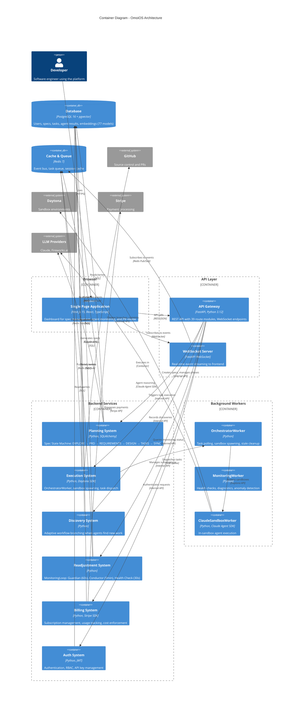
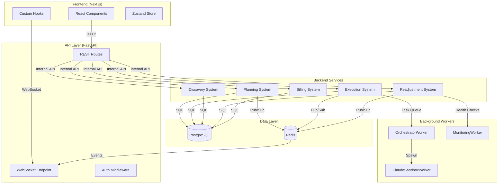
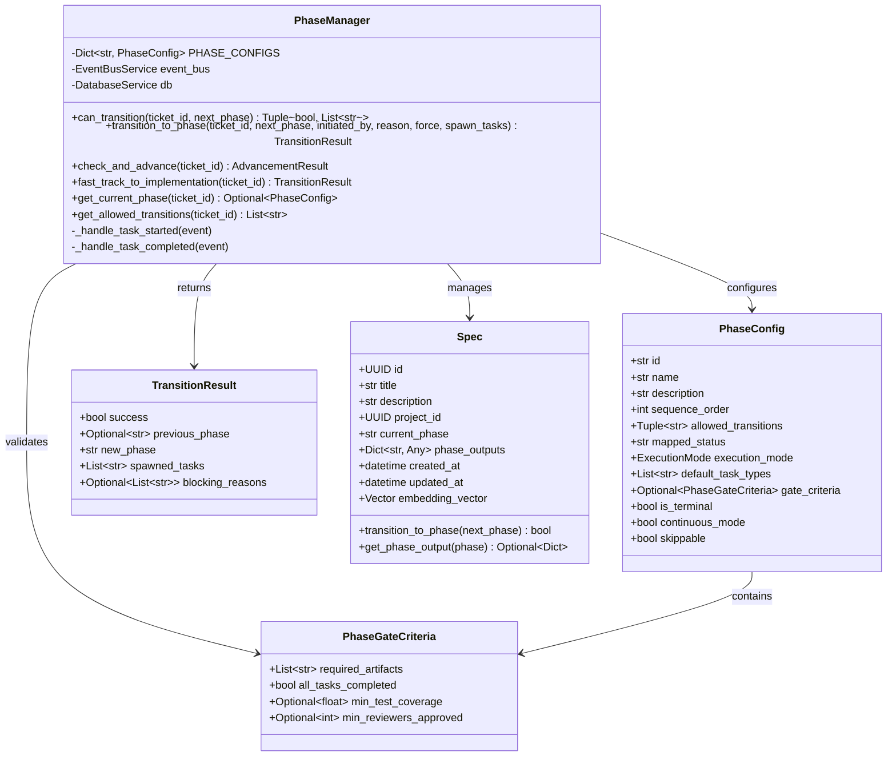
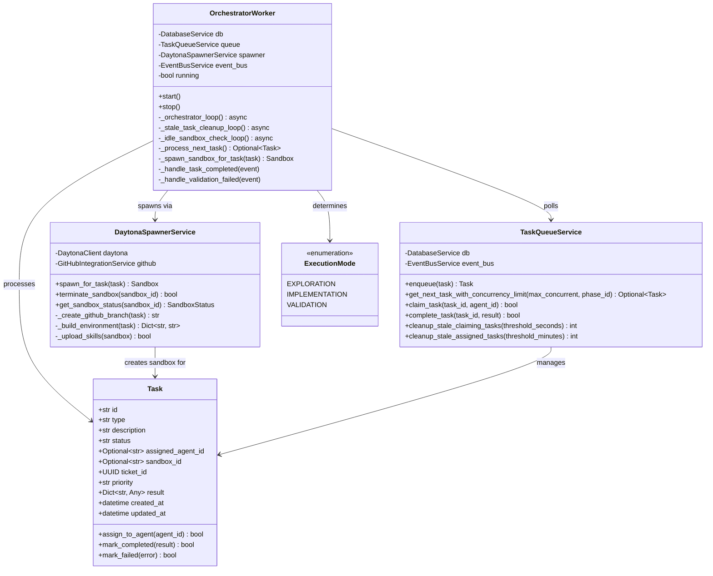
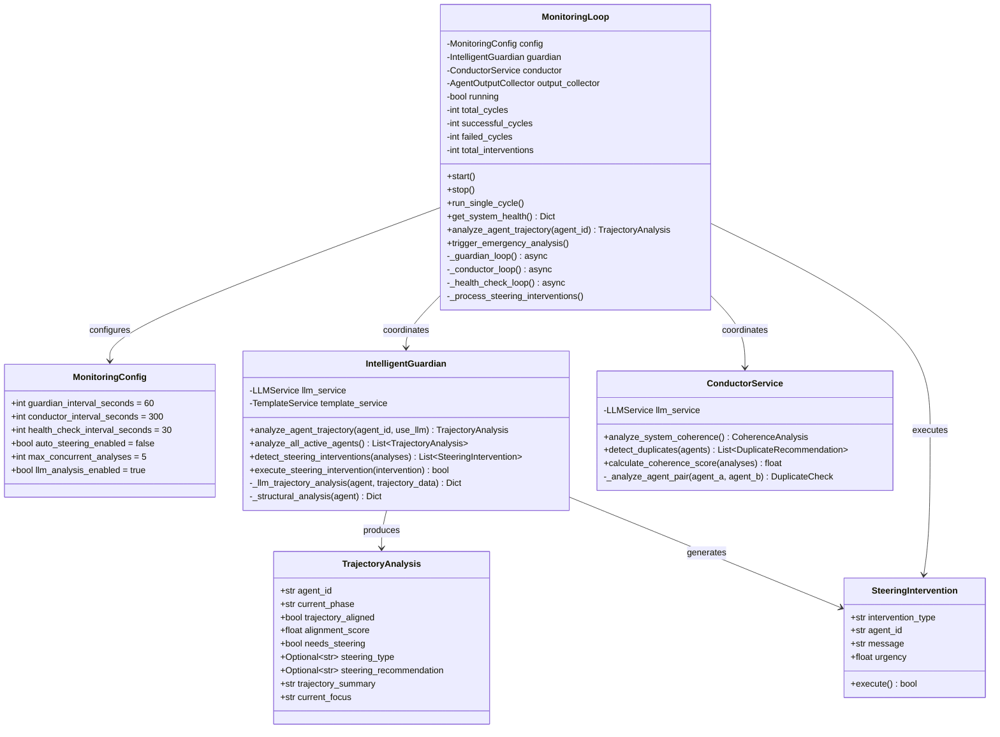
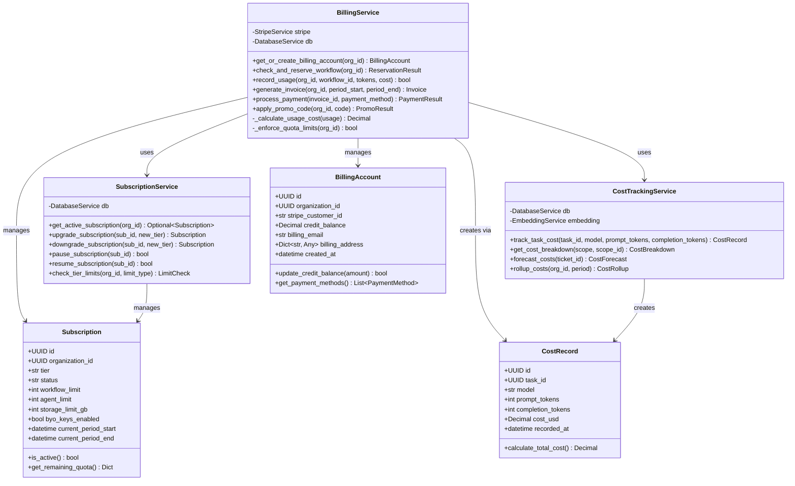
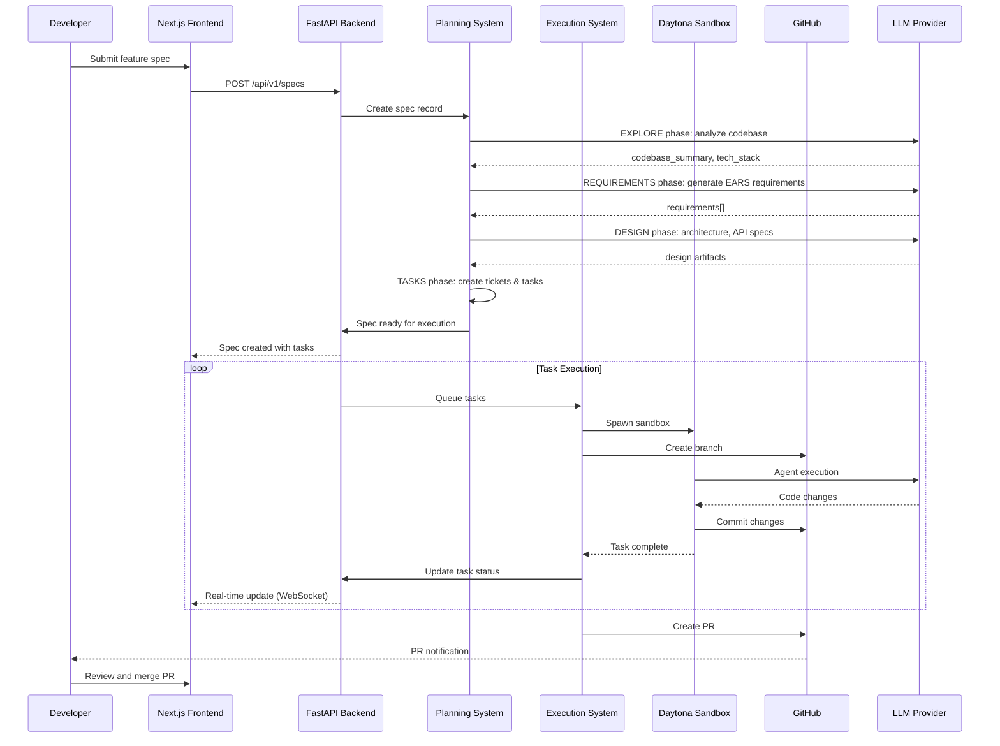
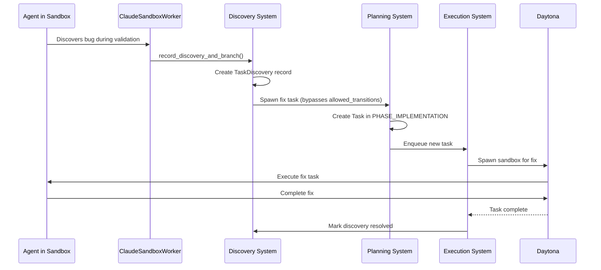

# OmoiOS C4 Model Architecture

> **Document Type**: C4 Architecture Model  
> **Scope**: Complete system architecture from context to code  
> **Target Audience**: Architects, developers, and technical stakeholders  
> **Related Docs**: **ARCHITECTURE.md**, [01-planning-system.md](01-planning-system.md), [02-execution-system.md](02-execution-system.md)

---

## Overview

This document presents the OmoiOS architecture using the [C4 Model](https://c4model.com/) — a hierarchical approach to visualizing software architecture through four levels:

1. **System Context** — How OmoiOS fits into the broader ecosystem
2. **Container** — High-level technology choices and their interactions
3. **Component** — Internal structure of each container
4. **Code** — Selected code-level details for critical classes

Each level provides increasing detail, allowing different stakeholders to understand the system at the appropriate depth.

---

## Level 1: System Context

### Purpose

The System Context diagram shows OmoiOS as a black box and its relationships with external actors and systems. This level answers: "What is OmoiOS, and who uses it?"

### Context Diagram



### External Systems Detail

| System | Technology | Purpose | Integration Point |
|--------|------------|---------|-------------------|
| **GitHub** | GitHub REST API, Git operations | Source control, branch management, PR workflows | `backend/omoi_os/services/github_integration.py` |
| **Daytona** | Daytona API, Docker containers | Isolated sandbox execution environments | `backend/omoi_os/services/daytona_spawner.py` |
| **Stripe** | Stripe API, Webhooks | Payment processing, subscription management | `backend/omoi_os/services/stripe_service.py` |
| **LLM Providers** | Claude Agent SDK, Fireworks.ai | AI model inference for spec generation and validation | `backend/omoi_os/services/llm_service.py` |
| **PostgreSQL** | PostgreSQL 16 + pgvector | Persistent storage with vector search capabilities | SQLAlchemy 2.0 async ORM |
| **Redis** | Redis 7 | Event bus, task queue, caching | `backend/omoi_os/services/event_bus.py` |

### Key User Journeys

1. **Developer submits feature**: Developer → OmoiOS → LLM Providers (spec generation) → Daytona (execution) → GitHub (PR)
2. **Agent execution**: OmoiOS → Daytona (sandbox) → LLM Providers (reasoning) → GitHub (commits)
3. **Billing flow**: Developer → OmoiOS → Stripe (payment) → OmoiOS (quota enforcement)

---

## Level 2: Container Diagram

### Purpose

The Container diagram shows the high-level technology stack and how containers (applications/data stores) interact. This level answers: "What are the major building blocks of OmoiOS?"

### Container Architecture



### Container Descriptions

| Container | Technology | Responsibility | Key Files |
|-----------|------------|----------------|-----------|
| **Single Page Application** | Next.js 15, React, TypeScript, Tailwind CSS | Dashboard UI for spec management, agent monitoring, Kanban board, dependency graphs | `frontend/app/`, `frontend/components/` |
| **API Gateway** | FastAPI, Python 3.12 | REST API with 39 route modules, request validation, auth middleware | `backend/omoi_os/api/main.py`, `backend/omoi_os/api/routes/` |
| **WebSocket Server** | FastAPI WebSocket | Real-time event streaming to frontend clients | `backend/omoi_os/api/routes/events.py` |
| **Planning System** | Python, SQLAlchemy 2.0 | Spec State Machine with 7 phases (EXPLORE → SYNC), phase evaluators | `backend/omoi_os/services/phase_manager.py` |
| **Execution System** | Python, Daytona SDK | Task dispatch, sandbox lifecycle management, task context building | `backend/omoi_os/workers/orchestrator_worker.py` |
| **Discovery System** | Python | Adaptive workflow branching, Hephaestus pattern for phase bypass | `backend/omoi_os/services/discovery.py` |
| **Readjustment System** | Python | Active monitoring: Guardian (trajectory analysis), Conductor (coherence) | `backend/omoi_os/services/monitoring_loop.py` |
| **Billing System** | Python, Stripe SDK | Subscription tiers, usage tracking, cost enforcement, dunning | `backend/omoi_os/services/billing_service.py` |
| **Auth System** | Python, JWT, bcrypt | User authentication, RBAC, API key management | `backend/omoi_os/services/auth_service.py` |
| **OrchestratorWorker** | Python | Background worker for task polling and sandbox spawning | `backend/omoi_os/workers/orchestrator_worker.py` |
| **MonitoringWorker** | Python | Background worker for health checks and diagnostics | `backend/omoi_os/workers/monitoring_worker.py` |
| **ClaudeSandboxWorker** | Python, Claude Agent SDK | In-sandbox agent execution with event reporting | `backend/omoi_os/workers/claude_sandbox_worker.py` |
| **Database** | PostgreSQL 16 + pgvector | Persistent storage with 77 model classes, vector embeddings | `backend/omoi_os/models/` |
| **Cache & Queue** | Redis 7 | Event bus (pub/sub), task queue, caching layer | `backend/omoi_os/services/event_bus.py` |

### Inter-Container Communication



---

## Level 3: Component Diagrams

### Purpose

The Component diagrams show the internal structure of each container. This level answers: "How is each container organized internally?"

### 3.1 Frontend Components (Next.js)

```mermaid
C4Component
    title Component Diagram - Frontend (Next.js 15)

    Container_Boundary(frontend, "Frontend Container") {
        Component(appRouter, "App Router", "Next.js 15 App Router", "Route groups: (app), (auth), (dashboard)")
        
        Component_Boundary(routeGroups, "Route Groups") {
            Component(appRoutes, "(app) Routes", "41 pages", "Authenticated routes: command, projects, specs, agents")
            Component(authRoutes, "(auth) Routes", "6 pages", "Login, register, OAuth, verification")
            Component(dashboardRoutes, "(dashboard)", "1 page", "Root redirect to /command")
        }
        
        Component_Boundary(components, "Components") {
            Component(uiComponents, "UI Components", "ShadCN UI (40+)", "Button, Card, Dialog, DataTable, etc.")
            Component(layoutComponents, "Layout Components", "Custom", "MainLayout, IconRail, ContextualPanel, Sidebar")
            Component(featureComponents, "Feature Components", "Domain-specific", "KanbanBoard, DependencyGraph, AgentMonitor")
        }
        
        Component_Boundary(hooks, "Custom Hooks (30)") {
            Component(dataHooks, "Data Hooks", "React Query", "useProjects, useTickets, useTasks, useSpecs")
            Component(realtimeHooks, "Real-Time Hooks", "WebSocket", "useEvents, useEntityEvents, useMonitor")
            Component(featureHooks, "Feature Hooks", "Custom", "useAuth, useSandbox, useBilling, useExplore")
        }
        
        Component_Boundary(state, "State Management") {
            Component(zustand, "Zustand Store", "Client State", "UI preferences, sidebar state, theme")
            Component(reactQuery, "React Query", "Server State", "API data caching, mutations, invalidation")
        }
        
        Component(apiClient, "API Client", "TypeScript", "HTTP client with typed endpoints")
        Component(webSocketClient, "WebSocket Client", "TypeScript", "Real-time event subscription")
    }
    
    Container(apiGateway, "API Gateway", "FastAPI", "REST API")
    Container(wsServer, "WebSocket Server", "FastAPI", "Event streaming")
    
    Rel(appRouter, appRoutes, "Routes to")
    Rel(appRouter, authRoutes, "Routes to")
    Rel(appRouter, dashboardRoutes, "Routes to")
    
    Rel(appRoutes, layoutComponents, "Uses")
    Rel(appRoutes, featureComponents, "Uses")
    Rel(appRoutes, uiComponents, "Uses")
    
    Rel(featureComponents, dataHooks, "Uses")
    Rel(featureComponents, realtimeHooks, "Uses")
    
    Rel(dataHooks, reactQuery, "Uses")
    Rel(dataHooks, apiClient, "Calls")
    Rel(realtimeHooks, webSocketClient, "Uses")
    
    Rel(apiClient, apiGateway, "HTTP", "REST/JSON")
    Rel(webSocketClient, wsServer, "WebSocket", "WSS")
    
    UpdateLayoutConfig($c4ShapeInRow="3", $c4BoundaryInRow="2")
```

### 3.2 Backend API Components (FastAPI)

```mermaid
C4Component
    title Component Diagram - Backend API (FastAPI)

    Container_Boundary(backend, "Backend API Container") {
        Component(middleware, "Middleware Stack", "FastAPI", "CORS, Rate Limiting, Logging, Security Headers")
        
        Component_Boundary(routes, "Route Modules (39)") {
            Component(coreRoutes, "Core Routes", "8 modules", "auth, users, organizations, projects, specs, tickets, tasks")
            Component(workflowRoutes, "Workflow Routes", "6 modules", "phases, board, graph, results, branch_workflow, collaboration")
            Component(agentRoutes, "Agent Routes", "2 modules", "agents, sandbox")
            Component(monitorRoutes, "Monitoring Routes", "7 modules", "monitor, guardian, watchdog, diagnostic, quality, validation, alerts")
            Component(vcsRoutes, "VCS Routes", "3 modules", "commits, github, github_repos")
            Component(infraRoutes, "Infrastructure", "5 modules", "events, mcp, memory, reasoning, explore")
            Component(billingRoutes, "Billing Routes", "4 modules", "billing, costs, onboarding, analytics")
        }
        
        Component_Boundary(services, "Service Layer (94 services)") {
            Component(planningServices, "Planning Services", "PhaseManager, PhaseGateService", "Spec state machine, phase transitions")
            Component(executionServices, "Execution Services", "DaytonaSpawner, TaskQueueService", "Sandbox lifecycle, task dispatch")
            Component(monitorServices, "Monitoring Services", "MonitoringLoop, IntelligentGuardian, ConductorService", "Trajectory analysis, coherence")
            Component(billingServices, "Billing Services", "BillingService, SubscriptionService, CostTrackingService", "Payments, quotas, costs")
            Component(authServices, "Auth Services", "AuthService, AuthorizationService", "JWT, RBAC, API keys")
            Component(eventServices, "Event Services", "EventBusService", "Redis pub/sub event system")
        }
        
        Component_Boundary(models, "Data Layer") {
            Component(sqlalchemy, "SQLAlchemy Models", "77 model classes", "User, Spec, Ticket, Task, Agent, etc.")
            Component(alembic, "Alembic Migrations", "73 migrations", "Database schema versioning")
        }
        
        Component(dependencies, "Dependencies", "FastAPI Depends", "get_current_user, get_db_service, etc.")
    }
    
    ContainerDb(database, "Database", "PostgreSQL", "Persistent storage")
    ContainerDb(redis, "Redis", "Redis 7", "Event bus, caching")
    
    Rel(middleware, coreRoutes, "Processes")
    Rel(middleware, workflowRoutes, "Processes")
    
    Rel(coreRoutes, dependencies, "Uses")
    Rel(coreRoutes, planningServices, "Calls")
    Rel(coreRoutes, authServices, "Calls")
    
    Rel(workflowRoutes, planningServices, "Calls")
    Rel(agentRoutes, executionServices, "Calls")
    Rel(monitorRoutes, monitorServices, "Calls")
    Rel(billingRoutes, billingServices, "Calls")
    
    Rel(planningServices, sqlalchemy, "Uses")
    Rel(executionServices, sqlalchemy, "Uses")
    Rel(monitorServices, sqlalchemy, "Uses")
    Rel(billingServices, sqlalchemy, "Uses")
    
    Rel(eventServices, redis, "Pub/Sub")
    Rel(sqlalchemy, database, "SQL")
    
    UpdateLayoutConfig($c4ShapeInRow="3", $c4BoundaryInRow="2")
```

### 3.3 Execution System Components

```mermaid
C4Component
    title Component Diagram - Execution System

    Container_Boundary(execution, "Execution System Container") {
        Component(orchestrator, "OrchestratorWorker", "Background Worker", "Task polling, sandbox spawning, cleanup loops")
        
        Component_Boundary(loops, "Background Loops") {
            Component(orchestratorLoop, "orchestrator_loop", "5s interval", "Poll tasks, spawn sandboxes")
            Component(staleTaskLoop, "stale_task_cleanup_loop", "15s interval", "Clean orphaned tasks")
            Component(idleSandboxLoop, "idle_sandbox_check_loop", "30s interval", "Terminate idle sandboxes")
        }
        
        Component(daytonaSpawner, "DaytonaSpawnerService", "Service", "Sandbox lifecycle, credentials, branch creation")
        Component(taskQueue, "TaskQueueService", "Service", "Priority-based task assignment")
        Component(contextBuilder, "TaskContextBuilder", "Service", "Full context assembly for task execution")
        
        Component_Boundary(sandboxWorkers, "In-Sandbox Workers") {
            Component(claudeWorker, "ClaudeSandboxWorker", "Python", "Main agent execution with Claude Agent SDK")
            Component(continuousWorker, "ContinuousSandboxWorker", "Python", "Iterative execution until completion")
            Component(eventReporter, "EventReporter", "Component", "HTTP POST events to backend")
            Component(messagePoller, "MessagePoller", "Component", "Poll for Guardian interventions")
            Component(fileTracker, "FileChangeTracker", "Component", "Unified diff tracking")
        }
        
        Component(idleMonitor, "IdleSandboxMonitor", "Service", "Detect idle/stuck sandboxes")
    }
    
    System_Ext(daytona, "Daytona", "Sandbox Provider")
    ContainerDb(redis, "Redis", "Task Queue", "Task assignments")
    ContainerDb(postgres, "PostgreSQL", "Task/Sandbox State", "Execution records")
    
    Rel(orchestrator, orchestratorLoop, "Runs")
    Rel(orchestrator, staleTaskLoop, "Runs")
    Rel(orchestrator, idleSandboxLoop, "Runs")
    
    Rel(orchestratorLoop, taskQueue, "Polls")
    Rel(orchestratorLoop, daytonaSpawner, "Spawns via")
    
    Rel(daytonaSpawner, claudeWorker, "Creates in")
    Rel(daytonaSpawner, daytona, "Uses")
    
    Rel(claudeWorker, eventReporter, "Uses")
    Rel(claudeWorker, messagePoller, "Uses")
    Rel(claudeWorker, fileTracker, "Uses")
    
    Rel(idleSandboxLoop, idleMonitor, "Uses")
    Rel(idleMonitor, daytona, "Terminates")
    
    Rel(taskQueue, redis, "Uses")
    Rel(orchestrator, postgres, "Updates")
    
    UpdateLayoutConfig($c4ShapeInRow="3", $c4BoundaryInRow="2")
```

### 3.4 Readjustment System Components

```mermaid
C4Component
    title Component Diagram - Readjustment System

    Container_Boundary(readjustment, "Readjustment System Container") {
        Component(monitoringLoop, "MonitoringLoop", "Orchestrator", "Coordinates Guardian, Conductor, Health Check")
        
        Component_Boundary(guardianLoop, "Guardian Loop (60s)") {
            Component(intelligentGuardian, "IntelligentGuardian", "Service", "LLM-powered trajectory analysis")
            Component(trajectoryAnalyzer, "TrajectoryAnalyzer", "Component", "Agent conversation analysis")
            Component(steeringDetector, "SteeringDetector", "Component", "Detect need for intervention")
            Component(interventionExecutor, "InterventionExecutor", "Component", "Execute redirect/refocus/stop")
        }
        
        Component_Boundary(conductorLoop, "Conductor Loop (5min)") {
            Component(conductorService, "ConductorService", "Service", "System coherence analysis")
            Component(coherenceCalculator, "CoherenceCalculator", "Component", "Calculate system-wide coherence score")
            Component(duplicateDetector, "DuplicateDetector", "Component", "Detect duplicate work across agents")
            Component(recommendationEngine, "RecommendationEngine", "Component", "Generate coordination recommendations")
        }
        
        Component_Boundary(healthLoop, "Health Check Loop (30s)") {
            Component(healthChecker, "HealthChecker", "Component", "Check system health metrics")
            Component(alertPublisher, "AlertPublisher", "Component", "Publish critical state alerts")
        }
        
        Component(agentRegistry, "AgentRegistryService", "Service", "Agent CRUD and capability tracking")
        Component(eventBus, "EventBusService", "Service", "Publish monitoring events")
    }
    
    Container(sandboxWorker, "ClaudeSandboxWorker", "Agent", "Agent being monitored")
    ContainerDb(database, "Database", "Agent State", "Trajectory data, analysis results")
    
    Rel(monitoringLoop, intelligentGuardian, "Coordinates")
    Rel(monitoringLoop, conductorService, "Coordinates")
    Rel(monitoringLoop, healthChecker, "Coordinates")
    
    Rel(intelligentGuardian, trajectoryAnalyzer, "Uses")
    Rel(intelligentGuardian, steeringDetector, "Uses")
    Rel(intelligentGuardian, interventionExecutor, "Uses")
    
    Rel(conductorService, coherenceCalculator, "Uses")
    Rel(conductorService, duplicateDetector, "Uses")
    Rel(conductorService, recommendationEngine, "Uses")
    
    Rel(intelligentGuardian, agentRegistry, "Queries")
    Rel(intelligentGuardian, database, "Reads/Writes")
    Rel(conductorService, database, "Reads")
    
    Rel(interventionExecutor, sandboxWorker, "Sends messages to")
    Rel(monitoringLoop, eventBus, "Publishes to")
    
    UpdateLayoutConfig($c4ShapeInRow="3", $c4BoundaryInRow="2")
```

### 3.5 Planning System Components

```mermaid
C4Component
    title Component Diagram - Planning System

    Container_Boundary(planning, "Planning System Container") {
        Component(phaseManager, "PhaseManager", "Service", "Central phase orchestration (1,258 lines)")
        
        Component_Boundary(stateMachine, "Spec State Machine") {
            Component(explorePhase, "EXPLORE Phase", "Phase", "Codebase analysis, discovery questions")
            Component(prdPhase, "PRD Phase", "Phase", "Product Requirements Document")
            Component(requirementsPhase, "REQUIREMENTS Phase", "Phase", "EARS-format requirements")
            Component(designPhase, "DESIGN Phase", "Phase", "Architecture, API specs, data models")
            Component(tasksPhase, "TASKS Phase", "Phase", "Tickets (TKT-NNN) and Tasks (TSK-NNN)")
            Component(syncPhase, "SYNC Phase", "Phase", "Validation and traceability")
        }
        
        Component_Boundary(evaluators, "Phase Evaluators") {
            Component(phaseEvaluator, "PhaseEvaluator", "Base", "Generic phase quality scoring")
            Component(requirementsEvaluator, "RequirementsEvaluator", "Specialized", "EARS format validation")
            Component(designEvaluator, "DesignEvaluator", "Specialized", "Architecture completeness")
        }
        
        Component(httpReporter, "HTTPReporter", "Service", "Event streaming for phase outputs")
        Component(phaseProgression, "PhaseProgressionService", "Service", "Automatic ticket advancement")
        Component(specSync, "SpecSyncService", "Service", "Phase data sync with deduplication")
    }
    
    Container(llmService, "LLMService", "AI", "Structured output generation")
    ContainerDb(database, "Database", "Spec State", "Specs, phases, requirements, tasks")
    Container(eventBus, "EventBus", "Redis", "Phase transition events")
    
    Rel(phaseManager, explorePhase, "Manages")
    Rel(phaseManager, prdPhase, "Manages")
    Rel(phaseManager, requirementsPhase, "Manages")
    Rel(phaseManager, designPhase, "Manages")
    Rel(phaseManager, tasksPhase, "Manages")
    Rel(phaseManager, syncPhase, "Manages")
    
    Rel(explorePhase, phaseEvaluator, "Evaluated by")
    Rel(requirementsPhase, requirementsEvaluator, "Evaluated by")
    Rel(designPhase, designEvaluator, "Evaluated by")
    
    Rel(phaseEvaluator, llmService, "Uses")
    Rel(requirementsEvaluator, llmService, "Uses")
    
    Rel(phaseManager, httpReporter, "Uses")
    Rel(phaseManager, phaseProgression, "Uses")
    Rel(phaseManager, specSync, "Uses")
    Rel(phaseManager, database, "Persists to")
    Rel(phaseManager, eventBus, "Publishes to")
    
    UpdateLayoutConfig($c4ShapeInRow="3", $c4BoundaryInRow="2")
```

---

## Level 4: Code Diagrams (Selected)

### Purpose

The Code level shows selected implementation details for critical classes. This level answers: "How do the key classes work internally?"

### 4.1 SpecStateMachine - Core Planning Logic



**Key Design Decisions:**

1. **PhaseConfig dataclass**: Immutable configuration for each phase, enabling type-safe phase definitions
2. **Allowed transitions**: Explicit state machine transitions prevent invalid phase jumps (except Discovery bypass)
3. **Gate criteria**: Configurable exit requirements ensure quality before progression
4. **Event-driven**: PhaseManager subscribes to task events for automatic advancement

### 4.2 OrchestratorWorker - Task Execution Engine



**Key Design Decisions:**

1. **Three execution modes**: Exploration (read-only), Implementation (full access), Validation (test execution)
2. **Concurrency limits**: `MAX_CONCURRENT_TASKS_PER_PROJECT=5` prevents resource exhaustion
3. **Stale task cleanup**: Automatic cleanup of orphaned tasks prevents queue blockage
4. **GitHub branch creation**: Branches created BEFORE sandbox spawning prevents conflicts

### 4.3 MonitoringLoop - Active Supervision



**Key Design Decisions:**

1. **Three time scales**: Guardian (60s per-agent), Conductor (5min system-wide), Health Check (30s)
2. **LLM-powered analysis**: Uses structured output for type-safe trajectory scoring
3. **Three intervention types**: Redirect (new direction), Refocus (scope reminder), Stop (terminate)
4. **Auto-steering disabled by default**: Human approval required for interventions

### 4.4 BillingService - Subscription Management



**Key Design Decisions:**

1. **Reservation pattern**: `check_and_reserve_workflow()` prevents over-consumption during parallel execution
2. **Tier-based limits**: Free/Pro/Team/Enterprise/Lifetime tiers with configurable quotas
3. **BYO Keys**: Pro+ tiers can use their own API keys for cost savings
4. **Automated dunning**: 3 retries (24h, 72h, 72h) before account suspension

---

## Data Flow Examples

### Complete Spec-to-PR Flow



### Discovery and Adaptive Branching



---

## Cross-Reference to Architecture Deep-Dives

| C4 Level | Component | Detailed Documentation |
|----------|-----------|------------------------|
| **System Context** | Planning System | [01-planning-system.md](01-planning-system.md) |
| **System Context** | Execution System | [02-execution-system.md](02-execution-system.md) |
| **System Context** | Discovery System | [03-discovery-system.md](03-discovery-system.md) |
| **System Context** | Readjustment System | [04-readjustment-system.md](04-readjustment-system.md) |
| **Container** | Frontend | [05-frontend-architecture.md](05-frontend-architecture.md) |
| **Container** | Event System | [06-realtime-events.md](06-realtime-events.md) |
| **Container** | Auth System | [07-auth-and-security.md](07-auth-and-security.md) |
| **Container** | Billing System | [08-billing-and-subscriptions.md](08-billing-and-subscriptions.md) |
| **Container** | Database | [11-database-schema.md](11-database-schema.md) |
| **Container** | API Routes | [13-api-route-catalog.md](13-api-route-catalog.md) |
| **Component** | All Services | [16-service-catalog.md](16-service-catalog.md) |

---

## Technology Stack Summary

| Layer | Technology | Version | Purpose |
|-------|------------|---------|---------|
| **Frontend** | Next.js | 15.x | React framework with App Router |
| **Frontend** | React | 18.x | UI library |
| **Frontend** | TypeScript | 5.x | Type safety |
| **Frontend** | Tailwind CSS | 3.x | Styling |
| **Frontend** | ShadCN UI | Latest | Component library |
| **Frontend** | React Query | 5.x | Server state management |
| **Frontend** | Zustand | 4.x | Client state management |
| **Backend** | Python | 3.12+ | Primary language |
| **Backend** | FastAPI | 0.104+ | API framework |
| **Backend** | SQLAlchemy | 2.0+ | ORM |
| **Backend** | Pydantic | 2.x | Data validation |
| **Backend** | Celery/Taskiq | Latest | Background tasks |
| **Database** | PostgreSQL | 16 | Primary database |
| **Database** | pgvector | Latest | Vector search |
| **Cache** | Redis | 7 | Event bus, caching |
| **External** | Daytona | API | Sandbox environments |
| **External** | GitHub | API | Source control |
| **External** | Stripe | API | Payments |
| **External** | Claude | Agent SDK | AI reasoning |
| **External** | Fireworks.ai | API | Embeddings, LLM |

---

## Glossary

| Term | Definition |
|------|------------|
| **Spec** | Feature specification progressing through EXPLORE → SYNC phases |
| **Ticket** | Work grouping (TKT-NNN) containing multiple tasks |
| **Task** | Atomic work unit (TSK-NNN) executable by an agent |
| **Phase** | Stage in spec workflow (EXPLORE, PRD, REQUIREMENTS, DESIGN, TASKS, SYNC) |
| **Discovery** | New work found during execution that spawns branch tasks |
| **Trajectory** | Agent's conversation and tool usage history |
| **Alignment** | How well an agent's trajectory matches its goal (0.0-1.0) |
| **Coherence** | System-wide measure of agent coordination |
| **Hephaestus Pattern** | Discovery-based branching that bypasses normal phase transitions |
| **EARS** | Easy Approach to Requirements Syntax (WHEN/SHALL format) |

---

*This C4 Model provides a comprehensive architectural view of OmoiOS. For implementation details, refer to the source files and deep-dive documentation linked throughout.*
