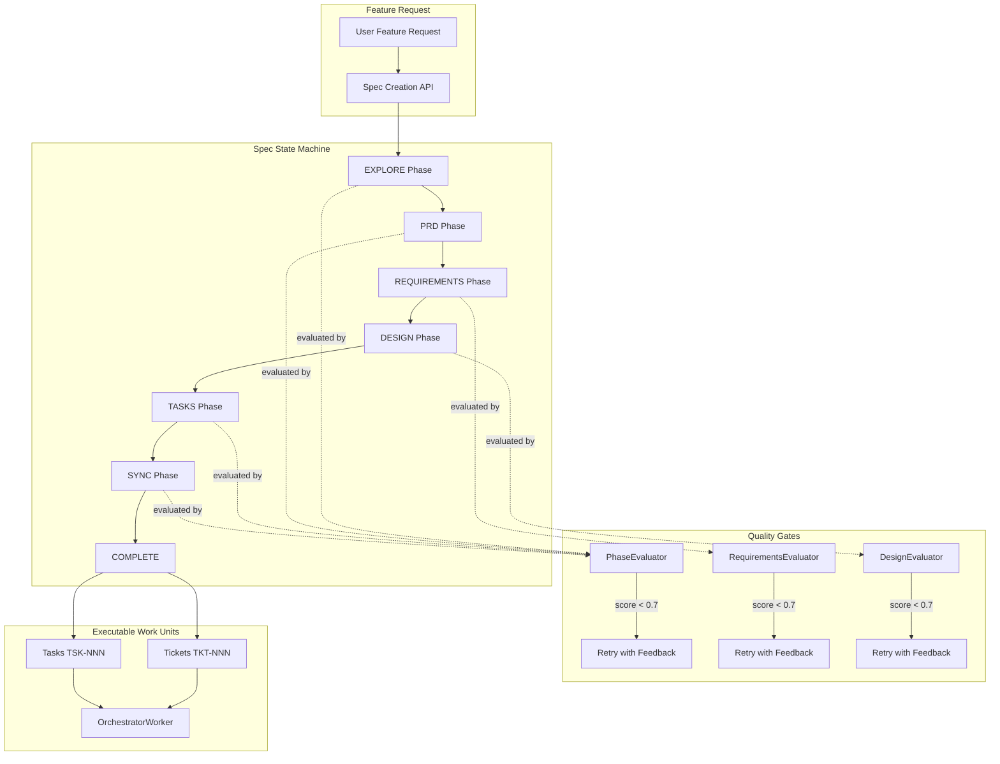
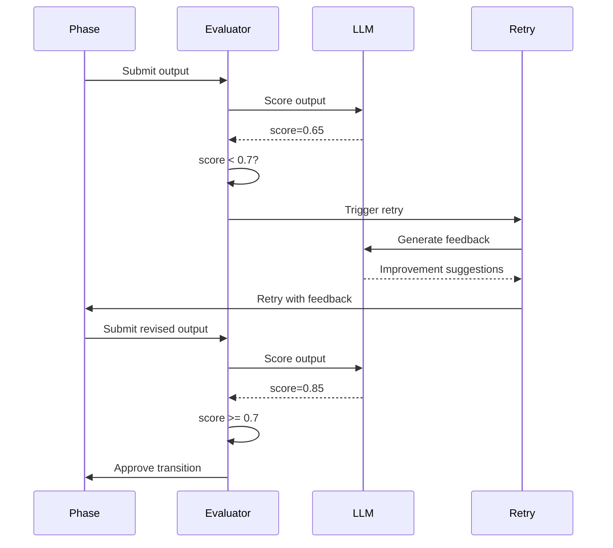
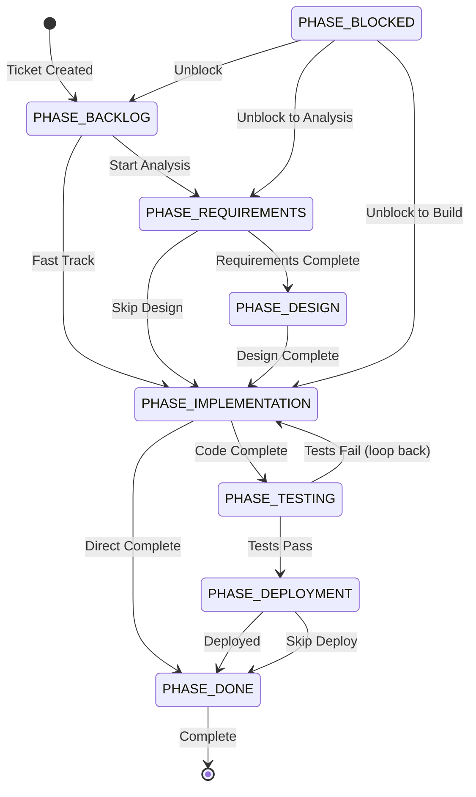

# Part 1: The Planning System

**Status**: Implemented  
**Source Files**: 
- `backend/omoi_os/services/phase_manager.py` (1,258 lines)
- `backend/omoi_os/workers/orchestrator_worker.py` (1,617 lines)
- `subsystems/spec-sandbox/src/spec_sandbox/worker/state_machine.py`
- `subsystems/spec-sandbox/src/spec_sandbox/prompts/phases.py`
- `subsystems/spec-sandbox/src/spec_sandbox/evaluators/phases.py`

**Related Docs**:
- [Part 2: Execution System](02-execution-system.md) — Task execution in sandboxes
- [Part 3: Discovery System](03-discovery-system.md) — Adaptive workflow branching
- [Part 16: Service Catalog](16-service-catalog.md) — All backend services
- [Spec Sandbox Subsystem Strategy](spec_sandbox_subsystem_strategy.md)

---

## Purpose

The Planning System is the brain of OmoiOS. It converts high-level feature ideas into structured, executable work units through a rigorous spec-driven workflow. The system ensures that every feature request flows through a standardized pipeline: exploration → requirements → design → tasks → execution, with quality gates at each phase.

The core philosophy is **spec-driven development**: before any code is written, the system generates comprehensive specifications that capture requirements, design decisions, and implementation tasks. These specs become the single source of truth for the entire development lifecycle.

---

## System Architecture



---

## Phase Flow

The spec state machine follows a strict progression through seven phases:

```
EXPLORE → PRD → REQUIREMENTS → DESIGN → TASKS → SYNC → COMPLETE
   │        │         │           │        │       │
   ▼        ▼         ▼           ▼        ▼       ▼
 Codebase  Product   EARS      Architecture  TKT/TSK  Validation
 Analysis  Reqs Doc  Format    + API Specs   IDs      + Sync
```

### Phase Details

| Phase | Purpose | Output | Execution Mode |
|-------|---------|--------|----------------|
| **EXPLORE** | Analyze codebase + gather discovery questions | `codebase_summary`, `tech_stack`, `discovery_questions`, `feature_summary` | Exploration |
| **PRD** | Product Requirements Document | `goals`, `user_stories`, `scope`, `risks`, `success_metrics` | Exploration |
| **REQUIREMENTS** | EARS-format formal requirements | `requirements[]` with `WHEN [trigger], THE SYSTEM SHALL [action]` | Exploration |
| **DESIGN** | Architecture, API specs, data models | `components[]`, `data_models[]`, `api_endpoints[]`, `architecture_diagram` | Exploration |
| **TASKS** | Tickets (TKT-NNN) and Tasks (TSK-NNN) | `tickets[]`, `tasks[]` with dependencies and estimates | Implementation |
| **SYNC** | Validate traceability and sync to API | `coverage_matrix`, `traceability_stats`, `ready_for_execution` | Validation |
| **COMPLETE** | Work is complete, ready for execution | Final artifacts, execution trigger | Terminal |

---

## Phase Manager Service

The `PhaseManager` class in `backend/omoi_os/services/phase_manager.py` is the central orchestrator for all phase-related operations.

### Key Components

#### PhaseConfig Dataclass

```python
@dataclass
class PhaseConfig:
    id: str                           # Phase identifier (e.g., "PHASE_IMPLEMENTATION")
    name: str                         # Human-readable name
    description: str                  # What this phase does
    sequence_order: int               # Position in the flow
    allowed_transitions: Tuple[str, ...]  # Which phases can come next
    mapped_status: str                # Corresponding ticket status
    execution_mode: ExecutionMode     # exploration | implementation | validation
    default_task_types: List[str]     # Tasks to spawn when entering
    gate_criteria: Optional[PhaseGateCriteria]  # Exit requirements
    is_terminal: bool = False          # Is this the final phase?
    continuous_mode: bool = False     # Run tasks to completion?
    skippable: bool = False          # Can fast-track past this?
```

#### Phase Registry

The `PHASE_CONFIGS` dictionary defines all phases:

```python
PHASE_CONFIGS: Dict[str, PhaseConfig] = {
    "PHASE_BACKLOG": PhaseConfig(
        id="PHASE_BACKLOG",
        name="Backlog",
        sequence_order=0,
        allowed_transitions=("PHASE_REQUIREMENTS", "PHASE_IMPLEMENTATION"),
        execution_mode=ExecutionMode.EXPLORATION,
        skippable=True,
    ),
    "PHASE_REQUIREMENTS": PhaseConfig(
        id="PHASE_REQUIREMENTS",
        name="Requirements",
        sequence_order=1,
        allowed_transitions=("PHASE_DESIGN", "PHASE_IMPLEMENTATION"),
        execution_mode=ExecutionMode.EXPLORATION,
        default_task_types=["analyze_requirements", "generate_prd"],
        gate_criteria=PhaseGateCriteria(
            required_artifacts=["requirements_document"],
            all_tasks_completed=True,
        ),
    ),
    "PHASE_IMPLEMENTATION": PhaseConfig(
        id="PHASE_IMPLEMENTATION",
        name="Implementation",
        sequence_order=3,
        allowed_transitions=("PHASE_TESTING", "PHASE_DONE"),
        execution_mode=ExecutionMode.IMPLEMENTATION,
        default_task_types=["implement_feature"],
        continuous_mode=True,
        gate_criteria=PhaseGateCriteria(
            required_artifacts=["code_changes"],
            all_tasks_completed=True,
            min_test_coverage=80.0,
        ),
    ),
    # ... additional phases
}
```

### Core Methods

#### Transition Management

```python
# Check if transition is allowed
can, reasons = manager.can_transition(ticket_id, "PHASE_IMPLEMENTATION")

# Perform transition with validation
result = manager.transition_to_phase(
    ticket_id,
    "PHASE_IMPLEMENTATION",
    initiated_by="user-123",
    reason="Ready to implement",
    force=False,  # Skip validation if True
    spawn_tasks=True,  # Spawn initial tasks for new phase
)

# Auto-advance based on gate criteria
result = manager.check_and_advance(ticket_id)

# Fast-track to implementation (skip requirements/design)
result = manager.fast_track_to_implementation(ticket_id)
```

#### Event Handling

The PhaseManager subscribes to task events for automatic progression:

```python
def subscribe_to_events(self) -> None:
    """Subscribe to relevant events for automatic phase management."""
    # Task started: Move ticket to appropriate phase status
    self.event_bus.subscribe("TASK_STARTED", self._handle_task_started)
    
    # Task completed: Check for phase advancement
    self.event_bus.subscribe("TASK_COMPLETED", self._handle_task_completed)
```

---

## Phase Evaluators (Quality Gates)

Each phase has an evaluator that scores the output (0.0 - 1.0). If the score is below the threshold (0.7), the phase retries with feedback.

### RequirementsEvaluator Scoring Breakdown

| Criterion | Weight | Description |
|-----------|--------|-------------|
| `structure` | 20% | Required fields present |
| `normative_language` | 20% | Uses SHALL/SHOULD/MAY |
| `ears_format` | 15% | WHEN/SHALL patterns |
| `acceptance_criteria` | 20% | 2+ criteria per requirement |
| `id_format` | 5% | REQ-FEATURE-CATEGORY-NNN format |

### Evaluation Flow



---

## Orchestrator Worker Integration

The `OrchestratorWorker` in `backend/omoi_os/workers/orchestrator_worker.py` executes the planned tasks:

### Task Type Categories

```python
# Research/analysis tasks (no code changes)
EXPLORATION_TASK_TYPES = frozenset([
    "explore_codebase",
    "analyze_codebase", 
    "analyze_requirements",
    "create_spec",
    "generate_prd",
    "research",
    "discover",
])

# Validation tasks
VALIDATION_TASK_TYPES = frozenset([
    "validate",
    "validate_implementation",
    "review_code",
    "run_tests",
])

# Implementation tasks (produce code)
# Everything else defaults to implementation mode
```

### Execution Mode Determination

```python
def get_execution_mode(task_type: str) -> Literal["exploration", "implementation", "validation"]:
    """Determine execution mode based on task type."""
    if task_type in EXPLORATION_TASK_TYPES:
        return "exploration"  # Stops early, doesn't push code
    elif task_type in VALIDATION_TASK_TYPES:
        return "validation"   # Runs tests, validates
    else:
        return "implementation"  # Runs to completion, pushes code
```

---

## Data Flow and State Transitions

### Phase Transition State Machine



### Status Synchronization

Phases and ticket statuses are kept in sync via bidirectional mapping:

```python
# Map phases to their corresponding ticket statuses
PHASE_STATUS_MAP: Dict[str, str] = {
    "PHASE_BACKLOG": TicketStatus.BACKLOG.value,
    "PHASE_REQUIREMENTS": TicketStatus.ANALYZING.value,
    "PHASE_DESIGN": TicketStatus.ANALYZING.value,
    "PHASE_IMPLEMENTATION": TicketStatus.BUILDING.value,
    "PHASE_TESTING": TicketStatus.TESTING.value,
    "PHASE_DEPLOYMENT": TicketStatus.BUILDING_DONE.value,
    "PHASE_DONE": TicketStatus.DONE.value,
    "PHASE_BLOCKED": TicketStatus.BACKLOG.value,
}

# Reverse mapping: status to preferred phase
STATUS_PHASE_MAP: Dict[str, str] = {
    TicketStatus.BACKLOG.value: "PHASE_BACKLOG",
    TicketStatus.ANALYZING.value: "PHASE_REQUIREMENTS",
    TicketStatus.BUILDING.value: "PHASE_IMPLEMENTATION",
    TicketStatus.BUILDING_DONE.value: "PHASE_DEPLOYMENT",
    TicketStatus.TESTING.value: "PHASE_TESTING",
    TicketStatus.DONE.value: "PHASE_DONE",
}
```

---

## Configuration and Environment Variables

### Phase Manager Settings

Configuration is managed via `MonitoringConfig` in `backend/omoi_os/config.py`:

```yaml
# config/base.yaml
monitoring:
  guardian_interval_seconds: 60    # Analyze agents every minute
  conductor_interval_seconds: 300   # System coherence every 5 minutes
  health_check_interval_seconds: 30 # Health checks every 30 seconds
  auto_steering_enabled: false      # Auto-execute steering interventions
  max_concurrent_analyses: 5        # Limit concurrent analyses
  llm_analysis_enabled: true        # Enable LLM-based analysis
```

### Orchestrator Settings

```yaml
# config/base.yaml
orchestrator:
  dry_run: false                    # Run decision loop without spawning
  max_concurrent_per_project: 5     # Max sandboxes per project
  stale_threshold_minutes: 3        # Mark tasks stale after 3 min
  idle_threshold_minutes: 10        # Terminate idle sandboxes after 10 min
```

### Environment Variables

```bash
# .env
ORCHESTRATOR_ENABLED=true          # Enable/disable orchestrator
ORCHESTRATOR_DRY_RUN=false          # Dry-run mode (no actual spawning)
MAX_CONCURRENT_TASKS_PER_PROJECT=5  # Concurrency limit
STALE_TASK_CLEANUP_ENABLED=true     # Enable stale task cleanup
IDLE_DETECTION_ENABLED=true         # Enable idle sandbox detection
```

---

## Error Handling and Recovery

### Phase Gate Failures

When phase gate criteria are not met:

1. **Blocking Reasons Collected**: The system identifies what's missing
2. **Gate Failure Callbacks Executed**: Registered callbacks are invoked
3. **Transition Blocked**: Ticket remains in current phase
4. **Event Published**: `monitoring.cycle.failed` event with details

```python
# Gate failure handling
if not gate_check.get("requirements_met"):
    missing = gate_check.get("missing_artifacts", [])
    blocking_reasons.append(
        f"Phase gate requirements not met. Missing: {missing}"
    )
    
    # Execute gate failure callbacks
    for callback in self._on_gate_failure_callbacks:
        callback(self, ticket_id, current_phase, next_phase)
```

### Stale Task Recovery

The orchestrator includes automatic cleanup for stuck tasks:

```python
async def stale_task_cleanup_loop():
    """Clean up tasks stuck in 'assigned' or 'claiming' status."""
    # Tasks assigned but never transitioned to 'running'
    claiming_cleaned = queue.cleanup_stale_claiming_tasks(
        stale_threshold_seconds=60
    )
    
    # Tasks stuck in assigned status
    cleaned_tasks = queue.cleanup_stale_assigned_tasks(
        stale_threshold_minutes=3,
        dry_run=False,
    )
```

### Validation Failure Recovery

When validation fails, tasks are automatically reset for re-implementation:

```python
def handle_validation_failed(event_data: dict) -> None:
    """Handle TASK_VALIDATION_FAILED event."""
    # Reset task for re-implementation
    task.status = "pending"
    task.sandbox_id = None          # Clear sandbox for fresh one
    task.assigned_agent_id = None   # Clear agent assignment
    
    # Publish event for WebSocket updates
    event_bus.publish(SystemEvent(
        event_type="TASK_STATUS_CHANGED",
        entity_type="task",
        entity_id=task_id,
        payload={"status": "pending", "reason": "reset_for_revision"}
    ))
```

---

## Integration with Other Systems

### Event Bus Integration

The Planning System publishes events via the `EventBusService`:

| Event | Source | Purpose |
|-------|--------|---------|
| `ticket.phase_transitioned` | PhaseManager | Phase change notification |
| `TICKET_STATUS_CHANGED` | PhaseManager | Status sync for UI |
| `TASK_STARTED` | TaskQueueService | Trigger phase movement |
| `TASK_COMPLETED` | TaskQueueService | Check for phase advancement |
| `discovery.branch_created` | DiscoveryService | New task from discovery |
| `monitoring.cycle.failed` | MonitoringLoop | Quality gate failure |

### Discovery System Integration

The Planning System integrates with the Discovery System for adaptive branching:

```python
# Discovery can spawn tasks in ANY phase (bypasses allowed_transitions)
discovery, spawned_task = discovery_service.record_discovery_and_branch(
    session=session,
    source_task_id="task-123",
    discovery_type=DiscoveryType.BUG_FOUND,
    description="Authentication fails for expired tokens",
    spawn_phase_id="PHASE_IMPLEMENTATION",  # Goes BACK to implementation
    spawn_description="Fix token expiration handling",
    priority_boost=True,  # MEDIUM → HIGH
)
```

### Readjustment System Integration

The MonitoringLoop provides active supervision:

```python
# Guardian analyzes agent trajectories every 60s
# Conductor analyzes system coherence every 5min
# Health checks every 30s

monitoring_loop = MonitoringLoop(
    db=db,
    event_bus=event_bus,
    config=MonitoringConfig(
        guardian_interval_seconds=60,
        conductor_interval_seconds=300,
        health_check_interval_seconds=30,
    )
)
```

---

## Incremental Work Pattern

All phases follow incremental writing to prevent data loss:

```python
# WRONG - One massive write at the end
[... do all analysis ...]
Write(entire_file)  # If this fails, everything is lost!

# CORRECT - Incremental writes
[... analyze first area ...]
Write(file, first_5_requirements)
[... analyze second area ...]
Edit(file, append next_5_requirements)  # Progress preserved
```

This pattern is enforced throughout the spec generation pipeline to ensure that even if a phase is interrupted, partial progress is preserved.

---

## Key Files Reference

| File | Purpose | Lines |
|------|---------|-------|
| `backend/omoi_os/services/phase_manager.py` | Core phase orchestration | 1,258 |
| `backend/omoi_os/workers/orchestrator_worker.py` | Task execution worker | 1,617 |
| `backend/omoi_os/services/monitoring_loop.py` | Active supervision | 697 |
| `subsystems/spec-sandbox/src/spec_sandbox/worker/state_machine.py` | Spec orchestrator | — |
| `subsystems/spec-sandbox/src/spec_sandbox/prompts/phases.py` | Phase prompts | 1,500+ |
| `subsystems/spec-sandbox/src/spec_sandbox/evaluators/phases.py` | Quality gates | — |

---

## Related Documentation

### Architecture Deep-Dives
- [Part 2: Execution System](02-execution-system.md) — Task execution in sandboxes
- [Part 3: Discovery System](03-discovery-system.md) — Adaptive workflow branching
- [Part 4: Readjustment System](04-readjustment-system.md) — Monitoring and steering
- [Part 16: Service Catalog](16-service-catalog.md) — All backend services

### Design Docs
- [Spec Sandbox Subsystem Strategy](spec_sandbox_subsystem_strategy.md) — Extraction strategy
- Phase 2 Workflow — Spec-driven development
- Phase 2 Specification — Detailed specs
- [Ticket Workflow](../design/services/ticket_workflow.md) — Ticket lifecycle

### Page Flows
- [02 - Projects & Specs](../page_flows/02_projects_specs.md) — Project management UI
- [07 - Phases](../page_flows/07_phases.md) — Phase management interface

### Requirements
- [Workflow Autonomy](../requirements/workflows/workflow_autonomy_requirements.md)
- [Agent Lifecycle](../requirements/agents/agent_lifecycle.md)
