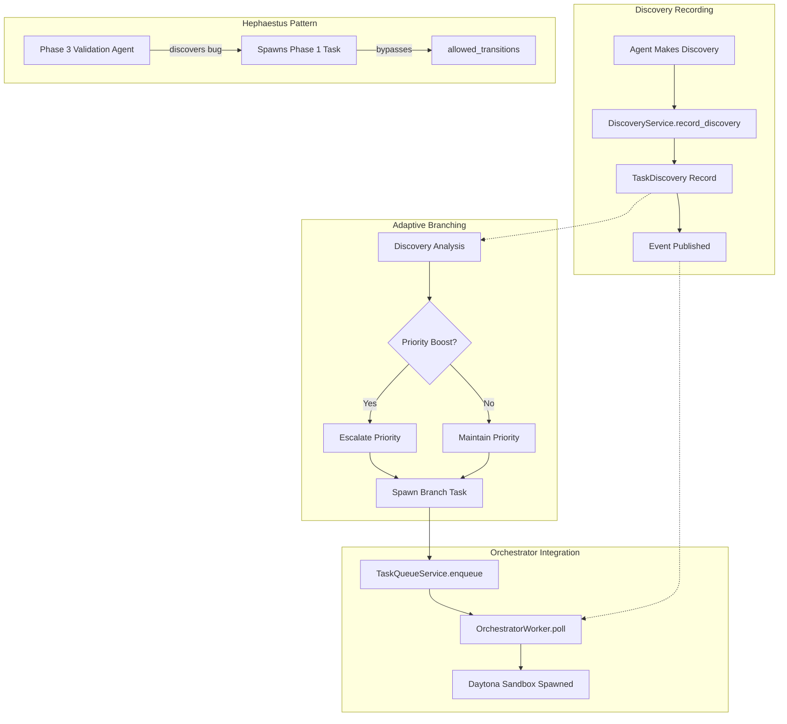
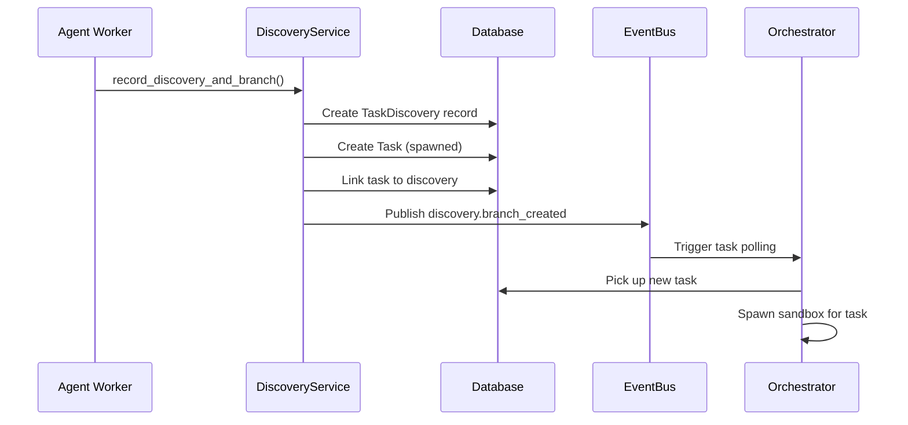
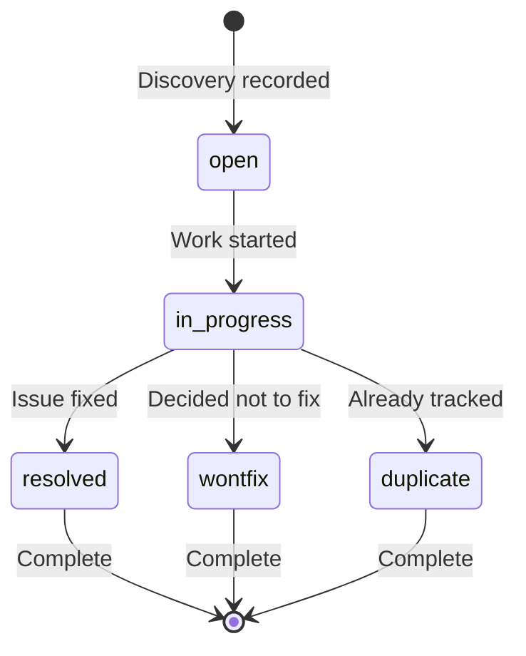
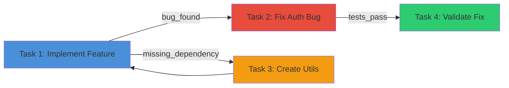
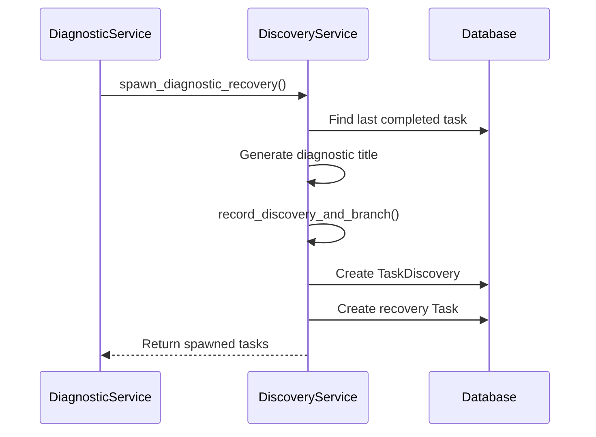

# Part 3: The Discovery System

**Status**: Implemented  
**Source Files**:
- `backend/omoi_os/services/discovery.py` (522 lines)
- `backend/omoi_os/services/discovery_analyzer.py` (515 lines)

**Related Docs**:
- [Part 1: Planning System](01-planning-system.md) — Spec generation and phases
- [Part 2: Execution System](02-execution-system.md) — Task execution
- [Part 4: Readjustment System](04-readjustment-system.md) — Monitoring and steering
- [Part 12: Memory & Context](12-configuration-system.md) — Pattern learning

---

## Purpose

The Discovery System enables **adaptive workflow branching** when agents discover new requirements, bugs, or opportunities during execution. Unlike rigid workflow systems, OmoiOS allows agents to dynamically spawn new work based on what they actually encounter in the codebase.

The core philosophy is **emergent planning**: instead of trying to predict every possible scenario upfront, the system empowers agents to discover and respond to reality as they work. When an agent finds a bug during validation, it can spawn a fix task. When it discovers a missing dependency, it can create an investigation task. The workflow adapts to the work.

---

## System Architecture



---

## Hephaestus Pattern

**Key Insight**: Discovery-based branching **bypasses** `PhaseModel.allowed_transitions`. A Phase 3 validation agent can spawn Phase 1 investigation tasks.

```
Normal Transition:      PHASE_IMPLEMENTATION → PHASE_TESTING → PHASE_DEPLOYMENT

Discovery Branch:       PHASE_TESTING → (discovery) → PHASE_IMPLEMENTATION
                        ↑                              ↓
                        └──────────────────────────────┘
                              (can spawn ANY phase)
```

This is the **Hephaestus Pattern** — named for the Greek god of craftsmen who would return to the forge to fix imperfections discovered during inspection. Agents can loop back to earlier phases when they discover issues that require rework.

---

## Discovery Types

The system recognizes several categories of discoveries, each with different handling:

| Type | Trigger | Priority Boost | Typical Response |
|------|---------|----------------|------------------|
| `BUG_FOUND` | Agent finds bug during validation | Yes | Spawn fix task in implementation phase |
| `BLOCKER_IDENTIFIED` | Blocking dependency discovered | Yes | Spawn investigation task, escalate priority |
| `MISSING_DEPENDENCY` | Required component missing | Yes | Spawn discovery task to find/create component |
| `OPTIMIZATION_OPPORTUNITY` | Performance improvement found | No | Spawn optimization task (lower priority) |
| `DIAGNOSTIC_NO_RESULT` | Stuck workflow recovery | Yes | Spawn diagnostic recovery task |

### Discovery Type Definitions

```python
class DiscoveryType:
    """Types of discoveries that can trigger workflow branching."""
    
    BUG_FOUND = "bug_found"
    """Agent found a bug during validation or testing."""
    
    BLOCKER_IDENTIFIED = "blocker_identified"
    """A blocking issue preventing progress."""
    
    MISSING_DEPENDENCY = "missing_dependency"
    """Required component or service is missing."""
    
    OPTIMIZATION_OPPORTUNITY = "optimization_opportunity"
    """Potential performance or quality improvement."""
    
    DIAGNOSTIC_NO_RESULT = "diagnostic_no_result"
    """Diagnostic run completed without resolution."""
```

---

## Discovery Service

The `DiscoveryService` class in `backend/omoi_os/services/discovery.py` provides the core API for recording and acting on discoveries.

### Core Methods

#### Recording Discoveries

```python
def record_discovery(
    self,
    session: Session,
    source_task_id: str,
    discovery_type: str,
    description: str,
    priority_boost: bool = False,
    metadata: Optional[Dict[str, Any]] = None,
) -> TaskDiscovery:
    """
    Record a discovery made by an agent during task execution.
    
    Creates a TaskDiscovery record that captures:
    - What was discovered
    - Which task discovered it
    - When it was discovered
    - Whether priority should be escalated
    """
```

#### Recording and Branching

```python
def record_discovery_and_branch(
    self,
    session: Session,
    source_task_id: str,
    discovery_type: str,
    description: str,
    spawn_phase_id: str,
    spawn_description: str,
    spawn_priority: Optional[str] = None,
    priority_boost: bool = False,
    spawn_metadata: Optional[Dict[str, Any]] = None,
    spawn_title: Optional[str] = None,
) -> tuple[TaskDiscovery, Task]:
    """
    Record discovery and immediately spawn a branch task.
    
    This implements the Hephaestus pattern: discovery → automatic branching.
    
    **IMPORTANT**: This method bypasses PhaseModel.allowed_transitions restrictions
    for discovery-based spawning, enabling Hephaestus-style free-form branching.
    Normal phase transitions still enforce allowed_transitions, but discoveries can
    spawn tasks in ANY phase (e.g., Phase 3 validation agent can spawn Phase 1
    investigation tasks).
    """
```

### Discovery Flow



---

## TaskDiscovery Model

The `TaskDiscovery` model captures the full context of a discovery:

```python
class TaskDiscovery(Base):
    """Records discoveries made by agents during task execution."""
    
    __tablename__ = "task_discoveries"
    
    id: Mapped[UUID] = mapped_column(PGUUID(as_uuid=True), primary_key=True, default=uuid4)
    source_task_id: Mapped[str] = mapped_column(String(255), index=True)
    discovery_type: Mapped[str] = mapped_column(String(50), index=True)
    description: Mapped[str] = mapped_column(Text)
    
    # Branch tracking
    spawned_task_ids: Mapped[list[str]] = mapped_column(JSONB, default=list)
    
    # Metadata
    discovered_at: Mapped[datetime]
    priority_boost: Mapped[bool] = mapped_column(Boolean, default=False)
    resolution_status: Mapped[str] = mapped_column(String(20), default="open")
    metadata: Mapped[Optional[dict]] = mapped_column(JSONB)
```

### Resolution Status Flow



---

## Discovery Analyzer Service

The `DiscoveryAnalyzerService` in `backend/omoi_os/services/discovery_analyzer.py` provides LLM-powered analysis of discovery patterns:

### Analysis Methods

| Method | Purpose |
|--------|---------|
| `analyze_patterns()` | Find recurring patterns across discoveries |
| `predict_blockers()` | Predict likely blockers based on history |
| `recommend_agent()` | Suggest best agent type for a discovery |
| `summarize_workflow_health()` | Comprehensive health metrics |

### Pattern Analysis Output

```python
PatternAnalysisResult(
    patterns=[
        DiscoveryPattern(
            pattern_type="recurring_bug",
            description="Token handling issues",
            severity="high",
            affected_components=["AuthService", "TokenValidator"],
            suggested_action="Add comprehensive token tests",
            confidence=0.85
        )
    ],
    health_score=0.72,
    hotspots=["AuthService"],
    recommendations=["Add token expiration tests before deployment"]
)
```

---

## Priority Boost System

When `priority_boost=True`, the system escalates task priority one level:

```python
# Priority escalation mapping
priority_map = {
    "LOW": "MEDIUM",
    "MEDIUM": "HIGH", 
    "HIGH": "CRITICAL"
}

# Example: MEDIUM task discovers critical bug
spawn_priority = source_task.priority  # "MEDIUM"
if priority_boost and spawn_priority != "CRITICAL":
    spawn_priority = priority_map.get(spawn_priority, "HIGH")  # Now "HIGH"
```

This ensures that discovered issues get appropriate attention without overwhelming the queue with CRITICAL tasks.

---

## Workflow Graph Generation

The Discovery Service can generate a complete workflow graph showing all discoveries and branches:

```python
def get_workflow_graph(self, session: Session, ticket_id: str) -> Dict[str, Any]:
    """
    Build a workflow graph showing all discoveries and branches for a ticket.
    
    Returns:
        {
            "nodes": [
                {"id": "task-1", "phase": "PHASE_IMPLEMENTATION", ...},
                {"id": "task-2", "phase": "PHASE_TESTING", ...},
            ],
            "edges": [
                {"from": "task-1", "to": "task-3", "discovery_type": "bug_found"},
            ]
        }
    """
```

### Graph Visualization



---

## Diagnostic Recovery Integration

The Discovery System integrates with the diagnostic system for stuck workflow recovery:

```python
async def spawn_diagnostic_recovery(
    self,
    session: Session,
    ticket_id: str,
    diagnostic_run_id: str,
    reason: str,
    suggested_phase: str = "PHASE_FINAL",
    suggested_priority: str = "HIGH",
    max_tasks: int = 5,
) -> List[Task]:
    """
    Spawn diagnostic recovery tasks using Discovery pattern.
    
    Creates a diagnostic discovery and spawns recovery tasks to help
    stuck workflows progress toward their goal.
    """
```

### Recovery Flow



---

## Event Integration

The Discovery System publishes events via the EventBus:

| Event | Purpose | Payload |
|-------|---------|---------|
| `discovery.recorded` | New discovery created | `source_task_id`, `discovery_type`, `priority_boost` |
| `discovery.branch_created` | Branch task spawned | `spawned_task_id`, `spawn_phase`, `priority_boost` |
| `discovery.resolved` | Discovery marked resolved | `discovery_type`, `spawned_count` |

### Event Publishing

```python
# When discovery is recorded
self.event_bus.publish(
    SystemEvent(
        event_type="discovery.recorded",
        entity_type="task_discovery",
        entity_id=str(discovery.id),
        payload={
            "source_task_id": source_task_id,
            "discovery_type": discovery_type,
            "priority_boost": priority_boost,
        },
    )
)

# When branch is created
self.event_bus.publish(
    SystemEvent(
        event_type="discovery.branch_created",
        entity_type="task_discovery",
        entity_id=str(discovery.id),
        payload={
            "discovery_type": discovery_type,
            "spawned_task_id": spawned_task.id,
            "spawn_phase": spawn_phase_id,
            "priority_boost": priority_boost,
        },
    )
)
```

---

## Configuration and Environment Variables

### Discovery Settings

Configuration is managed via YAML and environment variables:

```yaml
# config/base.yaml
discovery:
  max_branches_per_discovery: 5      # Limit spawned tasks per discovery
  auto_resolve_enabled: true         # Auto-mark discoveries resolved
  pattern_analysis_enabled: true     # Enable LLM pattern analysis
  priority_boost_threshold: "HIGH"   # Minimum priority for boost
```

### Environment Variables

```bash
# .env
DISCOVERY_MAX_BRANCHES=5
DISCOVERY_AUTO_RESOLVE=true
DISCOVERY_PATTERN_ANALYSIS=true
```

---

## Error Handling and Recovery

### Discovery Recording Failures

When discovery recording fails:

1. **Validation Error**: Source task must exist
2. **Database Error**: Transaction rolled back, discovery not recorded
3. **Event Publishing Error**: Logged but doesn't fail the discovery

```python
def record_discovery(self, session: Session, ...):
    # Verify source task exists
    task = session.get(Task, source_task_id)
    if not task:
        raise ValueError(f"Source task {source_task_id} not found")
    
    # Create discovery record
    discovery = TaskDiscovery(...)
    session.add(discovery)
    session.flush()
    
    # Publish event (best effort)
    try:
        if self.event_bus:
            self.event_bus.publish(...)
    except Exception as e:
        logger.warning("Failed to publish discovery event", error=str(e))
```

### Branch Task Creation Failures

When branch task creation fails:

1. **Discovery Recorded**: Discovery is preserved even if task creation fails
2. **Partial Success**: Discovery exists but no spawned task
3. **Retry Logic**: Orchestrator will pick up discovery on next cycle

---

## Integration with Other Systems

### Phase Manager Integration

Discoveries can spawn tasks in any phase, bypassing normal transition rules:

```python
# Normal transition (enforces allowed_transitions)
phase_manager.transition_to_phase(ticket_id, "PHASE_IMPLEMENTATION")

# Discovery-based spawning (bypasses allowed_transitions)
discovery_service.record_discovery_and_branch(
    spawn_phase_id="PHASE_IMPLEMENTATION",  # Can be ANY phase
    ...
)
```

### Orchestrator Worker Integration

The Orchestrator automatically picks up discovery-spawned tasks:

```python
# In orchestrator_loop()
task = queue.get_next_task_with_concurrency_limit(
    max_concurrent_per_project=max_concurrent,
    phase_id=None,  # No phase filter - picks up discovery tasks
)

if task:
    # Check if task was spawned from discovery
    if task.result and task.result.get("triggered_by_discovery"):
        log.info("processing_discovery_task", 
                 discovery_id=task.result["triggered_by_discovery"])
```

### Monitoring Loop Integration

The Monitoring Loop tracks discovery metrics:

```python
# In system health overview
"discovery_metrics": {
    "discoveries_today": 15,
    "branches_created": 23,
    "avg_time_to_resolve": "2.5 hours",
    "top_discovery_types": ["bug_found", "missing_dependency"]
}
```

---

## Key Files Reference

| File | Purpose | Lines |
|------|---------|-------|
| `backend/omoi_os/services/discovery.py` | Core discovery + branching | 522 |
| `backend/omoi_os/services/discovery_analyzer.py` | LLM pattern analysis | 515 |
| `backend/omoi_os/models/task_discovery.py` | TaskDiscovery model | — |

---

## Related Documentation

### Architecture Deep-Dives
- [Part 1: Planning System](01-planning-system.md) — Spec generation and phases
- [Part 2: Execution System](02-execution-system.md) — Task execution
- [Part 4: Readjustment System](04-readjustment-system.md) — Monitoring and steering
- [Part 16: Service Catalog](16-service-catalog.md) — All backend services

### Design Docs
- [Memory System](../requirements/memory/memory_system.md) — Agent memory and pattern learning
- [Diagnosis Agent](../requirements/agents/diagnosis_agent.md) — Diagnostic agent design
- Multi-Agent Orchestration — Agent coordination

### Requirements
- [Memory System](../requirements/memory/memory_system.md) — Memory requirements
- [Diagnosis Agent](../requirements/agents/diagnosis_agent.md) — Diagnostic capabilities
- [Workflow Autonomy](../requirements/workflows/workflow_autonomy_requirements.md)
