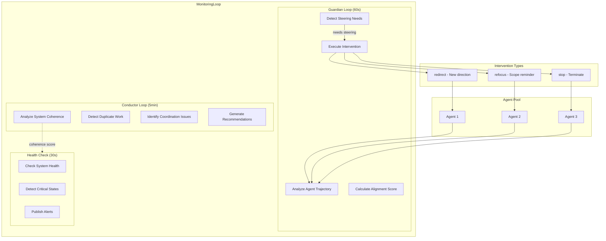
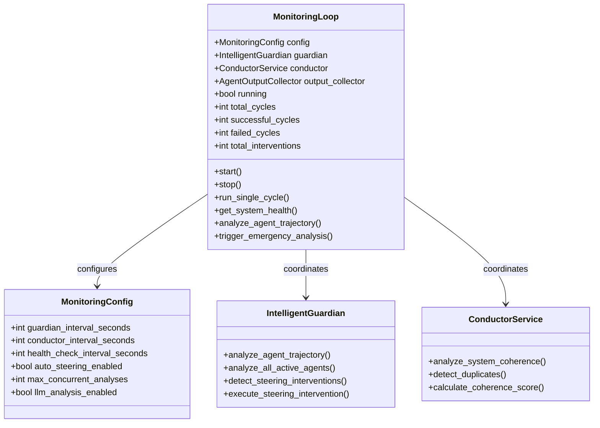
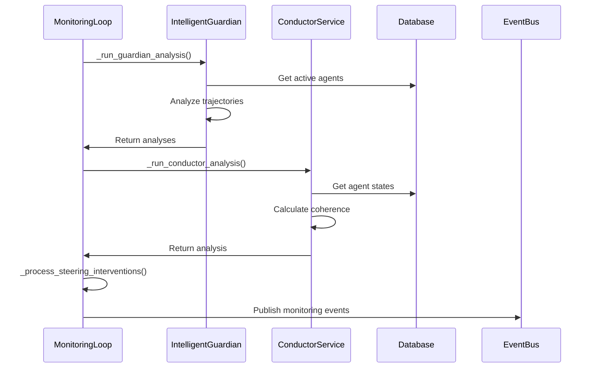
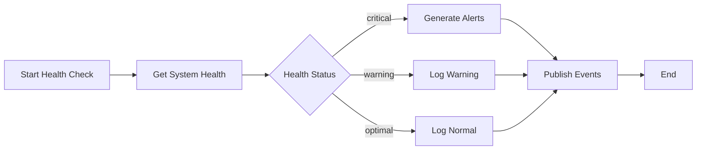

# Part 4: The Readjustment System

**Status**: Implemented  
**Source Files**:
- `backend/omoi_os/services/monitoring_loop.py` (697 lines)
- `backend/omoi_os/services/intelligent_guardian.py` (1,121 lines)
- `backend/omoi_os/services/conductor.py` (919 lines)

**Related Docs**:
- [Part 2: Execution System](02-execution-system.md) — Task execution
- [Part 6: Real-Time Events](06-realtime-events.md) — Event system
- [Part 16: Service Catalog](16-service-catalog.md) — All backend services
- [Part 17: Monitoring Replay](17-monitoring-replay.md) — Replay system

---

## Purpose

The Readjustment System monitors agent trajectories and system coherence, intervening when agents drift from their goals. It provides **active supervision** — not just passive monitoring, but intelligent analysis and steering to keep the agent swarm aligned and productive.

The system operates on three time scales:
- **60 seconds**: Per-agent trajectory analysis (Guardian)
- **5 minutes**: System-wide coherence analysis (Conductor)
- **30 seconds**: Health checks and alerting

---

## System Architecture



---

## MonitoringLoop Architecture

The `MonitoringLoop` class in `backend/omoi_os/services/monitoring_loop.py` orchestrates all monitoring activities:



### Configuration

```python
@dataclass
class MonitoringConfig:
    """Configuration for monitoring loop behavior."""
    
    guardian_interval_seconds: int = 60      # Analyze agents every minute
    conductor_interval_seconds: int = 300    # System coherence every 5 minutes
    health_check_interval_seconds: int = 30  # Health checks every 30 seconds
    auto_steering_enabled: bool = False      # Auto-execute interventions
    max_concurrent_analyses: int = 5         # Limit concurrent analyses
    llm_analysis_enabled: bool = True        # Enable LLM-based analysis
```

---

## IntelligentGuardian (Per-Agent Analysis)

The `IntelligentGuardian` in `backend/omoi_os/services/intelligent_guardian.py` provides LLM-powered trajectory analysis.

### Trajectory Analysis Output

```python
class TrajectoryAnalysis:
    """Container for trajectory analysis results."""
    
    agent_id: str
    current_phase: str
    trajectory_aligned: bool      # On track for goal?
    alignment_score: float        # 0.0 - 1.0
    needs_steering: bool          # Requires intervention?
    steering_type: Optional[str]  # "redirect", "refocus", "stop"
    steering_recommendation: Optional[str]
    trajectory_summary: str
    current_focus: str
    conversation_length: int
    session_duration: timedelta
    details: Dict[str, Any]
```

### Analysis Example

```python
TrajectoryAnalysis(
    agent_id="agent-123",
    alignment_score=0.85,      # 0.0 - 1.0
    trajectory_aligned=True,     # On track for goal?
    needs_steering=False,        # Requires intervention?
    steering_type=None,          # "redirect", "refocus", "stop"
    steering_recommendation=None,
    trajectory_summary="Agent progressing on auth implementation",
    current_focus="Adding JWT validation",
    conversation_length=45,
    session_duration=timedelta(minutes=23),
)
```

### Steering Intervention Types

| Type | When | Action |
|------|------|--------|
| `redirect` | Agent going wrong direction | Inject message with new direction |
| `refocus` | Agent drifting from scope | Remind of original goal |
| `stop` | Agent causing harm | Terminate execution |

### LLM-Powered Analysis

```python
async def _llm_trajectory_analysis(
    self,
    agent: Agent,
    trajectory_data: Dict[str, Any],
    agent_output: str,
) -> Optional[Dict[str, Any]]:
    """
    Perform LLM-powered trajectory analysis using Jinja2 template.
    
    Uses structured_output for type-safe responses:
    - trajectory_aligned: bool
    - alignment_score: float (0.0-1.0)
    - needs_steering: bool
    - steering_type: Optional[str]
    - steering_recommendation: Optional[str]
    """
    
    # Render template with all context
    template_service = get_template_service()
    prompt = template_service.render(
        "prompts/guardian_analysis.md.j2",
        agent=agent,
        trajectory_data=trajectory_data,
        agent_output=agent_output,
        past_summaries=past_summaries,
        phase_context=phase_context,
    )
    
    # Use structured_output for type-safe responses
    analysis_result = await self.llm_service.structured_output(
        prompt=prompt,
        output_type=LLMTrajectoryAnalysisResponse,
        system_prompt="You are an expert AI system analyzer.",
        output_retries=3,
    )
```

---

## ConductorService (System Coherence)

The `ConductorService` in `backend/omoi_os/services/conductor.py` analyzes system-wide coherence and detects duplicate work.

### Coherence Score Formula

```
coherence = base_alignment - trajectory_penalty - steering_penalty + bonuses

Where:
- base_alignment = average alignment across all agents
- trajectory_penalty = (unaligned_agents / total_agents) * 0.2
- steering_penalty = (agents_needing_steering / total_agents) * 0.1
- bonuses = efficiency_bonus + completion_bonus
```

### System Status Classification

| Status | Condition | Action |
|--------|-----------|--------|
| `critical` | coherence < 0.3 | Emergency intervention required |
| `warning` | coherence < 0.5 | Increased monitoring |
| `inefficient` | coherence < 0.7 | Optimization recommended |
| `optimal` | coherence >= 0.9 | System performing well |
| `normal` | otherwise | Standard monitoring |

### Duplicate Detection

```python
# LLM compares same-phase agent pairs
for agent_a, agent_b in pairwise(agents_in_phase):
    prompt = f"Are {agent_a.focus} and {agent_b.focus} duplicates?"
    if llm.is_duplicate(agent_a, agent_b):
        recommendations.append(f"Merge {agent_a.id} and {agent_b.id}")
```

---

## Background Loops

### Guardian Loop (60s)

```python
async def _guardian_loop(self) -> None:
    """Background loop for Guardian trajectory analysis."""
    while self.running:
        try:
            await self._run_guardian_analysis()
            self.last_guardian_run = utc_now()
            await asyncio.sleep(self.config.guardian_interval_seconds)
        except asyncio.CancelledError:
            break
        except Exception as e:
            logger.error(f"Guardian loop error: {e}")
            await asyncio.sleep(5)
```

### Conductor Loop (5min)

```python
async def _conductor_loop(self) -> None:
    """Background loop for Conductor system coherence analysis."""
    while self.running:
        try:
            await self._run_conductor_analysis()
            self.last_conductor_run = utc_now()
            await asyncio.sleep(self.config.conductor_interval_seconds)
        except asyncio.CancelledError:
            break
        except Exception as e:
            logger.error(f"Conductor loop error: {e}")
            await asyncio.sleep(10)
```

### Health Check Loop (30s)

```python
async def _health_check_loop(self) -> None:
    """Background loop for system health checks."""
    while self.running:
        try:
            await self._run_health_check()
            self.last_health_check = utc_now()
            await asyncio.sleep(self.config.health_check_interval_seconds)
        except asyncio.CancelledError:
            break
        except Exception as e:
            logger.error(f"Health check loop error: {e}")
            await asyncio.sleep(5)
```

---

## Data Flow and State Transitions

### Monitoring Cycle Flow



### Health Check Flow



---

## Configuration and Environment Variables

### Monitoring Settings

```yaml
# config/base.yaml
monitoring:
  guardian_interval_seconds: 60
  conductor_interval_seconds: 300
  health_check_interval_seconds: 30
  auto_steering_enabled: false
  max_concurrent_analyses: 5
  llm_analysis_enabled: true
```

### Environment Variables

```bash
# .env
MONITORING_GUARDIAN_INTERVAL=60
MONITORING_CONDUCTOR_INTERVAL=300
MONITORING_HEALTH_INTERVAL=30
MONITORING_AUTO_STEERING=false
MONITORING_LLM_ANALYSIS=true
```

---

## Error Handling and Recovery

### Guardian Analysis Failures

When trajectory analysis fails:

1. **Individual Agent Failure**: Logged, other agents continue
2. **LLM Service Failure**: Falls back to structural analysis
3. **Database Failure**: Analysis skipped for this cycle

```python
async def _analyze_agent_with_semaphore(
    self, semaphore: asyncio.Semaphore, agent_id: str
) -> Optional[Dict[str, Any]]:
    async with semaphore:
        try:
            analysis = await self.guardian.analyze_agent_trajectory(agent_id, False)
            return analysis
        except Exception as e:
            logger.error(f"Agent analysis failed: {e}")
            return None
```

### Conductor Analysis Failures

When system coherence analysis fails:

1. **Partial Data**: Analysis continues with available data
2. **Complete Failure**: Returns empty result, logged
3. **Retry**: Next cycle attempts again

### Steering Intervention Failures

When intervention execution fails:

1. **Sandbox Intervention**: Falls back to legacy method
2. **Legacy Intervention**: Logged, continues monitoring
3. **Both Fail**: Event published for manual review

```python
async def _execute_intervention_for_task(
    self, intervention: SteeringIntervention, task: Task
) -> bool:
    if self._is_sandbox_task(task):
        return await self._sandbox_intervention(intervention, task)
    else:
        return await self._legacy_intervention(intervention, task)
```

---

## Integration with Other Systems

### Event Bus Integration

The Readjustment System publishes events:

| Event | Purpose | Payload |
|-------|---------|---------|
| `monitoring.started` | Monitoring loop started | `cycle_id` |
| `monitoring.stopped` | Monitoring loop stopped | `total_cycles` |
| `monitoring.cycle.failed` | Cycle failed | `error`, `duration` |
| `monitoring.conductor.analysis` | Coherence analysis | `coherence_score`, `system_status` |
| `monitoring.health.check` | Health check | `system_health`, `alerts` |
| `guardian.steering.intervention` | Intervention issued | `steering_type`, `message` |

### Orchestrator Worker Integration

The Orchestrator responds to monitoring events:

```python
# In orchestrator_loop()
event_bus.subscribe("TASK_VALIDATION_FAILED", handle_validation_failed)
event_bus.subscribe("guardian.steering.intervention", handle_intervention)
```

### Discovery System Integration

When Guardian detects stuck agents, it can trigger diagnostic recovery:

```python
if analysis.needs_steering and analysis.alignment_score < 0.3:
    # Trigger diagnostic discovery
    discovery_service.spawn_diagnostic_recovery(
        ticket_id=agent.ticket_id,
        diagnostic_run_id=diagnostic_id,
        reason="Agent trajectory severely misaligned",
    )
```

---

## Metrics and Observability

### Monitoring Loop Metrics

```python
def get_status(self) -> Dict[str, Any]:
    return {
        "running": self.running,
        "current_cycle_id": str(self.current_cycle_id),
        "config": {
            "guardian_interval": self.config.guardian_interval_seconds,
            "conductor_interval": self.config.conductor_interval_seconds,
            "health_check_interval": self.config.health_check_interval_seconds,
        },
        "timing": {
            "last_guardian_run": self.last_guardian_run.isoformat(),
            "last_conductor_run": self.last_conductor_run.isoformat(),
            "last_health_check": self.last_health_check.isoformat(),
        },
        "metrics": {
            "total_cycles": self.total_cycles,
            "successful_cycles": self.successful_cycles,
            "failed_cycles": self.failed_cycles,
            "total_interventions": self.total_interventions,
            "success_rate": self.successful_cycles / max(self.total_cycles, 1),
        },
    }
```

### Health Score Calculation

```python
def _calculate_agent_health_score(
    self, analysis: TrajectoryAnalysis
) -> float:
    base_score = analysis.alignment_score
    
    # Penalty for needing steering
    if analysis.needs_steering:
        base_score *= 0.7
    
    # Penalty for trajectory misalignment
    if not analysis.trajectory_aligned:
        base_score *= 0.8
    
    return max(0.0, min(1.0, base_score))
```

---

## Key Files Reference

| File | Purpose | Lines |
|------|---------|-------|
| `backend/omoi_os/services/monitoring_loop.py` | Main orchestrator | 697 |
| `backend/omoi_os/services/intelligent_guardian.py` | Per-agent analysis | 1,121 |
| `backend/omoi_os/services/conductor.py` | System coherence | 919 |
| `backend/omoi_os/services/guardian.py` | Basic guardian | — |
| `backend/omoi_os/models/trajectory_analysis.py` | Analysis models | — |
| `backend/omoi_os/models/guardian_analysis.py` | Guardian models | — |

---

## Related Documentation

### Architecture Deep-Dives
- [Part 2: Execution System](02-execution-system.md) — Task execution in sandboxes
- [Part 6: Real-Time Events](06-realtime-events.md) — Event system for monitoring
- [Part 16: Service Catalog](16-service-catalog.md) — All backend services
- [Part 17: Monitoring Replay](17-monitoring-replay.md) — Replay system

### Design Docs
- [Monitoring Architecture](../requirements/monitoring/monitoring_architecture.md)
- [Fault Tolerance](../requirements/monitoring/fault_tolerance.md)
- Intelligent Monitoring Testing
- Diagnostic True Gaps

### Page Flows
- [10a - Monitoring System](../page_flows/10a_monitoring_system.md) — Monitoring dashboard UI
- [09a - Diagnostic Reasoning](../page_flows/09a_diagnostic_reasoning.md) — Diagnostic views

### Requirements
- [Monitoring Architecture](../requirements/monitoring/monitoring_architecture.md)
- [Fault Tolerance](../requirements/monitoring/fault_tolerance.md)
