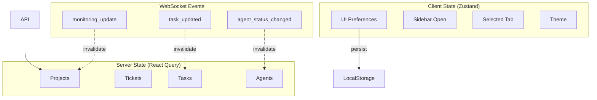
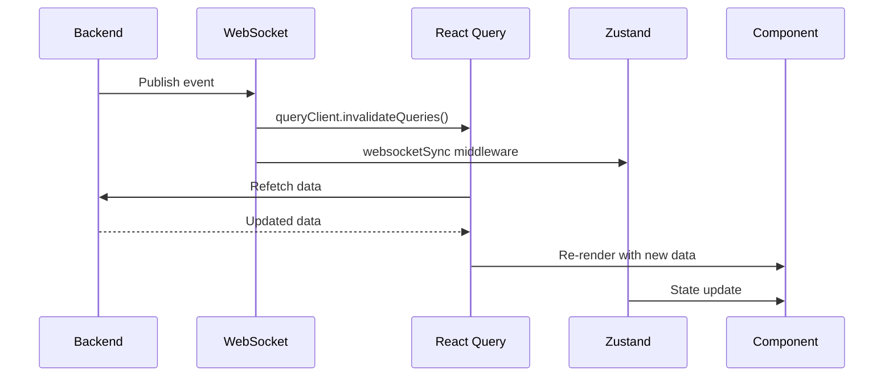

# Part 5: Frontend Architecture

**Status**: Implemented  
**Source Files**:
- `frontend/app/` directory (94 route files)
- `frontend/hooks/` (30 custom hooks)
- `frontend/components/layout/` (layout components)
- `frontend/providers/` (context providers)

**Related Docs**:
- [Part 6: Real-Time Events](06-realtime-events.md) — WebSocket integration
- [Part 7: Auth & Security](07-auth-and-security.md) — Authentication
- [Part 13: API Route Catalog](13-api-route-catalog.md) — Backend endpoints
- Frontend Architecture (ShadCN + Next.js)

---

## Purpose

The OmoiOS frontend is a **Next.js 15 App Router** application that provides a comprehensive dashboard for managing autonomous agent workflows. It combines modern React patterns with real-time WebSocket integration to deliver a live view of agent activities, spec progress, and system health.

The architecture prioritizes:
- **Performance**: Server-side rendering, code splitting, lazy loading
- **Real-time**: WebSocket-powered live updates across all views
- **Type safety**: Full TypeScript coverage with generated API types
- **Developer experience**: Feature-based organization, custom hooks, consistent patterns

---

## Tech Stack

| Layer | Technology | Purpose |
|-------|-----------|---------|
| **Framework** | Next.js 15 (App Router) | SSR, routing, layouts |
| **UI Components** | ShadCN UI (Radix + Tailwind) | Base component library (40+ components) |
| **Client State** | Zustand (with middleware) | UI state, preferences |
| **Server State** | React Query (TanStack Query) | API data caching, mutations |
| **Graphs** | React Flow v12 (@xyflow/react) | Dependency visualization |
| **Terminal** | xterm.js | Agent output streaming |
| **Forms** | React Hook Form + Zod | Type-safe form handling |
| **Animations** | Framer Motion | Transitions, gestures |

---

## Route Groups

The app uses Next.js route groups for layout separation:

```
frontend/app/
├── (app)/              # Authenticated routes (41 pages)
│   ├── layout.tsx      # MainLayout shell
│   ├── command/        # Command center
│   ├── projects/       # Project management
│   ├── board/          # Kanban board
│   ├── agents/         # Agent monitoring
│   └── ...
├── (auth)/             # Auth routes (6 pages)
│   ├── layout.tsx      # Centered card layout
│   ├── login/          # Login page
│   ├── register/       # Registration
│   └── ...
├── (dashboard)/        # Root redirect
│   └── page.tsx        # Redirects to /command
└── layout.tsx          # Root layout with providers
```

### Route Group Details

| Group | Layout | Purpose | Pages |
|-------|--------|---------|-------|
| `(app)` | Full shell (MainLayout) | Authenticated routes | 41 pages |
| `(auth)` | Centered card | Login, register, OAuth, verification | 6 pages |
| `(dashboard)` | Sidebar shell | Root redirect to /command | 1 page |

### Key Page Categories

- **Organization Pages** — list, create, detail, settings, member management
- **Dashboard** — overview with stats cards, project list (grid/list views), AI-assisted exploration
- **Spec Workspace** — multi-tab workspace (Requirements, Design, Tasks, Execution) with Notion-style structured blocks
- **Kanban Board** — horizontal scrolling columns with drag-and-drop tickets, inline detail drawer, WIP limits
- **Graph Views** — full project dependency graph and per-ticket focused graphs via React Flow
- **Statistics** — six analytics tabs for project metrics
- **Agent Management** — agent list, workspace views, diagnostic reasoning

---

## Component Organization

```
frontend/components/
├── ui/                 # ShadCN base components (40+)
│   ├── button.tsx
│   ├── card.tsx
│   ├── dialog.tsx
│   └── ...
├── layout/             # App shell components
│   ├── MainLayout.tsx
│   ├── IconRail.tsx
│   ├── ContextualPanel.tsx
│   └── Sidebar.tsx
├── kanban/             # Kanban board feature
│   ├── KanbanBoard.tsx
│   ├── KanbanColumn.tsx
│   └── KanbanCard.tsx
├── graph/              # React Flow graph components
│   ├── DependencyGraph.tsx
│   ├── GraphNode.tsx
│   └── GraphEdge.tsx
├── project/            # Project-scoped features
├── exploration/        # AI exploration wizard
└── agents/             # Agent monitoring components
```

### ShadCN UI Components

The project uses 40+ ShadCN UI components. Key components include:

| Component | Usage |
|-----------|-------|
| `Button` | Actions, navigation |
| `Card` | Content containers |
| `Dialog` | Modals, confirmations |
| `DropdownMenu` | Actions menus |
| `Tabs` | Content organization |
| `DataTable` | List views with sorting/filtering |
| `Form` | Input handling |
| `Toast` | Notifications |
| `Skeleton` | Loading states |

---

## State Management

### Dual State Architecture

The frontend uses a dual state approach:



### Zustand Middleware Stack

```
devtools → persist → websocketSync → reactQueryBridge → timeTravel → subscribeWithSelector → immer
```

### React Query Configuration

```typescript
// providers/QueryProvider.tsx
const queryClient = new QueryClient({
  defaultOptions: {
    queries: {
      staleTime: 1000 * 60 * 5,      // 5 minutes
      refetchOnWindowFocus: true,
      retry: 3,
      retryDelay: (attemptIndex) => Math.min(1000 * 2 ** attemptIndex, 30000),
    },
  },
});
```

---

## Custom Hooks

The frontend includes 30 custom hooks organized by domain:

### Data Fetching Hooks

| Hook | Purpose |
|------|---------|
| `useProjects()` | Project CRUD operations |
| `useTickets()` | Ticket management |
| `useTasks()` | Task lifecycle |
| `useSpecs()` | Spec workflow |
| `useAgents()` | Agent monitoring |
| `useBoard()` | Kanban board data |
| `useGraph()` | Dependency graph |
| `useAnalytics()` | Statistics and metrics |
| `useBilling()` | Subscription management |
| `useOrganizations()` | Org management |

### Real-Time Hooks

| Hook | Purpose |
|------|---------|
| `useEvents()` | Generic WebSocket events |
| `useEntityEvents()` | Entity-specific events |
| `useEventTypes()` | Event type filtering |
| `useBoardEvents()` | Board-specific events |
| `useMonitor()` | Monitoring dashboard |

### Feature Hooks

| Hook | Purpose |
|------|---------|
| `useAuth()` | Authentication state |
| `useOAuth()` | OAuth flows |
| `useOnboarding()` | Onboarding wizard |
| `useSandbox()` | Sandbox management |
| `usePrototype()` | Prototype workspace |
| `usePhases()` | Phase management |
| `useCommits()` | Git commit history |
| `useGitHub()` | GitHub integration |
| `useExplore()` | AI exploration |
| `useReasoning()` | Diagnostic reasoning |

### Hook Example: useEvents

```typescript
// hooks/useEvents.ts
export function useEvents(options: UseEventsOptions = {}): UseEventsReturn {
  const { filters, onEvent, enabled = true, maxEvents = 100 } = options;
  
  const [events, setEvents] = useState<SystemEvent[]>([]);
  const [isConnected, setIsConnected] = useState(false);
  const wsRef = useRef<WebSocket | null>(null);
  
  const buildWsUrl = useCallback(() => {
    const apiUrl = process.env.NEXT_PUBLIC_API_URL || "http://localhost:18000";
    const wsProtocol = apiUrl.startsWith("https") ? "wss:" : "ws:";
    return `${wsProtocol}//${new URL(apiUrl).host}/api/v1/ws/events`;
  }, []);
  
  const connect = useCallback(() => {
    const ws = new WebSocket(buildWsUrl());
    ws.onmessage = (event) => {
      const data = JSON.parse(event.data);
      setEvents((prev) => [data, ...prev].slice(0, maxEvents));
      onEvent?.(data);
    };
    wsRef.current = ws;
  }, [buildWsUrl, maxEvents, onEvent]);
  
  useEffect(() => {
    if (enabled) connect();
    return () => wsRef.current?.close();
  }, [enabled, connect]);
  
  return { events, isConnected, connect, disconnect };
}
```

---

## Real-Time Integration

### WebSocket Event Bridge

WebSocket events bridge to both state layers:



### Event Types

| Event | Triggers |
|-------|----------|
| `monitoring_update` | Guardian/Conductor analysis refresh |
| `steering_issued` | Agent intervention notification |
| `task_updated` | Task status change |
| `ticket_updated` | Ticket status change |
| `agent_status_changed` | Agent health change |
| `discovery.branch_created` | New task from discovery |
| `TICKET_STATUS_CHANGED` | Board update |

### Optimistic Updates

The UI updates immediately, confirms/rolls back on WebSocket response:

```typescript
// Example: Optimistic task status update
const updateTask = useMutation({
  mutationFn: updateTaskStatus,
  onMutate: async (newStatus) => {
    // Cancel outgoing refetches
    await queryClient.cancelQueries({ queryKey: ['tasks'] });
    
    // Snapshot previous value
    const previousTasks = queryClient.getQueryData(['tasks']);
    
    // Optimistically update
    queryClient.setQueryData(['tasks'], (old) => 
      old.map(t => t.id === taskId ? { ...t, status: newStatus } : t)
    );
    
    return { previousTasks };
  },
  onError: (err, newStatus, context) => {
    // Rollback on error
    queryClient.setQueryData(['tasks'], context.previousTasks);
  },
});
```

---

## Layout Architecture

### MainLayout Component

```typescript
// components/layout/MainLayout.tsx
export function MainLayout({ children }: { children: React.ReactNode }) {
  return (
    <div className="flex h-screen">
      <IconRail />           {/* Left icon navigation */}
      <ContextualPanel />     {/* Context-aware sidebar */}
      <main className="flex-1 overflow-auto">
        {children}
      </main>
    </div>
  );
}
```

### Route Group Layouts

```typescript
// app/(app)/layout.tsx
import { MainLayout } from "@/components/layout";

export default function AppLayout({ children }: { children: React.ReactNode }) {
  return <MainLayout>{children}</MainLayout>;
}

// app/(auth)/layout.tsx
export default function AuthLayout({ children }: { children: React.ReactNode }) {
  return (
    <div className="flex min-h-screen items-center justify-center">
      <div className="w-full max-w-md">
        {children}
      </div>
    </div>
  );
}
```

---

## Data Flow Patterns

### Server Component Pattern

```typescript
// app/(app)/projects/page.tsx (Server Component)
import { getProjects } from "@/lib/api/projects";
import { ProjectList } from "@/components/project/ProjectList";

export default async function ProjectsPage() {
  const projects = await getProjects();
  return <ProjectList initialData={projects} />;
}
```

### Client Component with Hydration

```typescript
// components/project/ProjectList.tsx (Client Component)
"use client";

import { useProjects } from "@/hooks/useProjects";

export function ProjectList({ initialData }: { initialData: Project[] }) {
  const { data: projects } = useProjects({ initialData });
  
  return (
    <div>
      {projects.map(project => (
        <ProjectCard key={project.id} project={project} />
      ))}
    </div>
  );
}
```

---

## Configuration and Environment Variables

### Environment Variables

```bash
# .env.local
NEXT_PUBLIC_API_URL=http://localhost:18000
NEXT_PUBLIC_WS_URL=ws://localhost:18000/ws
NEXT_PUBLIC_POSTHOG_KEY=phc_...
NEXT_PUBLIC_SENTRY_DSN=https://...
```

### Next.js Config

```javascript
// next.config.js
const nextConfig = {
  experimental: {
    serverActions: true,
  },
  images: {
    remotePatterns: [
      { hostname: "avatars.githubusercontent.com" },
    ],
  },
  async rewrites() {
    return [
      {
        source: "/api/:path*",
        destination: `${process.env.NEXT_PUBLIC_API_URL}/api/:path*`,
      },
    ];
  },
};
```

---

## Error Handling

### Error Boundaries

```typescript
// app/global-error.tsx
"use client";

export default function GlobalError({
  error,
  reset,
}: {
  error: Error & { digest?: string };
  reset: () => void;
}) {
  return (
    <html>
      <body>
        <h2>Something went wrong!</h2>
        <button onClick={() => reset()}>Try again</button>
      </body>
    </html>
  );
}
```

### API Error Handling

```typescript
// lib/api/client.ts
async function fetchWithErrorHandling<T>(
  url: string,
  options?: RequestInit
): Promise<T> {
  const response = await fetch(url, options);
  
  if (!response.ok) {
    const error = await response.json();
    throw new APIError(error.message, response.status);
  }
  
  return response.json();
}
```

---

## Key Files Reference

| File | Purpose |
|------|---------|
| `frontend/app/layout.tsx` | Root layout with providers |
| `frontend/app/(app)/layout.tsx` | Authenticated layout |
| `frontend/components/layout/MainLayout.tsx` | App shell |
| `frontend/providers/QueryProvider.tsx` | React Query setup |
| `frontend/providers/AuthProvider.tsx` | Auth context |
| `frontend/providers/WebSocketProvider.tsx` | WebSocket setup |
| `frontend/hooks/useEvents.ts` | Real-time events |
| `frontend/lib/api/client.ts` | API client |

---

## Related Documentation

### Architecture Deep-Dives
- [Part 6: Real-Time Events](06-realtime-events.md) — WebSocket integration
- [Part 7: Auth & Security](07-auth-and-security.md) — Authentication
- [Part 13: API Route Catalog](13-api-route-catalog.md) — Backend endpoints

### Design Docs
- Frontend Architecture (ShadCN + Next.js)
- React Query + WebSocket
- Zustand Middleware
- Command Workflow Modes

### Page Flows
- [00 - Index](../page_flows/00_index.md) — All page flows
- [01 - Authentication](../page_flows/01_authentication.md)
- [02 - Projects & Specs](../page_flows/02_projects_specs.md)
- [03 - Agents & Workspaces](../page_flows/03_agents_workspaces.md)
- [10 - Command Center](../page_flows/10_command_center.md)
