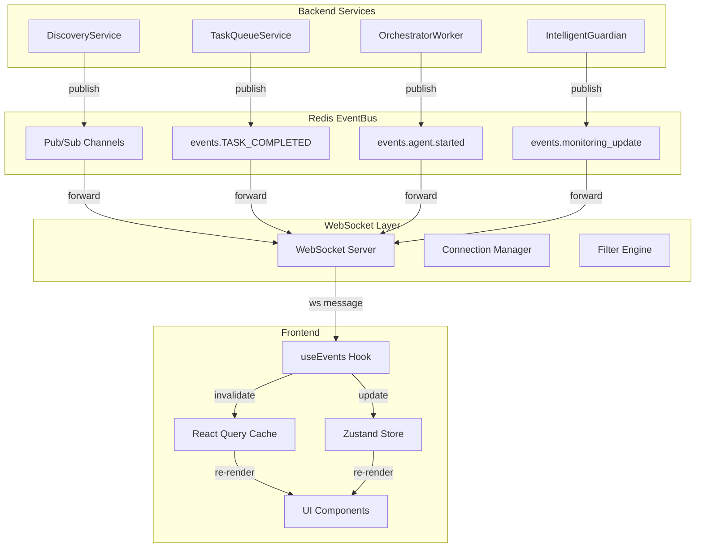
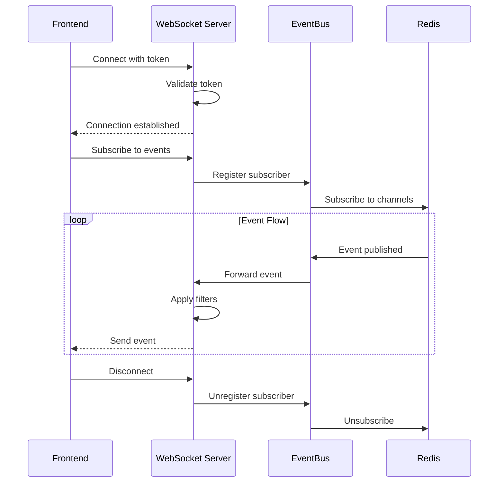

# Part 6: Real-Time Event System

**Status**: Implemented  
**Source Files**:
- `backend/omoi_os/services/event_bus.py` (166 lines)
- `frontend/hooks/useEvents.ts` (291 lines)
- `frontend/providers/WebSocketProvider.tsx`

**Related Docs**:
- [Part 2: Execution System](02-execution-system.md) — Sandbox execution events
- [Part 4: Readjustment System](04-readjustment-system.md) — Monitoring events
- [Part 5: Frontend Architecture](05-frontend-architecture.md) — WebSocket integration

---

## Purpose

The Real-Time Event System provides **live updates** across the OmoiOS platform. It enables the frontend to react instantly to backend changes — task completions, agent status updates, monitoring alerts — without polling.

The system uses **Redis pub/sub** as the backbone for inter-service communication, with WebSocket forwarding to the frontend for live monitoring dashboards.

---

## System Architecture



---

## EventBusService

The `EventBusService` in `backend/omoi_os/services/event_bus.py` wraps Redis pub/sub with typed event handling:

### SystemEvent Model

```python
class SystemEvent(BaseModel):
    """System-wide orchestration event."""
    
    event_type: str = Field(..., description="TASK_ASSIGNED, TASK_COMPLETED, etc.")
    entity_type: str = Field(..., description="Entity type: ticket, task, agent")
    entity_id: str = Field(..., description="ID of the entity")
    payload: Dict[str, Any] = Field(default_factory=dict, description="Event data")
```

### Publishing Events

```python
event_bus.publish(SystemEvent(
    event_type="TASK_COMPLETED",
    entity_type="task",
    entity_id=str(task.id),
    payload={
        "status": "done",
        "result": result_data,
        "agent_id": agent_id,
    }
))
```

### Subscribing to Events

```python
event_bus.subscribe("TASK_COMPLETED", handler_function)

# Handler signature
def handler_function(event: SystemEvent) -> None:
    print(f"Task {event.entity_id} completed")
```

### Channel Naming

Channels follow the pattern: `events.{EVENT_TYPE}`

Examples:
- `events.TASK_COMPLETED`
- `events.agent.started`
- `events.monitoring_update`

---

## Event Categories

### Agent & Sandbox Events

| Event | Source | Description |
|-------|--------|-------------|
| `agent.started` | ClaudeSandboxWorker | Agent begins execution |
| `agent.thinking` | ClaudeSandboxWorker | Agent reasoning step |
| `agent.message` | ClaudeSandboxWorker | Agent text output |
| `agent.completed` | ClaudeSandboxWorker | Agent finished task |
| `agent.error` | ClaudeSandboxWorker | Agent encountered error |
| `agent.tool_use` | ClaudeSandboxWorker | Tool invocation |
| `sandbox.heartbeat` | ClaudeSandboxWorker | Health check (every 30s) |

### Task Lifecycle Events

| Event | Source | Subscribers |
|-------|--------|-------------|
| `TASK_CREATED` | TaskQueueService | orchestrator_worker |
| `TASK_STARTED` | TaskQueueService | phase_manager, phase_progression |
| `TASK_COMPLETED` | TaskQueueService | synthesis_service, spec_task_execution |
| `TASK_FAILED` | TaskQueueService | spec_task_execution |
| `TASK_VALIDATION_PASSED` | ValidationOrchestrator | orchestrator_worker |
| `TASK_VALIDATION_FAILED` | ValidationOrchestrator | orchestrator_worker |

### Coordination Events

| Event | Source | Subscribers |
|-------|--------|-------------|
| `TICKET_CREATED` | TicketWorkflowOrchestrator | orchestrator_worker |
| `PHASE_TRANSITION` | PhaseManager | phase_progression |
| `coordination.join.created` | CoordinationService | synthesis_service |
| `synthesis.completed` | SynthesisService | convergence_merge_service |

### Discovery Events

| Event | Source | Purpose |
|-------|--------|---------|
| `discovery.recorded` | DiscoveryService | New discovery created |
| `discovery.branch_created` | DiscoveryService | Branch task spawned |
| `discovery.resolved` | DiscoveryService | Discovery marked resolved |

### Monitoring Events (Frontend-Bound)

| Event | Destination | Purpose |
|-------|-------------|---------|
| `monitoring_update` | WebSocket → Frontend | Guardian/Conductor analysis |
| `steering_issued` | WebSocket → Frontend | Agent intervention notifications |
| `task_updated` | WebSocket → Frontend | Task status changes |
| `ticket_updated` | WebSocket → Frontend | Ticket status changes |
| `agent_status_changed` | WebSocket → Frontend | Agent health changes |

---

## WebSocket Integration

### Frontend Hook: useEvents

The `useEvents` hook in `frontend/hooks/useEvents.ts` provides WebSocket connectivity:

```typescript
export interface SystemEvent {
  event_type: string;
  entity_type: string;
  entity_id: string;
  payload: Record<string, unknown>;
}

export interface UseEventsOptions {
  filters?: EventFilters;
  onEvent?: (event: SystemEvent) => void;
  enabled?: boolean;
  maxEvents?: number;
}

export function useEvents(options: UseEventsOptions = {}): UseEventsReturn {
  const { filters, onEvent, enabled = true, maxEvents = 100 } = options;
  
  const [events, setEvents] = useState<SystemEvent[]>([]);
  const [isConnected, setIsConnected] = useState(false);
  const wsRef = useRef<WebSocket | null>(null);
  
  // Build WebSocket URL with filters
  const buildWsUrl = useCallback(() => {
    const apiUrl = process.env.NEXT_PUBLIC_API_URL || "http://localhost:18000";
    const wsProtocol = apiUrl.startsWith("https") ? "wss:" : "ws:";
    const wsUrl = `${wsProtocol}//${new URL(apiUrl).host}/api/v1/ws/events`;
    
    const params = new URLSearchParams();
    if (token) params.set("token", token);
    if (filters?.event_types) params.set("event_types", filters.event_types.join(","));
    
    return params.toString() ? `${wsUrl}?${params.toString()}` : wsUrl;
  }, []);
  
  // Connect to WebSocket
  const connect = useCallback(() => {
    const ws = new WebSocket(buildWsUrl());
    
    ws.onopen = () => setIsConnected(true);
    
    ws.onmessage = (event) => {
      const data = JSON.parse(event.data);
      setEvents((prev) => [data, ...prev].slice(0, maxEvents));
      onEvent?.(data);
    };
    
    ws.onclose = () => {
      setIsConnected(false);
      // Auto-reconnect after 5s
      setTimeout(connect, 5000);
    };
    
    wsRef.current = ws;
  }, [buildWsUrl, maxEvents, onEvent]);
  
  useEffect(() => {
    if (enabled) connect();
    return () => wsRef.current?.close();
  }, [enabled, connect]);
  
  return { events, isConnected, connect, disconnect, clearEvents };
}
```

### Specialized Hooks

```typescript
// Subscribe to events for a specific entity
export function useEntityEvents(
  entityType: string,
  entityId: string | undefined,
  options: Omit<UseEventsOptions, "filters"> = {},
) {
  return useEvents({
    ...options,
    filters: entityId
      ? { entity_types: [entityType], entity_ids: [entityId] }
      : undefined,
    enabled: options.enabled !== false && !!entityId,
  });
}

// Subscribe to specific event types
export function useEventTypes(
  eventTypes: string[],
  options: Omit<UseEventsOptions, "filters"> = {},
) {
  return useEvents({
    ...options,
    filters: { event_types: eventTypes },
    enabled: options.enabled !== false && eventTypes.length > 0,
  });
}
```

---

## WebSocket Connection Lifecycle



### Reconnection Strategy

```typescript
// Auto-reconnect with exponential backoff
ws.onclose = (event) => {
  if (event.code !== 1000 && event.code !== 1001) {
    const delay = Math.min(5000 * Math.pow(2, reconnectAttempts), 30000);
    reconnectTimeoutRef.current = setTimeout(connect, delay);
    reconnectAttempts++;
  }
};
```

---

## Frontend Subscription Patterns

### React Query Integration

WebSocket events trigger cache invalidation:

```typescript
// hooks/useTasks.ts
export function useTasks() {
  const queryClient = useQueryClient();
  
  // Subscribe to task events
  useEventTypes(['TASK_CREATED', 'TASK_COMPLETED', 'TASK_UPDATED'], {
    onEvent: (event) => {
      // Invalidate tasks query
      queryClient.invalidateQueries({ queryKey: ['tasks'] });
      
      // Invalidate specific task if applicable
      if (event.entity_id) {
        queryClient.invalidateQueries({ 
          queryKey: ['tasks', event.entity_id] 
        });
      }
    },
  });
  
  return useQuery({
    queryKey: ['tasks'],
    queryFn: fetchTasks,
  });
}
```

### Zustand Integration

WebSocket events update global state:

```typescript
// stores/agentStore.ts
export const useAgentStore = create<AgentStore>()(
  subscribeWithSelector((set, get) => ({
    agents: [],
    
    handleAgentEvent: (event: SystemEvent) => {
      if (event.event_type === 'agent_status_changed') {
        set((state) => ({
          agents: state.agents.map(agent =>
            agent.id === event.entity_id
              ? { ...agent, status: event.payload.status }
              : agent
          )
        }));
      }
    },
  }))
);

// In component
useEventTypes(['agent_status_changed'], {
  onEvent: (event) => useAgentStore.getState().handleAgentEvent(event),
});
```

---

## Error Handling and Recovery

### WebSocket Error Handling

```typescript
ws.onerror = () => {
  console.error('[WebSocket] Error occurred');
  setError('WebSocket connection error');
  setIsConnecting(false);
};

ws.onclose = (event) => {
  // Don't reconnect on auth failures (4401)
  if (event.code === 4401) {
    setError('Authentication failed');
    return;
  }
  
  // Reconnect on other errors
  if (event.code !== 1000 && event.code !== 1001) {
    setTimeout(connect, 5000);
  }
};
```

### Backend Error Handling

```python
# EventBusService gracefully degrades when Redis unavailable
class EventBusService:
    def __init__(self, redis_url: str | None = None):
        try:
            self.redis_client = redis.from_url(redis_url, ...)
            self.redis_client.ping()
            self._available = True
        except redis.exceptions.ConnectionError:
            logger.warning("Redis connection failed, EventBus disabled")
            self._available = False
    
    def publish(self, event: SystemEvent) -> None:
        if not self._available:
            return  # Graceful no-op
        
        try:
            self.redis_client.publish(f"events.{event.event_type}", 
                                     event.model_dump_json())
        except redis.exceptions.ConnectionError:
            logger.warning("Redis connection lost during publish")
```

---

## Configuration and Environment Variables

### Backend Configuration

```yaml
# config/base.yaml
events:
  websocket_enabled: true
  redis_pubsub_enabled: true
  max_connections_per_client: 5
  connection_timeout_seconds: 30
```

### Frontend Configuration

```bash
# .env.local
NEXT_PUBLIC_API_URL=http://localhost:18000
NEXT_PUBLIC_WS_URL=ws://localhost:18000/ws
```

### WebSocket Server Settings

```python
# WebSocket configuration
WS_HEARTBEAT_INTERVAL = 30  # seconds
WS_MAX_CONNECTIONS = 1000
WS_MESSAGE_SIZE_LIMIT = 1024 * 1024  # 1MB
```

---

## Known Issues and Gaps

See [Integration Gaps](14-integration-gaps.md#gap-2-event-system-gaps) for the full list of events published with no subscribers (153 published vs 18 subscribed).

### Event System Gaps

| Issue | Impact | Status |
|-------|--------|--------|
| 153 events published with no subscribers | Wasted Redis bandwidth | Known |
| Missing event documentation | Hard to discover events | In progress |
| No event versioning | Breaking changes possible | Planned |

---

## Key Files Reference

| File | Purpose | Lines |
|------|---------|-------|
| `backend/omoi_os/services/event_bus.py` | Redis pub/sub wrapper | 166 |
| `frontend/hooks/useEvents.ts` | WebSocket hook | 291 |
| `frontend/providers/WebSocketProvider.tsx` | WebSocket provider | — |
| `backend/omoi_os/api/routes/events.py` | WebSocket endpoint | — |

---

## Related Documentation

### Architecture Deep-Dives
- [Part 2: Execution System](02-execution-system.md) — Sandbox execution events
- [Part 4: Readjustment System](04-readjustment-system.md) — Monitoring events
- [Part 5: Frontend Architecture](05-frontend-architecture.md) — WebSocket integration

### Design Docs
- React Query + WebSocket
- Frontend Architecture
- Communication Patterns

### Page Flows
- [10 - Command Center](../page_flows/10_command_center.md) — Real-time dashboard
- [10a - Monitoring System](../page_flows/10a_monitoring_system.md) — Live monitoring UI
- [13 - Sandbox System](../page_flows/13_sandbox_system.md) — Sandbox event viewer

### Requirements
- [Monitoring Architecture](../requirements/monitoring/monitoring_architecture.md)
