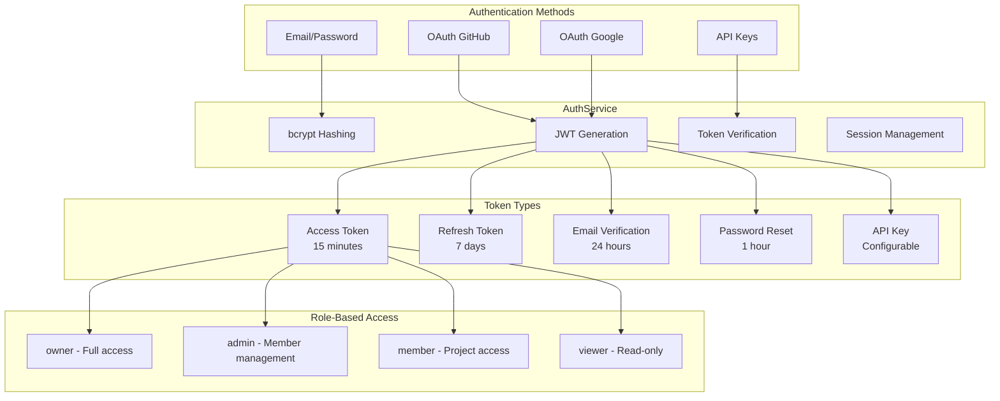
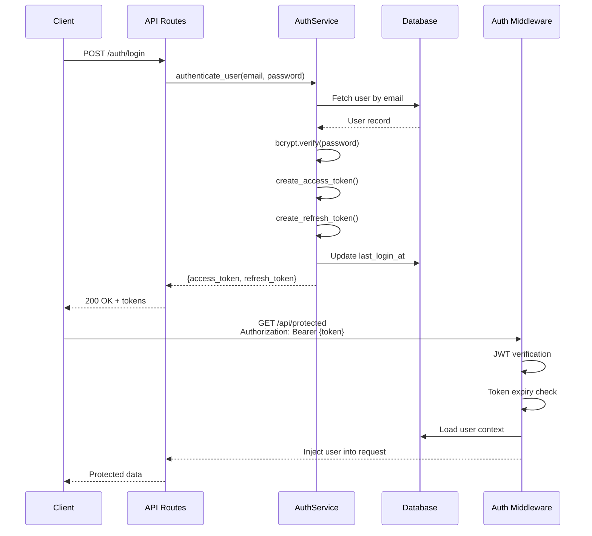

# Part 7: Authentication & Security

**Status**: Implemented  
**Source Files**:
- `backend/omoi_os/services/auth_service.py` (526 lines)
- `backend/omoi_os/models/user.py` (114 lines)
- `backend/omoi_os/api/routes/auth.py` (authentication endpoints)
- `backend/omoi_os/api/routes/oauth.py` (OAuth flows)

**Related Docs**:
- [Part 5: Frontend Architecture](05-frontend-architecture.md) — Auth UI integration
- [Part 8: Billing & Subscriptions](08-billing-and-subscriptions.md) — Payment auth
- [Part 11: Database Schema](11-database-schema.md) — Auth models

---

## Purpose

The Authentication & Security system provides **secure access control** for OmoiOS. It uses self-hosted JWT authentication with bcrypt password hashing, refresh tokens, and role-based access control. The system supports multiple authentication methods: email/password, OAuth (GitHub, Google), and API keys for automation.

Security is prioritized at every layer:
- **Passwords**: bcrypt hashing with configurable work factor
- **Tokens**: Short-lived access tokens (15 min), longer refresh tokens (7 days)
- **API Keys**: Scoped, revocable, with usage tracking
- **RBAC**: Organization-level roles with granular permissions

---

## System Architecture



---

## Implementation Status

| Feature | Status | Notes |
|---------|--------|-------|
| Email/password registration | ✅ Implemented | bcrypt hashing via `passlib` |
| JWT access tokens | ✅ Implemented | 15-minute expiry, `python-jose` |
| Refresh tokens | ✅ Implemented | 7-day expiry |
| Email verification | ⚠️ Partial | Token generation works, email sending pending |
| Password reset | ⚠️ Partial | Token generation works, email sending pending |
| OAuth (GitHub/Google) | ✅ Implemented | OAuth routes in `oauth.py` |
| API keys (agent-scoped) | ✅ Implemented | For sandbox/automation access |
| Role-based access control | ✅ Implemented | Organization-level roles |

---

## Authentication Flow



---

## Token Types

| Token | Lifetime | Purpose | Storage |
|-------|----------|---------|---------|
| **Access Token** | 15 minutes | API request authentication | Memory only |
| **Refresh Token** | 7 days | Access token renewal | Secure cookie |
| **Email Verification** | 24 hours | Account activation | URL parameter |
| **Password Reset** | 1 hour | Password recovery | URL parameter |
| **API Key** | Configurable | Agent/automation access | Client secret store |

### Token Structure (JWT)

```python
# Access token payload
{
    "sub": "user-uuid",
    "exp": 1234567890,  # Unix timestamp
    "iat": 1234567800,  # Issued at
    "type": "access",
    "jti": "unique-token-id"
}

# Refresh token payload
{
    "sub": "user-uuid",
    "exp": 1234567890,
    "iat": 1234567800,
    "type": "refresh",
    "jti": "unique-token-id"
}
```

---

## AuthService

The `AuthService` class in `backend/omoi_os/services/auth_service.py` provides core authentication operations.

### Core Methods

#### Password Operations

```python
def hash_password(self, password: str) -> str:
    """Hash password using bcrypt."""
    return bcrypt.hashpw(password.encode("utf-8"), bcrypt.gensalt()).decode("utf-8")

def verify_password(self, plain_password: str, hashed_password: str) -> bool:
    """Verify password against hash."""
    return bcrypt.checkpw(
        plain_password.encode("utf-8"),
        hashed_password.encode("utf-8")
    )
```

#### Token Operations

```python
def create_access_token(
    self, user_id: UUID, expires_delta: Optional[timedelta] = None
) -> Tuple[str, str]:
    """Create JWT access token. Returns (token, jti)."""
    expire = utc_now() + (expires_delta or timedelta(minutes=15))
    jti = str(uuid4())
    payload = {
        "sub": str(user_id),
        "exp": expire.timestamp(),
        "iat": utc_now().timestamp(),
        "type": "access",
        "jti": jti,
    }
    token = jwt.encode(payload, self.jwt_secret, algorithm="HS256")
    return token, jti

def verify_token(self, token: str, token_type: str = "access") -> Optional[TokenData]:
    """Verify JWT and return token data."""
    try:
        payload = jwt.decode(token, self.jwt_secret, algorithms=["HS256"])
        if payload.get("type") != token_type:
            return None
        return TokenData(
            user_id=UUID(payload.get("sub")),
            token_type=payload.get("type"),
            jti=payload.get("jti"),
        )
    except (JWTError, ValueError, KeyError):
        return None
```

#### User Operations

```python
async def register_user(
    self,
    email: str,
    password: str,
    full_name: Optional[str] = None,
) -> User:
    """Register a new user with password validation."""
    # Check if user exists
    existing = await self.get_user_by_email(email)
    if existing:
        raise ValueError("Email already registered")
    
    # Validate password strength
    is_valid, error = self.validate_password_strength(password)
    if not is_valid:
        raise ValueError(error)
    
    # Create user
    user = User(
        email=email,
        hashed_password=self.hash_password(password),
        full_name=full_name,
        is_verified=False,
        is_active=True,
        waitlist_status="approved",
    )
    self.db.add(user)
    await self.db.commit()
    return user

async def authenticate_user(self, email: str, password: str) -> Optional[User]:
    """Authenticate user by email and password."""
    user = await self.get_user_by_email(email)
    if not user or not user.hashed_password:
        return None
    if not self.verify_password(password, user.hashed_password):
        return None
    
    # Update last login
    user.last_login_at = utc_now()
    await self.db.commit()
    return user
```

---

## Password Validation

The system enforces strong password requirements:

```python
def validate_password_strength(self, password: str) -> Tuple[bool, Optional[str]]:
    if len(password) < 8:
        return False, "Password must be at least 8 characters"
    
    if not any(c.isupper() for c in password):
        return False, "Password must contain at least one uppercase letter"
    
    if not any(c.islower() for c in password):
        return False, "Password must contain at least one lowercase letter"
    
    if not any(c.isdigit() for c in password):
        return False, "Password must contain at least one digit"
    
    if not re.search(r'[!@#$%^&*(),.?":{}|<>'"'"'\[\]\\~`_+\-/=;'"'"']', password):
        return False, "Password must contain at least one special character"
    
    # Check common passwords
    common = {"password", "12345678", "qwerty123", "password123", ...}
    if password.lower() in common:
        return False, "This password is too common"
    
    return True, None
```

---

## Role-Based Access Control

Organization-level roles control permissions:

| Role | Capabilities | Use Case |
|------|--------------|----------|
| `owner` | Full access, billing, member management, delete org | Organization creator |
| `admin` | Member management, project CRUD, settings | Team leads |
| `member` | Project access, task execution, spec creation | Developers |
| `viewer` | Read-only access to projects and dashboards | Stakeholders |

### Permission Matrix

| Permission | owner | admin | member | viewer |
|------------|-------|-------|--------|--------|
| View projects | ✅ | ✅ | ✅ | ✅ |
| Create projects | ✅ | ✅ | ✅ | ❌ |
| Delete projects | ✅ | ✅ | ❌ | ❌ |
| Manage members | ✅ | ✅ | ❌ | ❌ |
| Manage billing | ✅ | ❌ | ❌ | ❌ |
| Delete organization | ✅ | ❌ | ❌ | ❌ |
| Execute tasks | ✅ | ✅ | ✅ | ❌ |
| View agents | ✅ | ✅ | ✅ | ✅ |

---

## API Key Management

API keys provide scoped access for automation and agents:

```python
async def create_api_key(
    self,
    user_id: UUID,
    name: str,
    scopes: Optional[list[str]] = None,
    organization_id: Optional[UUID] = None,
    expires_in_days: Optional[int] = None,
) -> Tuple[APIKey, str]:
    """Create API key for user. Returns (APIKey object, full_key_string)."""
    full_key, prefix, hashed_key = self.generate_api_key()
    
    expires_at = None
    if expires_in_days:
        expires_at = utc_now() + timedelta(days=expires_in_days)
    
    api_key = APIKey(
        user_id=user_id,
        organization_id=organization_id,
        name=name,
        key_prefix=prefix,
        hashed_key=hashed_key,
        scopes=scopes or [],
        is_active=True,
        expires_at=expires_at,
    )
    
    self.db.add(api_key)
    await self.db.commit()
    
    return api_key, full_key  # Full key shown only once!

async def verify_api_key(self, key: str) -> Optional[Tuple[User, APIKey]]:
    """Verify API key and return associated user."""
    hashed_key = hashlib.sha256(key.encode()).hexdigest()
    
    result = await self.db.execute(
        select(APIKey)
        .where(APIKey.hashed_key == hashed_key, APIKey.is_active.is_(True))
        .where((APIKey.expires_at.is_(None)) | (APIKey.expires_at > utc_now()))
    )
    api_key = result.scalar_one_or_none()
    
    if not api_key:
        return None
    
    # Update last_used_at
    api_key.last_used_at = utc_now()
    await self.db.commit()
    
    return api_key.user, api_key
```

### API Key Format

```
sk_live_{32_char_random_string}

Example: REDACTED_STRIPE_KEY
```

---

## User Model

The `User` model in `backend/omoi_os/models/user.py` defines the user entity:

```python
class User(Base):
    """User model for authentication and multi-tenant organizations."""
    
    __tablename__ = "users"
    
    # Identity
    id: Mapped[UUID] = mapped_column(PGUUID(as_uuid=True), primary_key=True, default=uuid4)
    email: Mapped[str] = mapped_column(String(255), nullable=False, unique=True, index=True)
    hashed_password: Mapped[Optional[str]] = mapped_column(String(255), nullable=True)
    full_name: Mapped[Optional[str]] = mapped_column("name", String(255), nullable=True)
    avatar_url: Mapped[Optional[str]] = mapped_column(Text, nullable=True)
    
    # Status
    is_active: Mapped[bool] = mapped_column(Boolean, default=True, nullable=False)
    is_verified: Mapped[bool] = mapped_column(Boolean, default=False, nullable=False)
    is_super_admin: Mapped[bool] = mapped_column(Boolean, default=False, nullable=False, index=True)
    
    # ABAC Attributes
    department: Mapped[Optional[str]] = mapped_column(String(100), nullable=True, index=True)
    attributes: Mapped[Optional[dict]] = mapped_column(JSONB, nullable=True)
    
    # Waitlist (default "approved")
    waitlist_status: Mapped[str] = mapped_column(String(20), default="approved", nullable=False, index=True)
    waitlist_metadata: Mapped[Optional[dict]] = mapped_column(JSONB, nullable=True)
    
    # Timestamps
    created_at: Mapped[datetime] = mapped_column(DateTime(timezone=True), nullable=False, default=utc_now, index=True)
    updated_at: Mapped[datetime] = mapped_column(DateTime(timezone=True), nullable=False, default=utc_now, onupdate=utc_now)
    last_login_at: Mapped[Optional[datetime]] = mapped_column(DateTime(timezone=True), nullable=True)
    
    # Soft delete
    deleted_at: Mapped[Optional[datetime]] = mapped_column(DateTime(timezone=True), nullable=True, index=True)
    
    # Relationships
    memberships: Mapped[list["OrganizationMembership"]] = relationship(back_populates="user")
    owned_organizations: Mapped[list["Organization"]] = relationship(back_populates="owner")
    api_keys: Mapped[list["APIKey"]] = relationship(back_populates="user")
    sessions: Mapped[list["Session"]] = relationship(back_populates="user")
```

---

## Security Considerations

### Password Security

- **bcrypt hashing**: Industry standard, configurable work factor
- **Salt generation**: Automatic per-password salt
- **Password history**: Not currently implemented (planned)

### Token Security

- **Short-lived access tokens**: 15 minutes minimizes exposure
- **Refresh token rotation**: New refresh token on each use (planned)
- **Token binding**: Not currently implemented (planned)
- **Revocation**: JWT jti tracking for blacklist (planned)

### API Key Security

- **One-time display**: Full key shown only at creation
- **Prefix storage**: Only prefix stored in plaintext for identification
- **Hash verification**: SHA-256 hash for verification
- **Usage tracking**: last_used_at timestamp
- **Scope enforcement**: Permission checks on each use

### Session Security

- **Token hashing**: Session tokens hashed with SHA-256
- **Expiry**: 7-day default session lifetime
- **IP/User-Agent tracking**: For audit purposes
- **Invalidation**: Immediate on logout

---

## Configuration and Environment Variables

### JWT Settings

```yaml
# config/base.yaml
auth:
  jwt_algorithm: HS256
  access_token_expire_minutes: 15
  refresh_token_expire_days: 7
  password_reset_expire_hours: 1
  email_verification_expire_hours: 24
```

### Environment Variables

```bash
# .env
AUTH_JWT_SECRET_KEY=your-secret-key-here  # Required
AUTH_JWT_ALGORITHM=HS256
AUTH_ACCESS_TOKEN_EXPIRE_MINUTES=15
AUTH_REFRESH_TOKEN_EXPIRE_DAYS=7

# OAuth credentials
GITHUB_CLIENT_ID=your-github-client-id
GITHUB_CLIENT_SECRET=your-github-secret
GOOGLE_CLIENT_ID=your-google-client-id
GOOGLE_CLIENT_SECRET=your-google-secret
```

---

## Error Handling

### Authentication Failures

| Scenario | Response | Logging |
|----------|----------|---------|
| Invalid credentials | 401 Unauthorized | Generic message (no user enumeration) |
| Expired token | 401 Unauthorized | Token expired |
| Invalid token | 401 Unauthorized | Token invalid |
| Revoked API key | 401 Unauthorized | Key revoked |
| Insufficient permissions | 403 Forbidden | Permission denied |

### Rate Limiting

```python
# Planned implementation
@rate_limit(max_requests=5, window=60)  # 5 attempts per minute
def login_endpoint():
    ...
```

---

## Integration with Other Systems

### Frontend Integration

The frontend uses the `useAuth` hook for authentication:

```typescript
// hooks/useAuth.ts
export function useAuth() {
  const { login, register, logout, user, isAuthenticated } = useAuthStore();
  
  return {
    login: async (email: string, password: string) => {
      const { access_token, refresh_token } = await api.login(email, password);
      localStorage.setItem('access_token', access_token);
      setCookie('refresh_token', refresh_token);
      await fetchUser();
    },
    logout: () => {
      localStorage.removeItem('access_token');
      deleteCookie('refresh_token');
      logout();
    },
    user,
    isAuthenticated,
  };
}
```

### Billing Integration

Authentication required for billing operations:

```python
# Billing endpoints require authenticated user
@router.get("/billing/subscription")
async def get_subscription(
    current_user: User = Depends(get_current_user),
):
    """Get current subscription for authenticated user."""
    return await billing_service.get_subscription(current_user.id)
```

### Organization Integration

RBAC enforced at organization level:

```python
# Check organization permissions
async def check_organization_permission(
    user: User,
    organization_id: UUID,
    required_role: str,
) -> bool:
    membership = await get_membership(user.id, organization_id)
    if not membership:
        return False
    
    role_hierarchy = {"viewer": 1, "member": 2, "admin": 3, "owner": 4}
    return role_hierarchy[membership.role] >= role_hierarchy[required_role]
```

---

## Key Files Reference

| File | Purpose | Lines |
|------|---------|-------|
| `backend/omoi_os/services/auth_service.py` | Core auth logic | 526 |
| `backend/omoi_os/models/user.py` | User model | 114 |
| `backend/omoi_os/models/auth.py` | Session, APIKey models | — |
| `backend/omoi_os/api/routes/auth.py` | Auth endpoints | — |
| `backend/omoi_os/api/routes/oauth.py` | OAuth endpoints | — |

---

## Pending Implementations

- `auth.py:199` — Track logout in audit log
- `auth.py:284` — Send email with reset link (email sending not implemented)
- Implement refresh token rotation
- Add rate limiting for auth endpoints
- Implement JWT revocation (blacklist)
- Add password history validation
- Implement MFA/2FA

---

## Related Documentation

### Architecture Deep-Dives
- [Part 5: Frontend Architecture](05-frontend-architecture.md) — Auth UI integration
- [Part 8: Billing & Subscriptions](08-billing-and-subscriptions.md) — Payment auth
- [Part 11: Database Schema](11-database-schema.md) — Auth models

### Design Docs
- Auth System Plan — Full auth design
- Frontend Auth Scaffold — UI implementation
- Organization Auth — Multi-tenant auth
- Security Audit — Security review

### Page Flows
- [01 - Authentication](../page_flows/01_authentication.md) — Login, register, OAuth flows
- [15 - Settings (Expanded)](../page_flows/15_settings_expanded.md) — User settings

### Requirements
- [Auth System](../requirements/auth/auth_system.md) — Authentication requirements
