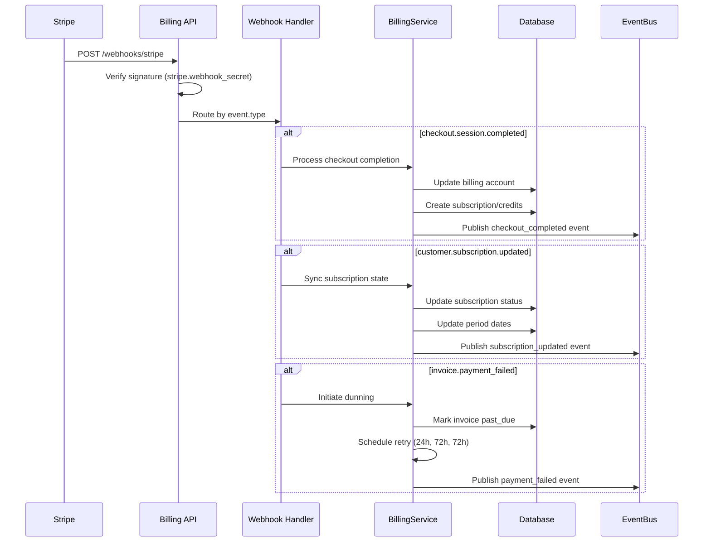
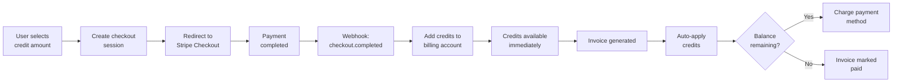
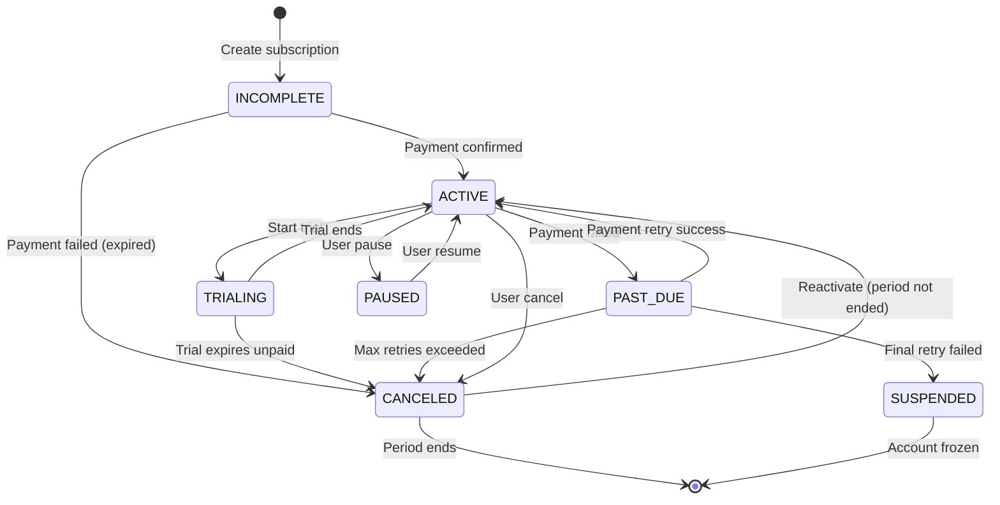
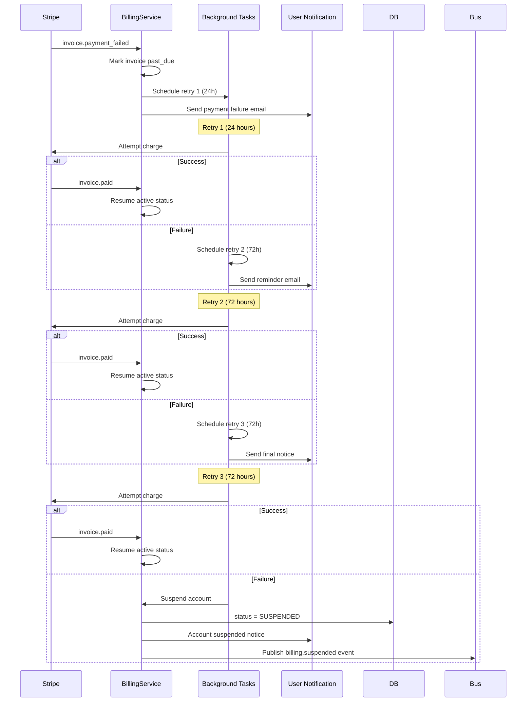
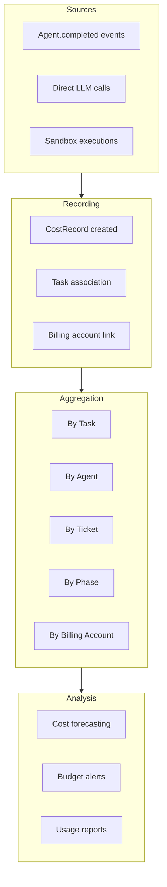

# Part 8: Billing & Subscriptions

> Summary doc — this system has no prior design doc; this is the primary architecture reference.

## Overview

OmoiOS uses **Stripe** for payment processing with a tier-based subscription model, prepaid credit purchases, and usage-based billing for workflow executions.

## Billing Tiers

| Tier | Price | Workflows/mo | Agents | Storage | BYO Keys |
|------|-------|-------------|--------|---------|----------|
| **Free** | $0 | 5 | 1 | 2 GB | No |
| **Pro** | $299/mo | 100 | 5 | 50 GB | Yes |
| **Team** | $999/mo | 500 | 10 | 500 GB | Yes |
| **Enterprise** | Custom | Unlimited | Unlimited | Unlimited | Yes |
| **Lifetime** | $499 one-time | 50 | 5 | 50 GB | Yes |

## Architecture

```
┌──────────────────────────────────────────────────────────────────────┐
│                            Frontend                                  │
│  Checkout Flow → Billing Management → Usage Dashboard                │
└────────────────────────────┬─────────────────────────────────────────┘
                             │
                             ▼
┌──────────────────────────────────────────────────────────────────────┐
│                     Billing API Routes                               │
│  billing.py (~2400 lines)                                            │
│  ┌──────────┐ ┌────────────┐ ┌──────────┐ ┌──────────┐ ┌─────────┐ │
│  │Checkout  │ │Subscriptions│ │ Invoices │ │ Payments │ │ Promo   │ │
│  │Sessions  │ │ & Tiers    │ │          │ │          │ │ Codes   │ │
│  └────┬─────┘ └─────┬──────┘ └────┬─────┘ └────┬─────┘ └────┬────┘ │
└───────┼──────────────┼─────────────┼────────────┼────────────┼──────┘
        │              │             │            │            │
        ▼              ▼             ▼            ▼            ▼
┌──────────────────────────────────────────────────────────────────────┐
│                      Service Layer                                    │
│  ┌─────────────────┐  ┌───────────────────┐  ┌────────────────────┐ │
│  │ BillingService   │  │SubscriptionService│  │ CostTrackingService│ │
│  │ - Account mgmt   │  │ - Tier limits     │  │ - LLM cost/task    │ │
│  │ - Usage tracking │  │ - Upgrade/down    │  │ - Sandbox cost     │ │
│  │ - Invoice gen    │  │ - Pause/resume    │  │ - Cost forecasting │ │
│  │ - Quota enforce  │  │ - BYO keys        │  │ - Per-org rollups  │ │
│  └────────┬────────┘  └───────────────────┘  └────────────────────┘ │
│           │                                                           │
│  ┌────────▼────────┐  ┌───────────────────┐                         │
│  │  StripeService   │  │ Background Tasks  │                         │
│  │  - Customers     │  │ - Dunning (6h)    │                         │
│  │  - Payments      │  │ - Reminders (daily)│                        │
│  │  - Subscriptions │  │ - Invoice gen (mo) │                        │
│  │  - Refunds       │  │ - Low credit (daily)│                       │
│  │  - Portal        │  └───────────────────┘                         │
│  │  - Webhooks      │                                                │
│  └──────────────────┘                                                │
└──────────────────────────────────────────────────────────────────────┘
        │
        ▼
┌──────────────────────────────────────────────────────────────────────┐
│  Stripe API                                                          │
│  Webhook Events: checkout.session.completed,                         │
│  customer.subscription.{created,updated,deleted},                    │
│  invoice.{paid,payment_failed}                                       │
└──────────────────────────────────────────────────────────────────────┘
```

## Key Capabilities

### Stripe Integration
- Customer creation linked to OmoiOS organizations
- Checkout sessions for credit purchases, lifetime purchases, and subscriptions
- Customer portal for self-service payment method management
- Webhook handler with signature verification for 6 event types
- Payment intents for automated dunning (off-session charges)
- Full refund support with reason tracking

### Subscription Management
- 5 tiers with configurable limits (workflows, agents, storage)
- Upgrade/downgrade with tier limit adjustment
- Pause/resume subscriptions
- Lifetime one-time purchase option ($499)
- BYO (Bring Your Own) API keys feature (available on Pro, Team, Enterprise, Lifetime)
- Automatic monthly usage reset

### Usage Tracking & Enforcement
- `check_and_reserve_workflow()` validates quota before execution starts
- Consumption priority: subscription quota → free tier quota → prepaid credits
- Reservation pattern prevents over-consumption during parallel execution
- Per-task LLM cost tracking (prompt/completion tokens, model, provider)
- Per-sandbox cost aggregation
- Cost forecasting for pending tasks

### Invoice & Payment Processing
- Auto-generates monthly invoices from unbilled usage records
- Credits applied automatically to outstanding balance
- Automated dunning: 3 retries (24h, 72h, 72h) before account suspension
- Daily payment reminders for invoices due within 3 days
- Low credit balance warnings ($5 threshold)

### Promo Codes
- Discount types: PERCENTAGE, FIXED_AMOUNT, FULL_BYPASS, TRIAL_EXTENSION
- Usage limits, validity periods, tier restrictions
- Redemption tracking with audit trail

### Analytics (PostHog Integration)
- Tracked events: `checkout_completed`, `subscription_created`, `subscription_canceled`, `payment_failed`, `payment_succeeded`

## Database Tables

| Table | Purpose |
|-------|---------|
| `billing_accounts` | Organization billing state, Stripe customer link, credit balance |
| `subscriptions` | Tier, status, usage limits, Stripe subscription link |
| `invoices` | Billing period, line items (JSONB), payment status |
| `payments` | Payment intents, charges, refund tracking |
| `usage_records` | Per-workflow usage with token details (JSONB) |
| `cost_records` | Per-task/agent/sandbox LLM cost breakdown |
| `promo_codes` | Discount definitions with usage tracking |
| `promo_code_redemptions` | Redemption audit trail |

## Key Files

| File | Purpose |
|------|---------|
| `backend/omoi_os/api/routes/billing.py` | Billing API endpoints (~2400 lines) |
| `backend/omoi_os/services/billing_service.py` | Account management, usage tracking, invoicing |
| `backend/omoi_os/services/stripe_service.py` | Stripe API wrapper (customers, payments, webhooks) |
| `backend/omoi_os/services/subscription_service.py` | Tier management, quota enforcement |
| `backend/omoi_os/services/cost_tracking.py` | Per-task/agent/sandbox cost tracking |
| `backend/omoi_os/services/budget_enforcer.py` | Budget limit enforcement |
| `backend/omoi_os/tasks/billing_tasks.py` | Background tasks (dunning, invoicing, reminders) |
| `backend/omoi_os/models/billing.py` | BillingAccount, Invoice, Payment, UsageRecord models |
| `backend/omoi_os/models/subscription.py` | Subscription model with tier limits |
| `backend/omoi_os/models/cost_record.py` | Cost record model |
| `backend/omoi_os/models/promo_code.py` | PromoCode and PromoCodeRedemption models |

## API Endpoints

| Endpoint | Method | Purpose |
|----------|--------|---------|
| `/api/v1/billing/account/{org_id}` | GET | Get/create billing account |
| `/api/v1/billing/account/{org_id}/credits` | POST | Add prepaid credits |
| `/api/v1/billing/checkout/credits` | POST | Stripe credit purchase checkout |
| `/api/v1/billing/checkout/lifetime` | POST | Stripe lifetime purchase checkout |
| `/api/v1/billing/subscriptions/checkout` | POST | Stripe subscription checkout |
| `/api/v1/billing/subscriptions/{org_id}` | GET | Get active subscription |
| `/api/v1/billing/subscriptions/{id}/cancel` | POST | Cancel subscription |
| `/api/v1/billing/subscriptions/{id}/upgrade` | POST | Upgrade tier |
| `/api/v1/billing/subscriptions/{id}/downgrade` | POST | Downgrade tier |
| `/api/v1/billing/invoices/{org_id}` | GET | List invoices |
| `/api/v1/billing/invoices/{id}/pay` | POST | Pay invoice |
| `/api/v1/billing/payment-methods` | POST | Attach payment method |
| `/api/v1/billing/portal/{org_id}` | GET | Stripe Customer Portal URL |
| `/api/v1/billing/usage/{org_id}` | GET | Usage summary |
| `/api/v1/billing/costs/{scope}/{id}` | GET | Cost breakdown |
| `/api/v1/billing/promo-codes/validate` | POST | Validate promo code |
| `/api/v1/billing/promo-codes/redeem` | POST | Redeem promo code |
| `/api/v1/billing/webhooks/stripe` | POST | Stripe webhook handler |
| `/api/v1/billing/config` | GET | Stripe publishable key |

## Known TODOs

- Budget/cost events (`BUDGET_EXCEEDED`, `BUDGET_WARNING`, `COST_RECORDED`) are published but have no subscribers (see [Integration Gaps](14-integration-gaps.md#gap-2-event-system-gaps))
- Tax calculation is manual (not automated)
- Multi-currency not yet supported (USD only)
- BYO API key storage/rotation not implemented


## Related Documentation

### Architecture Deep-Dives
- [Part 7: Auth & Security](07-auth-and-security.md) — Payment authentication
- [Part 11: Database Schema](11-database-schema.md) — Billing models
- [Part 14: Integration Gaps](14-integration-gaps.md) — Billing event gaps

### Design Docs
- Pricing Strategy — Tier design
- User Journeys & Page Flows — Billing UX

### Page Flows
- [14 - Billing](../page_flows/14_billing.md) — Billing management UI
- [11 - Cost Management](../page_flows/11_cost_management.md) — Usage tracking

### Requirements
- [Result Submission](../requirements/workflows/result_submission.md) — Workflow completion tracking

## Stripe Webhook Flow

Stripe webhooks are the backbone of real-time billing state synchronization. The system handles 6 core event types with signature verification and idempotent processing.



### Webhook Event Processing

| Event Type | Handler | Action |
|------------|---------|--------|
| `checkout.session.completed` | `handle_checkout_completed()` | Create subscription or add credits |
| `customer.subscription.created` | `handle_subscription_created()` | Link Stripe sub to local record |
| `customer.subscription.updated` | `handle_subscription_updated()` | Sync status, period dates |
| `customer.subscription.deleted` | `handle_subscription_deleted()` | Mark canceled, cleanup |
| `invoice.paid` | `handle_invoice_paid()` | Mark invoices paid |
| `invoice.payment_failed` | `handle_payment_failed()` | Start dunning sequence |

### Webhook Security

- **Signature verification**: All webhooks verified using `stripe.Webhook.construct_event()`
- **Idempotency**: Event IDs tracked to prevent duplicate processing
- **Replay protection**: Timestamps validated to prevent replay attacks
- **Source IP allowlist**: Stripe webhook IPs configurable for additional security

---

## Credit Purchase Flow

Prepaid credits provide a flexible pay-as-you-go option for users who prefer not to subscribe. Credits are applied automatically to invoices before charging payment methods.



### Credit Application Logic

```python
# From billing_service.py - Invoice generation
def generate_invoice(self, billing_account_id: UUID) -> Invoice:
    # ... create invoice with line items ...
    
    # Apply credits if available
    if account.credit_balance > 0 and invoice.total > 0:
        credits_to_apply = min(account.credit_balance, invoice.total)
        invoice.credits_applied = credits_to_apply
        account.credit_balance -= credits_to_apply
        invoice._recalculate_totals()
```

### Credit Balance Management

| Operation | Source | Credit Impact |
|-----------|--------|---------------|
| Purchase | Stripe checkout | +$amount |
| Invoice payment | Auto-applied | -$amount_used |
| Refund | Admin action | +$refund_amount |
| Adjustment | Admin action | ±$adjustment |

---

## Subscription Lifecycle State Machine

Subscriptions follow a formal state machine with transitions triggered by user actions, Stripe webhooks, or automated processes.



### State Transitions

| From | To | Trigger | Action |
|------|-----|---------|--------|
| `incomplete` | `active` | `checkout.session.completed` | Activate subscription |
| `trialing` | `active` | Trial period end | Convert to paid |
| `active` | `past_due` | `invoice.payment_failed` | Start dunning |
| `past_due` | `active` | `invoice.paid` | Resume normal |
| `active` | `canceled` | User cancellation | Set cancel_at_period_end |
| `canceled` | `active` | Reactivation | Clear cancellation |

### Tier Upgrade/Downgrade Logic

```python
# From subscription_service.py
def upgrade_tier(self, subscription_id: UUID, new_tier: SubscriptionTier):
    # Immediate upgrade with proration
    subscription.upgrade_to_tier(new_tier)
    # Stripe handles proration automatically
    
def downgrade_tier(self, subscription_id: UUID, new_tier: SubscriptionTier, at_period_end: bool = True):
    if at_period_end:
        # Store pending tier in config
        subscription.subscription_config['pending_tier'] = new_tier.value
    else:
        # Immediate downgrade
        subscription.apply_tier_limits(new_tier)
```

---

## Dunning Sequence

Failed payments trigger an automated dunning process with escalating retry attempts before account suspension.



### Dunning Configuration

| Retry | Delay | Action |
|-------|-------|--------|
| 1 | 24 hours | Retry charge, send email |
| 2 | 72 hours | Retry charge, send reminder |
| 3 | 72 hours | Retry charge, final notice |
| Final | Immediate | Suspend account |

### Account Suspension

When an account is suspended:
- All workflow execution is blocked (`can_execute_workflow()` returns False)
- Existing sandboxes are allowed to complete but no new ones start
- User receives suspension notice with reactivation instructions
- Account can be reactivated by updating payment method and paying outstanding balance

---

## Cost Tracking Aggregation

The CostTrackingService provides granular visibility into LLM API costs across multiple dimensions.



### Cost Record Structure

```python
# From cost_record.py
class CostRecord:
    task_id: str           # Associated task
    agent_id: Optional[str]  # Executing agent
    sandbox_id: Optional[str]  # Sandbox environment
    billing_account_id: UUID  # For org aggregation
    
    provider: str          # 'anthropic', 'openai', etc.
    model: str             # 'claude-sonnet-4', 'gpt-4', etc.
    
    prompt_tokens: int
    completion_tokens: int
    total_tokens: int
    
    prompt_cost: float     # USD
    completion_cost: float   # USD
    total_cost: float      # USD
```

### Cost Aggregation Queries

```python
# From cost_tracking.py - get_cost_summary()
def get_cost_summary(self, scope_type: str, scope_id: str) -> dict:
    # scope_type: 'agent', 'task', 'ticket', 'phase', 'billing_account', 'global'
    query = select(
        CostRecord.provider,
        CostRecord.model,
        func.sum(CostRecord.total_cost).label('total_cost'),
        func.sum(CostRecord.total_tokens).label('total_tokens'),
        func.count(CostRecord.id).label('record_count'),
    ).group_by(CostRecord.provider, CostRecord.model)
```

### Cost Forecasting

```python
# From cost_tracking.py
def forecast_costs(self, pending_task_count: int) -> dict:
    avg_tokens_per_task = 5000  # Configurable
    buffer_multiplier = 1.2       # 20% safety buffer
    
    cost_per_task = calculate_cost(provider, model, tokens)
    estimated_cost = cost_per_task * pending_task_count * buffer_multiplier
```

---

## Frontend Billing Components

The billing UI is built with React/Next.js and integrates Stripe.js for secure payment handling.

### Component Architecture

```mermaid
flowchart TB
    subgraph Pages
        P1[/billing/]
        P2[/billing/checkout/]
        P3[/billing/success/]
        P4[/billing/cancel/]
    end
    
    subgraph Components
        C1[BillingDashboard]
        C2[SubscriptionCard]
        C3[UsageChart]
        C4[InvoiceList]
        C5[CreditPurchase]
        C6[PaymentMethodForm]
    end
    
    subgraph Stripe Integration
        S1[StripeProvider]
        S2[Elements]
        S3[CardElement]
        S4[CheckoutRedirect]
    end
    
    subgraph State
        H1[useBilling() hook]
        H2[useSubscription() hook]
        H3[useUsage() hook]
    end
    
    Pages --> Components
    Components --> Stripe Integration
    Components --> State
```

### Key Frontend Files

| File | Purpose |
|------|---------|
| `frontend/app/(app)/billing/page.tsx` | Main billing dashboard |
| `frontend/components/billing/SubscriptionCard.tsx` | Tier display, upgrade/downgrade |
| `frontend/components/billing/UsageChart.tsx` | Token/cost visualization |
| `frontend/components/billing/InvoiceList.tsx` | Invoice history with PDF links |
| `frontend/components/billing/CreditPurchase.tsx` | Credit purchase form |
| `frontend/hooks/useBilling.ts` | Billing data fetching |
| `frontend/hooks/useSubscription.ts` | Subscription management |

### Stripe.js Integration

```typescript
// Frontend checkout flow
const handleCheckout = async (tier: string) => {
  const response = await api.post('/billing/checkout/subscription', {
    tier,
    success_url: window.location.origin + '/billing/success',
    cancel_url: window.location.origin + '/billing/cancel',
  });
  
  // Redirect to Stripe Checkout
  window.location.href = response.checkout_url;
};
```

---

## Security Considerations

### PCI Compliance

OmoiOS follows PCI DSS best practices by:

1. **Never storing raw card data**: All card handling is delegated to Stripe
2. **Using Stripe Checkout**: Hosted payment pages reduce PCI scope
3. **Webhook signature verification**: All webhooks verified before processing
4. **Secure API key storage**: Stripe keys in environment variables only

### Data Protection

| Data | Storage | Encryption |
|------|---------|------------|
| Card numbers | ❌ Never stored | N/A |
| Stripe customer IDs | ✅ Database | At rest |
| Payment method IDs | ✅ Database | At rest |
| Invoice data | ✅ Database | At rest |
| Usage records | ✅ Database | At rest |

### Access Control

```python
# Billing endpoints require authentication
@router.get('/account/{organization_id}')
async def get_billing_account(
    organization_id: UUID,
    user: User = Depends(get_current_user),
):
    # Verify user belongs to organization
    await verify_org_access(user.id, organization_id)
    # ... fetch billing data
```

### Audit Trail

All billing actions are logged:
- Payment attempts (success/failure)
- Subscription changes (upgrade/downgrade/cancel)
- Credit purchases and applications
- Invoice generation and payment

---

## Integration Points

Billing integrates with the event system for loose coupling with other services:

```python
# Published events
billing.usage_recorded      # New usage recorded
billing.invoice_generated     # Invoice created
billing.payment_succeeded     # Payment completed
billing.payment_failed        # Payment failed
billing.subscription_created  # New subscription
billing.subscription_canceled # Cancellation
billing.credits_added         # Credits purchased
billing.workflow_blocked      # Quota exceeded
```

Cost tracking feeds into the monitoring system for budget alerts and anomaly detection.

---

## Configuration

### Environment Variables

| Variable | Required | Description |
|----------|----------|-------------|
| `STRIPE_SECRET_KEY` | ✅ | Stripe API secret key |
| `STRIPE_PUBLISHABLE_KEY` | ✅ | Stripe publishable key (frontend) |
| `STRIPE_WEBHOOK_SECRET` | ✅ | Webhook signing secret |
| `STRIPE_PRO_PRICE_ID` | ❌ | Pre-configured Pro tier price ID |
| `STRIPE_TEAM_PRICE_ID` | ❌ | Pre-configured Team tier price ID |

### YAML Configuration

```yaml
# config/base.yaml
billing:
  currency: 'usd'
  workflow_price_usd: 10.0        # $10 per workflow
  free_workflows_per_month: 5    # 5 free workflows
  
  dunning:
    retry_delays: [24, 72, 72]   # Hours between retries
    max_retries: 3
    
  forecasting:
    avg_tokens_per_task: 5000
    buffer_multiplier: 1.2        # 20% safety buffer
```

---

## Related Documentation

### Architecture Deep-Dives
- [Part 7: Auth & Security](07-auth-and-security.md) — Payment authentication
- [Part 11: Database Schema](11-database-schema.md) — Billing models
- [Part 14: Integration Gaps](14-integration-gaps.md) — Billing event gaps

### Design Docs
- Pricing Strategy — Tier design
- User Journeys & Page Flows — Billing UX

### Page Flows
- [14 - Billing](../page_flows/14_billing.md) — Billing management UI
- [11 - Cost Management](../page_flows/11_cost_management.md) — Usage tracking

### Requirements
- [Result Submission](../requirements/workflows/result_submission.md) — Workflow completion tracking