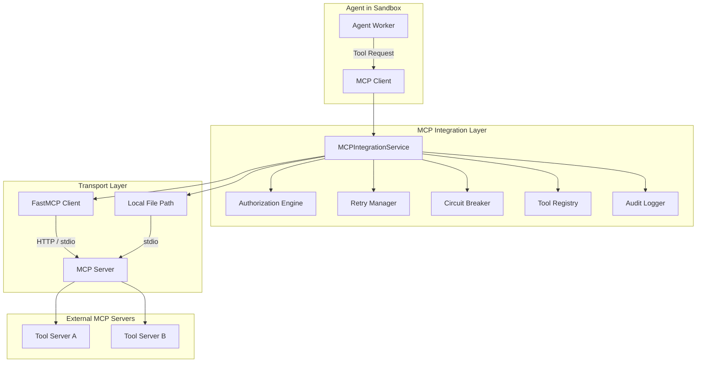
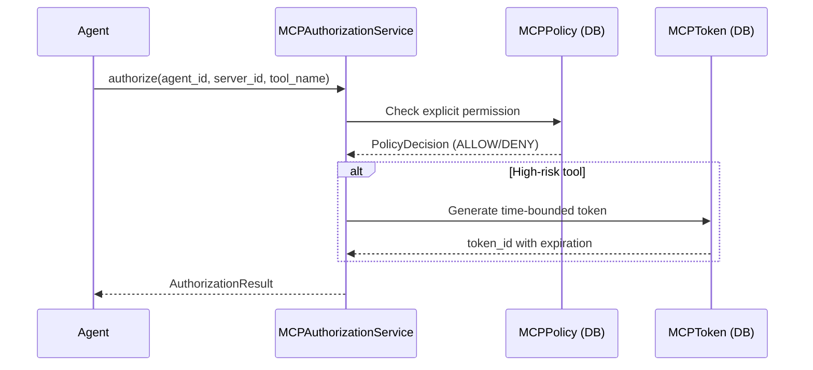
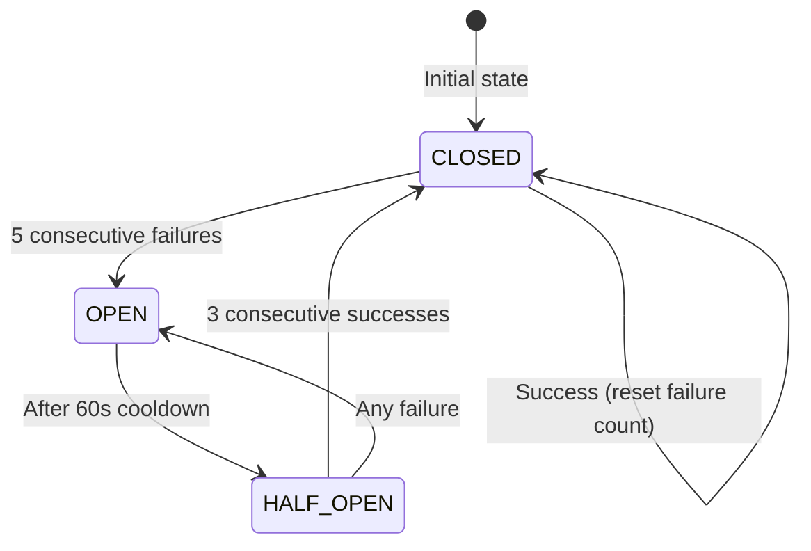
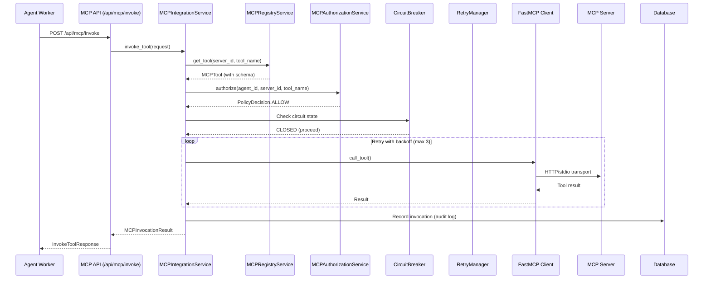
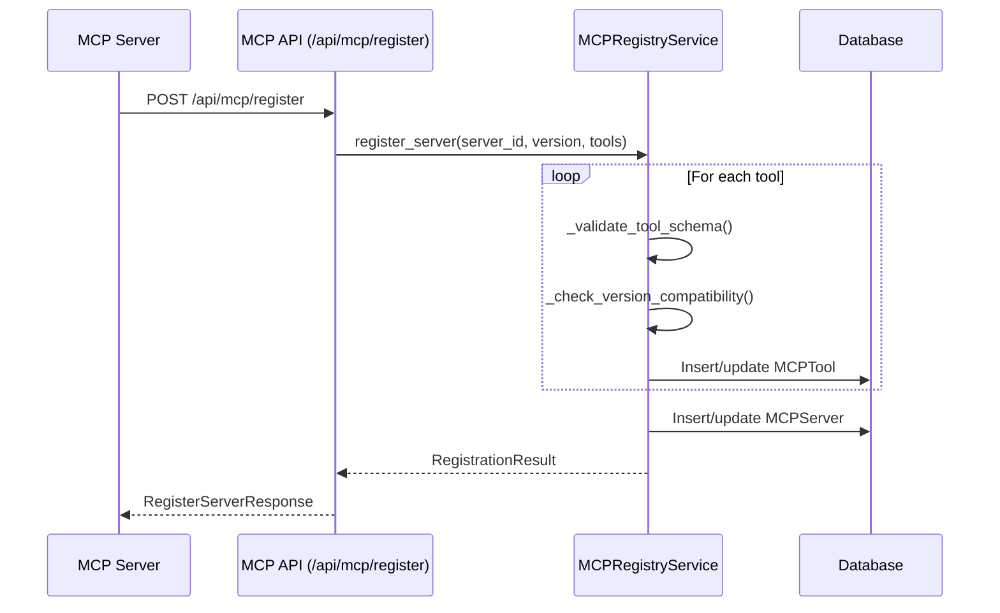

# Part 9: MCP Integration

> **Status**: Production-Ready | **Last Updated**: 2025-04-22
> 
> This document covers the Model Context Protocol (MCP) integration system that enables OmoiOS agents to discover and invoke external tools with full protection mechanisms.

## Purpose

OmoiOS integrates with **Model Context Protocol (MCP)** servers to extend agent capabilities with external tools. The MCP integration layer provides a secure, resilient, and observable bridge between agents and external tool servers, including circuit breakers, retry logic, authorization enforcement, and comprehensive audit logging.

## Architecture Overview



## Key Components

### MCPIntegrationService

**Location**: `backend/omoi_os/services/mcp_integration.py`

The central orchestration service for all MCP tool invocations. It coordinates authorization, circuit breaking, retry logic, and fallback handling.

```python
class MCPIntegrationService:
    """Central service for MCP tool invocations."""
    
    def __init__(
        self,
        db: DatabaseService,
        registry: MCPRegistryService,
        authorization: MCPAuthorizationService,
        retry_manager: MCPRetryManager,
        event_bus: Optional[EventBusService] = None,
        fallback_config: Optional[Dict[str, List[str]]] = None,
    )
    
    async def invoke_tool(self, request: MCPInvocationRequest) -> MCPInvocationResult:
        """Invoke MCP tool with full orchestration."""
```

**Key Methods**:

| Method | Purpose |
|--------|---------|
| `invoke_tool(request)` | Main entry point for tool invocation with full protection |
| `get_circuit_breaker_metrics()` | Retrieve circuit breaker states for monitoring |

### Tool Registry

**Location**: `backend/omoi_os/services/mcp_registry.py`

The `MCPRegistryService` catalogs all available MCP tools across servers with schema validation and version compatibility checking.

```python
class MCPRegistryService:
    """Central registry for all MCP server tools."""
    
    def register_server(
        self,
        server_id: str,
        version: str,
        capabilities: List[str],
        tools: List[Dict[str, Any]],
        connection_url: Optional[str] = None,
        metadata: Optional[Dict[str, Any]] = None,
    ) -> RegistrationResult
```

**Features**:
- **Schema Validation**: JSON Schema validation using Draft7Validator
- **Version Compatibility**: Version matrix for compatibility checking
- **Duplicate Detection**: Prevents duplicate tool registrations
- **Server Heartbeat**: Tracks server health via heartbeat updates

### Authorization Engine

**Location**: `backend/omoi_os/services/mcp_authorization.py`

The `MCPAuthorizationService` enforces agent-scoped permissions with least-privilege principles.

**Authorization Flow**:



**Policy Models**:

| Model | Purpose | Location |
|-------|---------|----------|
| `MCPPolicy` | Persistent authorization grants | `backend/omoi_os/models/mcp_server.py` |
| `MCPToken` | Time-bounded tokens for high-risk tools | `backend/omoi_os/models/mcp_server.py` |

### Circuit Breaker

**Location**: `backend/omoi_os/services/mcp_circuit_breaker.py`

Per-server+tool circuit breakers prevent cascading failures when MCP servers become unavailable.

```python
class MCPCircuitBreaker:
    """Circuit breaker per server+tool combination."""
    
    def __init__(
        self,
        circuit_key: str,  # "server_id:tool_name"
        db: DatabaseService,
        failure_threshold: int = 5,
        cooldown_seconds: int = 60,
        half_open_max_requests: int = 3,
    )
```

**State Machine**:



**States**:

| State | Description | Behavior |
|-------|-------------|----------|
| `CLOSED` | Normal operation | Requests pass through |
| `OPEN` | Failing, reject requests | All requests rejected immediately |
| `HALF_OPEN` | Testing recovery | Limited requests allowed to test health |

### Retry Manager

**Location**: `backend/omoi_os/services/mcp_retry.py`

Exponential backoff retry logic with idempotency tracking.

**Retry Configuration**:
- **Max Attempts**: 3 attempts by default
- **Base Delay**: 500ms
- **Backoff Factor**: 2x (500ms, 1000ms, 2000ms)
- **Idempotency**: Tracks idempotency keys to prevent duplicate side effects

**Transient Error Detection**:
```python
transient_patterns = [
    "timeout", "connection", "network", "temporary",
    "unavailable", "rate limit"
]
```

## Data Flow

### Tool Invocation Flow



### Server Registration Flow



## Database Models

**Location**: `backend/omoi_os/models/mcp_server.py`

| Model | Table | Purpose |
|-------|-------|---------|
| `MCPServer` | `mcp_servers` | Server registration and health |
| `MCPTool` | `mcp_tools` | Tool definitions with JSON schema |
| `MCPPolicy` | `mcp_policies` | Authorization grants |
| `MCPToken` | `mcp_tokens` | Time-bounded tokens |
| `CircuitBreakerState` | `circuit_breakers` | Circuit breaker persistence |
| `MCPInvocation` | `mcp_invocations` | Audit log for all invocations |

**Key Schema**:

```python
class MCPServer(Base):
    __tablename__ = "mcp_servers"
    
    server_id: Mapped[str] = mapped_column(String(255), primary_key=True)
    version: Mapped[str] = mapped_column(String(50))
    capabilities: Mapped[List[str]] = mapped_column(JSONB)
    connection_url: Mapped[Optional[str]] = mapped_column(String(500))
    status: Mapped[str] = mapped_column(String(20), default="active")
    
class MCPTool(Base):
    __tablename__ = "mcp_tools"
    
    id: Mapped[uuid.UUID] = mapped_column(UUID(as_uuid=True), primary_key=True)
    server_id: Mapped[str] = mapped_column(ForeignKey("mcp_servers.server_id"))
    tool_name: Mapped[str] = mapped_column(String(255))
    schema: Mapped[Dict[str, Any]] = mapped_column(JSONB)  # JSON Schema
    enabled: Mapped[bool] = mapped_column(Boolean, default=True)
```

## API Routes

**Location**: `backend/omoi_os/api/routes/mcp.py`

| Endpoint | Method | Purpose |
|----------|--------|---------|
| `/api/mcp/register` | POST | Register MCP server and tools |
| `/api/mcp/tools` | GET | List registered tools |
| `/api/mcp/tools/{server_id}/{tool_name}` | GET | Get specific tool |
| `/api/mcp/invoke` | POST | Invoke tool with orchestration |
| `/api/mcp/policies/grant` | POST | Grant tool permission to agent |
| `/api/mcp/policies/{agent_id}` | GET | List agent permissions |
| `/api/mcp/policies/{agent_id}/{server_id}/{tool_name}` | DELETE | Revoke permission |
| `/api/mcp/circuit-breakers` | GET | Get circuit breaker states |
| `/api/mcp/servers` | GET | List registered servers |

## Transport Mechanisms

The MCP integration supports multiple transport mechanisms via FastMCP:

| Transport | URL Format | Use Case |
|-----------|------------|----------|
| HTTP | `https://example.com/mcp` | Remote MCP servers |
| Local File | `/path/to/server.py` | Local development |
| stdio | In-memory | Embedded servers |

**FastMCP Client Usage**:
```python
from fastmcp import Client

client = Client(server.connection_url, timeout=30.0)
async with client:
    result = await client.call_tool(name=tool_name, arguments=params)
```

## Configuration

**Location**: `backend/config/base.yaml`

```yaml
integrations:
  mcp_server_url: https://api.omoios.dev/mcp
  enable_mcp_tools: true
  mcp_enabled: false  # Enable MCP HTTP server
```

**Environment Variables**:

| Variable | Purpose |
|----------|---------|
| `INTEGRATIONS_MCP_SERVER_URL` | MCP server endpoint |
| `INTEGRATIONS_ENABLE_MCP_TOOLS` | Enable/disable MCP tools |
| `INTEGRATIONS_MCP_ENABLED` | Enable MCP HTTP server |

## Error Handling

| Scenario | Behavior |
|----------|----------|
| Tool not found | Raises `ToolNotFoundError` |
| Tool disabled | Raises `ToolDisabledError` |
| Authorization denied | Raises `AuthorizationError` |
| Circuit open | Raises `CircuitOpenError` with cooldown info |
| Retry exhausted | Attempts fallback tools if configured |
| Transient error | Retries with exponential backoff |
| Permanent error | Fails immediately, no retry |

## Observability

### Metrics

The MCP integration publishes events to the EventBus:

| Event Type | Payload |
|------------|---------|
| `MCP_INVOCATION_COMPLETED` | `{correlation_id, agent_id, success, latency_ms, attempts}` |
| `MCP_INVOCATION_FAILED` | `{correlation_id, agent_id, error, attempts}` |

### Audit Logging

All invocations are recorded in `mcp_invocations` table:
- Correlation ID for request tracing
- Agent, server, and tool identifiers
- Parameter hash (redacted for security)
- Result summary (redacted)
- Latency and attempt counts
- Policy decision and caching status

## Security Considerations

1. **Parameter Redaction**: Sensitive keys (password, token, secret, key, credential, api_key) are redacted in audit logs
2. **Token-based Auth**: High-risk tools require time-bounded tokens
3. **Default-deny**: Tools must be explicitly enabled and authorized
4. **Webhook Signature Verification**: HMAC-SHA256 for webhook payloads
5. **Circuit Breaker**: Prevents abuse of failing servers

## Integration with Other Systems

| System | Integration Point |
|--------|-------------------|
| **Agent Workers** | Invoke tools via `MCPIntegrationService.invoke_tool()` |
| **EventBus** | Publishes invocation events for monitoring |
| **Database** | Stores registry, policies, tokens, and audit logs |
| **Guardian** | Monitors tool invocation patterns for anomalies |
| **FastMCP Server** | `/mcp` endpoint for MCP protocol compliance |

## Testing

### Unit Testing

```python
# Test tool registration
registry = MCPRegistryService(db)
result = registry.register_server(
    server_id="test-server",
    version="1.0.0",
    capabilities=["tools"],
    tools=[{"name": "test_tool", "schema": {...}}]
)
assert result.registered_count == 1

# Test circuit breaker
cb = MCPCircuitBreaker("server:tool", db)
assert cb.state == CircuitState.CLOSED
```

### Integration Testing

```python
# Test full invocation flow
integration = MCPIntegrationService(db, registry, auth, retry)
request = MCPInvocationRequest(
    correlation_id="test-123",
    agent_id="agent-1",
    server_id="test-server",
    tool_name="test_tool",
    params={"arg": "value"}
)
result = await integration.invoke_tool(request)
assert result.success
```

## Related Documentation

### Architecture Deep-Dives
- [Part 2: Execution System](02-execution-system.md) — Agent execution with MCP tools
- [Part 15: LLM Service](15-llm-service.md) — LLM integration
- [Part 16: Service Catalog](16-service-catalog.md) — MCP services

### Design Docs
- MCP Server Integration — Full MCP design
- FastMCP Integration — FastMCP implementation
- MCP Spec Workflow Server — Workflow MCP tools

### Requirements
- [MCP Server](../requirements/integration/mcp_server.md) — MCP requirements
