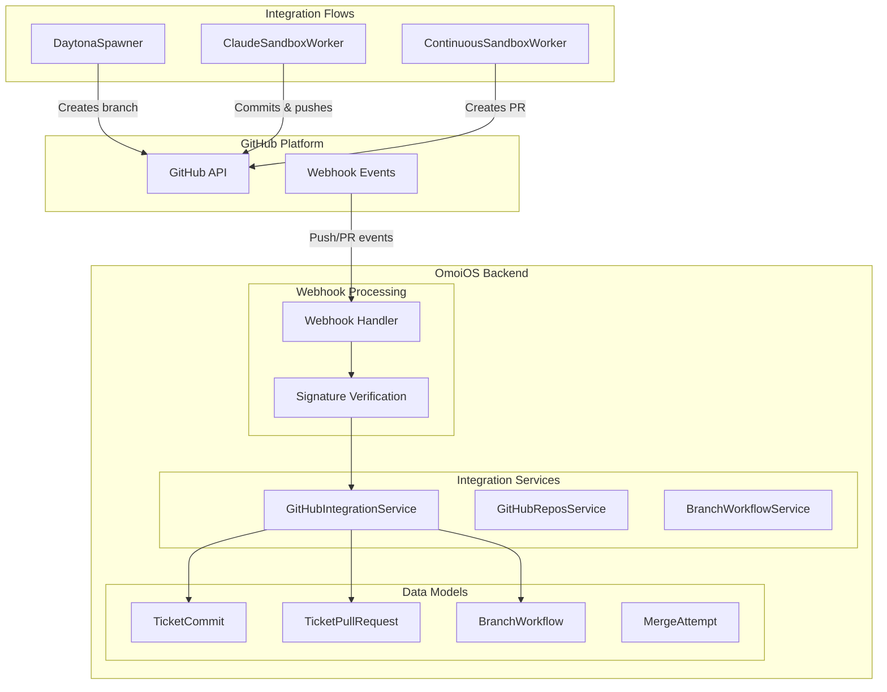
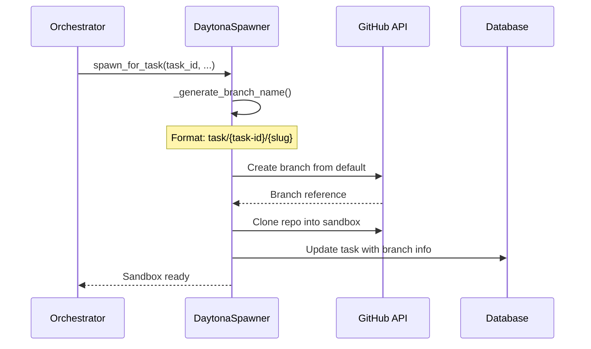
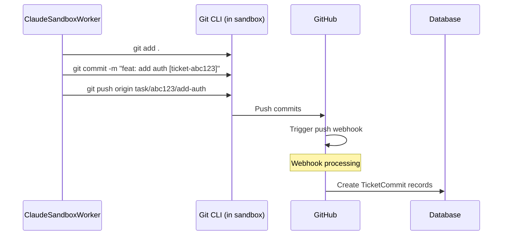
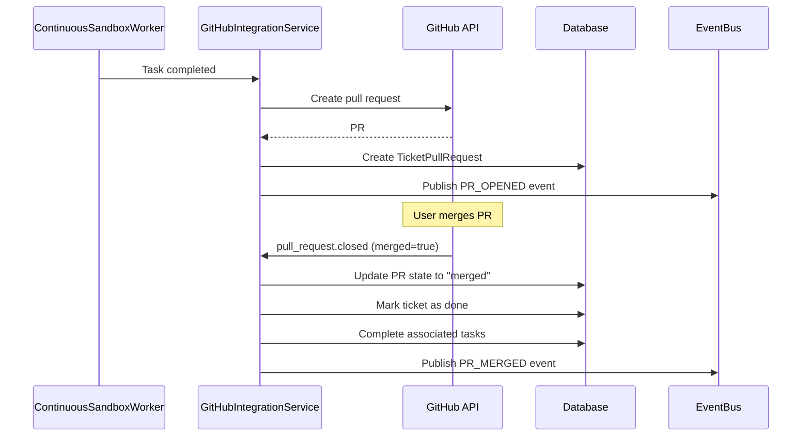

# Part 10: GitHub Integration

> **Status**: Production-Ready | **Last Updated**: 2025-04-22
> 
> This document covers the GitHub API integration for repository management, branch operations, pull request workflows, and webhook handling.

## Purpose

OmoiOS integrates with GitHub for **branch management**, **commit tracking**, **pull request workflows**, and **webhook processing**. The integration enables the orchestrator to create branches before sandbox execution, track all code changes back to tickets, and automatically link commits and PRs to the appropriate work items.

## Architecture Overview



## Key Components

### GitHubIntegrationService

**Location**: `backend/omoi_os/services/github_integration.py`

The primary service for GitHub repository integration, handling webhooks, commit linking, and PR tracking.

```python
class GitHubIntegrationService:
    """Service for GitHub repository integration."""
    
    def __init__(
        self,
        db: DatabaseService,
        event_bus: EventBusService,
        github_token: Optional[str] = None,
    )
```

**Key Methods**:

| Method | Purpose |
|--------|---------|
| `verify_webhook_signature(payload, signature, secret)` | HMAC-SHA256 verification |
| `handle_webhook(event_type, payload, ...)` | Route webhook events to handlers |
| `connect_repository(project_id, owner, repo, ...)` | Link project to GitHub repo |
| `fetch_commit_diff(owner, repo, commit_sha)` | Retrieve commit diff from API |

### Webhook Processing

**Supported Events**:

| Event | Handler | Action |
|-------|---------|--------|
| `push` | `_handle_push_event()` | Link commits to tickets |
| `pull_request` | `_handle_pull_request_event()` | Track PR lifecycle |
| `issues` | `_handle_issue_event()` | Issue tracking (optional) |

**PR Event Actions**:

| Action | Handler | Behavior |
|--------|---------|----------|
| `opened` | `_handle_pr_opened()` | Create TicketPullRequest record |
| `closed` + merged | `_handle_pr_merged()` | Mark ticket done, complete tasks |
| `closed` (no merge) | `_handle_pr_closed()` | Update PR state |
| `reopened` | `_handle_pr_reopened()` | Reopen PR record |
| `synchronize` | — | Acknowledge (new commits pushed) |

### Commit-to-Ticket Linking

**Location**: `backend/omoi_os/services/github_integration.py:750-777`

Regex patterns extract ticket IDs from commit messages:

```python
def _extract_ticket_id_from_message(self, message: str) -> Optional[str]:
    # Pattern 1: ticket-{uuid}
    pattern1 = r"ticket-([a-f0-9-]{36})"
    
    # Pattern 2: # followed by ticket ID
    pattern2 = r"#(\w+-\w+)"
```

**Supported Patterns**:

| Pattern | Example | Matches |
|---------|---------|---------|
| `ticket-{uuid}` | `ticket-abc123...` | Full UUID format |
| `#{ticket-id}` | `#ticket-abc123` | Hash-prefixed |
| `closes #123` | `closes #ticket-abc123` | GitHub-style closing keywords |
| `fixes #123` | `fixes #ticket-abc123` | Alternative closing keywords |

### PR-to-Ticket Linking

**Location**: `backend/omoi_os/services/github_integration.py:648-732`

Extracts ticket IDs from PR title, body, or branch name:

```python
def _extract_ticket_id_from_pr(
    self, title: str, body: str, branch: str
) -> Optional[str]:
    # Title: [ticket-abc123] Add feature
    # Body: Closes ticket-abc123
    # Branch: feature/ticket-abc123-description
```

**Extraction Priority**:
1. PR title (bracket format: `[ticket-xxx]`)
2. PR body (closing keywords)
3. Branch name (feature/ticket-xxx)

## Data Flow

### Branch Creation Flow (Pre-Sandbox)



### Commit and Push Flow



### PR Creation and Merge Flow



## Database Models

**Location**: `backend/omoi_os/models/`

| Model | Table | Purpose |
|-------|-------|---------|
| `TicketCommit` | `ticket_commits` | Links commits to tickets |
| `TicketPullRequest` | `ticket_pull_requests` | Tracks PR lifecycle |
| `BranchWorkflow` | `branch_workflows` | Branch lifecycle state |
| `MergeAttempt` | `merge_attempts` | Records merge operations |

### TicketCommit Schema

```python
class TicketCommit(Base):
    __tablename__ = "ticket_commits"
    
    id: Mapped[str] = mapped_column(String(255), primary_key=True)
    ticket_id: Mapped[str] = mapped_column(ForeignKey("tickets.id"))
    commit_sha: Mapped[str] = mapped_column(String(40))
    commit_message: Mapped[str] = mapped_column(Text)
    files_changed: Mapped[int]
    insertions: Mapped[int]
    deletions: Mapped[int]
    files_list: Mapped[Dict] = mapped_column(JSONB)
    link_method: Mapped[str]  # "webhook" | "manual"
```

### TicketPullRequest Schema

```python
class TicketPullRequest(Base):
    __tablename__ = "ticket_pull_requests"
    
    id: Mapped[str] = mapped_column(String(255), primary_key=True)
    ticket_id: Mapped[str] = mapped_column(ForeignKey("tickets.id"))
    pr_number: Mapped[int]
    pr_title: Mapped[str]
    pr_body: Mapped[Optional[str]] = mapped_column(Text)
    head_branch: Mapped[str]
    base_branch: Mapped[str]
    repo_owner: Mapped[str]
    repo_name: Mapped[str]
    state: Mapped[str]  # "open" | "closed" | "merged"
    html_url: Mapped[str]
    merge_commit_sha: Mapped[Optional[str]]
    merged_at: Mapped[Optional[datetime]]
```

## API Routes

**Location**: `backend/omoi_os/api/routes/github.py`

| Endpoint | Method | Purpose |
|----------|--------|---------|
| `/api/v1/github/connect` | POST | Connect repository to project |
| `/api/v1/github/connected` | GET | List connected repositories |
| `/api/v1/webhooks/github` | POST | Receive GitHub webhooks |
| `/api/v1/github/sync` | POST | Manual repository sync |

**Location**: `backend/omoi_os/api/routes/github_repos.py`

| Endpoint | Method | Purpose |
|----------|--------|---------|
| `/api/v1/github/repos` | GET | List user's GitHub repositories |
| `/api/v1/github/repos/{owner}/{repo}` | GET | Get repository details |

## Branch Naming Convention

**Format**: `task/{task-uuid-short}/{description-slug}`

**Examples**:
```
task/abc123/add-user-authentication
task/def456/fix-login-bug
task/ghi789/update-documentation
```

**Generation Logic** (in `DaytonaSpawner`):
1. Extract task ID (first 6 chars of UUID)
2. Generate slug from task description (lowercase, hyphenated)
3. Check for collisions
4. Append `-2`, `-3`, etc. if collision detected

## Webhook Security

### Signature Verification

**Location**: `backend/omoi_os/services/github_integration.py:59-91`

```python
def verify_webhook_signature(
    self, payload_body: bytes, signature: str, secret: str
) -> bool:
    # GitHub sends: "sha256=<hash>"
    expected_signature = signature[7:]  # Remove "sha256=" prefix
    
    # Calculate HMAC
    mac = hmac.new(
        secret.encode("utf-8"),
        msg=payload_body,
        digestmod=hashlib.sha256,
    )
    calculated_signature = mac.hexdigest()
    
    # Constant-time comparison
    return hmac.compare_digest(expected_signature, calculated_signature)
```

### Security Checklist

- [x] Webhook signature verification (HMAC-SHA256)
- [x] Personal Access Token (PAT) for API calls via `httpx`
- [x] Token stored in project settings (not hardcoded)
- [ ] Webhook secret from project settings (Pending Enhancements: `github.py:156`)

## Configuration

**Location**: `backend/config/base.yaml`

```yaml
git:
  provider: "github"
  local_repos_dir: ".local-repos"

integrations:
  github_token: null  # Set GITHUB_TOKEN in .env
```

**Environment Variables**:

| Variable | Purpose |
|----------|---------|
| `GITHUB_TOKEN` | GitHub Personal Access Token |
| `GIT_PROVIDER` | Provider type ("github" or "local") |
| `GIT_LOCAL_REPOS_DIR` | Local repo storage path |

## Error Handling

| Scenario | Behavior |
|----------|----------|
| Invalid webhook signature | Returns 401 Unauthorized |
| Project not found for repo | Logs warning, skips processing |
| Ticket not found for commit | Skips linking, continues |
| PR already linked | Returns success (idempotent) |
| GitHub API rate limit | Retries with exponential backoff |
| Merge conflict detected | Returns conflict error, preserves branch |

## Rate Limiting

The GitHub API integration respects rate limits:

- **Authenticated**: 5,000 requests/hour
- **Unauthenticated**: 60 requests/hour

**Retry Logic**:
- Exponential backoff on 429 responses
- Max 3 retries with delays: 1s, 2s, 4s

## Integration with Other Systems

| System | Integration Point |
|--------|-------------------|
| **DaytonaSpawner** | Creates branches before sandbox spawn |
| **ClaudeSandboxWorker** | Commits code with ticket references |
| **ContinuousSandboxWorker** | Creates PRs when tasks complete |
| **EventBus** | Publishes PR_OPENED, PR_MERGED, COMMIT_LINKED events |
| **TicketWorkflow** | Updates ticket status on PR merge |
| **TaskQueue** | Completes tasks when PRs merge |

## Testing

### Unit Testing

```python
# Test webhook signature verification
service = GitHubIntegrationService(db, event_bus, token)
assert service.verify_webhook_signature(payload, sig, secret)

# Test ticket ID extraction
ticket_id = service._extract_ticket_id_from_message(
    "feat: add auth [ticket-abc123]"
)
assert ticket_id == "ticket-abc123"
```

### Webhook Testing

```bash
# Simulate GitHub webhook
curl -X POST http://localhost:18000/api/v1/webhooks/github \
  -H "X-GitHub-Event: push" \
  -H "X-Hub-Signature-256: sha256=..." \
  -d '{"repository": {...}, "commits": [...]}'
```

## Known Pending Enhancementss

| Location | Issue | Priority |
|----------|-------|----------|
| `github.py:156` | Get webhook secret from project settings | Medium |
| `github.py:206` | Implement sync logic for initial repository import | Low |
| EventBus | GitHub events have no subscribers | Low |

## Related Documentation

### Architecture Deep-Dives
- [Part 2: Execution System](02-execution-system.md) — Sandbox execution with Git
- [Part 7: Auth & Security](07-auth-and-security.md) — GitHub OAuth
- [Part 19: Git Provider Abstraction](19-git-provider-abstraction.md) — Provider pattern

### Design Docs
- Git Branch Workflow — Branch management
- Communication Patterns — Git operations

### Page Flows
- [08c - GitHub Integration](../page_flows/08c_github_integration.md) — GitHub UI
- [08a - Comments & Collaboration](../page_flows/08a_comments_collaboration.md) — PR collaboration

### Requirements
- [Create Repository](../requirements/projects/create_repository.md) — Repo setup requirements
