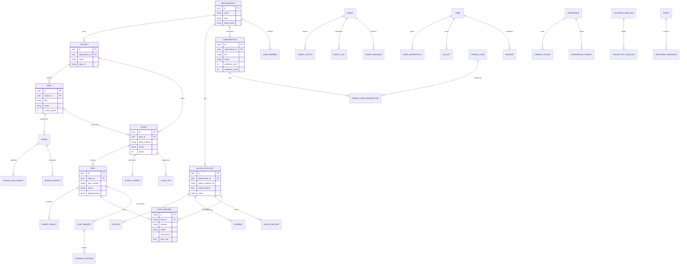
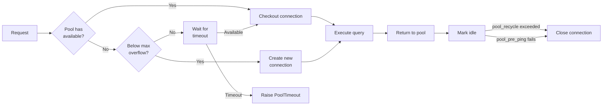

#KX|# Part 11: Database Schema

#NR|> Summary doc — this system has no prior design doc; this is the primary architecture reference.

#MS|## Overview

#VN|OmoiOS uses **PostgreSQL 16** with **pgvector** for semantic search and **SQLAlchemy 2.0+** for ORM. The database has 77 model classes across 61 model files organized across core resources, workflow management, agent execution, monitoring, auth/billing, and collaboration.

#YB|## Technology

#TJ|| Component | Technology |
#QH||-----------|-----------|
#WN|| **Database** | PostgreSQL 16 |
#XK|| **Vector Search** | pgvector extension |
#PX|| **ORM** | SQLAlchemy 2.0+ (async) |
#VJ|| **Migrations** | Alembic (73 migrations as of last count) |
#RW|| **Connection** | AsyncSession via connection pool |

#PQ|## Model Groups

#VQ|### Core Entities

#SY|| Model | Table | Purpose |
#MX||-------|-------|---------|
#YH|| `User` | `users` | User accounts with hashed passwords |
#XX|| `Organization` | `organizations` | Multi-tenant org grouping |
#KT|| `Project` | `projects` | Project containers for specs/tickets |
#BK|| `Spec` | `specs` | Feature specifications (EXPLORE → SYNC) |
#XP|| `Ticket` | `tickets` | Work groupings (TKT-NNN) |
#BH|| `Task` | `tasks` | Atomic work units (TSK-NNN) |

#QN|### Workflow & State

#SY|| Model | Table | Purpose |
#HB||-------|-------|---------|
#BK|| `Phase` | `phases` | Workflow phases (implementation, testing, etc.) |
#ZZ|| `PhaseGate` | `phase_gates` | Quality gate configurations |
#MS|| `PhaseHistory` | `phase_history` | Phase transition audit log |
#MS|| `PhaseContext` | `phase_context` | Cross-phase context aggregation |
#NH|| `TicketStatus` | `ticket_statuses` | Ticket status transitions |
#PZ|| `ApprovalStatus` | `approval_statuses` | Phase gate approval tracking |

#MY|### Agents & Execution

#SY|| Model | Table | Purpose |
#NJ||-------|-------|---------|
#XX|| `Agent` | `agents` | Registered agent instances |
#TR|| `AgentStatus` | `agent_statuses` | Agent health state tracking |
#TW|| `AgentLog` | `agent_logs` | Agent execution logs |
#JX|| `AgentMessage` | `agent_messages` | Guardian → Agent message queue |
#RY|| `AgentResult` | `agent_results` | Task execution results |
#BB|| `AgentBaseline` | `agent_baselines` | Performance baselines |
#HK|| `Workspace` | `workspaces` | Daytona sandbox workspace records |
#XQ|| `SandboxEvent` | `sandbox_events` | All events from sandbox execution |
#BX|| `AgentWorkspace` | `agent_workspaces` | Agent workspace state tracking |
#HM|| `WorkspaceCommit` | `workspace_commits` | Workspace commit history |

#RH|### Monitoring & Analysis

#SY|| Model | Table | Purpose |
#MS||-------|-------|---------|
#TS|| `GuardianAnalysis` | `guardian_analyses` | Per-agent trajectory analysis results |
#WM|| `TrajectoryAnalysis` | `trajectory_analyses` | Detailed trajectory data |
#WB|| `WatchdogAlert` | `watchdog_alerts` | Stuck detection alerts |
#BP|| `WatchdogPolicy` | `watchdog_policies` | Configurable watchdog rules |
#SB|| `MonitorAnomaly` | `monitor_anomalies` | Detected agent anomalies |
#TK|| `DiagnosticRun` | `diagnostic_runs` | Diagnostic investigation records |
#QQ|| `Alert` | `alerts` | System-wide alerting |
#BX|| `WatchdogAction` | `watchdog_actions` | Watchdog action records |

#RM|### Auth & Billing

#SY|| Model | Table | Purpose |
#BH||-------|-------|---------|
#SH|| `Auth` | (via User) | Authentication data |
#JY|| `Billing` | `billing` | Billing account records |
#XP|| `Subscription` | `subscriptions` | Active subscription tracking |
#TX|| `CostRecord` | `cost_records` | Per-workflow cost tracking |
#ZP|| `PromoCode` | `promo_codes` | Promotional discount codes |
#PS|| `UserCredentials` | `user_credentials` | Stored integration credentials |
#PT|| `UserOnboarding` | `user_onboarding` | Onboarding progress tracking |
#XB|| `APIKey` | `api_keys` | API key management |
#KV|| `Session` | `sessions` | User session tracking |
#HQ|| `Budget` | `budgets` | Budget limits and tracking |

#MB|### Version Control Integration

#SY|| Model | Table | Purpose |
#BB||-------|-------|---------|
#JY|| `TicketCommit` | `ticket_commits` | Git commits linked to tickets |
#BP|| `TicketPullRequest` | `ticket_pull_requests` | PRs linked to tickets |
#BZ|| `MergeAttempt` | `merge_attempts` | DAG merge attempt records |
#XJ|| `BranchWorkflow` | `branch_workflows` | Branch lifecycle tracking |

#VB|### Collaboration & Memory

#SY|| Model | Table | Purpose |
#WM||-------|-------|---------|
#YM|| `TaskMemory` | `task_memories` | Agent-learned patterns (with pgvector embeddings) |
#MS|| `MemoryType` | (enum) | Memory classification |
#ZW|| `LearnedPattern` | `learned_patterns` | Reusable patterns from execution |
#ZP|| `Playbook` | `playbooks` | Automated response playbooks |
#PN|| `Reasoning` | `reasoning` | Agent reasoning chain records |

#ZM|### Quality & Validation

#SY|| Model | Table | Purpose |
#ZQ||-------|-------|---------|
#HB|| `QualityCheck` | `quality_checks` | Quality gate check results |
#PT|| `ValidationReview` | `validation_reviews` | Validation agent review records |
#HQ|| `TaskDiscovery` | `task_discoveries` | Discovery-spawned task tracking |

#PQ|### Infrastructure

#SY|| Model | Table | Purpose |
#KT||-------|-------|---------|
#ZR|| `Event` | `events` | System event log |
#KW|| `HeartbeatMessage` | `heartbeat_messages` | Agent heartbeat records |
#RK|| `ResourceLock` | `resource_locks` | Distributed lock tracking |
#KW|| `MCPServer` | `mcp_servers` | Registered MCP server configs |
#SH|| `ClaudeSessionTranscript` | `claude_session_transcripts` | Full agent conversation logs |
#BX|| `PreviewSession` | `preview_sessions` | Preview environment sessions |
#KM|| `ExploreConversation` | `explore_conversations` | Exploration conversation records |
#HQ|| `ExploreMessage` | `explore_messages` | Exploration message records |

#RH|## Key Relationships

#VN```
#JH|Organization ──1:N──→ Project ──1:N──→ Spec ──1:N──→ Ticket ──1:N──→ Task
#HS|                                                         │              │
#RY|                                                         │              ├──→ SandboxEvent
#PQ|                                                         │              ├──→ AgentResult
#PX|                                                         │              └──→ TaskDiscovery
#KK|                                                         │
#QQ|                                                         ├──→ TicketCommit
#QV|                                                         └──→ TicketPullRequest
#YX```

#RQ|## Migration Strategy

#SX|- Migrations managed via Alembic in `backend/omoi_os/alembic/`
#JW|- Migration naming: `{hash}_{description}.py`
#JV|- Run with: `uv run alembic upgrade head`
#PY|- Create with: `uv run alembic revision -m "description"`

#YJ|## SQLAlchemy Reserved Keyword Rule

#XV|**NEVER** use `metadata` or `registry` as column/attribute names — they conflict with SQLAlchemy internals. Use alternatives:
#YX|- `metadata` → `change_metadata`, `item_metadata`, `config_data`
#WX|- `registry` → `agent_registry`, `service_registry`


## Related Documentation

### Architecture Deep-Dives
- [Part 1: Planning System](01-planning-system.md) — Spec and task models
- [Part 2: Execution System](02-execution-system.md) — Sandbox and agent models
- [Part 3: Discovery System](03-discovery-system.md) — Discovery models
- [Part 4: Readjustment System](04-readjustment-system.md) — Monitoring models
- [Part 7: Auth & Security](07-auth-and-security.md) — Auth models
- [Part 8: Billing & Subscriptions](08-billing-and-subscriptions.md) — Billing models
- [Part 12: Configuration System](12-configuration-system.md) — Settings storage
- [Part 13: API Route Catalog](13-api-route-catalog.md) — API data models
- [Part 16: Service Catalog](16-service-catalog.md) — Service data models

### Design Docs
- Configuration Schema — Database conventions
- Async SQLAlchemy Migration — ORM patterns

### Requirements
- [Monitoring](../requirements/monitoring/monitoring_architecture.md) — Monitoring data requirements

## Entity-Relationship Diagram



---

## Connection Pooling Configuration

OmoiOS uses SQLAlchemy's async connection pooling with carefully tuned parameters for production workloads.

### Pool Settings

```python
# From database.py - DatabaseService configuration
engine = create_async_engine(
    connection_string,
    pool_size=20,              # Base connections maintained
    max_overflow=30,           # Extra connections under load
    pool_timeout=30,           # Seconds to wait for connection
    pool_recycle=3600,         # Recycle connections after 1 hour
    pool_pre_ping=True,        # Verify connection health before use
    echo=False,                # SQL logging (True in dev)
)
```

### Pool Behavior

| Parameter | Value | Purpose |
|-----------|-------|---------|
| `pool_size` | 20 | Minimum connections always ready |
| `max_overflow` | 30 | Burst capacity for traffic spikes |
| `pool_timeout` | 30s | Fail fast if pool exhausted |
| `pool_recycle` | 3600s | Prevent stale connection issues |
| `pool_pre_ping` | True | Detect and replace dead connections |

### Connection Lifecycle



---

## Migration Workflow

Database migrations use Alembic with a structured workflow for safe schema evolution.

### Migration Structure

```
backend/
├── alembic/
│   ├── versions/
│   │   ├── 001_initial_schema.py
│   │   ├── 002_add_subscriptions.py
│   │   ├── 003_add_cost_tracking.py
│   │   └── ...
│   ├── env.py              # Alembic configuration
│   └── alembic.ini         # Alembic settings
└── omoi_os/
    └── models/
        └── base.py         # SQLAlchemy Base class
```

### Migration Commands

```bash
# Create new migration
cd backend && uv run alembic revision -m 'add user preferences'

# Auto-generate from model changes
cd backend && uv run alembic revision --autogenerate -m 'update schema'

# Apply migrations
cd backend && uv run alembic upgrade head

# Rollback one migration
cd backend && uv run alembic downgrade -1

# View history
cd backend && uv run alembic history
```

### Migration Best Practices

1. **Always review auto-generated migrations**: Check for unintended changes
2. **Test migrations on copy of production data**: Validate before applying
3. **Use transactions for DDL**: Ensure atomic schema changes
4. **Add indexes separately**: Large table indexes should be `CONCURRENTLY`
5. **Never modify existing migrations**: Create new migrations to fix issues

### Zero-Downtime Migrations

```python
# Example: Adding a column without locking
def upgrade():
    # Step 1: Add nullable column (fast, no lock)
    op.add_column('users', sa.Column('new_field', sa.String(), nullable=True))
    
    # Step 2: Backfill in batches (application handles NULLs)
    op.execute("""
        UPDATE users 
        SET new_field = 'default'
        WHERE id IN (
            SELECT id FROM users WHERE new_field IS NULL LIMIT 1000
        )
    """)
    
    # Step 3: Make non-nullable after backfill complete
    op.alter_column('users', 'new_field', nullable=False)
```

---

## Index Strategy

Indexes are carefully designed to support the most common query patterns while minimizing write overhead.

### Index Types Used

| Type | Use Case | Example |
|------|----------|---------|
| B-tree (default) | Equality, range queries | `WHERE status = 'active'` |
| GIN | JSONB containment | `WHERE metadata @> '{"key": "value"}'` |
| Composite | Multi-column filters | `WHERE org_id = X AND status = Y` |
| Partial | Filtered subsets | `WHERE deleted_at IS NULL` |
| Unique | Data integrity | `email` uniqueness |

### Core Table Indexes

```python
# From models/base.py and individual models

# Organization lookups by slug
Index('idx_organization_slug', 'slug', unique=True)

# Subscription status queries
Index('idx_subscription_org_status', 'organization_id', 'status')

# Task status + priority for queue
Index('idx_task_status_priority', 'status', 'priority')

# Cost records by billing account
Index('idx_cost_billing_account', 'billing_account_id', 'recorded_at')

# Event time-series queries
Index('idx_event_type_created', 'event_type', 'created_at')

# JSONB containment for task dependencies
Index('idx_task_dependencies', 'dependencies', postgresql_using='gin')
```

### Index Selection Criteria

Indexes are added when:
1. Query frequency > 100x/day
2. Table size > 10,000 rows
3. Query selectivity < 10% of rows
4. Write overhead is acceptable (< 20% slowdown)

---

## Query Patterns

### Common Query Patterns by Domain

#### Task Queue Queries

```python
# Fetch next task for agent (priority queue)
SELECT * FROM tasks 
WHERE status = 'pending' 
  AND agent_type = :agent_type
  AND (dependencies IS NULL OR dependencies = '[]')
ORDER BY priority DESC, created_at ASC
LIMIT 1
FOR UPDATE SKIP LOCKED  # Prevent concurrent pickup

# Update with composite index: idx_task_status_priority
```

#### Billing Aggregation

```python
# Monthly usage by organization
SELECT 
    DATE_TRUNC('month', recorded_at) as month,
    SUM(total_cost) as total_cost,
    COUNT(*) as workflow_count
FROM usage_records
WHERE billing_account_id = :account_id
  AND recorded_at >= :start_date
GROUP BY DATE_TRUNC('month', recorded_at)

# Uses index: idx_usage_recorded
```

#### Cost Analysis

```python
# Cost breakdown by provider/model
SELECT 
    provider,
    model,
    SUM(total_cost) as total_cost,
    SUM(total_tokens) as total_tokens,
    COUNT(*) as record_count
FROM cost_records
WHERE billing_account_id = :account_id
GROUP BY provider, model

# Uses index: idx_cost_billing_account
```

#### Spec Phase Queries

```python
# Get spec with all phases
SELECT s.*, p.* 
FROM specs s
LEFT JOIN phases p ON p.spec_id = s.id
WHERE s.id = :spec_id

# Uses indexes: specs.id, phases.spec_id
```

#### Agent Status Monitoring

```python
# Active agents with recent heartbeats
SELECT a.*, s.status, s.last_heartbeat
FROM agents a
JOIN agent_statuses s ON s.agent_id = a.id
WHERE s.status = 'active'
  AND s.last_heartbeat > NOW() - INTERVAL '5 minutes'

# Uses index: idx_agent_status_heartbeat
```

---

## Vector Search with pgvector

OmoiOS uses the pgvector extension for semantic search over task memories and learned patterns.

### Vector Configuration

```sql
-- Enable pgvector extension
CREATE EXTENSION IF NOT EXISTS vector;

-- Create table with vector column
CREATE TABLE task_memories (
    id UUID PRIMARY KEY DEFAULT gen_random_uuid(),
    task_id UUID REFERENCES tasks(id),
    content TEXT NOT NULL,
    embedding VECTOR(1536),  -- OpenAI embedding dimension
    created_at TIMESTAMP WITH TIME ZONE DEFAULT NOW()
);
```

### Vector Operations

```python
# From models/task_memory.py

# Store embedding
memory = TaskMemory(
    task_id=task_id,
    content=content,
    embedding=embedding_vector,  # numpy array or list
)

# Similarity search (cosine similarity)
similar = session.query(TaskMemory).order_by(
    TaskMemory.embedding.cosine_distance(query_vector)
).limit(10).all()

# Approximate nearest neighbor with HNSW index
CREATE INDEX idx_task_memory_embedding 
ON task_memories USING hnsw (embedding vector_cosine_ops)
WITH (m = 16, ef_construction = 64);
```

### Use Cases

| Use Case | Vector Source | Query Type |
|----------|---------------|------------|
| Similar task lookup | Task description | Cosine similarity |
| Pattern matching | Learned patterns | Nearest neighbor |
| Code search | Function embeddings | Cosine similarity |
| Error diagnosis | Error message embeddings | Similarity + filter |

---

## Performance Considerations

### Query Optimization

1. **Use `EXPLAIN ANALYZE`**: Verify query plans before deploying
2. **Limit result sets**: Always use `LIMIT` for unbounded queries
3. **Batch inserts**: Use `COPY` or bulk insert for large datasets
4. **Avoid N+1**: Use `joinedload()` for relationships

```python
# Good: Eager loading
from sqlalchemy.orm import joinedload

tasks = session.query(Task).options(
    joinedload(Task.agent),
    joinedload(Task.ticket)
).filter(Task.status == 'pending').all()

# Bad: N+1 query problem
tasks = session.query(Task).filter(Task.status == 'pending').all()
for task in tasks:
    print(task.agent.name)  # Queries agent for each task!
```

### Connection Management

```python
# Use context managers for automatic cleanup
with db.get_session() as session:
    result = session.execute(query)
    # Session automatically closed

# For long-running operations, use explicit commit
with db.get_session() as session:
    session.add(large_batch)
    session.commit()  # Explicit commit
    # Session closed on exit
```

### Caching Strategy

| Data Type | Cache Layer | TTL |
|-----------|-------------|-----|
| User sessions | Redis | 15 min |
| Subscription tiers | In-memory | 5 min |
| Cost aggregations | Redis | 1 hour |
| Task queue | Redis | 30 sec |

---

## Backup and Recovery

| Type | Frequency | Retention | Tool |
|------|-----------|-----------|------|
| Full dump | Daily | 30 days | pg_dump |
| WAL archives | Continuous | 7 days | WAL-G |
| Cross-region | Weekly | 90 days | pg_dump + S3 |

**Recovery**: `pg_restore -d $DATABASE_URL backup_YYYYMMDD.dump`
---


## Schema Evolution Guidelines

### Adding New Tables

1. Create model in `backend/omoi_os/models/`
2. Generate migration: `alembic revision --autogenerate`
3. Review migration for correctness
4. Test on staging database
5. Apply to production during low-traffic window

### Modifying Existing Tables

1. **Adding columns**: Use nullable or provide default
2. **Removing columns**: Mark deprecated first, remove later
3. **Changing types**: Create new column, migrate data, drop old
4. **Renaming**: Use `op.alter_column()` with explicit names

### Reserved Keywords

**CRITICAL**: Never use these as column names:
- `metadata` - SQLAlchemy reserved
- `registry` - SQLAlchemy reserved

Use alternatives:
- `metadata` → `item_metadata`, `config_data`
- `registry` → `service_registry`, `agent_registry`

---

## Related Documentation

### Architecture Deep-Dives
- [Part 1: Planning System](01-planning-system.md) — Spec and task models
- [Part 2: Execution System](02-execution-system.md) — Sandbox and agent models
- [Part 3: Discovery System](03-discovery-system.md) — Discovery models
- [Part 4: Readjustment System](04-readjustment-system.md) — Monitoring models
- [Part 7: Auth & Security](07-auth-and-security.md) — Auth models
- [Part 8: Billing & Subscriptions](08-billing-and-subscriptions.md) — Billing models
- [Part 12: Configuration System](12-configuration-system.md) — Settings storage
- [Part 13: API Route Catalog](13-api-route-catalog.md) — API data models
- [Part 16: Service Catalog](16-service-catalog.md) — Service data models

### Design Docs
- Configuration Schema — Database conventions
- Async SQLAlchemy Migration — ORM patterns