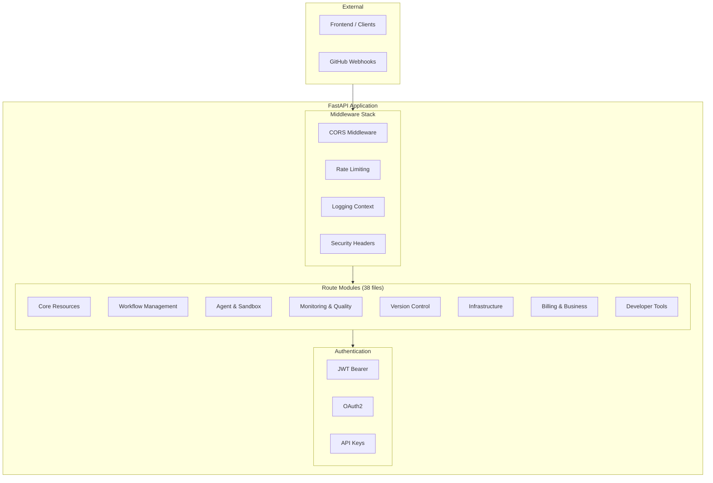

# Part 13: API Route Catalog

> **Status**: Production-Ready | **Last Updated**: 2025-04-22
> 
> This document catalogs all 38 FastAPI route modules organized by domain, covering authentication patterns, middleware chain, and response formats.

## Purpose

OmoiOS exposes a **FastAPI** REST API at `https://api.omoios.dev` with 38 route modules organized by domain. This catalog provides a comprehensive reference for all endpoints, their purposes, and the patterns used across the API surface.

## Architecture Overview



## Route Organization

### Core Resources (7 routes)

| File | Prefix | Purpose | Key Endpoints |
|------|--------|---------|---------------|
| `auth.py` | `/api/v1/auth` | Authentication | login, register, refresh, verify-email, reset-password |
| `oauth.py` | `/api/v1/auth` | OAuth flows | GitHub, Google, GitLab OAuth |
| `organizations.py` | `/api/v1/organizations` | Organization CRUD | create, list, members, invites |
| `projects.py` | `/api/v1/projects` | Project management | CRUD, settings, archive |
| `specs.py` | `/api/v1` | Spec lifecycle | create, phases, execute |
| `tickets.py` | `/api/v1/tickets` | Ticket management | CRUD, status, search |
| `tasks.py` | `/api/v1/tasks` | Task operations | CRUD, assign, status updates |

### Preview & Prototype (2 routes)

| File | Prefix | Purpose | Key Endpoints |
|------|--------|---------|---------------|
| `preview.py` | `/api/v1/preview` | Preview functionality | create, get, stop, notify, by-sandbox |
| `prototype.py` | `/api/v1/prototype` | Prototype workspace | session, prompt, export |

### Workflow Management (6 routes)

| File | Prefix | Purpose | Key Endpoints |
|------|--------|---------|---------------|
| `phases.py` | `/api/v1/phases` | Phase management | list, transitions, gates |
| `board.py` | `/api/v1/board` | Kanban board | columns, ordering, drag-drop |
| `graph.py` | `/api/v1/graph` | Dependency graph | visualize, critical path |
| `results.py` | `/api/v1/results` | Task results | submit, retrieve, artifacts |
| `branch_workflow.py` | `/api/v1/branch-workflow` | Git branches | lifecycle, status |
| `collaboration.py` | `/api/v1/collaboration` | Agent channels | create, message, history |

### Agent & Sandbox (2 routes)

| File | Prefix | Purpose | Key Endpoints |
|------|--------|---------|---------------|
| `agents.py` | `/api/v1/agents` | Agent registry | register, status, capabilities |
| `sandbox.py` | `/api/v1/sandboxes` | Sandbox events | events, messages, trajectory |

### Monitoring & Quality (7 routes)

| File | Prefix | Purpose | Key Endpoints |
|------|--------|---------|---------------|
| `monitor.py` | `/api/v1/monitor` | System metrics | health, anomalies |
| `guardian.py` | `/api/v1/guardian` | Guardian analysis | trajectory, interventions |
| `watchdog.py` | `/api/v1/watchdog` | Watchdog alerts | policies, alerts |
| `diagnostic.py` | `/api/v1/diagnostic` | Diagnostic runs | create, status, results |
| `quality.py` | `/api/v1/quality` | Quality checks | metrics, reports |
| `validation.py` | `/api/validation` | Validation reviews | submit, approve, reject |
| `alerts.py` | `/api/v1/alerts` | Alert management | config, history |

### Version Control (3 routes)

| File | Prefix | Purpose | Key Endpoints |
|------|--------|---------|---------------|
| `commits.py` | `/api/v1/commits` | Commit history | list, link to tickets |
| `github.py` | `/api/v1/github` | GitHub webhooks | receive, verify |
| `github_repos.py` | `/api/v1/github` | Repo management | list, connect, sync |

### Infrastructure (5 routes)

| File | Prefix | Purpose | Key Endpoints |
|------|--------|---------|---------------|
| `events.py` | `/api/v1/events` | WebSocket events | stream, subscribe |
| `mcp.py` | `/api/mcp` | MCP server | register, invoke, tools |
| `memory.py` | `/api/v1/memory` | Memory search | query, patterns |
| `reasoning.py` | `/api/v1/reasoning` | Agent reasoning | chains, steps |
| `explore.py` | `/api/v1/explore` | Code exploration | AI-assisted analysis |

### Billing & Business (4 routes)

| File | Prefix | Purpose | Key Endpoints |
|------|--------|---------|---------------|
| `billing.py` | `/api/v1/billing` | Stripe integration | checkout, portal, webhooks |
| `costs.py` | `/api/v1/costs` | Cost tracking | per workflow, per agent |
| `onboarding.py` | `/api/v1/onboarding` | User onboarding | progress, completion |
| `analytics_proxy.py` | `/ingest` | Analytics proxy | bypass ad blockers |

### Developer Tools (2 routes)

| File | Prefix | Purpose | Key Endpoints |
|------|--------|---------|---------------|
| `debug.py` | `/api/v1/debug` | Debug endpoints | dev-only diagnostics |
| `public.py` | `/api/v1/public` | Public showcase | unauthenticated access |

## Route Registration

**Location**: `backend/omoi_os/api/main.py:1157-1229`

```python
# Include routers with prefixes
app.include_router(tickets.router, prefix="/api/v1/tickets", tags=["tickets"])
app.include_router(tasks.router, prefix="/api/v1/tasks", tags=["tasks"])
app.include_router(phases.router, prefix="/api/v1", tags=["phases"])
app.include_router(agents.router, prefix="/api/v1", tags=["agents"])
app.include_router(billing.router, prefix="/api/v1/billing", tags=["billing"])
app.include_router(preview.router, prefix="/api/v1/preview", tags=["preview"])
app.include_router(prototype.router, prefix="/api/v1/prototype", tags=["prototype"])
# ... etc

# Conditional routes (dev only)
if not _is_production:
    app.include_router(debug.router, prefix="/api/v1/debug", tags=["debug"])

# Mount MCP server at /mcp
app.mount("/mcp", mcp_app)
```
# Include routers with prefixes
app.include_router(tickets.router, prefix="/api/v1/tickets", tags=["tickets"])
app.include_router(tasks.router, prefix="/api/v1/tasks", tags=["tasks"])
app.include_router(phases.router, prefix="/api/v1", tags=["phases"])
app.include_router(agents.router, prefix="/api/v1", tags=["agents"])
app.include_router(billing.router, prefix="/api/v1/billing", tags=["billing"])
# ... etc

# Conditional routes (dev only)
if not _is_production:
    app.include_router(debug.router, prefix="/api/v1/debug", tags=["debug"])

# Mount MCP server at /mcp
app.mount("/mcp", mcp_app)
```

## Authentication Patterns

### Protected Route

```python
from fastapi import Depends
from omoi_os.api.dependencies import get_current_user
from omoi_os.models.user import User

@router.get("/protected")
async def protected_route(user: User = Depends(get_current_user)):
    return {"message": f"Hello, {user.email}"}
```

### Optional Auth

```python
from typing import Optional

@router.get("/public-or-private")
async def flexible_route(
    user: Optional[User] = Depends(get_current_user_optional)
):
    if user:
        return {"message": f"Hello, {user.email}"}
    return {"message": "Hello, guest"}
```

### Role-Required

```python
from omoi_os.api.dependencies import require_role

@router.get("/admin-only")
async def admin_route(user: User = Depends(require_role("admin"))):
    return {"message": "Admin access granted"}
```

## Middleware Chain

**Location**: `backend/omoi_os/api/main.py:1029-1155`

### 1. Rate Limiting

```python
from slowapi import Limiter
from slowapi.middleware import SlowAPIMiddleware

limiter = Limiter(key_func=get_remote_address)
app.state.limiter = limiter
app.add_middleware(SlowAPIMiddleware)
```

### 2. CORS

```python
from fastapi.middleware.cors import CORSMiddleware

_cors_origins = (
    ["*"] if _env in ("development", "local", "test")
    else ["https://omoios.dev", "https://www.omoios.dev"]
)

app.add_middleware(
    CORSMiddleware,
    allow_origins=_cors_origins,
    allow_credentials=True,
    allow_methods=["*"],
    allow_headers=["*"],
)
```

### 3. Logging Context

```python
@app.middleware("http")
async def logging_context_middleware(request: Request, call_next):
    request_id = request.headers.get("X-Request-ID", str(uuid4())[:8])
    bind_context(request_id=request_id, method=request.method, path=request.url.path)
    
    response = await call_next(request)
    response.headers["X-Request-ID"] = request_id
    return response
```

### 4. Security Headers

```python
@app.middleware("http")
async def security_headers_middleware(request: Request, call_next):
    response = await call_next(request)
    response.headers["X-Content-Type-Options"] = "nosniff"
    response.headers["X-Frame-Options"] = "DENY"
    response.headers["Referrer-Policy"] = "strict-origin-when-cross-origin"
    if _is_production:
        response.headers["Strict-Transport-Security"] = "max-age=31536000"
    return response
```

## Error Handling Patterns

### Validation Error Handler

```python
@app.exception_handler(RequestValidationError)
async def validation_exception_handler(request: Request, exc: RequestValidationError):
    logger.error(f"Validation error: {exc.errors()}")
    return JSONResponse(
        status_code=status.HTTP_422_UNPROCESSABLE_ENTITY,
        content={"detail": exc.errors()},
    )
```

### HTTP Exception Handler

```python
@app.exception_handler(HTTPException)
async def http_exception_handler(request: Request, exc: HTTPException):
    if exc.status_code == status.HTTP_400_BAD_REQUEST:
        logger.error(f"400 Bad Request: {exc.detail}")
    return JSONResponse(
        status_code=exc.status_code,
        content={"detail": exc.detail},
        headers=dict(exc.headers) if exc.headers else {},
    )
```

### Global Exception Handler

```python
@app.exception_handler(Exception)
async def general_exception_handler(request: Request, exc: Exception):
    logger.error(f"Unhandled exception: {exc}", exc_info=True)
    # Capture to Sentry
    import sentry_sdk
    sentry_sdk.capture_exception(exc)
    return JSONResponse(
        status_code=status.HTTP_500_INTERNAL_SERVER_ERROR,
        content={"detail": "Internal server error"},
    )
```

## Response Format

All API responses follow a consistent envelope format:

### Success Response

```json
{
  "success": true,
  "data": { ... },
  "message": "Operation completed"
}
```

### Error Response

```json
{
  "success": false,
  "error": {
    "code": "VALIDATION_ERROR",
    "message": "Invalid input",
    "details": { ... }
  }
}
```

### Paginated Response

```json
{
  "success": true,
  "data": [ ... ],
  "pagination": {
    "page": 1,
    "per_page": 20,
    "total": 100,
    "total_pages": 5
  }
}
```

## Service Initialization

**Location**: `backend/omoi_os/api/main.py:687-868`

Most services are initialized in `lifespan()` and accessed via global variables:

```python
# Global services (initialized in lifespan)
db: DatabaseService | None = None
queue: TaskQueueService | None = None
event_bus: EventBusService | None = None
health_service: AgentHealthService | None = None
# ... etc

@asynccontextmanager
async def lifespan(app: FastAPI):
    # Initialize services
    db = DatabaseService(connection_string=...)
    event_bus = EventBusService(redis_url=...)
    queue = TaskQueueService(db, event_bus=event_bus)
    # ... etc
    
    yield
    
    # Cleanup
    event_bus.close()
```

## Port Configuration

| Service | Port | Note |
|---------|------|------|
| Backend API | 18000 | +10000 offset from standard |
| PostgreSQL | 15432 | +10000 offset |
| Redis | 16379 | +10000 offset |
| Frontend | 3000 | Standard |

## API Documentation

FastAPI auto-generates interactive API docs:

- **Swagger UI**: `https://api.omoios.dev/docs` (dev only)
- **ReDoc**: `https://api.omoios.dev/redoc` (dev only)

**Production**: Docs disabled in production (`docs_url=None`)

```python
app = FastAPI(
    docs_url=None if _is_production else "/docs",
    redoc_url=None if _is_production else "/redoc",
    openapi_url=None if _is_production else "/openapi.json",
)
```

## Route Implementation Example

**Location**: `backend/omoi_os/api/routes/tickets.py` (typical pattern)

```python
from fastapi import APIRouter, Depends, HTTPException, Query
from typing import List, Optional

from omoi_os.api.dependencies import get_current_user, get_db_service
from omoi_os.models.user import User
from omoi_os.services.database import DatabaseService
from omoi_os.services.ticket_workflow import TicketWorkflowOrchestrator

router = APIRouter()

@router.get("/", response_model=List[TicketResponse])
async def list_tickets(
    project_id: Optional[str] = Query(None),
    status: Optional[str] = Query(None),
    db: DatabaseService = Depends(get_db_service),
    user: User = Depends(get_current_user),
) -> List[TicketResponse]:
    """List tickets with optional filtering."""
    with db.get_session() as session:
        query = session.query(Ticket)
        if project_id:
            query = query.filter(Ticket.project_id == project_id)
        if status:
            query = query.filter(Ticket.status == status)
        tickets = query.all()
        return [TicketResponse.from_orm(t) for t in tickets]

@router.post("/", response_model=TicketResponse)
async def create_ticket(
    request: CreateTicketRequest,
    db: DatabaseService = Depends(get_db_service),
    user: User = Depends(get_current_user),
) -> TicketResponse:
    """Create a new ticket."""
    orchestrator = TicketWorkflowOrchestrator(db=db)
    ticket = await orchestrator.create_ticket(
        title=request.title,
        description=request.description,
        project_id=request.project_id,
        created_by=user.id,
    )
    return TicketResponse.from_orm(ticket)
```

## Testing Routes

### Unit Testing

```python
from fastapi.testclient import TestClient

client = TestClient(app)

def test_list_tickets():
    response = client.get("/api/v1/tickets/")
    assert response.status_code == 200
    assert len(response.json()["data"]) >= 0

def test_create_ticket():
    response = client.post("/api/v1/tickets/", json={
        "title": "Test Ticket",
        "description": "Test description",
        "project_id": "proj-123"
    })
    assert response.status_code == 201
    assert response.json()["data"]["title"] == "Test Ticket"
```

## Integration Gaps

**Location**: `docs/architecture/14-integration-gaps.md`

Some routes create services per-request rather than using initialized globals:

| Gap | Impact | Status |
|-----|--------|--------|
| API routes without initialization | Performance overhead | Known |
| Missing service injection | Inconsistent patterns | In progress |

## Related Documentation

### Architecture Deep-Dives
- [Part 5: Frontend Architecture](05-frontend-architecture.md) — Frontend API consumption
- [Part 7: Auth & Security](07-auth-and-security.md) — Auth endpoints
- [Part 11: Database Schema](11-database-schema.md) — API data models
- [Part 14: Integration Gaps](14-integration-gaps.md) — API initialization gaps

### Design Docs
- Frontend Architecture — API client patterns
- React Query + WebSocket — Data fetching

### Page Flows
- [00 - Index](../page_flows/00_index.md) — All page flows
- [05 - Organizations & API](../page_flows/05_organizations_api.md) — Org management API

### Requirements
- [Auth System](../requirements/auth/auth_system.md) — Auth API requirements
- [Monitoring](../requirements/monitoring/monitoring_architecture.md) — Monitoring API
