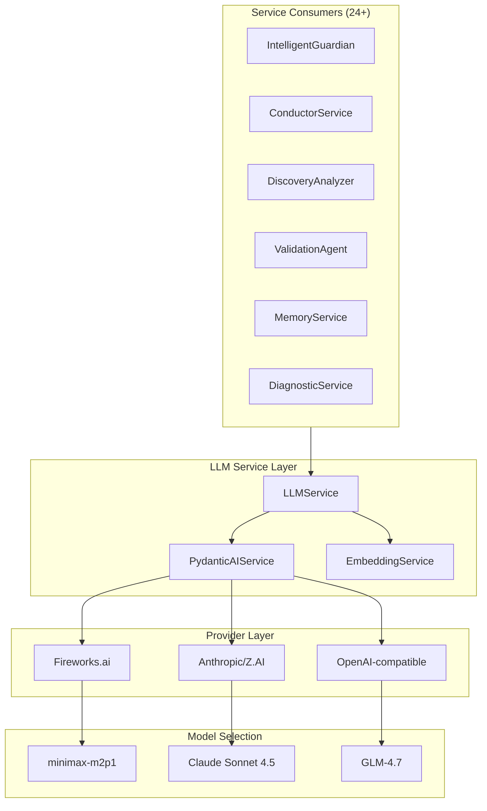
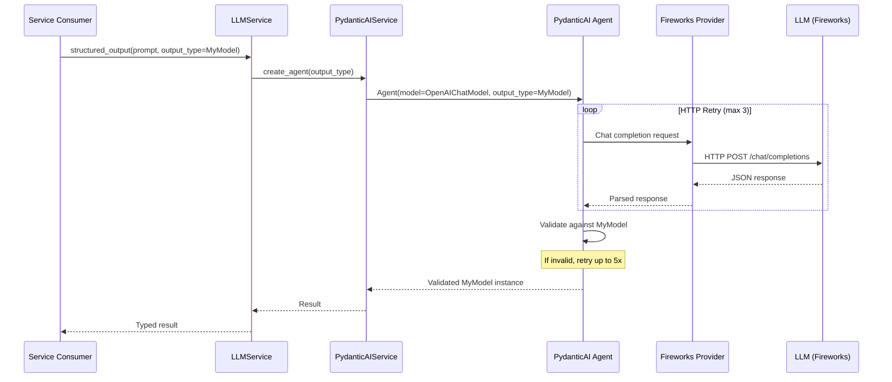

# Part 15: LLM Service Layer

> **Status**: Production-Ready | **Last Updated**: 2025-04-22
> 
> This document covers the LLM abstraction layer providing structured outputs, text completion, and embeddings across multiple providers with retry logic and cost management.

## Purpose

The LLM Service Layer provides a **unified interface** for all AI-driven operations in OmoiOS. It abstracts model selection, provider-specific configurations, and complex structured output logic into a simple, typed API used by over 24 services across the codebase.

## Architecture Overview



## Class Hierarchy

```
LLMService (main interface)
  └── PydanticAIService (structured output implementation)
        └── PydanticAI Agent (via pydantic-ai library)
              └── OpenAIChatModel + OpenAIProvider (Fireworks.ai)
```

## Key Components

### LLMService

**Location**: `backend/omoi_os/services/llm_service.py`

The primary entry point for LLM interactions. Implemented as a singleton accessible via `get_llm_service()`.

```python
class LLMService:
    """Simple service for LLM text completion and structured outputs."""
    
    def __init__(self, settings: Optional[LLMSettings] = None)
    
    async def complete(
        self, 
        prompt: str, 
        system_prompt: Optional[str] = None, 
        **kwargs
    ) -> str
    
    async def structured_output(
        self,
        prompt: str,
        output_type: type[T],
        system_prompt: Optional[str] = None,
        output_retries: int = 5,
        http_retries: int = 3,
        **kwargs,
    ) -> T
```

**Key Methods**:

| Method | Purpose | Use Case |
|--------|---------|----------|
| `complete()` | Simple text completion | Free-form text generation |
| `structured_output()` | Typed structured output | Analysis, classification, extraction |

### PydanticAIService

**Location**: `backend/omoi_os/services/pydantic_ai_service.py`

Internal implementation delegated to by `LLMService`. Leverages the `pydantic-ai` library to manage agent instances and model interactions.

```python
class PydanticAIService:
    """Central service for PydanticAI using Fireworks.ai."""
    
    def __init__(self, settings: Optional[LLMSettings] = None)
    
    def create_agent(
        self,
        output_type: type,
        system_prompt: Optional[str] = None,
        output_retries: int = 5,
    ) -> Agent
```

**Features**:
- Creates PydanticAI Agent instances on demand
- Default model: `accounts/fireworks/models/minimax-m2p1` (optimized for structured output)
- Fireworks.ai provider with OpenAI-compatible API

### EmbeddingService

**Location**: `backend/omoi_os/services/embedding.py`

Provides text embedding capabilities for similarity search and deduplication.

**Providers**:
- **Fireworks** (default): Fast, affordable, OpenAI-compatible
- **OpenAI**: text-embedding-3-small
- **Local**: FastEmbed model (no API costs, slow startup)

**Usage**:
```python
from omoi_os.services.embedding import EmbeddingService

embedder = EmbeddingService()
embedding = await embedder.embed("text to embed")
similarity = await embedder.similarity(text1, text2)
```

## Configuration

**Location**: `backend/omoi_os/config.py:154-176`

Settings are managed via `LLMSettings`:

```python
class LLMSettings(OmoiBaseSettings):
    yaml_section = "llm"
    model_config = SettingsConfigDict(env_prefix="LLM_")
    
    model: str = "openhands/claude-sonnet-4-5-20250929"
    api_key: Optional[str] = None
    base_url: Optional[str] = None
    fireworks_api_key: Optional[str] = None
    mode: str = "live"  # "live" | "record" | "replay" | "null"
    recording_dir: str = ".llm-recordings"
    replay_strict: bool = False
```

**Environment Variables**:

| Variable | Purpose |
|----------|---------|
| `LLM_MODEL` | Model identifier |
| `LLM_API_KEY` | Primary API key |
| `LLM_FIREWORKS_API_KEY` | Dedicated Fireworks key |
| `LLM_BASE_URL` | Custom endpoint URL |
| `LLM_MODE` | live/record/replay/null |

**YAML Configuration** (`config/base.yaml`):

```yaml
llm:
  model: openai/glm-4.7
  api_key: null  # Set LLM_API_KEY in .env
  base_url: https://api.z.ai/api/coding/paas/v4
  fireworks_api_key: null
  mode: "live"
  recording_dir: ".llm-recordings"
  replay_strict: false
```

## structured_output Pattern

The canonical pattern for obtaining structured data from an LLM:

### 1. Define Pydantic Response Model

```python
from pydantic import BaseModel, Field

class TrajectoryAnalysis(BaseModel):
    """Analysis of agent trajectory alignment."""
    
    alignment_score: float = Field(..., ge=0.0, le=1.0)
    trajectory_summary: str
    steering_needed: bool
    recommended_action: str
    confidence: float = Field(..., ge=0.0, le=1.0)
```

### 2. Call the Service

```python
from omoi_os.services.llm_service import get_llm_service

llm = get_llm_service()
result = await llm.structured_output(
    prompt="Analyze this agent trajectory...",
    output_type=TrajectoryAnalysis,
    system_prompt="You are an expert trajectory analyzer.",
    output_retries=3,
)
```

### 3. Use the Result

```python
# result is a validated TrajectoryAnalysis instance
print(result.alignment_score)  # 0.85
print(result.steering_needed)  # False

# Convert to dict for JSONB storage
result_dict = result.model_dump(mode='json')
```

## Retry and Error Handling

### HTTP Retry Logic

**Location**: `backend/omoi_os/services/llm_service.py:136-184`

```python
for attempt in range(http_retries + 1):
    try:
        result = await agent.run(prompt)
        return result.output
    except Exception as e:
        error_str = str(e).lower()
        is_retryable = any(
            indicator in error_str
            for indicator in [
                "503", "502", "500", "504", "429",
                "service unavailable", "rate limit"
            ]
        )
        
        if is_retryable and attempt < http_retries:
            # Exponential backoff with jitter
            base_delay = 2**attempt
            jitter = random.uniform(0, 0.5 * base_delay)
            delay = base_delay + jitter
            await asyncio.sleep(delay)
```

**Retryable Status Codes**: 429, 500, 502, 503, 504

**Backoff Pattern**: 1s, 2s, 4s + random jitter (0-50%)

### Output Validation Retry

**Location**: `backend/omoi_os/services/pydantic_ai_service.py:64-95`

PydanticAI handles output validation retries internally:
- Default: 5 retries for validation failures
- Each retry sends the validation error back to the LLM
- LLM attempts to correct the output format

## Response Models in Codebase

| Model | Location | Purpose |
|-------|----------|---------|
| `LLMTrajectoryAnalysisResponse` | `backend/omoi_os/models/trajectory_analysis.py` | Trajectory alignment, steering needs |
| `LLMDuplicateAnalysisResponse` | `backend/omoi_os/services/conductor.py` | Duplicate detection |
| `LLMQualityCheckResponse` | `backend/omoi_os/services/quality_checker.py` | Quality metrics |
| `LLMDiagnosticResponse` | `backend/omoi_os/services/diagnostic.py` | Diagnostic analysis |
| `LLMValidationResponse` | `backend/omoi_os/services/validation_agent.py` | Phase gate validation |

## Service Consumers

The LLM service is a core dependency used by 24+ files:

| Service | Usage |
|---------|-------|
| `intelligent_guardian.py` | Trajectory analysis and steering |
| `conductor.py` | System-wide duplicate detection |
| `discovery_analyzer.py` | Discovery analysis for adaptive branching |
| `task_requirements_analyzer.py` | Task work type and dependency analysis |
| `quality_checker.py` | Quality metrics calculation |
| `context_summarizer.py` | Context summarization for handoffs |
| `validation_agent.py` | Phase gate reviews |
| `memory.py` | Pattern extraction for long-term memory |
| `quality_predictor.py` | Quality prediction for planned work |
| `spec_acceptance_validator.py` | Acceptance criteria validation |
| `diagnostic.py` | Stuck workflow diagnosis |

## Data Flow

### Structured Output Flow



## Prompt Management

### Spec-Sandbox Prompts

**Location**: `subsystems/spec-sandbox/src/spec_sandbox/prompts/phases.py`

Dedicated prompt templates for spec-driven development:

| Phase | Prompt Function | Output |
|-------|-----------------|--------|
| EXPLORE | `get_phase_prompt(SpecPhase.EXPLORE)` | Codebase analysis |
| PRD | `get_phase_prompt(SpecPhase.PRD)` | Product requirements |
| REQUIREMENTS | `get_phase_prompt(SpecPhase.REQUIREMENTS)` | Technical requirements |
| DESIGN | `get_phase_prompt(SpecPhase.DESIGN)` | Architecture design |
| TASKS | `get_phase_prompt(SpecPhase.TASKS)` | Task breakdown |
| SYNC | `get_phase_prompt(SpecPhase.SYNC)` | Synchronization plan |

### Access Pattern

```python
from spec_sandbox.prompts.phases import get_phase_prompt, SpecPhase

prompt = get_phase_prompt(SpecPhase.EXPLORE)
# Returns structured prompt for exploration phase
```

## Cost Management

### Token Tracking

The LLM service tracks token usage for cost analysis:

```python
# Result includes usage metadata
result = await llm.structured_output(...)
# Access via result._metadata (if available from provider)
```

### Model Selection by Cost

| Model | Provider | Cost Tier | Use Case |
|-------|----------|-----------|----------|
| `minimax-m2p1` | Fireworks | Low | Structured outputs |
| `claude-sonnet-4-5` | Anthropic | Medium | Complex reasoning |
| `glm-4.7` | Z.AI | Low | General completion |

### Title Generation Optimization

**Location**: `backend/omoi_os/config.py:795-821`

Uses a separate, lightweight LLM for title generation to keep costs low:

```python
class TitleGenerationSettings(OmoiBaseSettings):
    yaml_section = "title_generation"
    
    model: str = "accounts/fireworks/models/gpt-oss-20b"
    api_key: Optional[str] = None
    base_url: str = "https://api.fireworks.ai/inference/v1"
```

## Testing

### Unit Testing with Mock

```python
import pytest
from unittest.mock import AsyncMock, patch

@pytest.mark.asyncio
async def test_structured_output():
    mock_result = TrajectoryAnalysis(
        alignment_score=0.9,
        trajectory_summary="On track",
        steering_needed=False,
        recommended_action="continue",
        confidence=0.95
    )
    
    with patch("omoi_os.services.llm_service.get_llm_service") as mock:
        mock.return_value.structured_output = AsyncMock(return_value=mock_result)
        
        result = await analyze_trajectory(...)
        assert result.alignment_score == 0.9
```

### Integration Testing

```python
@pytest.mark.asyncio
async def test_real_llm_call():
    llm = get_llm_service()
    
    class TestModel(BaseModel):
        value: int
        name: str
    
    result = await llm.structured_output(
        prompt="Return value=42, name='test'",
        output_type=TestModel
    )
    
    assert result.value == 42
    assert result.name == "test"
```

## Error Handling

| Scenario | Behavior |
|----------|----------|
| API key missing | Raises `ValueError` on service init |
| HTTP 429 (rate limit) | Retries with exponential backoff |
| HTTP 503 (unavailable) | Retries, then raises after exhaustion |
| Validation failure | Retries up to 5x with error feedback |
| Timeout | Retries as transient error |
| Invalid JSON | PydanticAI handles, retries with feedback |

## Integration with Other Systems

| System | Integration Point |
|--------|-------------------|
| **Guardian** | Trajectory analysis for steering decisions |
| **Conductor** | Duplicate detection across agents |
| **Discovery** | Adaptive branching analysis |
| **Validation** | Phase gate quality checks |
| **Memory** | Pattern extraction and semantic search |
| **Embedding** | Vector representations for similarity |

## Key Files

| File | Purpose |
|------|---------|
| `backend/omoi_os/services/llm_service.py` | Public API and singleton provider |
| `backend/omoi_os/services/pydantic_ai_service.py` | Structured output implementation |
| `backend/omoi_os/services/embedding.py` | Text embedding service |
| `backend/omoi_os/config.py` | LLM and Embedding configuration |
| `subsystems/spec-sandbox/src/spec_sandbox/prompts/phases.py` | Spec-Sandbox phase prompts |

## Related Documentation

### Architecture Deep-Dives
- [Part 2: Execution System](02-execution-system.md) — LLM-powered task analysis
- [Part 9: MCP Integration](09-mcp-integration.md) — LLM tool integration
- [Part 12: Configuration System](12-configuration-system.md) — LLM settings

### Design Docs
- [LLM Service Guide](../design/services/llm_service_guide.md) — Full LLM implementation
- MCP Server Integration — LLM tool use
- Diagnostic Reasoning Schema — LLM output schemas

### Requirements
- [Diagnosis Agent](../requirements/agents/diagnosis_agent.md) — LLM diagnostic requirements
- [Validation System](../requirements/agents/validation_system.md) — LLM validation
