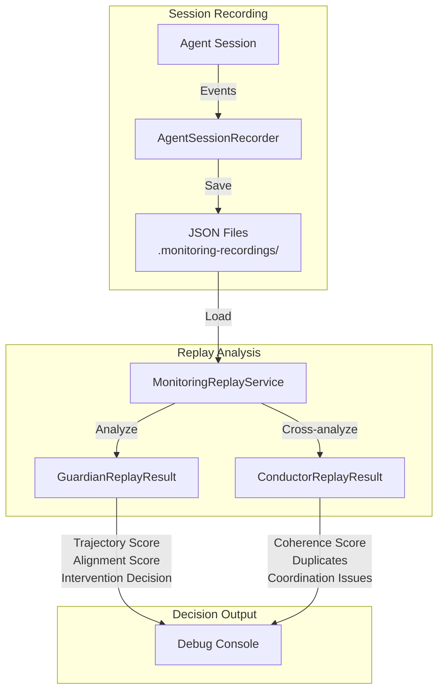
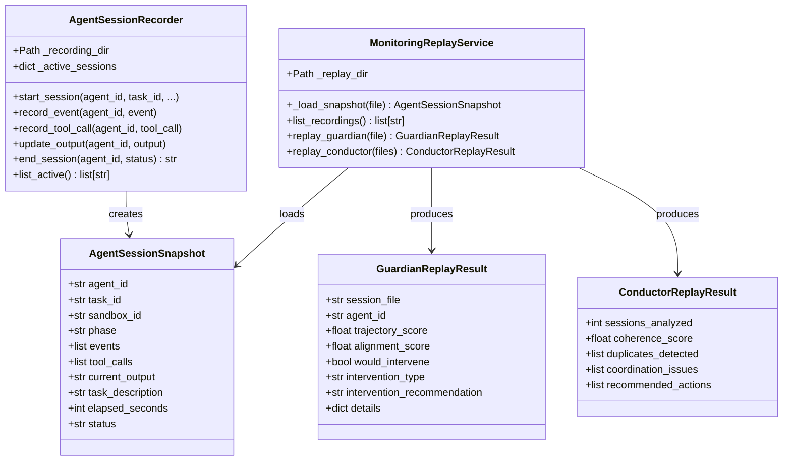
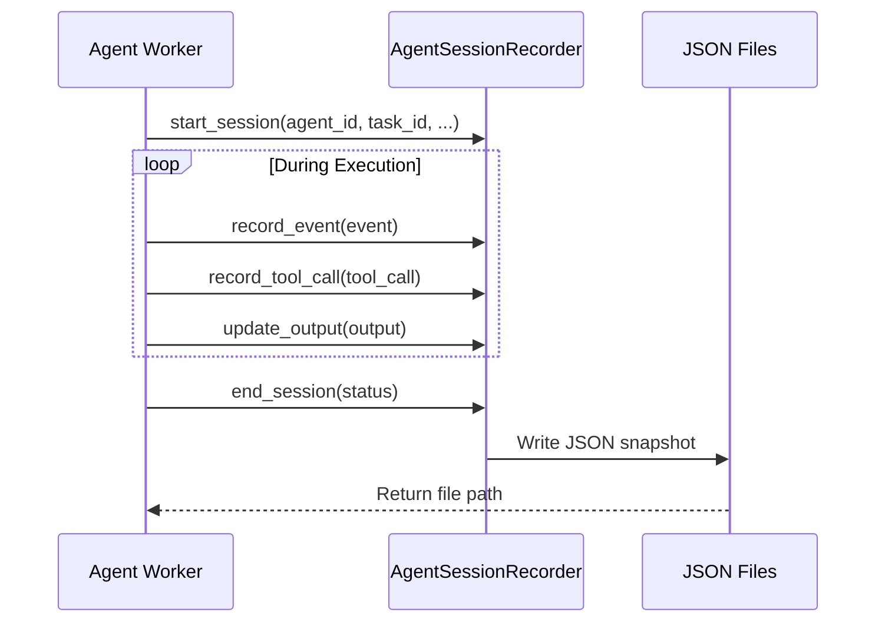
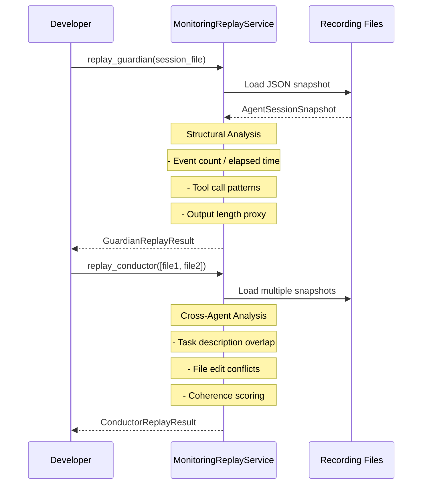

# Part 17: Monitoring Replay System

> Extracted from [ARCHITECTURE.md](../../ARCHITECTURE.md) — see hub doc for full system overview.

## Purpose

Enable testing and debugging of the monitoring system (Guardian and Conductor) without requiring live agent execution. The Monitoring Replay System records agent session snapshots to disk and provides standalone replay capabilities for analyzing monitoring decisions offline.

## Location

```
backend/omoi_os/services/
├── monitoring_replay.py      # Core replay service + session recorder
```

## Overview

The Monitoring Replay System solves a critical operational need: understanding why Guardian and Conductor made specific decisions without running expensive live agents. It captures agent session state (events, tool calls, outputs) and provides structural analysis that mirrors the real monitoring system's behavior.



## Key Components

### AgentSessionSnapshot

Dataclass capturing a point-in-time view of an agent session:

| Field | Type | Description |
|-------|------|-------------|
| `agent_id` | str | Unique agent identifier |
| `task_id` | str | Associated task ID |
| `sandbox_id` | str | Sandbox environment ID |
| `phase` | str | Current spec phase |
| `events` | list[dict] | Event history |
| `tool_calls` | list[dict] | Tool invocation records |
| `current_output` | str | Current agent output |
| `task_description` | str | Task description |
| `elapsed_seconds` | int | Session duration |
| `status` | str | "running" \| "completed" \| "failed" |

### GuardianReplayResult

Output from replaying a session through Guardian analysis:

| Field | Type | Description |
|-------|------|-------------|
| `session_file` | str | Source recording file |
| `agent_id` | str | Analyzed agent |
| `trajectory_score` | float | 0.0-1.0 alignment score |
| `alignment_score` | float | 0.0-1.0 activity alignment |
| `would_intervene` | bool | Whether Guardian would intervene |
| `intervention_type` | str | "restart" \| "redirect" \| "refocus" |
| `intervention_recommendation` | str | Human-readable guidance |

### ConductorReplayResult

Output from cross-agent analysis:

| Field | Type | Description |
|-------|------|-------------|
| `sessions_analyzed` | int | Number of sessions |
| `coherence_score` | float | 0.0-1.0 system coherence |
| `duplicates_detected` | list[dict] | Potential duplicate work |
| `coordination_issues` | list[str] | File edit conflicts |
| `recommended_actions` | list[str] | Suggested interventions |

## Architecture



## Data Flow

### Recording Flow



### Replay Flow



## Analysis Algorithms

### Guardian Structural Analysis

The replay service performs heuristic analysis without LLM calls:

```python
# Activity rate calculation
event_count = len(snapshot.events)
elapsed = max(snapshot.elapsed_seconds, 1)
activity_rate = (event_count / elapsed) * 60  # events per minute

# Alignment scoring
if is_completed:
    alignment = 0.95
elif has_output and has_events:
    alignment = min(0.85, 0.5 + (activity_rate * 0.05))
elif has_events:
    alignment = min(0.7, 0.3 + (activity_rate * 0.05))
else:
    alignment = 0.2

# Intervention decision
would_intervene = alignment < 0.6
```

### Conductor Cross-Agent Analysis

Duplicate detection via task description word overlap:

```python
# Word overlap similarity
words1 = set(description1.lower().split())
words2 = set(description2.lower().split())
overlap = len(words1 & words2) / max(len(words1 | words2), 1)

# Duplicate threshold
if overlap > 0.5:
    mark_as_duplicate()
```

File edit conflict detection:
```python
# Extract files from tool calls
agent_files = {}
for snapshot in snapshots:
    files = set()
    for tc in snapshot.tool_calls:
        f = tc.get("file") or tc.get("path") or ""
        if f:
            files.add(f)
    agent_files[snapshot.agent_id] = files

# Detect overlaps
for each agent pair:
    shared = agent_files[a1] & agent_files[a2]
    if shared:
        report_coordination_issue(a1, a2, shared)
```

## API Surface

### MonitoringReplayService

| Method | Signature | Purpose |
|--------|-----------|---------|
| `__init__` | `(replay_dir: str = ".monitoring-recordings")` | Initialize with recording directory |
| `list_recordings` | `() -> list[str]` | List all available recording files |
| `replay_guardian` | `(session_file: str) -> GuardianReplayResult` | Analyze single session |
| `replay_conductor` | `(session_files: list[str]) -> ConductorReplayResult` | Cross-agent analysis |

### AgentSessionRecorder

| Method | Signature | Purpose |
|--------|-----------|---------|
| `__init__` | `(recording_dir: str = ".monitoring-recordings")` | Initialize recorder |
| `start_session` | `(agent_id, task_id, sandbox_id, phase, task_description)` | Begin recording |
| `record_event` | `(agent_id, event)` | Append event to session |
| `record_tool_call` | `(agent_id, tool_call)` | Append tool call |
| `update_output` | `(agent_id, output)` | Update current output |
| `end_session` | `(agent_id, status) -> Optional[str]` | Finalize and save |
| `list_active` | `() -> list[str]` | List active session IDs |

## Configuration

Settings are managed via `MonitoringSettings` in `backend/omoi_os/config.py`:

```yaml
# config/base.yaml
monitoring:
  replay_mode: false           # Enable replay mode
  replay_dir: ".monitoring-recordings"  # Recording storage path
```

Environment variables:
```bash
# .env
MONITORING_REPLAY_MODE=false
MONITORING_REPLAY_DIR=.monitoring-recordings
```

## File Format

Recording files are JSON with this structure:

```json
{
  "agent_id": "agent-abc123",
  "task_id": "task-def456",
  "sandbox_id": "sandbox-ghi789",
  "phase": "IMPLEMENTATION",
  "started_at": "2025-01-15T10:30:00Z",
  "events": [...],
  "tool_calls": [...],
  "current_output": "Implemented feature X...",
  "task_description": "Add user authentication",
  "elapsed_seconds": 120,
  "status": "completed"
}
```

## Error Handling

| Scenario | Behavior |
|----------|----------|
| Missing recording file | Returns empty list (list_recordings) or raises FileNotFoundError |
| Invalid JSON | Logs warning, skips file |
| Missing required fields | Filters to only known dataclass fields |
| Empty session list | Returns default result with coherence_score=1.0 |

## Testing Notes

### Unit Testing

```python
# Test recording and replay
recorder = AgentSessionRecorder(recording_dir="/tmp/test")
recorder.start_session("agent-1", "task-1", "sandbox-1", "TEST", "Test task")
recorder.record_event("agent-1", {"type": "test"})
path = recorder.end_session("agent-1", "completed")

# Replay analysis
replay = MonitoringReplayService(replay_dir="/tmp/test")
result = replay.replay_guardian(path)
assert result.trajectory_score > 0.5
```

### Integration with Real Monitoring

For full Guardian/Conductor integration with replay capabilities, use the real `MonitoringLoop` with `replay_mode` enabled rather than the standalone `MonitoringReplayService`. The standalone service provides structural analysis only; the integrated loop provides LLM-powered analysis.

## Related Documentation

- [04-readjustment-system.md](04-readjustment-system.md) — Guardian and Conductor deep-dive
- [02-execution-system.md](02-execution-system.md) — Agent execution and sandbox workers
- [ARCHITECTURE.md](../../ARCHITECTURE.md) — System overview and service interaction map
