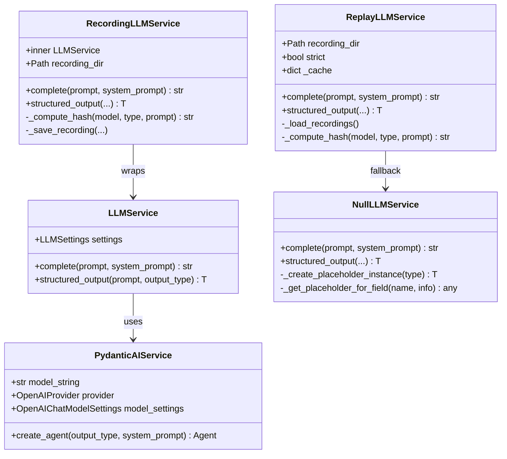
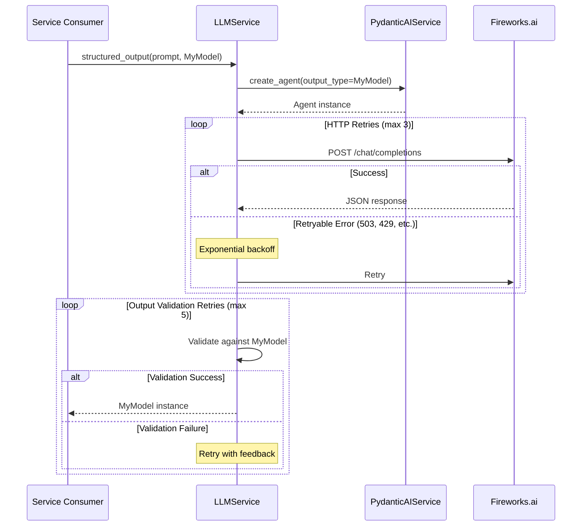
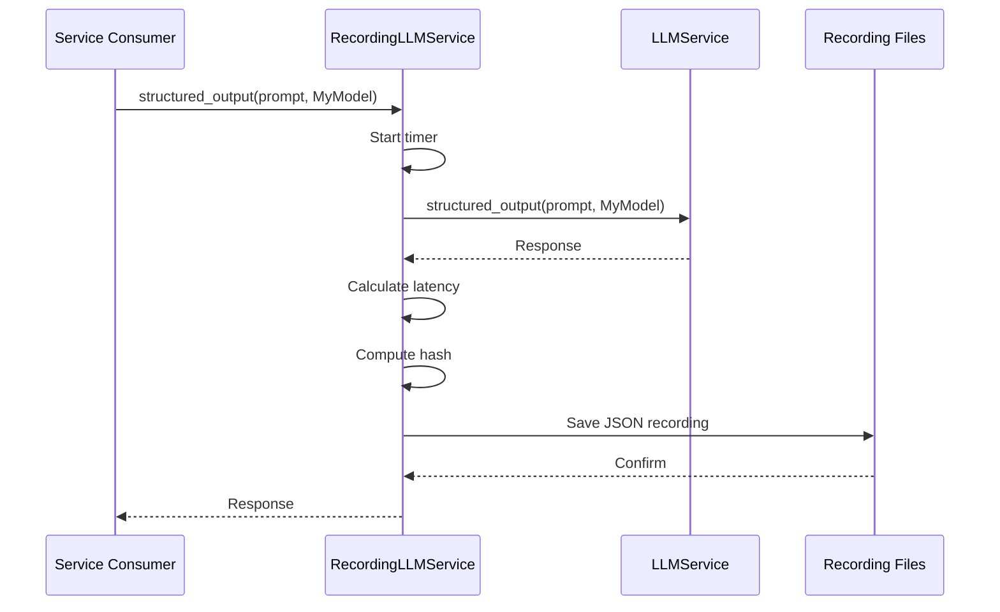
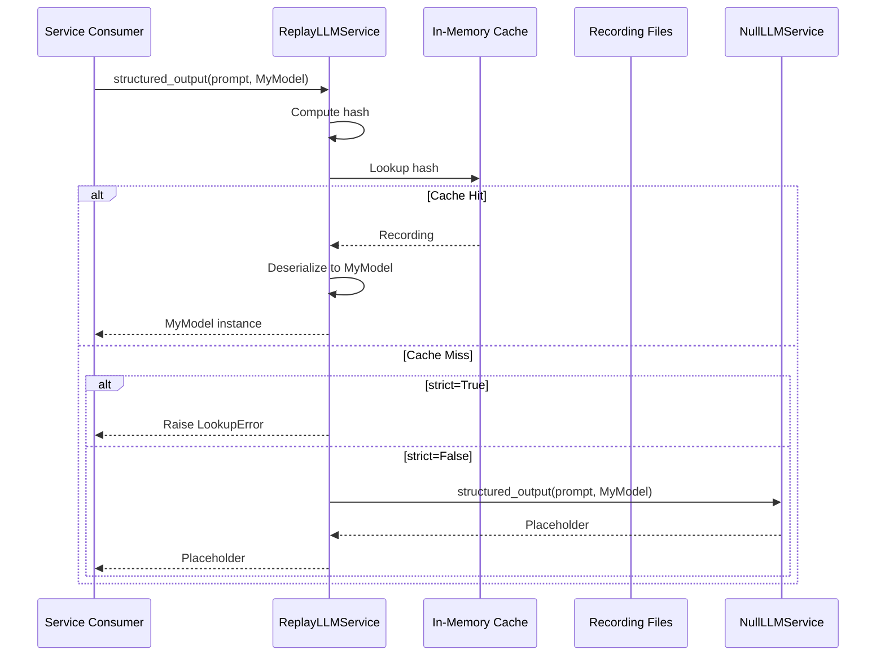

# Part 18: LLM Service Internals

> Extracted from [ARCHITECTURE.md](../../ARCHITECTURE.md) — see hub doc for full system overview. Complements [15-llm-service.md](15-llm-service.md) with implementation details.

## Purpose

Provide a flexible, testable, and observable LLM invocation layer with multiple operational modes (live, record, replay, null) for development, testing, and production use.

## Location

```
backend/omoi_os/services/
├── llm_service.py              # Main LLMService interface (219 lines)
├── llm_factory.py              # Factory for mode selection (76 lines)
├── pydantic_ai_service.py      # PydanticAI integration (95 lines)
├── recording_llm_service.py    # Records calls to disk (212 lines)
├── replay_llm_service.py       # Replays from disk cache (204 lines)
└── null_llm_service.py         # No-op placeholder (175 lines)
```

## Overview

The LLM Service Layer uses a **decorator pattern** with a factory to provide different operational modes. All services implement the same interface (`complete()` and `structured_output()`), allowing seamless swapping between live inference, recording, replay, and null modes.

```mermaid
flowchart TB
    subgraph Factory["LLM Factory"]
        F[create_llm_service] -->|mode="live"| L[LLMService]
        F -->|mode="record"| R[RecordingLLMService]
        F -->|mode="replay"| P[ReplayLLMService]
        F -->|mode="null"| N[NullLLMService]
    end
    
    subgraph Live["Live Mode"]
        L -->|uses| PA[PydanticAIService]
        PA -->|Fireworks.ai| API[LLM API]
    end
    
    subgraph Record["Record Mode"]
        R -->|wraps| L
        R -->|saves| Disk[JSON Recordings]
    end
    
    subgraph Replay["Replay Mode"]
        P -->|loads| Disk
        P -->|fallback| N
    end
    
    subgraph Null["Null Mode"]
        N -->|returns| Placeholder[Placeholder Responses]
    end
```

## Architecture

### Class Hierarchy



## Component Details

### LLMService

The primary interface for LLM operations. Implements singleton pattern via `get_llm_service()`.

**Key Methods:**

| Method | Purpose | Retry Logic |
|--------|---------|-------------|
| `complete(prompt, system_prompt)` | Simple text completion | No retry |
| `structured_output(prompt, output_type, ...)` | Typed structured output | HTTP retries (3x) + output validation retries (5x) |

**HTTP Retry Behavior:**
```python
RETRYABLE_STATUS_CODES = {429, 500, 502, 503, 504}
# Exponential backoff with jitter: 1s, 2s, 4s + random(0, 0.5*base)
```

### PydanticAIService

Internal implementation using the `pydantic-ai` library with Fireworks.ai backend.

**Configuration:**
- Default model: `accounts/fireworks/models/minimax-m2p1`
- Provider: Fireworks.ai via OpenAI-compatible API
- Base URL: `https://api.fireworks.ai/inference/v1`

**Features:**
- Automatic structured output validation
- JSON mode enabled for better schema adherence
- Configurable output retries (default: 5)

### RecordingLLMService

Wraps a live LLM service and saves all prompt/response pairs to disk.

**Recording Format:**
```json
{
  "hash": "a1b2c3d4e5f67890",
  "model": "accounts/fireworks/models/minimax-m2p1",
  "prompt": "Analyze this code...",
  "output_type": "AnalysisResult",
  "response": {...},
  "recorded_at": "2025-01-15T10:30:00Z",
  "latency_ms": 1234
}
```

**Hash Computation:**
```python
key = f"{model}::{output_type_name}::{prompt}"
hash = sha256(key.encode()).hexdigest()[:16]
```

### ReplayLLMService

Loads recordings from disk and returns cached responses without API calls.

**Cache Miss Behavior:**
- `strict=True`: Raises `LookupError`
- `strict=False`: Falls back to `NullLLMService`

**Use Cases:**
- Deterministic testing with known responses
- CI/CD pipelines requiring consistent results
- Local development without API keys

### NullLLMService

Returns placeholder responses without making any API calls.

**Placeholder Generation:**
- Strings: `"[placeholder: {field_name}]"`
- Integers: `0`
- Floats: `0.0`
- Booleans: `False`
- Lists: `[]`
- Dicts: `{}`
- Pydantic models: Recursively constructed with `model_construct()`

## Data Flow

### Live Mode Flow



### Record Mode Flow



### Replay Mode Flow



## API Surface

### Factory Function

```python
def create_llm_service(settings: LLMSettings | None = None) -> LLMService:
    """Create LLM service based on mode config."""
    # mode="live" -> LLMService
    # mode="record" -> RecordingLLMService(wraps LLMService)
    # mode="replay" -> ReplayLLMService
    # mode="null" -> NullLLMService
```

### Common Interface

All services implement:

```python
async def complete(
    self, 
    prompt: str, 
    system_prompt: Optional[str] = None, 
    **kwargs
) -> str

async def structured_output(
    self,
    prompt: str,
    output_type: type[T],
    system_prompt: Optional[str] = None,
    output_retries: int = 5,
    http_retries: int = 3,
    **kwargs,
) -> T
```

## Configuration

Settings are managed via `LLMSettings` in `backend/omoi_os/config.py`:

```yaml
# config/base.yaml
llm:
  model: "accounts/fireworks/models/minimax-m2p1"
  mode: "live"  # "live" | "record" | "replay" | "null"
  recording_dir: ".llm-recordings"
  replay_strict: false
```

Environment variables:
```bash
# .env
LLM_API_KEY=your-fireworks-key          # Primary API key
LLM_FIREWORKS_API_KEY=your-key          # Dedicated Fireworks key (preferred)
LLM_MODE=live                           # Operational mode
LLM_RECORDING_DIR=.llm-recordings       # Recording storage
LLM_REPLAY_STRICT=false                 # Strict replay mode
```

## Error Handling

| Scenario | Behavior |
|----------|----------|
| HTTP 503/429/502/504 | Retry with exponential backoff (max 3 retries) |
| HTTP 400/401/403 | Fail immediately (not retryable) |
| Pydantic validation failure | Retry with feedback (max 5 retries) |
| Recording directory missing | Auto-create on initialization |
| Replay cache miss + strict=True | Raise `LookupError` |
| Replay cache miss + strict=False | Return placeholder via NullLLMService |

## Testing Notes

### Mode Selection for Tests

```python
# Unit tests - use null mode
settings = LLMSettings(mode="null")
llm = create_llm_service(settings)

# Integration tests - use replay mode with fixtures
settings = LLMSettings(mode="replay", replay_strict=True)
llm = create_llm_service(settings)

# Recording new fixtures
settings = LLMSettings(mode="record")
llm = create_llm_service(settings)
# Run tests, then copy recordings to fixtures/
```

### Recording Management

```bash
# List all recordings
ls -la .llm-recordings/

# Clear recordings for fresh capture
rm -rf .llm-recordings/*.json

# Copy to test fixtures
cp .llm-recordings/*.json tests/fixtures/llm/
```

### Testing NullLLMService Placeholders

```python
from pydantic import BaseModel

class TestModel(BaseModel):
    name: str
    count: int
    items: list[str]

null_service = NullLLMService()
result = await null_service.structured_output("test", TestModel)

assert result.name == "[placeholder: name]"
assert result.count == 0
assert result.items == []
```

## Performance Considerations

| Mode | Latency | Cost | Use Case |
|------|---------|------|----------|
| `live` | ~500-2000ms | Real API calls | Production |
| `record` | ~500-2000ms + disk | Real API calls | Capturing fixtures |
| `replay` | ~1-5ms | None | Testing, CI/CD |
| `null` | ~0.1ms | None | Unit tests, offline dev |

## Related Documentation

- [15-llm-service.md](15-llm-service.md) — High-level LLM service overview
- [12-configuration-system.md](12-configuration-system.md) — Configuration patterns
- [ARCHITECTURE.md](../../ARCHITECTURE.md) — System-wide service interaction
