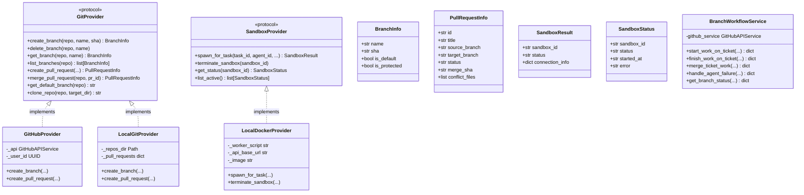
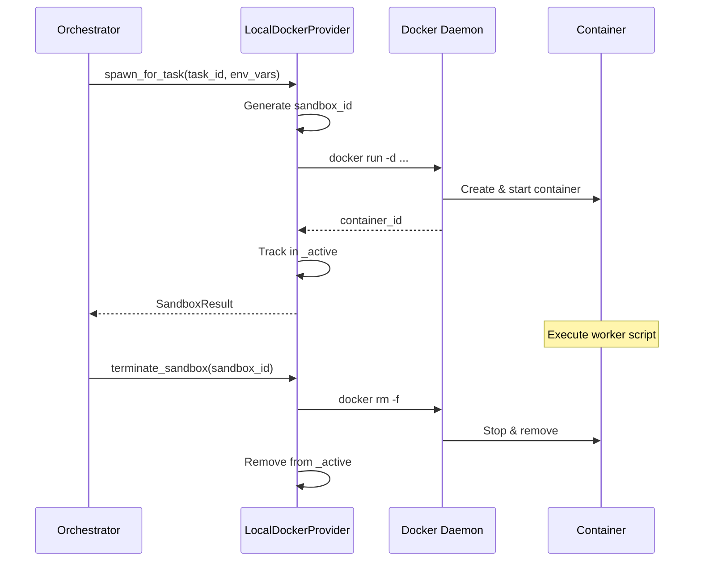
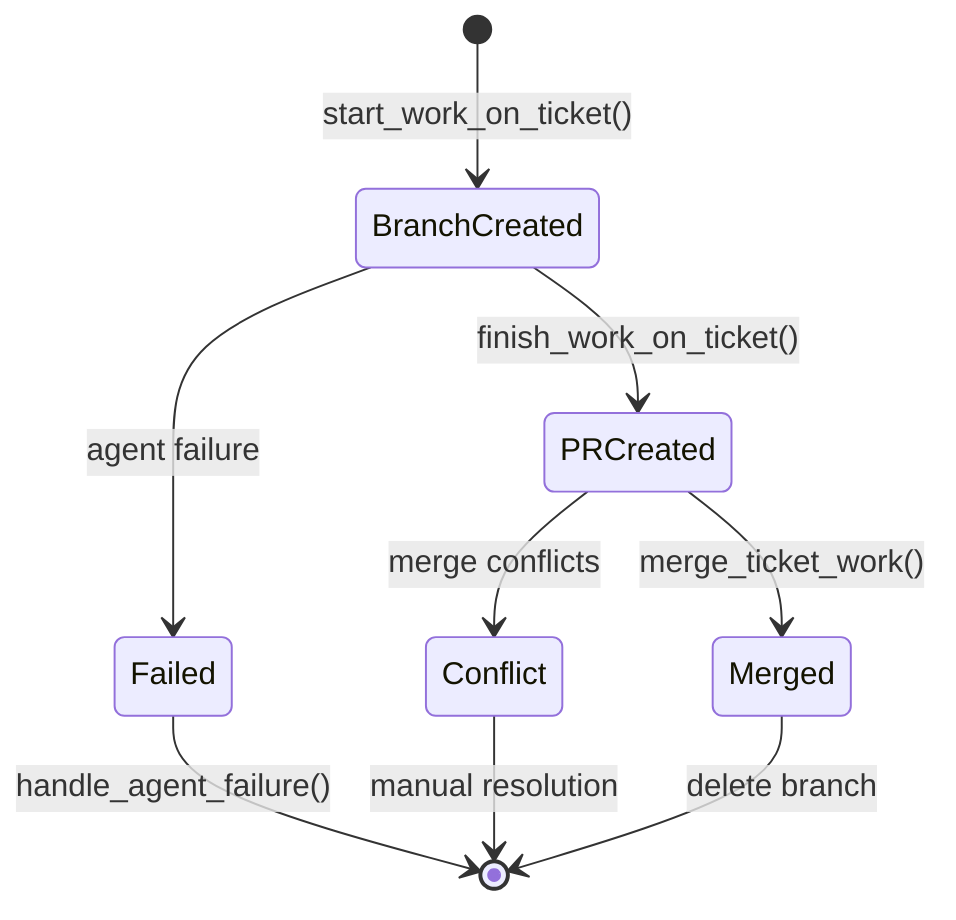
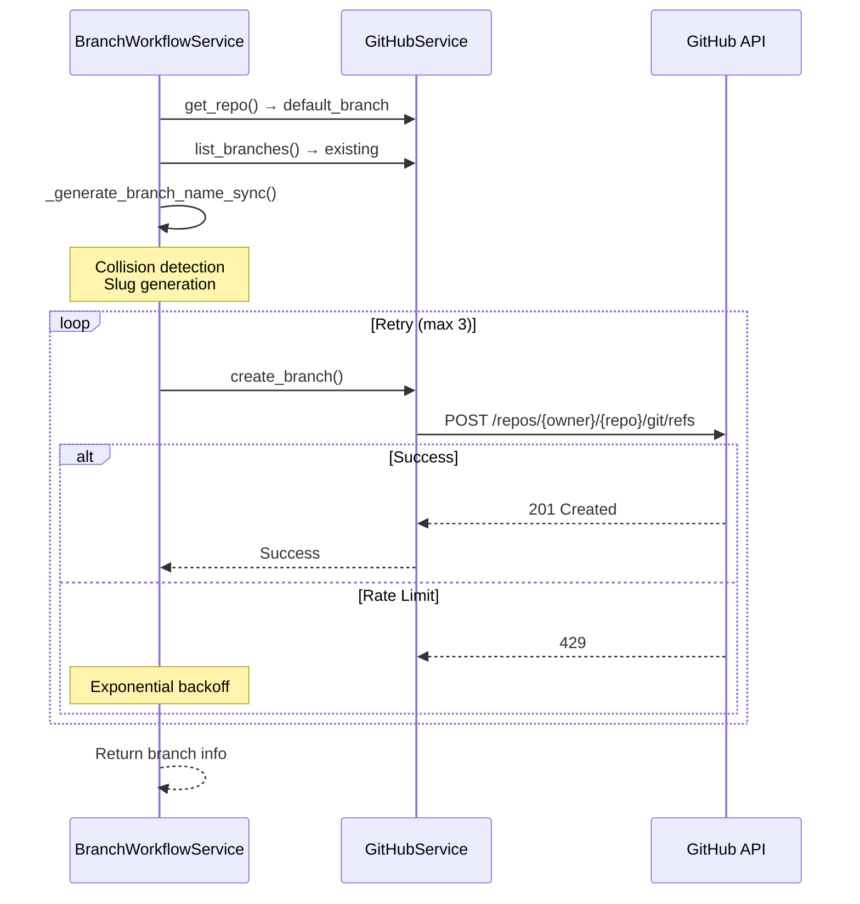
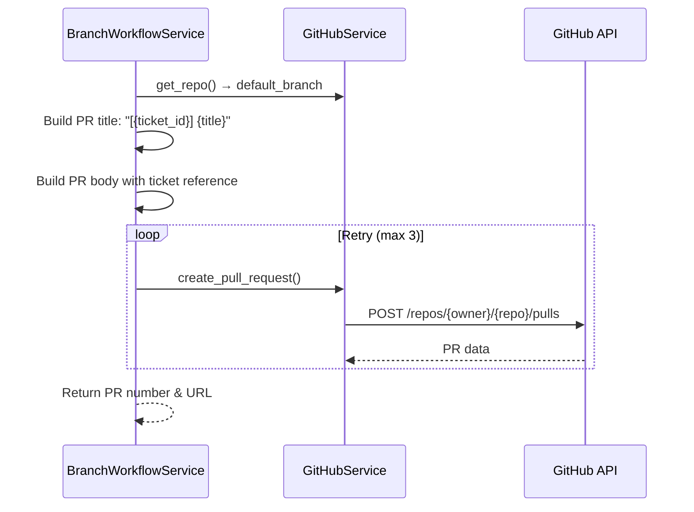
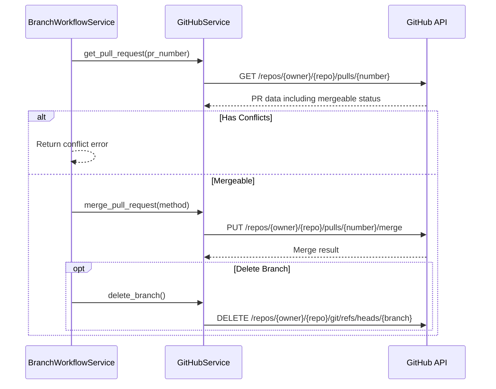

# Part 19: Git Provider Abstraction

> Extracted from [ARCHITECTURE.md](../../ARCHITECTURE.md) — see hub doc for full system overview.

## Purpose

Abstract Git operations across multiple backends (GitHub API, local bare repos, Docker sandboxes) to enable development, testing, and production workflows without code changes.

## Location

```
backend/omoi_os/services/
├── git_provider.py             # Protocol definition + data classes (79 lines)
├── git_factory.py              # Provider factory (42 lines)
├── github_provider.py          # GitHub API implementation (161 lines)
├── local_git_provider.py       # Local bare repo implementation (210 lines)
├── local_docker_provider.py    # Docker sandbox provider (127 lines)
├── sandbox_provider.py         # Sandbox protocol (48 lines)
├── branch_preview.py           # Dry-run analysis dataclasses (48 lines)
└── branch_workflow.py          # Ticket-based branch lifecycle (589 lines)
```

## Overview

The Git Provider Abstraction layer uses Python's `Protocol` to define a common interface for Git operations. This enables:

- **Development without GitHub**: Use `LocalGitProvider` with bare repositories
- **Production with GitHub**: Use `GitHubProvider` with real GitHub API
- **Sandbox isolation**: Use `LocalDockerProvider` for containerized execution
- **Seamless switching**: Factory pattern selects provider based on configuration

```mermaid
flowchart TB
    subgraph Factory["Git Factory"]
        F[create_git_provider] -->|provider="github"| GH[GitHubProvider]
        F -->|provider="local"| LG[LocalGitProvider]
    end
    
    subgraph Providers["Provider Implementations"]
        GH -->|wraps| GHA[GitHubAPIService]
        LG -->|uses| BG[Git CLI<br/>Bare Repos]
    end
    
    subgraph Workflow["Branch Workflow"]
        BW[BranchWorkflowService] -->|uses| P[GitProvider]
        BW -->|creates| BP[BranchPreview]
        BW -->|manages| MP[MergePreview]
    end
    
    subgraph Sandbox["Sandbox Layer"]
        SP[SandboxProvider] -->|implemented by| LDP[LocalDockerProvider]
        LDP -->|spawns| DC[Docker Containers]
    end
```

## Architecture

### Protocol Hierarchy



## Component Details

### GitProvider Protocol

Defines the abstract interface for all Git operations:

| Method | Input | Output | Purpose |
|--------|-------|--------|---------|
| `create_branch` | repo, name, source_sha | `BranchInfo` | Create new branch |
| `delete_branch` | repo, name | None | Delete branch |
| `get_branch` | repo, name | `BranchInfo` \| None | Get branch info |
| `list_branches` | repo | list[`BranchInfo`] | List all branches |
| `create_pull_request` | repo, title, source, target, body | `PullRequestInfo` | Create PR |
| `merge_pull_request` | repo, pr_id, method | `PullRequestInfo` | Merge PR |
| `get_default_branch` | repo | str | Get default branch name |
| `clone_repo` | repo, target_dir | str | Clone to directory |

### GitHubProvider

Production implementation wrapping `GitHubAPIService`.

**Features:**
- Full GitHub API integration
- OAuth token authentication
- PR merge conflict detection
- Branch protection awareness

**Usage:**
```python
github_api = GitHubAPIService()
provider = GitHubProvider(github_api, user_id="uuid")
branch = await provider.create_branch("owner/repo", "feature/x", "abc123")
```

### LocalGitProvider

Development implementation using local bare repositories.

**Features:**
- No GitHub account required
- In-memory PR tracking (not persisted)
- Git CLI subprocess execution
- Automatic repo initialization

**Storage Layout:**
```
.local-repos/
├── owner--repo1.git/       # Bare repository
├── owner--repo2.git/
└── agent-sessions/         # Session recordings
```

**Branch Name Generation:**
```python
# Format: {type}/{ticket-id}-{description-slug}
feature/123-add-user-auth
fix/456-fix-login-bug
hotfix/789-critical-patch  # critical priority bugs
```

### LocalDockerProvider

Sandbox provider for isolated containerized execution.

**Configuration:**
- Default image: `nikolaik/python-nodejs:python3.12-nodejs22`
- Network: `host.docker.internal` for API access
- Volume mounts: Optional workspace mounting

**Container Lifecycle:**


### BranchWorkflowService

High-level service managing the complete ticket branch lifecycle.

**Workflow States:**



**Branch Naming Convention:**

| Ticket Type | Priority | Branch Prefix | Example |
|-------------|----------|---------------|---------|
| feature | any | `feature/` | `feature/123-add-auth` |
| bug | normal | `fix/` | `fix/456-login-bug` |
| bug | critical | `hotfix/` | `hotfix/789-critical` |
| refactor | any | `refactor/` | `refactor/321-cleanup` |
| docs | any | `docs/` | `docs/555-update-readme` |
| test | any | `test/` | `test/444-add-tests` |
| chore | any | `chore/` | `chore/999-deps` |

**Retry Logic:**
```python
max_retries: int = 3
retry_delay: float = 1.0  # seconds
# Exponential backoff: 1s, 2s, 4s
```

## Data Flow

### Branch Creation Flow



### PR Creation Flow



### Merge Flow



## API Surface

### Factory Function

```python
def create_git_provider(
    github_api=None, 
    user_id: Optional[UUID | str] = None
) -> GitProvider:
    """Create GitProvider based on config.
    
    Config key: git.provider
    - "github" (default) → GitHubProvider
    - "local" → LocalGitProvider
    """
```

### BranchWorkflowService

| Method | Signature | Purpose |
|--------|-----------|---------|
| `start_work_on_ticket` | `(ticket_id, title, owner, repo, user_id, type, priority) -> dict` | Create feature branch |
| `finish_work_on_ticket` | `(ticket_id, title, branch, owner, repo, user_id, body) -> dict` | Create PR |
| `merge_ticket_work` | `(ticket_id, pr_number, owner, repo, user_id, delete, method) -> dict` | Merge PR |
| `handle_agent_failure` | `(ticket_id, branch, owner, repo, user_id, reason) -> dict` | Preserve branch on failure |
| `get_branch_status` | `(branch, owner, repo, user_id) -> dict` | Compare to default branch |

### Branch Preview Dataclasses

| Class | Purpose |
|-------|---------|
| `BranchPreview` | Predict branch creation outcome |
| `ConflictPrediction` | Predict merge conflicts |
| `MergePreview` | Preview convergence merge order |
| `BranchStrategyPreview` | Full spec branch strategy |

## Configuration

Settings are managed via `GitSettings` in `backend/omoi_os/config.py`:

```yaml
# config/base.yaml
git:
  provider: "github"           # "github" | "local"
  local_repos_dir: ".local-repos"  # For LocalGitProvider
```

Environment variables:
```bash
# .env
GIT_PROVIDER=github
GIT_LOCAL_REPOS_DIR=.local-repos
GITHUB_TOKEN=ghp_...          # For GitHubProvider
```

## Error Handling

| Scenario | Behavior |
|----------|----------|
| Branch already exists | Collision detection appends `-2`, `-3`, etc. |
| No default branch found | Fallback: main → master → develop → trunk → first branch |
| PR has conflicts | Return `has_conflicts=True`, don't attempt merge |
| Merge fails | Return error, preserve branch for manual recovery |
| Agent failure | **Never delete branch** — preserve work for recovery |
| Git CLI error | Raise `RuntimeError` with command output |
| Docker spawn failure | Raise `RuntimeError` with container logs |

## Testing Notes

### Local Development Mode

```python
# Use local provider for development
settings = GitSettings(provider="local")
provider = LocalGitProvider(repos_dir="/tmp/test-repos")

# Create branch without GitHub
branch = await provider.create_branch(
    "test/repo", 
    "feature/test", 
    "abc123"
)
```

### Testing Branch Workflow

```python
# Mock GitHub API for unit tests
class MockGitHubAPI:
    async def get_repo(self, user, owner, repo):
        return MockRepo(default_branch="main")
    
    async def create_branch(self, user, owner, repo, name, from_sha):
        return MockResult(success=True, sha="def456")

service = BranchWorkflowService(github_service=MockGitHubAPI())
result = await service.start_work_on_ticket(
    ticket_id="123",
    ticket_title="Test feature",
    repo_owner="test",
    repo_name="repo",
    user_id="user-1"
)
assert result["success"]
assert result["branch_name"] == "feature/123-test-feature"
```

### Docker Sandbox Testing

```bash
# Verify Docker provider
docker ps  # Ensure Docker is running

# Test spawn
python -c "
import asyncio
from omoi_os.services.local_docker_provider import LocalDockerProvider

async def test():
    provider = LocalDockerProvider()
    result = await provider.spawn_for_task(
        task_id='test-123',
        agent_id='agent-1',
        phase_id='TEST',
        env_vars={'TEST': 'value'}
    )
    print(f'Sandbox: {result.sandbox_id}')
    await provider.terminate_sandbox(result.sandbox_id)

asyncio.run(test())
"
```

## Related Documentation

- [10-github-integration.md](10-github-integration.md) — GitHub API integration details
- [02-execution-system.md](02-execution-system.md) — Sandbox execution and orchestration
- [12-configuration-system.md](12-configuration-system.md) — Configuration patterns
- [ARCHITECTURE.md](../../ARCHITECTURE.md) — System-wide service interaction
