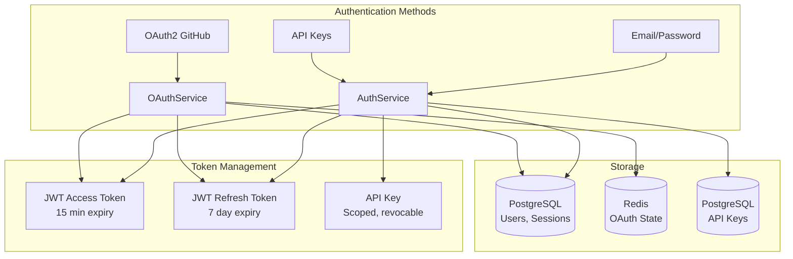
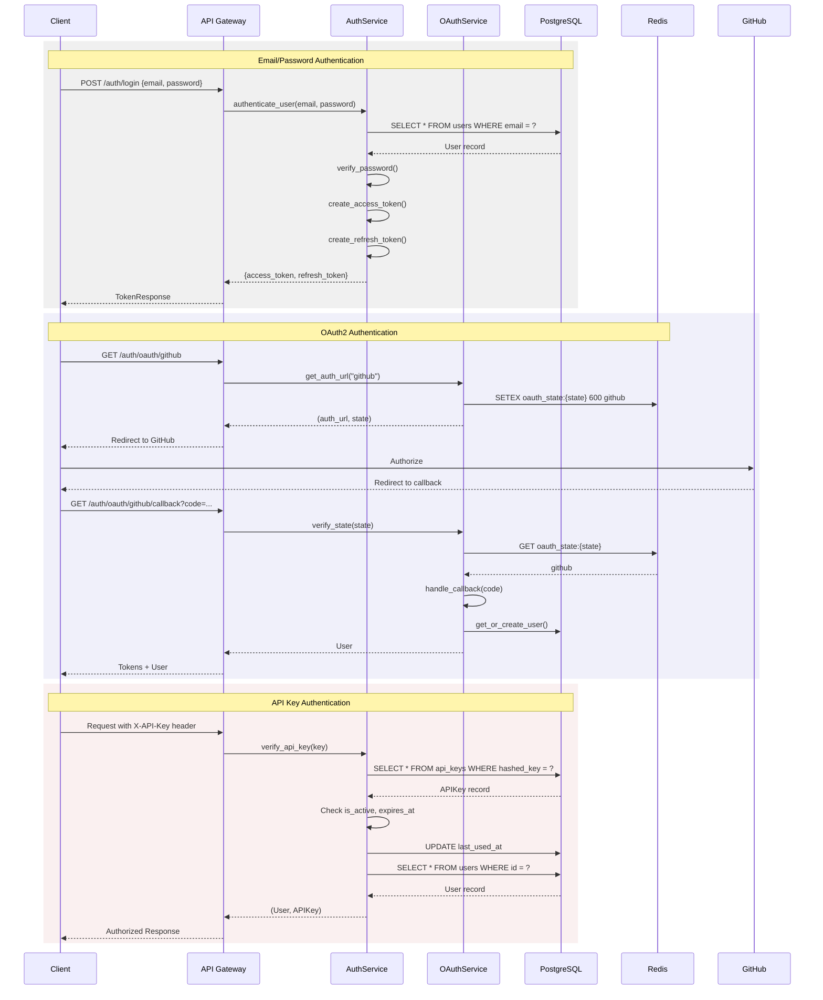

# ADR: Authentication System Architecture

**Status**: Approved  
**Date**: 2025-11-20  
**Updated**: 2025-04-22  
**Decision**: Implement a hybrid authentication system using JWT for session-based auth and API keys for programmatic access, with OAuth2 integration for third-party providers.

**Source Files**:
- `backend/omoi_os/services/auth_service.py` (526 lines)
- `backend/omoi_os/services/oauth_service.py` (552 lines)
- `frontend/lib/api/auth.ts` (210 lines)

**Related Documents**:
- Organization Auth
- API Key Design
- RBAC Design

---

## Table of Contents

1. [Context](#context)
2. [Decision](#decision)
3. [Consequences](#consequences)
4. [Architecture Overview](#architecture-overview)
5. [Data Models](#data-models)
6. [API Surface](#api-surface)
7. [Integration Points](#integration-points)
8. [Configuration](#configuration)
9. [Security Considerations](#security-considerations)
10. [Related Documentation](#related-documentation)

---

## Context

The OmoiOS platform requires a robust authentication and authorization system to support:

1. **Multi-tenant organizations**: Users belong to organizations with isolated resources
2. **Multiple authentication methods**: Email/password, OAuth (GitHub, Google), and API keys
3. **Programmatic access**: Agents and external tools need API key authentication
4. **Role-based access control**: Different permission levels within organizations
5. **Session management**: Secure web sessions with refresh token rotation
6. **Scalability**: Support for thousands of concurrent users and agents

### Requirements

| Requirement | Priority | Description |
|-------------|----------|-------------|
| Multi-factor auth | High | OAuth providers + email/password |
| API key management | High | Scoped, revocable keys for agents |
| Organization isolation | High | Complete data separation between orgs |
| Session security | High | JWT with short expiry, refresh rotation |
| RBAC integration | Medium | Role-based permissions |
| Audit logging | Medium | Track all auth events |

---

## Decision

We will implement a **hybrid authentication architecture** with the following components:

### 1. JWT-Based Session Authentication
- **Access tokens**: Short-lived (15 min) JWTs for API access
- **Refresh tokens**: Longer-lived (7 days) tokens for session continuity
- **Token storage**: HttpOnly cookies for web, Authorization header for API

### 2. API Key Authentication
- **Format**: `sk_live_{32_char_random}`
- **Storage**: SHA-256 hashed in database, full key shown once
- **Scopes**: JSONB array of permissions per key
- **Ownership**: Keys belong to users or agents

### 3. OAuth2 Integration
- **Providers**: GitHub (primary), extensible to Google, GitLab
- **Flow**: Authorization code flow with PKCE
- **State management**: Redis-backed state verification
- **Account linking**: Connect OAuth to existing accounts

### 4. RBAC Foundation
- **System roles**: Predefined (super_admin, org_admin, developer, viewer)
- **Custom roles**: Organization-specific role definitions
- **Permission format**: `resource:action` (e.g., `project:write`)
- **Inheritance**: Roles can inherit from parent roles

---

## Consequences

### Positive

1. **Security**: Short-lived access tokens reduce breach impact
2. **Flexibility**: Multiple auth methods suit different use cases
3. **Scalability**: Stateless JWT validation scales horizontally
4. **User experience**: OAuth simplifies onboarding
5. **Auditability**: All auth events logged with metadata

### Negative

1. **Complexity**: Multiple auth paths increase implementation complexity
2. **Token revocation**: JWTs can't be revoked instantly (mitigated by short expiry)
3. **State management**: OAuth requires Redis for state storage
4. **Migration effort**: Existing users need account linking

### Mitigations

| Risk | Mitigation |
|------|------------|
| JWT revocation | Short 15-minute expiry + refresh rotation |
| OAuth state attacks | Redis-backed state with 10-minute TTL |
| API key exposure | One-time display, SHA-256 storage only |
| Session hijacking | HttpOnly cookies, IP/user-agent validation |

---

## Architecture Overview

### System Components



### Authentication Flow



---

## Data Models

### User Model

**File**: `backend/omoi_os/models/user.py`

```python
class User(Base):
    """User model for authentication and multi-tenant organizations."""
    
    __tablename__ = "users"
    
    # Identity
    id: Mapped[UUID] = mapped_column(PGUUID(as_uuid=True), primary_key=True, default=uuid4)
    email: Mapped[str] = mapped_column(String(255), nullable=False, unique=True, index=True)
    hashed_password: Mapped[Optional[str]] = mapped_column(String(255), nullable=True)
    full_name: Mapped[Optional[str]] = mapped_column("name", String(255), nullable=True)
    avatar_url: Mapped[Optional[str]] = mapped_column(Text, nullable=True)
    
    # Status
    is_active: Mapped[bool] = mapped_column(Boolean, default=True, nullable=False)
    is_verified: Mapped[bool] = mapped_column(Boolean, default=False, nullable=False)
    is_super_admin: Mapped[bool] = mapped_column(
        Boolean, default=False, nullable=False, index=True
    )
    
    # ABAC Attributes
    department: Mapped[Optional[str]] = mapped_column(String(100), nullable=True, index=True)
    attributes: Mapped[Optional[dict]] = mapped_column(JSONB, nullable=True)
    
    # Waitlist (default "approved")
    waitlist_status: Mapped[str] = mapped_column(
        String(20), default="approved", nullable=False, index=True
    )
    waitlist_metadata: Mapped[Optional[dict]] = mapped_column(JSONB, nullable=True)
    
    # Timestamps
    created_at: Mapped[datetime] = mapped_column(
        DateTime(timezone=True), nullable=False, default=utc_now, index=True
    )
    updated_at: Mapped[datetime] = mapped_column(
        DateTime(timezone=True), nullable=False, default=utc_now, onupdate=utc_now
    )
    last_login_at: Mapped[Optional[datetime]] = mapped_column(DateTime(timezone=True), nullable=True)
    deleted_at: Mapped[Optional[datetime]] = mapped_column(DateTime(timezone=True), nullable=True, index=True)
```

### Session Model

**File**: `backend/omoi_os/models/auth.py`

```python
class Session(Base):
    """User session for web/mobile authentication."""
    
    __tablename__ = "sessions"
    
    id: Mapped[UUID] = mapped_column(PGUUID(as_uuid=True), primary_key=True, default=uuid4)
    user_id: Mapped[UUID] = mapped_column(
        PGUUID(as_uuid=True), ForeignKey("users.id", ondelete="CASCADE"),
        nullable=False, index=True
    )
    
    # Token data
    token_hash: Mapped[str] = mapped_column(
        String(255), nullable=False, unique=True, index=True,
        comment="SHA-256 hash of session token"
    )
    
    # Client info
    ip_address: Mapped[Optional[str]] = mapped_column(String(45), nullable=True)
    user_agent: Mapped[Optional[str]] = mapped_column(Text, nullable=True)
    
    # Expiration
    expires_at: Mapped[datetime] = mapped_column(DateTime(timezone=True), nullable=False, index=True)
    created_at: Mapped[datetime] = mapped_column(DateTime(timezone=True), nullable=False, default=utc_now)
```

### API Key Model

**File**: `backend/omoi_os/models/auth.py`

```python
class APIKey(Base):
    """API key for programmatic access (users and agents)."""
    
    __tablename__ = "api_keys"
    
    id: Mapped[UUID] = mapped_column(PGUUID(as_uuid=True), primary_key=True, default=uuid4)
    
    # Ownership (user OR agent)
    user_id: Mapped[Optional[UUID]] = mapped_column(
        PGUUID(as_uuid=True), ForeignKey("users.id", ondelete="CASCADE"),
        nullable=True, index=True
    )
    agent_id: Mapped[Optional[str]] = mapped_column(
        String, ForeignKey("agents.id", ondelete="CASCADE"),
        nullable=True, index=True
    )
    
    organization_id: Mapped[Optional[UUID]] = mapped_column(
        PGUUID(as_uuid=True), ForeignKey("organizations.id", ondelete="CASCADE"),
        nullable=True
    )
    
    # Key data
    name: Mapped[str] = mapped_column(String(255), nullable=False)
    key_prefix: Mapped[str] = mapped_column(String(16), nullable=False, index=True)
    hashed_key: Mapped[str] = mapped_column(String(255), nullable=False, unique=True)
    scopes: Mapped[list[str]] = mapped_column(JSONB, nullable=False, default=list)
    
    # Status
    is_active: Mapped[bool] = mapped_column(Boolean, default=True, nullable=False)
    last_used_at: Mapped[Optional[datetime]] = mapped_column(DateTime(timezone=True), nullable=True)
    expires_at: Mapped[Optional[datetime]] = mapped_column(DateTime(timezone=True), nullable=True)
    created_at: Mapped[datetime] = mapped_column(DateTime(timezone=True), nullable=False, default=utc_now)
```

---

## API Surface

### AuthService Methods

**File**: `backend/omoi_os/services/auth_service.py`

```python
class AuthService:
    """Service for authentication operations."""
    
    def __init__(
        self,
        db: AsyncSession,
        jwt_secret: str,
        jwt_algorithm: str = "HS256",
        access_token_expire_minutes: int = 15,
        refresh_token_expire_days: int = 7,
    ):
        self.db = db
        self.jwt_secret = jwt_secret
        self.jwt_algorithm = jwt_algorithm
        self.access_token_expire_minutes = access_token_expire_minutes
        self.refresh_token_expire_days = refresh_token_expire_days
    
    # Password operations
    def hash_password(self, password: str) -> str: ...
    def verify_password(self, plain_password: str, hashed_password: str) -> bool: ...
    def validate_password_strength(self, password: str) -> Tuple[bool, Optional[str]]: ...
    
    # Token operations
    def create_access_token(self, user_id: UUID, expires_delta: Optional[timedelta] = None) -> Tuple[str, str]: ...
    def create_refresh_token(self, user_id: UUID, expires_delta: Optional[timedelta] = None) -> Tuple[str, str]: ...
    def verify_token(self, token: str, token_type: str = "access") -> Optional[TokenData]: ...
    
    # User operations
    async def register_user(self, email: str, password: str, ...) -> User: ...
    async def authenticate_user(self, email: str, password: str) -> Optional[User]: ...
    async def get_user_by_id(self, user_id: UUID) -> Optional[User]: ...
    
    # Session operations
    async def create_session(self, user_id: UUID, ip_address: Optional[str], user_agent: Optional[str]) -> Session: ...
    async def verify_session_token(self, token: str) -> Optional[User]: ...
    async def invalidate_session(self, session_id: UUID): ...
    
    # API Key operations
    def generate_api_key(self) -> Tuple[str, str, str]: ...
    async def create_api_key(self, user_id: UUID, name: str, scopes: Optional[list[str]], ...) -> Tuple[APIKey, str]: ...
    async def verify_api_key(self, key: str) -> Optional[Tuple[User, APIKey]]: ...
    async def revoke_api_key(self, key_id: UUID): ...
```

### OAuthService Methods

**File**: `backend/omoi_os/services/oauth_service.py`

```python
class OAuthService:
    """Service for OAuth authentication flows."""
    
    def __init__(self, db: DatabaseService, redis_client: Optional[redis.Redis] = None):
        self.db = db
        self.settings = get_app_settings().auth
        self._redis = redis_client or get_oauth_redis_client()
    
    def get_available_providers(self) -> list[dict]: ...
    def get_auth_url(self, provider_name: str) -> tuple[str, str]: ...
    def get_connect_auth_url(self, provider_name: str, user_id: UUID) -> tuple[str, str]: ...
    def verify_state(self, state: str, provider_name: str) -> bool: ...
    def verify_state_and_get_mode(self, state: str, provider_name: str) -> tuple[bool, Optional[UUID]]: ...
    async def handle_callback(self, provider_name: str, code: str) -> Optional[OAuthUserInfo]: ...
    def get_or_create_user(self, oauth_info: OAuthUserInfo) -> User: ...
    def connect_provider_to_user(self, user_id: UUID, oauth_info: OAuthUserInfo) -> bool: ...
    def disconnect_provider(self, user_id: UUID, provider: str) -> bool: ...
```

### Frontend API Client

**File**: `frontend/lib/api/auth.ts`

```typescript
// Authentication
export async function register(data: UserCreate): Promise<User>
export async function login(data: LoginRequest): Promise<TokenResponse>
export async function logout(): Promise<void>
export async function verifyEmail(token: string): Promise<MessageResponse>
export async function forgotPassword(data: ForgotPasswordRequest): Promise<MessageResponse>
export async function resetPassword(data: ResetPasswordRequest): Promise<MessageResponse>
export async function changePassword(data: ChangePasswordRequest): Promise<MessageResponse>

// User Profile
export async function getCurrentUser(): Promise<User>
export async function updateCurrentUser(data: UserUpdate): Promise<User>

// API Keys
export async function createApiKey(data: APIKeyCreate): Promise<APIKeyWithSecret>
export async function listApiKeys(): Promise<APIKey[]>
export async function revokeApiKey(keyId: string): Promise<MessageResponse>
```

---

## Integration Points

### FastAPI Dependencies

```python
# Current user extraction
async def get_current_user(
    token: str = Depends(oauth2_scheme),
    db: AsyncSession = Depends(get_db)
) -> User:
    """Extract and validate current user from JWT."""
    auth_service = AuthService(db, settings.auth.jwt_secret)
    token_data = auth_service.verify_token(token)
    
    if not token_data:
        raise HTTPException(401, "Invalid token")
    
    user = await auth_service.get_user_by_id(token_data.user_id)
    if not user:
        raise HTTPException(401, "User not found")
    
    return user

# API key extraction
async def get_api_key_user(
    api_key: str = Header(None, alias="X-API-Key"),
    db: AsyncSession = Depends(get_db)
) -> Tuple[User, APIKey]:
    """Extract and validate user from API key."""
    if not api_key:
        raise HTTPException(401, "API key required")
    
    auth_service = AuthService(db, settings.auth.jwt_secret)
    result = await auth_service.verify_api_key(api_key)
    
    if not result:
        raise HTTPException(401, "Invalid API key")
    
    return result
```

### OAuth Provider Configuration

```python
# OAuth provider setup
OAUTH_PROVIDERS = {
    "github": {
        "client_id": settings.auth.github_client_id,
        "client_secret": settings.auth.github_client_secret,
        "authorize_url": "https://github.com/login/oauth/authorize",
        "token_url": "https://github.com/login/oauth/access_token",
        "userinfo_url": "https://api.github.com/user",
        "scope": "read:user user:email",
    }
}
```

---

## Configuration

### Environment Variables

```bash
# JWT Configuration
AUTH_JWT_SECRET_KEY=your-super-secret-jwt-key-min-32-chars
AUTH_JWT_ALGORITHM=HS256
AUTH_ACCESS_TOKEN_EXPIRE_MINUTES=15
AUTH_REFRESH_TOKEN_EXPIRE_DAYS=7

# OAuth Providers
AUTH_GITHUB_CLIENT_ID=your-github-client-id
AUTH_GITHUB_CLIENT_SECRET=your-github-client-secret
AUTH_GOOGLE_CLIENT_ID=your-google-client-id
AUTH_GOOGLE_CLIENT_SECRET=your-google-client-secret

# OAuth URLs
AUTH_OAUTH_REDIRECT_URI=https://omoios.dev/auth/callback
AUTH_OAUTH_BACKEND_URL=https://api.omoios.dev

# Redis (for OAuth state)
REDIS_URL=redis://localhost:16379
```

### YAML Configuration

```yaml
# config/base.yaml
auth:
  jwt_algorithm: HS256
  access_token_expire_minutes: 15
  refresh_token_expire_days: 7
  
  oauth:
    state_ttl_seconds: 600
    providers:
      - github
      - google
  
  password_policy:
    min_length: 8
    require_uppercase: true
    require_lowercase: true
    require_digit: true
    require_special: true
    block_common_passwords: true
```

---

## Security Considerations

### Password Security

```python
def _hash_password(password: str) -> str:
    """Hash password using bcrypt with salt."""
    return bcrypt.hashpw(
        password.encode("utf-8"),
        bcrypt.gensalt()
    ).decode("utf-8")

def validate_password_strength(password: str) -> Tuple[bool, Optional[str]]:
    """Validate password meets security requirements."""
    if len(password) < 8:
        return False, "Password must be at least 8 characters"
    if not any(c.isupper() for c in password):
        return False, "Must contain uppercase letter"
    if not any(c.islower() for c in password):
        return False, "Must contain lowercase letter"
    if not any(c.isdigit() for c in password):
        return False, "Must contain digit"
    if not re.search(r'[!@#$%^&*(),.?":{}|<>]', password):
        return False, "Must contain special character"
    if password.lower() in COMMON_PASSWORDS:
        return False, "Password is too common"
    return True, None
```

### Token Security

```python
# JWT payload structure
{
    "sub": "user-uuid",
    "exp": 1234567890,  # 15 minutes
    "iat": 1234567800,
    "type": "access",
    "jti": "unique-token-id"
}

# Security measures
- Short expiry (15 minutes)
- Unique JTI for potential revocation list
- Type distinction (access vs refresh)
- Secure secret (32+ chars)
```

### OAuth Security

```python
# State verification with Redis
OAUTH_STATE_TTL = 600  # 10 minutes

def store_oauth_state(state: str, provider: str):
    """Store state in Redis with TTL."""
    redis.setex(f"oauth_state:{state}", OAUTH_STATE_TTL, provider)

def verify_oauth_state(state: str, expected_provider: str) -> bool:
    """Verify and consume state (one-time use)."""
    stored = redis.get(f"oauth_state:{state}")
    if stored:
        redis.delete(f"oauth_state:{state}")
        return stored == expected_provider
    return False
```

---

## Related Documentation

| Document | Purpose |
|----------|---------|
| Organization Auth | Organization-level authentication |
| API Key Design | API key system details |
| RBAC Design | Role-based access control |
| [Frontend Auth](../../design/frontend/authentication_system.md) | Frontend implementation |
| **Architecture: Auth & Security** | System-wide security |

---

## Changelog

| Date | Change | Author |
|------|--------|--------|
| 2025-11-20 | Initial ADR draft | System |
| 2025-04-22 | Expanded with full architecture details | AI Agent |

---

*This document is part of the OmoiOS architecture documentation. For questions or updates, refer to the source files listed above.*
