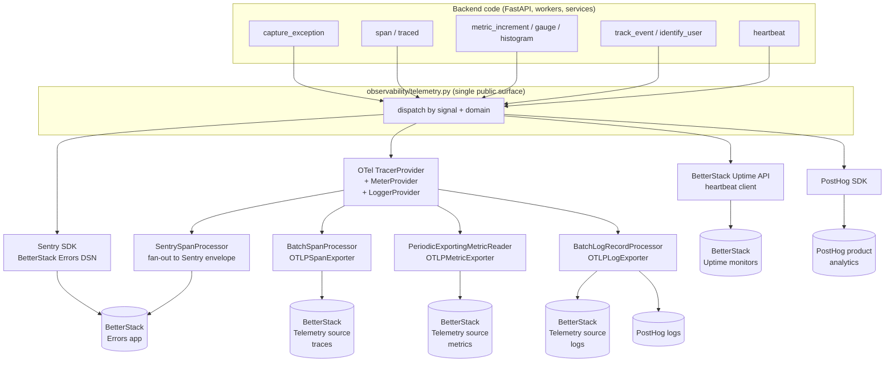

# Unified Observability — BetterStack + Sentry SDK + OpenTelemetry + PostHog

**Status**: Draft
**Created**: 2026-04-26
**Purpose**: Re-introduce Sentry SDK and OpenTelemetry into the backend (frontend untouched), with BetterStack as the primary destination and PostHog kept as the secondary error/product-analytics sink. Five product domains (marketing, development, product, users, infrastructure) share one facade.

**Source Files (current)**:
- `backend/omoi_os/observability/__init__.py` (Logfire wrapper, 207 lines)
- `backend/omoi_os/observability/sentry.py` (PostHog shim under Sentry symbol names, 111 lines)
- `backend/omoi_os/observability/posthog.py` (real backend, 417 lines)
- `backend/omoi_os/observability/posthog_logs.py` (OTLP logs → PostHog, 136 lines)
- `backend/omoi_os/observability/tracing.py` (OTel + Logfire decorators, 202 lines)
- `backend/omoi_os/analytics/posthog.py` (business events)

**Related Docs**:
- `docs/betterstack-reference.md` — full BetterStack API/endpoint reference
- `tasks/sentry-to-posthog-baseline.md` — context on the previous Sentry removal

---

## Purpose

Today, `from omoi_os.observability.sentry import capture_exception` actually lands in PostHog — `observability/sentry.py` has been a shim since commit `18c1e014`. We want:

1. Errors back in **Sentry envelope format** so we can use BetterStack's Errors product (group dedupe, release health, source-map style stack analysis).
2. Traces, metrics, and logs through **native OTLP** to BetterStack's Telemetry source.
3. Heartbeats + HTTP monitors via **BetterStack Uptime**.
4. PostHog kept exactly where it adds unique value: product analytics, user identity, feature flags, and as an error fallback.

All five product domains route through one facade so call sites don't care which backend stores what.

---

## Target architecture



The OTel `TracerProvider` runs **two** span processors so every span fans out to (1) Sentry envelope → BetterStack Errors and (2) OTLP → BetterStack Telemetry source. The same dual-write pattern applies to logs.

---

## Signal × sink routing matrix

| Signal | BetterStack Errors (Sentry envelope) | BetterStack Telemetry (OTLP) | BetterStack Uptime | PostHog |
|--------|:-:|:-:|:-:|:-:|
| Exceptions | **primary** | linked via `trace_id` | — | mirror (existing) |
| Spans / transactions | **primary** (txn store) | **primary** (raw OTLP) | — | — |
| Metrics | — (Sentry deprecated OTLP metrics) | **only path** | — | aggregate counters only |
| Logs | breadcrumbs only | **primary** | — | mirror (existing) |
| Heartbeats | — | — | **only path** | — |
| Product events | — | counters only | — | **primary** |
| User identity | user-context tag | — | — | **primary** |
| Marketing events | — | revenue counters | — | **primary** |

Confirmed via Sentry docs: *"Sentry does not support OTLP metrics at this time"* — metrics are OTel-only.

---

## Five-domain event taxonomy

A new `observability/_taxonomy.py` defines event names + which sinks each fires to. Call sites read `track_event(EVENT_USER_SIGNUP, ...)` rather than passing freeform strings.

| Domain | What it covers | Sinks | Example events |
|--------|----------------|-------|----------------|
| **Development** | exceptions, deploy markers, release health, slow queries, perf regressions | BetterStack Errors + Telemetry | `unhandled_exception`, `deploy_started`, `slow_query`, `release_health` |
| **Infrastructure** | host/process counters, queue depth, agent health, cron status | BetterStack Telemetry + Uptime | `queue_depth`, `agent_heartbeat`, `db_pool_exhausted`, `cron_completed` |
| **Product** | feature usage, spec phase transitions, agent interventions | PostHog (+ Telemetry counters) | `feature_used`, `spec_phase_advanced`, `agent_intervention` |
| **Users** | identity, sessions, retention | PostHog | `user_signup`, `user_login`, `user_identified`, `session_started` |
| **Marketing** | conversions, attribution, billing funnels | PostHog (+ Telemetry revenue counters) | `signup_completed`, `checkout_started`, `checkout_completed`, `subscription_created`, `payment_succeeded` |

`analytics/posthog.py` already covers most of Marketing; it gets a routing layer added (PostHog + a BetterStack revenue counter), no rename needed.

---

## Phased implementation

### Phase A — config + dependencies (low-risk, ~1h)

- Add `BetterStackSettings` to `config.py` (`dsn`, `source_token`, `ingesting_host`, `uptime_api_token`, `enable_*` flags) + `config/base.yaml` section.
- `pyproject.toml`: add `sentry-sdk[opentelemetry]>=2.0`, `opentelemetry-exporter-otlp-proto-http`, `opentelemetry-instrumentation-{fastapi,sqlalchemy,httpx,redis}`.
- Defer Railway/Vercel env-var entries until Phase B is ready to ship.

**Gate**: `uv sync && uv run pytest` green.

### Phase B — core wiring `observability/betterstack.py` (~3h)

`init_betterstack()` does:

1. `sentry_sdk.init(dsn=BETTERSTACK_ERRORS_DSN, integrations=[OpenTelemetryIntegration()], traces_sample_rate=...)`.
2. Build OTel `Resource` with `service.name`, `deployment.environment`, `service.version` (release).
3. `TracerProvider` with `SentrySpanProcessor` + `BatchSpanProcessor(OTLPSpanExporter(BetterStack))`.
4. `MeterProvider` with `PeriodicExportingMetricReader(OTLPMetricExporter(BetterStack))`.
5. `LoggerProvider` dual-write to BetterStack + PostHog (existing exporter from `posthog_logs.py`).
6. Heartbeat client: async coroutine that fires `GET https://uptime.betterstack.com/api/v1/heartbeat/{token}` on a schedule.

**Critical gotchas (already validated against the live API)**:
- OTLP exporters must point at **source-specific ingesting host** (`https://s2397698.eu-nbg-2.betterstackdata.com/v1/{traces,metrics,logs}`), not the global `in-otel.logs.betterstack.com` (per-source tokens get 401 there).
- Source `platform` = `open_telemetry` (underscore).
- Errors application `platform` = `python_errors` (suffix required).

**Gate**: smoke script (`scripts/betterstack/smoke_unified.py`) sends one of each signal end-to-end and prints PASS/FAIL per signal.

### Phase C — facade `observability/telemetry.py` (~2h)

Public API (superset-compatible with the current shim, so zero call sites break):

```python
# Errors
capture_exception, capture_message
# Tracing
span, traced, trace_db_operation, trace_external_api,
set_transaction_name, set_span_tag, set_span_data, add_breadcrumb,
get_trace_headers, extract_trace_context
# Metrics
metric_increment, metric_gauge, metric_histogram, metric_set
# Events (the only "new" symbol)
track_event, identify_user, track_conversion
# Context
set_tag, set_user, set_context, push_scope, new_scope
# Heartbeats
heartbeat
# Convenience pre-built operational metrics (already exist in PostHog wrapper)
track_task_completed, track_task_failed, track_task_retried,
track_queue_depth, track_agent_health, track_llm_usage
```

Each function dispatches to the right sinks per the routing matrix.

**Gate**: `from omoi_os.observability.telemetry import *` covers every symbol currently exported from `observability.sentry` and `observability.__init__`.

### Phase D — replace shims, drop Logfire (~2h)

- Modify `observability/__init__.py` to re-export from `telemetry.py`. Keep the Logfire path behind `OBS_LEGACY_LOGFIRE=1` env flag for emergency rollback.
- Replace Logfire calls in `observability/tracing.py` with direct OTel API (it's already mostly OTel-shaped).
- `observability/sentry.py` becomes a deprecation shim (warns once on import, re-exports from telemetry).
- `api/main.py` startup: replace `init_posthog_observability()` solo call with `init_telemetry()` (which wraps both PostHog and BetterStack).

**Gate**: existing tests pass; one smoke run hits all 4 sinks; manual canary against staging for 1h.

### Phase E — domain coverage round (~3h)

- **Marketing**: `analytics/posthog.py` calls fan out — add OTel histogram for revenue per event (`payment_amount_usd` distribution).
- **Users**: thread `identify_user()` through `auth/login`, `auth/register`, `auth/refresh` routes.
- **Product**: instrument spec phase transitions in `services/spec_state_machine.py`, agent interventions in `services/intelligent_guardian.py`.
- **Infrastructure**: replace ad-hoc `structlog.warn("queue depth high")` with `metric_gauge("queue_depth_total", ...)`. Add heartbeats for `taskiq_worker`, `agent_health_loop`, `monitoring_loop`.
- **Development**: keep existing exception capture; add `deploy_marker(release, environment)` called from CI hook.

### Phase F — Uptime + status page (~1.5h)

Use `scripts/betterstack/cli.py setup` to provision:

- Monitor: `https://api.omoios.dev/health`
- Monitor: `https://api.omoios.dev/api/v1/agents/health`
- Heartbeat: `omoi-api-cron`
- Heartbeat: `omoi-monitoring-loop`
- Status page: `status.omoios.dev` (custom-domain CNAME setup gated on DNS step)

Wire heartbeats into background loops so they fire each tick.

### Phase G — clean-up (~1h)

- Delete `observability/sentry.py` (the shim) once call sites have migrated to `telemetry`.
- Delete the Logfire branch in `__init__.py` once Phase D is stable for a week.
- Remove `logfire` from `pyproject.toml` if nothing else still uses it.

---

## Files affected

### Add

- `backend/omoi_os/observability/betterstack.py`
- `backend/omoi_os/observability/telemetry.py`
- `backend/omoi_os/observability/_taxonomy.py`
- `tests/unit/observability/test_telemetry_facade.py`
- `tests/integration/observability/test_betterstack_smoke.py`
- `scripts/betterstack/smoke_unified.py`

### Modify

- `backend/pyproject.toml`
- `backend/omoi_os/config.py` + `backend/config/base.yaml`
- `backend/omoi_os/observability/__init__.py`
- `backend/omoi_os/observability/tracing.py`
- `backend/omoi_os/observability/sentry.py`
- `backend/omoi_os/observability/posthog.py`
- `backend/omoi_os/analytics/posthog.py`
- `backend/omoi_os/api/main.py`
- `backend/omoi_os/services/task_queue.py`

### Eventually delete

- `backend/omoi_os/observability/sentry.py`
- Logfire branch in `backend/omoi_os/observability/__init__.py`

---

## Risk and rollback

- Each phase is independently revertable. Phase B is purely additive (new module, nothing wired). Phase D is the only risky one — gated behind `OBS_LEGACY_LOGFIRE=1` env flag.
- Sentry SDK with `traces_sample_rate=1.0` in production can be expensive; start at `0.1` and rely on OTLP for full-fidelity traces.
- BetterStack OTLP per-source rate limits aren't published — Phase B includes a `metric_gauge("otel_export_dropped")` so we can detect throttling.
- PostHog stays online throughout; if BetterStack misbehaves, errors still land in PostHog.

---

## Open questions

1. Single source for BetterStack OTLP, or split (one source per environment vs. one per service)?
2. Heartbeat cadence — match `agent_health_loop` (30s) or coarser (5min)?
3. Should we add the `omoi_os.observability` package as a separately-versioned internal lib so `subsystems/spec-sandbox` can depend on it without importing the whole backend?
