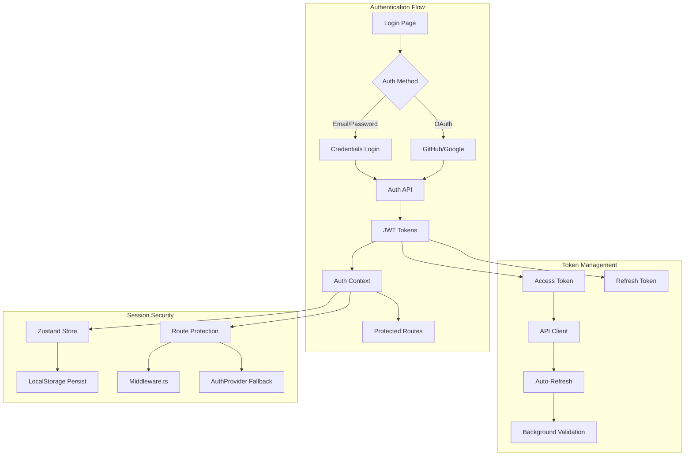
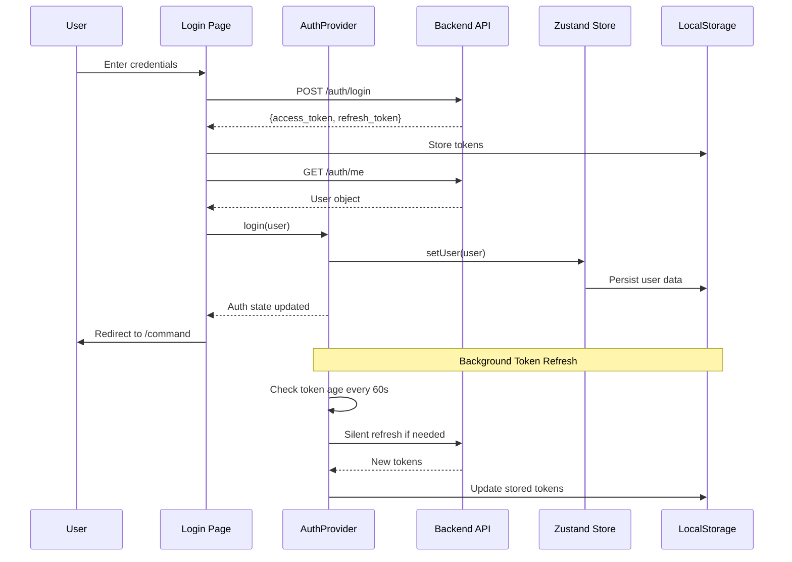

# Authentication System Design

> **Date**: 2025-07-20 | **Status**: Active | **Version**: 1.0 | **Owner**: Deep Docs Pipeline
> **Source**: Generated from codebase analysis | **Cross-links**: See Related Documents section

## Overview

The OmoiOS Authentication System provides comprehensive user identity management, supporting multiple authentication methods including email/password, OAuth (GitHub, Google), and API key-based access. The system is built on a JWT token architecture with secure token storage, automatic refresh mechanisms, and robust session management.

## Architecture



## Component Hierarchy

```
AuthProvider (Context + Zustand Store)
├── AuthLayout (Visual wrapper)
│   ├── LoginPage
│   ├── RegisterPage
│   ├── ForgotPasswordPage
│   ├── ResetPasswordPage
│   ├── VerifyEmailPage
│   └── OAuthCallbackPage
├── ProtectedRoute (HOC/Guard)
└── useAuth Hook (Consumer interface)
```

## Route Structure

| Route | Component | Access | Purpose |
|-------|-----------|--------|---------|
| `/login` | `LoginPage` | Public | Email/password + OAuth login |
| `/register` | `RegisterPage` | Public | New user registration |
| `/forgot-password` | `ForgotPasswordPage` | Public | Password reset request |
| `/reset-password` | `ResetPasswordPage` | Public | Password reset with token |
| `/verify-email` | `VerifyEmailPage` | Public | Email verification |
| `/callback` | `OAuthCallbackPage` | Public | OAuth provider callback |

## State Management

### Auth Store (Zustand + Persist)

```typescript
// frontend/providers/AuthProvider.tsx:46-109

interface AuthState {
  user: User | null;
  isLoading: boolean;
  isAuthenticated: boolean;
  error: string | null;
  lastValidatedAt: number | null;

  // Actions
  setUser: (user: User | null) => void;
  setLoading: (loading: boolean) => void;
  setError: (error: string | null) => void;
  setLastValidatedAt: (timestamp: number | null) => void;
  reset: () => void;
}

const useAuthStore = create<AuthState>()(
  persist(
    (set) => ({
      user: null,
      isLoading: true,
      isAuthenticated: false,
      error: null,
      lastValidatedAt: null,
      
      setUser: (user) => {
        setUserContext(user); // Sentry integration
        set({ user, isAuthenticated: !!user, error: null });
      },
      
      setLoading: (isLoading) => set({ isLoading }),
      
      setError: (error) => set({ error, isLoading: false }),
      
      setLastValidatedAt: (lastValidatedAt) => set({ lastValidatedAt }),
      
      reset: () => {
        clearUserContext(); // Sentry integration
        set({
          user: null,
          isLoading: false,
          isAuthenticated: false,
          error: null,
          lastValidatedAt: null,
        });
      },
    }),
    {
      name: "omoios-auth",
      partialize: (state) => ({
        user: state.user,
        isAuthenticated: state.isAuthenticated,
        lastValidatedAt: state.lastValidatedAt,
      }),
    }
  )
);
```

### Auth Context Value

```typescript
// frontend/providers/AuthProvider.tsx:114-122

interface AuthContextValue {
  user: User | null;
  isLoading: boolean;
  isAuthenticated: boolean;
  error: string | null;
  login: (user: User) => void;
  logout: () => Promise<void>;
  refreshUser: () => Promise<void>;
}
```

## Hook Signatures

### useAuth Hook

```typescript
// frontend/hooks/useAuth.ts
// Re-exports from AuthProvider for convenience

export { useAuth, useAuthStore } from "@/providers/AuthProvider";

// Usage:
const { user, isLoading, isAuthenticated, login, logout, refreshUser } = useAuth();
```

### Auth API Functions

```typescript
// frontend/lib/api/auth.ts

// Authentication
export async function register(data: UserCreate): Promise<User>
export async function login(data: LoginRequest): Promise<TokenResponse>
export async function logout(): Promise<void>
export async function verifyEmail(token: string): Promise<MessageResponse>
export async function resendVerification(email: string): Promise<MessageResponse>
export async function forgotPassword(data: ForgotPasswordRequest): Promise<MessageResponse>
export async function resetPassword(data: ResetPasswordRequest): Promise<MessageResponse>
export async function changePassword(data: ChangePasswordRequest): Promise<MessageResponse>

// User Profile
export async function getCurrentUser(): Promise<User>
export async function updateCurrentUser(data: UserUpdate): Promise<User>

// API Keys
export async function createApiKey(data: APIKeyCreate): Promise<APIKeyWithSecret>
export async function listApiKeys(): Promise<APIKey[]>
export async function revokeApiKey(keyId: string): Promise<MessageResponse>
```

## Login Flow Implementation

```typescript
// frontend/app/(auth)/login/page.tsx:26-52

const handleSubmit = async (e: React.FormEvent) => {
  e.preventDefault();
  setIsLoading(true);
  setError("");

  try {
    // Step 1: Login and get tokens
    await apiLogin({ email, password });

    // Step 2: Fetch user data
    const user = await getCurrentUser();

    // Step 3: Update auth context
    login(user);

    // Step 4: Redirect to command center
    router.push("/command");
  } catch (err) {
    if (err instanceof ApiError) {
      setError(err.message);
    } else {
      setError("An unexpected error occurred. Please try again.");
    }
  } finally {
    setIsLoading(false);
  }
};
```

## OAuth Flow Implementation

```typescript
// frontend/app/(auth)/callback/page.tsx:33-135

const handleCallback = async () => {
  const hashParams = getHashParams();
  
  // Clear hash from URL immediately to prevent token exposure
  if (typeof window !== "undefined" && window.location.hash) {
    window.history.replaceState(
      null,
      "",
      window.location.pathname + window.location.search
    );
  }

  // Check for error from OAuth provider
  const error = searchParams.get("error");
  if (error) {
    setStatus("error");
    setErrorMessage(error.replace(/_/g, " "));
    setTimeout(() => router.push(`/login?error=${error}`), 3000);
    return;
  }

  // Extract tokens from hash fragment
  const accessToken = hashParams.get("access_token");
  const refreshToken = hashParams.get("refresh_token");

  if (!accessToken || !refreshToken) {
    setStatus("error");
    setErrorMessage("No authentication tokens received");
    setTimeout(() => router.push("/login?error=no_tokens"), 3000);
    return;
  }

  try {
    // Store tokens
    setTokens(accessToken, refreshToken);

    // Fetch user info
    const user = await getCurrentUser();

    // Update auth context
    login(user);

    // Invalidate OAuth-related queries
    queryClient.invalidateQueries({ queryKey: ["oauth", "connected"] });
    queryClient.invalidateQueries({ queryKey: ["github-repos"] });

    setStatus("success");

    // Check onboarding status
    try {
      const onboardingStatus = await fetchOnboardingStatus();
      setOnboardingCookie(onboardingStatus.is_completed);
    } catch {
      // If onboarding check fails, don't block login
    }

    // Redirect to main app
    setTimeout(() => router.push("/command"), 1500);
  } catch (err) {
    console.error("OAuth callback error:", err);
    setStatus("error");
    setErrorMessage("Failed to complete authentication");
    clearTokens();
    setTimeout(() => router.push("/login?error=auth_failed"), 3000);
  }
};
```

## Protected Routes Implementation

```typescript
// frontend/providers/AuthProvider.tsx:131-147

// Routes that don't require authentication
const PUBLIC_ROUTES = [
  "/login",
  "/register",
  "/forgot-password",
  "/reset-password",
  "/verify-email",
  "/callback",
  "/docs",
  "/blog",
  "/feed.xml",
  "/sitemap.xml",
  "/robots.txt",
];

// Routes that should redirect to main app if already authenticated
const AUTH_ROUTES = ["/login", "/register"];
```

### Route Protection Logic

```typescript
// frontend/providers/AuthProvider.tsx:304-334

useEffect(() => {
  // Wait for loading to complete before making redirect decisions
  if (isLoading) return;

  // Reset redirect flag when pathname changes
  hasRedirectedRef.current = false;

  // If not authenticated and trying to access protected route
  if (!isAuthenticated && !isPublicRoute && pathname !== "/") {
    router.replace("/login");
    return;
  }

  // If authenticated and trying to access auth routes (login/register)
  // Note: Middleware should catch this first, but this is a fallback
  if (isAuthenticated && isAuthRoute && !hasRedirectedRef.current) {
    hasRedirectedRef.current = true;
    router.replace("/command");
    return;
  }
}, [
  isLoading,
  isAuthenticated,
  isPublicRoute,
  isAuthRoute,
  pathname,
  router,
]);
```

## Token Management

### Token Storage

```typescript
// frontend/lib/api/client.ts

const TOKEN_KEY = "access_token";
const REFRESH_TOKEN_KEY = "refresh_token";
const LAST_VALIDATED_KEY = "last_validated";

export function setTokens(accessToken: string, refreshToken: string): void {
  localStorage.setItem(TOKEN_KEY, accessToken);
  localStorage.setItem(REFRESH_TOKEN_KEY, refreshToken);
  setLastValidated();
}

export function clearTokens(): void {
  localStorage.removeItem(TOKEN_KEY);
  localStorage.removeItem(REFRESH_TOKEN_KEY);
  localStorage.removeItem(LAST_VALIDATED_KEY);
}

export function getAccessToken(): string | null {
  return localStorage.getItem(TOKEN_KEY);
}

export function getRefreshToken(): string | null {
  return localStorage.getItem(REFRESH_TOKEN_KEY);
}
```

### Token Validation

```typescript
// frontend/lib/api/client.ts

const TOKEN_VALIDITY_MS = 14 * 60 * 1000; // 14 minutes (token expires at 15)
const REVALIDATION_INTERVAL_MS = 5 * 60 * 1000; // Revalidate every 5 minutes

export function isAccessTokenValid(): boolean {
  const lastValidated = localStorage.getItem(LAST_VALIDATED_KEY);
  if (!lastValidated) return false;
  
  const elapsed = Date.now() - parseInt(lastValidated, 10);
  return elapsed < TOKEN_VALIDITY_MS;
}

export function needsRevalidation(): boolean {
  const lastValidated = localStorage.getItem(LAST_VALIDATED_KEY);
  if (!lastValidated) return true;
  
  const elapsed = Date.now() - parseInt(lastValidated, 10);
  return elapsed > REVALIDATION_INTERVAL_MS;
}

export function shouldRefreshToken(): boolean {
  const lastValidated = localStorage.getItem(LAST_VALIDATED_KEY);
  if (!lastValidated) return false;
  
  const elapsed = Date.now() - parseInt(lastValidated, 10);
  // Refresh if token is older than 10 minutes (5 minutes before expiry)
  return elapsed > 10 * 60 * 1000;
}
```

## Session Lifecycle



## Password Requirements

```typescript
// frontend/app/(auth)/register/page.tsx:17-34

const PASSWORD_REQUIREMENTS = [
  {
    id: "length",
    label: "At least 8 characters",
    test: (p: string) => p.length >= 8,
  },
  {
    id: "uppercase",
    label: "One uppercase letter",
    test: (p: string) => /[A-Z]/.test(p),
  },
  {
    id: "lowercase",
    label: "One lowercase letter",
    test: (p: string) => /[a-z]/.test(p),
  },
  { 
    id: "number", 
    label: "One number", 
    test: (p: string) => /\d/.test(p) 
  },
];
```

## Analytics Integration

```typescript
// frontend/providers/AuthProvider.tsx:229-241

const login = useCallback(
  (userData: User) => {
    setUser(userData);
    setLastValidatedAt(Date.now());

    // Identify user in PostHog for analytics
    identifyUser(userData);
    track(ANALYTICS_EVENTS.USER_LOGGED_IN, {
      auth_method: "email",
    });
  },
  [setUser, setLastValidatedAt]
);

const logout = useCallback(async () => {
  try {
    // Track logout event before resetting
    track(ANALYTICS_EVENTS.USER_LOGGED_OUT, {});
    await apiLogout();
  } catch (err) {
    console.error("Logout error:", err);
  } finally {
    // Reset PostHog user identity and organization context
    clearOrganization();
    resetUser();
    reset();
    setOnboardingCookie(false);
    router.push("/login");
  }
}, [reset, router]);
```

## Error Handling

```typescript
// frontend/lib/api/client.ts

export class ApiError extends Error {
  constructor(
    message: string,
    public status: number,
    public code?: string
  ) {
    super(message);
    this.name = "ApiError";
  }
}

// Usage in components:
try {
  await login({ email, password });
} catch (err) {
  if (err instanceof ApiError) {
    setError(err.message);
  } else {
    setError("An unexpected error occurred. Please try again.");
  }
}
```

## Related Documents

- [Onboarding Flow](./onboarding_flow.md) - Post-authentication user setup
- [Organizations & Multi-tenancy](./organizations_multi_tenancy.md) - Organization-scoped authentication
- [Backend Auth Architecture](../../architecture/07-auth-and-security.md) - Server-side auth implementation
- `../../lib/api/types.ts` - TypeScript interfaces for auth entities

## Security Considerations

1. **Token Storage**: Access and refresh tokens stored in localStorage (consider httpOnly cookies for enhanced security)
2. **Token Expiry**: 15-minute access token lifetime with automatic refresh
3. **CSRF Protection**: OAuth state parameter validation
4. **Password Policy**: Minimum 8 characters with complexity requirements
5. **Rate Limiting**: Backend enforces rate limits on auth endpoints
6. **Email Verification**: Required before accessing protected features
7. **Session Validation**: Background validation every 5 minutes
8. **Secure Redirects**: OAuth callbacks validate redirect URLs

## Testing Strategy

| Test Type | Coverage | Key Scenarios |
|-----------|----------|---------------|
| Unit | Auth hooks | Login, logout, token refresh |
| Integration | API client | Token storage, error handling |
| E2E | Full flows | Login → Dashboard → Logout |
| Security | Token handling | Expiry, refresh, invalidation |
