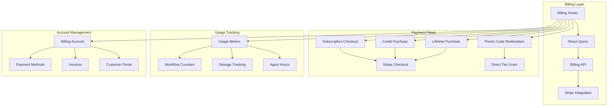
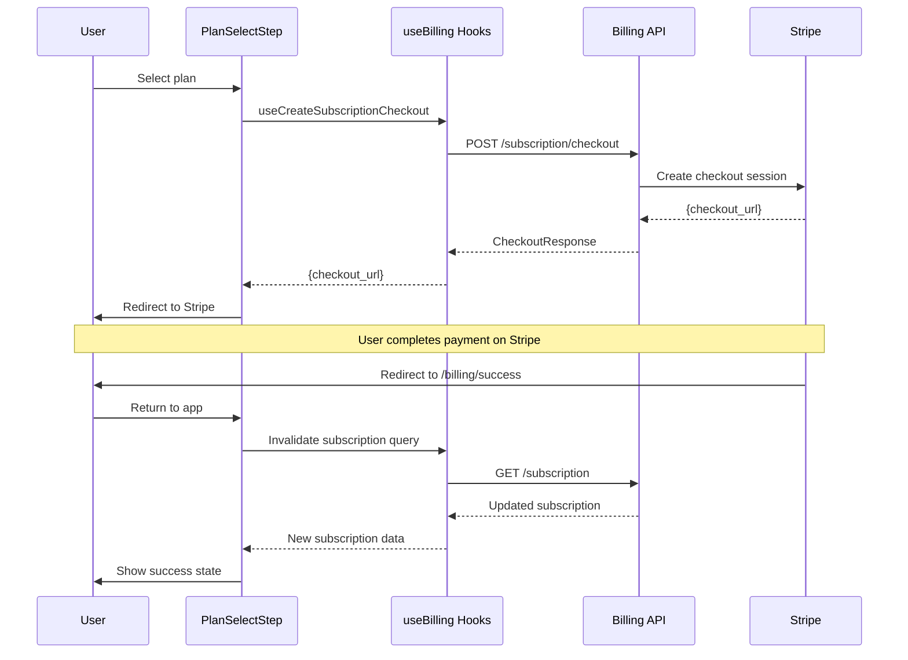

# Billing & Subscriptions Design

> **Date**: 2025-07-20 | **Status**: Active | **Version**: 1.0 | **Owner**: Deep Docs Pipeline
> **Source**: Generated from codebase analysis | **Cross-links**: See Related Documents section

## Overview

The OmoiOS Billing System provides comprehensive subscription management, payment processing via Stripe, usage tracking, and promotional code handling. The system supports multiple pricing tiers (Starter, Pro, Team, Lifetime) with flexible billing options including monthly subscriptions, credit purchases, and promotional tier grants.

## Architecture



## Component Hierarchy

```
Billing Domain
├── Hooks (useBilling.ts)
│   ├── useStripeConfig
│   ├── useBillingAccount
│   ├── usePaymentMethods
│   ├── useCreateCreditCheckout
│   ├── useCreateCustomerPortal
│   ├── useInvoices
│   ├── useUsage
│   ├── useSubscription
│   ├── useCancelSubscription
│   ├── useCreateLifetimeCheckout
│   ├── useValidatePromoCode
│   └── useRedeemPromoCode
├── API Client (billing.ts)
└── Pages
    ├── billing/success/page.tsx
    └── billing/cancel/page.tsx
```

## Pricing Tiers

```typescript
// From PlanSelectStep.tsx and billing types

interface PlanOption {
  id: "free" | "pro" | "team" | "lifetime";
  name: string;
  price: string;
  priceNote?: string;
  icon: React.ReactNode;
  features: string[];
  highlighted?: boolean;
  accentColor: string;
}

const PLANS: PlanOption[] = [
  {
    id: "free",
    name: "Starter",
    price: "$0",
    priceNote: "forever",
    icon: <Zap className="h-5 w-5" />,
    features: [
      "1 concurrent agent",
      "5 workflows/month",
      "2GB storage",
      "Community support",
    ],
    accentColor: "bg-slate-500",
  },
  {
    id: "pro",
    name: "Pro",
    price: "$50",
    priceNote: "/month",
    icon: <Crown className="h-5 w-5" />,
    features: [
      "5 concurrent agents",
      "100 workflows/month",
      "50GB storage",
      "BYO API keys",
      "Priority support",
    ],
    accentColor: "bg-purple-500",
  },
  {
    id: "team",
    name: "Team",
    price: "$150",
    priceNote: "/month",
    icon: <Infinity className="h-5 w-5" />,
    features: [
      "10 concurrent agents",
      "500 workflows/month",
      "500GB storage",
      "BYO API keys",
      "Dedicated support",
      "Team collaboration",
    ],
    highlighted: true,
    urgencyText: "Most popular for growing teams",
    accentColor: "bg-emerald-500",
  },
];
```

## Hook Signatures

### Configuration Hooks

```typescript
// frontend/hooks/useBilling.ts:80-89

/**
 * Hook to get Stripe configuration
 * Stale time: 1 hour (config doesn't change often)
 */
export function useStripeConfig() {
  return useQuery<StripeConfig>({
    queryKey: billingKeys.config(),
    queryFn: getStripeConfig,
    staleTime: 1000 * 60 * 60,
  });
}
```

### Account Hooks

```typescript
// frontend/hooks/useBilling.ts:95-104

/**
 * Hook to get or create billing account for an organization
 * Requires valid UUID for orgId
 */
export function useBillingAccount(orgId: string | undefined) {
  return useQuery<BillingAccount>({
    queryKey: billingKeys.account(orgId!),
    queryFn: () => getBillingAccount(orgId!),
    enabled: isValidUUID(orgId),
  });
}
```

### Payment Method Hooks

```typescript
// frontend/hooks/useBilling.ts:110-142

/**
 * Hook to list payment methods
 */
export function usePaymentMethods(orgId: string | undefined) {
  return useQuery<PaymentMethod[]>({
    queryKey: billingKeys.paymentMethods(orgId!),
    queryFn: () => listPaymentMethods(orgId!),
    enabled: isValidUUID(orgId),
  });
}

/**
 * Hook to attach a payment method
 * Invalidates payment methods and account queries on success
 */
export function useAttachPaymentMethod() {
  const queryClient = useQueryClient();

  return useMutation({
    mutationFn: ({
      orgId,
      data,
    }: {
      orgId: string;
      data: PaymentMethodRequest;
    }) => attachPaymentMethod(orgId, data),
    onSuccess: (_, { orgId }) => {
      queryClient.invalidateQueries({
        queryKey: billingKeys.paymentMethods(orgId),
      });
      queryClient.invalidateQueries({ queryKey: billingKeys.account(orgId) });
    },
  });
}

/**
 * Hook to remove a payment method
 */
export function useRemovePaymentMethod() {
  const queryClient = useQueryClient();

  return useMutation({
    mutationFn: ({
      orgId,
      paymentMethodId,
    }: {
      orgId: string;
      paymentMethodId: string;
    }) => removePaymentMethod(orgId, paymentMethodId),
    onSuccess: (_, { orgId }) => {
      queryClient.invalidateQueries({
        queryKey: billingKeys.paymentMethods(orgId),
      });
      queryClient.invalidateQueries({ queryKey: billingKeys.account(orgId) });
    },
  });
}
```

### Checkout Hooks

```typescript
// frontend/hooks/useBilling.ts:170-198

/**
 * Hook to create a credit checkout session
 * Tracks analytics events for checkout started/failed
 */
export function useCreateCreditCheckout() {
  return useMutation<
    CheckoutResponse,
    Error,
    { orgId: string; data: CreditPurchaseRequest }
  >({
    mutationFn: ({ orgId, data }) => createCreditCheckout(orgId, data),
    onSuccess: (response, { orgId, data }) => {
      track(ANALYTICS_EVENTS.CHECKOUT_STARTED, {
        plan_type: "free",
        price_amount: data.amount_usd,
        currency: "USD",
        organization_id: orgId,
      });
    },
    onError: (error, { orgId, data }) => {
      track(ANALYTICS_EVENTS.CHECKOUT_FAILED, {
        plan_type: "free",
        price_amount: data.amount_usd,
        organization_id: orgId,
        error_message: error.message,
      });
    },
  });
}

// frontend/hooks/useBilling.ts:420-449

/**
 * Hook to create a lifetime checkout session
 */
export function useCreateLifetimeCheckout() {
  return useMutation<
    CheckoutResponse,
    Error,
    { orgId: string; request?: LifetimePurchaseRequest }
  >({
    mutationFn: ({ orgId, request }) => createLifetimeCheckout(orgId, request),
    onSuccess: (response, { orgId }) => {
      track(ANALYTICS_EVENTS.CHECKOUT_STARTED, {
        plan_type: "lifetime",
        price_amount: 299,
        currency: "USD",
        organization_id: orgId,
      });
    },
    onError: (error, { orgId }) => {
      track(ANALYTICS_EVENTS.CHECKOUT_FAILED, {
        plan_type: "lifetime",
        organization_id: orgId,
        error_message: error.message,
      });
    },
  });
}
```

### Subscription Hooks

```typescript
// frontend/hooks/useBilling.ts:360-420

/**
 * Hook to get the active subscription for an organization
 * Stale time: 5 minutes
 */
export function useSubscription(orgId: string | undefined) {
  return useQuery<Subscription | null>({
    queryKey: billingKeys.subscription(orgId!),
    queryFn: () => getSubscription(orgId!),
    enabled: isValidUUID(orgId),
    staleTime: 5 * 60 * 1000,
  });
}

/**
 * Hook to cancel a subscription
 * @param atPeriodEnd - If true, cancel at end of billing period
 */
export function useCancelSubscription() {
  const queryClient = useQueryClient();

  return useMutation({
    mutationFn: ({
      orgId,
      atPeriodEnd = true,
    }: {
      orgId: string;
      atPeriodEnd?: boolean;
    }) => cancelSubscription(orgId, atPeriodEnd),
    onSuccess: (_, { orgId }) => {
      queryClient.invalidateQueries({
        queryKey: billingKeys.subscription(orgId),
      });
      queryClient.invalidateQueries({ queryKey: billingKeys.account(orgId) });
      track(ANALYTICS_EVENTS.SUBSCRIPTION_CANCELLED, {
        organization_id: orgId,
      });
    },
  });
}

/**
 * Hook to reactivate a canceled subscription
 */
export function useReactivateSubscription() {
  const queryClient = useQueryClient();

  return useMutation({
    mutationFn: (orgId: string) => reactivateSubscription(orgId),
    onSuccess: (_, orgId) => {
      queryClient.invalidateQueries({
        queryKey: billingKeys.subscription(orgId),
      });
      queryClient.invalidateQueries({ queryKey: billingKeys.account(orgId) });
      track(ANALYTICS_EVENTS.SUBSCRIPTION_REACTIVATED, {
        organization_id: orgId,
      });
    },
  });
}
```

### Usage Hooks

```typescript
// frontend/hooks/useBilling.ts:300-357

/**
 * Hook to get usage records
 */
export function useUsage(
  orgId: string | undefined,
  options?: { billed?: boolean }
) {
  return useQuery<UsageRecord[]>({
    queryKey: [...billingKeys.usage(orgId!), options],
    queryFn: () => getUsage(orgId!, options),
    enabled: isValidUUID(orgId),
  });
}

/**
 * Usage summary type
 */
export interface UsageSummary {
  subscription_tier: string | null;
  workflows_used: number;
  workflows_limit: number;
  free_workflows_remaining: number;
  credit_balance: number;
  can_execute: boolean;
  reason: string;
}

/**
 * Hook to get usage summary with limits and execution availability
 * Stale time: 30 seconds (usage can change frequently)
 */
export function useUsageSummary(orgId: string | undefined) {
  return useQuery<UsageSummary>({
    queryKey: [...billingKeys.usage(orgId!), "summary"],
    queryFn: async () => {
      const { getUsageSummary } = await import("@/lib/api/billing");
      return getUsageSummary(orgId!);
    },
    enabled: isValidUUID(orgId),
    staleTime: 30 * 1000,
  });
}

/**
 * Hook to check if an organization can execute a workflow
 */
export function useCanExecuteWorkflow(orgId: string | undefined) {
  return useQuery<{ can_execute: boolean; reason: string }>({
    queryKey: [...billingKeys.account(orgId!), "can-execute"],
    queryFn: async () => {
      const { checkWorkflowExecution } = await import("@/lib/api/billing");
      return checkWorkflowExecution(orgId!);
    },
    enabled: isValidUUID(orgId),
    staleTime: 30 * 1000,
  });
}
```

### Promo Code Hooks

```typescript
// frontend/hooks/useBilling.ts:480-530

/**
 * Hook to validate a promo code without redeeming it
 */
export function useValidatePromoCode() {
  return useMutation<
    PromoCodeValidateResponse,
    Error,
    PromoCodeValidateRequest
  >({
    mutationFn: (request) => validatePromoCode(request),
  });
}

/**
 * Hook to redeem a promo code for an organization
 * This applies the promo code benefits (discount, free tier, etc.)
 */
export function useRedeemPromoCode() {
  const queryClient = useQueryClient();

  return useMutation<
    PromoCodeRedeemResponse,
    Error,
    { orgId: string; data: PromoCodeRedeemRequest }
  >({
    mutationFn: ({ orgId, data }) => redeemPromoCode(orgId, data),
    onSuccess: (response, { orgId, data }) => {
      // Invalidate subscription and account queries
      queryClient.invalidateQueries({
        queryKey: billingKeys.subscription(orgId),
      });
      queryClient.invalidateQueries({ queryKey: billingKeys.account(orgId) });

      track(ANALYTICS_EVENTS.PROMO_CODE_REDEEMED, {
        organization_id: orgId,
        discount_type: response.discount_type,
        tier_granted: response.tier_granted,
      });
    },
    onError: (error, { orgId, data }) => {
      track(ANALYTICS_EVENTS.PROMO_CODE_FAILED, {
        organization_id: orgId,
        code: data.code,
        error_message: error.message,
      });
    },
  });
}
```

## API Client Functions

```typescript
// frontend/lib/api/billing.ts

// ============================================================================
// Stripe Configuration
// ============================================================================
export async function getStripeConfig(): Promise<StripeConfig>

// ============================================================================
// Billing Account
// ============================================================================
export async function getBillingAccount(organizationId: string): Promise<BillingAccount>

// ============================================================================
// Payment Methods
// ============================================================================
export async function attachPaymentMethod(
  organizationId: string,
  request: PaymentMethodRequest
): Promise<PaymentMethod>

export async function listPaymentMethods(organizationId: string): Promise<PaymentMethod[]>

export async function removePaymentMethod(
  organizationId: string,
  paymentMethodId: string
): Promise<{ status: string; message: string }>

// ============================================================================
// Credit Purchase
// ============================================================================
export async function createCreditCheckout(
  organizationId: string,
  request: CreditPurchaseRequest
): Promise<CheckoutResponse>

// ============================================================================
// Customer Portal
// ============================================================================
export async function createCustomerPortal(organizationId: string): Promise<PortalResponse>

// ============================================================================
// Invoices
// ============================================================================
export async function listInvoices(
  organizationId: string,
  options?: { status?: string; limit?: number }
): Promise<Invoice[]>

export async function getInvoice(invoiceId: string): Promise<Invoice>

export async function payInvoice(
  invoiceId: string,
  paymentMethodId?: string
): Promise<Payment>

export async function generateInvoice(organizationId: string): Promise<Invoice | null>

export async function listStripeInvoices(
  organizationId: string,
  options?: { status?: string; limit?: number }
): Promise<StripeInvoice[]>

// ============================================================================
// Usage Records
// ============================================================================
export async function getUsage(
  organizationId: string,
  options?: { billed?: boolean }
): Promise<UsageRecord[]>

export async function getUsageSummary(organizationId: string): Promise<UsageSummary>

export async function checkWorkflowExecution(
  organizationId: string
): Promise<{ can_execute: boolean; reason: string }>

// ============================================================================
// Subscription Management
// ============================================================================
export async function getSubscription(organizationId: string): Promise<Subscription | null>

export async function cancelSubscription(
  organizationId: string,
  atPeriodEnd: boolean = true
): Promise<{ status: string; message: string }>

export async function reactivateSubscription(
  organizationId: string
): Promise<{ status: string; message: string }>

export async function createLifetimeCheckout(
  organizationId: string,
  request?: LifetimePurchaseRequest
): Promise<CheckoutResponse>

export async function createSubscriptionCheckout(
  organizationId: string,
  request: SubscriptionCheckoutRequest
): Promise<CheckoutResponse>

// ============================================================================
// Promo Codes
// ============================================================================
export async function validatePromoCode(
  request: PromoCodeValidateRequest
): Promise<PromoCodeValidateResponse>

export async function redeemPromoCode(
  organizationId: string,
  request: PromoCodeRedeemRequest
): Promise<PromoCodeRedeemResponse>
```

## Query Keys Structure

```typescript
// frontend/hooks/useBilling.ts:58-75

export const billingKeys = {
  all: ["billing"] as const,
  config: () => [...billingKeys.all, "config"] as const,
  accounts: () => [...billingKeys.all, "accounts"] as const,
  account: (orgId: string) => [...billingKeys.accounts(), orgId] as const,
  subscription: (orgId: string) =>
    [...billingKeys.account(orgId), "subscription"] as const,
  paymentMethods: (orgId: string) =>
    [...billingKeys.account(orgId), "payment-methods"] as const,
  invoices: (orgId: string) =>
    [...billingKeys.account(orgId), "invoices"] as const,
  stripeInvoices: (orgId: string) =>
    [...billingKeys.account(orgId), "stripe-invoices"] as const,
  invoice: (invoiceId: string) =>
    [...billingKeys.all, "invoice", invoiceId] as const,
  usage: (orgId: string) => [...billingKeys.account(orgId), "usage"] as const,
};
```

## TypeScript Types

```typescript
// Key types from frontend/lib/api/types.ts

interface BillingAccount {
  id: string;
  organization_id: string;
  stripe_customer_id: string | null;
  stripe_subscription_id: string | null;
  subscription_status: "active" | "canceled" | "past_due" | "unpaid" | null;
  subscription_tier: "free" | "pro" | "team" | "lifetime" | null;
  current_period_start: string | null;
  current_period_end: string | null;
  cancel_at_period_end: boolean;
  credit_balance: number;
  created_at: string;
  updated_at: string;
}

interface Subscription {
  id: string;
  tier: "free" | "pro" | "team" | "lifetime";
  status: "active" | "canceled" | "past_due" | "unpaid";
  current_period_start: string;
  current_period_end: string;
  cancel_at_period_end: boolean;
}

interface PaymentMethod {
  id: string;
  type: "card" | "bank_transfer";
  last4: string;
  brand: string | null;
  exp_month: number | null;
  exp_year: number | null;
  is_default: boolean;
}

interface Invoice {
  id: string;
  billing_account_id: string;
  amount_due: number;
  amount_paid: number;
  status: "draft" | "open" | "paid" | "uncollectible" | "void";
  due_date: string | null;
  paid_at: string | null;
  line_items: InvoiceLineItem[];
  created_at: string;
}

interface UsageRecord {
  id: string;
  organization_id: string;
  resource_type: "workflow" | "storage" | "agent_hour";
  quantity: number;
  unit_cost: number;
  total_cost: number;
  billed: boolean;
  created_at: string;
}

interface PromoCode {
  code: string;
  discount_type: "percentage" | "fixed_amount" | "full_bypass";
  discount_value: number | null;
  grant_tier: "pro" | "team" | "lifetime" | null;
  grant_duration_months: number | null;
  description: string | null;
}

interface CheckoutResponse {
  checkout_url: string;
  session_id: string;
}

interface PortalResponse {
  portal_url: string;
}
```

## UUID Validation

```typescript
// frontend/hooks/useBilling.ts:49-56

// UUID validation regex - prevents API calls with invalid IDs
const UUID_REGEX =
  /^[0-9a-f]{8}-[0-9a-f]{4}-[0-9a-f]{4}-[0-9a-f]{4}-[0-9a-f]{12}$/i;

function isValidUUID(id: string | undefined): id is string {
  return !!id && UUID_REGEX.test(id);
}

// Usage in hooks:
enabled: isValidUUID(orgId)
```

## Checkout Flow



## Success/Cancel Pages

```typescript
// frontend/app/(app)/billing/success/page.tsx

function BillingSuccessContent() {
  return (
    <div className="container mx-auto max-w-md p-6">
      <Card>
        <CardHeader className="text-center">
          <div className="mx-auto mb-4 flex h-16 w-16 items-center justify-center rounded-full bg-green-500/10">
            <CheckCircle2 className="h-10 w-10 text-green-500" />
          </div>
          <CardTitle className="text-2xl">Payment Successful!</CardTitle>
          <CardDescription>
            Your credits have been added to your account.
          </CardDescription>
        </CardHeader>
        <CardContent className="space-y-4">
          <p className="text-center text-muted-foreground">
            Thank you for your purchase. Your credits are now available for use.
          </p>
          <div className="flex justify-center gap-4">
            <Button asChild>
              <Link href="/organizations">Back to Organizations</Link>
            </Button>
          </div>
        </CardContent>
      </Card>
    </div>
  );
}
```

## Analytics Integration

All billing hooks include comprehensive analytics tracking:

| Event | Trigger | Data |
|-------|---------|------|
| `CHECKOUT_STARTED` | Checkout session created | plan_type, price_amount, currency, org_id |
| `CHECKOUT_FAILED` | Checkout creation failed | plan_type, price_amount, org_id, error_message |
| `BILLING_PORTAL_OPENED` | Customer portal opened | page_path |
| `SUBSCRIPTION_CANCELLED` | Subscription canceled | org_id, plan_type |
| `SUBSCRIPTION_REACTIVATED` | Subscription reactivated | org_id, plan_type |
| `PROMO_CODE_REDEEMED` | Promo code applied | org_id, discount_type, tier_granted |
| `PROMO_CODE_FAILED` | Promo code failed | org_id, code, error_message |

## Related Documents

- [Onboarding Flow](./onboarding_flow.md) - Plan selection during onboarding
- [Organizations & Multi-tenancy](./organizations_multi_tenancy.md) - Organization-scoped billing
- [Backend Billing Architecture](../../architecture/08-billing-and-subscriptions.md) - Server-side implementation
- `../../lib/api/billing.ts` - API client implementation

## Security Considerations

1. **UUID Validation**: All organization IDs validated before API calls
2. **Stripe Security**: Publishable key only exposed to frontend
3. **Webhook Verification**: Backend verifies Stripe webhook signatures
4. **Idempotency**: Checkout sessions include idempotency keys
5. **Access Control**: Users can only access their organization's billing data
6. **PCI Compliance**: No card data touches OmoiOS servers (handled by Stripe)

## Testing Strategy

| Test Type | Coverage | Key Scenarios |
|-----------|----------|---------------|
| Unit | Hook logic | Query keys, mutations, caching |
| Integration | API client | Request/response handling |
| E2E | Checkout flow | Stripe redirect, success/cancel |
| Security | UUID validation | Invalid ID handling |
