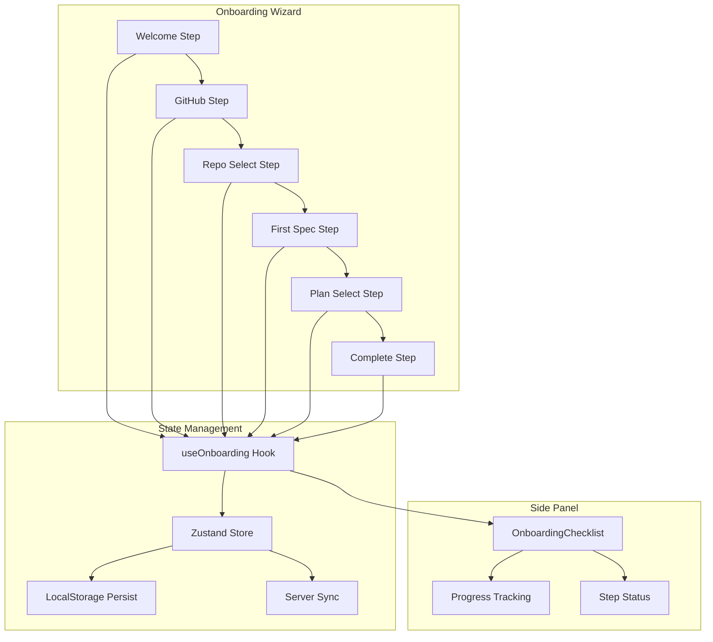

# Onboarding Flow Design

> **Date**: 2025-07-20 | **Status**: Active | **Version**: 1.0 | **Owner**: Deep Docs Pipeline
> **Source**: Generated from codebase analysis | **Cross-links**: See Related Documents section

## Overview

The OmoiOS Onboarding Flow guides new users through a 6-step wizard to set up their account, connect GitHub, select a repository, create their first feature specification, and choose a billing plan. The flow is designed to get users to their first agent-executed feature within 2 minutes.

## Architecture



## Component Hierarchy

```
OnboardingWizard (Container)
├── Progress Header
│   ├── Back Button (conditional)
│   ├── Step Title
│   └── Progress Bar
├── Step Components (Dynamic)
│   ├── WelcomeStep
│   ├── GitHubStep
│   ├── RepoSelectStep
│   ├── FirstSpecStep
│   ├── PlanSelectStep
│   └── CompleteStep
└── Sidebar
    └── OnboardingChecklist
        ├── Pre-onboarding Items
        └── Post-onboarding Items
```

## Step Definitions

```typescript
// frontend/components/onboarding/OnboardingWizard.tsx:18-34

type OnboardingStep = 
  | "welcome" 
  | "github" 
  | "repo" 
  | "first-spec" 
  | "plan" 
  | "complete";

const STEP_COMPONENTS: Record<OnboardingStep, React.ComponentType> = {
  welcome: WelcomeStep,
  github: GitHubStep,
  repo: RepoSelectStep,
  "first-spec": FirstSpecStep,
  plan: PlanSelectStep,
  complete: CompleteStep,
};

const STEP_TITLES: Record<OnboardingStep, string> = {
  welcome: "Welcome",
  github: "Connect GitHub",
  repo: "Select Repository",
  "first-spec": "First Feature",
  plan: "Choose Plan",
  complete: "All Set!",
};
```

## State Management

### Onboarding Store Interface

```typescript
// From useOnboarding hook analysis

interface OnboardingState {
  // Current step
  currentStep: OnboardingStep;
  
  // Step completion tracking
  completedSteps: OnboardingStep[];
  completedChecklistItems: ChecklistItemId[];
  
  // User data collected during onboarding
  data: {
    githubConnected: boolean;
    githubUsername: string | null;
    selectedRepo: {
      owner: string;
      name: string;
      fullName: string;
      language?: string;
    } | null;
    firstSpecText: string | null;
    firstSpecId: string | null;
    firstSpecStatus: "pending" | "running" | "completed" | null;
    selectedPlan: "free" | "pro" | "team" | "lifetime" | null;
    organizationId: string | null;
  };
  
  // Loading states
  isLoading: boolean;
  error: string | null;
}

interface OnboardingActions {
  // Navigation
  nextStep: () => void;
  prevStep: () => void;
  goToStep: (step: OnboardingStep) => void;
  canGoBack: boolean;
  
  // Data management
  updateData: (data: Partial<OnboardingState['data']>) => void;
  clearError: () => void;
  
  // GitHub integration
  connectGitHub: () => void;
  checkGitHubConnection: () => Promise<void>;
  
  // Spec submission
  submitFirstSpec: (text: string) => Promise<void>;
  
  // Completion
  completeOnboarding: () => Promise<void>;
  
  // Progress
  progress: number; // 0-100
}
```

### Hook Signature

```typescript
// frontend/components/onboarding/OnboardingWizard.tsx:36-46

export function useOnboarding(): OnboardingState & OnboardingActions {
  // Implementation combines Zustand store with React Query
  // for server state synchronization
}
```

## Step Components

### WelcomeStep

```typescript
// frontend/components/onboarding/steps/WelcomeStep.tsx

export function WelcomeStep() {
  const { nextStep } = useOnboarding();
  const { user } = useAuth();

  const firstName = user?.full_name?.split(" ")[0] || "there";

  const handleGetStarted = () => {
    nextStep();
  };

  return (
    <div className="space-y-6 text-center">
      <CardTitle className="text-2xl sm:text-3xl">
        Hey {firstName}!<br />
        Ready to ship while you sleep?
      </CardTitle>
      
      {/* 3-step visual preview */}
      <div className="grid gap-3 text-left">
        <StepPreview
          number={1}
          icon={<Code className="h-4 w-4" />}
          title="Describe what to build"
          description="Tell us what feature you want in plain English"
        />
        <StepPreview
          number={2}
          icon={<Moon className="h-4 w-4" />}
          title="Go to sleep"
          description="Agents work through the night writing code"
        />
        <StepPreview
          number={3}
          icon={<GitPullRequest className="h-4 w-4" />}
          title="Wake up to a PR"
          description="Review and merge your completed feature"
        />
      </div>
      
      <Button size="lg" onClick={handleGetStarted}>
        Let's Get Started
      </Button>
    </div>
  );
}
```

### GitHubStep

```typescript
// frontend/components/onboarding/steps/GitHubStep.tsx

export function GitHubStep() {
  const { data, isLoading, connectGitHub, checkGitHubConnection, nextStep } =
    useOnboarding();

  // Check connection status on mount
  useEffect(() => {
    checkGitHubConnection();
  }, [checkGitHubConnection]);

  // If already connected, show success and auto-advance option
  if (data.githubConnected) {
    return (
      <div className="space-y-6 text-center">
        <div className="mx-auto flex h-16 w-16 items-center justify-center rounded-full bg-green-500/10">
          <CheckCircle className="h-8 w-8 text-green-600" />
        </div>
        <CardTitle className="text-2xl">GitHub Connected!</CardTitle>
        <CardDescription>
          Connected as @{data.githubUsername}
        </CardDescription>
        <Button size="lg" onClick={nextStep}>
          Continue to Select Repository
        </Button>
      </div>
    );
  }

  return (
    <div className="space-y-6">
      <div className="text-center">
        <CardTitle className="text-2xl">Connect Your Code</CardTitle>
        <CardDescription>
          OmoiOS needs GitHub access to create branches and pull requests
        </CardDescription>
      </div>
      
      <Button
        size="lg"
        onClick={connectGitHub}
        disabled={isLoading}
        className="w-full bg-[#24292e] hover:bg-[#24292e]/90"
      >
        <Github className="mr-2 h-5 w-5" />
        Connect GitHub
      </Button>
      
      {/* Security reassurances */}
      <div className="space-y-3">
        <SecurityItem
          icon={<Shield className="h-4 w-4" />}
          text="You choose which repos we can access"
        />
        <SecurityItem
          icon={<GitBranch className="h-4 w-4" />}
          text="We never push to main without your approval"
        />
      </div>
      
      {/* Skip option */}
      <Button variant="ghost" onClick={nextStep}>
        Skip for now - I'll connect later
      </Button>
    </div>
  );
}
```

### RepoSelectStep

```typescript
// frontend/components/onboarding/steps/RepoSelectStep.tsx

export function RepoSelectStep() {
  const { data, updateData, nextStep, isLoading: onboardingLoading } = useOnboarding();
  
  const [repos, setRepos] = useState<GitHubRepo[]>([]);
  const [isLoading, setIsLoading] = useState(true);
  const [searchQuery, setSearchQuery] = useState("");
  const [selectedRepoFullName, setSelectedRepoFullName] = useState<string | null>(
    data.selectedRepo?.fullName || null
  );

  // Fetch repos on mount
  useEffect(() => {
    fetchRepos();
  }, []);

  const fetchRepos = async () => {
    setIsLoading(true);
    try {
      const response = await api.get<GitHubRepo[]>("/api/v1/github/repos");
      // Sort by most recently updated
      const sorted = response.sort(
        (a, b) => new Date(b.updated_at).getTime() - new Date(a.updated_at).getTime()
      );
      setRepos(sorted);
    } catch (err) {
      setError("Failed to load repositories");
    } finally {
      setIsLoading(false);
    }
  };

  const filteredRepos = repos.filter(
    (repo) =>
      repo.full_name.toLowerCase().includes(searchQuery.toLowerCase()) ||
      repo.description?.toLowerCase().includes(searchQuery.toLowerCase())
  );

  const handleSelect = (fullName: string) => {
    setSelectedRepoFullName(fullName);
    const repo = repos.find((r) => r.full_name === fullName);
    if (repo) {
      updateData({
        selectedRepo: {
          owner: repo.owner.login,
          name: repo.name,
          fullName: repo.full_name,
          language: repo.language || undefined,
        },
      });
    }
  };

  return (
    <div className="space-y-6">
      <CardTitle className="text-2xl">Choose Your First Project</CardTitle>
      
      {/* Search */}
      <div className="relative">
        <Search className="absolute left-3 top-1/2 h-4 w-4 text-muted-foreground" />
        <Input
          placeholder="Search repositories..."
          value={searchQuery}
          onChange={(e) => setSearchQuery(e.target.value)}
          className="pl-9"
        />
      </div>
      
      {/* Repository list */}
      <div className="space-y-2 max-h-[300px] overflow-y-auto">
        <RadioGroup
          value={selectedRepoFullName || ""}
          onValueChange={handleSelect}
        >
          {filteredRepos.map((repo) => (
            <div
              key={repo.id}
              className={`flex items-start gap-3 p-3 border rounded-lg cursor-pointer ${
                selectedRepoFullName === repo.full_name
                  ? "border-primary bg-primary/5"
                  : ""
              }`}
              onClick={() => handleSelect(repo.full_name)}
            >
              <RadioGroupItem value={repo.full_name} id={repo.full_name} />
              <Label htmlFor={repo.full_name} className="flex-1">
                <div className="font-medium">{repo.full_name}</div>
                <div className="flex items-center gap-3 mt-1 text-xs text-muted-foreground">
                  {repo.language && <span>{repo.language}</span>}
                  {repo.stargazers_count > 0 && (
                    <span className="flex items-center gap-1">
                      <Star className="h-3 w-3" />
                      {repo.stargazers_count}
                    </span>
                  )}
                </div>
              </Label>
            </div>
          ))}
        </RadioGroup>
      </div>
      
      <Button
        size="lg"
        onClick={nextStep}
        disabled={!selectedRepoFullName || onboardingLoading}
      >
        Continue
      </Button>
      
      <Button variant="ghost" onClick={nextStep}>
        Skip for now - I'll select a repo later
      </Button>
    </div>
  );
}
```

### FirstSpecStep

```typescript
// frontend/components/onboarding/steps/FirstSpecStep.tsx

const SUGGESTION_CHIPS = [
  "Add form validation to the contact form",
  "Create a dark mode toggle",
  "Add a logout button to the navbar",
  "Fix the broken link in the footer",
  "Add loading states to buttons",
  "Improve mobile navigation",
];

export function FirstSpecStep() {
  const { data, submitFirstSpec, isLoading, error, clearError, nextStep } =
    useOnboarding();
  const [specText, setSpecText] = useState(data.firstSpecText || "");

  const handleSubmit = async () => {
    if (!specText.trim()) return;
    await submitFirstSpec(specText.trim());
  };

  const characterCount = specText.length;
  const isValidLength = characterCount >= 10 && characterCount <= 2000;

  return (
    <div className="space-y-6">
      <CardTitle className="text-2xl flex items-center justify-center gap-2">
        <Sparkles className="h-6 w-6 text-primary" />
        Describe Your First Feature
      </CardTitle>
      
      {/* Selected repo context */}
      {data.selectedRepo && (
        <div className="flex items-center justify-center gap-2 text-sm">
          <span>Building in</span>
          <Badge variant="secondary">{data.selectedRepo.fullName}</Badge>
        </div>
      )}
      
      {/* Spec input */}
      <Textarea
        placeholder="Example: Add a logout button to the navbar..."
        value={specText}
        onChange={(e) => {
          setSpecText(e.target.value);
          if (error) clearError();
        }}
        className="min-h-[120px]"
        disabled={isLoading}
      />
      
      {/* Character count */}
      <div className="flex justify-between text-xs text-muted-foreground">
        <span>
          {characterCount < 10
            ? `${10 - characterCount} more characters needed`
            : "Looks good!"}
        </span>
        <span className={characterCount > 2000 ? "text-destructive" : ""}>
          {characterCount}/2000
        </span>
      </div>
      
      {/* Suggestion chips */}
      <div className="flex flex-wrap gap-2">
        {SUGGESTION_CHIPS.map((suggestion) => (
          <Button
            key={suggestion}
            variant="outline"
            size="sm"
            onClick={() => {
              setSpecText(suggestion);
              clearError();
            }}
          >
            {suggestion}
          </Button>
        ))}
      </div>
      
      {/* Usage note */}
      <div className="flex items-center gap-2 p-3 rounded-lg bg-muted/50 text-sm">
        <Clock className="h-4 w-4" />
        <span>This will use 1 of your 5 free monthly workflows</span>
      </div>
      
      <Button
        size="lg"
        onClick={handleSubmit}
        disabled={!isValidLength || isLoading}
      >
        {isLoading ? (
          <>
            <Loader2 className="mr-2 h-5 w-5 animate-spin" />
            Starting Agent...
          </>
        ) : (
          <>Submit First Spec</>
        )}
      </Button>
    </div>
  );
}
```

### PlanSelectStep

```typescript
// frontend/components/onboarding/steps/PlanSelectStep.tsx

interface PlanOption {
  id: string;
  name: string;
  price: string;
  priceNote?: string;
  icon: React.ReactNode;
  features: string[];
  highlighted?: boolean;
  urgencyText?: string;
  accentColor: string;
}

const PLANS: PlanOption[] = [
  {
    id: "free",
    name: "Starter",
    price: "$0",
    priceNote: "forever",
    icon: <Zap className="h-5 w-5" />,
    features: [
      "1 concurrent agent",
      "5 workflows/month",
      "2GB storage",
      "Community support",
    ],
    accentColor: "bg-slate-500",
  },
  {
    id: "pro",
    name: "Pro",
    price: "$50",
    priceNote: "/month",
    icon: <Crown className="h-5 w-5" />,
    features: [
      "5 concurrent agents",
      "100 workflows/month",
      "50GB storage",
      "BYO API keys",
      "Priority support",
    ],
    accentColor: "bg-purple-500",
  },
  {
    id: "team",
    name: "Team",
    price: "$150",
    priceNote: "/month",
    icon: <Infinity className="h-5 w-5" />,
    features: [
      "10 concurrent agents",
      "500 workflows/month",
      "500GB storage",
      "BYO API keys",
      "Dedicated support",
      "Team collaboration",
    ],
    highlighted: true,
    urgencyText: "Most popular for growing teams",
    accentColor: "bg-emerald-500",
  },
];

export function PlanSelectStep() {
  const { data, updateData, nextStep, isLoading } = useOnboarding();
  const [selectedPlan, setSelectedPlan] = useState(data.selectedPlan || "free");
  
  // Promo code state
  const [promoCode, setPromoCode] = useState("");
  const [validatedPromo, setValidatedPromo] = useState<PromoCode | null>(null);
  
  const validatePromoCode = useValidatePromoCode();
  const redeemPromoCode = useRedeemPromoCode();

  const handleSelectPlan = (planId: string) => {
    setSelectedPlan(planId);
    updateData({ selectedPlan: planId });
  };

  const handleContinue = async () => {
    if (selectedPlan === "free") {
      nextStep();
      return;
    }
    // Start Stripe checkout for paid plans
    // ... implementation
  };

  return (
    <div className="space-y-6">
      <CardTitle className="text-2xl">Your First Agent is Working!</CardTitle>
      
      {/* Agent progress indicator */}
      {data.firstSpecText && (
        <div className="p-3 rounded-lg bg-muted/50 text-sm">
          <div className="flex items-center gap-2">
            <Clock className="h-4 w-4 animate-pulse text-primary" />
            <span>Working on: "{data.firstSpecText.slice(0, 40)}..."</span>
          </div>
        </div>
      )}
      
      {/* Plan cards */}
      <div className="space-y-3">
        {PLANS.map((plan) => (
          <PlanCard
            key={plan.id}
            plan={plan}
            isSelected={selectedPlan === plan.id}
            onSelect={() => handleSelectPlan(plan.id)}
          />
        ))}
      </div>
      
      {/* Promo code section */}
      <div className="border-t pt-4">
        {/* Promo code input or validated display */}
      </div>
      
      <Button
        size="lg"
        onClick={handleContinue}
        disabled={isLoading}
      >
        {selectedPlan === "free" ? "Continue with Starter" : "Upgrade"}
      </Button>
    </div>
  );
}
```

### CompleteStep

```typescript
// frontend/components/onboarding/steps/CompleteStep.tsx

export function CompleteStep() {
  const { data, completeOnboarding, isLoading } = useOnboarding();

  return (
    <div className="space-y-8 text-center">
      {/* Success icon */}
      <div className="mx-auto flex h-20 w-20 items-center justify-center rounded-full bg-green-500/10">
        <CheckCircle className="h-10 w-10 text-green-600" />
      </div>
      
      <div>
        <CardTitle className="text-2xl">You're All Set!</CardTitle>
        <CardDescription>
          Your agent is working on your first feature.
          {data.selectedPlan === "lifetime" && (
            <span className="block mt-1 text-emerald-600 font-medium">
              Welcome, Founding Member!
            </span>
          )}
        </CardDescription>
      </div>
      
      {/* Agent progress preview */}
      {data.firstSpecText && (
        <div className="p-4 rounded-lg bg-muted/50 text-left">
          <div className="flex items-center justify-between">
            <span className="text-sm font-medium">Your first feature</span>
            <Clock className="h-4 w-4 animate-pulse" />
          </div>
          <p className="text-sm text-muted-foreground">
            "{data.firstSpecText}"
          </p>
          <Progress value={35} className="h-2" />
        </div>
      )}
      
      {/* What's next */}
      <div className="text-left space-y-3">
        <p className="text-sm font-medium">What you can do now:</p>
        <ul className="space-y-2 text-sm text-muted-foreground">
          <li className="flex items-start gap-2">
            <CheckCircle className="h-4 w-4 text-primary mt-0.5" />
            <span>Watch your agent work in real-time</span>
          </li>
          <li className="flex items-start gap-2">
            <CheckCircle className="h-4 w-4 text-primary mt-0.5" />
            <span>Add more features to the queue</span>
          </li>
          <li className="flex items-start gap-2">
            <CheckCircle className="h-4 w-4 text-primary mt-0.5" />
            <span>Invite team members to collaborate</span>
          </li>
        </ul>
      </div>
      
      <Button
        size="lg"
        onClick={completeOnboarding}
        disabled={isLoading}
      >
        {data.firstSpecId ? "View Spec Progress" : "Go to Command Center"}
      </Button>
    </div>
  );
}
```

## Progress Tracking

### OnboardingChecklist Component

```typescript
// frontend/components/onboarding/OnboardingChecklist.tsx

interface ChecklistItem {
  id: string;
  label: string;
  description?: string;
  step?: OnboardingStep;
  isPostOnboarding?: boolean;
}

const CHECKLIST_ITEMS: ChecklistItem[] = [
  // Onboarding steps
  { id: "welcome", label: "Get started", description: "Learn what Omoios can do", step: "welcome" },
  { id: "github", label: "Connect GitHub", description: "Link your repositories", step: "github" },
  { id: "repo", label: "Select repository", description: "Choose your first project", step: "repo" },
  { id: "first-spec", label: "Describe your feature", description: "Tell the agent what to build", step: "first-spec" },
  { id: "plan", label: "Choose your plan", description: "Free or paid options", step: "plan" },
  
  // Post-onboarding tasks
  { id: "watch-agent", label: "Watch agent work", description: "See your feature being built", isPostOnboarding: true },
  { id: "review-pr", label: "Review your first PR", description: "Agent creates a pull request", isPostOnboarding: true },
  { id: "invite-team", label: "Invite team members", description: "Collaborate with your team", isPostOnboarding: true },
];

type ItemStatus = "completed" | "current" | "locked" | "pending";

export function OnboardingChecklist({ showPostOnboarding = true }) {
  const { currentStep, completedSteps, completedChecklistItems, data } = useOnboarding();

  const getItemStatus = (item: ChecklistItem): ItemStatus => {
    // Check if explicitly completed
    if (completedChecklistItems.includes(item.id)) {
      return "completed";
    }

    // Post-onboarding items
    if (item.isPostOnboarding) {
      if (item.id === "watch-agent" && data.firstSpecId) {
        if (data.firstSpecStatus === "running") return "current";
        if (data.firstSpecStatus === "completed") return "completed";
        return "pending";
      }
      // ... other post-onboarding logic
      return "locked";
    }

    // Onboarding steps
    if (!item.step) return "pending";
    if (completedSteps.includes(item.step)) return "completed";
    if (currentStep === item.step) return "current";

    // Check if this step is before or after current
    const steps: OnboardingStep[] = ["welcome", "github", "repo", "first-spec", "plan", "complete"];
    const currentIndex = steps.indexOf(currentStep);
    const itemIndex = steps.indexOf(item.step);

    if (itemIndex < currentIndex) return "completed";
    return "locked";
  };

  return (
    <div className="space-y-1">
      <h3 className="text-sm font-semibold mb-3">Setup Checklist</h3>
      {CHECKLIST_ITEMS.map((item) => (
        <ChecklistItemRow
          key={item.id}
          item={item}
          status={getItemStatus(item)}
        />
      ))}
    </div>
  );
}
```

## Progress Calculation

```typescript
// Derived from OnboardingWizard implementation

const calculateProgress = (currentStep: OnboardingStep): number => {
  const stepOrder: OnboardingStep[] = [
    "welcome",
    "github", 
    "repo",
    "first-spec",
    "plan",
    "complete"
  ];
  
  const currentIndex = stepOrder.indexOf(currentStep);
  const totalSteps = stepOrder.length;
  
  // Calculate percentage (0-100)
  return Math.round((currentIndex / (totalSteps - 1)) * 100);
};

// Usage in wizard header
<div className="space-y-2">
  <div className="flex justify-between text-sm text-muted-foreground">
    <span>{STEP_TITLES[currentStep]}</span>
    <span>{progress}% complete</span>
  </div>
  <Progress value={progress} className="h-2" />
</div>
```

## Server Synchronization

```typescript
// Onboarding state sync with backend

interface OnboardingStatus {
  is_completed: boolean;
  current_step: OnboardingStep;
  completed_steps: OnboardingStep[];
  data: {
    github_connected: boolean;
    github_username: string | null;
    selected_repo: object | null;
    first_spec_text: string | null;
    first_spec_id: string | null;
    selected_plan: string | null;
  };
}

// API functions
export async function fetchOnboardingStatus(): Promise<OnboardingStatus>;
export async function updateOnboardingStep(step: OnboardingStep): Promise<void>;
export async function completeOnboarding(): Promise<void>;
```

## Related Documents

- [Authentication System](./authentication_system.md) - User login and session management
- [Billing & Subscriptions](./billing_subscriptions.md) - Plan selection and payment
- [Project Management](./project_management_dashboard.md) - Post-onboarding project creation
- [Organizations](./organizations_multi_tenancy.md) - Organization context for onboarding

## Analytics Events

| Event | Trigger | Data |
|-------|---------|------|
| `ONBOARDING_STARTED` | Welcome step viewed | - |
| `ONBOARDING_STEP_COMPLETED` | Each step completion | step, duration |
| `GITHUB_CONNECTED` | GitHub OAuth success | username |
| `REPO_SELECTED` | Repository chosen | repo_name, language |
| `FIRST_SPEC_SUBMITTED` | Spec created | spec_length |
| `PLAN_SELECTED` | Plan chosen | plan_id |
| `ONBOARDING_COMPLETED` | Final step | total_duration |

## Testing Strategy

| Test Type | Coverage | Key Scenarios |
|-----------|----------|---------------|
| Unit | Step components | Rendering, interactions |
| Integration | Flow navigation | Step progression, data persistence |
| E2E | Full onboarding | Complete flow from login to dashboard |
| Visual | Responsive design | Mobile, tablet, desktop layouts |
