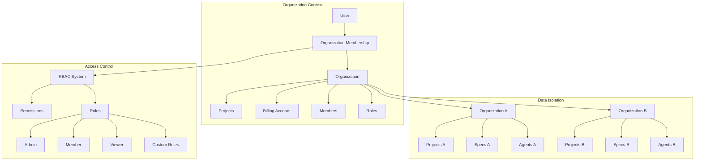
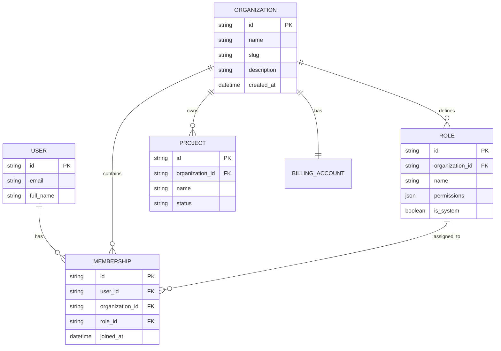
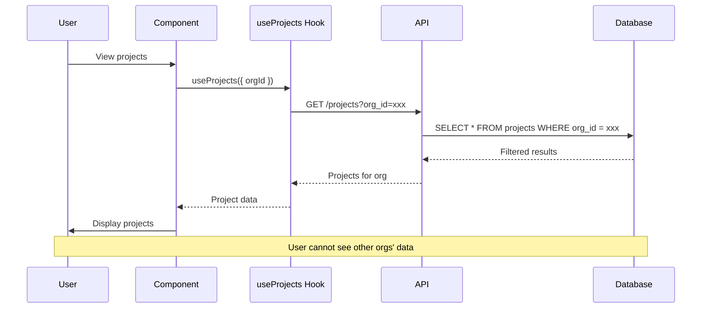

# Organizations & Multi-Tenancy Design

> **Date**: 2025-07-20 | **Status**: Active | **Version**: 1.0 | **Owner**: Deep Docs Pipeline
> **Source**: Generated from codebase analysis | **Cross-links**: See Related Documents section

## Overview

The OmoiOS Organizations system provides multi-tenant architecture for team collaboration. Each user can belong to multiple organizations, with each organization serving as the billing and data isolation boundary. The system supports role-based access control (RBAC), member invitations, and organization-scoped resources.

## Architecture



## Component Hierarchy

```
Organization Domain
├── Hooks (useOrganizations.ts)
│   ├── useOrganizations
│   ├── useOrganization
│   ├── useOrganizationMembers
│   ├── useCreateOrganization
│   └── useUpdateOrganization
├── API Client (organizations.ts)
│   ├── Organization CRUD
│   ├── Member Management
│   └── Role Management
└── Pages
    └── settings/organization/
        ├── page.tsx (Organization Settings)
        └── members/page.tsx (Member Management)
```

## Data Model



## Hook Signatures

### Organization List Hook

```typescript
// From useOrganizations hook pattern

/**
 * Hook to fetch all organizations the current user belongs to
 * Uses React Query for caching and automatic refetching
 */
export function useOrganizations() {
  return useQuery<OrganizationSummary[]>({
    queryKey: organizationKeys.lists(),
    queryFn: listOrganizations,
    staleTime: 5 * 60 * 1000, // 5 minutes
  });
}

// Query keys
export const organizationKeys = {
  all: ["organizations"] as const,
  lists: () => [...organizationKeys.all, "list"] as const,
  list: (filters: object) => [...organizationKeys.lists(), filters] as const,
  details: () => [...organizationKeys.all, "detail"] as const,
  detail: (id: string) => [...organizationKeys.details(), id] as const,
  members: (orgId: string) => [...organizationKeys.detail(orgId), "members"] as const,
  roles: (orgId: string) => [...organizationKeys.detail(orgId), "roles"] as const,
};
```

### Single Organization Hook

```typescript
/**
 * Hook to fetch a single organization by ID
 * Automatically handles loading and error states
 */
export function useOrganization(orgId: string | undefined) {
  return useQuery<Organization>({
    queryKey: organizationKeys.detail(orgId!),
    queryFn: () => getOrganization(orgId!),
    enabled: !!orgId && isValidUUID(orgId),
    staleTime: 5 * 60 * 1000,
  });
}
```

### Member Management Hooks

```typescript
/**
 * Hook to fetch organization members
 */
export function useOrganizationMembers(orgId: string | undefined) {
  return useQuery<Membership[]>({
    queryKey: organizationKeys.members(orgId!),
    queryFn: () => listMembers(orgId!),
    enabled: !!orgId && isValidUUID(orgId),
  });
}

/**
 * Hook to add a member to an organization
 * Invalidates member list on success
 */
export function useAddMember() {
  const queryClient = useQueryClient();

  return useMutation({
    mutationFn: ({
      orgId,
      data,
    }: {
      orgId: string;
      data: MembershipCreate;
    }) => addMember(orgId, data),
    onSuccess: (_, { orgId }) => {
      queryClient.invalidateQueries({
        queryKey: organizationKeys.members(orgId),
      });
    },
  });
}

/**
 * Hook to update member role
 */
export function useUpdateMember() {
  const queryClient = useQueryClient();

  return useMutation({
    mutationFn: ({
      orgId,
      memberId,
      roleId,
    }: {
      orgId: string;
      memberId: string;
      roleId: string;
    }) => updateMember(orgId, memberId, roleId),
    onSuccess: (_, { orgId }) => {
      queryClient.invalidateQueries({
        queryKey: organizationKeys.members(orgId),
      });
    },
  });
}

/**
 * Hook to remove a member from an organization
 */
export function useRemoveMember() {
  const queryClient = useQueryClient();

  return useMutation({
    mutationFn: ({
      orgId,
      memberId,
    }: {
      orgId: string;
      memberId: string;
    }) => removeMember(orgId, memberId),
    onSuccess: (_, { orgId }) => {
      queryClient.invalidateQueries({
        queryKey: organizationKeys.members(orgId),
      });
    },
  });
}
```

### Organization CRUD Hooks

```typescript
/**
 * Hook to create a new organization
 * Automatically adds current user as admin
 */
export function useCreateOrganization() {
  const queryClient = useQueryClient();
  const router = useRouter();

  return useMutation({
    mutationFn: (data: OrganizationCreate) => createOrganization(data),
    onSuccess: (newOrg) => {
      // Invalidate organization list
      queryClient.invalidateQueries({
        queryKey: organizationKeys.lists(),
      });
      
      // Navigate to new organization
      router.push(`/organizations/${newOrg.id}`);
      
      toast.success(`Organization "${newOrg.name}" created`);
    },
    onError: (error) => {
      toast.error(`Failed to create organization: ${error.message}`);
    },
  });
}

/**
 * Hook to update an organization
 */
export function useUpdateOrganization() {
  const queryClient = useQueryClient();

  return useMutation({
    mutationFn: ({
      orgId,
      data,
    }: {
      orgId: string;
      data: OrganizationUpdate;
    }) => updateOrganization(orgId, data),
    onSuccess: (updatedOrg, { orgId }) => {
      // Update cache for this organization
      queryClient.setQueryData(
        organizationKeys.detail(orgId),
        updatedOrg
      );
      
      // Invalidate organization list
      queryClient.invalidateQueries({
        queryKey: organizationKeys.lists(),
      });
      
      toast.success("Organization updated");
    },
  });
}

/**
 * Hook to delete (archive) an organization
 */
export function useDeleteOrganization() {
  const queryClient = useQueryClient();
  const router = useRouter();

  return useMutation({
    mutationFn: (orgId: string) => deleteOrganization(orgId),
    onSuccess: (_, orgId) => {
      // Remove from cache
      queryClient.removeQueries({
        queryKey: organizationKeys.detail(orgId),
      });
      
      // Invalidate list
      queryClient.invalidateQueries({
        queryKey: organizationKeys.lists(),
      });
      
      router.push("/organizations");
      toast.success("Organization deleted");
    },
  });
}
```

## API Client Functions

```typescript
// frontend/lib/api/organizations.ts

// ============================================================================
// Organizations
// ============================================================================

/**
 * List all organizations the current user is a member of
 * Returns summary information for each organization
 */
export async function listOrganizations(): Promise<OrganizationSummary[]> {
  return apiRequest<OrganizationSummary[]>("/api/v1/organizations");
}

/**
 * Get detailed organization information
 * Includes full organization data with settings
 */
export async function getOrganization(orgId: string): Promise<Organization> {
  return apiRequest<Organization>(`/api/v1/organizations/${orgId}`);
}

/**
 * Create a new organization
 * Automatically adds current user as admin member
 */
export async function createOrganization(
  data: OrganizationCreate
): Promise<Organization> {
  return apiRequest<Organization>("/api/v1/organizations", {
    method: "POST",
    body: data,
  });
}

/**
 * Update organization details
 * Only admins can update organization settings
 */
export async function updateOrganization(
  orgId: string,
  data: OrganizationUpdate
): Promise<Organization> {
  return apiRequest<Organization>(`/api/v1/organizations/${orgId}`, {
    method: "PATCH",
    body: data,
  });
}

/**
 * Delete (archive) an organization
 * Requires admin permissions
 */
export async function deleteOrganization(
  orgId: string
): Promise<MessageResponse> {
  return apiRequest<MessageResponse>(`/api/v1/organizations/${orgId}`, {
    method: "DELETE",
  });
}

// ============================================================================
// Members
// ============================================================================

/**
 * List all members of an organization
 * Includes user details and assigned roles
 */
export async function listMembers(orgId: string): Promise<Membership[]> {
  return apiRequest<Membership[]>(`/api/v1/organizations/${orgId}/members`);
}

/**
 * Add a new member to the organization
 * Sends invitation email to the user
 */
export async function addMember(
  orgId: string,
  data: MembershipCreate
): Promise<Membership> {
  return apiRequest<Membership>(`/api/v1/organizations/${orgId}/members`, {
    method: "POST",
    body: data,
  });
}

/**
 * Update a member's role
 * Requires admin permissions
 */
export async function updateMember(
  orgId: string,
  memberId: string,
  roleId: string
): Promise<Membership> {
  return apiRequest<Membership>(
    `/api/v1/organizations/${orgId}/members/${memberId}`,
    {
      method: "PATCH",
      body: { role_id: roleId },
    }
  );
}

/**
 * Remove a member from the organization
 * Cannot remove the last admin
 */
export async function removeMember(
  orgId: string,
  memberId: string
): Promise<MessageResponse> {
  return apiRequest<MessageResponse>(
    `/api/v1/organizations/${orgId}/members/${memberId}`,
    { method: "DELETE" }
  );
}

// ============================================================================
// Roles
// ============================================================================

/**
 * List all roles available in the organization
 * Includes system roles and custom roles
 */
export async function listRoles(
  orgId: string,
  includeSystem = true
): Promise<Role[]> {
  const url = `/api/v1/organizations/${orgId}/roles?include_system=${includeSystem}`;
  return apiRequest<Role[]>(url);
}

/**
 * Create a custom role for the organization
 * Define custom permissions for specific needs
 */
export async function createRole(
  orgId: string,
  data: Omit<RoleCreate, "organization_id">
): Promise<Role> {
  return apiRequest<Role>(`/api/v1/organizations/${orgId}/roles`, {
    method: "POST",
    body: { ...data, organization_id: orgId },
  });
}

/**
 * Update a custom role
 * Cannot modify system roles
 */
export async function updateRole(
  orgId: string,
  roleId: string,
  data: Partial<Omit<RoleCreate, "organization_id">>
): Promise<Role> {
  return apiRequest<Role>(`/api/v1/organizations/${orgId}/roles/${roleId}`, {
    method: "PATCH",
    body: data,
  });
}

/**
 * Delete a custom role
 * Cannot delete system roles or roles with members
 */
export async function deleteRole(
  orgId: string,
  roleId: string
): Promise<MessageResponse> {
  return apiRequest<MessageResponse>(
    `/api/v1/organizations/${orgId}/roles/${roleId}`,
    { method: "DELETE" }
  );
}
```

## TypeScript Types

```typescript
// From frontend/lib/api/types.ts

// ============================================================================
// Organization Types
// ============================================================================

interface Organization {
  id: string;
  name: string;
  slug: string;
  description: string | null;
  avatar_url: string | null;
  settings: Record<string, unknown> | null;
  created_at: string;
  updated_at: string;
}

interface OrganizationSummary extends Organization {
  member_count: number;
  project_count: number;
  my_role: string;
}

interface OrganizationCreate {
  name: string;
  slug?: string;
  description?: string;
  avatar_url?: string;
}

interface OrganizationUpdate {
  name?: string;
  description?: string;
  avatar_url?: string;
  settings?: Record<string, unknown>;
}

// ============================================================================
// Membership Types
// ============================================================================

interface Membership {
  id: string;
  user_id: string;
  organization_id: string;
  role_id: string;
  joined_at: string;
  // Expanded relations
  user?: User;
  role?: Role;
}

interface MembershipCreate {
  user_id?: string;  // For direct add (admin only)
  email?: string;    // For invitation
  role_id: string;
}

// ============================================================================
// Role Types
// ============================================================================

interface Role {
  id: string;
  organization_id: string | null;  // null for system roles
  name: string;
  description: string | null;
  permissions: Permission[];
  is_system: boolean;
  created_at: string;
  updated_at: string;
}

interface RoleCreate {
  organization_id: string;
  name: string;
  description?: string;
  permissions: Permission[];
}

type Permission =
  | "org:read"
  | "org:update"
  | "org:delete"
  | "member:read"
  | "member:add"
  | "member:update"
  | "member:remove"
  | "project:create"
  | "project:read"
  | "project:update"
  | "project:delete"
  | "billing:read"
  | "billing:update"
  | "spec:create"
  | "spec:read"
  | "spec:update"
  | "spec:delete"
  | "agent:spawn"
  | "agent:read"
  | "agent:control";
```

## Role-Based Access Control

### System Roles

| Role | Key Permissions | Description |
|------|-----------------|-------------|
| **Admin** | All permissions | Full organization control |
| **Member** | project:*, spec:*, agent:* | Can create and manage projects |
| **Viewer** | org:read, project:read, spec:read | Read-only access |

### Permission Matrix

```typescript
const SYSTEM_ROLES: Record<string, Permission[]> = {
  admin: [
    "org:read", "org:update", "org:delete",
    "member:read", "member:add", "member:update", "member:remove",
    "project:create", "project:read", "project:update", "project:delete",
    "billing:read", "billing:update",
    "spec:create", "spec:read", "spec:update", "spec:delete",
    "agent:spawn", "agent:read", "agent:control",
  ],
  member: [
    "org:read",
    "member:read",
    "project:create", "project:read", "project:update",
    "spec:create", "spec:read", "spec:update", "spec:delete",
    "agent:spawn", "agent:read", "agent:control",
  ],
  viewer: [
    "org:read",
    "member:read",
    "project:read",
    "spec:read",
    "agent:read",
  ],
};
```

## Organization Context Provider

```typescript
// Pattern for organization context

interface OrganizationContextValue {
  currentOrganization: Organization | null;
  setCurrentOrganization: (org: Organization | null) => void;
  organizations: OrganizationSummary[];
  isLoading: boolean;
  switchOrganization: (orgId: string) => void;
}

const OrganizationContext = createContext<OrganizationContextValue | null>(null);

export function OrganizationProvider({ children }: { children: React.ReactNode }) {
  const { data: organizations, isLoading } = useOrganizations();
  const [currentOrgId, setCurrentOrgId] = useLocalStorage<string | null>("current-org", null);
  
  const currentOrganization = useMemo(() => {
    if (!organizations || !currentOrgId) return null;
    return organizations.find((org) => org.id === currentOrgId) || null;
  }, [organizations, currentOrgId]);

  const switchOrganization = useCallback((orgId: string) => {
    setCurrentOrgId(orgId);
    // Invalidate organization-scoped queries
    queryClient.invalidateQueries({ queryKey: ["projects"] });
    queryClient.invalidateQueries({ queryKey: ["billing"] });
  }, [setCurrentOrgId]);

  return (
    <OrganizationContext.Provider
      value={{
        currentOrganization,
        setCurrentOrganization: (org) => setCurrentOrgId(org?.id || null),
        organizations: organizations || [],
        isLoading,
        switchOrganization,
      }}
    >
      {children}
    </OrganizationContext.Provider>
  );
}

export const useCurrentOrganization = () => {
  const context = useContext(OrganizationContext);
  if (!context) {
    throw new Error("Must be used within OrganizationProvider");
  }
  return context;
};
```

## Multi-Tenancy Data Isolation



## Organization Switching

```typescript
// Pattern for organization switcher UI

export function OrganizationSwitcher() {
  const { currentOrganization, organizations, switchOrganization } = useCurrentOrganization();
  const [open, setOpen] = useState(false);

  return (
    <Popover open={open} onOpenChange={setOpen}>
      <PopoverTrigger asChild>
        <Button variant="outline" className="w-[200px] justify-start">
          <Avatar className="mr-2 h-5 w-5">
            <AvatarImage src={currentOrganization?.avatar_url || ""} />
            <AvatarFallback>{currentOrganization?.name[0]}</AvatarFallback>
          </Avatar>
          {currentOrganization?.name}
          <ChevronsUpDown className="ml-auto h-4 w-4 shrink-0 opacity-50" />
        </Button>
      </PopoverTrigger>
      <PopoverContent className="w-[200px] p-0">
        <Command>
          <CommandInput placeholder="Search organizations..." />
          <CommandEmpty>No organization found.</CommandEmpty>
          <CommandGroup>
            {organizations.map((org) => (
              <CommandItem
                key={org.id}
                onSelect={() => {
                  switchOrganization(org.id);
                  setOpen(false);
                }}
              >
                <Check
                  className={cn(
                    "mr-2 h-4 w-4",
                    currentOrganization?.id === org.id ? "opacity-100" : "opacity-0"
                  )}
                />
                {org.name}
              </CommandItem>
            ))}
          </CommandGroup>
        </Command>
      </PopoverContent>
    </Popover>
  );
}
```

## Related Documents

- [Authentication System](./authentication_system.md) - User authentication
- [Billing & Subscriptions](./billing_subscriptions.md) - Organization-scoped billing
- [Project Management](./project_management_dashboard.md) - Organization projects
- [Onboarding Flow](./onboarding_flow.md) - Organization creation during onboarding
- [Backend RBAC Architecture](../../architecture/07-auth-and-security.md) - Server-side permissions

## Security Considerations

1. **Data Isolation**: All queries filtered by organization_id
2. **Permission Checks**: Backend validates permissions on every request
3. **Admin Protection**: Cannot remove last admin from organization
4. **Invitation Flow**: New members invited via email
5. **Audit Logging**: All membership changes logged
6. **Role Immutability**: System roles cannot be modified

## Testing Strategy

| Test Type | Coverage | Key Scenarios |
|-----------|----------|---------------|
| Unit | Permission checks | Role-based access validation |
| Integration | API client | CRUD operations, member management |
| E2E | Full flows | Create org → Add member → Switch org |
| Security | Data isolation | Cross-organization data access |
