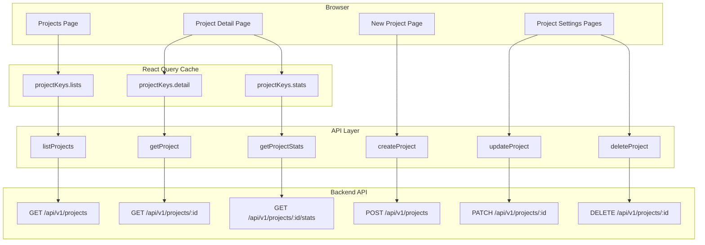
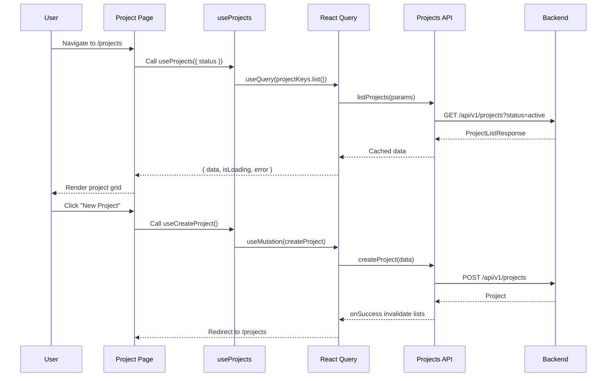
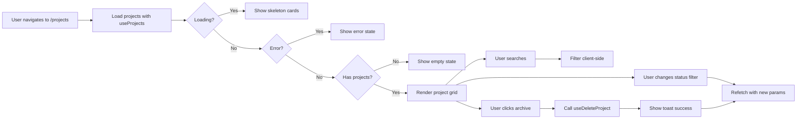
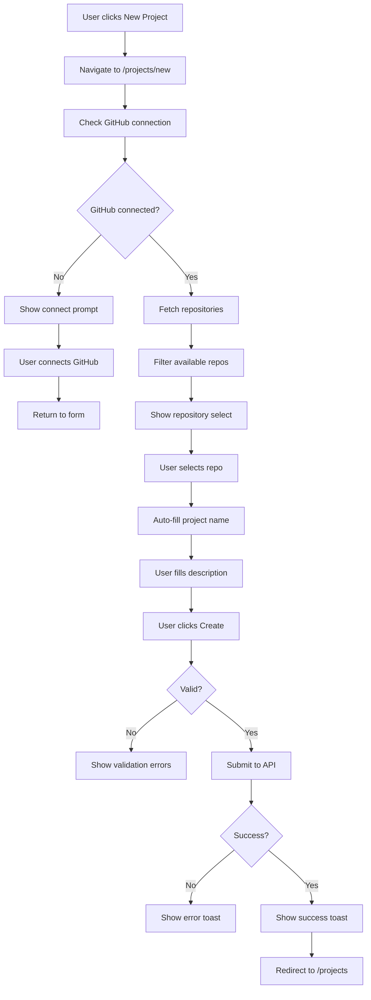
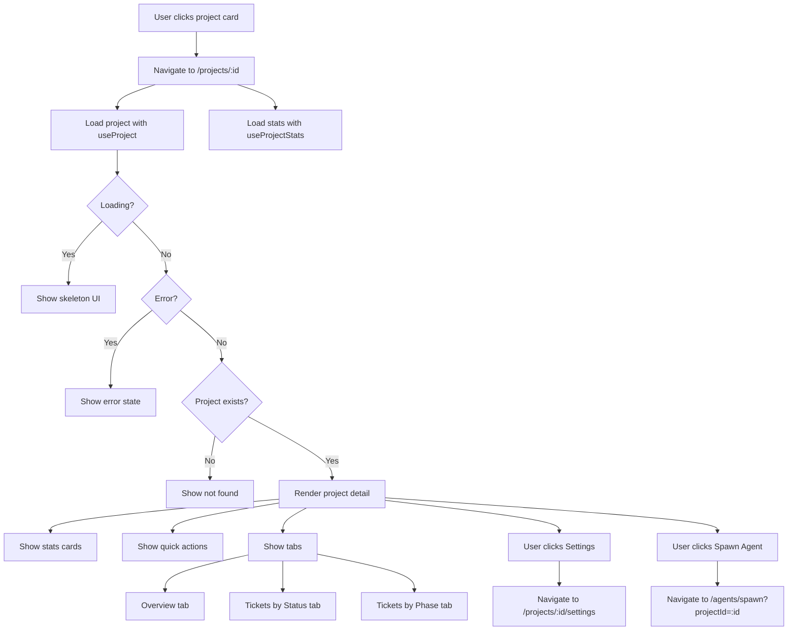

# OmoiOS Frontend Design Document

## Project Management Dashboard

---

**Date:** 2026-03-02

**Status:** Draft

**Version:** 1.0.0

**Owner:** Frontend Architecture Team

---

## Table of Contents

1. [Overview](#overview)
2. [Architecture](#architecture)
3. [Component Hierarchy](#component-hierarchy)
4. [State Management](#state-management)
5. [Data Fetching](#data-fetching)
6. [Page Flows](#page-flows)
7. [API Integration](#api-integration)
8. [Related Documents](#related-documents)

---

## Overview

The Project Management Dashboard provides a comprehensive interface for managing software projects within OmoiOS. It enables users to create projects linked to GitHub repositories, view project statistics, manage project settings, and navigate to related features like Kanban boards, specifications, and dependency graphs.

### Key Features

- **Project List View**: Grid layout with search, filtering by status, and quick actions
- **Project Detail View**: Statistics dashboard with tabs for overview, tickets by status, and tickets by phase
- **Project Creation**: Wizard-style form with GitHub repository selection
- **Project Settings**: Multi-page settings for phases, GitHub integration, and board configuration
- **Real-time Stats**: Live project metrics including tickets, agents, and commits

### User Stories

- As a user, I want to see all my projects in a searchable grid so I can quickly find what I'm working on
- As a user, I want to filter projects by status so I can focus on active work
- As a user, I want to create projects linked to GitHub repos so agents can work with my code
- As a user, I want to see project statistics at a glance so I understand project health
- As a user, I want to archive completed projects so my workspace stays organized

---

## Architecture

### System Architecture



### Data Flow Architecture



---

## Component Hierarchy

### Project List Page Component Tree

```
ProjectsPage (app/(app)/projects/page.tsx)
├── Container (max-w-7xl mx-auto p-6)
│   ├── Header Section
│   │   ├── Title: "Projects"
│   │   └── New Project Button → /projects/new
│   ├── Filters Section
│   │   ├── Search Input (with Search icon)
│   │   └── Status Select (all | active | paused | archived)
│   ├── Projects Grid (responsive: md:2-cols, lg:3-cols)
│   │   └── ProjectCard (mapped from filteredProjects)
│   │       ├── CardHeader
│   │       │   ├── FolderGit2 Icon
│   │       │   ├── Project Name Link → /projects/:id
│   │       │   ├── GitHub Repo Display (optional)
│   │       │   └── DropdownMenu (Settings, Archive)
│   │       ├── CardContent
│   │       │   ├── Description (line-clamp-2)
│   │       │   ├── GitHub Connected Badge
│   │       │   └── Footer Row
│   │       │       ├── Last Updated (time ago)
│   │       │       └── Status Badge
│   └── Empty State Card (conditional)
│       ├── FolderGit2 Icon
│       ├── "No projects found"
│       └── Create Project Button
```

### Project Detail Page Component Tree

```
ProjectPage (app/(app)/projects/[id]/page.tsx)
├── Container (max-w-7xl mx-auto p-6)
│   ├── Back Link → /projects
│   ├── Header Section
│   │   ├── Project Name + Status Badge
│   │   ├── Description
│   │   ├── GitHub Repo Link (external)
│   │   └── Action Buttons (Settings, Spawn Agent)
│   ├── Stats Grid (4 columns)
│   │   ├── Tickets Card (Ticket icon)
│   │   ├── Active Agents Card (Bot icon)
│   │   ├── Commits Card (GitBranch icon)
│   │   └── GitHub Connected Card (Activity icon)
│   ├── Quick Actions Row
│   │   ├── Kanban Board Button → /board/:id
│   │   ├── Specifications Button → /projects/:id/specs
│   │   ├── Dependency Graph Button → /graph/:id
│   │   └── AI Explore Button → /projects/:id/explore
│   └── Tabs (overview | tickets | phases)
│       ├── Overview Tab
│       │   └── Project Details Card
│       │       ├── Default Phase
│       │       ├── Status
│       │       ├── Created Date
│       │       └── Last Updated
│       ├── Tickets by Status Tab
│       │   └── Status Distribution List
│       └── Tickets by Phase Tab
│           └── Phase Distribution List
```

### New Project Page Component Tree

```
NewProjectPage (app/(app)/projects/new/page.tsx)
├── Container (max-w-2xl mx-auto p-6)
│   ├── Back Link → /projects
│   └── Create Project Card
│       ├── CardHeader
│       │   ├── Title: "Create New Project"
│       │   └── Description: "Connect a GitHub repository"
│       └── CardContent
│           └── Form (onSubmit: handleSubmit)
│               ├── Repository Selection
│               │   ├── Loading State (Skeleton)
│               │   ├── GitHub Not Connected State
│               │   │   ├── Github Icon
│               │   │   ├── Connect Button → /settings/integrations
│               │   └── Repository Select (when connected)
│               │       ├── SelectTrigger
│               │       ├── SelectContent (scrollable, max-h-80)
│               │       │   ├── Loading State
│               │       │   ├── Empty State
│               │       │   └── Repo Items (with private/public icons)
│               │       └── Available Count Hint
│               ├── Project Name Input (required)
│               ├── Description Textarea (optional)
│               └── Actions
│                   ├── Cancel Button → /projects
│                   └── Create Button (disabled when invalid)
```

---

## State Management

### React Query Keys

```typescript
// Query key factory pattern for type-safe cache management
export const projectKeys = {
  all: ["projects"] as const,
  lists: () => [...projectKeys.all, "list"] as const,
  list: (filters: { status?: string; limit?: number; offset?: number }) =>
    [...projectKeys.lists(), filters] as const,
  details: () => [...projectKeys.all, "detail"] as const,
  detail: (id: string) => [...projectKeys.details(), id] as const,
  stats: (id: string) => [...projectKeys.detail(id), "stats"] as const,
};
```

### Hook Signatures

```typescript
// List projects with optional filtering
function useProjects(params?: {
  status?: string;
  limit?: number;
  offset?: number;
}): UseQueryResult<ProjectListResponse>

// Get single project by ID
function useProject(projectId: string | undefined): UseQueryResult<Project>

// Get project statistics
function useProjectStats(projectId: string | undefined): UseQueryResult<ProjectStats>

// Create new project
function useCreateProject(): UseMutationResult<
  Project,
  Error,
  ProjectCreate
>

// Update existing project
function useUpdateProject(): UseMutationResult<
  Project,
  Error,
  { projectId: string; data: ProjectUpdate }
>

// Delete (archive) project
function useDeleteProject(): UseMutationResult<
  { success: boolean; message: string },
  Error,
  string // projectId
>
```

### Cache Invalidation Strategy

```typescript
// Create: Invalidate all list queries
onSuccess: () => {
  queryClient.invalidateQueries({ queryKey: projectKeys.lists() });
}

// Update: Optimistic update + list invalidation
onSuccess: (updatedProject) => {
  // Update specific project cache
  queryClient.setQueryData(
    projectKeys.detail(updatedProject.id),
    updatedProject
  );
  // Invalidate all lists
  queryClient.invalidateQueries({ queryKey: projectKeys.lists() });
}

// Delete: Remove from cache + invalidate lists
onSuccess: (_, projectId) => {
  queryClient.removeQueries({ queryKey: projectKeys.detail(projectId) });
  queryClient.invalidateQueries({ queryKey: projectKeys.lists() });
}
```

### Local State Patterns

```typescript
// Projects list page state
const [searchQuery, setSearchQuery] = useState("");
const [statusFilter, setStatusFilter] = useState("all");

// Derived filtered projects (client-side filtering)
const filteredProjects = useMemo(() => {
  if (!data?.projects) return [];
  return data.projects.filter((project) => {
    const matchesSearch =
      project.name.toLowerCase().includes(searchQuery.toLowerCase()) ||
      project.github_repo?.toLowerCase().includes(searchQuery.toLowerCase());
    return matchesSearch;
  });
}, [data?.projects, searchQuery]);

// New project form state
const [formData, setFormData] = useState({
  name: "",
  description: "",
  repository: "",
});
```

---

## Data Fetching

### API Client Functions

```typescript
// List all projects with optional filtering
export async function listProjects(params?: {
  status?: string;
  limit?: number;
  offset?: number;
}): Promise<ProjectListResponse> {
  const searchParams = new URLSearchParams();
  if (params?.status) searchParams.set("status", params.status);
  if (params?.limit) searchParams.set("limit", String(params.limit));
  if (params?.offset) searchParams.set("offset", String(params.offset));

  const query = searchParams.toString();
  const url = query ? `/api/v1/projects?${query}` : "/api/v1/projects";

  return apiRequest<ProjectListResponse>(url);
}

// Get single project
export async function getProject(projectId: string): Promise<Project> {
  return apiRequest<Project>(`/api/v1/projects/${projectId}`);
}

// Get project statistics
export async function getProjectStats(
  projectId: string
): Promise<ProjectStats> {
  return apiRequest<ProjectStats>(`/api/v1/projects/${projectId}/stats`);
}

// Create project
export async function createProject(data: ProjectCreate): Promise<Project> {
  return apiRequest<Project>("/api/v1/projects", {
    method: "POST",
    body: data,
  });
}

// Update project
export async function updateProject(
  projectId: string,
  data: ProjectUpdate
): Promise<Project> {
  return apiRequest<Project>(`/api/v1/projects/${projectId}`, {
    method: "PATCH",
    body: data,
  });
}

// Delete (archive) project
export async function deleteProject(
  projectId: string
): Promise<{ success: boolean; message: string }> {
  return apiRequest<{ success: boolean; message: string }>(
    `/api/v1/projects/${projectId}`,
    { method: "DELETE" }
  );
}
```

### TypeScript Interfaces

```typescript
// Project entity
interface Project {
  id: string;
  name: string;
  description: string | null;
  github_owner: string | null;
  github_repo: string | null;
  github_connected: boolean;
  default_phase_id: string;
  status: "active" | "paused" | "archived" | "completed";
  settings: Record<string, unknown> | null;
  autonomous_execution_enabled: boolean;
  created_at: string;
  updated_at: string;
}

// Project creation payload
interface ProjectCreate {
  name: string;
  organization_id: string; // Required
  description?: string;
  default_phase_id?: string;
  github_owner?: string;
  github_repo?: string;
  settings?: Record<string, unknown>;
}

// Project update payload
interface ProjectUpdate {
  name?: string;
  description?: string;
  default_phase_id?: string;
  status?: "active" | "paused" | "archived" | "completed";
  github_owner?: string;
  github_repo?: string;
  github_connected?: boolean;
  settings?: Record<string, unknown>;
  autonomous_execution_enabled?: boolean;
}

// Project list response
interface ProjectListResponse {
  projects: Project[];
  total: number;
}

// Project statistics
interface ProjectStats {
  project_id: string;
  total_tickets: number;
  tickets_by_status: Record<string, number>;
  tickets_by_phase: Record<string, number>;
  active_agents: number;
  total_commits: number;
}
```

---

## Page Flows

### Project List Flow



### Project Creation Flow



### Project Detail Flow



---

## API Integration

### REST Endpoints

| Method | Endpoint | Description | Hook |
|--------|----------|-------------|------|
| GET | /api/v1/projects | List all projects | useProjects |
| GET | /api/v1/projects?status=:status | Filter by status | useProjects |
| GET | /api/v1/projects/:id | Get single project | useProject |
| GET | /api/v1/projects/:id/stats | Get project stats | useProjectStats |
| POST | /api/v1/projects | Create project | useCreateProject |
| PATCH | /api/v1/projects/:id | Update project | useUpdateProject |
| DELETE | /api/v1/projects/:id | Archive project | useDeleteProject |

### Error Handling

```typescript
// Error state component pattern
if (error) {
  return (
    <div className="container mx-auto p-6 text-center">
      <AlertCircle className="mx-auto h-12 w-12 text-destructive" />
      <h1 className="mt-4 text-2xl font-bold">Failed to load project</h1>
      <p className="mt-2 text-muted-foreground">
        {error instanceof Error ? error.message : "An error occurred"}
      </p>
      <Button className="mt-4" asChild>
        <Link href="/projects">Back to Projects</Link>
      </Button>
    </div>
  );
}
```

### Loading States

```typescript
// Skeleton loading pattern
if (isLoading) {
  return (
    <div className="container mx-auto p-6 space-y-6">
      <Skeleton className="h-4 w-32" />
      <div className="space-y-2">
        <Skeleton className="h-8 w-64" />
        <Skeleton className="h-4 w-96" />
      </div>
      <div className="grid gap-4 md:grid-cols-4">
        {[1, 2, 3, 4].map((i) => (
          <Card key={i}>
            <CardContent className="p-4">
              <Skeleton className="h-16 w-full" />
            </CardContent>
          </Card>
        ))}
      </div>
    </div>
  );
}
```

---

## Related Documents

- [Authentication System](./authentication_system.md) - User authentication and session management
- [Organizations & Multi-Tenancy](./organizations_multi_tenancy.md) - Organization context for projects
- [Real-Time Events Architecture](./realtime_events_architecture.md) - Live updates for project stats
- [Onboarding Flow](./onboarding_flow.md) - First project creation experience
- [Billing & Subscriptions](./billing_subscriptions.md) - Project limits based on subscription tier

---

## Implementation Notes

### GitHub Integration

Projects are designed to be linked to GitHub repositories. The repository connection enables:
- Automatic code exploration by agents
- Pull request creation
- Commit tracking and linking
- Branch management

### Organization Scoping

All projects must belong to an organization. The default organization is used when creating projects if the user has only one organization.

### Status Lifecycle

Projects follow a status lifecycle:
- **active**: Project is actively being worked on
- **paused**: Work temporarily suspended
- **archived**: Project completed or deprecated (soft delete)
- **completed**: Project finished successfully

### Statistics Aggregation

Project stats are computed on-demand and include:
- Total tickets count
- Tickets grouped by status (backlog, in_progress, review, done)
- Tickets grouped by phase (explore, requirements, design, tasks, sync)
- Active agents working on project tickets
- Total commits linked to project tickets

---

*Document generated for OmoiOS Frontend Architecture*
