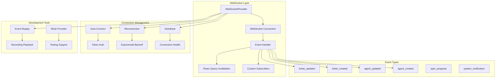
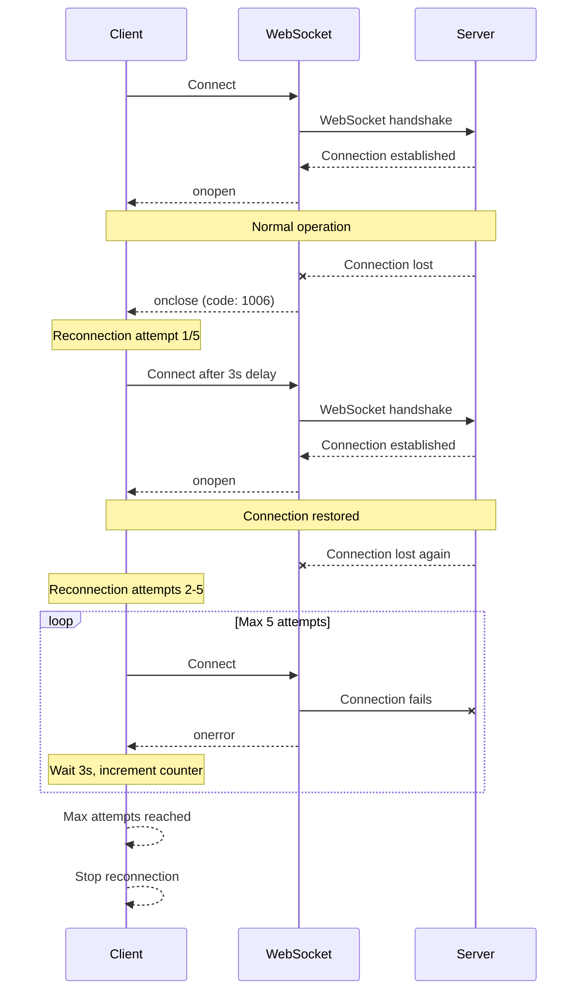

# Real-Time Events Architecture

> **Date**: 2025-07-20 | **Status**: Active | **Version**: 1.0 | **Owner**: Deep Docs Pipeline
> **Source**: Generated from codebase analysis | **Cross-links**: See Related Documents section

## Overview

The OmoiOS Real-Time Events system provides WebSocket-based live updates for agent activities, ticket changes, and system events. The architecture supports automatic reconnection, event replay for development, and React Query cache invalidation for seamless UI updates.

## Architecture



## Component Hierarchy

```
Real-Time System
├── WebSocketProvider (Context)
│   ├── Connection Manager
│   ├── Event Dispatcher
│   └── Reconnection Logic
├── useWebSocket Hook
│   └── Consumer interface
├── Event Handlers
│   ├── Ticket Event Handler
│   ├── Agent Event Handler
│   └── Custom Handlers
└── Development Tools
    ├── EventReplayProvider
    └── MockWebSocketProvider
```

## WebSocket Provider

```typescript
// frontend/providers/WebSocketProvider.tsx

interface WebSocketContextValue {
  socket: WebSocket | null;
  isConnected: boolean;
  send: (type: string, payload: any) => void;
}

const WebSocketContext = createContext<WebSocketContextValue>({
  socket: null,
  isConnected: false,
  send: () => {},
});

export function WebSocketProvider({ children }: { children: React.ReactNode }) {
  const [socket, setSocket] = useState<WebSocket | null>(null);
  const [isConnected, setIsConnected] = useState(false);
  const reconnectTimeoutRef = useRef<NodeJS.Timeout>();
  const socketRef = useRef<WebSocket | null>(null);
  const queryClient = useQueryClient();
  const replayPath = process.env.NEXT_PUBLIC_EVENT_REPLAY;

  // Event replay effect — runs when NEXT_PUBLIC_EVENT_REPLAY is set
  useEffect(() => {
    if (!replayPath) return;

    let cancelled = false;

    import("@/lib/dev/event-replay").then(async ({ EventReplayProvider, loadRecording }) => {
      if (cancelled) return;
      try {
        const recording = await loadRecording(replayPath);
        const replay = new EventReplayProvider(recording);

        // Subscribe to all events and forward to query client
        replay.subscribe("*", (event) => {
          if (event.event_type.startsWith("ticket")) {
            queryClient.invalidateQueries({ queryKey: ["tickets"] });
          }
          if (event.event_type.startsWith("agent")) {
            queryClient.invalidateQueries({ queryKey: ["agents"] });
          }
        });

        setIsConnected(true); // Simulate connection
        replay.play(1.0);
        console.log("[EventReplay] Playing recording:", replayPath);
      } catch (err) {
        console.error("[EventReplay] Failed to load recording:", err);
      }
    });

    return () => {
      cancelled = true;
    };
  }, [replayPath, queryClient]);

  // Main WebSocket connection effect
  useEffect(() => {
    if (replayPath) return; // Skip WebSocket when replaying

    let isMounted = true;
    let reconnectAttempts = 0;
    const MAX_RECONNECT_ATTEMPTS = 5;
    const RECONNECT_DELAY = 3000;

    const connect = () => {
      // Build WebSocket URL with auth token
      const apiUrl = process.env.NEXT_PUBLIC_API_URL || "http://localhost:18000";
      const baseWsUrl =
        apiUrl.replace("http://", "ws://").replace("https://", "wss://") +
        "/api/v1/ws/events";
      const token = getAccessToken();
      const wsUrl = token
        ? `${baseWsUrl}?token=${encodeURIComponent(token)}`
        : baseWsUrl;

      const ws = new WebSocket(wsUrl);

      ws.onopen = () => {
        if (!isMounted) {
          ws.close();
          return;
        }
        setIsConnected(true);
        reconnectAttempts = 0;
        console.log("WebSocket connected");
      };

      ws.onmessage = (event) => {
        if (!isMounted) return;
        try {
          const data = JSON.parse(event.data);
          if (data.type && data.payload) {
            // Invalidate React Query cache on relevant events
            if (data.type === "ticket_updated" || data.type === "ticket_created") {
              queryClient.invalidateQueries({ queryKey: ["tickets"] });
            }
            if (data.type === "agent_updated" || data.type === "agent_created") {
              queryClient.invalidateQueries({ queryKey: ["agents"] });
            }
          }
        } catch (error) {
          console.error("Failed to parse WebSocket message:", error);
        }
      };

      ws.onclose = (event) => {
        if (!isMounted) return;
        setIsConnected(false);

        // Don't reconnect if:
        // 1. Close code is 1008 (policy violation) or 1003 (forbidden) - likely auth issue
        // 2. We've exceeded max reconnect attempts
        // 3. Close code is 1000 (normal closure)
        const shouldReconnect =
          event.code !== 1008 &&
          event.code !== 1003 &&
          event.code !== 1000 &&
          event.code !== 4401 &&
          reconnectAttempts < MAX_RECONNECT_ATTEMPTS;

        if (shouldReconnect) {
          reconnectAttempts++;
          console.log(
            `WebSocket disconnected (code: ${event.code}), reconnecting in ${RECONNECT_DELAY}ms... (attempt ${reconnectAttempts}/${MAX_RECONNECT_ATTEMPTS})`
          );
          reconnectTimeoutRef.current = setTimeout(connect, RECONNECT_DELAY);
        } else {
          if (event.code === 1008 || event.code === 1003 || event.code === 4401) {
            console.warn("WebSocket connection rejected (auth required). Code:", event.code);
          } else if (reconnectAttempts >= MAX_RECONNECT_ATTEMPTS) {
            console.error("WebSocket: Max reconnect attempts reached.");
          }
        }
      };

      ws.onerror = (error) => {
        if (!isMounted) return;
        console.error("WebSocket error:", error);
      };

      socketRef.current = ws;
      setSocket(ws);
    };

    connect();

    return () => {
      isMounted = false;
      if (reconnectTimeoutRef.current) {
        clearTimeout(reconnectTimeoutRef.current);
      }
      socketRef.current?.close();
    };
  }, [queryClient, replayPath]);

  const send = (type: string, payload: any) => {
    if (socket?.readyState === WebSocket.OPEN) {
      socket.send(JSON.stringify({ type, payload }));
    }
  };

  return (
    <WebSocketContext.Provider value={{ socket, isConnected, send }}>
      {children}
    </WebSocketContext.Provider>
  );
}

export const useWebSocket = () => useContext(WebSocketContext);
```

## Hook Signatures

### useWebSocket Hook

```typescript
/**
 * Hook to access WebSocket context
 * Provides socket instance, connection status, and send function
 */
export function useWebSocket(): {
  socket: WebSocket | null;
  isConnected: boolean;
  send: (type: string, payload: any) => void;
};

// Usage example:
function AgentMonitor() {
  const { isConnected, send } = useWebSocket();

  const requestAgentStatus = (agentId: string) => {
    send("agent:status_request", { agent_id: agentId });
  };

  return (
    <div>
      <Badge variant={isConnected ? "default" : "destructive"}>
        {isConnected ? "Live" : "Disconnected"}
      </Badge>
    </div>
  );
}
```

## Event Types

### Core Event Types

```typescript
// Event type definitions

type WebSocketEventType =
  | "ticket_updated"
  | "ticket_created"
  | "ticket_deleted"
  | "agent_updated"
  | "agent_created"
  | "agent_status_changed"
  | "agent_log_output"
  | "spec_progress"
  | "spec_phase_changed"
  | "system_notification"
  | "user_mention"
  | "org_invitation";

interface WebSocketEvent {
  type: WebSocketEventType;
  payload: unknown;
  timestamp: string;
  organization_id?: string;
}

// Specific event payloads
interface TicketUpdatedEvent {
  type: "ticket_updated";
  payload: {
    ticket_id: string;
    project_id: string;
    changes: Partial<Ticket>;
    updated_by: string;
  };
}

interface AgentStatusEvent {
  type: "agent_status_changed";
  payload: {
    agent_id: string;
    sandbox_id: string;
    status: "idle" | "working" | "error" | "completed";
    progress?: number;
    message?: string;
  };
}

interface AgentLogEvent {
  type: "agent_log_output";
  payload: {
    agent_id: string;
    sandbox_id: string;
    log_line: string;
    stream: "stdout" | "stderr";
    timestamp: string;
  };
}

interface SpecProgressEvent {
  type: "spec_progress";
  payload: {
    spec_id: string;
    project_id: string;
    phase: string;
    progress: number;
    message: string;
    artifacts?: unknown[];
  };
}
```

## Event Handlers

### React Query Integration

```typescript
// Automatic cache invalidation on events

ws.onmessage = (event) => {
  if (!isMounted) return;
  try {
    const data = JSON.parse(event.data);
    if (data.type && data.payload) {
      // Ticket events
      if (data.type === "ticket_updated" || data.type === "ticket_created") {
        queryClient.invalidateQueries({ queryKey: ["tickets"] });
        
        // Also invalidate specific ticket if ID provided
        if (data.payload.ticket_id) {
          queryClient.invalidateQueries({
            queryKey: ["tickets", data.payload.ticket_id],
          });
        }
        
        // Invalidate project tickets
        if (data.payload.project_id) {
          queryClient.invalidateQueries({
            queryKey: ["projects", data.payload.project_id, "tickets"],
          });
        }
      }

      // Agent events
      if (data.type === "agent_updated" || data.type === "agent_created") {
        queryClient.invalidateQueries({ queryKey: ["agents"] });
        
        if (data.payload.agent_id) {
          queryClient.invalidateQueries({
            queryKey: ["agents", data.payload.agent_id],
          });
        }
      }

      // Spec events
      if (data.type.startsWith("spec_")) {
        queryClient.invalidateQueries({ queryKey: ["specs"] });
        
        if (data.payload.spec_id) {
          queryClient.invalidateQueries({
            queryKey: ["specs", data.payload.spec_id],
          });
        }
      }
    }
  } catch (error) {
    console.error("Failed to parse WebSocket message:", error);
  }
};
```

### Custom Event Subscribers

```typescript
// Pattern for custom event subscription hook

export function useAgentEvents(agentId: string) {
  const { socket, isConnected } = useWebSocket();
  const [logs, setLogs] = useState<AgentLog[]>([]);
  const [status, setStatus] = useState<AgentStatus>("idle");

  useEffect(() => {
    if (!socket || !isConnected) return;

    const handleMessage = (event: MessageEvent) => {
      try {
        const data = JSON.parse(event.data);
        
        // Filter for this agent's events
        if (data.payload?.agent_id !== agentId) return;

        switch (data.type) {
          case "agent_status_changed":
            setStatus(data.payload.status);
            break;
          case "agent_log_output":
            setLogs((prev) => [...prev, {
              line: data.payload.log_line,
              stream: data.payload.stream,
              timestamp: data.payload.timestamp,
            }]);
            break;
        }
      } catch (error) {
        console.error("Failed to handle agent event:", error);
      }
    };

    socket.addEventListener("message", handleMessage);
    return () => socket.removeEventListener("message", handleMessage);
  }, [socket, isConnected, agentId]);

  return { logs, status, isConnected };
}
```

## Reconnection Strategy



### Reconnection Configuration

```typescript
// Reconnection constants
const RECONNECTION_CONFIG = {
  MAX_ATTEMPTS: 5,
  INITIAL_DELAY: 3000, // 3 seconds
  MAX_DELAY: 30000,    // 30 seconds
  BACKOFF_MULTIPLIER: 1.5,
};

// Close codes that should not trigger reconnection
const NON_RECOVERABLE_CLOSE_CODES = [
  1000, // Normal closure
  1008, // Policy violation (auth issue)
  1003, // Forbidden
  4401, // Custom: Unauthorized
];

function shouldReconnect(closeCode: number, attempts: number): boolean {
  if (NON_RECOVERABLE_CLOSE_CODES.includes(closeCode)) {
    return false;
  }
  return attempts < RECONNECTION_CONFIG.MAX_ATTEMPTS;
}

function getReconnectDelay(attempts: number): number {
  const delay = RECONNECTION_CONFIG.INITIAL_DELAY * 
    Math.pow(RECONNECTION_CONFIG.BACKOFF_MULTIPLIER, attempts - 1);
  return Math.min(delay, RECONNECTION_CONFIG.MAX_DELAY);
}
```

## Event Replay System

```typescript
// Development tool for replaying recorded events

interface EventRecording {
  version: string;
  recorded_at: string;
  events: RecordedEvent[];
}

interface RecordedEvent {
  type: string;
  payload: unknown;
  delay_ms: number; // Delay from start of recording
}

class EventReplayProvider {
  private recording: EventRecording;
  private subscribers: Map<string, ((event: RecordedEvent) => void)[]> = new Map();
  private isPlaying = false;
  private abortController: AbortController | null = null;

  constructor(recording: EventRecording) {
    this.recording = recording;
  }

  subscribe(eventType: string, callback: (event: RecordedEvent) => void): () => void {
    if (!this.subscribers.has(eventType)) {
      this.subscribers.set(eventType, []);
    }
    this.subscribers.get(eventType)!.push(callback);

    return () => {
      const callbacks = this.subscribers.get(eventType);
      if (callbacks) {
        const index = callbacks.indexOf(callback);
        if (index > -1) callbacks.splice(index, 1);
      }
    };
  }

  async play(speedMultiplier: number = 1.0): Promise<void> {
    if (this.isPlaying) return;
    this.isPlaying = true;
    this.abortController = new AbortController();

    let lastDelay = 0;

    for (const event of this.recording.events) {
      if (this.abortController.signal.aborted) break;

      // Wait for the delay (adjusted by speed)
      const waitTime = (event.delay_ms - lastDelay) / speedMultiplier;
      if (waitTime > 0) {
        await new Promise((resolve) => setTimeout(resolve, waitTime));
      }
      lastDelay = event.delay_ms;

      // Dispatch to subscribers
      const callbacks = this.subscribers.get(event.type) || [];
      const wildcardCallbacks = this.subscribers.get("*") || [];
      
      [...callbacks, ...wildcardCallbacks].forEach((cb) => {
        try {
          cb(event);
        } catch (error) {
          console.error("Event replay subscriber error:", error);
        }
      });
    }

    this.isPlaying = false;
  }

  stop(): void {
    this.abortController?.abort();
    this.isPlaying = false;
  }
}

// Usage in WebSocketProvider
if (replayPath) {
  const recording = await loadRecording(replayPath);
  const replay = new EventReplayProvider(recording);
  
  replay.subscribe("*", (event) => {
    // Handle replayed events same as real events
    if (event.type.startsWith("ticket")) {
      queryClient.invalidateQueries({ queryKey: ["tickets"] });
    }
  });
  
  replay.play(1.0);
}
```

## Connection Status UI

```typescript
// Connection status indicator component

export function ConnectionStatus() {
  const { isConnected } = useWebSocket();

  return (
    <TooltipProvider>
      <Tooltip>
        <TooltipTrigger asChild>
          <div className="flex items-center gap-2">
            <div
              className={cn(
                "h-2 w-2 rounded-full",
                isConnected ? "bg-green-500" : "bg-red-500"
              )}
            />
            <span className="text-xs text-muted-foreground">
              {isConnected ? "Connected" : "Disconnected"}
            </span>
          </div>
        </TooltipTrigger>
        <TooltipContent>
          <p>
            {isConnected
              ? "Real-time updates are active"
              : "Reconnecting to server..."}
          </p>
        </TooltipContent>
      </Tooltip>
    </TooltipProvider>
  );
}
```

## Provider Integration

```typescript
// Root layout with WebSocket provider

export default function RootLayout({ children }: { children: React.ReactNode }) {
  return (
    <QueryProvider>
      <WebSocketProvider>
        <AuthProvider>
          <ThemeProvider>
            {children}
          </ThemeProvider>
        </AuthProvider>
      </WebSocketProvider>
    </QueryProvider>
  );
}
```

## Related Documents

- [Agent System](../../architecture/02-execution-system.md) - Agent event sources
- [Backend Real-Time Events](../../architecture/06-realtime-events.md) - Server-side implementation
- [Project Management](./project_management_dashboard.md) - Ticket update events
- [Onboarding Flow](./onboarding_flow.md) - Real-time spec progress

## Security Considerations

1. **Token Authentication**: WebSocket connections require valid JWT token
2. **Organization Isolation**: Events filtered by user's organizations
3. **Rate Limiting**: Backend enforces message rate limits
4. **Input Validation**: All payloads validated server-side
5. **Connection Limits**: Max connections per user enforced

## Testing Strategy

| Test Type | Coverage | Key Scenarios |
|-----------|----------|---------------|
| Unit | Event handlers | Message parsing, dispatch |
| Integration | Reconnection | Disconnect, reconnect, message queue |
| E2E | Real-time updates | Ticket change → UI update |
| Load | Connection limits | Many concurrent connections |
