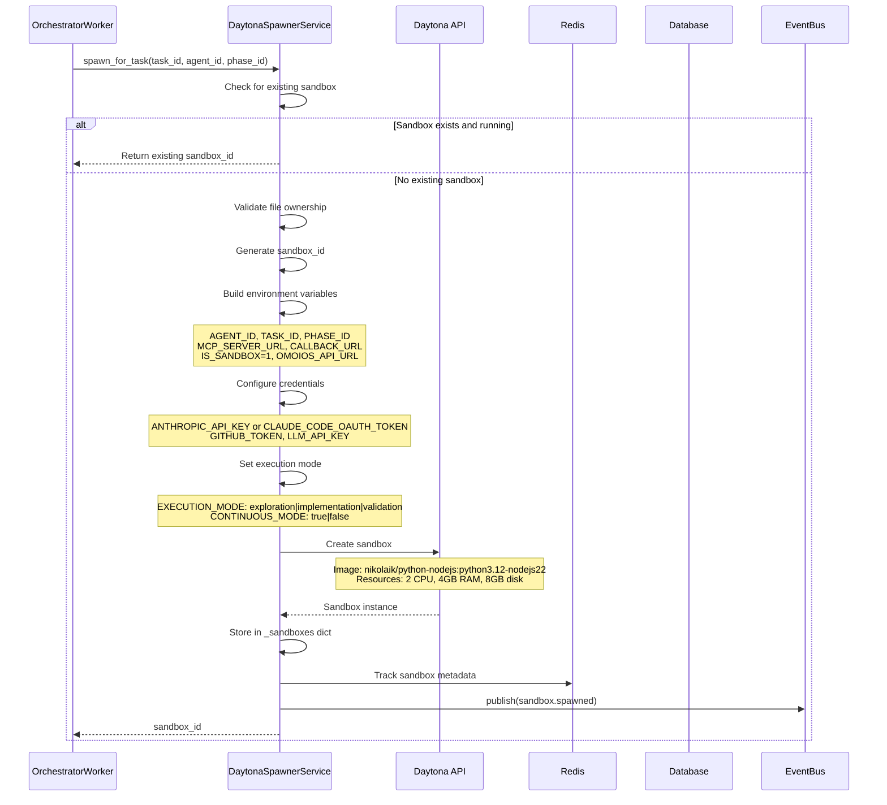
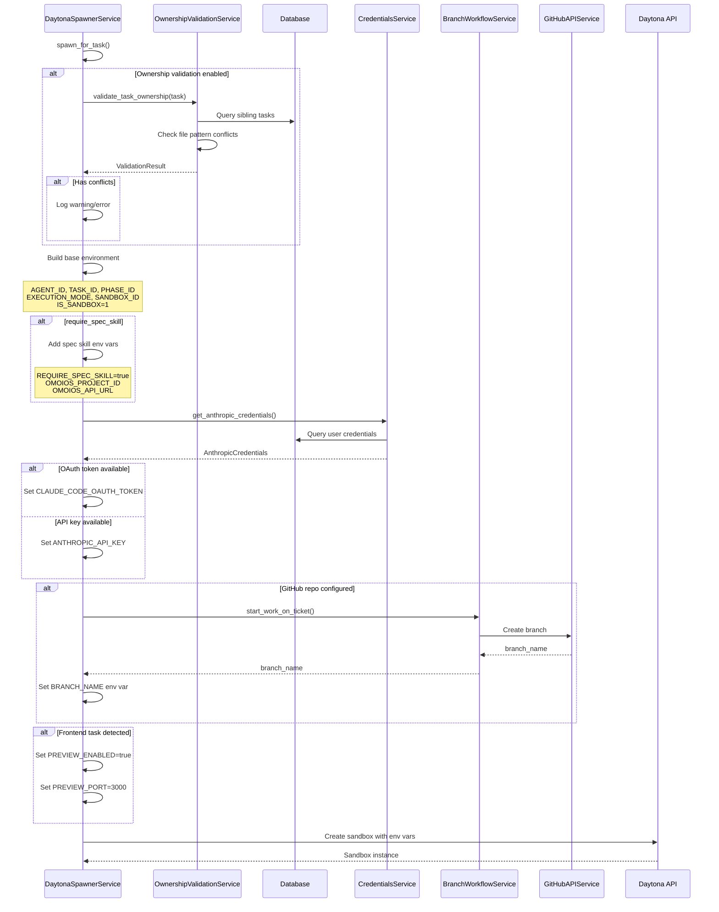
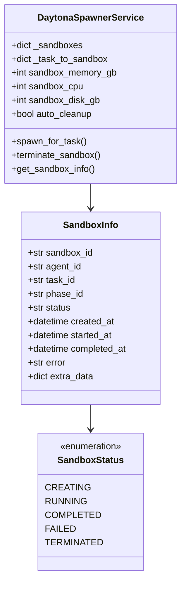
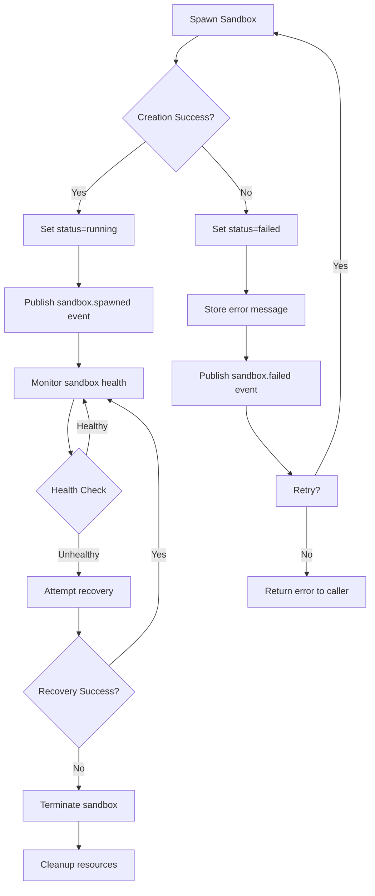

# Daytona Sandbox Integration Design

> **Date**: 2025-07-20 | **Status**: Active | **Version**: 1.0 | **Owner**: Deep Docs Pipeline
> **Source**: Generated from codebase analysis | **Cross-links**: See Related Documents section

## Overview

The Daytona sandbox integration provides isolated execution environments for agent tasks. The spawner service manages the full lifecycle of sandboxes including creation, configuration, monitoring, and cleanup. Each agent runs in its own Daytona container with dedicated resources and environment variables.

## Architecture



## Service Interface (backend/omoi_os/services/daytona_spawner.py)

```python
class DaytonaSpawnerService:
    def __init__(
        self,
        db: Optional[DatabaseService] = None,
        event_bus: Optional[EventBusService] = None,
        mcp_server_url: str = "http://localhost:18000/mcp/",
        daytona_api_key: Optional[str] = None,
        daytona_api_url: str = "https://app.daytona.io/api",
        sandbox_image: Optional[str] = "nikolaik/python-nodejs:python3.12-nodejs22",
        sandbox_snapshot: Optional[str] = None,
        auto_cleanup: bool = True,
        sandbox_memory_gb: int = 4,
        sandbox_cpu: int = 2,
        sandbox_disk_gb: int = 8,
    )
    
    async def spawn_for_task(
        self,
        task_id: str,
        agent_id: str,
        phase_id: str,
        agent_type: Optional[str] = None,
        extra_env: Optional[Dict[str, str]] = None,
        labels: Optional[Dict[str, str]] = None,
        runtime: str = "openhands",  # "openhands" or "claude"
        execution_mode: str = "implementation",
        continuous_mode: Optional[bool] = None,
        task_requirements: Optional["TaskRequirements"] = None,
        require_spec_skill: bool = False,
        project_id: Optional[str] = None,
        omoios_api_key: Optional[str] = None,
    ) -> str
    
    async def spawn_for_phase(
        self,
        spec_id: str,
        phase: str,
        project_id: str,
        phase_context: Optional[Dict[str, Any]] = None,
        resume_transcript: Optional[str] = None,
        extra_env: Optional[Dict[str, str]] = None,
    ) -> str
    
    def get_sandbox_info(self, sandbox_id: str) -> Optional[SandboxInfo]
    async def terminate_sandbox(self, sandbox_id: str) -> bool
    async def cleanup_all_sandboxes(self) -> None
```

## Sandbox Provisioning Flow



## Resource Management



### Resource Limits

| Resource | Default | Maximum | Configurable |
|----------|---------|---------|--------------|
| CPU Cores | 2 | 4 | Yes (sandbox_cpu) |
| Memory | 4 GB | 8 GB | Yes (sandbox_memory_gb) |
| Disk | 8 GB | 10 GB | Yes (sandbox_disk_gb) |
| Auto-cleanup | Enabled | - | Yes (auto_cleanup) |

```python
# backend/omoi_os/services/daytona_spawner.py:131-133
# Override resource limits from config file
self.sandbox_memory_gb = min(daytona_settings.sandbox_memory_gb, 8)
self.sandbox_cpu = min(daytona_settings.sandbox_cpu, 4)
self.sandbox_disk_gb = min(daytona_settings.sandbox_disk_gb, 10)
```

## Error Recovery



## Configuration

```yaml
# config/base.yaml
daytona:
  api_url: "https://app.daytona.io/api"
  api_key: "${DAYTONA_API_KEY}"
  image: "nikolaik/python-nodejs:python3.12-nodejs22"
  snapshot: null  # Optional: use snapshot instead of image
  
  # Resource defaults
  sandbox_memory_gb: 4
  sandbox_cpu: 2
  sandbox_disk_gb: 8
  
  # Behavior
  auto_cleanup: true
```

```bash
# .env
DAYTONA_API_KEY=day_...
```

## Environment Variables

### Core Variables

| Variable | Description | Example |
|----------|-------------|---------|
| `AGENT_ID` | Unique agent identifier | `agent-abc123` |
| `TASK_ID` | Task being executed | `task-def456` |
| `PHASE_ID` | Current workflow phase | `PHASE_IMPLEMENTATION` |
| `SANDBOX_ID` | Sandbox identifier | `omoios-task-abc` |
| `EXECUTION_MODE` | Skill loading mode | `exploration`, `implementation`, `validation` |
| `IS_SANDBOX` | Sandbox flag | `1` |

### API Configuration

| Variable | Description | Example |
|----------|-------------|---------|
| `MCP_SERVER_URL` | MCP server endpoint | `http://host:18000/mcp/` |
| `CALLBACK_URL` | API base URL | `http://host:18000` |
| `OMOIOS_API_URL` | OmoiOS API URL | `http://host:18000` |
| `OMOIOS_API_KEY` | Authentication token | `jwt_token_xxx` |
| `OMOIOS_PROJECT_ID` | Project identifier | `proj-ghi789` |

### Authentication

| Variable | Description | Source |
|----------|-------------|--------|
| `ANTHROPIC_API_KEY` | Claude API key | CredentialsService |
| `CLAUDE_CODE_OAUTH_TOKEN` | Claude OAuth token | CredentialsService (preferred) |
| `GITHUB_TOKEN` | GitHub access token | User attributes |
| `LLM_API_KEY` | Generic LLM API key | Settings |

### Execution Control

| Variable | Description | Values |
|----------|-------------|--------|
| `CONTINUOUS_MODE` | Enable continuous iteration | `true`, `false` |
| `MAX_ITERATIONS` | Max iteration limit | `10` |
| `MAX_TOTAL_COST_USD` | Cost limit | `20.0` |
| `MAX_DURATION_SECONDS` | Time limit | `3600` |
| `REQUIRE_SPEC_SKILL` | Enforce spec skill | `true`, `false` |

### Git Workflow

| Variable | Description | Example |
|----------|-------------|---------|
| `REQUIRE_CLEAN_GIT` | Require clean git state | `true`, `false` |
| `REQUIRE_CODE_PUSHED` | Require code push | `true`, `false` |
| `REQUIRE_PR_CREATED` | Require PR creation | `true`, `false` |
| `BRANCH_NAME` | Git branch name | `feature/ticket-123` |
| `GITHUB_REPO` | Repository | `owner/repo` |

### Preview (Frontend Tasks)

| Variable | Description | Example |
|----------|-------------|---------|
| `PREVIEW_ENABLED` | Enable live preview | `true` |
| `PREVIEW_PORT` | Dev server port | `3000` |

## Error Handling

| Error Scenario | Handling | Recovery |
|----------------|----------|----------|
| Daytona API unavailable | Log error, raise RuntimeError | Retry with backoff |
| Sandbox creation timeout | Mark as failed, cleanup | Retry once, then fail |
| Invalid credentials | Log warning, continue without auth | Prompt user to configure |
| Resource limit exceeded | Log error, use defaults | Notify user |
| Ownership conflict | Log warning or error | Manual resolution |
| Branch creation failed | Log warning, continue | Sandbox creates branch |
| Preview setup failed | Log warning, continue without preview | Best effort |

## Testing Strategy

```python
# Unit test: Sandbox creation
async def test_spawn_sandbox():
    spawner = DaytonaSpawnerService(
        db=mock_db,
        event_bus=mock_event_bus,
        daytona_api_key="test_key"
    )
    
    sandbox_id = await spawner.spawn_for_task(
        task_id="task-123",
        agent_id="agent-456",
        phase_id="PHASE_IMPLEMENTATION",
        runtime="claude",
        execution_mode="implementation"
    )
    
    assert sandbox_id.startswith("omoios-task-123")
    
    info = spawner.get_sandbox_info(sandbox_id)
    assert info.status == "running"
    assert info.task_id == "task-123"

# Unit test: Environment variable building
async def test_env_var_building():
    spawner = DaytonaSpawnerService(db=mock_db)
    
    # Mock the internal method
    env_vars = spawner._build_env_vars(
        task_id="task-123",
        agent_id="agent-456",
        execution_mode="implementation",
        require_spec_skill=True,
        project_id="proj-789"
    )
    
    assert env_vars["TASK_ID"] == "task-123"
    assert env_vars["EXECUTION_MODE"] == "implementation"
    assert env_vars["REQUIRE_SPEC_SKILL"] == "true"
    assert env_vars["OMOIOS_PROJECT_ID"] == "proj-789"
    assert env_vars["IS_SANDBOX"] == "1"

# Integration test: Full spawn and terminate
async def test_sandbox_lifecycle():
    spawner = DaytonaSpawnerService(
        db=real_db,
        event_bus=real_event_bus,
        daytona_api_key=os.getenv("DAYTONA_API_KEY")
    )
    
    # Create
    sandbox_id = await spawner.spawn_for_task(
        task_id="test-task",
        agent_id="test-agent",
        phase_id="PHASE_TEST"
    )
    
    # Verify
    info = spawner.get_sandbox_info(sandbox_id)
    assert info is not None
    
    # Terminate
    result = await spawner.terminate_sandbox(sandbox_id)
    assert result is True
```

## Monitoring & Observability

```python
# Comprehensive logging
logger.info(
    "[SPAWNER] spawn_for_task called",
    extra={
        "task_id": task_id,
        "agent_id": agent_id,
        "phase_id": phase_id,
        "runtime": runtime,
        "execution_mode": execution_mode,
        "continuous_mode": continuous_mode,
        "require_spec_skill": require_spec_skill,
        "project_id": project_id,
    }
)

# Event publishing
self.event_bus.publish(
    SystemEvent(
        event_type="sandbox.spawned",
        entity_type="sandbox",
        entity_id=sandbox_id,
        payload={
            "sandbox_id": sandbox_id,
            "task_id": task_id,
            "agent_id": agent_id,
            "phase_id": phase_id,
        }
    )
)
```

## Related Documents

- Agent Execution
- Sandbox Provider
- Branch Workflow
- Credentials Management
- Preview System
