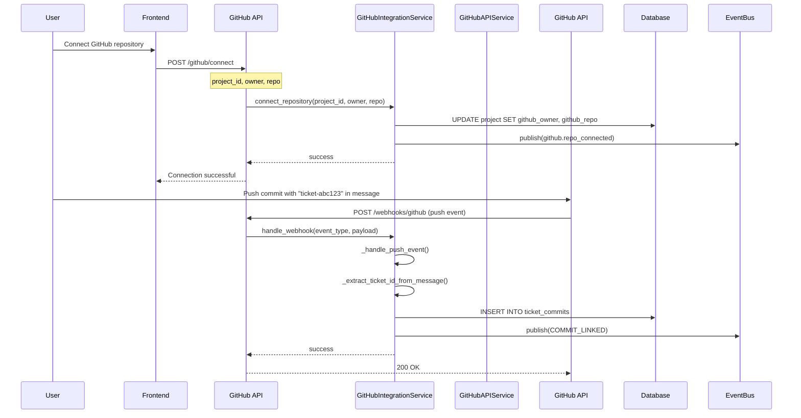
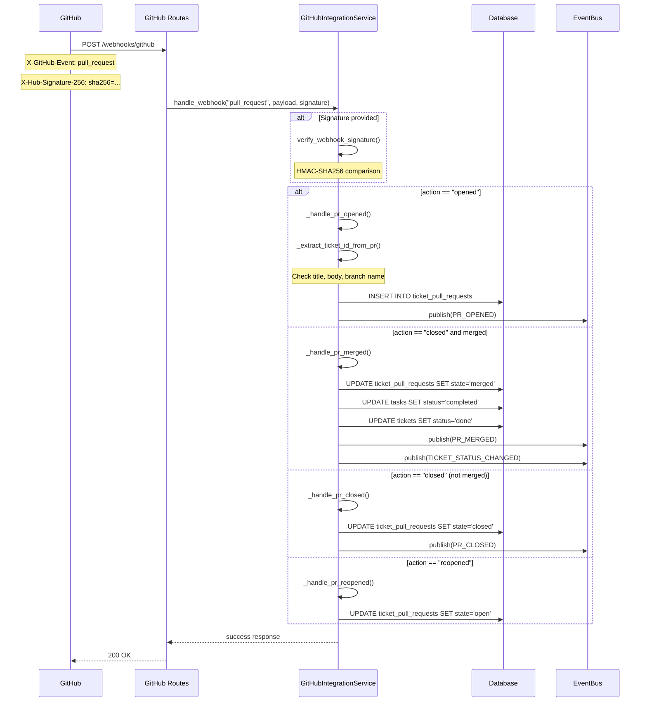

# GitHub Integration Design

> **Date**: 2025-07-20 | **Status**: Active | **Version**: 1.0 | **Owner**: Deep Docs Pipeline
> **Source**: Generated from codebase analysis | **Cross-links**: See Related Documents section

## Overview

The GitHub integration provides comprehensive repository management capabilities including repository operations, PR creation, issue tracking, webhook handling, and rate limiting. The system uses OAuth tokens for authentication and supports both user-level and organization-level operations.

## Architecture



## API Surface

### GitHub Routes (backend/omoi_os/api/routes/github.py)

| Endpoint | Method | Description |
|----------|--------|-------------|
| `/github/connect` | POST | Connect repository to project |
| `/github/connected` | GET | List connected repositories |
| `/github/sync` | POST | Manual sync with repository |
| `/github/webhooks/github` | POST | GitHub webhook handler |

### GitHubIntegrationService (backend/omoi_os/services/github_integration.py)

```python
class GitHubIntegrationService:
    def verify_webhook_signature(self, payload_body, signature, secret) -> bool
    async def handle_webhook(self, event_type, payload, signature, secret) -> dict
    async def connect_repository(self, project_id, owner, repo, webhook_secret) -> dict
    async def fetch_commit_diff(self, owner, repo, commit_sha) -> Optional[dict]
```

### GitHubAPIService (backend/omoi_os/services/github_api.py)

```python
class GitHubAPIService:
    # Repository Operations
    async def list_user_repos(self, user_id, visibility, sort, per_page) -> list[GitHubRepo]
    async def get_repo(self, user_id, owner, repo) -> Optional[GitHubRepo]
    
    # Branch Operations
    async def list_branches(self, user_id, owner, repo) -> list[GitHubBranch]
    async def create_branch(self, user_id, owner, repo, branch_name, from_sha) -> BranchCreateResult
    
    # File Operations
    async def get_file_content(self, user_id, owner, repo, path, ref) -> Optional[GitHubFile]
    async def list_directory(self, user_id, owner, repo, path, ref) -> list[DirectoryItem]
    async def get_tree(self, user_id, owner, repo, tree_sha, recursive) -> list[TreeItem]
    async def create_or_update_file(self, user_id, owner, repo, path, content, message, branch, sha) -> FileOperationResult
    
    # Commit Operations
    async def list_commits(self, user_id, owner, repo, sha, path, per_page) -> list[GitHubCommit]
    
    # Pull Request Operations
    async def create_pull_request(self, user_id, owner, repo, title, head, base, body, draft) -> PullRequestCreateResult
    async def list_pull_requests(self, user_id, owner, repo, state, per_page) -> list[GitHubPullRequest]
    async def get_pull_request(self, user_id, owner, repo, pr_number) -> Optional[GitHubPullRequest]
    async def merge_pull_request(self, user_id, owner, repo, pr_number, merge_method) -> MergeResult
    
    # Branch Comparison
    async def compare_branches(self, user_id, owner, repo, base, head) -> Optional[BranchComparison]
    async def delete_branch(self, user_id, owner, repo, branch_name) -> bool
```

## PR Creation Flow

```mermaid
sequenceDiagram
    participant Sandbox as Agent Sandbox
    participant GitHubAPI as GitHubAPIService
    participant GitHub as GitHub API
    participant DB as Database

    Sandbox->>GitHubAPI: create_pull_request(
        user_id, owner, repo,
        title="[ticket-abc123] Add feature",
        head="feature/ticket-abc123",
        base="main",
        body="Closes ticket-abc123"
    )
    
    GitHubAPI->>GitHubAPI: _get_user_token_by_id()
    GitHubAPI->>DB: Get user.attributes["github_access_token"]
    DB-->>GitHubAPI: OAuth token
    
    GitHubAPI->>GitHub: POST /repos/{owner}/{repo}/pulls
    Note over GitHub: Authorization: Bearer {token}
    Note over GitHub: title, head, base, body, draft
    
    GitHub-->>GitHubAPI: 201 Created
    Note over GitHub: number, html_url, state
    
    GitHubAPI->>GitHubAPI: Create PullRequestCreateResult
    GitHubAPI-->>Sandbox: success, number, html_url
```

## Webhook Event Handling



## Ticket ID Extraction

```mermaid
flowchart TD
    A[Extract Ticket ID from PR] --> B{Check PR Title}
    B -->|Pattern: [ticket-xxx]| C[Extract from brackets]
    B -->|No match| D{Check PR Body}
    D -->|Pattern: Closes ticket-xxx| E[Extract from keyword]
    D -->|No match| F{Check Branch Name}
    F -->|Pattern: feature/ticket-xxx| G[Extract from branch]
    F -->|No match| H[No ticket ID found]
    C --> I[Return ticket ID]
    E --> I
    G --> I
```

```python
# backend/omoi_os/services/github_integration.py:648-732
def _extract_ticket_id_from_pr(self, title: str, body: str, branch: str) -> Optional[str]:
    # Pattern 1: [ticket-{uuid}] in title
    title_bracket_pattern = r"\[ticket-([a-f0-9-]+)\]"
    match = re.search(title_bracket_pattern, title, re.IGNORECASE)
    if match:
        ticket_id = match.group(1)
        if len(ticket_id) == 36:
            return ticket_id
        return f"ticket-{ticket_id}"
    
    # Pattern 2: "Closes ticket-xxx" in body
    closes_pattern = r"(?:closes?|fixes?|resolves?)\s+(?:#)?ticket-([a-f0-9-]+)"
    match = re.search(closes_pattern, body, re.IGNORECASE)
    if match:
        ticket_id = match.group(1)
        if len(ticket_id) == 36:
            return ticket_id
        return f"ticket-{ticket_id}"
    
    # Pattern 3: branch name contains ticket-xxx
    branch_pattern = r"(?:^|/)ticket-([a-f0-9-]+)"
    match = re.search(branch_pattern, branch, re.IGNORECASE)
    if match:
        ticket_id = match.group(1)
        parts = ticket_id.split("-")
        if len(parts) >= 5 and len(parts[0]) == 8:
            return "-".join(parts[:5])  # UUID format
        return f"ticket-{parts[0]}"
    
    return None
```

## Rate Limiting

The GitHub API implements rate limiting. The service handles this through:

1. **Token-based authentication**: Uses OAuth tokens with higher rate limits (5000 requests/hour)
2. **Pagination control**: Fetches all pages with safety limits
3. **Error handling**: Catches 403/429 errors and provides meaningful messages

```python
# backend/omoi_os/services/github_api.py:233-362
async def list_user_repos(self, user_id, ..., fetch_all_pages=True) -> list[GitHubRepo]:
    token = self._get_user_token_by_id(user_id)
    if not token:
        return []
    
    all_repos = []
    current_page = page
    max_pages = 50  # Safety limit
    
    async with httpx.AsyncClient() as client:
        while current_page <= max_pages:
            response = await client.get(
                f"{self.BASE_URL}/user/repos",
                headers=self._headers(token),
                params={"per_page": per_page, "page": current_page}
            )
            
            if response.status_code in (401, 403):
                raise ValueError(
                    f"GitHub API authentication failed: {response.status_code}. "
                    f"Token may be invalid or expired."
                )
            
            repos = response.json()
            if not repos:
                break
            
            all_repos.extend([GitHubRepo(...) for r in repos])
            
            # Check for more pages
            link_header = response.headers.get("Link", "")
            has_more = 'rel="next"' in link_header
            
            if not fetch_all_pages or not has_more:
                break
            
            current_page += 1
    
    return all_repos
```

## Security Considerations

### Webhook Signature Verification

```python
# backend/omoi_os/services/github_integration.py:59-91
def verify_webhook_signature(self, payload_body: bytes, signature: str, secret: str) -> bool:
    if not signature or not secret:
        return False
    
    # GitHub sends signature as "sha256=<hash>"
    if not signature.startswith("sha256="):
        return False
    
    expected_signature = signature[7:]  # Remove "sha256=" prefix
    
    # Calculate HMAC
    mac = hmac.new(
        secret.encode("utf-8"),
        msg=payload_body,
        digestmod=hashlib.sha256,
    )
    calculated_signature = mac.hexdigest()
    
    # Constant-time comparison to prevent timing attacks
    return hmac.compare_digest(expected_signature, calculated_signature)
```

### OAuth Token Storage

```python
# backend/omoi_os/services/github_api.py:204-223
def _get_user_token(self, user: User) -> Optional[str]:
    """Get GitHub access token from user attributes."""
    attrs = user.attributes or {}
    return attrs.get("github_access_token")

def _get_user_token_by_id(self, user_id: UUID) -> Optional[str]:
    """Get GitHub access token by user ID."""
    with self.db.get_session() as session:
        user = session.get(User, user_id)
        if user:
            _ = user.attributes  # Force load
            token = self._get_user_token(user)
            if not token:
                logger.debug(f"No GitHub token found for user {user_id}")
            return token
    return None
```

## Configuration

```yaml
# config/base.yaml
integrations:
  github:
    enabled: true
    webhook_secret: "${GITHUB_WEBHOOK_SECRET}"
    api_base: "https://api.github.com"
```

```bash
# .env
GITHUB_TOKEN=ghp_...  # For system operations
GITHUB_WEBHOOK_SECRET=whsec_...  # For webhook verification
```

## Database Schema

```sql
-- Project GitHub connection
CREATE TABLE projects (
    id UUID PRIMARY KEY,
    name VARCHAR(255) NOT NULL,
    github_connected BOOLEAN DEFAULT FALSE,
    github_owner VARCHAR(255),
    github_repo VARCHAR(255),
    github_webhook_secret VARCHAR(255),
    -- ... other fields
);

-- Ticket commits (linked from webhooks)
CREATE TABLE ticket_commits (
    id VARCHAR(255) PRIMARY KEY,
    ticket_id UUID REFERENCES tickets(id),
    agent_id VARCHAR(255),
    commit_sha VARCHAR(40) NOT NULL,
    commit_message TEXT,
    commit_timestamp TIMESTAMP,
    files_changed INTEGER,
    insertions INTEGER,
    deletions INTEGER,
    files_list JSONB,
    link_method VARCHAR(50) DEFAULT 'webhook',
    created_at TIMESTAMP DEFAULT NOW()
);

-- Ticket pull requests
CREATE TABLE ticket_pull_requests (
    id VARCHAR(255) PRIMARY KEY,
    ticket_id UUID REFERENCES tickets(id),
    pr_number INTEGER NOT NULL,
    pr_title VARCHAR(500),
    pr_body TEXT,
    head_branch VARCHAR(255),
    base_branch VARCHAR(255),
    repo_owner VARCHAR(255),
    repo_name VARCHAR(255),
    state VARCHAR(50) DEFAULT 'open',
    html_url VARCHAR(500),
    github_user VARCHAR(255),
    merge_commit_sha VARCHAR(40),
    merged_at TIMESTAMP,
    closed_at TIMESTAMP,
    created_at TIMESTAMP DEFAULT NOW()
);

-- User OAuth tokens (stored in user.attributes JSONB)
-- { "github_access_token": "gho_xxx", "github_username": "octocat" }
```

## Error Handling

| Error Scenario | HTTP Status | Handling |
|----------------|-------------|----------|
| Invalid webhook signature | 401 | Reject request, log error |
| GitHub API 404 | 404 | Return None or empty list |
| GitHub API 401/403 | 401 | Prompt user to reconnect GitHub |
| Rate limit exceeded | 429 | Backoff and retry, or queue for later |
| Token expired | 401 | Refresh token or prompt re-auth |
| Repository not found | 404 | Verify owner/repo name |
| Merge conflict | 409 | Return conflict error, manual resolution |

## Testing Strategy

```python
# Unit test: Webhook signature verification
def test_webhook_signature_verification():
    service = GitHubIntegrationService(db, event_bus)
    
    payload = b'{"action": "opened", "number": 1}'
    secret = "test_secret"
    
    # Generate valid signature
    mac = hmac.new(secret.encode(), payload, hashlib.sha256)
    signature = f"sha256={mac.hexdigest()}"
    
    assert service.verify_webhook_signature(payload, signature, secret) is True
    assert service.verify_webhook_signature(payload, "invalid", secret) is False

# Unit test: Ticket ID extraction
def test_extract_ticket_id():
    service = GitHubIntegrationService(db, event_bus)
    
    # From title
    ticket_id = service._extract_ticket_id_from_pr(
        "[ticket-abc123] Add feature", "", ""
    )
    assert ticket_id == "ticket-abc123"
    
    # From body
    ticket_id = service._extract_ticket_id_from_pr(
        "Add feature", "Closes ticket-abc123", ""
    )
    assert ticket_id == "ticket-abc123"
    
    # From branch
    ticket_id = service._extract_ticket_id_from_pr(
        "Add feature", "", "feature/ticket-abc123-description"
    )
    assert ticket_id == "ticket-abc123"

# Integration test: PR creation
async def test_create_pull_request():
    github_api = GitHubAPIService(db)
    
    result = await github_api.create_pull_request(
        user_id=user_id,
        owner="test-org",
        repo="test-repo",
        title="[ticket-123] Test PR",
        head="feature-branch",
        base="main",
        body="Test description"
    )
    
    assert result.success is True
    assert result.number is not None
    assert result.html_url is not None
```

## Related Documents

- Git Operations
- Branch Workflow
- [OAuth Integration](./oauth.md)
- Webhook Security
