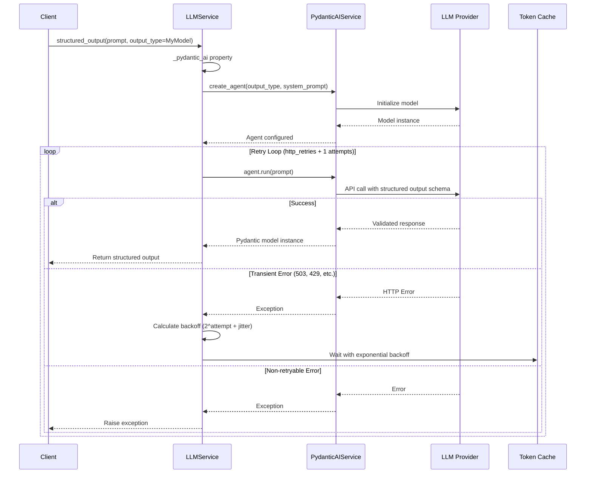
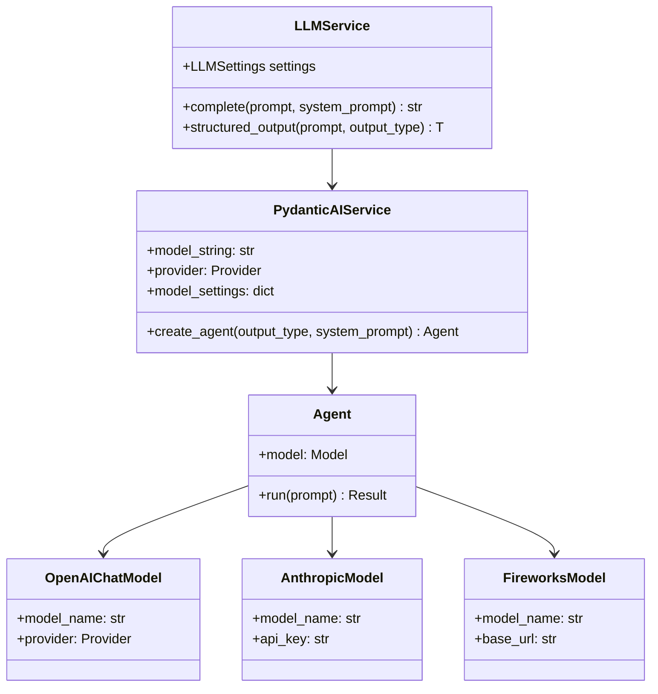
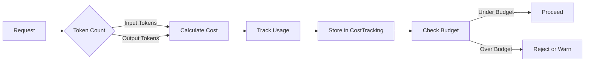
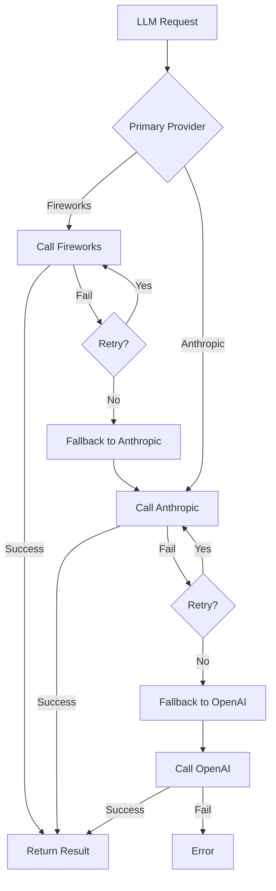
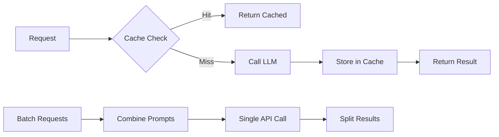

# LLM Provider Integration Design

> **Date**: 2025-07-20 | **Status**: Active | **Version**: 1.0 | **Owner**: Deep Docs Pipeline
> **Source**: Generated from codebase analysis | **Cross-links**: See Related Documents section

## Overview

The LLM provider integration provides a unified interface for calling multiple LLM providers (OpenAI, Anthropic, Fireworks) with support for both simple text completion and structured outputs using Pydantic models. The service includes automatic retry logic with exponential backoff for transient errors.

## Architecture



## Service Interface (backend/omoi_os/services/llm_service.py)

```python
class LLMService:
    def __init__(self, settings: Optional[LLMSettings] = None)
    
    async def complete(
        self, 
        prompt: str, 
        system_prompt: Optional[str] = None, 
        **kwargs
    ) -> str
    
    async def structured_output(
        self,
        prompt: str,
        output_type: type[T],
        system_prompt: Optional[str] = None,
        output_retries: int = 5,
        http_retries: int = 3,
        **kwargs,
    ) -> T

def get_llm_service(settings: Optional[LLMSettings] = None) -> LLMService
def reset_llm_service() -> None
```

## Multi-Provider Abstraction



## Structured Output Flow

```mermaid
sequenceDiagram
    participant Caller
    participant LLM as LLMService
    participant Agent as PydanticAI Agent
    participant Model as OpenAIChatModel
    participant Provider as Fireworks/OpenAI

    Caller->>Caller: Define Pydantic Model
    Note over Caller: class Analysis(BaseModel):<br/>    sentiment: str<br/>    confidence: float
    
    Caller->>LLM: structured_output(<br/>    "Analyze: I love this!",<br/>    output_type=Analysis<br/>)
    
    LLM->>Agent: create_agent(
        output_type=Analysis,
        output_retries=5
    )
    
    Agent->>Agent: Configure result validator
    Note over Agent: Validates output against<br/>Pydantic model schema
    
    Agent->>Model: Initialize with settings
    Model->>Provider: Configure provider
    
    loop HTTP Retry Loop (max 4 attempts)
        Agent->>Provider: POST /chat/completions
        Note over Provider: JSON schema in<br/>response_format
        
        alt Success 200
            Provider-->>Agent: JSON matching schema
            Agent->>Agent: Validate with Pydantic
            Agent-->>LLM: Analysis(sentiment="positive", confidence=0.95)
        else Rate Limit 429
            Provider-->>Agent: 429 Too Many Requests
            Agent-->>LLM: Exception
            LLM->>LLM: Backoff 1s + jitter
        else Server Error 503
            Provider-->>Agent: 503 Service Unavailable
            Agent-->>LLM: Exception
            LLM->>LLM: Backoff 2s + jitter
        end
    end
    
    LLM-->>Caller: Analysis instance
    Caller->>Caller: result.sentiment, result.confidence
```

## Retry Logic

```python
# backend/omoi_os/services/llm_service.py:136-184
async def structured_output(...):
    agent = self._pydantic_ai.create_agent(
        output_type=output_type,
        system_prompt=system_prompt,
        output_retries=output_retries,
    )
    
    last_error = None
    for attempt in range(http_retries + 1):
        try:
            result = await agent.run(prompt)
            return result.output
        except Exception as e:
            error_str = str(e).lower()
            
            # Check if retryable
            is_retryable = any(
                indicator in error_str
                for indicator in [
                    "503", "502", "500", "504", "429",
                    "service unavailable", "bad gateway",
                    "gateway timeout", "rate limit",
                    "too many requests",
                ]
            )
            
            if is_retryable and attempt < http_retries:
                # Exponential backoff with jitter
                base_delay = 2 ** attempt  # 1s, 2s, 4s
                jitter = random.uniform(0, 0.5 * base_delay)
                delay = base_delay + jitter
                
                logger.warning(
                    f"LLM HTTP error (attempt {attempt + 1}), retrying in {delay:.1f}s"
                )
                await asyncio.sleep(delay)
                last_error = e
            else:
                raise
```

## Token Management



```python
# Cost tracking integration
# backend/omoi_os/services/cost_tracking.py
class CostTrackingService:
    async def record_llm_usage(
        self,
        task_id: str,
        agent_id: str,
        provider: str,
        model: str,
        prompt_tokens: int,
        completion_tokens: int,
        total_cost: float,
    ) -> CostRecord:
        """Record LLM usage for billing and monitoring."""
        record = CostRecord(
            provider=provider,
            model=model,
            prompt_tokens=prompt_tokens,
            completion_tokens=completion_tokens,
            total_cost=total_cost,
        )
        # Store in database
        return record
```

## Fallback Logic



## Configuration

```yaml
# config/base.yaml
llm:
  # Primary provider settings
  provider: "fireworks"  # fireworks, anthropic, openai
  model: "accounts/fireworks/models/llama-v3p1-70b-instruct"
  api_key: "${LLM_API_KEY}"
  
  # Fallback configuration
  fallback_providers:
    - provider: "anthropic"
      model: "claude-3-sonnet-20240229"
      api_key: "${ANTHROPIC_API_KEY}"
    - provider: "openai"
      model: "gpt-4"
      api_key: "${OPENAI_API_KEY}"
  
  # Request settings
  max_retries: 3
  timeout_seconds: 60
  
  # Cost controls
  max_tokens_per_request: 4096
  temperature: 0.7
```

```bash
# .env
LLM_API_KEY=fw_...              # Fireworks API key
ANTHROPIC_API_KEY=sk-ant-...    # Anthropic API key
OPENAI_API_KEY=sk-...           # OpenAI API key
```

## Prompt Templates

```python
# System prompts for different use cases
SYSTEM_PROMPTS = {
    "analysis": """You are an expert analyzer. Provide structured analysis of the input.
Be concise and accurate. Always respond in the requested format.""",

    "code_review": """You are a senior software engineer conducting code reviews.
Focus on: correctness, security, performance, and maintainability.
Provide specific, actionable feedback.""",

    "spec_generation": """You are a technical product manager creating detailed specs.
Break down requirements into clear, testable acceptance criteria.
Consider edge cases and error scenarios.""",

    "trajectory_analysis": """You are monitoring an AI agent's execution trajectory.
Score alignment with goals (0.0-1.0).
Identify drift patterns and recommend interventions.""",
}

# Usage example
llm = get_llm_service()
result = await llm.structured_output(
    prompt="Analyze this code: ...",
    output_type=CodeAnalysis,
    system_prompt=SYSTEM_PROMPTS["code_review"],
)
```

## Error Handling

| Error Scenario | HTTP Status | Retry | Handling |
|---------------|-------------|-------|----------|
| Rate limit (429) | 429 | Yes (exponential backoff) | Wait and retry |
| Service unavailable (503) | 503 | Yes (exponential backoff) | Wait and retry |
| Bad gateway (502) | 502 | Yes (exponential backoff) | Wait and retry |
| Gateway timeout (504) | 504 | Yes (exponential backoff) | Wait and retry |
| Invalid API key (401) | 401 | No | Raise authentication error |
| Invalid request (400) | 400 | No | Raise validation error |
| Content filtered | 400 | No | Return partial result |
| Model not found | 404 | No | Switch to fallback model |
| Timeout | - | Yes | Retry with longer timeout |

## Testing Strategy

```python
# Unit test: Simple completion
async def test_simple_completion():
    llm = LLMService(settings=mock_settings)
    
    result = await llm.complete("What is 2+2?")
    assert isinstance(result, str)
    assert "4" in result

# Unit test: Structured output
async def test_structured_output():
    from pydantic import BaseModel
    
    class SentimentResult(BaseModel):
        sentiment: str
        confidence: float
    
    llm = LLMService(settings=mock_settings)
    
    result = await llm.structured_output(
        "Analyze: I love this product!",
        output_type=SentimentResult,
    )
    
    assert isinstance(result, SentimentResult)
    assert result.sentiment in ["positive", "negative", "neutral"]
    assert 0.0 <= result.confidence <= 1.0

# Unit test: Retry logic
async def test_retry_on_rate_limit():
    llm = LLMService(settings=mock_settings)
    
    # Mock provider to fail twice then succeed
    call_count = 0
    async def mock_run(prompt):
        nonlocal call_count
        call_count += 1
        if call_count < 3:
            raise Exception("429 Too Many Requests")
        return MockOutput(result="success")
    
    with patch.object(llm._pydantic_ai, 'create_agent') as mock_agent:
        mock_agent.return_value.run = mock_run
        
        result = await llm.structured_output(
            "Test prompt",
            output_type=TestModel,
            http_retries=3,
        )
        
        assert call_count == 3  # Initial + 2 retries
        assert result.result == "success"

# Integration test: Real API call
async def test_real_llm_call():
    llm = get_llm_service()
    
    class Analysis(BaseModel):
        summary: str
        key_points: list[str]
    
    result = await llm.structured_output(
        "Summarize: The quick brown fox jumps over the lazy dog.",
        output_type=Analysis,
    )
    
    assert result.summary is not None
    assert len(result.key_points) > 0
```

## Performance Optimization



### Caching Strategy

```python
# Prompt-based caching for identical requests
from functools import lru_cache

class CachedLLMService(LLMService):
    @lru_cache(maxsize=1000)
    async def complete_cached(self, prompt_hash: str) -> str:
        # Actual call uses original prompt
        return await self.complete(self._get_prompt_from_hash(prompt_hash))
```

### Batching

```python
# Batch multiple structured output requests
async def batch_structured_outputs(
    self,
    prompts: list[str],
    output_type: type[T],
    max_batch_size: int = 10,
) -> list[T]:
    """Process multiple prompts in parallel with rate limiting."""
    semaphore = asyncio.Semaphore(max_batch_size)
    
    async def process_one(prompt):
        async with semaphore:
            return await self.structured_output(prompt, output_type)
    
    return await asyncio.gather(*[process_one(p) for p in prompts])
```

## Related Documents

- [LLM Service Architecture](../../architecture/15-llm-service.md)
- Cost Tracking
- Pydantic AI Integration
- Agent Execution
- Structured Output Patterns
