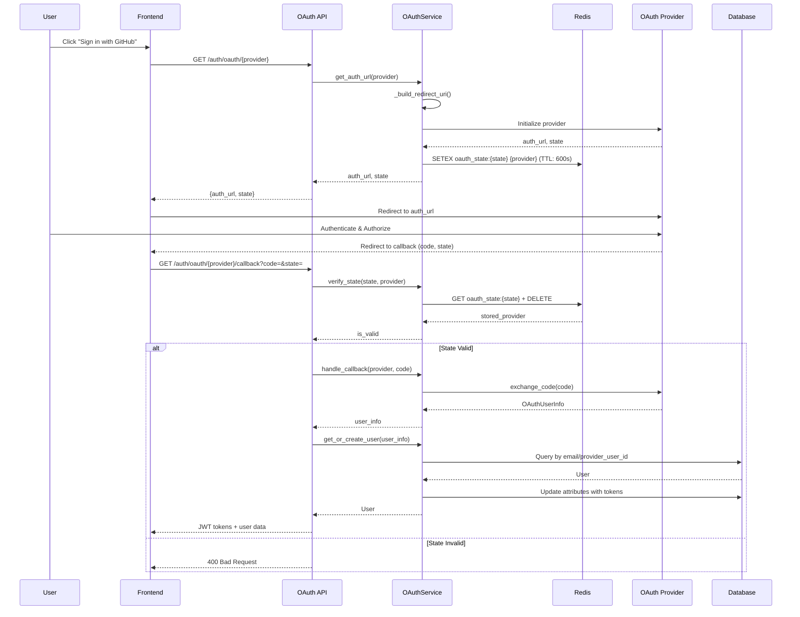
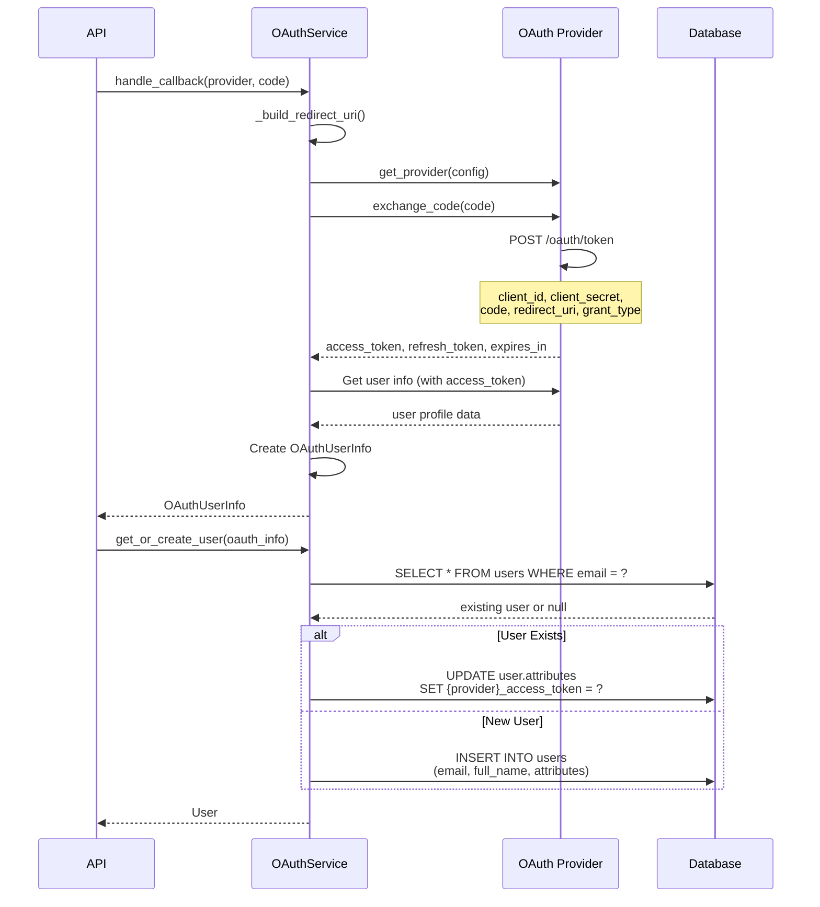
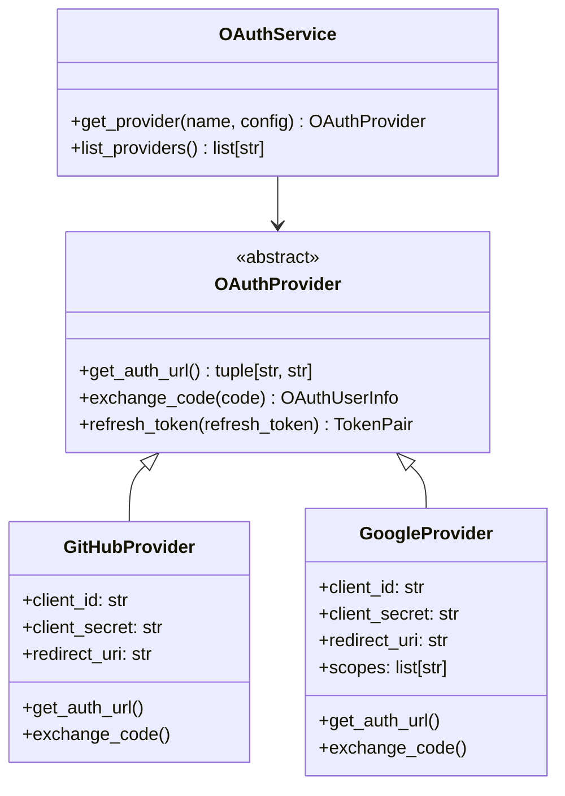

# OAuth 2.0 Integration Design

> **Date**: 2025-07-20 | **Status**: Active | **Version**: 1.0 | **Owner**: Deep Docs Pipeline
> **Source**: Generated from codebase analysis | **Cross-links**: See Related Documents section

## Overview

The OAuth 2.0 integration provides secure authentication flows for GitHub and Google providers, enabling users to authenticate via third-party identity providers. The system supports both login flows (creating/linking accounts) and connect flows (linking additional providers to existing accounts).

## Architecture



## API Surface

### Routes (backend/omoi_os/api/routes/auth.py)

| Endpoint | Method | Description |
|----------|--------|-------------|
| `/auth/oauth/{provider}` | GET | Initiate OAuth flow, returns auth URL |
| `/auth/oauth/{provider}/callback` | GET | Handle OAuth callback, exchanges code for tokens |
| `/auth/oauth/{provider}/connect` | GET | Initiate connect flow for existing users |

### Service Interface (backend/omoi_os/services/oauth_service.py)

```python
class OAuthService:
    def get_available_providers(self) -> list[dict]
    def get_auth_url(self, provider_name: str) -> tuple[str, str]
    def get_connect_auth_url(self, provider_name: str, user_id: UUID) -> tuple[str, str]
    def verify_state(self, state: str, provider_name: str) -> bool
    def verify_state_and_get_mode(self, state: str, provider_name: str) -> tuple[bool, Optional[UUID]]
    async def handle_callback(self, provider_name: str, code: str) -> Optional[OAuthUserInfo]
    def get_or_create_user(self, oauth_info: OAuthUserInfo) -> User
    def connect_provider_to_user(self, user_id: UUID, oauth_info: OAuthUserInfo) -> bool
    def disconnect_provider(self, user_id: UUID, provider: str) -> bool
```

## Token Exchange Flow



## Refresh Token Logic

The system stores refresh tokens in user attributes for each provider:

```python
# User attributes structure
{
    "github_user_id": "12345",
    "github_access_token": "gho_xxx",
    "github_refresh_token": "ghr_xxx",  # If provided
    "github_username": "octocat",
    "google_user_id": "...",
    "google_access_token": "...",
}
```

Token refresh is handled by the provider-specific implementations in `backend/omoi_os/services/oauth/`.

## Provider Abstraction



## Security Considerations

### State Parameter Protection

```python
# backend/omoi_os/services/oauth_service.py:19-21
OAUTH_STATE_PREFIX = "oauth_state:"
OAUTH_STATE_TTL = 600  # 10 minutes

# State storage with TTL
state_key = f"{OAUTH_STATE_PREFIX}{state}"
self._redis.setex(state_key, OAUTH_STATE_TTL, provider_name)
```

### Connect Flow Security

The connect flow uses a special state format to prevent CSRF attacks:

```python
# backend/omoi_os/services/oauth_service.py:204-206
# Format: "connect:provider:user_id"
state_value = f"connect:{provider_name}:{user_id}"
self._redis.setex(state_key, OAUTH_STATE_TTL, state_value)
```

### Token Storage

- Access tokens stored in user attributes (encrypted at rest via database)
- Refresh tokens stored alongside access tokens
- Tokens never exposed in API responses
- OAuth tokens isolated per provider

### Redirect URI Validation

```python
# backend/omoi_os/services/oauth_service.py:63-97
def _build_redirect_uri(self, provider_name: str) -> str:
    # Explicit oauth_backend_url takes precedence
    if self.settings.oauth_backend_url:
        return f"{self.settings.oauth_backend_url}/api/v1/auth/oauth/{provider_name}/callback"
    
    # Fallback: derive from frontend URL
    base_uri = self.settings.oauth_redirect_uri
    # Development: adjust localhost ports
    if "localhost:3000" in parsed.netloc:
        backend_netloc = parsed.netloc.replace("localhost:3000", "localhost:18000")
```

## Configuration

```yaml
# config/base.yaml
auth:
  oauth_redirect_uri: "http://localhost:3000"
  oauth_backend_url: null  # Optional: explicit backend URL
  
  providers:
    github:
      client_id: "${GITHUB_CLIENT_ID}"
      client_secret: "${GITHUB_CLIENT_SECRET}"
      scope: "repo,user:email"
    
    google:
      client_id: "${GOOGLE_CLIENT_ID}"
      client_secret: "${GOOGLE_CLIENT_SECRET}"
      scope: "openid,email,profile"
```

## Error Handling

| Error Scenario | HTTP Status | Error Message |
|----------------|-------------|---------------|
| Provider not configured | 400 | "Provider 'xxx' not configured" |
| Invalid state | 400 | "Invalid or expired OAuth state" |
| Provider mismatch | 400 | "OAuth state provider mismatch" |
| Redis unavailable | 500 | "Failed to initialize OAuth flow" |
| Token exchange failed | 400 | "Failed to exchange authorization code" |
| User not found (connect) | 404 | "User not found for OAuth connect" |

## Database Schema

```sql
-- User attributes JSONB structure for OAuth
CREATE TABLE users (
    id UUID PRIMARY KEY,
    email VARCHAR(255) UNIQUE NOT NULL,
    attributes JSONB DEFAULT '{}',
    -- OAuth tokens stored in attributes:
    -- {provider}_user_id: string
    -- {provider}_access_token: string (encrypted)
    -- {provider}_refresh_token: string (encrypted)
    -- {provider}_username: string
);

-- Index for OAuth lookups
CREATE INDEX idx_users_attributes_github ON users 
USING GIN ((attributes->>'github_user_id'));
```

## Testing Strategy

```python
# Unit test: State verification
async def test_oauth_state_verification():
    service = OAuthService(db, redis_client)
    auth_url, state = service.get_auth_url("github")
    
    # Verify state stored in Redis
    stored = redis_client.get(f"oauth_state:{state}")
    assert stored == "github"
    
    # Verify state validation
    is_valid = service.verify_state(state, "github")
    assert is_valid is True
    
    # Verify state is one-time use
    is_valid_again = service.verify_state(state, "github")
    assert is_valid_again is False

# Integration test: Full flow
async def test_oauth_callback_flow():
    # Mock provider response
    mock_user_info = OAuthUserInfo(
        provider="github",
        provider_user_id="12345",
        email="test@example.com",
        name="Test User",
        access_token="gho_xxx"
    )
    
    user = service.get_or_create_user(mock_user_info)
    assert user.email == "test@example.com"
    assert user.attributes["github_user_id"] == "12345"
```

## Related Documents

- Authentication System
- User Management
- [GitHub Integration](./github.md)
- Security Architecture
