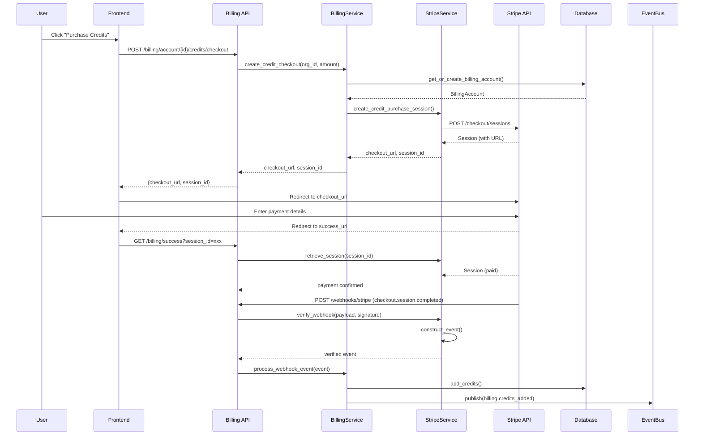
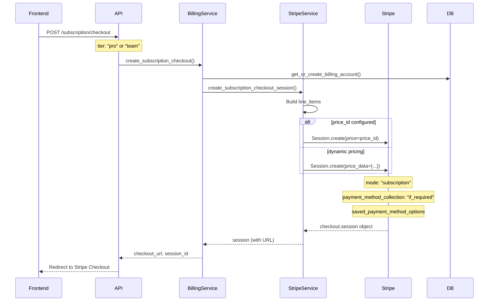
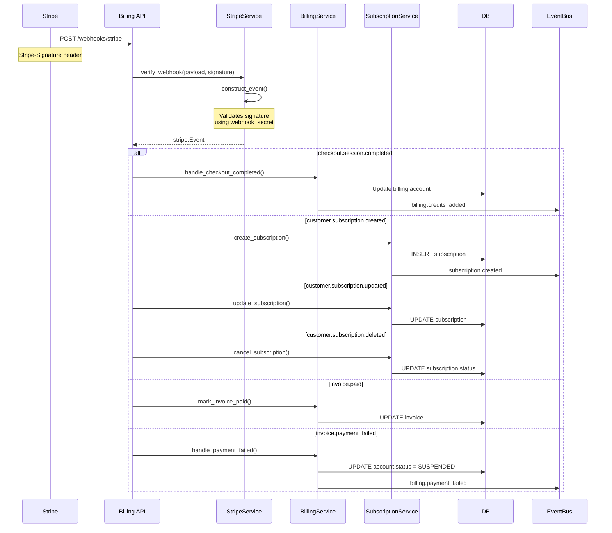
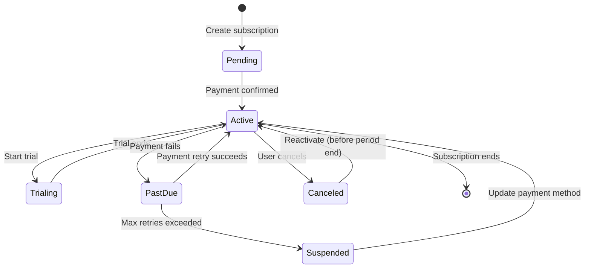

# Stripe Integration Design

> **Date**: 2025-07-20 | **Status**: Active | **Version**: 1.0 | **Owner**: Deep Docs Pipeline
> **Source**: Generated from codebase analysis | **Cross-links**: See Related Documents section

## Overview

The Stripe integration provides comprehensive payment processing capabilities including checkout sessions, subscription management, webhook handling, and invoice processing. The system follows PCI compliance best practices by never handling raw card data on the server.

## Architecture



## API Surface

### Billing Routes (backend/omoi_os/api/routes/billing.py)

| Endpoint | Method | Description |
|----------|--------|-------------|
| `/billing/config` | GET | Get Stripe publishable key |
| `/billing/account/{org_id}` | GET | Get or create billing account |
| `/billing/account/{org_id}/payment-method` | POST | Attach payment method |
| `/billing/account/{org_id}/payment-methods` | GET | List payment methods |
| `/billing/account/{org_id}/credits/checkout` | POST | Create credit purchase checkout |
| `/billing/account/{org_id}/subscription/checkout` | POST | Create subscription checkout |
| `/billing/account/{org_id}/subscription/cancel` | POST | Cancel subscription |
| `/billing/account/{org_id}/portal` | POST | Create customer portal session |
| `/billing/account/{org_id}/invoices` | GET | List invoices |
| `/billing/webhooks/stripe` | POST | Stripe webhook handler |

### StripeService Interface (backend/omoi_os/services/stripe_service.py)

```python
class StripeService:
    # Customer Management
    def create_customer(self, email, name, organization_id, metadata) -> stripe.Customer
    def get_customer(self, customer_id) -> Optional[stripe.Customer]
    def update_customer(self, customer_id, email, name, metadata) -> stripe.Customer
    
    # Payment Methods
    def attach_payment_method(self, customer_id, payment_method_id, set_as_default) -> stripe.PaymentMethod
    def list_payment_methods(self, customer_id, payment_type) -> list[stripe.PaymentMethod]
    def detach_payment_method(self, payment_method_id) -> stripe.PaymentMethod
    
    # Checkout Sessions
    def create_checkout_session(self, customer_id, amount_cents, description, ...) -> stripe.checkout.Session
    def create_credit_purchase_session(self, customer_id, credit_amount_usd, ...) -> stripe.checkout.Session
    def create_subscription_checkout_session(self, customer_id, price_id, ...) -> stripe.checkout.Session
    
    # Payment Intents
    def create_payment_intent(self, customer_id, amount_cents, metadata) -> stripe.PaymentIntent
    def charge_customer_directly(self, customer_id, amount_cents, description, ...) -> stripe.PaymentIntent
    
    # Billing Portal
    def create_portal_session(self, customer_id, return_url) -> stripe.billing_portal.Session
    
    # Refunds
    def create_refund(self, payment_intent_id, amount_cents, reason) -> stripe.Refund
    
    # Webhooks
    def verify_webhook(self, payload, signature) -> stripe.Event
    
    # Invoices
    def create_invoice(self, customer_id, description, amount_cents, ...) -> stripe.Invoice
    def list_customer_invoices(self, customer_id, limit, status) -> list[stripe.Invoice]
```

## Checkout Session Flow



## Webhook Handling



## Subscription Lifecycle



## PCI Compliance

### Security Measures

```python
# backend/omoi_os/services/stripe_service.py:4-5
"""Handles customer management, payment intents, subscriptions, and webhook processing.
Follows PCI compliance best practices by never handling raw card data on the server.
"""
```

1. **No Card Data Handling**: Server never sees raw card numbers
2. **Stripe.js Integration**: All card input handled by Stripe-hosted fields
3. **Webhook Signature Verification**: All webhooks verified using secret
4. **Token-Based Operations**: Use Stripe tokens/IDs, never raw card data

```python
# Webhook verification
# backend/omoi_os/services/stripe_service.py:565-592
def verify_webhook(self, payload: bytes, signature: str) -> stripe.Event:
    if not self.settings.webhook_secret:
        raise ValueError("Stripe webhook secret not configured")
    
    try:
        event = stripe.Webhook.construct_event(
            payload, signature, self.settings.webhook_secret
        )
        return event
    except SignatureVerificationError as e:
        logger.error(f"Invalid webhook signature: {e}")
        raise
```

## Configuration

```yaml
# config/base.yaml
billing:
  currency: "usd"
  workflow_price_usd: 10.0
  free_workflows_per_month: 5
  
  # URLs (overridden by env in production)
  success_url: "http://localhost:3000/billing/success"
  cancel_url: "http://localhost:3000/billing/cancel"
  portal_return_url: "http://localhost:3000/billing"
```

```bash
# .env (secrets only)
STRIPE_SECRET_KEY=sk_test_...
STRIPE_PUBLISHABLE_KEY=pk_test_...
STRIPE_WEBHOOK_SECRET=whsec_...

# Optional: Pre-configured price IDs
STRIPE_PRO_PRICE_ID=price_...
STRIPE_TEAM_PRICE_ID=price_...
```

## Database Schema

```sql
-- Billing Account
CREATE TABLE billing_accounts (
    id UUID PRIMARY KEY,
    organization_id UUID NOT NULL REFERENCES organizations(id),
    stripe_customer_id VARCHAR(255),
    stripe_payment_method_id VARCHAR(255),
    status VARCHAR(50) DEFAULT 'pending',
    free_workflows_remaining INTEGER DEFAULT 5,
    free_workflows_reset_at TIMESTAMP,
    credit_balance DECIMAL(10,2) DEFAULT 0.0,
    billing_email VARCHAR(255),
    created_at TIMESTAMP DEFAULT NOW()
);

-- Invoices
CREATE TABLE invoices (
    id UUID PRIMARY KEY,
    invoice_number VARCHAR(100) UNIQUE NOT NULL,
    billing_account_id UUID REFERENCES billing_accounts(id),
    stripe_invoice_id VARCHAR(255),
    status VARCHAR(50) DEFAULT 'draft',
    subtotal DECIMAL(10,2),
    total DECIMAL(10,2),
    credits_applied DECIMAL(10,2) DEFAULT 0.0,
    amount_due DECIMAL(10,2),
    currency VARCHAR(3) DEFAULT 'usd',
    line_items JSONB DEFAULT '[]',
    period_start TIMESTAMP,
    period_end TIMESTAMP,
    due_date TIMESTAMP,
    created_at TIMESTAMP DEFAULT NOW()
);

-- Usage Records
CREATE TABLE usage_records (
    id UUID PRIMARY KEY,
    billing_account_id UUID REFERENCES billing_accounts(id),
    ticket_id UUID REFERENCES tickets(id),
    usage_type VARCHAR(100),
    quantity INTEGER DEFAULT 1,
    unit_price DECIMAL(10,2),
    total_price DECIMAL(10,2),
    free_tier_used BOOLEAN DEFAULT FALSE,
    billed BOOLEAN DEFAULT FALSE,
    invoice_id UUID REFERENCES invoices(id),
    usage_details JSONB,
    recorded_at TIMESTAMP DEFAULT NOW()
);

-- Subscriptions
CREATE TABLE subscriptions (
    id UUID PRIMARY KEY,
    organization_id UUID REFERENCES organizations(id),
    billing_account_id UUID REFERENCES billing_accounts(id),
    tier VARCHAR(50) NOT NULL,
    status VARCHAR(50) DEFAULT 'incomplete',
    stripe_subscription_id VARCHAR(255),
    current_period_start TIMESTAMP,
    current_period_end TIMESTAMP,
    cancel_at_period_end BOOLEAN DEFAULT FALSE,
    workflows_limit INTEGER,
    workflows_used INTEGER DEFAULT 0,
    is_lifetime BOOLEAN DEFAULT FALSE,
    created_at TIMESTAMP DEFAULT NOW()
);
```

## Error Handling

| Error Scenario | HTTP Status | Handling |
|----------------|-------------|----------|
| Invalid webhook signature | 400 | Log error, return 400 to Stripe |
| Stripe API error | 502 | Log error, retry with exponential backoff |
| Card declined | 402 | Return specific error message to user |
| Duplicate session | 200 | Idempotent handling via idempotency keys |
| Missing customer | 404 | Create customer on-demand |
| Payment method missing | 400 | Prompt user to add payment method |

## Testing Strategy

```python
# Unit test: Webhook verification
async def test_webhook_verification():
    stripe_service = StripeService()
    
    # Valid signature
    payload = b'{"type": "checkout.session.completed"}'
    signature = generate_test_signature(payload)
    event = stripe_service.verify_webhook(payload, signature)
    assert event.type == "checkout.session.completed"
    
    # Invalid signature
    with pytest.raises(SignatureVerificationError):
        stripe_service.verify_webhook(payload, "invalid_sig")

# Integration test: Checkout flow
async def test_credit_purchase_flow():
    # Create checkout session
    result = billing_service.create_credit_checkout(
        organization_id=org_id,
        amount_usd=50.0
    )
    assert "checkout_url" in result
    assert "session_id" in result
    
    # Simulate webhook
    event = mock_checkout_completed_event(result["session_id"])
    billing_service.process_webhook_event(event)
    
    # Verify credits added
    account = billing_service.get_billing_account(org_id)
    assert account.credit_balance == 50.0
```

## Required Webhook Events

```
Required webhook endpoint configuration:
URL: https://api.omoios.dev/api/v1/billing/webhooks/stripe

Required events:
- checkout.session.completed
- customer.subscription.created
- customer.subscription.updated
- customer.subscription.deleted
- invoice.paid
- invoice.payment_failed
```

## Related Documents

- Billing System
- Subscription Management
- Usage Tracking
- PCI Compliance Guide
