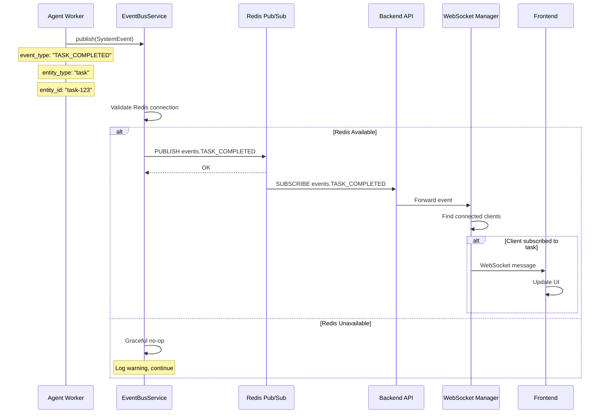
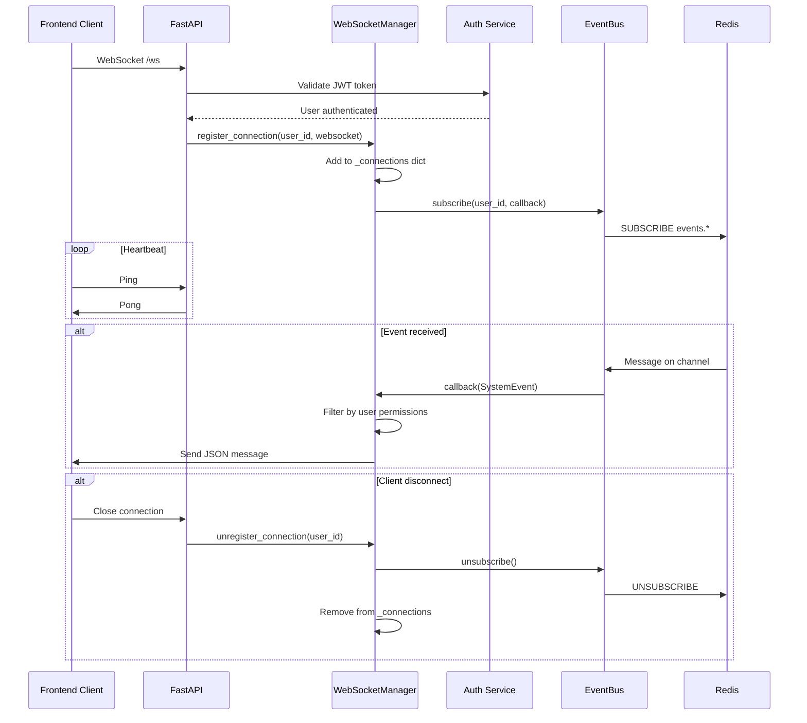
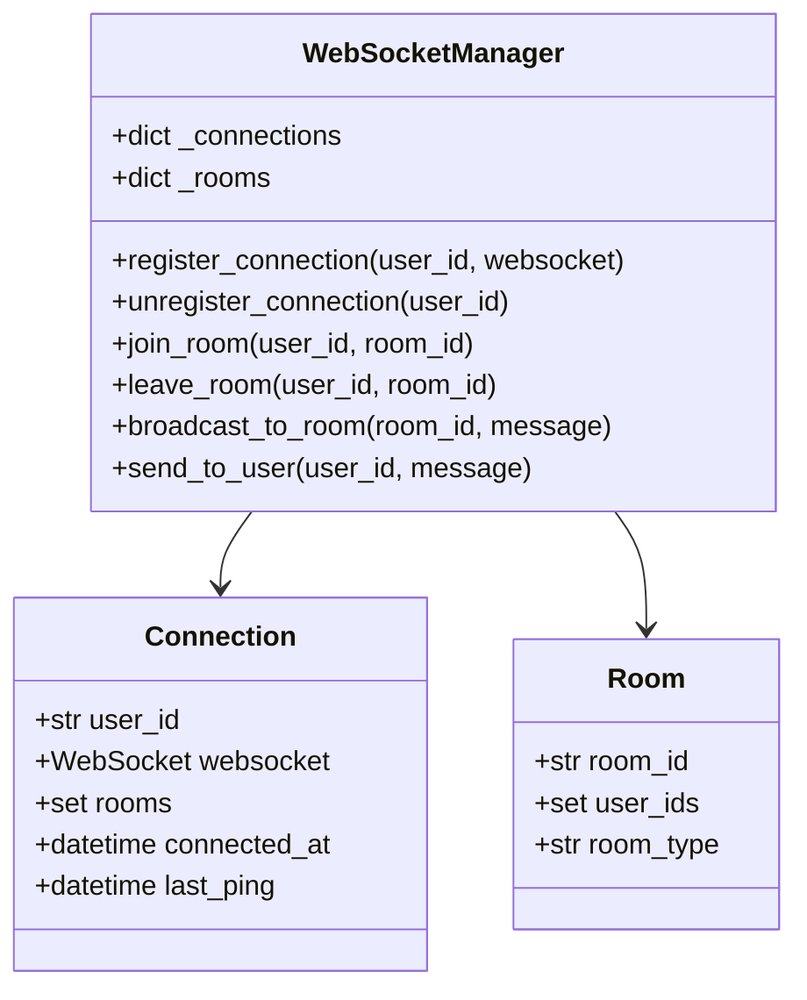
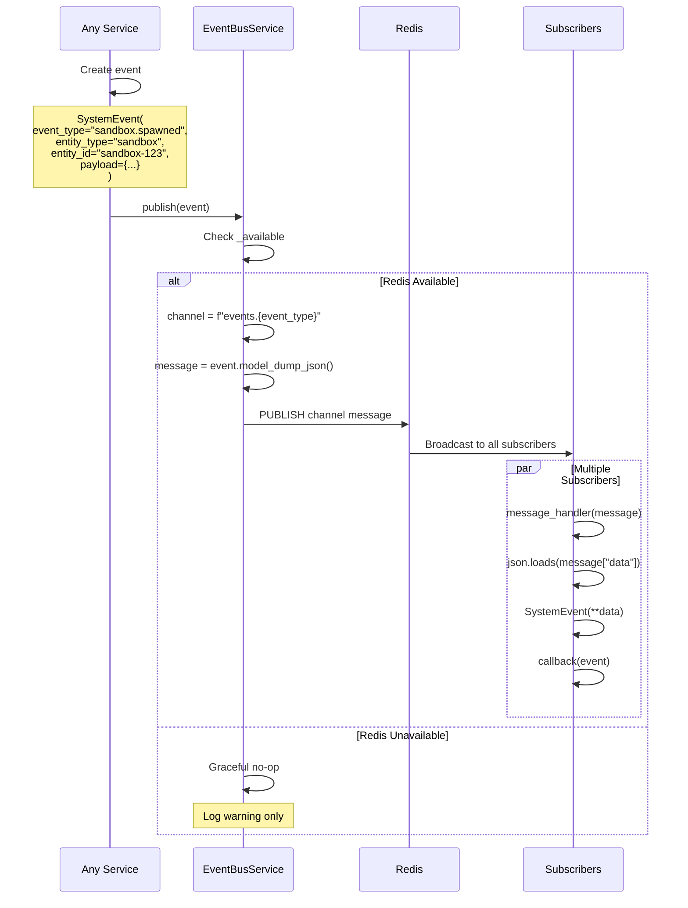
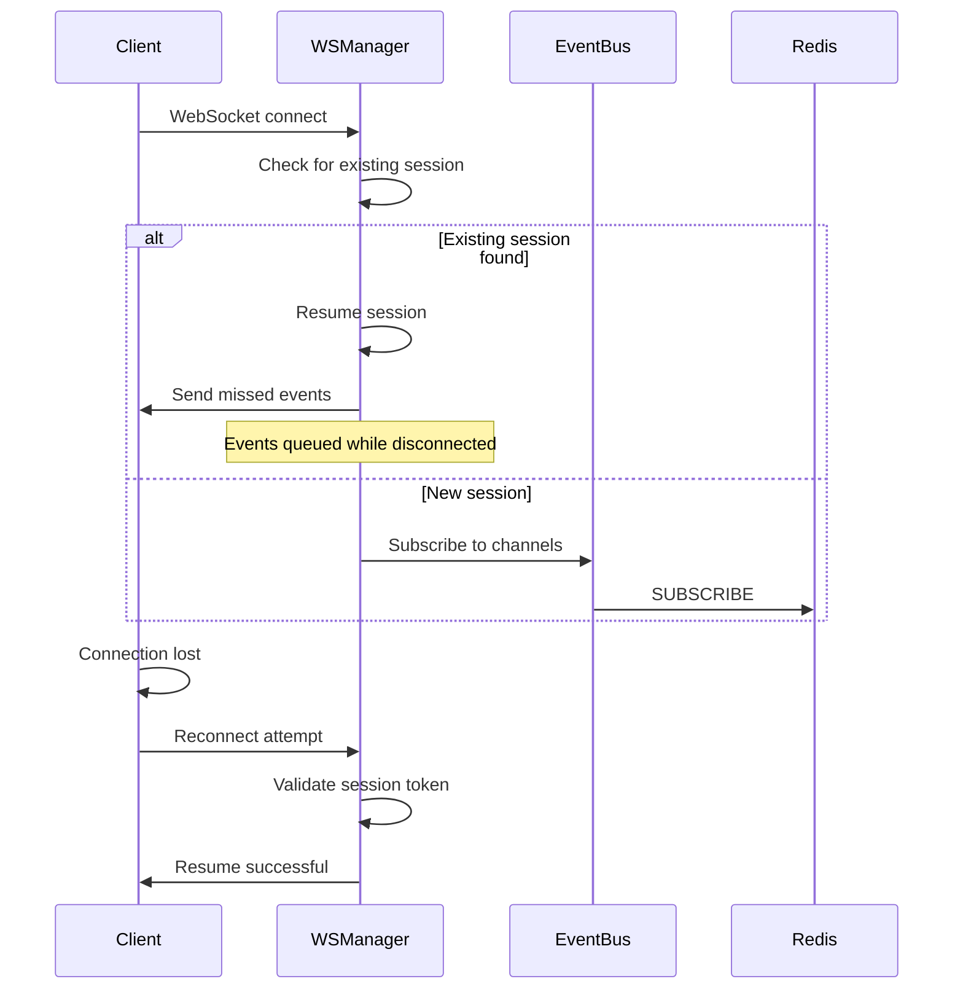

# WebSocket & Event Bus Integration Design

> **Date**: 2025-07-20 | **Status**: Active | **Version**: 1.0 | **Owner**: Deep Docs Pipeline
> **Source**: Generated from codebase analysis | **Cross-links**: See Related Documents section

## Overview

The WebSocket and Event Bus integration provides real-time communication capabilities for the OmoiOS platform. The EventBusService uses Redis Pub/Sub for system-wide event distribution, while WebSocket connections enable bidirectional communication with frontend clients for live updates.

## Architecture



## Service Interface (backend/omoi_os/services/event_bus.py)

```python
class SystemEvent(BaseModel):
    event_type: str  # TASK_ASSIGNED, TASK_COMPLETED, etc.
    entity_type: str  # ticket, task, agent
    entity_id: str
    payload: Dict[str, Any] = Field(default_factory=dict)

class EventBusService:
    def __init__(self, redis_url: str | None = None)
    
    def publish(self, event: SystemEvent) -> None
    def subscribe(self, event_type: str, callback: Callable[[SystemEvent], None]) -> None
    def listen(self) -> None  # Blocking
    def close(self) -> None

def get_event_bus() -> EventBusService
```

## Connection Lifecycle



## Room Management



### Room Types

| Room Type | Description | Example Use Case |
|-----------|-------------|------------------|
| `user:{user_id}` | Personal room for user-specific events | Task assignments, notifications |
| `project:{project_id}` | Project-wide updates | Spec updates, ticket changes |
| `org:{org_id}` | Organization-level events | Billing, member changes |
| `sandbox:{sandbox_id}` | Sandbox-specific updates | Agent output, progress |
| `task:{task_id}` | Task-specific updates | Status changes, results |

## Event Broadcasting



## Authentication

```python
# WebSocket connection with JWT authentication
async def websocket_endpoint(websocket: WebSocket, token: str):
    # Validate token
    user = await validate_jwt_token(token)
    if not user:
        await websocket.close(code=4001, reason="Unauthorized")
        return
    
    # Accept connection
    await websocket.accept()
    
    # Register with manager
    await ws_manager.connect(user.id, websocket)
    
    try:
        while True:
            # Handle messages
            data = await websocket.receive_json()
            
            # Validate message format
            if not validate_message(data):
                await websocket.send_json({
                    "error": "Invalid message format"
                })
                continue
            
            # Process based on message type
            if data["type"] == "subscribe":
                await ws_manager.subscribe(user.id, data["channel"])
            elif data["type"] == "unsubscribe":
                await ws_manager.unsubscribe(user.id, data["channel"])
            elif data["type"] == "ping":
                await websocket.send_json({"type": "pong"})
                
    except WebSocketDisconnect:
        await ws_manager.disconnect(user.id)
```

## Reconnection Handling



## Configuration

```yaml
# config/base.yaml
events:
  redis_url: "${REDIS_URL}"
  websocket:
    ping_interval_seconds: 30
    ping_timeout_seconds: 10
    max_connections_per_user: 5
    message_queue_size: 1000
    
  # Event retention for reconnection
  event_history:
    enabled: true
    max_events_per_channel: 100
    ttl_seconds: 300
```

```bash
# .env
REDIS_URL=redis://localhost:16379
WEBSOCKET_SECRET=ws_secret_...
```

## Error Handling

| Error Scenario | Handling | Client Impact |
|---------------|----------|---------------|
| Redis connection lost | Graceful degradation, log warning | Events not broadcast until reconnected |
| WebSocket disconnect | Attempt reconnection with backoff | Temporary loss of real-time updates |
| Authentication failure | Close connection with 4001 code | Must re-authenticate |
| Message parse error | Log error, send error response | Single message lost |
| Rate limit exceeded | Drop messages, log warning | Throttled updates |
| Queue full | Drop oldest messages | Some events lost |

## Database Schema

```sql
-- WebSocket connection tracking (optional, for analytics)
CREATE TABLE websocket_connections (
    id UUID PRIMARY KEY,
    user_id UUID REFERENCES users(id),
    session_id VARCHAR(255),
    connected_at TIMESTAMP DEFAULT NOW(),
    disconnected_at TIMESTAMP,
    ip_address INET,
    user_agent TEXT,
    channels JSONB DEFAULT '[]'
);

-- Event history for reconnection (Redis-backed, optional persistence)
CREATE TABLE event_history (
    id UUID PRIMARY KEY,
    channel VARCHAR(255) NOT NULL,
    event_type VARCHAR(100) NOT NULL,
    payload JSONB,
    created_at TIMESTAMP DEFAULT NOW(),
    expires_at TIMESTAMP
);

CREATE INDEX idx_event_history_channel ON event_history(channel, created_at);
```

## Testing Strategy

```python
# Unit test: Event publishing
def test_event_publishing():
    event_bus = EventBusService(redis_url="redis://localhost:6379")
    
    event = SystemEvent(
        event_type="TEST_EVENT",
        entity_type="test",
        entity_id="test-123",
        payload={"data": "value"}
    )
    
    # Should not raise even if Redis unavailable
    event_bus.publish(event)  # Graceful no-op if Redis down

# Unit test: Event subscription
def test_event_subscription():
    event_bus = EventBusService(redis_url="redis://localhost:6379")
    
    received_events = []
    
    def callback(event):
        received_events.append(event)
    
    event_bus.subscribe("TEST_EVENT", callback)
    
    # Publish test event
    event_bus.publish(SystemEvent(
        event_type="TEST_EVENT",
        entity_type="test",
        entity_id="test-456",
        payload={}
    ))
    
    # In real test with Redis, would verify callback invoked

# Integration test: WebSocket connection
async def test_websocket_connection():
    client = TestClient(app)
    
    with client.websocket_connect("/ws?token=valid_jwt") as websocket:
        # Send ping
        websocket.send_json({"type": "ping"})
        
        # Receive pong
        response = websocket.receive_json()
        assert response["type"] == "pong"
        
        # Subscribe to channel
        websocket.send_json({
            "type": "subscribe",
            "channel": "user:test-user"
        })
        
        # Publish event via EventBus
        event_bus.publish(SystemEvent(
            event_type="TASK_COMPLETED",
            entity_type="task",
            entity_id="task-123",
            payload={"user_id": "test-user"}
        ))
        
        # Receive broadcast
        response = websocket.receive_json()
        assert response["event_type"] == "TASK_COMPLETED"

# Load test: Multiple connections
async def test_multiple_connections():
    clients = []
    
    # Connect 100 clients
    for i in range(100):
        client = TestClient(app)
        ws = client.websocket_connect(f"/ws?token=token_{i}")
        clients.append(ws)
    
    # Broadcast message
    event_bus.publish(SystemEvent(
        event_type="BROADCAST",
        entity_type="system",
        entity_id="all",
        payload={"message": "Hello all"}
    ))
    
    # Verify all clients receive
    for ws in clients:
        response = ws.receive_json()
        assert response["event_type"] == "BROADCAST"
```

## Event Types Reference

| Event Type | Entity Type | Description | Payload |
|------------|-------------|-------------|---------|
| `TASK_ASSIGNED` | task | Task assigned to agent | `agent_id`, `ticket_id` |
| `TASK_COMPLETED` | task | Task finished | `result`, `duration` |
| `TASK_FAILED` | task | Task failed | `error`, `retry_count` |
| `TICKET_CREATED` | ticket | New ticket created | `title`, `description` |
| `TICKET_STATUS_CHANGED` | ticket | Status transition | `from_status`, `to_status` |
| `SANDBOX_SPAWNED` | sandbox | Sandbox created | `sandbox_id`, `task_id` |
| `SANDBOX_FAILED` | sandbox | Sandbox error | `error` |
| `PR_OPENED` | pull_request | PR created | `pr_number`, `html_url` |
| `PR_MERGED` | pull_request | PR merged | `merge_commit_sha` |
| `COMMIT_LINKED` | commit | Commit linked to ticket | `commit_sha` |
| `BILLING_USAGE_RECORDED` | usage_record | Usage tracked | `total_price` |
| `BILLING_PAYMENT_FAILED` | payment | Payment error | `error` |

## Related Documents

- [Real-Time Events Architecture](../../architecture/06-realtime-events.md)
- Redis Configuration
- Authentication
- Frontend WebSocket Client
- Event-Driven Architecture
