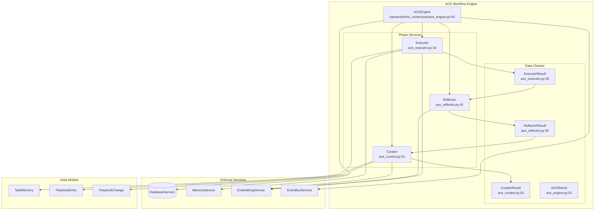
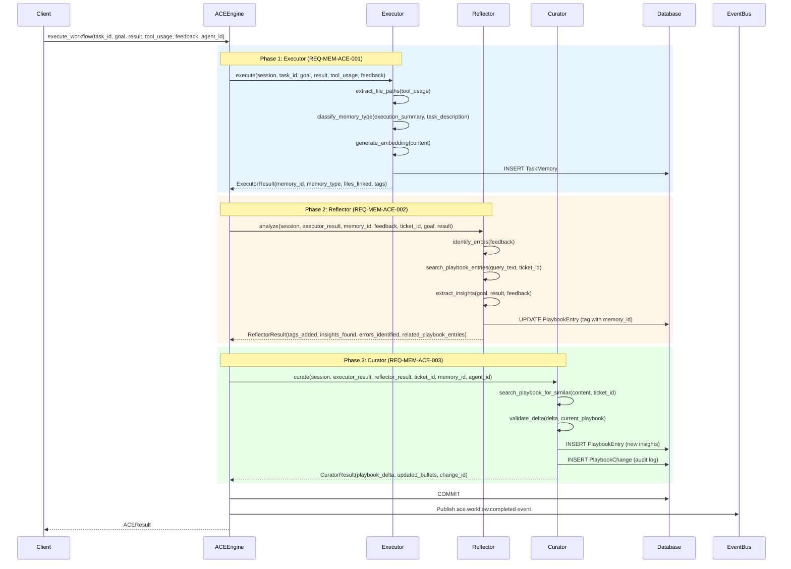
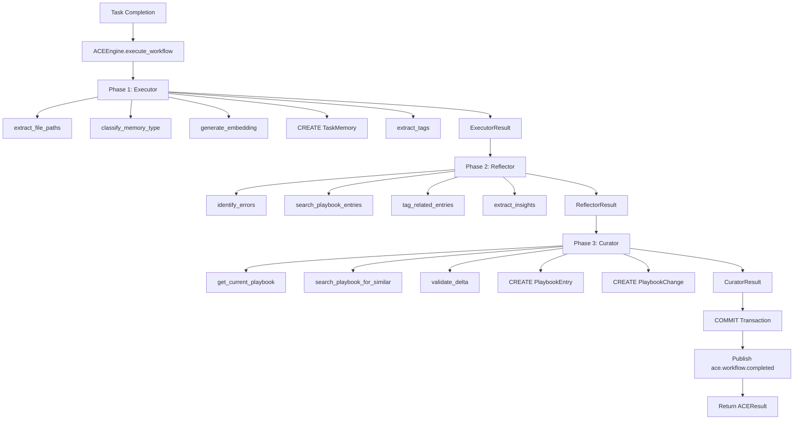
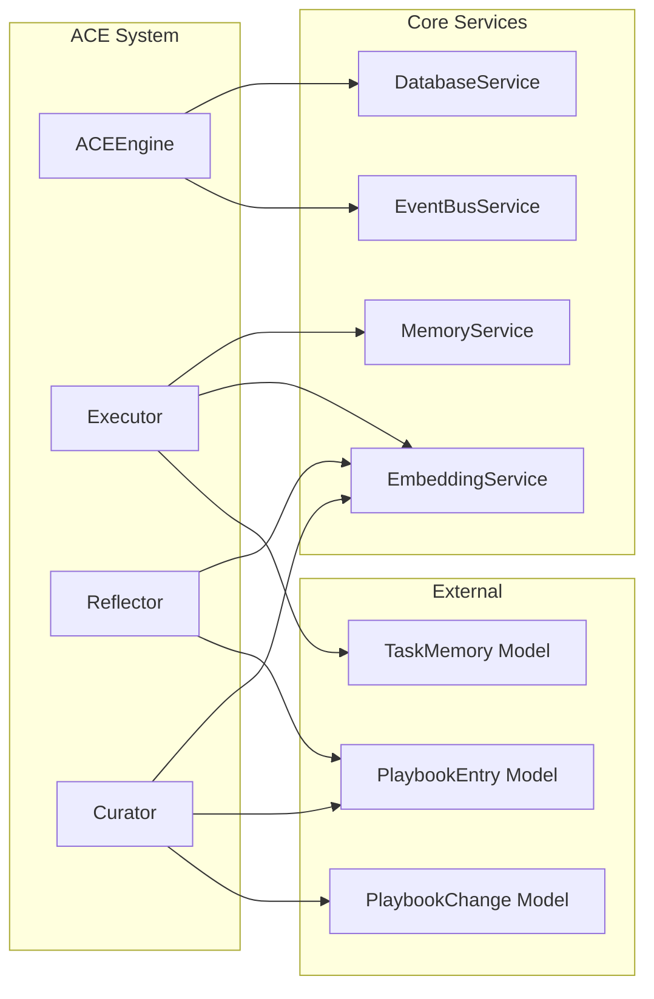

# ACE System Design Document

**Document ID**: DOC-ACE-001  
**Created**: 2026-04-22  
**Status**: Approved  
**Version**: 1.0  
**Owner**: Memory & Learning Team  

---

## 1. Overview

The ACE (Automatic Contextualization Engine) System is a three-phase workflow engine that transforms raw task execution data into structured, reusable organizational memory. It implements the memory pipeline defined in REQ-MEM-ACE-001 through REQ-MEM-ACE-004.

### 1.1 Purpose

ACE automatically captures, analyzes, and curates knowledge from agent task executions:
- **Executor Phase**: Creates memory records from task completions
- **Reflector Phase**: Analyzes feedback for errors and insights
- **Curator Phase**: Updates organizational playbooks with validated knowledge

### 1.2 Key Capabilities

| Capability | Description | Requirement |
|------------|-------------|-------------|
| Memory Creation | Converts task execution into structured memory records | REQ-MEM-ACE-001 |
| Error Detection | Identifies errors and root causes from feedback | REQ-MEM-ACE-002 |
| Insight Extraction | Discovers patterns, gotchas, and best practices | REQ-MEM-ACE-002 |
| Playbook Curation | Updates organizational knowledge base | REQ-MEM-ACE-003 |
| Event Publishing | Notifies system of workflow completion | REQ-MEM-ACE-004 |

### 1.3 Architecture Philosophy

ACE follows a pipeline architecture where each phase builds upon the previous:

```
Raw Task Data → Executor → Reflector → Curator → Structured Knowledge
     ↓              ↓          ↓          ↓            ↓
  (goal,        Memory    Insights,   Playbook    Event Bus
   result,       Record    Errors     Updates     Notification
   feedback)     + Tags    + Links
```

---

## 2. System Architecture

### 2.1 High-Level Component Diagram



### 2.2 Service Matrix

| Service | File | Lines | Primary Responsibility | Dependencies |
|---------|------|-------|------------------------|--------------|
| ACEEngine | `ace_engine.py` | 208 | Orchestrates three-phase workflow | Executor, Reflector, Curator |
| Executor | `ace_executor.py` | 212 | Creates memory records from task data | MemoryService, EmbeddingService |
| Reflector | `ace_reflector.py` | 338 | Analyzes feedback, extracts insights | EmbeddingService |
| Curator | `ace_curator.py` | 335 | Updates playbooks with curated knowledge | EmbeddingService |

### 2.3 Data Flow Architecture



---

## 3. ACEEngine Details

### 3.1 Class Definition

```python
class ACEEngine:
    """
    ACE workflow engine orchestrator (REQ-MEM-ACE-004).
    
    Responsibilities:
    - Orchestrate three-phase workflow (Executor → Reflector → Curator)
    - Coordinate service calls and handle failures
    - Track workflow metrics
    - Return structured ACEResult
    """
```

### 3.2 Constructor Signature

`backend/omoi_os/services/ace_engine.py:51-71`

```python
def __init__(
    self,
    db: DatabaseService,
    memory_service: MemoryService,
    embedding_service: EmbeddingService,
    event_bus: Optional[EventBusService] = None,
):
```

**Parameters:**
- `db`: Database service for transaction management
- `memory_service`: Memory service for classification and storage
- `embedding_service`: Embedding service for vector generation
- `event_bus`: Optional event bus for publishing completion events

### 3.3 Main Workflow Method

`backend/omoi_os/services/ace_engine.py:73-208`

```python
def execute_workflow(
    self,
    task_id: str,
    goal: str,
    result: str,
    tool_usage: list[Dict[str, Any]],
    feedback: str,
    agent_id: str,
) -> ACEResult:
```

**Workflow Steps:**
1. Retrieve task from database to get `ticket_id`
2. **Phase 1**: Execute Executor to create memory record
3. **Phase 2**: Execute Reflector to analyze and tag
4. **Phase 3**: Execute Curator to update playbooks
5. Commit transaction
6. Publish `ace.workflow.completed` event
7. Return consolidated `ACEResult`

### 3.4 ACEResult Data Class

`backend/omoi_os/services/ace_engine.py:20-38`

```python
@dataclass
class ACEResult:
    """Complete ACE workflow result (REQ-MEM-ACE-004)."""
    
    # Executor phase
    memory_id: str
    memory_type: str
    files_linked: list[str]
    
    # Reflector phase
    tags_added: list[str]
    insights_found: list[Dict[str, Any]]  # Serialized Insight objects
    errors_identified: list[Dict[str, Any]]  # Serialized Error objects
    related_playbook_entries: list[str]  # Entry IDs
    
    # Curator phase
    playbook_delta: Dict[str, Any]  # Serialized PlaybookDelta
    updated_bullets: list[Dict[str, Any]]  # Serialized PlaybookBullet objects
    change_id: Optional[str]
```

---

## 4. Executor Details

### 4.1 Class Definition

```python
class Executor:
    """
    Executor service for ACE workflow (REQ-MEM-ACE-001).
    
    Responsibilities:
    - Parse tool_usage to extract file paths and classify relations
    - Classify memory_type based on goal and result
    - Generate embeddings for content
    - Create memory record
    - Link memory to relevant files
    """
```

### 4.2 Key Data Classes

**ToolUsage** (`ace_executor.py:16-22`):
```python
@dataclass
class ToolUsage:
    """Tool usage record (REQ-MEM-ACE-001)."""
    tool_name: str
    arguments: Dict[str, Any]
    result: Optional[str] = None
```

**ExecutorResult** (`ace_executor.py:25-31`):
```python
@dataclass
class ExecutorResult:
    """Result from Executor phase (REQ-MEM-ACE-001)."""
    memory_id: str
    memory_type: str
    files_linked: List[str]
    tags: List[str]
```

### 4.3 Main Execution Method

`backend/omoi_os/services/ace_executor.py:61-139`

```python
def execute(
    self,
    session: Session,
    task_id: str,
    goal: str,
    result: str,
    tool_usage: List[Dict[str, Any]],
    feedback: Optional[str] = None,
) -> ExecutorResult:
```

**Execution Steps:**
1. Verify task exists in database
2. Parse tool usage to extract file paths (`extract_file_paths`)
3. Classify memory type using `MemoryService.classify_memory_type`
4. Generate content string: `"{goal}\n\nResult: {result}"`
5. Generate embedding vector
6. Create `TaskMemory` record with:
   - `task_id`, `execution_summary`, `memory_type`
   - `goal`, `result`, `feedback`
   - `tool_usage` (stored as JSONB)
   - `context_embedding`, `success=True`
   - `learned_at=utc_now()`, `reused_count=0`
7. Extract tags from goal and result
8. Return `ExecutorResult`

### 4.4 File Path Extraction

`backend/omoi_os/services/ace_executor.py:141-179`

```python
def extract_file_paths(self, tool_usage: List[Dict[str, Any]]) -> List[str]:
    """Extract file paths from tool usage (REQ-MEM-ACE-001)."""
```

**Supported Tool Patterns:**
- `file_read`, `read_file`
- `file_edit`, `edit_file`
- `file_create`, `write_file`

**Argument Keys Checked:**
- `path`
- `file_path`
- `file`

### 4.5 Tag Extraction

`backend/omoi_os/services/ace_executor.py:181-212`

```python
def extract_tags(self, goal: str, result: str) -> List[str]:
    """Extract tags from goal and result."""
```

**Keyword Mappings:**
| Tag | Keywords |
|-----|----------|
| authentication | auth, login, jwt, oauth |
| database | db, sql, postgres, mysql, database |
| api | api, endpoint, rest, graphql |
| testing | test, pytest, unit, integration |
| frontend | react, vue, angular, ui, frontend |
| backend | backend, server, api |

---

## 5. Reflector Details

### 5.1 Class Definition

```python
class Reflector:
    """
    Reflector service for ACE workflow (REQ-MEM-ACE-002).
    
    Responsibilities:
    - Analyze task feedback for errors and root causes
    - Search playbook for related entries using semantic search
    - Tag related entries with supporting memory IDs
    - Extract structured insights (patterns, gotchas, best practices)
    """
```

### 5.2 Key Data Classes

**Error** (`ace_reflector.py:18-23`):
```python
@dataclass
class Error:
    """Error identified from feedback (REQ-MEM-ACE-002)."""
    error_type: str
    message: str
    context: Optional[str] = None
```

**Insight** (`ace_reflector.py:27-33`):
```python
@dataclass
class Insight:
    """Structured insight extracted from task completion (REQ-MEM-ACE-002)."""
    insight_type: str  # pattern, gotcha, best_practice
    content: str
    confidence: float
```

**ReflectorResult** (`ace_reflector.py:36-42`):
```python
@dataclass
class ReflectorResult:
    """Result from Reflector phase (REQ-MEM-ACE-002)."""
    tags_added: List[str]  # Entry IDs that were tagged
    insights_found: List[Insight]
    errors_identified: List[Error]
    related_playbook_entries: List[str]  # Entry IDs
```

### 5.3 Main Analysis Method

`backend/omoi_os/services/ace_reflector.py:68-134`

```python
def analyze(
    self,
    session: Session,
    executor_result: "ExecutorResult",
    memory_id: str,
    feedback: str,
    ticket_id: str,
    goal: str,
    result: str,
) -> ReflectorResult:
```

**Analysis Steps:**
1. Identify errors from feedback (`identify_errors`)
2. Search playbook for related entries (`search_playbook_entries`)
3. Tag related entries with supporting memory IDs
4. Extract insights (`extract_insights`)
5. Return `ReflectorResult`

### 5.4 Error Identification

`backend/omoi_os/services/ace_reflector.py:136-200`

```python
def identify_errors(self, feedback: str) -> List[Error]:
    """Identify errors from feedback text (REQ-MEM-ACE-002)."""
```

**Error Patterns (Regex):**
| Error Type | Pattern |
|------------|---------|
| ImportError | `ImportError[^\n]*` |
| ValueError | `ValueError[^\n]*` |
| KeyError | `KeyError[^\n]*` |
| AttributeError | `AttributeError[^\n]*` |
| TypeError | `TypeError[^\n]*` |
| FileNotFoundError | `FileNotFoundError[^\n]*` |
| PermissionError | `PermissionError[^\n]*` |

**Generic Failure Keywords:**
- failed, error, exception, traceback, failed tests

### 5.5 Playbook Search

`backend/omoi_os/services/ace_reflector.py:202-251`

```python
def search_playbook_entries(
    self,
    session: Session,
    query_text: str,
    ticket_id: str,
    limit: int = 5,
    similarity_threshold: float = 0.7,
) -> List[Any]:
```

**Search Algorithm:**
1. Generate query embedding from `query_text`
2. Query active playbook entries for ticket
3. Calculate cosine similarity for each entry
4. Filter by `similarity_threshold` (default 0.7)
5. Sort by similarity (highest first)
6. Return top `limit` results

### 5.6 Cosine Similarity

`backend/omoi_os/services/ace_reflector.py:253-265`

```python
def _cosine_similarity(self, vec1: List[float], vec2: List[float]) -> float:
    """Calculate cosine similarity between two vectors."""
    if len(vec1) != len(vec2):
        return 0.0
    
    dot_product = sum(a * b for a, b in zip(vec1, vec2))
    norm1 = sum(a * a for a in vec1) ** 0.5
    norm2 = sum(b * b for b in vec2) ** 0.5
    
    if norm1 == 0.0 or norm2 == 0.0:
        return 0.0
    
    return dot_product / (norm1 * norm2)
```

### 5.7 Insight Extraction

`backend/omoi_os/services/ace_reflector.py:267-338`

```python
def extract_insights(self, goal: str, result: str, feedback: str) -> List[Insight]:
    """Extract structured insights from completion (REQ-MEM-ACE-002)."""
```

**Insight Types & Keywords:**
| Type | Keywords |
|------|----------|
| pattern | always, never, make sure, must, should |
| gotcha | careful, watch out, gotcha, beware, caution |
| best_practice | prefer, recommend, best practice, should use |

**Extraction Logic:**
- Splits text into sentences
- Finds sentences containing keywords
- Creates `Insight` with `confidence=0.7`

---

## 6. Curator Details

### 6.1 Class Definition

```python
class Curator:
    """
    Curator service for ACE workflow (REQ-MEM-ACE-003).
    
    Responsibilities:
    - Propose playbook updates based on insights
    - Generate delta operations (add/update/delete)
    - Validate deltas (check duplicates, quality thresholds)
    - Apply accepted deltas to playbook
    - Record change history
    """
```

### 6.2 Key Data Classes

**DeltaOperation** (`ace_curator.py:23-31`):
```python
@dataclass
class DeltaOperation:
    """Delta operation for playbook changes (REQ-MEM-ACE-003)."""
    operation: str  # add, update, delete
    content: str
    category: Optional[str] = None
    tags: Optional[List[str]] = None
    entry_id: Optional[str] = None  # For update/delete operations
```

**PlaybookDelta** (`ace_curator.py:34-38`):
```python
@dataclass
class PlaybookDelta:
    """Playbook delta with operations and summary (REQ-MEM-ACE-003)."""
    operations: List[DeltaOperation]
    summary: str
```

**PlaybookBullet** (`ace_curator.py:42-50`):
```python
@dataclass
class PlaybookBullet:
    """Playbook bullet entry (REQ-MEM-ACE-003)."""
    id: str
    content: str
    category: Optional[str]
    tags: Optional[List[str]]
    supporting_memory_ids: Optional[List[str]]
```

**CuratorResult** (`ace_curator.py:53-59`):
```python
@dataclass
class CuratorResult:
    """Result from Curator phase (REQ-MEM-ACE-003)."""
    playbook_delta: PlaybookDelta
    updated_bullets: List[PlaybookBullet]
    change_id: Optional[str]
```

### 6.3 Main Curation Method

`backend/omoi_os/services/ace_curator.py:85-228`

```python
def curate(
    self,
    session: Session,
    executor_result: "ExecutorResult",
    reflector_result: "ReflectorResult",
    ticket_id: str,
    memory_id: str,
    agent_id: str,
) -> CuratorResult:
```

**Curation Steps:**
1. Get current playbook entries for ticket
2. Propose updates from insights (check for novelty)
3. Generate `PlaybookDelta` with operations
4. Validate delta (duplicates, quality)
5. Apply delta (create new `PlaybookEntry` records)
6. Record change history (`PlaybookChange`)
7. Return `CuratorResult`

### 6.4 Novelty Check

`backend/omoi_os/services/ace_curator.py:230-271`

```python
def search_playbook_for_similar(
    self,
    session: Session,
    content: str,
    ticket_id: str,
    threshold: float = 0.85,
) -> Optional[PlaybookEntry]:
```

Uses cosine similarity with threshold 0.85 to determine if insight is novel.

### 6.5 Delta Validation

`backend/omoi_os/services/ace_curator.py:273-303`

```python
def validate_delta(
    self,
    delta: PlaybookDelta,
    current_playbook: List[PlaybookEntry],
) -> bool:
```

**Validation Checks:**
- Content length >= 10 characters
- No exact duplicates in current playbook
- Category is valid (if provided)

### 6.6 Category Inference

`backend/omoi_os/services/ace_curator.py:305-321`

```python
def infer_category(self, insight: "Insight") -> str:
    """Infer playbook category from insight type (REQ-MEM-ACE-003)."""
```

**Category Mapping:**
| Insight Type | Category |
|--------------|----------|
| pattern | patterns |
| gotcha | gotchas |
| best_practice | best_practices |
| (default) | general |

---

## 7. Data Flow

### 7.1 Complete Workflow Data Flow



### 7.2 Database Operations Per Phase

| Phase | Read | Write | Update |
|-------|------|-------|--------|
| Executor | Task | TaskMemory | - |
| Reflector | PlaybookEntry | - | PlaybookEntry (tags) |
| Curator | PlaybookEntry | PlaybookEntry, PlaybookChange | - |

---

## 8. API Surface

### 8.1 ACEEngine Public Interface

```python
class ACEEngine:
    def __init__(
        self,
        db: DatabaseService,
        memory_service: MemoryService,
        embedding_service: EmbeddingService,
        event_bus: Optional[EventBusService] = None,
    ) -> None
    
    def execute_workflow(
        self,
        task_id: str,
        goal: str,
        result: str,
        tool_usage: list[Dict[str, Any]],
        feedback: str,
        agent_id: str,
    ) -> ACEResult
```

### 8.2 Executor Public Interface

```python
class Executor:
    def __init__(
        self,
        memory_service: MemoryService,
        embedding_service: EmbeddingService,
    ) -> None
    
    def execute(
        self,
        session: Session,
        task_id: str,
        goal: str,
        result: str,
        tool_usage: List[Dict[str, Any]],
        feedback: Optional[str] = None,
    ) -> ExecutorResult
    
    def extract_file_paths(self, tool_usage: List[Dict[str, Any]]) -> List[str]
    def extract_tags(self, goal: str, result: str) -> List[str]
```

### 8.3 Reflector Public Interface

```python
class Reflector:
    def __init__(self, embedding_service: EmbeddingService) -> None
    
    def analyze(
        self,
        session: Session,
        executor_result: "ExecutorResult",
        memory_id: str,
        feedback: str,
        ticket_id: str,
        goal: str,
        result: str,
    ) -> ReflectorResult
    
    def identify_errors(self, feedback: str) -> List[Error]
    def search_playbook_entries(
        self, session: Session, query_text: str, ticket_id: str,
        limit: int = 5, similarity_threshold: float = 0.7
    ) -> List[Any]
    def extract_insights(self, goal: str, result: str, feedback: str) -> List[Insight]
```

### 8.4 Curator Public Interface

```python
class Curator:
    def __init__(self, embedding_service: EmbeddingService) -> None
    
    def curate(
        self,
        session: Session,
        executor_result: "ExecutorResult",
        reflector_result: "ReflectorResult",
        ticket_id: str,
        memory_id: str,
        agent_id: str,
    ) -> CuratorResult
    
    def search_playbook_for_similar(
        self, session: Session, content: str, ticket_id: str, threshold: float = 0.85
    ) -> Optional[PlaybookEntry]
    def validate_delta(
        self, delta: PlaybookDelta, current_playbook: List[PlaybookEntry]
    ) -> bool
    def infer_category(self, insight: "Insight") -> str
```

---

## 9. Integration Points

### 9.1 Service Dependencies



### 9.2 Event Publishing

**Event Type**: `ace.workflow.completed`

**Payload Structure**:
```python
{
    "task_id": str,
    "ticket_id": str,
    "memory_id": str,
    "memory_type": str,
    "files_linked": List[str],
    "insights_count": int,
    "errors_count": int,
    "playbook_updates": int,
    "change_id": Optional[str],
}
```

**Publishing Code** (`ace_engine.py:142-160`):
```python
if self.event_bus:
    self.event_bus.publish(
        SystemEvent(
            event_type="ace.workflow.completed",
            entity_type="task_memory",
            entity_id=executor_result.memory_id,
            payload={...},
        )
    )
```

---

## 10. Error Handling

### 10.1 Error Categories

| Category | Source | Handling |
|----------|--------|----------|
| Task Not Found | Executor | Raise `ValueError` |
| Database Errors | All phases | Rollback transaction |
| Embedding Failures | Executor, Reflector, Curator | Return empty/None |
| Validation Failures | Curator | Return empty delta |

### 10.2 Transaction Management

ACEEngine uses database session context manager:

```python
with self.db.get_session() as session:
    # Phase 1: Executor
    executor_result = self.executor.execute(session, ...)
    session.flush()
    
    # Phase 2: Reflector
    reflector_result = self.reflector.analyze(session, ...)
    session.flush()
    
    # Phase 3: Curator
    curator_result = self.curator.curate(session, ...)
    
    session.commit()  # All or nothing
```

### 10.3 Phase Failure Behavior

| Phase Fails | Behavior |
|-------------|----------|
| Executor | No memory created, workflow aborts |
| Reflector | Memory exists but no analysis, workflow continues |
| Curator | Analysis exists but no playbook updates, workflow completes |

---

## 11. Configuration

### 11.1 Similarity Thresholds

| Threshold | Value | Purpose |
|-----------|-------|---------|
| Playbook Search | 0.7 | Find related entries |
| Novelty Check | 0.85 | Determine if insight is new |

### 11.2 Tag Extraction Keywords

Defined in `Executor.extract_tags()`:
- authentication: auth, login, jwt, oauth
- database: db, sql, postgres, mysql, database
- api: api, endpoint, rest, graphql
- testing: test, pytest, unit, integration
- frontend: react, vue, angular, ui, frontend
- backend: backend, server, api

### 11.3 Insight Extraction Keywords

Defined in `Reflector.extract_insights()`:

**Patterns:** always, never, make sure, must, should
**Gotchas:** careful, watch out, gotcha, beware, caution
**Best Practices:** prefer, recommend, best practice, should use

---

## 12. Related Documents

| Document | Description | Link |
|----------|-------------|------|
| Agent Execution System | Agent lifecycle, health monitoring, output collection | [agent-execution-system.md](./agent-execution-system.md) |
| Memory Service | Memory classification and retrieval | `../services/memory_service.md` |
| Embedding Service | Vector generation and similarity | `../services/embedding_service.md` |
| Playbook System | Organizational knowledge management | `../services/playbook_system.md` |
| Task Memory Model | Database schema for memories | `../../models/task_memory.md` |
| Playbook Entry Model | Database schema for playbooks | `../../models/playbook_entry.md` |

---

## 13. Appendix: Source File References

### 13.1 File Locations

| Component | File Path | Line Count |
|-----------|-----------|------------|
| ACEEngine | `backend/omoi_os/services/ace_engine.py` | 208 |
| Executor | `backend/omoi_os/services/ace_executor.py` | 212 |
| Reflector | `backend/omoi_os/services/ace_reflector.py` | 338 |
| Curator | `backend/omoi_os/services/ace_curator.py` | 335 |

### 13.2 Key Method Signatures

**ACEEngine.execute_workflow** (line 73):
```python
def execute_workflow(
    self,
    task_id: str,
    goal: str,
    result: str,
    tool_usage: list[Dict[str, Any]],
    feedback: str,
    agent_id: str,
) -> ACEResult
```

**Executor.execute** (line 61):
```python
def execute(
    self,
    session: Session,
    task_id: str,
    goal: str,
    result: str,
    tool_usage: List[Dict[str, Any]],
    feedback: Optional[str] = None,
) -> ExecutorResult
```

**Reflector.analyze** (line 68):
```python
def analyze(
    self,
    session: Session,
    executor_result: "ExecutorResult",
    memory_id: str,
    feedback: str,
    ticket_id: str,
    goal: str,
    result: str,
) -> ReflectorResult
```

**Curator.curate** (line 85):
```python
def curate(
    self,
    session: Session,
    executor_result: "ExecutorResult",
    reflector_result: "ReflectorResult",
    ticket_id: str,
    memory_id: str,
    agent_id: str,
) -> CuratorResult
```

---

*End of ACE System Design Document*
