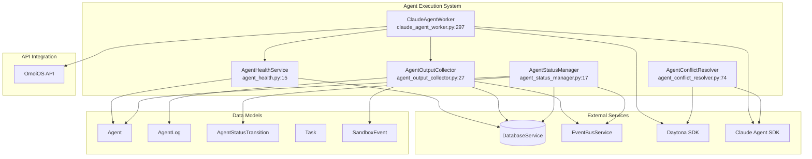
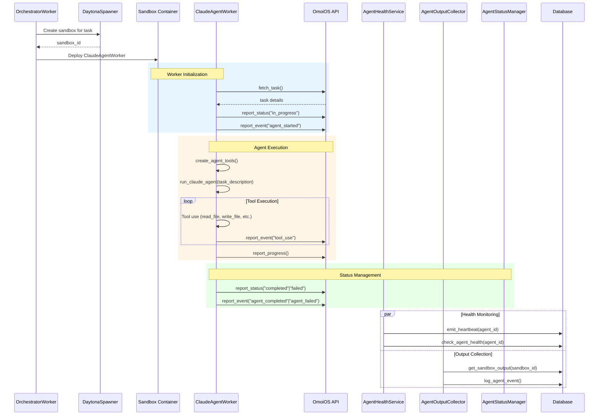
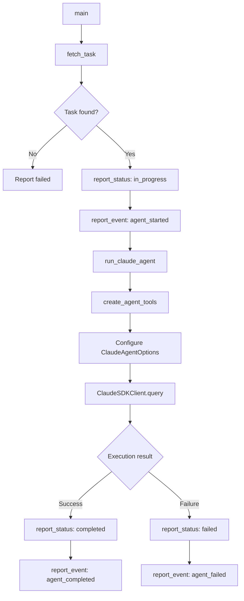
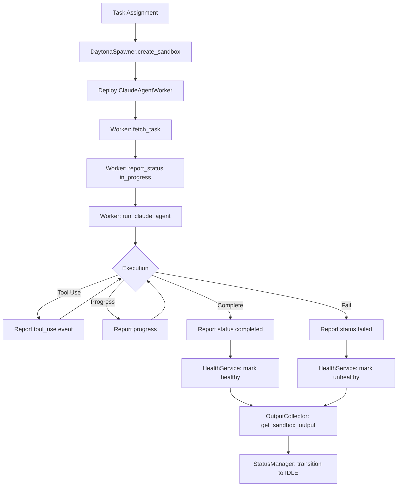
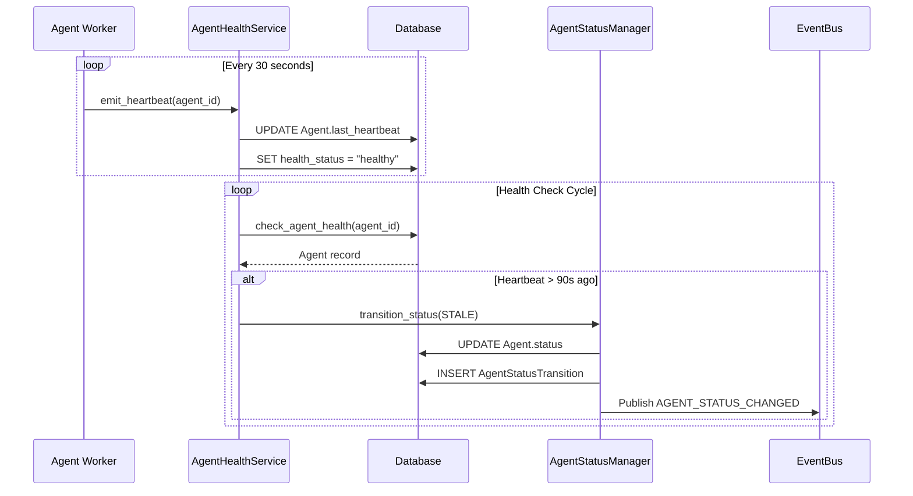
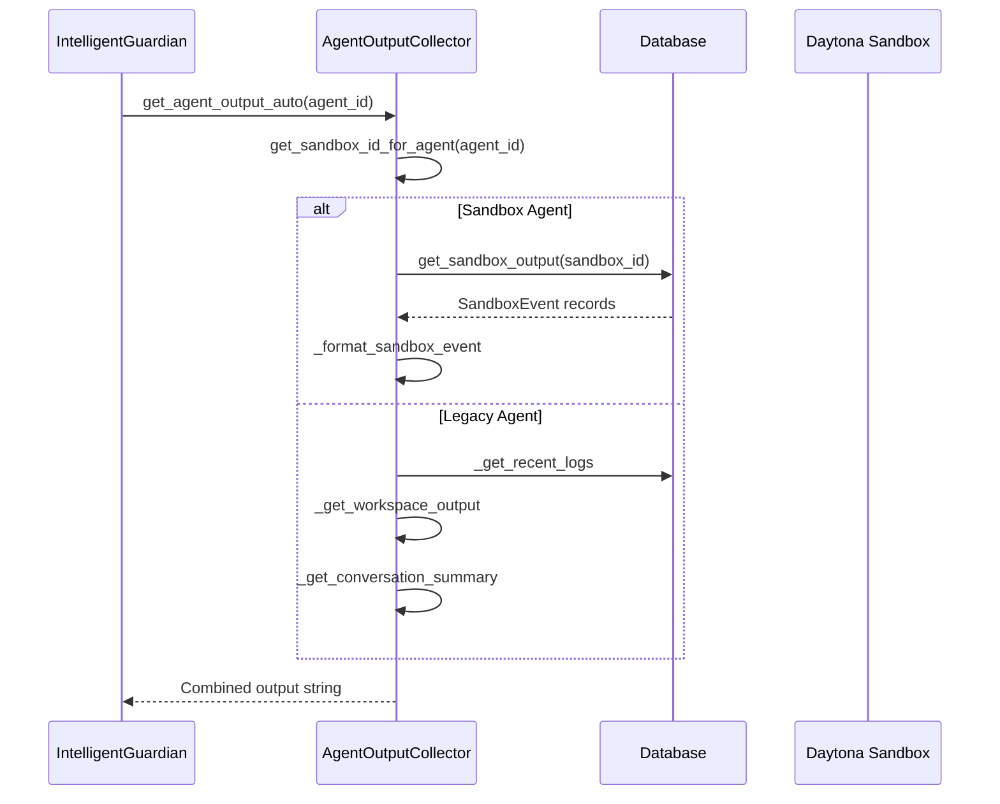
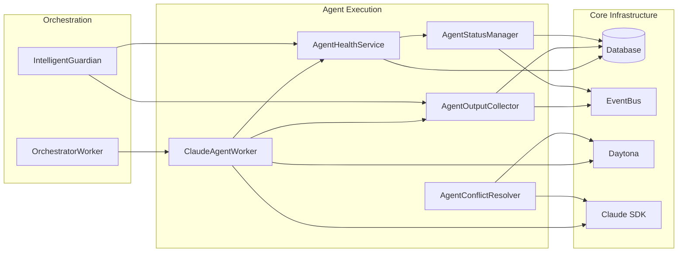

# Agent Execution System Design Document

**Document ID**: DOC-AGENT-001  
**Created**: 2026-04-22  
**Status**: Approved  
**Version**: 1.0  
**Owner**: Agent Orchestration Team  

---

## 1. Overview

The Agent Execution System is a comprehensive framework for managing the complete lifecycle of AI agents within OmoiOS. It handles agent spawning, health monitoring, output collection, status management, and conflict resolution across isolated sandbox environments.

### 1.1 Purpose

The system provides:
- **Agent Lifecycle Management**: Spawning, execution, and termination of agents in Daytona sandboxes
- **Health Monitoring**: Heartbeat tracking, stale detection, and health statistics
- **Output Collection**: Multi-source output aggregation from sandbox events, logs, and files
- **Status State Machine**: Enforced state transitions with audit logging
- **Conflict Resolution**: LLM-powered merge conflict resolution using Claude Agent SDK

### 1.2 Key Capabilities

| Capability | Description | Primary Service |
|------------|-------------|-----------------|
| Sandbox Execution | Run agents in isolated Daytona containers | ClaudeAgentWorker |
| Health Monitoring | Track heartbeats and detect stale agents | AgentHealthService |
| Output Collection | Aggregate output from multiple sources | AgentOutputCollector |
| Status Management | Enforce state machine transitions | AgentStatusManager |
| Conflict Resolution | Resolve git merge conflicts agentically | AgentConflictResolver |

### 1.3 Architecture Philosophy

The system follows a layered architecture:

```
┌─────────────────────────────────────────────────────────────┐
│                    Agent Execution Layer                      │
│         (ClaudeAgentWorker, Daytona Sandboxes)              │
├─────────────────────────────────────────────────────────────┤
│                    Monitoring Layer                         │
│    (HealthService, OutputCollector, StatusManager)          │
├─────────────────────────────────────────────────────────────┤
│                    Resolution Layer                         │
│              (AgentConflictResolver)                        │
├─────────────────────────────────────────────────────────────┤
│                    Persistence Layer                        │
│     (Agent, AgentLog, AgentStatus, SandboxEvent)          │
└─────────────────────────────────────────────────────────────┘
```

---

## 2. System Architecture

### 2.1 High-Level Component Diagram



### 2.2 Service Matrix

| Service | File | Lines | Primary Responsibility | Dependencies |
|---------|------|-------|------------------------|--------------|
| ClaudeAgentWorker | `claude_agent_worker.py` | 341 | Execute tasks in sandboxes using Claude SDK | Daytona SDK, Claude Agent SDK |
| AgentHealthService | `agent_health.py` | 365 | Monitor agent heartbeats and health | DatabaseService, AgentStatusManager |
| AgentOutputCollector | `agent_output_collector.py` | 724 | Collect output from agents and sandboxes | DatabaseService, EventBusService |
| AgentStatusManager | `agent_status_manager.py` | 155 | Enforce status state machine | DatabaseService, EventBusService |
| AgentConflictResolver | `agent_conflict_resolver.py` | 549 | Resolve merge conflicts using LLM | Claude Agent SDK, Daytona SDK |
| AgentExecutor | `agent_executor.py` | 720 | **DEPRECATED** - Legacy OpenHands executor | OpenHands SDK |

### 2.3 Execution Lifecycle Architecture



---

## 3. ClaudeAgentWorker Details

### 3.1 Overview

The ClaudeAgentWorker is an alternative to the OpenHands-based worker that uses Anthropic's native Claude Agent SDK for tool-using agent execution. It runs inside a Daytona sandbox and executes tasks using Claude's native `tool_use` capabilities.

### 3.2 Execution Flow



### 3.3 Environment Configuration

`backend/omoi_os/services/claude_agent_worker.py:26-33`

```python
TASK_ID = os.environ.get("TASK_ID")
AGENT_ID = os.environ.get("AGENT_ID")
MCP_SERVER_URL = os.environ.get("MCP_SERVER_URL", "http://localhost:18000")
SANDBOX_ID = os.environ.get("SANDBOX_ID", "")
ANTHROPIC_API_KEY = os.environ.get("ANTHROPIC_API_KEY", os.environ.get("LLM_API_KEY", ""))
```

### 3.4 Main Entry Point

`backend/omoi_os/services/claude_agent_worker.py:297-341`

```python
async def main():
    """Main entry point for the Claude Agent worker."""
    logger.info(f"Claude Agent Worker starting for task {TASK_ID}")
    
    if not TASK_ID or not AGENT_ID:
        logger.error("TASK_ID and AGENT_ID required")
        return
    
    if not ANTHROPIC_API_KEY:
        logger.error("ANTHROPIC_API_KEY required")
        await report_status("failed", "Missing ANTHROPIC_API_KEY")
        return
    
    # Fetch task and execute...
```

### 3.5 Agent Tools

`backend/omoi_os/services/claude_agent_worker.py:86-235`

```python
def create_agent_tools():
    """Create custom tools for the Claude agent."""
```

**Available Tools:**

| Tool | Description | Arguments |
|------|-------------|-----------|
| `read_file` | Read file contents | `file_path: str` |
| `write_file` | Write content to file | `file_path: str, content: str` |
| `run_command` | Execute shell command | `command: str, cwd: str` |
| `list_files` | List directory contents | `directory: str` |
| `report_progress` | Report task progress | `message: str, percentage: int` |

**Tool Registration:**
```python
server = create_sdk_mcp_server(
    name="workspace",
    version="1.0.0",
    tools=[read_file, write_file, run_command, list_files, report_progress],
)
```

### 3.6 Agent Configuration

`backend/omoi_os/services/claude_agent_worker.py:259-275`

```python
options = ClaudeAgentOptions(
    allowed_tools=tool_names + ["Read", "Write", "Bash", "Edit", "Glob", "Grep"],
    permission_mode="bypassPermissions",  # Auto-approve all in sandbox
    system_prompt=f"You are an AI coding agent...",
    cwd=Path(workspace_dir),
    max_turns=50,
    max_budget_usd=10.0,  # Safety limit
    model="claude-sonnet-4-5-20250929",
    mcp_servers={"workspace": tools_server},
    hooks={"PostToolUse": [HookMatcher(matcher=None, hooks=[track_tool_use])]},
)
```

### 3.7 API Communication Methods

**Fetch Task** (`claude_agent_worker.py:36-49`):
```python
async def fetch_task() -> dict | None:
    """Fetch task details from orchestrator."""
    async with httpx.AsyncClient(timeout=30) as client:
        resp = await client.get(f"{MCP_SERVER_URL}/api/v1/tasks/{TASK_ID}")
```

**Report Status** (`claude_agent_worker.py:52-63`):
```python
async def report_status(status: str, result: str | None = None):
    """Report task status back to orchestrator."""
    async with httpx.AsyncClient(timeout=10) as client:
        await client.patch(
            f"{MCP_SERVER_URL}/api/v1/tasks/{TASK_ID}",
            json={"status": status, "result": result},
        )
```

**Report Event** (`claude_agent_worker.py:66-83`):
```python
async def report_event(event_type: str, event_data: dict):
    """Report an agent event for Guardian observation."""
    async with httpx.AsyncClient(timeout=10) as client:
        await client.post(
            f"{MCP_SERVER_URL}/api/v1/agent-events",
            json={
                "task_id": TASK_ID,
                "agent_id": AGENT_ID,
                "sandbox_id": SANDBOX_ID,
                "event_type": event_type,
                "event_data": event_data,
            },
        )
```

---

## 4. AgentHealthService Details

### 4.1 Class Definition

```python
class AgentHealthService:
    """Service for monitoring agent health and managing heartbeats."""
```

### 4.2 Constructor

`backend/omoi_os/services/agent_health.py:18-29`

```python
def __init__(
    self, 
    db: DatabaseService, 
    status_manager: Optional[AgentStatusManager] = None
):
    self.db = db
    self.status_manager = status_manager
```

### 4.3 Heartbeat Management

**Emit Heartbeat** (`agent_health.py:31-78`):

```python
def emit_heartbeat(self, agent_id: str) -> bool:
    """
    Emit a heartbeat for an agent, updating its last_heartbeat timestamp.
    
    Also handles recovery from stale state:
    - Updates last_heartbeat to utc_now()
    - If status was 'stale', transitions to IDLE
    - Uses status_manager if available, otherwise direct update
    """
```

**Stale Detection Logic:**
- Default timeout: 90 seconds
- Stale agents have no heartbeat or last heartbeat > cutoff time
- Automatically updates agent status to "stale"

### 4.4 Health Check Methods

**Check Single Agent** (`agent_health.py:80-147`):

```python
def check_agent_health(
    self, 
    agent_id: str, 
    timeout_seconds: Optional[int] = None
) -> Dict[str, any]:
    """Check the health status of a specific agent."""
```

**Return Structure:**
```python
{
    "agent_id": str,
    "status": str,  # Agent status
    "healthy": bool,  # Based on heartbeat recency
    "last_heartbeat": str | None,  # ISO format
    "time_since_last_heartbeat": float,  # Seconds
    "timeout_seconds": int,
    "agent_type": str,
    "phase_id": str,
    "health_status": str,
}
```

**Detect Stale Agents** (`agent_health.py:149-184`):

```python
def detect_stale_agents(
    self, 
    timeout_seconds: Optional[int] = None
) -> List[Agent]:
    """Detect agents that have not sent a heartbeat within the timeout period."""
```

**Get All Agents Health** (`agent_health.py:186-254`):

```python
def get_all_agents_health(
    self, 
    timeout_seconds: Optional[int] = None
) -> List[Dict[str, any]]:
    """Get health status for all agents."""
```

### 4.5 Cleanup and Statistics

**Cleanup Stale Agents** (`agent_health.py:256-296`):

```python
def cleanup_stale_agents(
    self,
    timeout_seconds: Optional[int] = None,
    mark_as: str = "timeout",
) -> int:
    """Mark stale agents with a specific status for cleanup tracking."""
```

**Get Agent Statistics** (`agent_health.py:298-364`):

```python
def get_agent_statistics(self) -> Dict[str, any]:
    """Get comprehensive statistics about all agents."""
```

**Statistics Structure:**
```python
{
    "total_agents": int,
    "by_status": Dict[str, int],
    "by_type": Dict[str, int],
    "by_phase": Dict[str, int],
    "health_summary": {
        "healthy": int,
        "unhealthy": int,
        "unknown": int,
    },
    "recent_heartbeats": {
        "last_5_minutes": int,
        "last_hour": int,
        "last_24_hours": int,
    },
}
```

---

## 5. AgentOutputCollector Details

### 5.1 Class Definition

```python
class AgentOutputCollector:
    """
    Collects agent output from OpenHands conversations and other sources.
    
    This service replaces tmux-based output collection with a more robust
    system that works with OpenHands SDK conversations, workspace files,
    and event-driven communication.
    """
```

### 5.2 Constructor

`backend/omoi_os/services/agent_output_collector.py:35-47`

```python
def __init__(
    self,
    db: DatabaseService,
    event_bus: Optional[EventBusService] = None,
):
    self.db = db
    self.event_bus = event_bus
```

### 5.3 Output Collection Methods

**Main Collection Method** (`agent_output_collector.py:49-91`):

```python
def get_agent_output(
    self,
    agent_id: str,
    lines: int = 200,
    workspace_dir: Optional[str] = None,
) -> str:
    """Get the most recent output from an agent."""
```

**Collection Sources:**
1. Recent logs from database (`_get_recent_logs`)
2. Workspace files (`_get_workspace_output`)
3. Conversation summary (`_get_conversation_summary`)

### 5.4 Log Retrieval

**Get Recent Logs** (`agent_output_collector.py:93-127`):

```python
def _get_recent_logs(self, agent_id: str, limit: int = 50) -> str:
    """Get recent log entries for an agent."""
```

**Log Types Collected:**
- `output`
- `message`
- `input`
- `intervention`
- `steering`

**Format:**
```
[HH:MM:SS] LOG_TYPE: Content preview...
```

### 5.5 Workspace Output

**Get Workspace Output** (`agent_output_collector.py:129-191`):

```python
def _get_workspace_output(self, agent_id: str, workspace_dir: str) -> str:
    """Scan workspace directory for recent activity."""
```

**Output Files Scanned:**
- `output.log`
- `agent.log`
- `conversation.log`
- `stderr.log`
- `stdout.log`

**Recent File Detection:**
- Files modified within last 5 minutes
- Includes file size and modification time

### 5.6 Sandbox-Aware Methods

**Get Sandbox ID** (`agent_output_collector.py:402-442`):

```python
def get_sandbox_id_for_agent(self, agent_id: str) -> Optional[str]:
    """
    Get sandbox_id for an agent/sandbox identifier.
    
    Handles both cases:
    1. agent_id is actually a sandbox_id
    2. agent_id is a legacy agent_id with an associated sandbox task
    """
```

**Get Sandbox Output** (`agent_output_collector.py:448-495`):

```python
def get_sandbox_output(self, sandbox_id: str, lines: int = 50) -> str:
    """Get recent output from sandbox events."""
```

**Sandbox Event Types:**
- `agent.assistant_message`
- `agent.tool_use`
- `agent.tool_result`
- `agent.file_edited`
- `agent.error`
- `agent.completed`
- `agent.message_injected`

**Auto-Detection** (`agent_output_collector.py:535-561`):

```python
def get_agent_output_auto(
    self,
    agent_id: str,
    lines: int = 200,
    workspace_dir: Optional[str] = None,
) -> str:
    """Automatically detect agent type and get appropriate output."""
```

Routes to sandbox or legacy output collection based on agent type.

### 5.7 Event Logging

**Log Agent Event** (`agent_output_collector.py:233-277`):

```python
def log_agent_event(
    self,
    agent_id: str,
    event_type: str,
    content: str,
    details: Optional[Dict[str, Any]] = None,
) -> None:
    """Log an agent event for trajectory analysis."""
```

Creates `AgentLog` entry and publishes to EventBus.

### 5.8 Error Context Extraction

**Extract Error Context** (`agent_output_collector.py:340-396`):

```python
def extract_error_context(self, agent_id: str) -> str:
    """Extract error context from agent output."""
```

**Error Indicators:**
- error, exception, traceback
- failed, cannot, unable
- permission denied

**Sandbox Error Context** (`agent_output_collector.py:640-707`):

```python
def extract_sandbox_error_context(self, sandbox_id: str) -> str:
    """Extract error context from sandbox events."""
```

---

## 6. AgentStatusManager Details

### 6.1 Class Definition

```python
class AgentStatusManager:
    """
    Agent status manager per REQ-ALM-004.
    
    Enforces agent status state machine transitions, records audit logs,
    and emits AGENT_STATUS_CHANGED events.
    """
```

### 6.2 State Machine

**AgentStatus Enum Values:**
- `IDLE` - Ready to accept tasks
- `RUNNING` - Currently executing a task
- `PAUSED` - Temporarily suspended
- `DEGRADED` - Experiencing issues but functional
- `STALE` - No recent heartbeat
- `TERMINATED` - Permanently stopped

**Valid Transitions:**
| From | To | Valid? |
|------|-----|--------|
| IDLE | RUNNING | ✓ |
| IDLE | PAUSED | ✓ |
| IDLE | DEGRADED | ✓ |
| RUNNING | IDLE | ✓ |
| RUNNING | PAUSED | ✓ |
| RUNNING | DEGRADED | ✓ |
| PAUSED | IDLE | ✓ |
| PAUSED | RUNNING | ✓ |
| DEGRADED | IDLE | ✓ |
| DEGRADED | RUNNING | ✓ |
| STALE | IDLE | ✓ (recovery) |
| * | TERMINATED | ✓ (final state) |

### 6.3 Constructor

`backend/omoi_os/services/agent_status_manager.py:25-38`

```python
def __init__(
    self,
    db: DatabaseService,
    event_bus: Optional[EventBusService] = None,
):
    self.db = db
    self.event_bus = event_bus
```

### 6.4 Status Transition

**Transition Status** (`agent_status_manager.py:40-127`):

```python
def transition_status(
    self,
    agent_id: str,
    to_status: str,
    initiated_by: Optional[str] = None,
    reason: Optional[str] = None,
    task_id: Optional[str] = None,
    force: bool = False,
    metadata: Optional[dict] = None,
) -> Agent:
    """
    Transition agent to new status with validation per REQ-ALM-004.
    """
```

**Transition Steps:**
1. Validate `to_status` is valid `AgentStatus` value
2. Retrieve agent from database
3. Check transition validity (unless `force=True`)
4. Update agent status and timestamp
5. Record transition in `AgentStatusTransition` audit log
6. Commit transaction
7. Publish `AGENT_STATUS_CHANGED` event

### 6.5 Transition History

**Get Transition History** (`agent_status_manager.py:129-155`):

```python
def get_transition_history(
    self,
    agent_id: str,
    limit: int = 50,
) -> list[AgentStatusTransition]:
    """Get status transition history for an agent."""
```

Returns transitions ordered by `transitioned_at` descending.

### 6.6 Event Publishing

**AGENT_STATUS_CHANGED Event** (`agent_status_manager.py:108-125`):

```python
SystemEvent(
    event_type="AGENT_STATUS_CHANGED",
    entity_type="agent",
    entity_id=str(agent.id),
    payload={
        "agent_id": str(agent.id),
        "previous_status": from_status,
        "new_status": to_status,
        "reason": reason,
        "task_id": task_id,
        "triggered_by": initiated_by,
        "timestamp": utc_now().isoformat(),
    },
)
```

---

## 7. AgentConflictResolver Details

### 7.1 Class Definition

```python
class AgentConflictResolver:
    """
    Resolves git merge conflicts using Claude Agent SDK.
    
    This service provides agentic conflict resolution by:
    1. Building a rich context prompt about the conflict
    2. Giving Claude access to file reading tools
    3. Letting Claude reason about the best resolution
    4. Extracting the resolved content
    """
```

### 7.2 Data Classes

**ResolutionContext** (`agent_conflict_resolver.py:50-60`):

```python
@dataclass
class ResolutionContext:
    """Context for conflict resolution."""
    file_path: str
    ours_content: str
    theirs_content: str
    base_content: Optional[str] = None
    task_id: Optional[str] = None
    related_files: List[str] = field(default_factory=list)
    task_description: Optional[str] = None
```

**ResolutionResult** (`agent_conflict_resolver.py:63-72`):

```python
@dataclass
class ResolutionResult:
    """Result of a conflict resolution attempt."""
    success: bool
    resolved_content: Optional[str] = None
    reasoning: Optional[str] = None
    error_message: Optional[str] = None
    tokens_used: int = 0
    duration_seconds: float = 0.0
```

### 7.3 Constructor

`backend/omoi_os/services/agent_conflict_resolver.py:105-144`

```python
def __init__(
    self,
    api_key: Optional[str] = None,
    model: str = "claude-sonnet-4-20250514",
    max_turns: int = 5,
    timeout_seconds: int = 120,
    sandbox: Optional["Sandbox"] = None,
    workspace_path: str = "/workspace",
):
```

### 7.4 Main Resolution Method

**Resolve Conflict** (`agent_conflict_resolver.py:146-200`):

```python
async def resolve_conflict(
    self,
    file_path: str,
    ours_content: str,
    theirs_content: str,
    base_content: Optional[str] = None,
    task_id: Optional[str] = None,
    task_description: Optional[str] = None,
    related_files: Optional[List[str]] = None,
) -> ResolutionResult:
    """Resolve a merge conflict using Claude Agent."""
```

**Resolution Flow:**
1. Build `ResolutionContext`
2. Check if Claude SDK is available
3. If available: use `_resolve_with_sdk`
4. If not available: use `_resolve_fallback`
5. Calculate duration
6. Log completion
7. Return `ResolutionResult`

### 7.5 SDK Resolution

**Resolve with SDK** (`agent_conflict_resolver.py:202-291`):

```python
async def _resolve_with_sdk(self, context: ResolutionContext) -> ResolutionResult:
    """Resolve conflict using Claude Agent SDK."""
```

**Process:**
1. Build resolution prompt (`_build_resolution_prompt`)
2. Configure `ClaudeAgentOptions`:
   - System prompt from `_get_system_prompt`
   - `max_turns` limit
   - `allowed_tools=["Read"]` for context
3. Execute `query()` with streaming
4. Parse response for markers:
   - `<<<RESOLVED>>>` ... `<<<END_RESOLVED>>>`
   - `<<<REASONING>>>` ... `<<<END_REASONING>>>`
5. Track token usage
6. Return result

### 7.6 Fallback Resolution

**Fallback Resolution** (`agent_conflict_resolver.py:293-367`):

```python
async def _resolve_fallback(self, context: ResolutionContext) -> ResolutionResult:
    """Fallback resolution when SDK is not available."""
```

**Heuristics:**
1. If one side is empty, use the other
2. If both sides are identical, use either
3. If one extends the other, use the longer one
4. For Python imports, attempt to merge
5. Otherwise, fail with message

### 7.7 Prompt Building

**Build Resolution Prompt** (`agent_conflict_resolver.py:398-483`):

```python
def _build_resolution_prompt(self, context: ResolutionContext) -> str:
    """Build the prompt for conflict resolution."""
```

**Prompt Structure:**
```markdown
I need you to resolve a git merge conflict.

**File:** `file_path`

**Task context:** (if provided)

## Our version (target branch):
```
ours_content
```

## Their version (incoming branch):
```
theirs_content
```

## Common ancestor: (if provided)
```
base_content
```

## Related files you can read for context:
- `file1`
- `file2`

## Instructions:
1. Analyze both versions...
2. If needed, use the Read tool...
3. Produce a merged version...
4. Do NOT simply pick one side...
5. Ensure the resolved code is syntactically correct

## Output format:
<<<REASONING>>>
Your reasoning here...
<<<END_REASONING>>>

<<<RESOLVED>>>
The complete resolved file content...
<<<END_RESOLVED>>>
```

### 7.8 System Prompt

**Get System Prompt** (`agent_conflict_resolver.py:485-503`):

```python
def _get_system_prompt(self) -> str:
    """Get the system prompt for the conflict resolver agent."""
```

**Content:**
```
You are an expert software engineer specializing in git merge conflict resolution.

Your task is to analyze merge conflicts and produce resolved versions that:
1. Preserve the intent of BOTH changes when possible
2. Maintain code correctness and consistency
3. Follow the codebase's existing patterns and style

You have access to file reading tools to examine related code for context.
Use them when needed to make informed decisions about the resolution.

When resolving conflicts:
- Don't simply pick one side unless the other is clearly wrong
- Consider semantic meaning, not just syntactic differences
- Preserve functionality from both branches
- Ensure the result compiles/parses correctly

Always explain your reasoning before providing the resolved content.
```

---

## 8. Data Flow

### 8.1 Complete Agent Lifecycle



### 8.2 Health Monitoring Flow



### 8.3 Output Collection Flow



---

## 9. API Surface

### 9.1 ClaudeAgentWorker Interface

```python
# Environment-based configuration
TASK_ID = os.environ.get("TASK_ID")
AGENT_ID = os.environ.get("AGENT_ID")
MCP_SERVER_URL = os.environ.get("MCP_SERVER_URL", "http://localhost:18000")
SANDBOX_ID = os.environ.get("SANDBOX_ID", "")
ANTHROPIC_API_KEY = os.environ.get("ANTHROPIC_API_KEY", ...)

# Main entry point
async def main() -> None

# API communication
async def fetch_task() -> dict | None
async def report_status(status: str, result: str | None = None)
async def report_event(event_type: str, event_data: dict)

# Agent execution
async def run_claude_agent(task_description: str, workspace_dir: str = "/workspace") -> tuple[bool, str]
def create_agent_tools() -> tuple[Any, list[str]]
```

### 9.2 AgentHealthService Interface

```python
class AgentHealthService:
    def __init__(
        self, 
        db: DatabaseService, 
        status_manager: Optional[AgentStatusManager] = None
    ) -> None
    
    def emit_heartbeat(self, agent_id: str) -> bool
    def check_agent_health(
        self, 
        agent_id: str, 
        timeout_seconds: Optional[int] = None
    ) -> Dict[str, any]
    def detect_stale_agents(
        self, 
        timeout_seconds: Optional[int] = None
    ) -> List[Agent]
    def get_all_agents_health(
        self, 
        timeout_seconds: Optional[int] = None
    ) -> List[Dict[str, any]]
    def cleanup_stale_agents(
        self,
        timeout_seconds: Optional[int] = None,
        mark_as: str = "timeout",
    ) -> int
    def get_agent_statistics(self) -> Dict[str, any]
```

### 9.3 AgentOutputCollector Interface

```python
class AgentOutputCollector:
    def __init__(
        self,
        db: DatabaseService,
        event_bus: Optional[EventBusService] = None,
    ) -> None
    
    def get_agent_output(
        self,
        agent_id: str,
        lines: int = 200,
        workspace_dir: Optional[str] = None,
    ) -> str
    
    def get_sandbox_output(self, sandbox_id: str, lines: int = 50) -> str
    def get_agent_output_auto(
        self,
        agent_id: str,
        lines: int = 200,
        workspace_dir: Optional[str] = None,
    ) -> str
    
    def log_agent_event(
        self,
        agent_id: str,
        event_type: str,
        content: str,
        details: Optional[Dict[str, Any]] = None,
    ) -> None
    
    def extract_error_context(self, agent_id: str) -> str
    def extract_sandbox_error_context(self, sandbox_id: str) -> str
    def extract_error_context_auto(self, agent_id: str) -> str
    
    def get_active_agents(self) -> List[Agent]
    def check_agent_responsiveness(self, agent_id: str) -> bool
```

### 9.4 AgentStatusManager Interface

```python
class AgentStatusManager:
    def __init__(
        self,
        db: DatabaseService,
        event_bus: Optional[EventBusService] = None,
    ) -> None
    
    def transition_status(
        self,
        agent_id: str,
        to_status: str,
        initiated_by: Optional[str] = None,
        reason: Optional[str] = None,
        task_id: Optional[str] = None,
        force: bool = False,
        metadata: Optional[dict] = None,
    ) -> Agent
    
    def get_transition_history(
        self,
        agent_id: str,
        limit: int = 50,
    ) -> list[AgentStatusTransition]
```

### 9.5 AgentConflictResolver Interface

```python
class AgentConflictResolver:
    def __init__(
        self,
        api_key: Optional[str] = None,
        model: str = "claude-sonnet-4-20250514",
        max_turns: int = 5,
        timeout_seconds: int = 120,
        sandbox: Optional["Sandbox"] = None,
        workspace_path: str = "/workspace",
    ) -> None
    
    async def resolve_conflict(
        self,
        file_path: str,
        ours_content: str,
        theirs_content: str,
        base_content: Optional[str] = None,
        task_id: Optional[str] = None,
        task_description: Optional[str] = None,
        related_files: Optional[List[str]] = None,
    ) -> ResolutionResult
```

---

## 10. Integration Points

### 10.1 Service Dependencies



### 10.2 Event Types

| Event | Publisher | Payload |
|-------|-----------|---------|
| `AGENT_STATUS_CHANGED` | AgentStatusManager | agent_id, previous_status, new_status, reason |
| `agent.event` | AgentOutputCollector | event_type, content, details |
| `agent_started` | ClaudeAgentWorker | task preview |
| `agent_completed` | ClaudeAgentWorker | success flag |
| `agent_failed` | ClaudeAgentWorker | error details |
| `tool_use` | ClaudeAgentWorker | tool name, tool_use_id |
| `progress` | ClaudeAgentWorker | message, percentage |

### 10.3 Database Models

| Model | Purpose | Key Fields |
|-------|---------|------------|
| `Agent` | Agent registration | id, agent_type, status, phase_id, last_heartbeat, health_status |
| `AgentLog` | Event logging | agent_id, log_type, message, details, created_at |
| `AgentStatusTransition` | Audit trail | agent_id, from_status, to_status, reason, triggered_by |
| `Task` | Task assignment | id, assigned_agent_id, sandbox_id, status |
| `SandboxEvent` | Sandbox activity | sandbox_id, event_type, event_data, created_at |

---

## 11. Error Handling

### 11.1 Error Categories

| Category | Source | Handling |
|----------|--------|----------|
| Task Fetch Failure | ClaudeAgentWorker | Log error, report status failed |
| API Communication | All services | Try/except with debug logging |
| Missing API Key | ClaudeAgentWorker | Fatal error, report failed |
| SDK Not Available | AgentConflictResolver | Use fallback heuristics |
| Invalid Transition | AgentStatusManager | Raise InvalidTransitionError |
| Database Errors | All services | Rollback, log error |

### 11.2 Health Recovery

**Stale to Healthy Transition** (`agent_health.py:46-73`):

```python
if agent.status in ["stale", "STALE"]:
    if self.status_manager:
        self.status_manager.transition_status(
            agent_id_for_status,
            to_status=AgentStatus.IDLE.value,
            initiated_by="agent_health_service",
            reason="Heartbeat received, recovering from stale state",
        )
```

### 11.3 Conflict Resolution Fallback

When Claude SDK is not available:
1. Check if one side is empty → use other side
2. Check if sides are identical → use either
3. Check if one extends the other → use longer
4. For Python imports → attempt merge
5. Otherwise → return failure

---

## 12. Configuration

### 12.1 Health Monitoring

| Parameter | Default | Description |
|-----------|---------|-------------|
| Heartbeat timeout | 90 seconds | Threshold for stale detection |
| Responsiveness timeout | 120 seconds | Threshold for unresponsive |
| Cleanup mark | "timeout" | Status to mark stale agents |

### 12.2 Agent Worker

| Parameter | Default | Description |
|-----------|---------|-------------|
| Max turns | 50 | Maximum agent iterations |
| Max budget | $10.00 USD | Safety limit for API spend |
| Model | claude-sonnet-4-5-20250929 | Claude model version |
| Command timeout | 300 seconds | Shell command timeout |

### 12.3 Conflict Resolver

| Parameter | Default | Description |
|-----------|---------|-------------|
| Model | claude-sonnet-4-20250514 | Claude model for resolution |
| Max turns | 5 | Maximum resolution iterations |
| Timeout | 120 seconds | Resolution timeout |
| Workspace | /workspace | Sandbox workspace path |

---

## 13. Related Documents

| Document | Description | Link |
|----------|-------------|------|
| ACE System | Memory workflow engine | [ace-system.md](./ace-system.md) |
| Orchestrator Worker | Task orchestration and sandbox spawning | `../workers/orchestrator_worker.md` |
| Intelligent Guardian | Trajectory analysis and intervention | `../services/intelligent_guardian.md` |
| Daytona Spawner | Sandbox lifecycle management | `../services/daytona_spawner.md` |
| Agent Model | Database schema for agents | `../../models/agent.md` |
| Task Model | Database schema for tasks | `../../models/task.md` |

---

## 14. Appendix: Source File References

### 14.1 File Locations

| Component | File Path | Line Count | Status |
|-----------|-----------|------------|--------|
| ClaudeAgentWorker | `backend/omoi_os/services/claude_agent_worker.py` | 341 | Active |
| AgentHealthService | `backend/omoi_os/services/agent_health.py` | 365 | Active |
| AgentOutputCollector | `backend/omoi_os/services/agent_output_collector.py` | 724 | Active |
| AgentStatusManager | `backend/omoi_os/services/agent_status_manager.py` | 155 | Active |
| AgentConflictResolver | `backend/omoi_os/services/agent_conflict_resolver.py` | 549 | Active |
| AgentExecutor | `backend/omoi_os/services/agent_executor.py` | 720 | **DEPRECATED** |

### 14.2 Key Method Signatures

**ClaudeAgentWorker.main** (line 297):
```python
async def main() -> None
```

**AgentHealthService.emit_heartbeat** (line 31):
```python
def emit_heartbeat(self, agent_id: str) -> bool
```

**AgentOutputCollector.get_agent_output_auto** (line 535):
```python
def get_agent_output_auto(
    self,
    agent_id: str,
    lines: int = 200,
    workspace_dir: Optional[str] = None,
) -> str
```

**AgentStatusManager.transition_status** (line 40):
```python
def transition_status(
    self,
    agent_id: str,
    to_status: str,
    initiated_by: Optional[str] = None,
    reason: Optional[str] = None,
    task_id: Optional[str] = None,
    force: bool = False,
    metadata: Optional[dict] = None,
) -> Agent
```

**AgentConflictResolver.resolve_conflict** (line 146):
```python
async def resolve_conflict(
    self,
    file_path: str,
    ours_content: str,
    theirs_content: str,
    base_content: Optional[str] = None,
    task_id: Optional[str] = None,
    task_description: Optional[str] = None,
    related_files: Optional[List[str]] = None,
) -> ResolutionResult
```

### 14.3 Deprecated Components

**AgentExecutor** (`agent_executor.py`):
- Status: DEPRECATED as of 2025-01
- Replacement: Daytona sandboxes via `orchestrator_worker.py`
- Migration: Use `TaskQueueService` + `OrchestratorWorker`
- Files requiring migration:
  - `omoi_os/worker.py` (legacy worker)
  - `scripts/demo_flow.py` (demo script)
  - `tests/test_04_agent_executor.py` (test file)
  - `tests/test_05_e2e_minimal.py` (e2e test)

---

*End of Agent Execution System Design Document*
