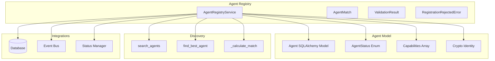
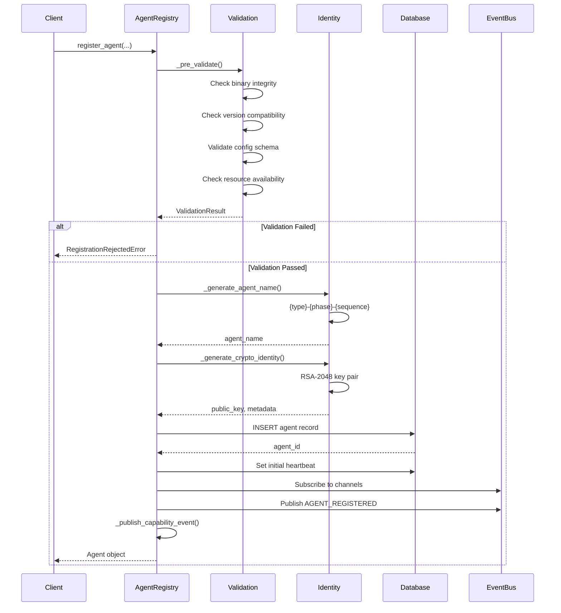
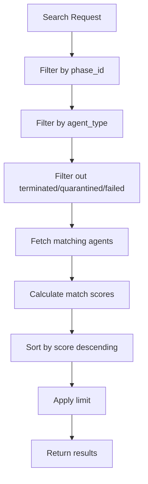
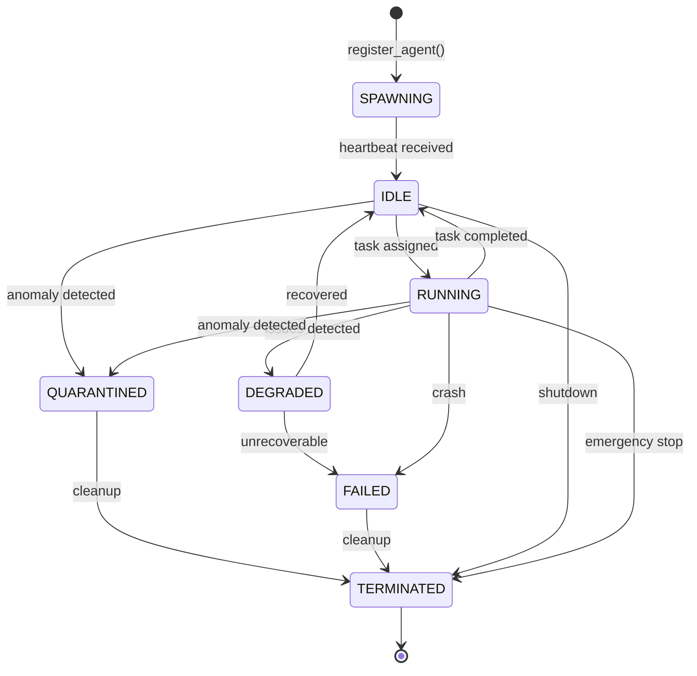

# Agent Registry Design

> **Date**: 2025-07-20 | **Status**: Active | **Version**: 1.0 | **Owner**: Deep Docs Pipeline
> **Source**: Generated from codebase analysis | **Cross-links**: See Related Documents section

## Overview

The Agent Registry provides comprehensive agent lifecycle management for the OmoiOS platform, including registration, discovery, capability management, and health tracking. It supports multiple agent types (exploration, implementation, validation) with cryptographic identity assignment and event-driven notifications.

## Architecture



## Key Components

### AgentRegistryService

`backend/omoi_os/services/agent_registry.py:58-616`

Core registry service providing:
- Multi-step agent registration protocol
- Capability-aware agent discovery
- Agent status and metadata updates
- Cryptographic identity management

### Agent Model

`backend/omoi_os/models/agent.py:20-134`

```python
class Agent(Base):
    """Agent represents a registered worker, monitor, watchdog, or guardian agent."""
    
    __tablename__ = "agents"
    
    id: Mapped[str] = mapped_column(String, primary_key=True)
    agent_name: Mapped[Optional[str]] = mapped_column(String(255), index=True)
    agent_type: Mapped[str] = mapped_column(String(50), nullable=False, index=True)
    phase_id: Mapped[Optional[str]] = mapped_column(String(50), index=True)
    status: Mapped[str] = mapped_column(String(50), nullable=False, index=True)
    capabilities: Mapped[list[str]] = mapped_column(PG_ARRAY(String(100)))
    capacity: Mapped[int] = mapped_column(Integer, nullable=False, default=1)
    health_status: Mapped[str] = mapped_column(String(50), default="unknown")
    tags: Mapped[Optional[list[str]]] = mapped_column(PG_ARRAY(String(50)))
    last_heartbeat: Mapped[Optional[datetime]] = mapped_column(DateTime(timezone=True))
    
    # Enhanced fields
    crypto_public_key: Mapped[Optional[str]] = mapped_column(Text)
    crypto_identity_metadata: Mapped[Optional[dict]] = mapped_column(JSONB)
    agent_metadata: Mapped[Optional[dict]] = mapped_column(JSONB, name="metadata")
    registered_by: Mapped[Optional[str]] = mapped_column(String(255))
    
    # Anomaly detection
    anomaly_score: Mapped[Optional[float]] = mapped_column(Float, index=True)
    consecutive_anomalous_readings: Mapped[int] = mapped_column(Integer, default=0)
```

### AgentStatus Enum

`backend/omoi_os/models/agent_status.py`

```python
class AgentStatus(Enum):
    """Agent lifecycle states per REQ-ALM-004."""
    
    SPAWNING = "spawning"      # Initial registration, not ready
    IDLE = "idle"              # Ready for task assignment
    RUNNING = "running"        # Actively executing task
    DEGRADED = "degraded"      # Reduced capacity, issues detected
    FAILED = "failed"          # Terminal failure state
    QUARANTINED = "quarantined"  # Isolated due to anomalies
    TERMINATED = "terminated"   # Clean shutdown
```

## Agent Registration

### Multi-Step Registration Protocol

`backend/omoi_os/services/agent_registry.py:75-213`



### Registration Parameters

`backend/omoi_os/services/agent_registry.py:75-88`

```python
def register_agent(
    self,
    *,
    agent_type: str,                    # worker, monitor, watchdog, guardian
    phase_id: Optional[str],           # Phase assignment for workers
    capabilities: List[str],            # Tools and skills available
    capacity: int = 1,                   # Concurrent task capacity
    status: str = AgentStatus.IDLE.value,
    tags: Optional[List[str]] = None,  # Organizational tags
    config: Optional[Dict[str, Any]] = None,  # Agent configuration
    resource_requirements: Optional[Dict[str, Any]] = None,
    binary_path: Optional[str] = None,  # Path to agent binary
    version: Optional[str] = None,      # Agent version
) -> Agent:
```

### Pre-Registration Validation

`backend/omoi_os/services/agent_registry.py:424-491`

```python
def _pre_validate(
    self,
    agent_type: str,
    capabilities: List[str],
    resource_requirements: Optional[Dict[str, Any]],
    config: Optional[Dict[str, Any]],
    binary_path: Optional[str],
    version: Optional[str],
) -> ValidationResult:
    """
    Pre-registration validation per REQ-ALM-001 Step 1.
    
    Validates:
    1. Binary integrity (if binary_path provided)
    2. Version compatibility
    3. Configuration schema
    4. Resource availability
    """
```

## Agent Types

### Type Classification

| Type | Purpose | Phase Assignment | Typical Capabilities |
|------|---------|------------------|---------------------|
| `exploration` | Codebase analysis, discovery | EXPLORE | `read_file`, `search_code`, `analyze_structure` |
| `implementation` | Feature development | IMPLEMENTATION | `write_file`, `edit_code`, `run_tests` |
| `validation` | Testing and verification | VERIFICATION | `run_tests`, `check_coverage`, `validate_specs` |
| `worker` | General task execution | Any | Task-specific capabilities |
| `monitor` | System health tracking | N/A | `collect_metrics`, `detect_anomalies` |
| `watchdog` | Failure detection | N/A | `heartbeat_monitor`, `stale_detection` |
| `guardian` | Emergency intervention | N/A | `cancel_task`, `reallocate_capacity` |

### Agent Type Patterns

```python
# Exploration agent
exploration_agent = registry.register_agent(
    agent_type="exploration",
    phase_id="PHASE_EXPLORE",
    capabilities=["read_file", "search_code", "analyze_structure", "git_log"],
    capacity=3,
    tags=["discovery", "analysis"],
)

# Implementation agent
implementation_agent = registry.register_agent(
    agent_type="implementation",
    phase_id="PHASE_IMPLEMENTATION",
    capabilities=["write_file", "edit_code", "run_tests", "git_commit"],
    capacity=1,  # Focus on single task
    tags=["coding", "feature-work"],
)

# Validation agent
validation_agent = registry.register_agent(
    agent_type="validation",
    phase_id="PHASE_VERIFICATION",
    capabilities=["run_tests", "check_coverage", "static_analysis", "lint"],
    capacity=5,  # Can validate multiple components
    tags=["testing", "quality"],
)
```

## Capability Cards

### Capability System

`backend/omoi_os/services/agent_registry.py:42-48`

```python
@dataclass(frozen=True)
class AgentMatch:
    """Discovery result wrapper."""
    
    agent: Agent
    match_score: float
    matched_capabilities: List[str]
```

### Capability Matching

`backend/omoi_os/services/agent_registry.py:390-403`

```python
def _calculate_match(self, agent: Agent, required: List[str]) -> AgentMatch:
    """Calculate match score between agent capabilities and requirements."""
    agent_caps = self._normalize_tokens(agent.capabilities or [])
    overlap = sorted(set(required) & set(agent_caps))
    coverage = len(overlap) / len(required) if required else 0.0
    
    # Scoring bonuses
    availability_bonus = 0.2 if agent.status == AgentStatus.IDLE.value else 0.0
    health_bonus = 0.2 if agent.health_status == "healthy" else 0.0
    capacity_bonus = min(agent.capacity, 5) * 0.05
    
    score = coverage + availability_bonus + health_bonus + capacity_bonus
    return AgentMatch(agent=agent, match_score=score, matched_capabilities=overlap)
```

### Capability Discovery

`backend/omoi_os/services/agent_registry.py:317-368`

```python
def search_agents(
    self,
    *,
    required_capabilities: Optional[List[str]] = None,
    phase_id: Optional[str] = None,
    agent_type: Optional[str] = None,
    limit: int = 5,
    include_degraded: bool = False,
) -> List[dict]:
    """
    Search for agents ranked by capability overlap and availability.
    
    Returns agents sorted by match_score (highest first).
    """
```

## Agent Discovery

### Search Filters

```python
# Find agents for exploration work
exploration_agents = registry.search_agents(
    required_capabilities=["read_file", "search_code"],
    agent_type="exploration",
    phase_id="PHASE_EXPLORE",
    limit=3,
)

# Find any available agent with specific skills
available_agents = registry.search_agents(
    required_capabilities=["write_file", "edit_code"],
    include_degraded=False,  # Only healthy agents
    limit=10,
)

# Get best single agent for task
best_agent = registry.find_best_agent(
    required_capabilities=["run_tests", "check_coverage"],
    agent_type="validation",
)
```

### Discovery Algorithm



## Lifecycle Management

### Status Transitions



### Status Management

`backend/omoi_os/services/agent_registry.py:215-311`

```python
def update_agent(
    self,
    agent_id: str,
    *,
    capabilities: Optional[List[str]] = None,
    capacity: Optional[int] = None,
    status: Optional[str] = None,
    tags: Optional[List[str]] = None,
    health_status: Optional[str] = None,
) -> Optional[Agent]:
    """Update mutable agent metadata."""

def toggle_availability(self, agent_id: str, available: bool) -> Optional[Agent]:
    """Mark an agent as available (idle) or unavailable (degraded)."""
```

### Heartbeat Protocol

`backend/omoi_os/models/agent.py:57-66`

```python
# Enhanced heartbeat protocol fields (REQ-ALM-002, REQ-FT-HB-003)
sequence_number: Mapped[int] = mapped_column(
    Integer, nullable=False, default=0
)  # Monotonically increasing sequence number

last_expected_sequence: Mapped[int] = mapped_column(
    Integer, nullable=False, default=0
)  # For gap detection

consecutive_missed_heartbeats: Mapped[int] = mapped_column(
    Integer, nullable=False, default=0
)  # For escalation ladder
```

## Cryptographic Identity

### Identity Generation

`backend/omoi_os/services/agent_registry.py:509-557`

```python
def _generate_crypto_identity(self, agent_id: str) -> Dict[str, Any]:
    """
    Generate cryptographic identity per REQ-ALM-001 Step 2.
    
    Returns:
        {
            "public_key": str,  # PEM-encoded RSA public key
            "metadata": {
                "key_id": str,
                "algorithm": "RSA-2048",
                "created_at": str,
            }
        }
    """
    try:
        # Generate RSA key pair
        private_key = rsa.generate_private_key(
            public_exponent=65537,
            key_size=2048,
        )
        public_key = private_key.public_key()
        
        # Serialize public key
        public_key_pem = public_key.public_bytes(
            encoding=serialization.Encoding.PEM,
            format=serialization.PublicFormat.SubjectPublicKeyInfo,
        ).decode("utf-8")
        
        return {
            "public_key": public_key_pem,
            "metadata": {
                "key_id": f"{agent_id}-key",
                "algorithm": "RSA-2048",
                "created_at": utc_now().isoformat(),
            },
        }
    except Exception as e:
        logger.warning(f"Could not generate cryptographic identity: {e}")
        return {"public_key": None, "metadata": {"error": str(e)}}
```

### Identity Usage

- **Authentication**: Agents authenticate using their cryptographic identity
- **Message Signing**: Outbound messages can be signed for verification
- **Audit Trail**: All actions linked to agent identity
- **Trust Establishment**: Public keys distributed to verification services

## Event Integration

### Registration Events

`backend/omoi_os/services/agent_registry.py:195-212`

```python
# Publish registration event
if self.event_bus:
    self.event_bus.publish(
        SystemEvent(
            event_type="AGENT_REGISTERED",
            entity_type="agent",
            entity_id=agent_id,
            payload={
                "agent_id": agent_id,
                "agent_name": agent_name,
                "agent_type": agent_type,
                "phase_id": phase_id,
                "capabilities": normalized_caps,
            },
        )
    )

# Publish capability event
self._publish_capability_event(agent_id, normalized_caps)
```

### Capability Update Events

`backend/omoi_os/services/agent_registry.py:405-418`

```python
def _publish_capability_event(self, agent_id: str, capabilities: List[str]) -> None:
    """Publish capability update event."""
    if not self.event_bus:
        return
    
    event = SystemEvent(
        event_type="agent.capability.updated",
        entity_type="agent",
        entity_id=agent_id,
        payload={
            "agent_id": agent_id,
            "capabilities": capabilities,
        },
    )
    self.event_bus.publish(event)
```

## Configuration

### Environment Variables

| Variable | Description | Default |
|----------|-------------|---------|
| `AGENT_REGISTRATION_TIMEOUT` | Initial heartbeat timeout (seconds) | 60 |
| `AGENT_CRYPTO_ENABLED` | Enable cryptographic identity | true |
| `AGENT_DEFAULT_CAPACITY` | Default concurrent task capacity | 1 |
| `AGENT_NAME_PREFIX` | Agent name prefix pattern | `{type}-{phase}-{sequence}` |

### YAML Configuration

```yaml
# config/base.yaml
agent_registry:
  registration_timeout_seconds: 60
  crypto_enabled: true
  default_capacity: 1
  name_pattern: "{type}-{phase}-{sequence}"
  
  # Capability scoring weights
  scoring:
    coverage_weight: 1.0
    availability_bonus: 0.2
    health_bonus: 0.2
    capacity_multiplier: 0.05
```

## API Reference

### Core Methods

#### register_agent

`backend/omoi_os/services/agent_registry.py:75-213`

```python
def register_agent(
    self,
    *,
    agent_type: str,
    phase_id: Optional[str],
    capabilities: List[str],
    capacity: int = 1,
    status: str = AgentStatus.IDLE.value,
    tags: Optional[List[str]] = None,
    config: Optional[Dict[str, Any]] = None,
    resource_requirements: Optional[Dict[str, Any]] = None,
    binary_path: Optional[str] = None,
    version: Optional[str] = None,
) -> Agent:
    """
    Register a new agent using multi-step protocol per REQ-ALM-001.
    
    Steps:
    1. Pre-registration validation
    2. Identity assignment (UUID, name, crypto)
    3. Registry entry creation
    4. Event bus subscription
    5. Initial heartbeat timestamp
    """
```

#### search_agents

`backend/omoi_os/services/agent_registry.py:317-368`

```python
def search_agents(
    self,
    *,
    required_capabilities: Optional[List[str]] = None,
    phase_id: Optional[str] = None,
    agent_type: Optional[str] = None,
    limit: int = 5,
    include_degraded: bool = False,
) -> List[dict]:
    """
    Search for agents ranked by capability overlap and availability.
    
    Returns list of dicts with:
    - agent: Agent object
    - match_score: float (0.0 - 1.0+)
    - matched_capabilities: List[str]
    """
```

#### find_best_agent

`backend/omoi_os/services/agent_registry.py:370-384`

```python
def find_best_agent(
    self,
    *,
    required_capabilities: Optional[List[str]] = None,
    phase_id: Optional[str] = None,
    agent_type: Optional[str] = None,
) -> Optional[dict]:
    """Return the top-ranked agent for the given criteria."""
```

#### update_agent

`backend/omoi_os/services/agent_registry.py:215-311`

```python
def update_agent(
    self,
    agent_id: str,
    *,
    capabilities: Optional[List[str]] = None,
    capacity: Optional[int] = None,
    status: Optional[str] = None,
    tags: Optional[List[str]] = None,
    health_status: Optional[str] = None,
) -> Optional[Agent]:
    """Update mutable agent metadata."""
```

## Database Schema

```sql
-- Agents table
CREATE TABLE agents (
    id VARCHAR PRIMARY KEY,
    agent_name VARCHAR(255),
    agent_type VARCHAR(50) NOT NULL,
    phase_id VARCHAR(50),
    status VARCHAR(50) NOT NULL,
    capabilities VARCHAR(100)[],
    capacity INTEGER NOT NULL DEFAULT 1,
    health_status VARCHAR(50) NOT NULL DEFAULT 'unknown',
    tags VARCHAR(50)[],
    last_heartbeat TIMESTAMP WITH TIME ZONE,
    
    -- Heartbeat protocol
    sequence_number INTEGER NOT NULL DEFAULT 0,
    last_expected_sequence INTEGER NOT NULL DEFAULT 0,
    consecutive_missed_heartbeats INTEGER NOT NULL DEFAULT 0,
    
    -- Validation
    kept_alive_for_validation BOOLEAN NOT NULL DEFAULT FALSE,
    
    -- Anomaly detection
    anomaly_score FLOAT,
    consecutive_anomalous_readings INTEGER NOT NULL DEFAULT 0,
    
    -- Registration
    crypto_public_key TEXT,
    crypto_identity_metadata JSONB,
    metadata JSONB,
    registered_by VARCHAR(255),
    
    created_at TIMESTAMP WITH TIME ZONE NOT NULL,
    updated_at TIMESTAMP WITH TIME ZONE NOT NULL
);

-- Indexes
CREATE INDEX idx_agents_type ON agents(agent_type);
CREATE INDEX idx_agents_status ON agents(status);
CREATE INDEX idx_agents_phase ON agents(phase_id);
CREATE INDEX idx_agents_anomaly ON agents(anomaly_score);
CREATE INDEX idx_agents_heartbeat ON agents(last_heartbeat);
```

## Testing Strategy

### Unit Tests

```python
# Test agent registration
def test_register_agent():
    registry = AgentRegistryService(db, event_bus)
    agent = registry.register_agent(
        agent_type="worker",
        phase_id="PHASE_IMPLEMENTATION",
        capabilities=["write_file", "edit_code"],
        capacity=2,
    )
    assert agent.id is not None
    assert agent.agent_name.startswith("worker-implementation-")
    assert agent.status == "spawning"
    assert len(agent.capabilities) == 2

# Test capability matching
def test_capability_matching():
    registry = AgentRegistryService(db)
    
    # Register agents with different capabilities
    agent1 = registry.register_agent(
        agent_type="worker",
        phase_id="PHASE_EXPLORE",
        capabilities=["read_file", "search_code"],
    )
    agent2 = registry.register_agent(
        agent_type="worker",
        phase_id="PHASE_IMPLEMENTATION",
        capabilities=["write_file", "edit_code", "run_tests"],
    )
    
    # Search for implementation capabilities
    matches = registry.search_agents(
        required_capabilities=["write_file", "edit_code"],
        phase_id="PHASE_IMPLEMENTATION",
    )
    
    assert len(matches) == 1
    assert matches[0]["agent"].id == agent2.id
    assert matches[0]["match_score"] > 0.8

# Test agent discovery ranking
def test_agent_ranking():
    registry = AgentRegistryService(db)
    
    # Create agents with different states
    idle_agent = registry.register_agent(
        agent_type="worker",
        capabilities=["read_file"],
        status="idle",
    )
    running_agent = registry.register_agent(
        agent_type="worker",
        capabilities=["read_file"],
        status="running",
    )
    
    # Search should rank idle agent higher
    matches = registry.search_agents(required_capabilities=["read_file"])
    assert matches[0]["agent"].id == idle_agent.id
    assert matches[0]["match_score"] > matches[1]["match_score"]
```

### Integration Tests

```python
# Test event publishing
def test_registration_event_published():
    event_bus = MockEventBus()
    registry = AgentRegistryService(db, event_bus)
    
    agent = registry.register_agent(
        agent_type="worker",
        capabilities=["test"],
    )
    
    # Verify event was published
    assert event_bus.publish.called
    event = event_bus.publish.call_args[0][0]
    assert event.event_type == "AGENT_REGISTERED"
    assert event.entity_id == agent.id

# Test cryptographic identity
def test_crypto_identity_generation():
    registry = AgentRegistryService(db)
    
    agent = registry.register_agent(
        agent_type="worker",
        capabilities=["test"],
    )
    
    assert agent.crypto_public_key is not None
    assert "BEGIN PUBLIC KEY" in agent.crypto_public_key
    assert agent.crypto_identity_metadata["algorithm"] == "RSA-2048"
```

## Related Documents

- Agent Status Manager - Status transition handling
- Agent Health Service - Health monitoring and heartbeats
- [Monitor Service](./monitor_service.md) - Anomaly detection and alerting
- [Database Schema](../../architecture/11-database-schema.md) - Agent table definitions
- Agent Lifecycle Requirements - REQ-ALM specifications

## Future Enhancements

1. **Agent Federation**: Cross-cluster agent discovery and sharing
2. **Capability Learning**: Auto-detect capabilities from agent behavior
3. **Reputation System**: Track agent success rates for better ranking
4. **Agent Templates**: Pre-configured agent profiles for common tasks
5. **Dynamic Pricing**: Cost-based agent selection for budget optimization
