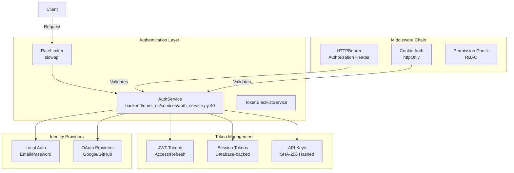
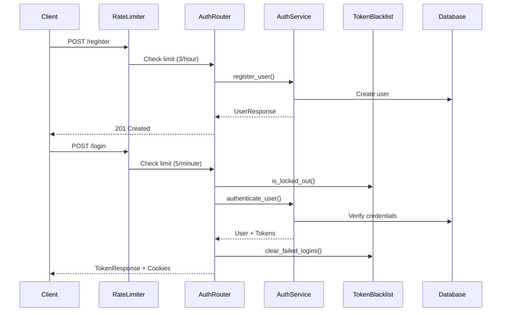

# Authentication Service Design

> **Date**: 2025-07-20 | **Status**: Active | **Version**: 1.0 | **Owner**: Deep Docs Pipeline
> **Source**: Generated from codebase analysis | **Cross-links**: See Related Documents section

## Overview

The Authentication Service provides comprehensive identity management and access control for the OmoiOS platform. It implements a multi-layered security architecture combining JWT-based session management, API key authentication for programmatic access, OAuth integration for third-party providers, and fine-grained permission checking through middleware chains.

## Architecture



## Core Components

### AuthService

`backend/omoi_os/services/auth_service.py:40-526`

The central authentication service providing token lifecycle management, user operations, and credential verification.

```python
class AuthService:
    """Service for authentication operations."""

    def __init__(
        self,
        db: AsyncSession,
        jwt_secret: str,
        jwt_algorithm: str = "HS256",
        access_token_expire_minutes: int = 15,
        refresh_token_expire_days: int = 7,
    )
```

#### Token Operations

**Access Token Creation** (`auth_service.py:110-129`):
```python
def create_access_token(
    self, user_id: UUID, expires_delta: Optional[timedelta] = None
) -> Tuple[str, str]:
    """Create JWT access token. Returns (token, jti)."""
    if expires_delta:
        expire = utc_now() + expires_delta
    else:
        expire = utc_now() + timedelta(minutes=self.access_token_expire_minutes)

    jti = str(uuid4())
    payload = {
        "sub": str(user_id),
        "exp": expire.timestamp(),
        "iat": utc_now().timestamp(),
        "type": "access",
        "jti": jti,
    }

    token = jwt.encode(payload, self.jwt_secret, algorithm=self.jwt_algorithm)
    return token, jti
```

**Token Verification** (`auth_service.py:152-174`):
```python
def verify_token(
    self, token: str, token_type: str = "access"
) -> Optional[TokenData]:
    try:
        payload = jwt.decode(
            token, self.jwt_secret, algorithms=[self.jwt_algorithm]
        )

        user_id = UUID(payload.get("sub"))
        payload_type = payload.get("type")

        if payload_type != token_type:
            return None

        return TokenData(
            user_id=user_id,
            token_type=payload_type,
            jti=payload.get("jti"),
            iat=payload.get("iat"),
        )

    except (JWTError, ValueError, KeyError):
        return None
```

### Password Security

**Password Hashing** (`auth_service.py:21-30`):
```python
def _hash_password(password: str) -> str:
    """Hash password using bcrypt."""
    return bcrypt.hashpw(password.encode("utf-8"), bcrypt.gensalt()).decode("utf-8")

def _verify_password(plain_password: str, hashed_password: str) -> bool:
    """Verify password against bcrypt hash."""
    return bcrypt.checkpw(
        plain_password.encode("utf-8"), hashed_password.encode("utf-8")
    )
```

**Password Strength Validation** (`auth_service.py:66-108`):
```python
def validate_password_strength(self, password: str) -> Tuple[bool, Optional[str]]:
    if len(password) < 8:
        return False, "Password must be at least 8 characters"

    if not any(c.isupper() for c in password):
        return False, "Password must contain at least one uppercase letter"

    if not any(c.islower() for c in password):
        return False, "Password must contain at least one lowercase letter"

    if not any(c.isdigit() for c in password):
        return False, "Password must contain at least one digit"

    if not re.search(r'[!@#$%^&*(),.?":{}|<>\[\]\~`_+\-=/;\']', password):
        return False, "Password must contain at least one special character"

    # Reject extremely common passwords (case-insensitive)
    common = {"password", "12345678", "qwerty123", "password123", ...}
    if password.lower() in common:
        return False, "This password is too common. Please choose a stronger one."

    return True, None
```

### Session Management

**Session Creation** (`auth_service.py:280-306`):
```python
async def create_session(
    self,
    user_id: UUID,
    ip_address: Optional[str] = None,
    user_agent: Optional[str] = None,
) -> Session:
    """Create a new session for user."""
    # Generate session token
    token = secrets.token_urlsafe(32)
    token_hash = hashlib.sha256(token.encode()).hexdigest()

    # Create session
    expires_at = utc_now() + timedelta(days=self.refresh_token_expire_days)

    session = Session(
        user_id=user_id,
        token_hash=token_hash,
        ip_address=ip_address,
        user_agent=user_agent,
        expires_at=expires_at,
    )

    self.db.add(session)
    await self.db.commit()
    await self.db.refresh(session)

    return session
```

**Session Verification** (`auth_service.py:308-327`):
```python
async def verify_session_token(self, token: str) -> Optional[User]:
    """Verify session token and return user."""
    token_hash = hashlib.sha256(token.encode()).hexdigest()

    result = await self.db.execute(
        select(Session)
        .where(Session.token_hash == token_hash, Session.expires_at > utc_now())
        .join(User)
        .where(User.is_active.is_(True), User.deleted_at.is_(None))
    )
    session = result.scalar_one_or_none()

    if not session:
        return None

    # Get user
    user_result = await self.db.execute(
        select(User).where(User.id == session.user_id)
    )
    return user_result.scalar_one_or_none()
```

### API Key Management

**API Key Generation** (`auth_service.py:345-357`):
```python
def generate_api_key(self) -> Tuple[str, str, str]:
    """
    Generate API key.

    Returns:
        Tuple of (full_key, prefix, hashed_key)
    """
    random_part = secrets.token_urlsafe(32)
    full_key = f"sk_live_{random_part}"
    prefix = full_key[:16]
    hashed_key = hashlib.sha256(full_key.encode()).hexdigest()

    return full_key, prefix, hashed_key
```

**API Key Verification** (`auth_service.py:398-436`):
```python
async def verify_api_key(self, key: str) -> Optional[Tuple[User, APIKey]]:
    """
    Verify API key and return associated user.

    Returns:
        Tuple of (User, APIKey) if valid, None if invalid
    """
    hashed_key = hashlib.sha256(key.encode()).hexdigest()

    result = await self.db.execute(
        select(APIKey)
        .where(APIKey.hashed_key == hashed_key, APIKey.is_active.is_(True))
        .where((APIKey.expires_at.is_(None)) | (APIKey.expires_at > utc_now()))
    )
    api_key = result.scalar_one_or_none()

    if not api_key or not api_key.user_id:
        return None

    # Get user
    user_result = await self.db.execute(
        select(User).where(
            User.id == api_key.user_id,
            User.is_active.is_(True),
            User.deleted_at.is_(None),
        )
    )
    user = user_result.scalar_one_or_none()

    if not user:
        return None

    # Update last_used_at
    await self.db.execute(
        update(APIKey).where(APIKey.id == api_key.id).values(last_used_at=utc_now())
    )
    await self.db.commit()

    return user, api_key
```

## API Routes

### Authentication Endpoints

`backend/omoi_os/api/routes/auth.py:39-835`



### Route Definitions

| Endpoint | Method | Rate Limit | Description |
|----------|--------|------------|-------------|
| `/register` | POST | 3/hour | User registration with email verification |
| `/login` | POST | 5/minute | Authenticate and receive tokens |
| `/refresh` | POST | - | Refresh access token with rotation |
| `/logout` | POST | - | Invalidate current token |
| `/verify-email` | POST | 10/hour | Verify email with token |
| `/forgot-password` | POST | 3/hour | Request password reset |
| `/reset-password` | POST | - | Reset password with token |
| `/change-password` | POST | - | Change password (authenticated) |
| `/api-keys` | POST/GET | - | Create/list API keys |
| `/api-keys/{id}` | DELETE | - | Revoke API key |

### Token Refresh Flow

`backend/omoi_os/api/routes/auth.py:215-303`

```python
@router.post("/refresh", response_model=TokenResponse)
async def refresh_token(
    request: Request,
    body: Optional[RefreshTokenRequest] = None,
    db: AsyncSession = Depends(get_db_session),
    auth_service: AuthService = Depends(get_auth_service),
):
    """
    Refresh access token using refresh token.

    Accepts refresh token from request body OR httpOnly cookie.
    Implements token rotation: old refresh token is blacklisted,
    new access + refresh token pair is issued.
    """
    # Get refresh token from body or cookie
    refresh_token_value = None
    if body and body.refresh_token:
        refresh_token_value = body.refresh_token
    if not refresh_token_value:
        refresh_token_value = get_refresh_token_from_request(request)

    # Verify refresh token
    token_data = auth_service.verify_token(refresh_token_value, token_type="refresh")

    # Check if blacklisted (token reuse detection)
    if token_data.jti and await blacklist.is_blacklisted(token_data.jti):
        # Potential token reuse attack — blacklist ALL user tokens
        await blacklist.blacklist_all_user_tokens(str(token_data.user_id))
        raise HTTPException(
            status_code=status.HTTP_401_UNAUTHORIZED,
            detail="Token has been revoked. Please log in again.",
        )

    # Blacklist the old refresh token (rotation)
    if blacklist and token_data.jti:
        refresh_ttl = auth_service.refresh_token_expire_days * 86400
        await blacklist.blacklist_token(token_data.jti, ttl_seconds=refresh_ttl)

    # Create new tokens
    access_token, _access_jti = auth_service.create_access_token(user_id)
    new_refresh_token, _refresh_jti = auth_service.create_refresh_token(user_id)

    # Return tokens in body and set httpOnly cookies
    response = JSONResponse(content=response_data.model_dump())
    set_auth_cookies(response, access_token, new_refresh_token)
    return response
```

## Middleware Chain

### HTTPBearer Authentication

`backend/omoi_os/api/routes/auth.py:36`

```python
security = HTTPBearer()
```

The HTTPBearer scheme extracts the JWT token from the `Authorization: Bearer <token>` header.

### Cookie Authentication

`backend/omoi_os/api/routes/auth.py:201-211`

```python
# Set httpOnly cookies for browser clients
from fastapi.responses import JSONResponse
from omoi_os.api.cookie_auth import set_auth_cookies

response_data = TokenResponse(
    access_token=access_token,
    refresh_token=refresh_token,
    expires_in=auth_service.access_token_expire_minutes * 60,
)
response = JSONResponse(content=response_data.model_dump())
set_auth_cookies(response, access_token, refresh_token)
return response
```

### Rate Limiting

`backend/omoi_os/api/routes/auth.py:16-42`

```python
from slowapi import Limiter
from slowapi.util import get_remote_address

limiter = Limiter(key_func=get_remote_address)

@router.post("/register", response_model=UserResponse, status_code=status.HTTP_201_CREATED)
@limiter.limit("3/hour")
async def register(...)
```

### Permission Checking

```python
async def get_current_user(
    credentials: HTTPAuthorizationCredentials = Depends(security),
    db: AsyncSession = Depends(get_db_session),
) -> User:
    """Get current authenticated user from JWT token."""
    token = credentials.credentials
    auth_service = AuthService(db=db, jwt_secret=settings.jwt_secret_key)
    token_data = auth_service.verify_token(token)

    if not token_data:
        raise HTTPException(
            status_code=status.HTTP_401_UNAUTHORIZED,
            detail="Invalid authentication credentials",
        )

    user = await auth_service.get_user_by_id(token_data.user_id)
    if not user:
        raise HTTPException(
            status_code=status.HTTP_401_UNAUTHORIZED,
            detail="User not found",
        )

    return user
```

## Data Models

### Session Model

`backend/omoi_os/models/auth.py:28-73`

```python
class Session(Base):
    """User session for web/mobile authentication."""

    __tablename__ = "sessions"

    id: Mapped[UUID] = mapped_column(
        PGUUID(as_uuid=True), primary_key=True, default=uuid4
    )
    user_id: Mapped[UUID] = mapped_column(
        PGUUID(as_uuid=True),
        ForeignKey("users.id", ondelete="CASCADE"),
        nullable=False,
        index=True,
    )

    # Token data
    token_hash: Mapped[str] = mapped_column(
        String(255),
        nullable=False,
        unique=True,
        index=True,
        comment="SHA-256 hash of session token",
    )

    # Client info
    ip_address: Mapped[Optional[str]] = mapped_column(String(45), nullable=True)
    user_agent: Mapped[Optional[str]] = mapped_column(Text, nullable=True)

    # Expiration
    expires_at: Mapped[datetime] = mapped_column(
        DateTime(timezone=True), nullable=False, index=True
    )

    created_at: Mapped[datetime] = mapped_column(
        DateTime(timezone=True), nullable=False, default=utc_now
    )
```

### API Key Model

`backend/omoi_os/models/auth.py:76-166`

```python
class APIKey(Base):
    """API key for programmatic access (users and agents)."""

    __tablename__ = "api_keys"

    id: Mapped[UUID] = mapped_column(
        PGUUID(as_uuid=True), primary_key=True, default=uuid4
    )

    # Owner (user OR agent, enforced by CHECK constraint)
    user_id: Mapped[Optional[UUID]] = mapped_column(
        PGUUID(as_uuid=True),
        ForeignKey("users.id", ondelete="CASCADE"),
        nullable=True,
        index=True,
    )
    agent_id: Mapped[Optional[str]] = mapped_column(
        String,
        ForeignKey("agents.id", ondelete="CASCADE"),
        nullable=True,
        index=True,
        comment="VARCHAR to match agents.id type",
    )

    # Key data
    name: Mapped[str] = mapped_column(
        String(255), nullable=False, comment="User-defined label for the key"
    )
    key_prefix: Mapped[str] = mapped_column(
        String(16),
        nullable=False,
        index=True,
        comment="First 8-16 chars for identification (e.g., 'sk_live_abc')",
    )
    hashed_key: Mapped[str] = mapped_column(
        String(255), nullable=False, unique=True, comment="SHA-256 hash of full API key"
    )
    scopes: Mapped[list[str]] = mapped_column(
        JSONB, nullable=False, default=list, comment="Permission scopes for this key"
    )

    # Status
    is_active: Mapped[bool] = mapped_column(Boolean, default=True, nullable=False)
    last_used_at: Mapped[Optional[datetime]] = mapped_column(
        DateTime(timezone=True), nullable=True
    )
    expires_at: Mapped[Optional[datetime]] = mapped_column(
        DateTime(timezone=True), nullable=True
    )

    __table_args__ = (
        CheckConstraint(
            "(user_id IS NOT NULL AND agent_id IS NULL) OR "
            "(user_id IS NULL AND agent_id IS NOT NULL)",
            name="check_key_user_or_agent",
        ),
        Index("idx_api_keys_user", "user_id", postgresql_where=text("user_id IS NOT NULL")),
        Index("idx_api_keys_agent", "agent_id", postgresql_where=text("agent_id IS NOT NULL")),
        Index("idx_api_keys_prefix", "key_prefix"),
        Index("idx_api_keys_hash", "hashed_key"),
        Index("idx_api_keys_active", "is_active", postgresql_where=text("is_active = true")),
    )
```

## Security Features

### Token Blacklisting

The TokenBlacklist service maintains a Redis-backed store of revoked tokens:

- **Access tokens**: Blacklisted on logout for remaining lifetime (15 minutes max)
- **Refresh tokens**: Blacklisted on rotation to prevent reuse attacks
- **Token reuse detection**: If a refresh token is used twice, all user tokens are revoked

### Account Lockout

`backend/omoi_os/api/routes/auth.py:138-159`

```python
# Check account lockout
blacklist = get_token_blacklist()
auth_settings = get_app_settings().auth
if await blacklist.is_locked_out(
    body.email, max_attempts=auth_settings.max_login_attempts
):
    await blacklist.log_auth_event(
        "login_blocked_lockout",
        email=body.email,
        ip_address=client_ip,
        details=f"Account locked after {auth_settings.max_login_attempts} failed attempts",
    )
    raise HTTPException(
        status_code=status.HTTP_429_TOO_MANY_REQUESTS,
        detail="Account temporarily locked due to too many failed login attempts...",
    )
```

### Password Reset Security

- Reset tokens are single-use and expire after 1 hour
- All existing sessions are invalidated on password reset
- Password strength requirements enforced (8+ chars, mixed case, digits, special chars)

## Related Documents

- User Model - User entity definition
- Authorization Service - RBAC and permission system
- Token Blacklist - Token revocation service
- OAuth Integration - Third-party authentication
- [Security Architecture](../../architecture/07-auth-and-security.md) - System-wide security design
