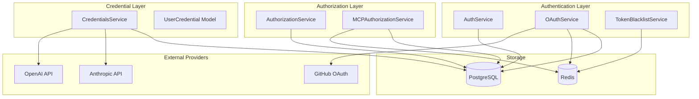
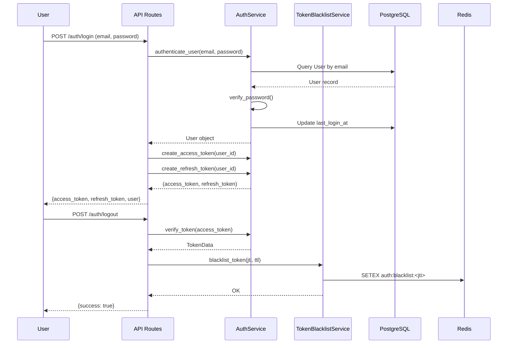
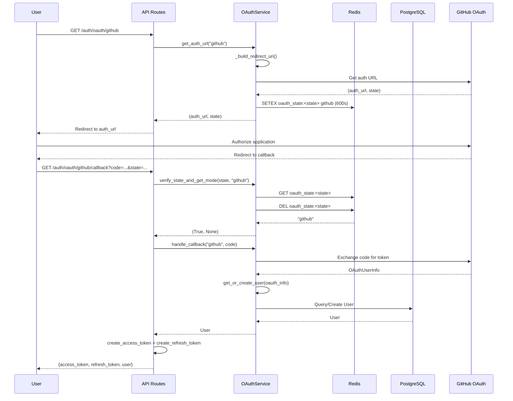
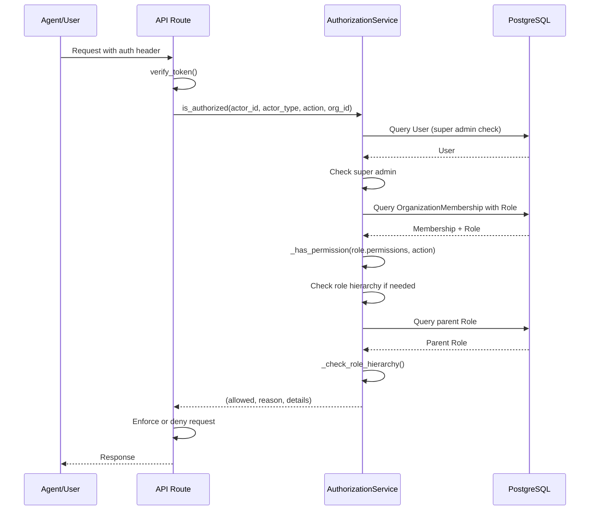
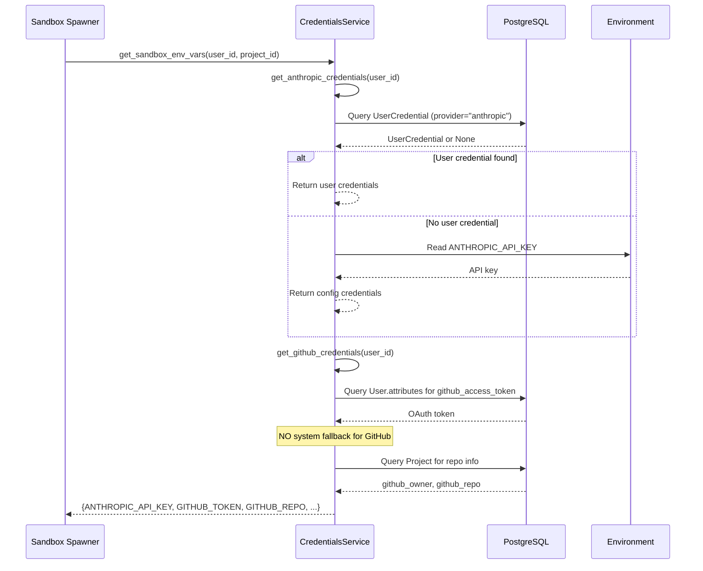
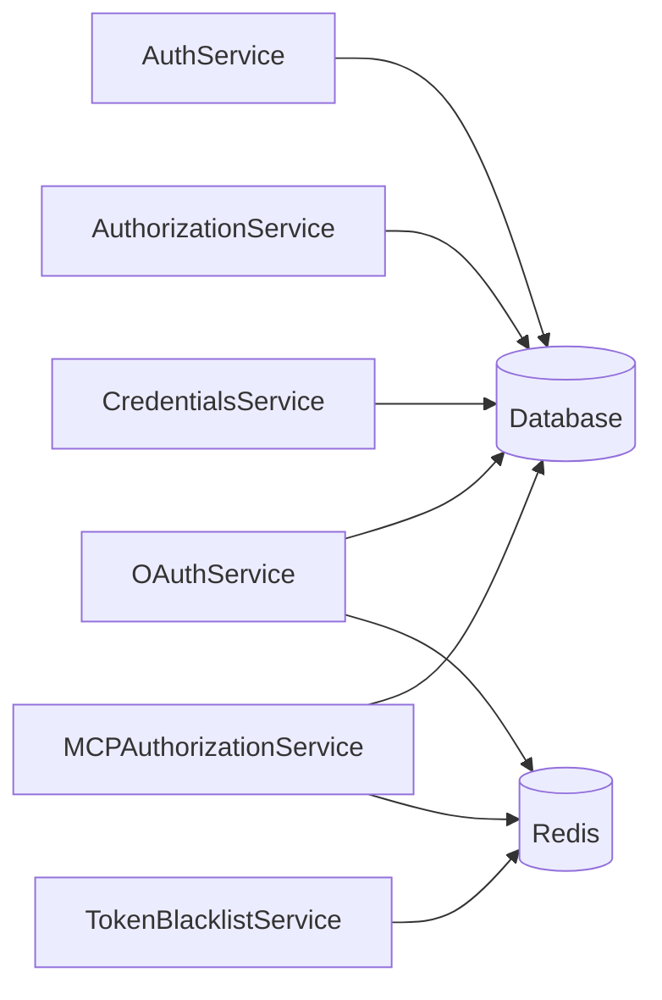

# Authentication & Authorization System Design

**Date**: 2026-04-22  
**Status**: Active  
**Purpose**: Comprehensive design documentation for OmoiOS authentication, authorization, and credential management systems  
**Related Docs**: [Context Validation System](./context-validation-system.md), [Architecture Overview](../../architecture/07-auth-and-security.md)

---

## 1. Overview

The Authentication & Authorization System provides comprehensive identity management, access control, and credential handling for the OmoiOS multi-agent orchestration platform. It supports multiple authentication methods (password-based, OAuth, API keys), implements Role-Based Access Control (RBAC) with hierarchical permissions, and manages external service credentials for sandboxed agent execution.

### 1.1 System Purpose

- **Authentication**: Verify user identity via passwords, OAuth providers (GitHub), or API keys
- **Authorization**: Enforce RBAC permissions with role inheritance and wildcard support
- **Credential Management**: Securely store and retrieve external API keys (Anthropic, OpenAI, GitHub)
- **Token Security**: JWT access/refresh tokens with Redis-based blacklist for logout
- **MCP Authorization**: Per-agent, per-tool authorization for Model Context Protocol tools

### 1.2 Architecture Principles

1. **Security First**: OAuth tokens preferred over API keys, no system fallback for GitHub
2. **Least Privilege**: Hierarchical RBAC with explicit permission grants
3. **Auditability**: All auth events logged with IP tracking and failure monitoring
4. **Scalability**: Redis-backed token blacklisting, cached authorization decisions
5. **Agent-Scoped**: MCP tools require explicit per-agent authorization

---

## 2. Architecture Diagram



---

## 3. Service/Component Matrix

| Component | File | Lines | Purpose | Key Classes |
|-----------|------|-------|---------|-------------|
| AuthService | `auth_service.py` | 526 | Core authentication, JWT tokens, password management | `AuthService`, `TokenData` |
| AuthorizationService | `authorization_service.py` | 275 | RBAC permission checking, role hierarchy | `AuthorizationService`, `ActorType` |
| OAuthService | `oauth_service.py` | 552 | OAuth flow management, provider integration | `OAuthService` |
| TokenBlacklistService | `token_blacklist.py` | 192 | JWT invalidation, account lockout, audit logging | `TokenBlacklistService` |
| CredentialsService | `credentials.py` | 566 | External API key management, sandbox env vars | `CredentialsService`, `AnthropicCredentials`, `GitHubCredentials` |
| MCPAuthorizationService | `mcp_authorization.py` | 372 | Per-agent tool authorization with time-bounded tokens | `MCPAuthorizationService`, `PolicyGrant` |

---

## 4. Detailed Component Sections

### 4.1 AuthService

**File**: `backend/omoi_os/services/auth_service.py:40-526`

Core authentication service handling user registration, password authentication, JWT token lifecycle, and session management.

#### Key Methods

```python
class AuthService:
    def __init__(
        self,
        db: AsyncSession,
        jwt_secret: str,
        jwt_algorithm: str = "HS256",
        access_token_expire_minutes: int = 15,
        refresh_token_expire_days: int = 7,
    )

    # Password operations
    def hash_password(self, password: str) -> str
    def verify_password(self, plain_password: str, hashed_password: str) -> bool
    def validate_password_strength(self, password: str) -> Tuple[bool, Optional[str]]

    # JWT token operations
    def create_access_token(
        self, user_id: UUID, expires_delta: Optional[timedelta] = None
    ) -> Tuple[str, str]  # (token, jti)
    
    def create_refresh_token(
        self, user_id: UUID, expires_delta: Optional[timedelta] = None
    ) -> Tuple[str, str]  # (token, jti)
    
    def verify_token(self, token: str, token_type: str = "access") -> Optional[TokenData]

    # User operations
    async def register_user(
        self, email: str, password: str, full_name: Optional[str] = None,
        department: Optional[str] = None, waitlist_metadata: Optional[dict] = None
    ) -> User
    
    async def authenticate_user(self, email: str, password: str) -> Optional[User]
    
    # Session operations
    async def create_session(
        self, user_id: UUID, ip_address: Optional[str] = None,
        user_agent: Optional[str] = None
    ) -> Session
    
    async def verify_session_token(self, token: str) -> Optional[User]

    # API Key operations
    def generate_api_key(self) -> Tuple[str, str, str]  # (full_key, prefix, hashed_key)
    
    async def create_api_key(
        self, user_id: UUID, name: str, scopes: Optional[list[str]] = None,
        organization_id: Optional[UUID] = None, expires_in_days: Optional[int] = None
    ) -> Tuple[APIKey, str]  # (api_key, full_key)
    
    async def verify_api_key(self, key: str) -> Optional[Tuple[User, APIKey]]

    # Email verification
    def create_verification_token(self, user_id: UUID) -> Tuple[str, str]
    async def verify_email(self, token: str) -> bool

    # Password reset
    def create_reset_token(self, user_id: UUID) -> Tuple[str, str]
    async def reset_password(self, token: str, new_password: str) -> bool
```

#### Password Strength Requirements

- Minimum 8 characters
- At least one uppercase letter
- At least one lowercase letter
- At least one digit
- At least one special character (`!@#$%^&*(),.?":{}|<>[]\~`_+-=/;'`)
- Not in common password blacklist (25+ common passwords rejected)

#### Token Structure

```python
# Access Token Payload
{
    "sub": str(user_id),
    "exp": expire.timestamp(),
    "iat": utc_now().timestamp(),
    "type": "access",
    "jti": str(uuid4())  # Unique token ID for blacklisting
}

# Refresh Token Payload
{
    "sub": str(user_id),
    "exp": expire.timestamp(),
    "iat": utc_now().timestamp(),
    "type": "refresh",
    "jti": str(uuid4())
}
```

---

### 4.2 AuthorizationService

**File**: `backend/omoi_os/services/authorization_service.py:22-275`

Implements RBAC with hierarchical role inheritance and wildcard permission matching.

#### Key Methods

```python
class ActorType(str, Enum):
    USER = "user"
    AGENT = "agent"

class AuthorizationService:
    def __init__(self, db: AsyncSession)

    async def is_authorized(
        self,
        actor_id: UUID,
        actor_type: ActorType,
        action: str,  # e.g., "project:read", "ticket:write"
        organization_id: UUID,
        resource_type: Optional[str] = None,
        resource_id: Optional[UUID] = None,
    ) -> Tuple[bool, str, Dict]  # (allowed, reason, details)

    async def get_user_permissions(
        self, user_id: UUID, organization_id: UUID
    ) -> List[str]

    async def is_organization_member(
        self, actor_id: UUID, actor_type: ActorType, organization_id: UUID
    ) -> bool

    async def is_organization_owner(self, user_id: UUID, organization_id: UUID) -> bool

    async def get_user_organizations(self, user_id: UUID) -> List[Dict]
```

#### Permission Evaluation Priority

1. **Super Admin** (users only): Bypass all checks
2. **Organization Role** (RBAC): Check role permissions with inheritance
3. **Explicit Deny** (future ABAC): Policy-based denials

#### Wildcard Permission Matching

```python
# Permission matching with wildcards
_has_permission(["org:*"], "org:read")        # True
_has_permission(["project:read"], "project:write")  # False
_has_permission(["*:*"], "anything")          # True (super wildcard)
_has_permission(["project:*"], "project:delete")    # True (wildcard)
```

#### Role Hierarchy

Roles support inheritance via `inherits_from` field. Parent role permissions are checked recursively:

```python
# Role hierarchy traversal
async def _check_role_hierarchy(self, role: Role, action: str) -> Dict:
    if self._has_permission(role.permissions, action):
        return {"allowed": True, "roles": [role.name]}
    
    if role.inherits_from:
        parent_role = await self._get_parent_role(role.inherits_from)
        if parent_role:
            parent_check = await self._check_role_hierarchy(parent_role, action)
            if parent_check["allowed"]:
                return {
                    "allowed": True,
                    "roles": [role.name] + parent_check["roles"]
                }
    
    return {"allowed": False, "roles": []}
```

---

### 4.3 OAuthService

**File**: `backend/omoi_os/services/oauth_service.py:31-552`

Manages OAuth authentication flows with Redis-backed state storage.

#### Key Methods

```python
class OAuthService:
    def __init__(
        self,
        db: DatabaseService,
        redis_client: Optional[redis.Redis] = None
    )

    def get_available_providers(self) -> list[dict]
    
    def get_auth_url(self, provider_name: str) -> tuple[str, str]  # (auth_url, state)
    
    def get_connect_auth_url(
        self, provider_name: str, user_id: UUID
    ) -> tuple[str, str]  # (auth_url, state)
    
    def verify_state_and_get_mode(
        self, state: str, provider_name: str
    ) -> tuple[bool, Optional[UUID]]  # (is_valid, user_id_if_connect)
    
    def connect_provider_to_user(
        self, user_id: UUID, oauth_info: OAuthUserInfo
    ) -> bool
    
    async def handle_callback(
        self, provider_name: str, code: str
    ) -> Optional[OAuthUserInfo]
    
    def get_or_create_user(self, oauth_info: OAuthUserInfo) -> User
    
    def get_user_oauth_token(self, user_id: UUID, provider: str) -> Optional[str]
    
    def update_user_oauth_token(
        self, user_id: UUID, provider: str,
        access_token: str, refresh_token: Optional[str] = None
    ) -> bool
    
    def disconnect_provider(self, user_id: UUID, provider: str) -> bool
```

#### OAuth State Management

State stored in Redis with 10-minute TTL:

```python
OAUTH_STATE_PREFIX = "oauth_state:"
OAUTH_STATE_TTL = 600  # 10 minutes

# Login flow state format: "provider"
# Connect flow state format: "connect:provider:user_id"
```

#### Provider Configuration

```python
# OAuth provider config from settings
config = {
    "github": {
        "client_id": "...",
        "client_secret": "...",
        "enabled": True
    }
}
```

---

### 4.4 TokenBlacklistService

**File**: `backend/omoi_os/services/token_blacklist.py:27-192`

Redis-based token invalidation and security monitoring.

#### Key Methods

```python
class TokenBlacklistService:
    def __init__(self, redis_url: str)
    
    async def blacklist_token(self, jti: str, ttl_seconds: int) -> None
    
    async def is_blacklisted(self, jti: str) -> bool
    
    async def blacklist_all_user_tokens(
        self, user_id: str, ttl_seconds: int = 86400
    ) -> None
    
    async def is_user_blacklisted_since(
        self, user_id: str, token_iat: float
    ) -> bool
    
    # Account lockout
    async def record_failed_login(
        self, email: str, window_seconds: int = 900
    ) -> int  # Returns current failure count
    
    async def get_failed_login_count(self, email: str) -> int
    
    async def clear_failed_logins(self, email: str) -> None
    
    async def is_locked_out(self, email: str, max_attempts: int = 5) -> bool
    
    # Audit logging
    async def log_auth_event(
        self,
        event_type: str,  # login_success, login_failed, logout, etc.
        user_id: Optional[str] = None,
        email: Optional[str] = None,
        ip_address: Optional[str] = None,
        details: Optional[str] = None,
    ) -> None
```

#### Redis Key Patterns

```python
_BLACKLIST_PREFIX = "auth:blacklist:"
_LOCKOUT_PREFIX = "auth:lockout:"
_AUDIT_PREFIX = "auth:audit:"

# Examples:
# auth:blacklist:<jti>           - Individual token blacklist
# auth:blacklist:user:<user_id>  - User-level blacklist (all tokens)
# auth:lockout:<email>            - Failed login counter
# auth:audit:log                  - Audit event list (trimmed to 10k entries)
```

---

### 4.5 CredentialsService

**File**: `backend/omoi_os/services/credentials.py:91-566`

Manages external API credentials with user-specific and system fallback support.

#### Key Classes

```python
@dataclass
class AnthropicCredentials:
    api_key: str
    oauth_token: Optional[str] = None  # Preferred for Claude Agent SDK
    base_url: Optional[str] = None
    model: Optional[str] = None
    max_tokens: int = 16384
    context_length: int = 128000
    source: str = "config"  # "config" or "user"

@dataclass
class GitHubCredentials:
    access_token: Optional[str] = None
    username: Optional[str] = None
    source: str = "config"  # "config", "user", or "oauth"

@dataclass
class GenericCredentials:
    provider: str
    api_key: Optional[str] = None
    base_url: Optional[str] = None
    model: Optional[str] = None
    config_data: Dict[str, Any] = field(default_factory=dict)
    source: str = "config"
```

#### Key Methods

```python
class CredentialsService:
    def __init__(self, db: DatabaseService)
    
    # Default configuration
    DEFAULT_ENV_VARS = {
        "anthropic": {
            "api_key": "ANTHROPIC_API_KEY",
            "oauth_token": "CLAUDE_CODE_OAUTH_TOKEN",  # Preferred
            "base_url": "ANTHROPIC_BASE_URL",
            "model": "ANTHROPIC_MODEL",
        },
        "openai": {
            "api_key": "OPENAI_API_KEY",
            "base_url": "OPENAI_BASE_URL",
            "model": "OPENAI_MODEL",
        },
    }
    
    DEFAULT_MODEL = "claude-opus-4-5-20251101"
    DEFAULT_MAX_TOKENS = 64000
    DEFAULT_CONTEXT_LENGTH = 200000

    def check_default_credentials(self) -> Dict[str, bool]
    
    def get_user_credential(
        self, user_id: UUID, provider: str, session: Optional[Session] = None
    ) -> Optional[UserCredential]
    
    def get_anthropic_credentials(
        self, user_id: Optional[UUID] = None, session: Optional[Session] = None
    ) -> AnthropicCredentials
    
    def get_github_credentials(
        self, user_id: Optional[UUID] = None, session: Optional[Session] = None
    ) -> GitHubCredentials
    
    def get_credentials(
        self, provider: str, user_id: Optional[UUID] = None,
        session: Optional[Session] = None
    ) -> GenericCredentials
    
    def get_sandbox_env_vars(
        self, user_id: Optional[UUID] = None,
        project_id: Optional[str] = None,
        session: Optional[Session] = None
    ) -> Dict[str, str]
    
    def save_user_credential(
        self, user_id: UUID, provider: str, api_key: str,
        base_url: Optional[str] = None, model: Optional[str] = None,
        name: Optional[str] = None, config_data: Optional[dict] = None,
        is_default: bool = True, session: Optional[Session] = None
    ) -> UserCredential
    
    def delete_user_credential(
        self, user_id: UUID, provider: str, session: Optional[Session] = None
    ) -> bool
```

#### Fallback Priority

1. **User-specific credentials** from `UserCredential` table
2. **System defaults** from environment variables

**Important**: GitHub has **NO system fallback** - must come from user OAuth.

---

### 4.6 MCPAuthorizationService

**File**: `backend/omoi_os/services/mcp_authorization.py:62-372`

Per-agent, per-tool authorization for Model Context Protocol with time-bounded tokens.

#### Key Classes

```python
class PolicyDecision(str, Enum):
    ALLOW = "ALLOW"
    DENY = "DENY"

class AuthorizationResult:
    def __init__(
        self,
        decision: PolicyDecision,
        cached: bool = False,
        reason: str = "",
        token_required: bool = False,
    )

class PolicyGrant:
    def __init__(
        self,
        agent_id: str,
        server_id: str,
        tool_name: str,
        actions: List[str],
        token_ttl: timedelta = timedelta(minutes=15),
        token_id: Optional[str] = None,
    )
```

#### Key Methods

```python
class MCPAuthorizationService:
    def __init__(
        self,
        db: DatabaseService,
        cache_ttl: timedelta = timedelta(minutes=5)
    )

    def authorize(
        self,
        agent_id: str,
        server_id: str,
        tool_name: str,
        require_token: bool = False,
    ) -> AuthorizationResult

    def grant_permission(
        self,
        agent_id: str,
        server_id: str,
        tool_name: str,
        actions: List[str],
        granted_by: Optional[str] = None,
        token_ttl: timedelta = timedelta(minutes=15),
        expires_at: Optional[datetime] = None,
    ) -> PolicyGrant

    def list_agent_permissions(self, agent_id: str) -> list[PolicyGrant]

    def revoke_permission(
        self, agent_id: str, server_id: str, tool_name: str
    ) -> None
```

#### High-Risk Tool Detection

```python
def _is_high_risk_tool(self, server_id: str, tool_name: str) -> bool:
    high_risk_patterns = ["write", "delete", "modify", "update", "create", "remove"]
    return any(pattern in tool_name.lower() for pattern in high_risk_patterns)
```

High-risk tools require time-bounded tokens (default 15 minutes).

---

## 5. Data Flow

### 5.1 User Authentication Flow



### 5.2 OAuth Authentication Flow



### 5.3 Authorization Check Flow



### 5.4 Credential Retrieval Flow



---

## 6. API Surface

### 6.1 Authentication Endpoints

| Endpoint | Method | Service Method | Description |
|----------|--------|----------------|-------------|
| `/auth/register` | POST | `register_user()` | Create new user account |
| `/auth/login` | POST | `authenticate_user()` | Password authentication |
| `/auth/logout` | POST | `blacklist_token()` | Invalidate tokens |
| `/auth/refresh` | POST | `verify_token()` + `create_access_token()` | Refresh access token |
| `/auth/oauth/{provider}` | GET | `get_auth_url()` | Initiate OAuth flow |
| `/auth/oauth/{provider}/callback` | GET | `handle_callback()` | OAuth callback |
| `/auth/api-keys` | POST | `create_api_key()` | Generate API key |
| `/auth/verify-email` | GET | `verify_email()` | Verify email token |
| `/auth/reset-password` | POST | `reset_password()` | Reset with token |

### 6.2 Authorization Endpoints

| Endpoint | Method | Service Method | Description |
|----------|--------|----------------|-------------|
| `/auth/permissions` | GET | `get_user_permissions()` | List user permissions |
| `/auth/organizations` | GET | `get_user_organizations()` | List user orgs |
| `/auth/check` | POST | `is_authorized()` | Check permission |

### 6.3 Credential Endpoints

| Endpoint | Method | Service Method | Description |
|----------|--------|----------------|-------------|
| `/credentials` | GET | `check_default_credentials()` | List available credentials |
| `/credentials/{provider}` | GET | `get_user_credential()` | Get user credential |
| `/credentials/{provider}` | POST | `save_user_credential()` | Save credential |
| `/credentials/{provider}` | DELETE | `delete_user_credential()` | Delete credential |

---

## 7. Integration Points

### 7.1 Database Models

```python
# User Model (simplified)
class User(Base):
    id: UUID
    email: str
    hashed_password: Optional[str]
    is_active: bool
    is_verified: bool
    is_super_admin: bool
    attributes: JSONB  # OAuth tokens, etc.

# OrganizationMembership Model
class OrganizationMembership(Base):
    user_id: UUID
    organization_id: UUID
    role_id: UUID
    joined_at: datetime

# Role Model
class Role(Base):
    id: UUID
    name: str
    permissions: List[str]  # e.g., ["project:*", "ticket:read"]
    inherits_from: Optional[UUID]

# UserCredential Model
class UserCredential(Base):
    id: UUID
    user_id: UUID
    provider: str  # "anthropic", "openai", "github"
    api_key: str
    base_url: Optional[str]
    model: Optional[str]
    config_data: JSONB
    is_default: bool
    is_active: bool

# Session Model
class Session(Base):
    id: UUID
    user_id: UUID
    token_hash: str  # SHA256 of session token
    ip_address: Optional[str]
    user_agent: Optional[str]
    expires_at: datetime

# APIKey Model
class APIKey(Base):
    id: UUID
    user_id: UUID
    organization_id: Optional[UUID]
    name: str
    key_prefix: str  # First 16 chars of key
    hashed_key: str  # SHA256 of full key
    scopes: List[str]
    is_active: bool
    expires_at: Optional[datetime]
    last_used_at: Optional[datetime]

# MCPPolicy Model
class MCPPolicy(Base):
    id: UUID
    agent_id: str
    server_id: str
    tool_name: str
    actions: List[str]
    granted_by: Optional[str]
    expires_at: Optional[datetime]

# MCPToken Model
class MCPToken(Base):
    id: UUID
    token_id: str
    agent_id: str
    server_id: str
    tool_name: str
    expires_at: datetime
    revoked: bool
```

### 7.2 Service Dependencies



### 7.3 External Integrations

| Service | External System | Integration Type | Purpose |
|---------|-----------------|-------------------|---------|
| OAuthService | GitHub OAuth | OAuth 2.0 | User authentication |
| CredentialsService | Anthropic API | API Key | LLM access for agents |
| CredentialsService | OpenAI API | API Key | Alternative LLM provider |
| TokenBlacklistService | Redis | Cache | Token invalidation |

---

## 8. Error Handling Patterns

### 8.1 Authentication Errors

```python
# Invalid credentials
async def authenticate_user(email: str, password: str) -> Optional[User]:
    user = await self._get_user_by_email(email)
    if not user or not self.verify_password(password, user.hashed_password):
        return None  # Don't reveal which field failed
    return user

# Token verification
def verify_token(self, token: str, token_type: str = "access") -> Optional[TokenData]:
    try:
        payload = jwt.decode(token, self.jwt_secret, algorithms=[self.jwt_algorithm])
        # ... validation ...
        return TokenData(...)
    except (JWTError, ValueError, KeyError):
        return None  # Any JWT error returns None
```

### 8.2 Authorization Errors

```python
# Permission denied
async def is_authorized(...) -> Tuple[bool, str, Dict]:
    # ... checks ...
    return False, "No matching authorization found", details

# Organization membership required
if not membership:
    return {"allowed": False, "roles": []}
```

### 8.3 OAuth Errors

```python
# State verification failure
def verify_state_and_get_mode(...) -> tuple[bool, Optional[UUID]]:
    stored_value = self._redis.get(state_key)
    if stored_value is None:
        logger.warning(f"OAuth state not found or expired: {state[:8]}...")
        return (False, None)
    
    if stored_provider != provider_name:
        logger.warning(f"OAuth state provider mismatch...")
        return (False, None)
```

### 8.4 Rate Limiting & Lockout

```python
# Failed login tracking
async def record_failed_login(self, email: str, window_seconds: int = 900) -> int:
    key = f"{self._LOCKOUT_PREFIX}{email.lower()}"
    pipe = self._redis.pipeline()
    pipe.incr(key)
    pipe.expire(key, window_seconds)
    results = await pipe.execute()
    return results[0]  # Current failure count

# Check lockout
async def is_locked_out(self, email: str, max_attempts: int = 5) -> bool:
    count = await self.get_failed_login_count(email)
    return count >= max_attempts
```

---

## 9. Configuration

### 9.1 YAML Configuration

```yaml
# config/base.yaml
auth:
  jwt_algorithm: HS256
  access_token_expire_minutes: 15
  refresh_token_expire_days: 7
  password_min_length: 8
  max_failed_logins: 5
  lockout_window_seconds: 900
  
oauth:
  state_ttl_seconds: 600
  providers:
    github:
      enabled: true
      scopes: ["repo", "user:email"]

mcp_auth:
  cache_ttl_minutes: 5
  token_ttl_minutes: 15
  high_risk_patterns: ["write", "delete", "modify", "update", "create", "remove"]
```

### 9.2 Environment Variables

```bash
# JWT Security
AUTH_JWT_SECRET_KEY=your-secret-key-here

# OAuth Providers
GITHUB_CLIENT_ID=your-github-client-id
GITHUB_CLIENT_SECRET=your-github-client-secret
OAUTH_REDIRECT_URI=https://omoios.dev/auth/callback
OAUTH_BACKEND_URL=https://api.omoios.dev

# Default LLM Credentials (system fallback)
ANTHROPIC_API_KEY=sk-ant-...
CLAUDE_CODE_OAUTH_TOKEN=sk-ant-...  # Preferred
ANTHROPIC_MODEL=claude-opus-4-5-20251101

OPENAI_API_KEY=sk-...
OPENAI_MODEL=gpt-4

# Redis (for token blacklist)
REDIS_URL=redis://localhost:16379
```

### 9.3 Settings Classes

```python
from omoi_os.config import OmoiBaseSettings

class AuthSettings(OmoiBaseSettings):
    yaml_section = "auth"
    
    jwt_algorithm: str = "HS256"
    access_token_expire_minutes: int = 15
    refresh_token_expire_days: int = 7
    password_min_length: int = 8
    max_failed_logins: int = 5
    lockout_window_seconds: int = 900

class OAuthSettings(OmoiBaseSettings):
    yaml_section = "oauth"
    
    state_ttl_seconds: int = 600
    providers: Dict[str, Dict] = {}

class MCPAuthSettings(OmoiBaseSettings):
    yaml_section = "mcp_auth"
    
    cache_ttl_minutes: int = 5
    token_ttl_minutes: int = 15
```

---

## 10. Related Documentation

| Document | Path | Description |
|----------|------|-------------|
| Context Validation System | `./context-validation-system.md` | Task validation and quality checking |
| Auth & Security Architecture | `../../architecture/07-auth-and-security.md` | System-wide security architecture |
| Database Schema | `../../architecture/11-database-schema.md` | Complete database model reference |
| API Route Catalog | `../../architecture/13-api-route-catalog.md` | All API endpoints |
| Backend CLAUDE.md | `../../../backend/CLAUDE.md` | Backend development guidelines |

---

## 11. Security Considerations

### 11.1 Password Security
- bcrypt with salt rounds (default)
- Strength validation with complexity requirements
- Common password blacklist
- No plaintext storage

### 11.2 Token Security
- JWT with HS256 signing
- Unique JTI for blacklisting
- Short access token lifetime (15 min)
- Longer refresh token lifetime (7 days)
- Redis-backed blacklist with automatic expiry

### 11.3 OAuth Security
- State parameter validation (CSRF protection)
- 10-minute state TTL
- One-time use state tokens
- Provider mismatch detection

### 11.4 Credential Security
- User credentials stored encrypted
- OAuth tokens preferred over API keys
- No system fallback for GitHub (user OAuth only)
- Environment variables for system defaults

### 11.5 MCP Authorization Security
- Default-deny policy
- Time-bounded tokens for high-risk tools
- 5-minute decision caching
- Explicit permission grants only

---

*Document generated from source analysis of OmoiOS authentication and authorization services.*
