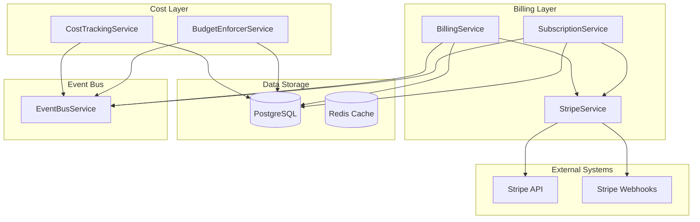
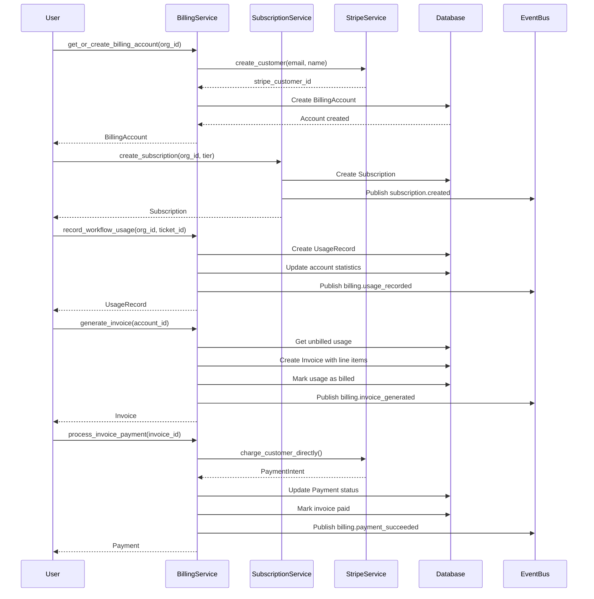
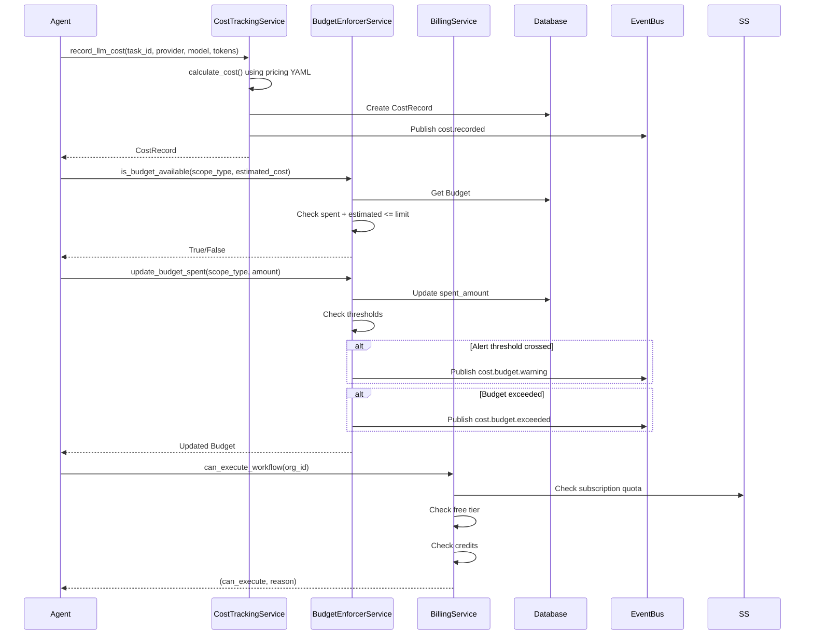
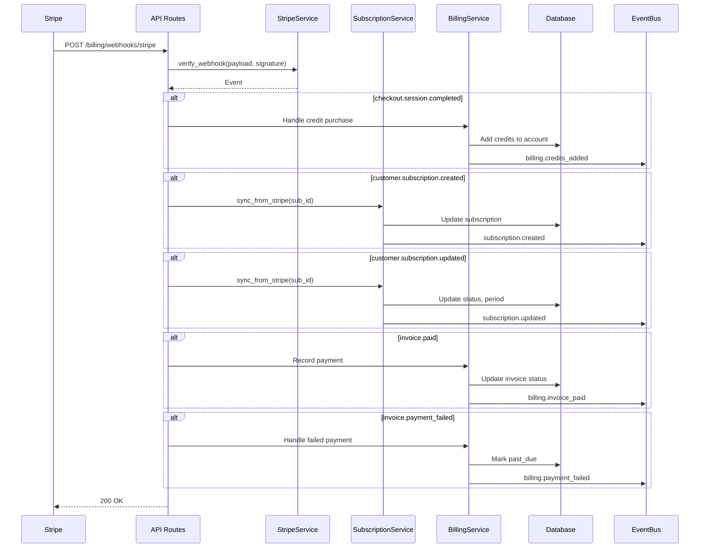
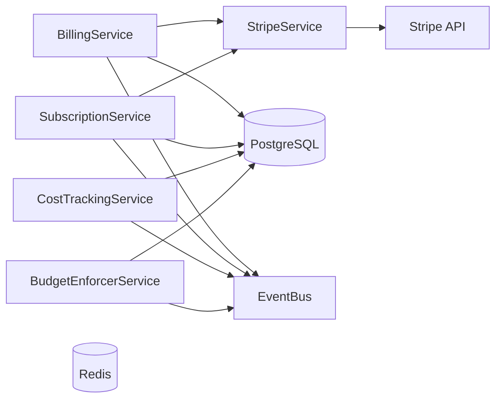

# Billing & Cost Management System Design Document

**Created:** 2026-04-22  
**Status:** Active  
**Purpose:** End-to-end billing lifecycle from subscription management to cost tracking and budget enforcement  
**Related Docs:** [Auth Service](./auth_service.md), [API Security](../../architecture/08-billing-and-subscriptions.md), [Frontend Billing](../frontend/billing_subscriptions.md)

---

## 1. Architecture Overview

The Billing & Cost Management System handles the complete financial lifecycle of OmoiOS, from subscription tier management and Stripe payment processing to granular cost tracking per workflow and automated budget enforcement. The system ensures accurate metering, transparent billing, and proactive cost control.

### 1.1 High-Level Architecture



### 1.2 Billing Lifecycle Flow



### 1.3 Cost Tracking & Budget Enforcement Flow



### 1.4 Stripe Webhook Flow



---

## 2. Component Responsibilities

| Component | Responsibility | Key Operations |
|-----------|---------------|----------------|
| **BillingService** | Core billing orchestration, invoice generation, payment processing | `get_or_create_billing_account()`, `record_workflow_usage()`, `generate_invoice()`, `process_invoice_payment()` |
| **SubscriptionService** | Subscription lifecycle, tier changes, usage quotas | `create_subscription()`, `upgrade_tier()`, `downgrade_tier()`, `cancel_subscription()`, `can_use_workflow()` |
| **StripeService** | Stripe API integration, webhook handling, payment methods | `create_customer()`, `create_checkout_session()`, `charge_customer_directly()`, `verify_webhook()` |
| **CostTrackingService** | LLM API cost recording, aggregation, forecasting | `record_llm_cost()`, `calculate_cost()`, `get_cost_summary()`, `forecast_costs()` |
| **BudgetEnforcerService** | Budget limits, threshold alerts, enforcement | `create_budget()`, `check_budget()`, `update_budget_spent()`, `is_budget_available()` |

---

## 3. System Boundaries

### 3.1 Inside System Boundaries

- Billing account creation and management per organization
- Subscription tier management (Free, Pro, Enterprise, Lifetime, BYO)
- Usage tracking with free tier application
- Invoice generation with line items and credit application
- Payment processing via Stripe Payment Intents
- Credit purchase and balance management
- Prepaid credit checkout sessions
- Customer portal for payment method management
- Cost recording per task/agent with provider-specific pricing
- Cost aggregation by ticket, agent, phase, billing account, global
- Cost forecasting based on pending task queue
- Budget creation with scope (global, ticket, agent, phase)
- Budget threshold alerts (default 80%)
- Budget enforcement blocking over-budget operations
- Stripe webhook handling for async events
- Subscription sync from Stripe state

### 3.2 Outside System Boundaries

- Credit card data handling (Stripe Elements/Checkout handle PCI)
- Tax calculation (Stripe Tax or external service)
- Invoice PDF generation (not implemented)
- Usage-based pricing (currently per-workflow only)
- Proration calculations (handled by Stripe)
- Dunning management (basic retry only)
- Cost anomaly detection (not implemented)

---

## 4. Data Models

### 4.1 Database Schema

```sql
-- Billing accounts per organization
CREATE TABLE billing_accounts (
    id UUID PRIMARY KEY DEFAULT gen_random_uuid(),
    organization_id UUID REFERENCES organizations(id) ON DELETE CASCADE,
    stripe_customer_id VARCHAR(255),
    stripe_payment_method_id VARCHAR(255),
    status VARCHAR(50) DEFAULT 'pending',  -- pending, active, suspended
    credit_balance DECIMAL(10, 2) DEFAULT 0.00,
    free_workflows_remaining INTEGER DEFAULT 5,
    free_workflows_reset_at TIMESTAMP WITH TIME ZONE,
    total_workflows_completed INTEGER DEFAULT 0,
    total_amount_spent DECIMAL(10, 2) DEFAULT 0.00,
    billing_email VARCHAR(255),
    created_at TIMESTAMP WITH TIME ZONE DEFAULT NOW()
);

-- Subscriptions with tier-based limits
CREATE TABLE subscriptions (
    id UUID PRIMARY KEY DEFAULT gen_random_uuid(),
    organization_id UUID REFERENCES organizations(id) ON DELETE CASCADE,
    billing_account_id UUID REFERENCES billing_accounts(id),
    tier VARCHAR(50) NOT NULL,  -- free, pro, enterprise, lifetime, byo
    status VARCHAR(50) DEFAULT 'active',  -- active, trialing, past_due, canceled, paused
    stripe_subscription_id VARCHAR(255),
    stripe_price_id VARCHAR(255),
    current_period_start TIMESTAMP WITH TIME ZONE,
    current_period_end TIMESTAMP WITH TIME ZONE,
    trial_start TIMESTAMP WITH TIME ZONE,
    trial_end TIMESTAMP WITH TIME ZONE,
    canceled_at TIMESTAMP WITH TIME ZONE,
    cancel_at_period_end BOOLEAN DEFAULT FALSE,
    workflows_limit INTEGER DEFAULT 0,
    workflows_used INTEGER DEFAULT 0,
    agents_limit INTEGER DEFAULT 0,
    storage_limit_gb DECIMAL(10, 2) DEFAULT 0,
    storage_used_gb DECIMAL(10, 2) DEFAULT 0,
    is_lifetime BOOLEAN DEFAULT FALSE,
    is_byo BOOLEAN DEFAULT FALSE,
    byo_providers_configured JSONB,
    lifetime_purchase_date TIMESTAMP WITH TIME ZONE,
    lifetime_purchase_amount DECIMAL(10, 2),
    subscription_config JSONB,
    created_at TIMESTAMP WITH TIME ZONE DEFAULT NOW()
);

-- Usage records for workflow completions
CREATE TABLE usage_records (
    id UUID PRIMARY KEY DEFAULT gen_random_uuid(),
    billing_account_id UUID REFERENCES billing_accounts(id),
    ticket_id UUID REFERENCES tickets(id),
    usage_type VARCHAR(50) DEFAULT 'workflow_completion',
    quantity INTEGER DEFAULT 1,
    unit_price DECIMAL(10, 4),
    total_price DECIMAL(10, 2),
    free_tier_used BOOLEAN DEFAULT FALSE,
    usage_details JSONB,  -- tokens, duration, etc.
    billed BOOLEAN DEFAULT FALSE,
    invoice_id UUID REFERENCES invoices(id),
    recorded_at TIMESTAMP WITH TIME ZONE DEFAULT NOW()
);

-- Invoices for billable usage
CREATE TABLE invoices (
    id UUID PRIMARY KEY DEFAULT gen_random_uuid(),
    invoice_number VARCHAR(100) UNIQUE NOT NULL,
    billing_account_id UUID REFERENCES billing_accounts(id),
    status VARCHAR(50) DEFAULT 'draft',  -- draft, open, paid, past_due, void
    period_start TIMESTAMP WITH TIME ZONE,
    period_end TIMESTAMP WITH TIME ZONE,
    currency VARCHAR(3) DEFAULT 'usd',
    line_items JSONB DEFAULT '[]',
    subtotal DECIMAL(10, 2) DEFAULT 0.00,
    credits_applied DECIMAL(10, 2) DEFAULT 0.00,
    total DECIMAL(10, 2) DEFAULT 0.00,
    amount_due DECIMAL(10, 2) DEFAULT 0.00,
    due_date TIMESTAMP WITH TIME ZONE,
    paid_at TIMESTAMP WITH TIME ZONE,
    created_at TIMESTAMP WITH TIME ZONE DEFAULT NOW()
);

-- Payments linked to invoices
CREATE TABLE payments (
    id UUID PRIMARY KEY DEFAULT gen_random_uuid(),
    billing_account_id UUID REFERENCES billing_accounts(id),
    invoice_id UUID REFERENCES invoices(id),
    amount DECIMAL(10, 2) NOT NULL,
    currency VARCHAR(3) DEFAULT 'usd',
    status VARCHAR(50) DEFAULT 'pending',  -- pending, succeeded, failed
    stripe_payment_intent_id VARCHAR(255),
    stripe_charge_id VARCHAR(255),
    payment_method_type VARCHAR(50),
    failure_code VARCHAR(100),
    failure_message TEXT,
    created_at TIMESTAMP WITH TIME ZONE DEFAULT NOW()
);

-- Cost records for LLM API usage
CREATE TABLE cost_records (
    id UUID PRIMARY KEY DEFAULT gen_random_uuid(),
    task_id VARCHAR(255) NOT NULL,
    agent_id VARCHAR(255),
    sandbox_id VARCHAR(255),
    billing_account_id VARCHAR(255),
    provider VARCHAR(50) NOT NULL,  -- anthropic, openai, etc.
    model VARCHAR(100) NOT NULL,
    prompt_tokens INTEGER DEFAULT 0,
    completion_tokens INTEGER DEFAULT 0,
    total_tokens INTEGER DEFAULT 0,
    prompt_cost DECIMAL(10, 6) DEFAULT 0.000000,
    completion_cost DECIMAL(10, 6) DEFAULT 0.000000,
    total_cost DECIMAL(10, 6) DEFAULT 0.000000,
    recorded_at TIMESTAMP WITH TIME ZONE DEFAULT NOW()
);

-- Budgets for cost control
CREATE TABLE budgets (
    id UUID PRIMARY KEY DEFAULT gen_random_uuid(),
    scope_type VARCHAR(50) NOT NULL,  -- global, ticket, agent, phase
    scope_id VARCHAR(255),
    limit_amount DECIMAL(10, 2) NOT NULL,
    spent_amount DECIMAL(10, 2) DEFAULT 0.00,
    remaining_amount DECIMAL(10, 2) NOT NULL,
    period_start TIMESTAMP WITH TIME ZONE DEFAULT NOW(),
    period_end TIMESTAMP WITH TIME ZONE,
    alert_threshold DECIMAL(3, 2) DEFAULT 0.80,  -- 80%
    alert_triggered INTEGER DEFAULT 0,
    created_at TIMESTAMP WITH TIME ZONE DEFAULT NOW()
);
```

### 4.2 Pydantic Models

```python
from pydantic import BaseModel, Field
from typing import Optional, List, Dict, Any
from uuid import UUID
from decimal import Decimal
from datetime import datetime
from enum import Enum

class SubscriptionTier(str, Enum):
    """Subscription tier levels."""
    FREE = "free"
    PRO = "pro"
    ENTERPRISE = "enterprise"
    LIFETIME = "lifetime"
    BYO = "byo"  # Bring Your Own API keys

class SubscriptionStatus(str, Enum):
    """Subscription status values."""
    ACTIVE = "active"
    TRIALING = "trialing"
    PAST_DUE = "past_due"
    CANCELED = "canceled"
    PAUSED = "paused"
    INCOMPLETE = "incomplete"

class BillingAccountStatus(str, Enum):
    """Billing account status."""
    PENDING = "pending"
    ACTIVE = "active"
    SUSPENDED = "suspended"

class InvoiceStatus(str, Enum):
    """Invoice status values."""
    DRAFT = "draft"
    OPEN = "open"
    PAID = "paid"
    PAST_DUE = "past_due"
    VOID = "void"

class PaymentStatus(str, Enum):
    """Payment status values."""
    PENDING = "pending"
    SUCCEEDED = "succeeded"
    FAILED = "failed"

class UsageSummary(BaseModel):
    """Summary of usage and limits."""
    subscription_tier: Optional[str]
    workflows_used: int
    workflows_limit: int
    free_workflows_remaining: int
    credit_balance: float
    can_execute: bool
    reason: str

class CostSummary(BaseModel):
    """Cost summary for a scope."""
    scope_type: str
    scope_id: Optional[str]
    total_cost: float
    total_tokens: int
    record_count: int
    breakdown: List[Dict[str, Any]]

class BudgetStatus(BaseModel):
    """Budget status check result."""
    exists: bool
    limit: Optional[float]
    spent: float
    remaining: Optional[float]
    utilization_percent: float
    exceeded: bool
    alert_threshold: Optional[float]
    alert_triggered: bool

class CostForecast(BaseModel):
    """Forecast for pending tasks."""
    task_count: int
    estimated_cost: float
    estimated_tokens: int
    avg_tokens_per_task: int
    buffer_multiplier: float

# Tier limits configuration
TIER_LIMITS = {
    SubscriptionTier.FREE: {
        "workflows_limit": 5,
        "agents_limit": 1,
        "storage_limit_gb": 1,
    },
    SubscriptionTier.PRO: {
        "workflows_limit": 100,
        "agents_limit": 5,
        "storage_limit_gb": 10,
    },
    SubscriptionTier.ENTERPRISE: {
        "workflows_limit": -1,  # Unlimited
        "agents_limit": -1,
        "storage_limit_gb": 100,
    },
    SubscriptionTier.LIFETIME: {
        "workflows_limit": -1,
        "agents_limit": -1,
        "storage_limit_gb": 50,
    },
    SubscriptionTier.BYO: {
        "workflows_limit": -1,
        "agents_limit": 10,
        "storage_limit_gb": 5,
    },
}
```

### 4.3 Cost Models Configuration

```yaml
# config/cost_models.yaml
providers:
  anthropic:
    claude-sonnet-4.5:
      prompt_token_cost: 0.000003  # $3 per million tokens
      completion_token_cost: 0.000015  # $15 per million tokens
    claude-opus-4.5:
      prompt_token_cost: 0.000015
      completion_token_cost: 0.000075
    claude-haiku-4.5:
      prompt_token_cost: 0.0000008
      completion_token_cost: 0.000004
  
  openai:
    gpt-4:
      prompt_token_cost: 0.00003
      completion_token_cost: 0.00006
    gpt-4-turbo:
      prompt_token_cost: 0.00001
      completion_token_cost: 0.00003
    gpt-3.5-turbo:
      prompt_token_cost: 0.0000005
      completion_token_cost: 0.0000015

defaults:
  prompt_token_cost: 0.000003
  completion_token_cost: 0.000015

forecasting:
  avg_tokens_per_task: 5000
  buffer_multiplier: 1.2
```

---

## 5. API Surface

### 5.1 Billing Service Methods

| Method | Signature | Description |
|--------|-----------|-------------|
| `get_or_create_billing_account` | `(organization_id: UUID) -> BillingAccount` | Get or create account for org |
| `get_billing_account` | `(organization_id: UUID) -> Optional[BillingAccount]` | Get existing account |
| `update_billing_account_status` | `(account_id, status) -> BillingAccount` | Update account status |
| `record_workflow_usage` | `(org_id, ticket_id, usage_details) -> UsageRecord` | Record workflow completion |
| `get_unbilled_usage` | `(account_id) -> List[UsageRecord]` | Get billable usage records |
| `generate_invoice` | `(account_id) -> Optional[Invoice]` | Create invoice from unbilled usage |
| `get_invoice` | `(invoice_id) -> Optional[Invoice]` | Get invoice by ID |
| `list_invoices` | `(account_id, status, limit) -> List[Invoice]` | List invoices for account |
| `process_invoice_payment` | `(invoice_id, payment_method_id) -> Payment` | Charge for invoice |
| `add_credits` | `(account_id, amount_usd, reason) -> BillingAccount` | Add prepaid credits |
| `create_credit_checkout` | `(org_id, amount_usd) -> dict` | Create checkout for credits |
| `create_customer_portal_url` | `(org_id) -> str` | Get Stripe portal URL |
| `can_execute_workflow` | `(org_id) -> Tuple[bool, str]` | Check if execution allowed |
| `check_and_reserve_workflow` | `(org_id, ticket_id) -> Tuple[bool, str]` | Reserve quota before execution |
| `get_usage_summary` | `(org_id) -> dict` | Get usage and limits summary |

### 5.2 Subscription Service Methods

| Method | Signature | Description |
|--------|-----------|-------------|
| `create_subscription` | `(org_id, billing_account_id, tier, trial_days) -> Subscription` | Create new subscription |
| `get_subscription` | `(org_id) -> Optional[Subscription]` | Get active subscription |
| `get_subscription_by_id` | `(subscription_id) -> Optional[Subscription]` | Get by ID |
| `can_use_workflow` | `(org_id) -> Tuple[bool, str]` | Check quota availability |
| `use_workflow` | `(org_id) -> bool` | Consume workflow from quota |
| `reset_usage` | `(subscription_id) -> Subscription` | Reset for new billing period |
| `upgrade_tier` | `(subscription_id, new_tier, stripe_sub_id, stripe_price_id) -> Subscription` | Upgrade with proration |
| `downgrade_tier` | `(subscription_id, new_tier, at_period_end) -> Subscription` | Schedule downgrade |
| `cancel_subscription` | `(subscription_id, at_period_end) -> Subscription` | Cancel subscription |
| `reactivate_subscription` | `(subscription_id) -> Subscription` | Reactivate canceled |
| `pause_subscription` | `(subscription_id) -> Subscription` | Pause billing |
| `resume_subscription` | `(subscription_id) -> Subscription` | Resume paused |
| `create_lifetime_subscription` | `(org_id, billing_account_id, purchase_amount) -> Subscription` | Create lifetime |
| `create_byo_subscription` | `(org_id, billing_account_id, providers) -> Subscription` | Create BYO tier |
| `sync_from_stripe` | `(stripe_subscription_id) -> Subscription` | Sync from webhook |

### 5.3 Stripe Service Methods

| Method | Signature | Description |
|--------|-----------|-------------|
| `create_customer` | `(email, name, organization_id, metadata) -> Customer` | Create Stripe customer |
| `get_customer` | `(customer_id) -> Optional[Customer]` | Retrieve customer |
| `update_customer` | `(customer_id, email, name, metadata) -> Customer` | Update customer |
| `attach_payment_method` | `(customer_id, payment_method_id, set_as_default) -> PaymentMethod` | Attach payment method |
| `list_payment_methods` | `(customer_id, type) -> List[PaymentMethod]` | List payment methods |
| `detach_payment_method` | `(payment_method_id) -> PaymentMethod` | Remove payment method |
| `create_checkout_session` | `(customer_id, amount_cents, description, ...) -> Session` | One-time payment |
| `create_credit_purchase_session` | `(customer_id, credit_amount_usd, ...) -> Session` | Credit purchase |
| `create_subscription_checkout_session` | `(customer_id, price_id, ...) -> Session` | Subscription signup |
| `create_payment_intent` | `(customer_id, amount_cents, metadata) -> PaymentIntent` | Custom UI flow |
| `charge_customer_directly` | `(customer_id, amount_cents, description, ...) -> PaymentIntent` | Off-session charge |
| `create_portal_session` | `(customer_id, return_url) -> PortalSession` | Customer portal |
| `create_refund` | `(payment_intent_id, amount_cents, reason) -> Refund` | Process refund |
| `verify_webhook` | `(payload, signature) -> Event` | Verify webhook signature |
| `create_invoice` | `(customer_id, description, amount_cents, ...) -> Invoice` | Create Stripe invoice |
| `pay_invoice` | `(invoice_id) -> Invoice` | Pay with default method |
| `get_subscription` | `(subscription_id) -> Subscription` | Retrieve subscription |

### 5.4 Cost Tracking Service Methods

| Method | Signature | Description |
|--------|-----------|-------------|
| `get_model_pricing` | `(provider, model) -> dict` | Get pricing for model |
| `calculate_cost` | `(provider, model, prompt_tokens, completion_tokens) -> dict` | Calculate cost breakdown |
| `record_llm_cost` | `(task_id, provider, model, tokens, ...) -> CostRecord` | Record LLM API cost |
| `record_sandbox_cost` | `(task_id, sandbox_id, cost_usd, tokens, ...) -> CostRecord` | Record from sandbox |
| `get_billing_account_costs` | `(billing_account_id) -> List[CostRecord]` | Get costs for account |
| `get_sandbox_costs` | `(sandbox_id) -> List[CostRecord]` | Get costs for sandbox |
| `get_task_costs` | `(task_id) -> List[CostRecord]` | Get costs for task |
| `get_agent_costs` | `(agent_id) -> List[CostRecord]` | Get costs for agent |
| `get_cost_summary` | `(scope_type, scope_id) -> CostSummary` | Aggregate costs |
| `forecast_costs` | `(pending_task_count, avg_tokens, provider, model) -> CostForecast` | Forecast pending costs |

### 5.5 Budget Enforcer Service Methods

| Method | Signature | Description |
|--------|-----------|-------------|
| `create_budget` | `(scope_type, limit_amount, scope_id, period_end, alert_threshold) -> Budget` | Create budget |
| `get_budget` | `(scope_type, scope_id) -> Optional[Budget]` | Get active budget |
| `check_budget` | `(scope_type, scope_id) -> BudgetStatus` | Check budget status |
| `update_budget_spent` | `(scope_type, amount, scope_id) -> Optional[Budget]` | Add to spent |
| `list_budgets` | `(scope_type) -> List[Budget]` | List all budgets |
| `is_budget_available` | `(scope_type, estimated_cost, scope_id) -> bool` | Check if cost fits budget |

---

## 6. Integration Points

### 6.1 Services Called By Billing System



| Service | Purpose | Key Methods Used |
|---------|---------|------------------|
| **PostgreSQL** | Billing data persistence | `execute()`, `commit()`, `flush()` |
| **Stripe API** | Payment processing | `Customer.create()`, `PaymentIntent.create()`, `Webhook.construct_event()` |
| **EventBus** | Async event publishing | `publish(SystemEvent)` |
| **YAML Config** | Cost model pricing | `yaml.safe_load()` |

### 6.2 Services That Call Billing System

| Service | Purpose |
|---------|---------|
| **OrchestratorWorker** | Check quota before task execution |
| **Sandbox Worker** | Report costs after task completion |
| **API Route Handlers** | Handle Stripe webhooks, checkout |
| **Frontend** | Display usage, invoices, subscribe |
| **Monitoring** | Alert on budget thresholds |

### 6.3 Event Types

| Event | Direction | Purpose |
|-------|-----------|---------|
| `billing.usage_recorded` | Published | Workflow usage tracked |
| `billing.invoice_generated` | Published | New invoice created |
| `billing.payment_succeeded` | Published | Payment completed |
| `billing.payment_failed` | Published | Payment failed |
| `billing.credits_added` | Published | Credits purchased |
| `billing.workflow_blocked` | Published | Execution blocked (no quota) |
| `subscription.created` | Published | New subscription |
| `subscription.upgraded` | Published | Tier upgraded |
| `subscription.downgraded` | Published | Tier downgraded |
| `subscription.canceled` | Published | Subscription canceled |
| `cost.recorded` | Published | LLM cost tracked |
| `cost.budget.warning` | Published | Budget threshold crossed |
| `cost.budget.exceeded` | Published | Budget limit exceeded |

---

## 7. Configuration Parameters

### 7.1 Environment Variables

| Variable | Default | Description |
|----------|---------|-------------|
| `STRIPE_SECRET_KEY` | **Required** | Stripe API secret key |
| `STRIPE_PUBLISHABLE_KEY` | Optional | Stripe publishable key (frontend) |
| `STRIPE_WEBHOOK_SECRET` | Optional | Webhook endpoint secret |
| `STRIPE_CURRENCY` | usd | Default currency |
| `WORKFLOW_PRICE_USD` | 10.00 | Price per workflow |
| `FREE_WORKFLOWS_PER_MONTH` | 5 | Free tier allowance |

### 7.2 YAML Configuration

```yaml
# config/base.yaml
billing:
  currency: "usd"
  workflow_price_usd: 10.0
  free_workflows_per_month: 5
  
  # Stripe URLs
  success_url: "http://localhost:3000/billing/success"
  cancel_url: "http://localhost:3000/billing/cancel"
  portal_return_url: "http://localhost:3000/billing"
  
  # Webhook endpoint (must match Stripe dashboard)
  webhook_path: "/api/v1/billing/webhooks/stripe"

stripe:
  # API keys from environment
  secret_key: "${STRIPE_SECRET_KEY}"
  webhook_secret: "${STRIPE_WEBHOOK_SECRET}"
  publishable_key: "${STRIPE_PUBLISHABLE_KEY}"
```

### 7.3 Stripe Webhook Events

```python
# Required webhook events in Stripe dashboard
REQUIRED_WEBHOOK_EVENTS = [
    "checkout.session.completed",
    "customer.subscription.created",
    "customer.subscription.updated",
    "customer.subscription.deleted",
    "invoice.paid",
    "invoice.payment_failed",
]

# Webhook endpoint configuration
WEBHOOK_ENDPOINT = "https://api.omoios.dev/api/v1/billing/webhooks/stripe"
```

---

## 8. Error Handling

### 8.1 Error Categories

| Category | Examples | Handling Strategy |
|----------|----------|-------------------|
| **Stripe API** | Card declined, invalid customer | Catch StripeError, return user-friendly message |
| **Payment** | Insufficient funds, expired card | Mark payment failed, trigger dunning |
| **Quota** | Workflow limit reached | Block execution, suggest upgrade |
| **Budget** | Budget exceeded | Block operation, publish alert |
| **Configuration** | Missing Stripe keys | Log warning, disable billing features |
| **Webhook** | Invalid signature | Return 400, log security event |

### 8.2 Stripe Error Handling

```python
def charge_customer_directly(self, customer_id, amount_cents, description, ...):
    """Charge with comprehensive error handling."""
    try:
        intent = stripe.PaymentIntent.create(
            amount=amount_cents,
            currency=self.settings.currency,
            customer=customer_id,
            payment_method=payment_method_id,
            off_session=True,
            confirm=True,
        )
        return intent
        
    except CardError as e:
        # Card declined - user-facing error
        logger.warning(f"Card declined: {e.user_message}")
        raise PaymentFailedError(e.user_message, code=e.code)
        
    except StripeError as e:
        # Generic Stripe error - log and raise
        logger.error(f"Stripe error: {e.user_message}")
        raise
```

### 8.3 Budget Enforcement Error Handling

```python
def is_budget_available(self, scope_type, estimated_cost, scope_id):
    """Check budget with graceful handling."""
    budget = self.get_budget(scope_type, scope_id)
    
    if not budget:
        # No budget = no restriction
        return True
    
    # Check if adding cost would exceed
    would_exceed = (budget.spent_amount + estimated_cost) > budget.limit_amount
    
    if would_exceed:
        logger.warning(
            f"Budget would be exceeded: {scope_type}={scope_id}, "
            f"spent={budget.spent_amount}, limit={budget.limit_amount}"
        )
        return False
    
    return True
```

---

## 9. Security Considerations

### 9.1 PCI Compliance

- **No raw card data**: Stripe Elements/Checkout handle all card input
- **Token-based**: Only Stripe tokens stored, never card numbers
- **Webhook verification**: All webhooks verified with `stripe.Webhook.construct_event()`
- **HTTPS only**: All Stripe communications over TLS

### 9.2 Billing Security

- **Idempotency keys**: Used for checkout session creation
- **Customer isolation**: Each organization has separate Stripe customer
- **Payment method ownership**: Users can only use their own payment methods
- **Invoice access**: Users can only view their organization's invoices

### 9.3 Cost Tracking Security

- **Sandbox isolation**: Costs tracked per sandbox, no cross-contamination
- **Immutable records**: Cost records never modified after creation
- **Audit trail**: All cost events published to EventBus

---

## 10. Performance Characteristics

| Metric | Target | Notes |
|--------|--------|-------|
| Invoice generation | < 100ms | For < 100 usage records |
| Payment processing | < 3s | Stripe API call |
| Cost recording | < 50ms | Per LLM call |
| Budget check | < 10ms | Indexed lookup |
| Usage summary | < 50ms | Aggregated query |
| Stripe webhook | < 200ms | Acknowledge quickly, process async |
| Checkout creation | < 1s | Stripe API call |

---

## 11. Future Enhancements

1. **Usage-Based Pricing** - Per-token billing for LLM usage
2. **Team Billing** - Split billing across organization members
3. **Invoice PDFs** - Generate and email PDF invoices
4. **Dunning Management** - Automated retry with escalation
5. **Promo Codes** - Discount codes for subscriptions
6. **Usage Alerts** - Proactive quota warnings
7. **Cost Anomaly Detection** - ML-based unusual cost detection
8. **Multi-Currency** - Support for EUR, GBP, etc.
9. **Tax Integration** - Automatic tax calculation (Stripe Tax)
10. **Billing API** - Programmatic billing management

---

*Document Version: 1.0*  
*Last Updated: 2026-04-22*  
*Maintainer: OmoiOS Core Team*
