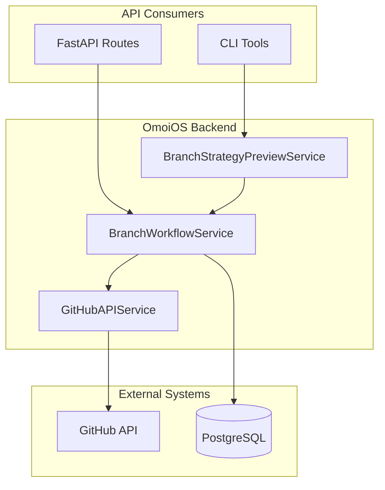
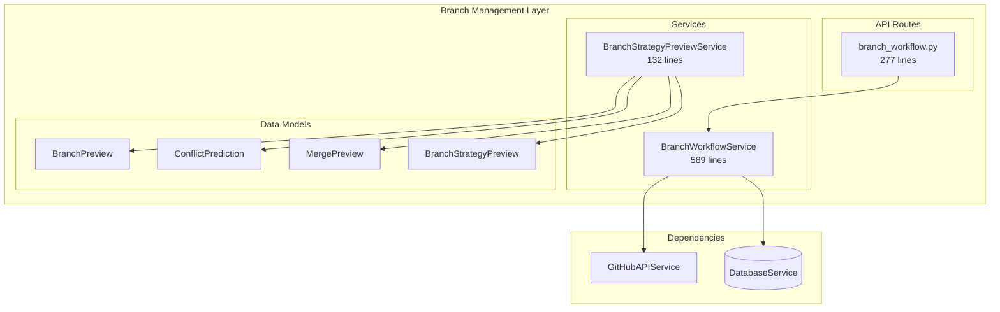
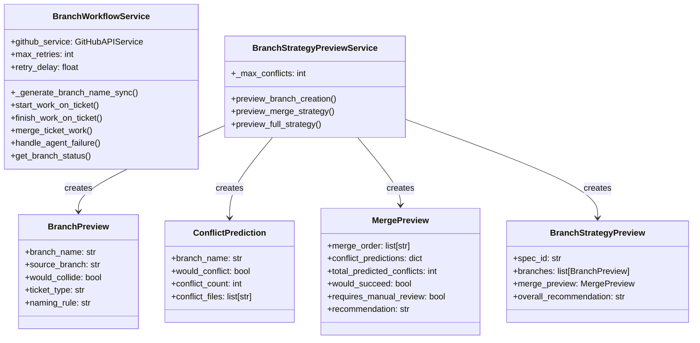
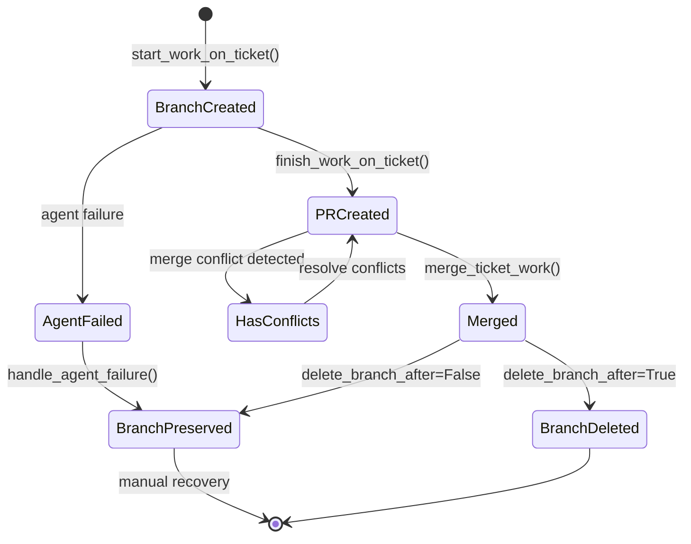
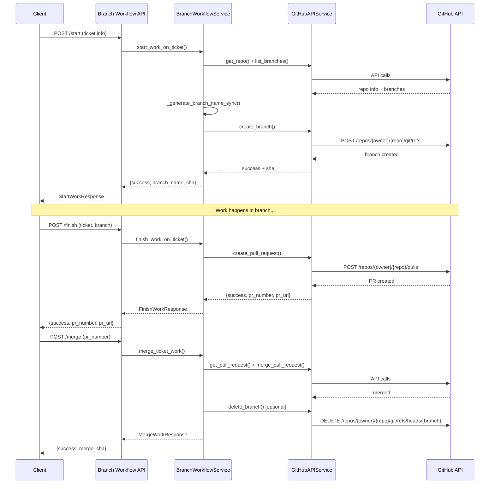

# Branch Management System

> **Date**: 2025-07-20 | **Status**: Active | **Version**: 1.0 | **Owner**: Deep Docs Pipeline
> **Source**: Generated from codebase analysis | **Cross-links**: See Related Documents section

## Table of Contents

1. [Overview](#overview)
2. [Architecture](#architecture)
3. [Core Components](#core-components)
4. [Branch Lifecycle](#branch-lifecycle)
5. [API Surface](#api-surface)
6. [Error Handling](#error-handling)
7. [Related Documents](#related-documents)

---

## Overview

The Branch Management System provides comprehensive Git branch lifecycle management for ticket-based development workflows. It handles branch creation, naming conventions, conflict prediction, merge strategies, and integration with GitHub for PR workflows.

### Key Capabilities

| Capability | Description | Implementation |
|------------|-------------|----------------|
| Branch Naming | GitFlow-compliant branch naming with collision detection | `BranchWorkflowService._generate_branch_name_sync()` |
| Preview/Dry-run | Local preview of branch strategies without GitHub API calls | `BranchStrategyPreviewService` |
| Conflict Prediction | Structural analysis of potential merge conflicts | `ConflictPrediction` dataclass |
| PR Lifecycle | Create, manage, and merge pull requests | `BranchWorkflowService.finish_work_on_ticket()` |
| Failure Recovery | Preserve branches on agent failure for manual recovery | `handle_agent_failure()` |

### System Context



---

## Architecture

### Component Diagram



### Class Hierarchy



---

## Core Components

### 1. BranchWorkflowService

`backend/omoi_os/services/branch_workflow.py:41-589`

The primary service for Git branch lifecycle management.

#### Key Methods

| Method | Signature | Purpose |
|--------|-----------|---------|
| `start_work_on_ticket` | `async def start_work_on_ticket(self, ticket_id: str, ticket_title: str, repo_owner: str, repo_name: str, user_id: str, ticket_type: str = "feature", priority: Optional[str] = None) -> dict[str, Any]` | Creates a feature branch for ticket work |
| `finish_work_on_ticket` | `async def finish_work_on_ticket(self, ticket_id: str, ticket_title: str, branch_name: str, repo_owner: str, repo_name: str, user_id: str, pr_body: Optional[str] = None) -> dict[str, Any]` | Creates a PR for completed work |
| `merge_ticket_work` | `async def merge_ticket_work(self, ticket_id: str, pr_number: int, repo_owner: str, repo_name: str, user_id: str, delete_branch_after: bool = True, merge_method: str = "squash") -> dict[str, Any]` | Merges a PR and optionally deletes branch |
| `handle_agent_failure` | `async def handle_agent_failure(self, ticket_id: str, branch_name: str, repo_owner: str, repo_name: str, user_id: str, failure_reason: str) -> dict[str, Any]` | Handles agent failure, preserves branch |
| `get_branch_status` | `async def get_branch_status(self, branch_name: str, repo_owner: str, repo_name: str, user_id: str) -> dict[str, Any]` | Gets branch comparison status |

#### Branch Naming Convention

```python
# backend/omoi_os/services/branch_workflow.py:81-129

def _generate_branch_name_sync(
    self,
    ticket_id: str,
    ticket_title: str,
    ticket_type: str = "feature",
    priority: Optional[str] = None,
    existing_branches: Optional[list[str]] = None,
) -> str:
    """Generate a branch name following GitFlow conventions.
    
    Format: {type}/{ticket-id}-{description}
    
    Type mapping:
    - feature -> feature/
    - bug -> fix/ (or hotfix/ if priority=critical)
    - refactor -> refactor/
    - docs -> docs/
    - test -> test/
    - chore -> chore/
    """
    TYPE_PREFIX_MAP = {
        "feature": "feature",
        "bug": "fix",
        "refactor": "refactor",
        "docs": "docs",
        "test": "test",
        "chore": "chore",
    }
    
    # Determine prefix
    if ticket_type == "bug" and priority == "critical":
        prefix = "hotfix"
    else:
        prefix = TYPE_PREFIX_MAP.get(ticket_type, "feature")
    
    # Generate slug
    slug = re.sub(r"[^a-zA-Z0-9\s-]", "", ticket_title.lower())
    slug = re.sub(r"\s+", "-", slug.strip())
    slug = slug[:25].rstrip("-")
    
    branch_name = f"{prefix}/{ticket_id}-{slug}"
    
    # Handle collisions
    if branch_name in existing_branches:
        i = 2
        while f"{branch_name}-{i}" in existing_branches:
            i += 1
        branch_name = f"{branch_name}-{i}"
    
    return branch_name
```

### 2. BranchStrategyPreviewService

`backend/omoi_os/services/branch_strategy_preview.py:31-132`

Provides dry-run branch strategy previews without requiring GitHub API calls.

```python
# backend/omoi_os/services/branch_strategy_preview.py:37-69

def preview_branch_creation(
    self,
    ticket_id: str,
    ticket_title: str,
    ticket_type: str = "feature",
    priority: Optional[str] = None,
    source_branch: str = "main",
    existing_branches: Optional[list[str]] = None,
) -> BranchPreview:
    """Preview what branch would be created for a ticket."""
    existing_branches = existing_branches or []
    
    # Determine prefix
    if ticket_type == "bug" and priority == "critical":
        prefix = "hotfix"
    else:
        prefix = TYPE_PREFIX_MAP.get(ticket_type, "feature")
    
    # Generate slug
    slug = re.sub(r"[^a-zA-Z0-9\s-]", "", ticket_title.lower())
    slug = re.sub(r"\s+", "-", slug.strip())
    slug = slug[:25].rstrip("-")
    
    branch_name = f"{prefix}/{ticket_id}-{slug}"
    would_collide = branch_name in existing_branches
    
    return BranchPreview(
        branch_name=branch_name,
        source_branch=source_branch,
        would_collide=would_collide,
        ticket_type=ticket_type,
        naming_rule=f"{prefix}/{{ticket_id}}-{{slug}}",
    )
```

### 3. Data Models

#### BranchPreview

`backend/omoi_os/services/branch_preview.py:8-17`

```python
@dataclass
class BranchPreview:
    """Preview of a branch that would be created."""
    
    branch_name: str
    source_branch: str
    would_collide: bool
    ticket_type: str
    naming_rule: str
```

#### ConflictPrediction

`backend/omoi_os/services/branch_preview.py:19-27`

```python
@dataclass
class ConflictPrediction:
    """Prediction of merge conflicts for a branch."""
    
    branch_name: str
    would_conflict: bool
    conflict_count: int
    conflict_files: list[str] = field(default_factory=list)
```

#### MergePreview

`backend/omoi_os/services/branch_preview.py:29-39`

```python
@dataclass
class MergePreview:
    """Preview of a convergence merge operation."""
    
    merge_order: list[str]
    conflict_predictions: dict[str, ConflictPrediction]
    total_predicted_conflicts: int
    would_succeed: bool
    requires_manual_review: bool
    recommendation: str  # "proceed" | "review" | "abort"
```

---

## Branch Lifecycle

### State Machine



### Workflow Sequence



---

## API Surface

### FastAPI Routes

`backend/omoi_os/api/routes/branch_workflow.py:1-277`

| Endpoint | Method | Request | Response | Description |
|----------|--------|---------|----------|-------------|
| `/start` | POST | `StartWorkRequest` | `StartWorkResponse` | Create feature branch |
| `/finish` | POST | `FinishWorkRequest` | `FinishWorkResponse` | Create PR |
| `/merge` | POST | `MergeWorkRequest` | `MergeWorkResponse` | Merge PR |
| `/status` | POST | `BranchStatusRequest` | `BranchStatusResponse` | Get branch status |

### Request/Response Schemas

#### StartWorkRequest

```python
class StartWorkRequest(BaseModel):
    ticket_id: str
    ticket_title: str
    repo_owner: str
    repo_name: str
    user_id: str
    ticket_type: str = "feature"
    priority: Optional[str] = None
```

#### StartWorkResponse

```python
class StartWorkResponse(BaseModel):
    success: bool
    branch_name: Optional[str] = None
    sha: Optional[str] = None
    error: Optional[str] = None
```

#### FinishWorkRequest

```python
class FinishWorkRequest(BaseModel):
    ticket_id: str
    ticket_title: str
    branch_name: str
    repo_owner: str
    repo_name: str
    user_id: str
    pr_body: Optional[str] = None
```

#### MergeWorkRequest

```python
class MergeWorkRequest(BaseModel):
    ticket_id: str
    pr_number: int
    repo_owner: str
    repo_name: str
    user_id: str
    delete_branch_after: bool = True
    merge_method: str = "squash"
```

#### BranchStatusResponse

```python
class BranchStatusResponse(BaseModel):
    success: bool
    ahead_by: int = 0
    behind_by: int = 0
    has_conflicts: bool = False
    error: Optional[str] = None
```

---

## Error Handling

### Retry Logic

```python
# backend/omoi_os/services/branch_workflow.py:131-166

async def _retry_operation(
    self,
    operation,
    operation_name: str,
    *args,
    **kwargs,
) -> Any:
    """Retry an async operation with exponential backoff."""
    last_exception = None
    
    for attempt in range(self.max_retries):
        try:
            return await operation(*args, **kwargs)
        except Exception as e:
            last_exception = e
            delay = self.retry_delay * (2**attempt)
            logger.warning(
                f"{operation_name} failed (attempt {attempt + 1}/{self.max_retries}): {e}. "
                f"Retrying in {delay:.1f}s..."
            )
            await asyncio.sleep(delay)
    
    raise last_exception
```

### Error Response Pattern

All service methods return a consistent error response format:

```python
{
    "success": False,
    "error": "Human-readable error message"
}
```

### Agent Failure Handling

```python
# backend/omoi_os/services/branch_workflow.py:494-532

async def handle_agent_failure(
    self,
    ticket_id: str,
    branch_name: str,
    repo_owner: str,
    repo_name: str,
    user_id: str,
    failure_reason: str,
) -> dict[str, Any]:
    """Handle agent failure during ticket work.
    
    IMPORTANT: Agent crashes should NOT delete the branch.
    This preserves any uncommitted work and allows for recovery.
    """
    logger.warning(
        f"Agent failure for ticket {ticket_id} on branch {branch_name}: {failure_reason}"
    )
    
    # DO NOT delete the branch - preserve work for manual recovery
    # The branch can be checked out manually to recover any committed work
    
    return {
        "success": True,
        "action": "preserved",
        "message": f"Branch {branch_name} preserved for manual recovery",
        "branch_name": branch_name,
    }
```

### Common Error Scenarios

| Scenario | Error Response | Recovery Action |
|----------|----------------|-----------------|
| Empty repository | `"No branches found..."` | Check repository initialization |
| Branch collision | Auto-increment suffix (e.g., `feature/123-auth-2`) | Automatic |
| Merge conflicts | `"has_conflicts": True` | Manual conflict resolution |
| GitHub API failure | Exponential backoff retry | Automatic retry (3 attempts) |
| Agent failure | Branch preserved | Manual recovery |

---

## Related Documents

| Document | Path | Description |
|----------|------|-------------|
| GitHub Integration | `docs/architecture/10-github-integration.md` | GitHub API integration details |
| API Route Catalog | `docs/architecture/13-api-route-catalog.md` | All FastAPI routes |
| Service Catalog | `docs/architecture/16-service-catalog.md` | All backend services |
| Git Workflow | `docs/git-workflow.md` | Git branching strategy |

---

## Source Code References

| File | Lines | Description |
|------|-------|-------------|
| `backend/omoi_os/services/branch_workflow.py` | 1-589 | Main branch workflow service |
| `backend/omoi_os/services/branch_strategy_preview.py` | 1-132 | Preview/dry-run service |
| `backend/omoi_os/services/branch_preview.py` | 1-48 | Data models for previews |
| `backend/omoi_os/api/routes/branch_workflow.py` | 1-277 | FastAPI routes |
| `backend/omoi_os/cli/branch_preview.py` | - | CLI interface for previews |
