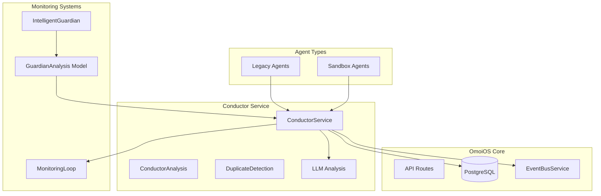
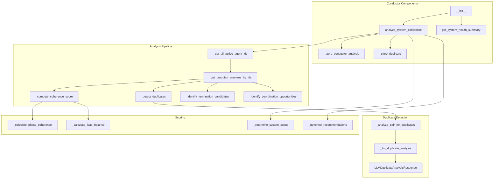
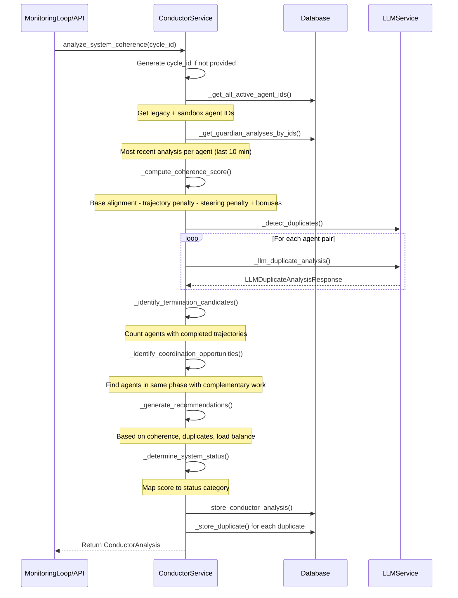
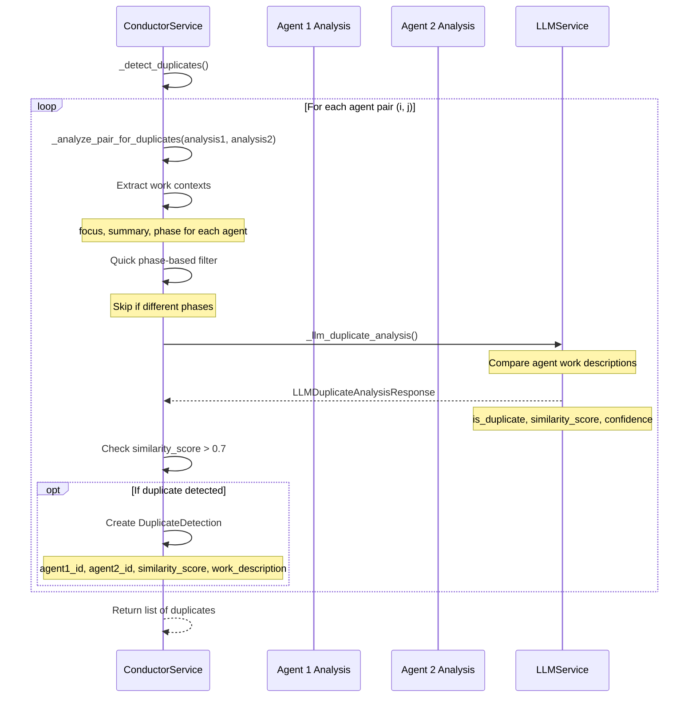
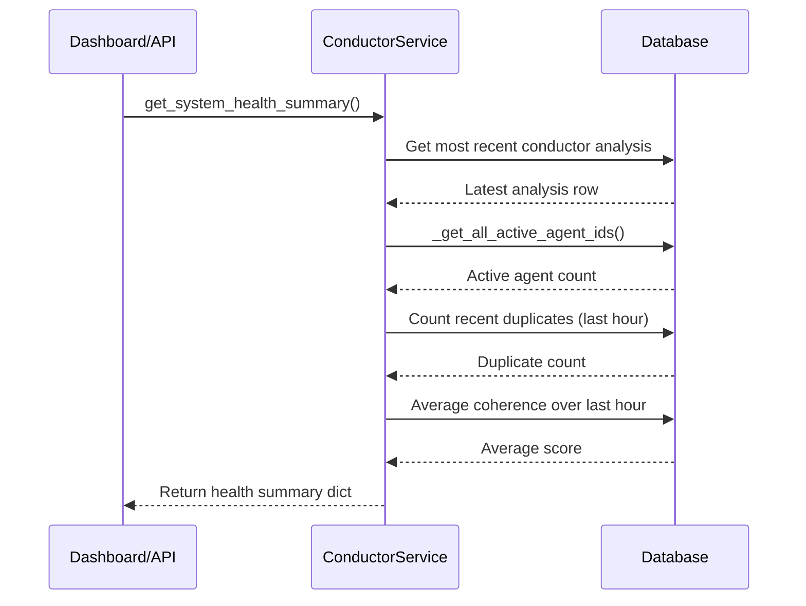

# Conductor Coherence Service Design Document

**Date:** 2026-04-22  
**Status:** Active  
**Purpose:** Design documentation for the Conductor service providing system-wide coherence analysis and duplicate detection in OmoiOS.  
**Related Docs:** [Orchestrator Service](./orchestrator_service.md), [Guardian Monitoring](./guardian_monitoring.md), [Discovery Service](./discovery_service.md), [Phase Manager](./phase_manager.md)

---

## 1. Overview

The Conductor Service analyzes Guardian trajectory analyses to compute system-wide coherence scores, detect duplicate work, and identify coordination opportunities. It replaces complex inter-agent communication protocols with intelligent database analysis and LLM-powered reasoning.

### Key Responsibilities

- **Coherence Analysis**: Compute overall system coherence score (0.0 - 1.0)
- **Duplicate Detection**: Identify agents working on essentially the same task
- **Termination Candidates**: Find agents that could be safely terminated
- **Coordination Opportunities**: Identify chances for agent collaboration
- **System Health Summary**: Provide comprehensive health metrics
- **Legacy + Sandbox Support**: Handle both agent types in analysis

### Coherence Score Interpretation

| Score | Status | Meaning |
|-------|--------|---------|
| 0.0 - 0.3 | critical | Chaos, conflicts, major duplications |
| 0.3 - 0.5 | warning | Significant issues requiring attention |
| 0.5 - 0.8 | normal | Acceptable but not optimal |
| 0.8 - 1.0 | optimal | Excellent coordination, no conflicts |

---

## 2. Architecture

### System Context



### Component Diagram



---

## 3. Public API Surface

### Core Analysis Methods

#### `analyze_system_coherence()`

```python
async def analyze_system_coherence(
    self,
    cycle_id: Optional[uuid.UUID] = None,
) -> ConductorAnalysis
```

Analyze system coherence across all active agents (legacy + sandbox).

**Parameters:**
- `cycle_id`: Optional cycle ID for tracking analysis cycles (auto-generated if not provided)

**Returns:** ConductorAnalysis container with:
- `coherence_score`: float (0.0 - 1.0)
- `system_status`: str ("no_agents", "critical", "warning", "inefficient", "normal", "optimal")
- `num_agents`: int (total active agents)
- `duplicate_count`: int (number of duplicate work items)
- `termination_count`: int (agents that could be terminated)
- `coordination_count`: int (coordination opportunities)
- `detected_duplicates`: List[Dict] (duplicate details)
- `recommendations`: List[str] (system improvement suggestions)

**Agent Coverage:**
- Legacy agents: Registered in agents table with recent heartbeats
- Sandbox agents: Tasks with sandbox_id in "running" status

---

#### `get_system_health_summary()`

```python
def get_system_health_summary(self) -> Dict[str, Any]
```

Get a comprehensive system health summary.

**Returns:**
```python
{
    "current_status": str,  # System status from latest analysis
    "current_coherence": float,  # Latest coherence score
    "average_coherence_1h": float,  # Average over last hour
    "active_agents": int,  # Count of active agents
    "recent_duplicates": int,  # Duplicates in last hour
    "last_analysis": datetime,  # Timestamp of latest analysis
}
```

---

### Pydantic Response Methods

#### `analyze_system_coherence_response()`

```python
async def analyze_system_coherence_response(
    self,
    cycle_id: Optional[uuid.UUID] = None,
) -> SystemCoherenceResponse
```

Analyze system coherence and return Pydantic response model.

**Returns:** SystemCoherenceResponse with full analysis details

---

#### `get_system_health_response()`

```python
def get_system_health_response(self) -> SystemHealthResponse
```

Get system health summary as Pydantic response model.

**Returns:** SystemHealthResponse with:
- `active_agents`: int
- `average_alignment`: float
- `agents_need_steering`: int
- `system_health`: str
- `phase_distribution`: Dict[str, int]
- `steering_types`: Dict[str, int]
- `recent_duplicates`: int
- `last_analysis`: Optional[datetime]

---

## 4. Data Flow

### Coherence Analysis Sequence



### Duplicate Detection Sequence



### System Health Query Sequence



---

## 5. Integration Points

### Database Models

#### ConductorAnalysisModel

```python
class ConductorAnalysisModel(Base):
    """Stored conductor analysis results."""
    
    id: Mapped[uuid.UUID] = mapped_column(primary_key=True)
    cycle_id: Mapped[uuid.UUID]
    coherence_score: Mapped[float]
    system_status: Mapped[str]
    num_agents: Mapped[int]
    duplicate_count: Mapped[int]
    termination_count: Mapped[int]
    coordination_count: Mapped[int]
    details: Mapped[dict] = mapped_column(JSONB)  # recommendations, etc.
    created_at: Mapped[datetime]
    updated_at: Mapped[datetime]
```

#### DetectedDuplicateModel

```python
class DetectedDuplicateModel(Base):
    """Record of detected duplicate work."""
    
    id: Mapped[uuid.UUID] = mapped_column(primary_key=True)
    conductor_analysis_id: Mapped[uuid.UUID]  # Foreign key to analysis
    agent1_id: Mapped[str]
    agent2_id: Mapped[str]
    similarity_score: Mapped[float]
    work_description: Mapped[str]
    resources: Mapped[dict] = mapped_column(JSONB)
    created_at: Mapped[datetime]
```

### Service Dependencies

| Service | Purpose | Optional |
|---------|---------|----------|
| DatabaseService | Persistence for analyses and duplicates | No |
| LLMService | Duplicate work analysis | Yes (skips if disabled) |

### Pydantic Response Models

#### SystemCoherenceResponse

```python
class SystemCoherenceResponse(BaseModel):
    coherence_score: float
    system_status: str
    num_agents: int
    duplicate_count: int
    termination_count: int
    coordination_count: int
    detected_duplicates: List[Dict[str, Any]]
    recommendations: List[str]
    analysis_id: uuid.UUID
```

#### SystemHealthResponse

```python
class SystemHealthResponse(BaseModel):
    active_agents: int
    average_alignment: float
    agents_need_steering: int
    system_health: str
    phase_distribution: Dict[str, int]
    steering_types: Dict[str, int]
    recent_duplicates: int
    last_analysis: Optional[datetime]
```

---

## 6. Error Handling

### Analysis Error Recovery

```python
try:
    # ... analysis logic ...
except Exception as e:
    logger.error(f"Failed to analyze system coherence: {e}")
    return ConductorAnalysis(
        coherence_score=0.0,
        system_status="error",
        num_agents=0,
        duplicate_count=0,
        termination_count=0,
        coordination_count=0,
        detected_duplicates=[],
        recommendations=[f"Analysis error: {str(e)}"],
    )
```

### LLM Duplicate Analysis Failure

```python
try:
    response = await self.llm_service.structured_output(...)
    return response
except Exception as e:
    logger.error(f"LLM duplicate analysis failed: {e}")
    return None
```

### Empty Agent Handling

```python
if num_agents == 0:
    return ConductorAnalysis(
        coherence_score=1.0,  # No conflicts if no activity
        system_status="no_agents",
        num_agents=0,
        duplicate_count=0,
        termination_count=0,
        coordination_count=0,
        detected_duplicates=[],
        recommendations=["No active agents to analyze"],
    )
```

---

## 7. Configuration

### Coherence Score Calculation

| Factor | Weight | Description |
|--------|--------|-------------|
| Base alignment | 100% | Average of individual agent alignment scores |
| Trajectory penalty | -20% | Per agent with misaligned trajectory |
| Steering penalty | -30% | Per agent needing steering |
| Phase coherence bonus | +10% | Diversified phases vs clustering |
| Load balance bonus | +10% | Even distribution across phases |

### Duplicate Detection Thresholds

| Setting | Value | Description |
|---------|-------|-------------|
| Similarity threshold | 0.7 | Minimum score to flag as duplicate |
| Analysis cutoff | 10 minutes | Only consider recent analyses |
| LLM retries | 3 | Retry attempts for LLM analysis |

### System Status Thresholds

| Status | Condition |
|--------|-----------|
| no_agents | num_agents == 0 |
| critical | coherence_score < 0.3 |
| warning | coherence_score < 0.5 |
| inefficient | duplicates > num_agents * 0.3 |
| optimal | coherence_score > 0.8 |
| normal | Default |

### LLM Analysis Toggle

```python
# Disable LLM-based duplicate detection to save tokens
conductor = ConductorService(
    db=db,
    llm_service=llm_service,
    llm_analysis_enabled=False,  # Skip duplicate detection
)
```

---

## 8. Related Documentation

- [Orchestrator Service](./orchestrator_service.md) - Task execution and sandbox management
- [Guardian Monitoring](./guardian_monitoring.md) - Emergency intervention system
- [Discovery Service](./discovery_service.md) - Adaptive workflow branching
- [Phase Manager](./phase_manager.md) - Phase transition orchestration
- [ARCHITECTURE.md](../../../ARCHITECTURE.md) - System architecture overview
- [backend/CLAUDE.md](../../../backend/CLAUDE.md) - Backend development guide

---

## Appendix: File Reference

**Source File:** `backend/omoi_os/services/conductor.py`  
**Lines:** 922  
**Key Classes:** ConductorService, ConductorAnalysis, DuplicateDetection, LLMDuplicateAnalysisResponse  
**Key Models:** ConductorAnalysisModel, DetectedDuplicateModel  
**Key Functions:** analyze_system_coherence, get_system_health_summary, _compute_coherence_score, _detect_duplicates
