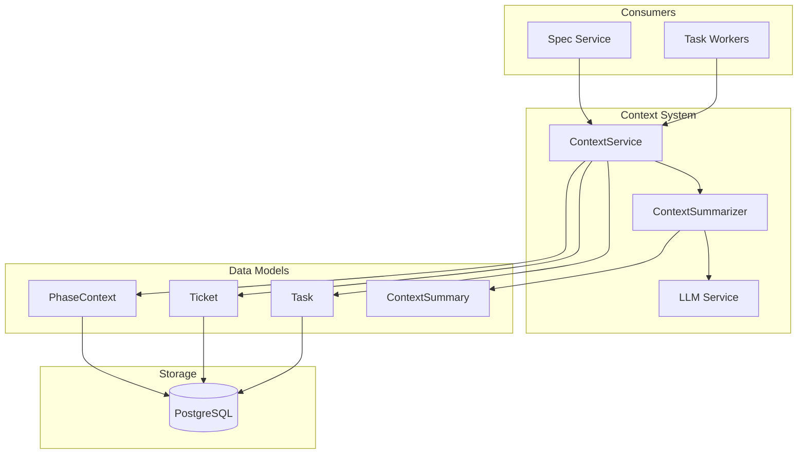
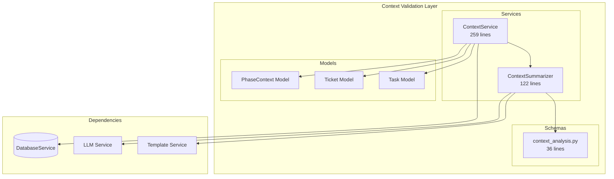
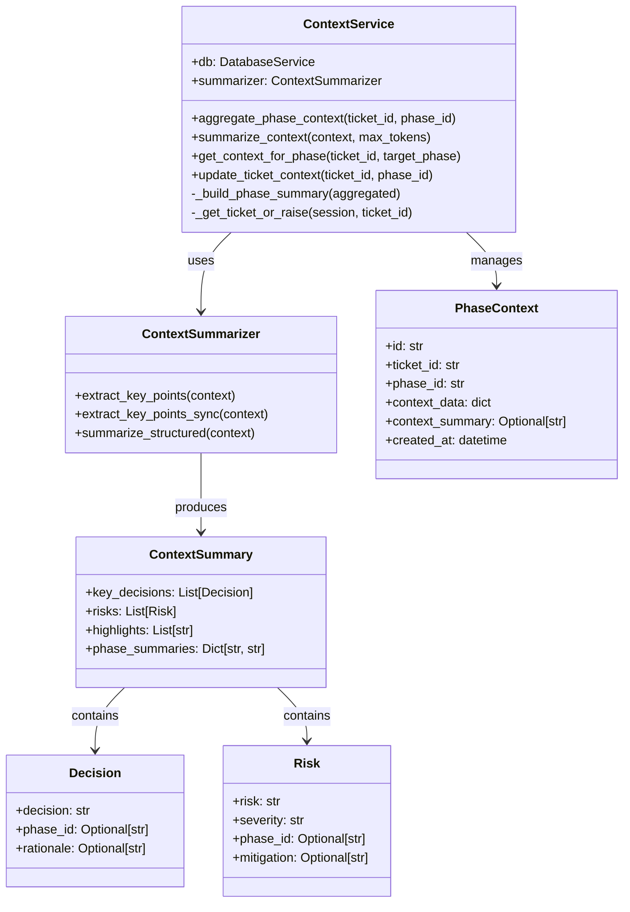
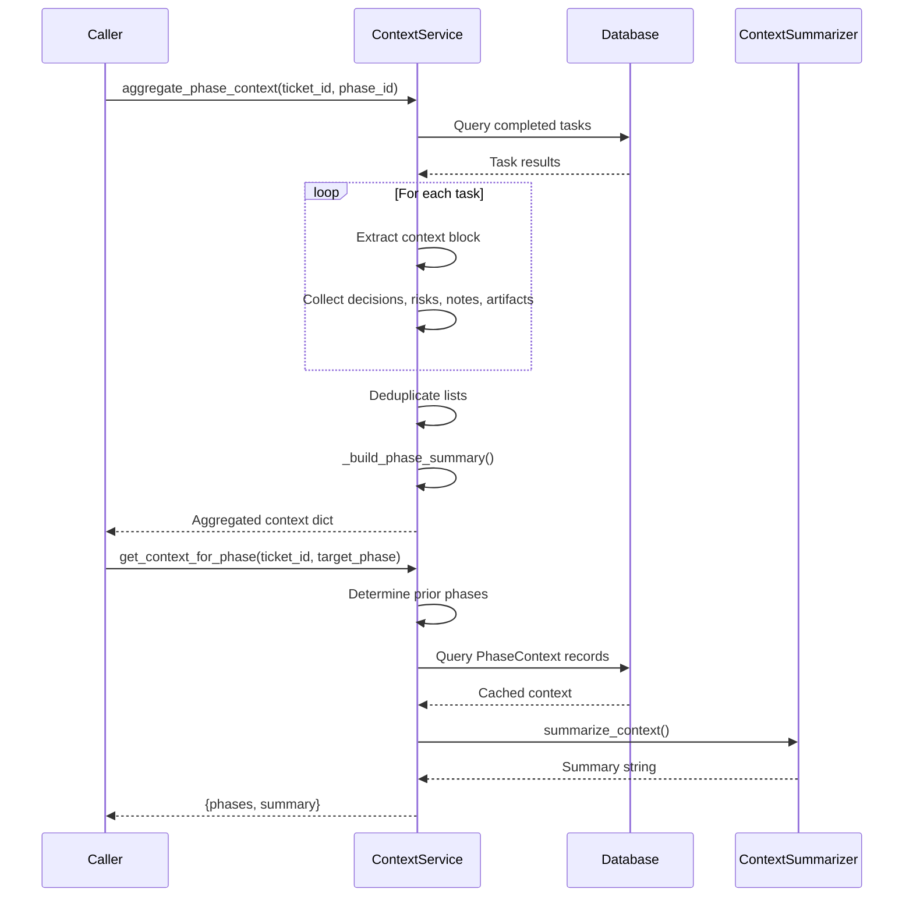
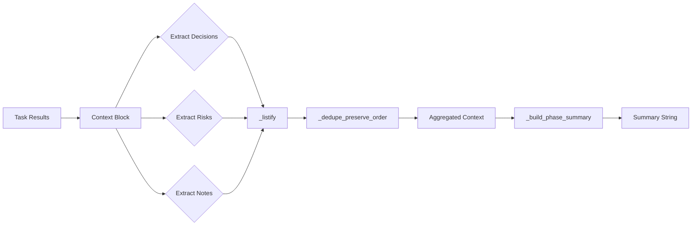

# Context Validation System

> **Date**: 2025-07-20 | **Status**: Active | **Version**: 1.0 | **Owner**: Deep Docs Pipeline
> **Source**: Generated from codebase analysis | **Cross-links**: See Related Documents section

## Table of Contents

1. [Overview](#overview)
2. [Architecture](#architecture)
3. [Core Components](#core-components)
4. [Context Gathering](#context-gathering)
5. [Validation Rules](#validation-rules)
6. [Decision Engine](#decision-engine)
7. [Error Handling](#error-handling)
8. [Configuration](#configuration)
9. [Related Documents](#related-documents)

---

## Overview

The Context Validation System manages cross-phase context aggregation, summarization, and validation for ticket-based workflows. It ensures that context from completed phases is properly captured, summarized, and made available to subsequent phases.

### Key Capabilities

| Capability | Description | Implementation |
|------------|-------------|----------------|
| Context Aggregation | Collect context from completed tasks per phase | `ContextService.aggregate_phase_context()` |
| Context Summarization | Reduce context to token budget using LLM | `ContextSummarizer.summarize_structured()` |
| Cross-Phase Context | Gather context from all prior phases | `ContextService.get_context_for_phase()` |
| Structured Output | Pydantic models for context analysis | `ContextSummary`, `Decision`, `Risk` |
| Phase Context Storage | Persist aggregated context to database | `PhaseContext` model |

### System Context



---

## Architecture

### Component Diagram



### Class Hierarchy



---

## Core Components

### 1. ContextService

`backend/omoi_os/services/context_service.py:17-259`

The main service for managing cross-phase context aggregation and summarization.

```python
class ContextService:
    """Manages cross-phase context aggregation and summarization."""
    
    def __init__(self, db: DatabaseService):
        self.db = db
        self.summarizer = ContextSummarizer()
```

#### Aggregate Phase Context

```python
# backend/omoi_os/services/context_service.py:24-82

def aggregate_phase_context(self, ticket_id: str, phase_id: str) -> dict[str, Any]:
    """Aggregate context from completed tasks in a specific phase.
    
    Args:
        ticket_id: Ticket identifier
        phase_id: Phase identifier
    
    Returns:
        Dict containing aggregated context for the phase:
        - ticket_id: Ticket identifier
        - phase_id: Phase identifier
        - tasks: List of completed task summaries
        - decisions: List of decisions made
        - risks: List of identified risks
        - notes: List of notes
        - artifacts: List of artifacts
        - summary: Textual summary of the phase
    """
    ticket_id = str(ticket_id)
    phase_id = str(phase_id)
    
    aggregated: dict[str, Any] = {
        "ticket_id": ticket_id,
        "phase_id": phase_id,
        "tasks": [],
        "decisions": [],
        "risks": [],
        "notes": [],
        "artifacts": [],
    }
    
    with self.db.get_session() as session:
        tasks = (
            session.query(Task)
            .filter(
                Task.ticket_id == ticket_id,
                Task.phase_id == phase_id,
                Task.status == "completed",
            )
            .order_by(Task.completed_at.asc().nulls_last())
            .all()
        )
        
        for task in tasks:
            task_result = task.result or {}
            aggregated["tasks"].append({
                "task_id": task.id,
                "task_type": task.task_type,
                "summary": task_result.get("summary") or task.description,
                "outputs": task_result.get("outputs"),
            })
            
            context_block = task_result.get("context") or {}
            aggregated["decisions"].extend(_listify(context_block.get("decisions")))
            aggregated["risks"].extend(_listify(context_block.get("risks")))
            aggregated["notes"].extend(_listify(context_block.get("notes")))
            
            artifacts = task_result.get("artifacts") or []
            if isinstance(artifacts, list):
                aggregated["artifacts"].extend(artifacts)
    
    # Deduplicate while preserving order
    aggregated["decisions"] = _dedupe_preserve_order(aggregated["decisions"])
    aggregated["risks"] = _dedupe_preserve_order(aggregated["risks"])
    aggregated["notes"] = _dedupe_preserve_order(aggregated["notes"])
    
    # Build summary
    aggregated["summary"] = self._build_phase_summary(aggregated)
    
    return aggregated
```

#### Get Context For Phase

```python
# backend/omoi_os/services/context_service.py:101-155

def get_context_for_phase(self, ticket_id: str, target_phase: str) -> dict[str, Any]:
    """Gather context from all phases preceding the target phase.
    
    Args:
        ticket_id: Ticket identifier
        target_phase: Phase requesting context
    
    Returns:
        Dict containing prior phase context and summary:
        - ticket_id: Ticket identifier
        - target_phase: Phase requesting context
        - phases: Dict of phase_id -> phase_context
        - summary: Summarized context string
    """
    ticket_id = str(ticket_id)
    target_phase = str(target_phase)
    
    # Get ordered phases
    ordered_phases = [phase.value for phase in PHASE_SEQUENCE]
    
    try:
        target_index = ordered_phases.index(target_phase)
    except ValueError:
        target_index = len(ordered_phases)
    
    included = ordered_phases[:target_index]
    
    with self.db.get_session() as session:
        ticket = self._get_ticket_or_raise(session, ticket_id)
        existing_context = (ticket.context or {}).get("phases", {})
        
        # Get cached context from ticket
        context_subset: dict[str, Any] = {
            phase: existing_context[phase]
            for phase in included
            if phase in existing_context
        }
        
        # Fetch missing phases from PhaseContext table
        missing_phases = [
            phase for phase in included if phase not in context_subset
        ]
        
        if missing_phases:
            records = (
                session.query(PhaseContext)
                .filter(
                    PhaseContext.ticket_id == ticket_id,
                    PhaseContext.phase_id.in_(missing_phases),
                )
                .all()
            )
            for record in records:
                context_subset[record.phase_id] = record.context_data
    
    # Generate summary
    summary_input = {"phases": context_subset} if context_subset else {}
    summary = self.summarize_context(summary_input) if summary_input else None
    
    return {
        "ticket_id": ticket_id,
        "target_phase": target_phase,
        "phases": context_subset,
        "summary": summary,
    }
```

#### Update Ticket Context

```python
# backend/omoi_os/services/context_service.py:157-209

def update_ticket_context(self, ticket_id: str, phase_id: str) -> None:
    """Update ticket context with aggregated phase data.
    
    Args:
        ticket_id: Ticket identifier
        phase_id: Phase identifier to aggregate
    """
    ticket_id = str(ticket_id)
    phase_id = str(phase_id)
    
    # Aggregate context for the phase
    phase_context = self.aggregate_phase_context(ticket_id, phase_id)
    phase_summary = self.summarize_context({"phases": {phase_id: phase_context}})
    
    with self.db.get_session() as session:
        ticket = self._get_ticket_or_raise(session, ticket_id)
        
        # Update ticket context
        ticket_context = ticket.context or {}
        phases = ticket_context.get("phases") or {}
        phases[phase_id] = phase_context
        ticket_context["phases"] = phases
        
        # Update history
        history = ticket_context.get("history") or []
        history.append({
            "phase_id": phase_id,
            "summary": phase_context.get("summary"),
        })
        ticket_context["history"] = history
        ticket_context["last_updated_phase"] = phase_id
        
        ticket.context = ticket_context
        ticket.context_summary = self.summarize_context(ticket_context)
        
        # Update or create PhaseContext record
        existing = (
            session.query(PhaseContext)
            .filter(
                PhaseContext.ticket_id == ticket_id,
                PhaseContext.phase_id == phase_id,
            )
            .order_by(PhaseContext.created_at.desc())
            .first()
        )
        
        if existing:
            existing.context_data = phase_context
            existing.context_summary = phase_summary
        else:
            session.add(
                PhaseContext(
                    ticket_id=ticket_id,
                    phase_id=phase_id,
                    context_data=phase_context,
                    context_summary=phase_summary,
                )
            )
```

### 2. ContextSummarizer

`backend/omoi_os/services/context_summarizer.py:12-122`

Summarizes structured context using LLM with PydanticAI structured output.

```python
class ContextSummarizer:
    """Summarizes structured context dictionaries using PydanticAI."""
    
    async def extract_key_points(self, context: dict[str, Any]) -> ContextSummary:
        """Extract key points from context using LLM.
        
        Args:
            context: Structured context dictionary
        
        Returns:
            ContextSummary with structured decisions, risks, and highlights.
        """
        # Convert context to JSON string
        context_str = json.dumps(context, indent=2, default=str)
        
        # Build prompt using template
        template_service = get_template_service()
        prompt = template_service.render(
            "prompts/context_analysis.md.j2",
            context_json=context_str,
        )
        
        system_prompt = template_service.render_system_prompt(
            "system/context_analysis.md.j2"
        )
        
        # Run extraction using LLM service
        llm = get_llm_service()
        return await llm.structured_output(
            prompt,
            output_type=ContextSummary,
            system_prompt=system_prompt,
        )
```

#### Synchronous Fallback

```python
# backend/omoi_os/services/context_summarizer.py:54-94

def extract_key_points_sync(self, context: dict[str, Any]) -> list[str]:
    """Synchronous fallback for key point extraction (rule-based).
    
    Args:
        context: Structured context dictionary
    
    Returns:
        Ordered list of key point strings.
    """
    key_points: list[str] = []
    phases = context.get("phases") if isinstance(context, dict) else None
    
    if isinstance(phases, dict):
        for phase_id, phase_context in phases.items():
            if not isinstance(phase_context, dict):
                continue
            
            summary = phase_context.get("summary")
            if summary:
                key_points.append(f"{phase_id}: {summary}")
            
            for decision in _safe_iterable(phase_context.get("decisions")):
                key_points.append(f"{phase_id} decision: {decision}")
            
            for risk in _safe_iterable(phase_context.get("risks")):
                key_points.append(f"{phase_id} risk: {risk}")
            
            tasks = phase_context.get("tasks")
            if isinstance(tasks, list) and tasks:
                task_summary = tasks[0].get("summary") or tasks[0].get("task_type")
                if task_summary:
                    key_points.append(f"{phase_id} lead task: {task_summary}")
    else:
        # Fall back to top-level decisions/risks
        for decision in _safe_iterable(context.get("decisions")):
            key_points.append(f"Decision: {decision}")
        for risk in _safe_iterable(context.get("risks")):
            key_points.append(f"Risk: {risk}")
    
    # Limit to reasonable number
    return key_points[:20]
```

#### Structured Summarization

```python
# backend/omoi_os/services/context_summarizer.py:96-113

def summarize_structured(self, context: dict[str, Any]) -> str:
    """Summarize structured context (decisions, risks, tasks, artifacts).
    
    Args:
        context: Structured context dict, typically {"phases": {...}}
    
    Returns:
        Human-readable summary string.
    """
    key_points = self.extract_key_points_sync(context)
    if not key_points:
        return "No contextual insights available yet."
    
    lines = ["Context Summary:"]
    for point in key_points:
        lines.append(f"- {point}")
    return "\n".join(lines)
```

---

## Context Gathering

### Phase Sequence

Context is gathered from phases in the order defined by `PHASE_SEQUENCE`:

```python
# From omoi_os.models.phases

PHASE_SEQUENCE = [
    Phase.EXPLORE,
    Phase.REQUIREMENTS,
    Phase.DESIGN,
    Phase.TASKS,
    Phase.SYNC,
    Phase.COMPLETE,
]
```

### Context Aggregation Flow



### Context Structure

```python
{
    "ticket_id": "ticket-uuid",
    "phase_id": "PHASE_IMPLEMENTATION",
    "tasks": [
        {
            "task_id": "task-uuid",
            "task_type": "code_generation",
            "summary": "Generate user authentication module",
            "outputs": {...}
        }
    ],
    "decisions": [
        "Use JWT for authentication",
        "Store tokens in httpOnly cookies"
    ],
    "risks": [
        "Token expiration handling needs testing"
    ],
    "notes": [
        "Consider rate limiting for login endpoint"
    ],
    "artifacts": [
        "auth_module.py",
        "token_utils.py"
    ],
    "summary": "Implemented user authentication with JWT..."
}
```

---

## Validation Rules

### Context Validation

The system enforces the following validation rules:

| Rule | Implementation | Error Handling |
|------|----------------|----------------|
| Ticket must exist | `_get_ticket_or_raise()` | Raises `ValueError` |
| Phase must be valid | `PHASE_SEQUENCE` lookup | Defaults to all prior phases |
| Task results must be dict | `task.result or {}` | Empty dict fallback |
| Context block must be iterable | `_listify()` | Empty list fallback |

### Data Type Validation

```python
# backend/omoi_os/services/context_service.py:239-247

def _listify(value: Any) -> list[Any]:
    """Ensure a value is returned as a list."""
    if not value:
        return []
    if isinstance(value, list):
        return value
    if isinstance(value, (tuple, set)):
        return list(value)
    return [value]
```

### Deduplication

```python
# backend/omoi_os/services/context_service.py:250-259

def _dedupe_preserve_order(items: list[Any]) -> list[Any]:
    """Remove duplicates while preserving order."""
    seen: set[Any] = set()
    result: list[Any] = []
    for item in items:
        if item in seen:
            continue
        seen.add(item)
        result.append(item)
    return result
```

---

## Decision Engine

### Context-Based Decisions

The `ContextSummary` schema captures decisions made during workflow execution:

```python
# backend/omoi_os/schemas/context_analysis.py:7-22

class Decision(BaseModel):
    """A decision made during workflow execution."""
    
    decision: str = Field(..., description="Decision description")
    phase_id: Optional[str] = Field(None, description="Phase where decision was made")
    rationale: Optional[str] = Field(None, description="Rationale for the decision")

class Risk(BaseModel):
    """A risk identified during workflow execution."""
    
    risk: str = Field(..., description="Risk description")
    severity: str = Field(..., description="Severity: high, medium, or low")
    phase_id: Optional[str] = Field(None, description="Phase where risk was identified")
    mitigation: Optional[str] = Field(None, description="Mitigation strategy")

class ContextSummary(BaseModel):
    """Structured output for context summarization."""
    
    key_decisions: List[Decision] = Field(default_factory=list)
    risks: List[Risk] = Field(default_factory=list)
    highlights: List[str] = Field(default_factory=list)
    phase_summaries: Dict[str, str] = Field(default_factory=dict)
```

### Decision Extraction Flow



---

## Error Handling

### Exception Handling

```python
# backend/omoi_os/services/context_service.py:231-236

@staticmethod
def _get_ticket_or_raise(session: Session, ticket_id: str) -> Ticket:
    ticket = session.get(Ticket, ticket_id)
    if not ticket:
        raise ValueError(f"Ticket {ticket_id} not found")
    return ticket
```

### Graceful Degradation

| Scenario | Behavior | Fallback |
|----------|----------|----------|
| Ticket not found | Raise `ValueError` | Caller handles |
| Phase not in sequence | Include all prior phases | Default behavior |
| No completed tasks | Return empty lists | Valid empty context |
| No context block | Empty lists via `_listify()` | Valid empty context |
| LLM unavailable | Use `extract_key_points_sync()` | Rule-based extraction |
| Summary too long | Truncate to `max_tokens` | Truncated summary |

### Summary Truncation

```python
# backend/omoi_os/services/context_service.py:84-99

def summarize_context(self, context: dict[str, Any], max_tokens: int = 2000) -> str:
    """Summarize aggregated context to reduce token usage.
    
    Args:
        context: Structured context dict
        max_tokens: Character budget approximation
    
    Returns:
        Summary string constrained to character budget.
    """
    summary = self.summarizer.summarize_structured(context)
    if len(summary) <= max_tokens:
        return summary
    
    # Truncate at word boundary
    truncated = summary[:max_tokens].rsplit(" ", 1)[0]
    return f"{truncated} ..."
```

---

## Configuration

### Token Budgets

| Context Type | Default Budget | Configurable |
|--------------|------------------|--------------|
| Phase summary | 2000 chars | `max_tokens` parameter |
| Key points | 20 items | Hard limit |
| Task outputs | Full | Stored in JSONB |

### Phase Context Model

`backend/omoi_os/models/phase_context.py:17-38`

```python
class PhaseContext(Base):
    """Aggregated context for a ticket phase."""
    
    __tablename__ = "phase_context"
    
    id: Mapped[str] = mapped_column(
        String, primary_key=True, default=lambda: str(uuid4())
    )
    ticket_id: Mapped[str] = mapped_column(
        String,
        ForeignKey("tickets.id", ondelete="CASCADE"),
        nullable=False,
        index=True,
    )
    phase_id: Mapped[str] = mapped_column(String(50), nullable=False, index=True)
    context_data: Mapped[dict] = mapped_column(JSONB, nullable=False)
    context_summary: Mapped[Optional[str]] = mapped_column(Text, nullable=True)
    created_at: Mapped[datetime] = mapped_column(
        DateTime(timezone=True), nullable=False, default=utc_now
    )
```

### Template Configuration

The ContextSummarizer uses Jinja2 templates for LLM prompts:

| Template | Purpose |
|----------|---------|
| `prompts/context_analysis.md.j2` | User prompt for context analysis |
| `system/context_analysis.md.j2` | System prompt for LLM |

---

## Related Documents

| Document | Path | Description |
|----------|------|-------------|
| Planning System | `docs/architecture/01-planning-system.md` | Spec state machine and phases |
| Database Schema | `docs/architecture/11-database-schema.md` | PhaseContext model details |
| LLM Service | `docs/architecture/15-llm-service.md` | Structured output patterns |
| Service Catalog | `docs/architecture/16-service-catalog.md` | All backend services |

---

## Source Code References

| File | Lines | Description |
|------|-------|-------------|
| `backend/omoi_os/services/context_service.py` | 1-259 | Main context service |
| `backend/omoi_os/services/context_summarizer.py` | 1-122 | Context summarization |
| `backend/omoi_os/schemas/context_analysis.py` | 1-36 | Pydantic schemas |
| `backend/omoi_os/models/phase_context.py` | 1-38 | Phase context model |
