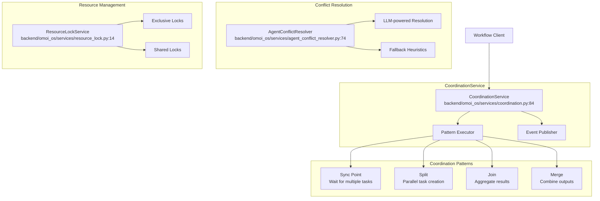
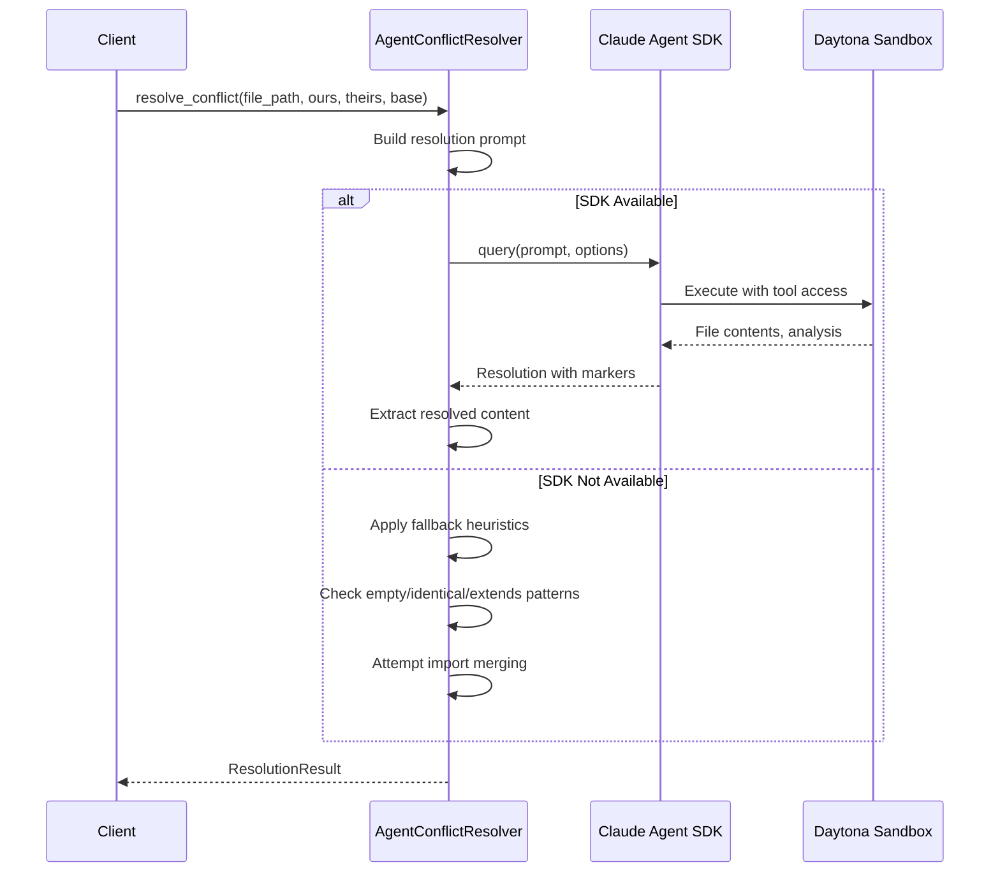

# Coordination Service Design

> **Date**: 2025-07-20 | **Status**: Active | **Version**: 1.0 | **Owner**: Deep Docs Pipeline
> **Source**: Generated from codebase analysis | **Cross-links**: See Related Documents section

## Overview

The Coordination Service provides multi-agent workflow orchestration primitives including synchronization points, parallel task splitting, result joining, and conflict resolution. It enables complex multi-agent workflows with proper synchronization, parallel execution, and result aggregation while preventing resource conflicts through distributed locking mechanisms.

## Architecture



## Coordination Patterns

### Pattern Types

`backend/omoi_os/services/coordination.py:20-27`

```python
class CoordinationPattern(str, Enum):
    """Coordination pattern types."""

    SYNC = "sync"  # Synchronization point - wait for multiple tasks
    SPLIT = "split"  # Split work into parallel tasks
    JOIN = "join"  # Join multiple tasks before proceeding
    MERGE = "merge"  # Merge results from multiple tasks
```

### Sync Point

`backend/omoi_os/services/coordination.py:29-40`

```python
@dataclass
class SyncPoint:
    """Synchronization point configuration.

    A sync point waits for multiple tasks to complete before allowing
    dependent tasks to proceed.
    """

    sync_id: str
    waiting_task_ids: List[str]
    required_count: Optional[int] = None  # None = wait for all
    timeout_seconds: Optional[int] = None
```

**Creating a Sync Point** (`coordination.py:109-150`):

```python
def create_sync_point(
    self,
    sync_id: str,
    waiting_task_ids: List[str],
    required_count: Optional[int] = None,
    timeout_seconds: Optional[int] = None,
) -> SyncPoint:
    """
    Create a synchronization point.

    Args:
        sync_id: Unique identifier for the sync point
        waiting_task_ids: List of task IDs that must complete
        required_count: Number of tasks that must complete (None = all)
        timeout_seconds: Optional timeout for sync point

    Returns:
        Created SyncPoint configuration
    """
    sync_point = SyncPoint(
        sync_id=sync_id,
        waiting_task_ids=waiting_task_ids,
        required_count=required_count or len(waiting_task_ids),
        timeout_seconds=timeout_seconds,
    )

    # Publish sync point created event
    if self.event_bus:
        self.event_bus.publish(
            SystemEvent(
                event_type="coordination.sync.created",
                entity_type="sync_point",
                entity_id=sync_id,
                payload={
                    "sync_id": sync_id,
                    "waiting_task_ids": waiting_task_ids,
                    "required_count": sync_point.required_count,
                },
            )
        )

    return sync_point
```

**Checking Sync Point Readiness** (`coordination.py:152-186`):

```python
def check_sync_point_ready(self, sync_id: str, sync_point: SyncPoint) -> bool:
    """
    Check if a sync point is ready (required tasks completed).

    Args:
        sync_id: Sync point identifier
        sync_point: SyncPoint configuration

    Returns:
        True if sync point is ready, False otherwise
    """
    with self.db.get_session() as session:
        completed_count = 0
        for task_id in sync_point.waiting_task_ids:
            task = session.query(Task).filter(Task.id == task_id).first()
            if task and task.status == "completed":
                completed_count += 1

        is_ready = completed_count >= sync_point.required_count

        if is_ready and self.event_bus:
            self.event_bus.publish(
                SystemEvent(
                    event_type="coordination.sync.ready",
                    entity_type="sync_point",
                    entity_id=sync_id,
                    payload={
                        "sync_id": sync_id,
                        "completed_count": completed_count,
                        "required_count": sync_point.required_count,
                    },
                )
            )

        return is_ready
```

### Split Pattern

`backend/omoi_os/services/coordination.py:42-55`

```python
@dataclass
class SplitConfig:
    """Split configuration for parallel task creation.

    Splits a single task into multiple parallel tasks that can execute
    independently.
    """

    split_id: str
    source_task_id: str
    target_tasks: List[Dict[str, Any]]  # List of task configs
    required_capabilities: Optional[List[str]] = None
```

**Splitting Tasks** (`coordination.py:192-245`):

```python
def split_task(
    self,
    split_id: str,
    source_task_id: str,
    target_tasks: List[Dict[str, Any]],
    required_capabilities: Optional[List[str]] = None,
) -> List[Task]:
    """
    Split a task into multiple parallel tasks.

    Args:
        split_id: Unique identifier for the split operation
        source_task_id: ID of the source task being split
        target_tasks: List of task configurations for parallel tasks
        required_capabilities: Optional capabilities required for target tasks

    Returns:
        List of created Task objects
    """
    with self.db.get_session() as session:
        source_task = session.query(Task).filter(Task.id == source_task_id).first()
        if not source_task:
            raise ValueError(f"Source task {source_task_id} not found")

        created_tasks = []
        for task_config in target_tasks:
            # Create task with dependency on source task
            task = self.queue.enqueue_task(
                ticket_id=source_task.ticket_id,
                phase_id=task_config.get("phase_id", source_task.phase_id),
                task_type=task_config.get("task_type", "split_task"),
                description=task_config.get("description", ""),
                priority=task_config.get("priority", source_task.priority),
                dependencies={"depends_on": [source_task_id]},
            )
            created_tasks.append(task)

        # Publish split event
        if self.event_bus:
            self.event_bus.publish(
                SystemEvent(
                    event_type="coordination.split.created",
                    entity_type="split",
                    entity_id=split_id,
                    payload={
                        "split_id": split_id,
                        "source_task_id": source_task_id,
                        "target_task_ids": [t.id for t in created_tasks],
                        "required_capabilities": required_capabilities,
                    },
                )
            )

        return created_tasks
```

### Join Pattern

`backend/omoi_os/services/coordination.py:57-69`

```python
@dataclass
class JoinConfig:
    """Join configuration for aggregating parallel tasks.

    Joins multiple parallel tasks and creates a continuation task
    that depends on all joined tasks completing.
    """

    join_id: str
    source_task_ids: List[str]
    continuation_task: Dict[str, Any]  # Task config for continuation
    merge_strategy: str = "all"  # "all", "first", "majority"
```

**Joining Tasks** (`coordination.py:251-306`):

```python
def join_tasks(
    self,
    join_id: str,
    source_task_ids: List[str],
    continuation_task: Dict[str, Any],
    merge_strategy: str = "all",
) -> Task:
    """
    Join multiple tasks and create a continuation task.

    Args:
        join_id: Unique identifier for the join operation
        source_task_ids: List of task IDs to join
        continuation_task: Configuration for the continuation task
        merge_strategy: Strategy for merging results ("all", "first", "majority")

    Returns:
        Created continuation Task object
    """
    with self.db.get_session() as session:
        # Verify all source tasks exist
        source_tasks = (
            session.query(Task).filter(Task.id.in_(source_task_ids)).all()
        )
        if len(source_tasks) != len(source_task_ids):
            raise ValueError("Some source tasks not found")

        # Get ticket_id from first source task
        ticket_id = source_tasks[0].ticket_id

        # Create continuation task with dependencies on all source tasks
        continuation = self.queue.enqueue_task(
            ticket_id=ticket_id,
            phase_id=continuation_task.get("phase_id", source_tasks[0].phase_id),
            task_type=continuation_task.get("task_type", "join_task"),
            description=continuation_task.get("description", ""),
            priority=continuation_task.get("priority", source_tasks[0].priority),
            dependencies={"depends_on": source_task_ids},
        )

        # Publish join event
        if self.event_bus:
            self.event_bus.publish(
                SystemEvent(
                    event_type="coordination.join.created",
                    entity_type="join",
                    entity_id=join_id,
                    payload={
                        "join_id": join_id,
                        "source_task_ids": source_task_ids,
                        "continuation_task_id": continuation.id,
                        "merge_strategy": merge_strategy,
                    },
                )
            )

        return continuation
```

### Merge Pattern

`backend/omoi_os/services/coordination.py:71-82`

```python
@dataclass
class MergeConfig:
    """Merge configuration for combining task results.

    Merges results from multiple tasks using a specified strategy.
    """

    merge_id: str
    source_task_ids: List[str]
    merge_strategy: str = "combine"  # "combine", "union", "intersection", "custom"
    custom_merge_fn: Optional[str] = None  # Reference to custom merge function
```

**Merging Results** (`coordination.py:377-437`):

```python
def merge_task_results(
    self,
    merge_id: str,
    source_task_ids: List[str],
    merge_strategy: str = "combine",
    custom_merge_fn: Optional[str] = None,
) -> Dict[str, Any]:
    """
    Merge results from multiple tasks.

    Args:
        merge_id: Unique identifier for the merge operation
        source_task_ids: List of task IDs to merge results from
        merge_strategy: Strategy for merging ("combine", "union", "intersection", "custom")
        custom_merge_fn: Optional reference to custom merge function

    Returns:
        Merged result dictionary
    """
    with self.db.get_session() as session:
        # Get all source tasks
        source_tasks = (
            session.query(Task).filter(Task.id.in_(source_task_ids)).all()
        )
        if len(source_tasks) != len(source_task_ids):
            raise ValueError("Some source tasks not found")

        # Collect results
        results = []
        for task in source_tasks:
            if task.status != "completed":
                raise ValueError(f"Task {task.id} is not completed")
            if task.result:
                results.append(task.result)

        # Apply merge strategy
        merged_result = self._apply_merge_strategy(
            results, merge_strategy, custom_merge_fn
        )

        # Publish merge event
        if self.event_bus:
            self.event_bus.publish(
                SystemEvent(
                    event_type="coordination.merge.completed",
                    entity_type="merge",
                    entity_id=merge_id,
                    payload={
                        "merge_id": merge_id,
                        "source_task_ids": source_task_ids,
                        "merge_strategy": merge_strategy,
                        "result_keys": (
                            list(merged_result.keys())
                            if isinstance(merged_result, dict)
                            else []
                        ),
                    },
                )
            )

        return merged_result
```

**Merge Strategies** (`coordination.py:439-492`):

```python
def _apply_merge_strategy(
    self,
    results: List[Dict[str, Any]],
    strategy: str,
    custom_fn: Optional[str] = None,
) -> Dict[str, Any]:
    """
    Apply merge strategy to combine results.

    Args:
        results: List of result dictionaries
        strategy: Merge strategy name
        custom_fn: Optional custom function reference

    Returns:
        Merged result dictionary
    """
    if not results:
        return {}

    if strategy == "combine":
        # Combine all results into a single dict
        merged = {}
        for result in results:
            if isinstance(result, dict):
                merged.update(result)
        return merged

    elif strategy == "union":
        # Union of all keys, values from last result
        merged = {}
        for result in results:
            if isinstance(result, dict):
                merged.update(result)
        return merged

    elif strategy == "intersection":
        # Only keys present in all results
        if not results:
            return {}
        common_keys = set(results[0].keys())
        for result in results[1:]:
            if isinstance(result, dict):
                common_keys &= set(result.keys())
        return {k: results[-1][k] for k in common_keys if k in results[-1]}

    elif strategy == "custom" and custom_fn:
        # Custom merge function (would need to be loaded/executed)
        # For now, fall back to combine
        return self._apply_merge_strategy(results, "combine", None)

    else:
        # Default: combine
        return self._apply_merge_strategy(results, "combine", None)
```

## Conflict Resolution

### AgentConflictResolver

`backend/omoi_os/services/agent_conflict_resolver.py:74-549`

```python
class AgentConflictResolver:
    """Resolves git merge conflicts using Claude Agent SDK.

    This service provides agentic conflict resolution by:
    1. Building a rich context prompt about the conflict
    2. Giving Claude access to file reading tools
    3. Letting Claude reason about the best resolution
    4. Extracting the resolved content

    The agentic approach is better than one-shot because:
    - Claude can examine related code for context
    - Claude can verify the resolution makes sense
    - Claude can ask for clarification (through tool use)
    - Better handling of complex, semantic conflicts
    """

    def __init__(
        self,
        api_key: Optional[str] = None,
        model: str = "claude-sonnet-4-20250514",
        max_turns: int = 5,
        timeout_seconds: int = 120,
        sandbox: Optional["Sandbox"] = None,
        workspace_path: str = "/workspace",
    ):
```

### Resolution Flow



### Resolution Context

`backend/omoi_os/services/agent_conflict_resolver.py:49-60`

```python
@dataclass
class ResolutionContext:
    """Context for conflict resolution."""

    file_path: str
    ours_content: str
    theirs_content: str
    base_content: Optional[str] = None
    task_id: Optional[str] = None
    related_files: List[str] = field(default_factory=list)
    task_description: Optional[str] = None
```

### LLM-Powered Resolution

`backend/omoi_os/services/agent_conflict_resolver.py:202-291`

```python
async def _resolve_with_sdk(self, context: ResolutionContext) -> ResolutionResult:
    """Resolve conflict using Claude Agent SDK.

    This runs the full agentic flow with tool access.
    """
    prompt = self._build_resolution_prompt(context)

    try:
        # Configure agent options
        options = ClaudeAgentOptions(
            system_prompt=self._get_system_prompt(),
            max_turns=self.max_turns,
            allowed_tools=["Read"],  # Allow reading files for context
        )

        # Add workspace path if in sandbox
        if self.sandbox:
            options.cwd = self.workspace_path

        # Run agentic query
        resolved_content = None
        reasoning = None
        tokens_used = 0

        async for message in query(prompt=prompt, options=options):
            if isinstance(message, AssistantMessage):
                for block in message.content:
                    if isinstance(block, TextBlock):
                        text = block.text

                        # Look for resolution markers
                        if "<<<RESOLVED>>>" in text:
                            start = text.find("<<<RESOLVED>>>") + len("<<<RESOLVED>>>")
                            end = text.find("<<<END_RESOLVED>>>")
                            if end > start:
                                resolved_content = text[start:end].strip()
                        elif "<<<REASONING>>>" in text:
                            start = text.find("<<<REASONING>>>") + len("<<<REASONING>>>")
                            end = text.find("<<<END_REASONING>>>")
                            if end > start:
                                reasoning = text[start:end].strip()
                        else:
                            # If no markers, treat the whole response as resolved content
                            if self._looks_like_code(text, context.file_path):
                                resolved_content = text

            # Track token usage from metadata if available
            if hasattr(message, "usage"):
                tokens_used += getattr(message.usage, "total_tokens", 0)

        if resolved_content:
            return ResolutionResult(
                success=True,
                resolved_content=resolved_content,
                reasoning=reasoning,
                tokens_used=tokens_used,
            )
        else:
            return ResolutionResult(
                success=False,
                error_message="No resolution content extracted from agent response",
                tokens_used=tokens_used,
            )
```

### Fallback Heuristics

`backend/omoi_os/services/agent_conflict_resolver.py:293-367`

```python
async def _resolve_fallback(self, context: ResolutionContext) -> ResolutionResult:
    """Fallback resolution when SDK is not available.

    Uses simple heuristics for common conflict patterns.
    """
    logger.warning(
        "using_fallback_resolution",
        extra={"file_path": context.file_path},
    )

    # Simple heuristics for common patterns
    ours = context.ours_content
    theirs = context.theirs_content

    # If one side is empty, use the other
    if not ours.strip():
        return ResolutionResult(
            success=True,
            resolved_content=theirs,
            reasoning="Used theirs (ours was empty)",
        )
    if not theirs.strip():
        return ResolutionResult(
            success=True,
            resolved_content=ours,
            reasoning="Used ours (theirs was empty)",
        )

    # If they're the same, use either
    if ours.strip() == theirs.strip():
        return ResolutionResult(
            success=True,
            resolved_content=ours,
            reasoning="Both sides identical",
        )

    # Check for simple addition patterns (one extends the other)
    if theirs.startswith(ours):
        return ResolutionResult(
            success=True,
            resolved_content=theirs,
            reasoning="Theirs extends ours",
        )
    if ours.startswith(theirs):
        return ResolutionResult(
            success=True,
            resolved_content=ours,
            reasoning="Ours extends theirs",
        )

    # For import statements, try to combine
    if (
        context.file_path.endswith(".py")
        and "import" in ours
        and "import" in theirs
    ):
        combined = self._merge_imports(ours, theirs)
        if combined:
            return ResolutionResult(
                success=True,
                resolved_content=combined,
                reasoning="Merged import statements",
            )

    # Cannot resolve automatically
    return ResolutionResult(
        success=False,
        error_message="Cannot resolve automatically without Claude Agent SDK",
    )
```

## Resource Locking

### ResourceLockService

`backend/omoi_os/services/resource_lock.py:14-265`

```python
class ResourceLockService:
    """Service for managing resource locks to prevent conflicts."""

    def __init__(self, db: DatabaseService):
        self.db = db
```

### Lock Acquisition

`backend/omoi_os/services/resource_lock.py:26-90`

```python
def acquire_lock(
    self,
    resource_type: str,
    resource_id: str,
    task_id: str,
    agent_id: str,
    lock_mode: str = "exclusive",
    timeout_seconds: Optional[int] = None,
) -> Optional[ResourceLock]:
    """
    Attempt to acquire a resource lock.

    Args:
        resource_type: Type of resource (file, database, service)
        resource_id: Resource identifier
        task_id: Task requesting the lock
        agent_id: Agent requesting the lock
        lock_mode: Lock mode (exclusive, shared)
        timeout_seconds: Optional lock expiration timeout

    Returns:
        ResourceLock if acquired, None if resource already locked
    """
    with self.db.get_session() as session:
        # Check for existing locks on this resource
        existing_locks = (
            session.query(ResourceLock)
            .filter(
                ResourceLock.resource_type == resource_type,
                ResourceLock.resource_id == resource_id,
                ResourceLock.released_at.is_(None),  # Not yet released
            )
            .all()
        )

        # Check for conflicts
        if lock_mode == "exclusive":
            # Exclusive lock conflicts with any existing lock
            if existing_locks:
                return None
        elif lock_mode == "shared":
            # Shared lock conflicts with exclusive locks
            for lock in existing_locks:
                if lock.lock_mode == "exclusive":
                    return None

        # Create lock
        expires_at = None
        if timeout_seconds:
            expires_at = utc_now() + timedelta(seconds=timeout_seconds)

        lock = ResourceLock(
            resource_type=resource_type,
            resource_id=resource_id,
            locked_by_task_id=task_id,
            locked_by_agent_id=agent_id,
            lock_mode=lock_mode,
            expires_at=expires_at,
        )
        session.add(lock)
        session.commit()
        session.refresh(lock)
        session.expunge(lock)

        return lock
```

### Lock Release

`backend/omoi_os/services/resource_lock.py:92-139`

```python
def release_lock(self, lock_id: str) -> bool:
    """
    Release a resource lock.

    Args:
        lock_id: Lock ID to release

    Returns:
        True if released successfully
    """
    with self.db.get_session() as session:
        lock = (
            session.query(ResourceLock).filter(ResourceLock.id == lock_id).first()
        )
        if not lock:
            return False

        lock.released_at = utc_now()
        session.commit()
        return True

def release_task_locks(self, task_id: str) -> int:
    """
    Release all locks held by a task.

    Args:
        task_id: Task ID

    Returns:
        Number of locks released
    """
    with self.db.get_session() as session:
        locks = (
            session.query(ResourceLock)
            .filter(
                ResourceLock.locked_by_task_id == task_id,
                ResourceLock.released_at.is_(None),
            )
            .all()
        )

        count = 0
        for lock in locks:
            lock.released_at = utc_now()
            count += 1

        session.commit()
        return count
```

### Deadlock Prevention

The resource locking system prevents deadlocks through:

1. **Timeout-based expiration**: All locks can have optional timeouts
2. **Cleanup of expired locks**: Background job releases expired locks
3. **Task-level lock tracking**: All locks for a task are released on task completion/failure
4. **Agent-level cleanup**: Emergency release of all agent locks

**Cleanup Expired Locks** (`resource_lock.py:169-195`):

```python
def cleanup_expired_locks(self) -> int:
    """
    Release locks that have exceeded their expiration time.

    Returns:
        Number of locks cleaned up
    """
    now = utc_now()

    with self.db.get_session() as session:
        expired_locks = (
            session.query(ResourceLock)
            .filter(
                ResourceLock.expires_at.isnot(None),
                ResourceLock.expires_at < now,
                ResourceLock.released_at.is_(None),
            )
            .all()
        )

        count = 0
        for lock in expired_locks:
            lock.released_at = now
            count += 1

        session.commit()
        return count
```

## Pattern Execution

### Unified Pattern Executor

`backend/omoi_os/services/coordination.py:498-548`

```python
def execute_pattern(self, pattern_config: Dict[str, Any]) -> Dict[str, Any]:
    """
    Execute a coordination pattern from configuration.

    Args:
        pattern_config: Pattern configuration dictionary

    Returns:
        Execution result with created entities
    """
    pattern_type = pattern_config.get("type")
    pattern_id = pattern_config.get("id", "")

    if pattern_type == CoordinationPattern.SYNC:
        sync_point = self.create_sync_point(
            sync_id=pattern_id,
            waiting_task_ids=pattern_config.get("waiting_task_ids", []),
            required_count=pattern_config.get("required_count"),
            timeout_seconds=pattern_config.get("timeout_seconds"),
        )
        return {"sync_point": sync_point, "sync_id": sync_point.sync_id}

    elif pattern_type == CoordinationPattern.SPLIT:
        tasks = self.split_task(
            split_id=pattern_id,
            source_task_id=pattern_config.get("source_task_id", ""),
            target_tasks=pattern_config.get("target_tasks", []),
            required_capabilities=pattern_config.get("required_capabilities"),
        )
        return {"tasks": tasks, "task_ids": [t.id for t in tasks]}

    elif pattern_type == CoordinationPattern.JOIN:
        continuation = self.join_tasks(
            join_id=pattern_id,
            source_task_ids=pattern_config.get("source_task_ids", []),
            continuation_task=pattern_config.get("continuation_task", {}),
            merge_strategy=pattern_config.get("merge_strategy", "all"),
        )
        return {"continuation_task": continuation, "task_id": continuation.id}

    elif pattern_type == CoordinationPattern.MERGE:
        merged = self.merge_task_results(
            merge_id=pattern_id,
            source_task_ids=pattern_config.get("source_task_ids", []),
            merge_strategy=pattern_config.get("merge_strategy", "combine"),
            custom_merge_fn=pattern_config.get("custom_merge_fn"),
        )
        return {"merged_result": merged}

    else:
        raise ValueError(f"Unknown pattern type: {pattern_type}")
```

## Event Integration

The coordination service publishes events for workflow tracking:

| Event Type | Description | Payload |
|------------|-------------|---------|
| `coordination.sync.created` | Sync point created | sync_id, waiting_task_ids, required_count |
| `coordination.sync.ready` | Sync point ready | sync_id, completed_count, required_count |
| `coordination.split.created` | Split operation created | split_id, source_task_id, target_task_ids |
| `coordination.join.created` | Join operation created | join_id, source_task_ids, continuation_task_id |
| `coordination.merge.completed` | Merge completed | merge_id, source_task_ids, merge_strategy |

## Related Documents

- [Ticket Workflow](./ticket_workflow.md) - Ticket state machine orchestration
- [Task Queue](./task_queue.md) - Task assignment and lifecycle
- Dependency Graph - Visual dependency management
- Resource Lock Model - Lock entity definition
- Convergence Merge - Branch merge coordination
- [Execution Architecture](../../architecture/02-execution-system.md) - System design
