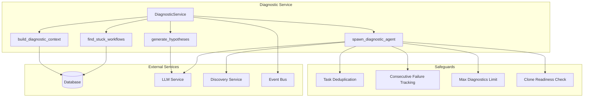
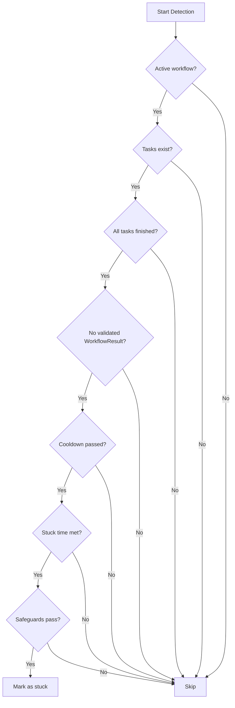
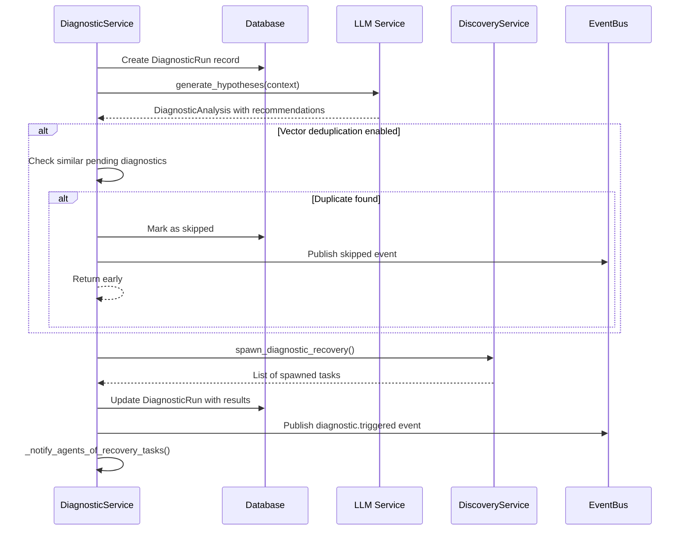
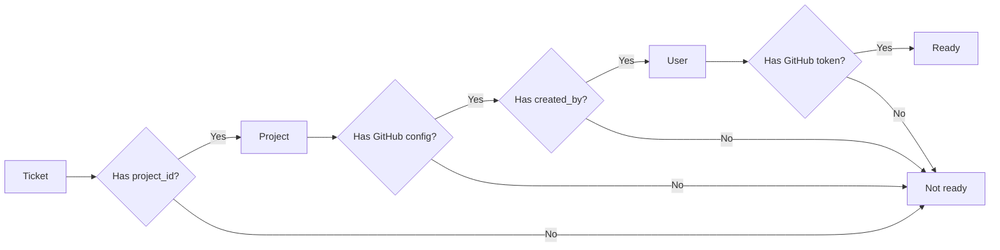
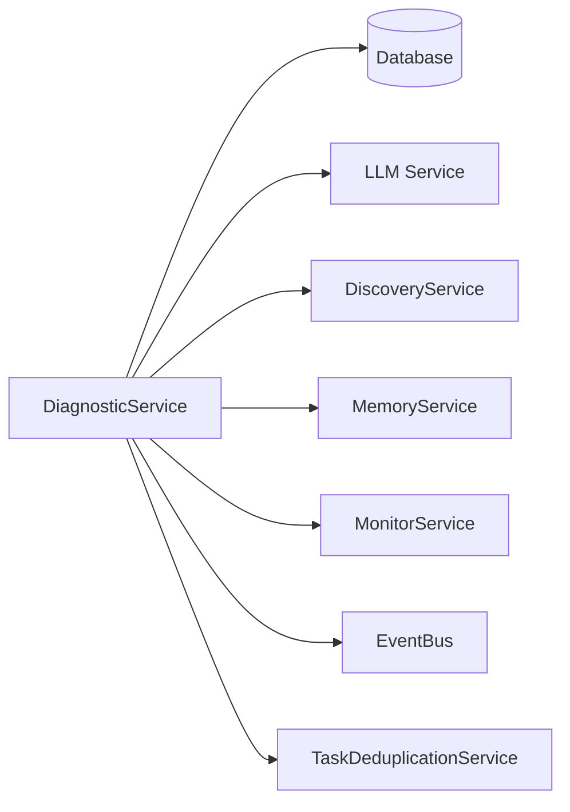

# Diagnostic Service

> **Date**: 2025-07-20 | **Status**: Active | **Version**: 1.0 | **Owner**: Deep Docs Pipeline
> **Source**: Generated from codebase analysis | **Cross-links**: See Related Documents section

## Overview

The Diagnostic Service is a critical component of OmoiOS's self-healing infrastructure. It monitors workflows for stuck conditions—where all tasks have completed but no validated result exists—and automatically spawns diagnostic agents to analyze root causes and create recovery tasks. The service implements multiple safeguards to prevent runaway task spawning while ensuring workflows can recover from failure states.

## Architecture



## Key Components

### DiagnosticService Class

`backend/omoi_os/services/diagnostic.py:32-1237`

The main service class that orchestrates stuck workflow detection and recovery.

```python
class DiagnosticService:
    """Service for detecting stuck workflows and spawning diagnostic agents."""
    
    def __init__(
        self,
        db: DatabaseService,
        discovery: "DiscoveryService",
        memory: "MemoryService",
        monitor: "MonitorService",
        event_bus: Optional[EventBusService] = None,
        embedding_service: Optional["EmbeddingService"] = None,
    ):
```

**Key Methods:**

| Method | Line | Purpose |
|--------|------|---------|
| `find_stuck_workflows` | 98-334 | Identifies workflows meeting all stuck conditions |
| `spawn_diagnostic_agent` | 336-539 | Creates diagnostic run and spawns recovery tasks |
| `generate_hypotheses` | 541-577 | Uses LLM to analyze context and generate recommendations |
| `build_diagnostic_context` | 579-678 | Builds comprehensive context for diagnostic analysis |
| `complete_diagnostic_run` | 680-725 | Marks diagnostic run as completed with results |

## Stuck Workflow Detection

### Detection Conditions (ALL must be true)

`backend/omoi_os/services/diagnostic.py:98-334`



### Safeguard Conditions (any true = skip)

| Safeguard | Purpose | Implementation |
|-----------|---------|----------------|
| Pending diagnostic tasks | Prevent duplicate diagnostics | Check for `discovery_diagnostic%` task types in pending/running status |
| Consecutive failure limit | Stop after repeated failures | Track `_consecutive_failures` per workflow |
| Total diagnostic run limit | Cap total diagnostics | Count `DiagnosticRun` records per workflow |
| Clone readiness | Ensure sandbox can clone code | Verify project → GitHub config → user token chain |

## Diagnostic Agent Spawning

### Workflow

`backend/omoi_os/services/diagnostic.py:336-539`



### Hypothesis Generation

`backend/omoi_os/services/diagnostic.py:541-577`

Uses PydanticAI with structured output to generate diagnostic analysis:

```python
async def generate_hypotheses(
    self,
    context: dict,
) -> DiagnosticAnalysis:
    """Generate hypotheses and recommendations for a stuck workflow."""
    
    # Build prompt using Jinja2 template
    prompt = template_service.render(
        "prompts/diagnostic.md.j2",
        workflow_goal=context.get("workflow_goal", "Unknown"),
        current_phase=context.get("current_phase", "Unknown"),
        total_tasks=context.get("total_tasks", 0),
        done_tasks=context.get("done_tasks", 0),
        failed_tasks=context.get("failed_tasks", 0),
        time_stuck_seconds=context.get("time_stuck_seconds", 0),
        recent_tasks=context.get("recent_tasks", [])[:10],
    )
    
    # Run analysis using LLM service
    llm = get_llm_service()
    return await llm.structured_output(
        prompt,
        output_type=DiagnosticAnalysis,
        system_prompt=system_prompt,
    )
```

## Safeguards Implementation

### Vector-Based Task Deduplication

`backend/omoi_os/services/diagnostic.py:426-459`

```python
# Check for semantically similar pending diagnostic tasks
if self._task_dedup:
    dedup_result = self._task_dedup.check_similar_pending_diagnostic(
        workflow_id=workflow_id,
        description=diagnosis_text,
        threshold=0.90,  # High threshold for strict matching
    )
    if dedup_result.is_duplicate:
        # Skip spawning and mark as duplicate
```

### Consecutive Failure Tracking

`backend/omoi_os/services/diagnostic.py:1123-1189`

```python
def record_diagnostic_task_failure(self, workflow_id: str) -> int:
    """Record a diagnostic task failure for a workflow."""
    current_count = self._consecutive_failures.get(workflow_id, 0)
    new_count = current_count + 1
    self._consecutive_failures[workflow_id] = new_count
    
    if new_count >= self.max_consecutive_failures:
        logger.warning(
            f"Workflow {workflow_id} reached max consecutive diagnostic failures"
        )
    
    return new_count
```

### Clone Readiness Verification

`backend/omoi_os/services/diagnostic.py:758-810`

Verifies the complete chain for sandbox cloning:



## Agent Notification System

### Recovery Task Notifications

`backend/omoi_os/services/diagnostic.py:847-1002`

When diagnostic recovery tasks are spawned, active agents working on the workflow are notified via the intervention system:

```python
def _notify_agents_of_recovery_tasks(
    self,
    session,
    workflow_id: str,
    spawned_tasks: List[Task],
    diagnosis_text: str,
) -> None:
    """Notify active agents about recovery tasks via intervention system."""
    
    # Find all active tasks for this workflow
    active_tasks = session.query(Task).filter(
        Task.ticket_id == workflow_id,
        or_(
            Task.assigned_agent_id.isnot(None),  # Legacy mode
            Task.sandbox_id.isnot(None),          # Sandbox mode
        ),
        Task.status.in_(["claiming", "assigned", "running", ...]),
    ).all()
    
    # Send intervention to legacy agents
    for agent_id, tasks in agent_tasks.items():
        intervention_service.send_intervention(
            conversation_id=task.conversation_id,
            persistence_dir=task.persistence_dir,
            workspace_dir=workspace_dir,
            message=intervention_message,
        )
    
    # Send notification to sandbox agents via API
    for task in sandbox_tasks:
        self._send_sandbox_diagnostic_notification(
            task.sandbox_id, intervention_message
        )
```

## Data Models

### DiagnosticRun

`backend/omoi_os/models/diagnostic_run.py`

| Field | Type | Description |
|-------|------|-------------|
| `id` | UUID | Primary key |
| `workflow_id` | UUID | Reference to ticket/workflow |
| `triggered_at` | datetime | When diagnostic was triggered |
| `status` | str | running, completed, failed, skipped |
| `diagnosis` | str | LLM-generated diagnosis text |
| `tasks_created_count` | int | Number of recovery tasks spawned |
| `tasks_created_ids` | JSONB | List of spawned task IDs |
| `total_tasks_at_trigger` | int | Task count when triggered |
| `done_tasks_at_trigger` | int | Completed task count |
| `failed_tasks_at_trigger` | int | Failed task count |

### DiagnosticAnalysis (Pydantic Model)

`backend/omoi_os/schemas/diagnostic_analysis.py`

```python
class DiagnosticAnalysis(BaseModel):
    """Structured output from LLM diagnostic analysis."""
    
    root_cause: Optional[str] = None
    hypotheses: List[Hypothesis] = Field(default_factory=list)
    recommendations: List[Recommendation] = Field(default_factory=list)
    confidence_score: float = Field(ge=0.0, le=1.0, default=0.5)

class Hypothesis(BaseModel):
    """A potential root cause hypothesis."""
    
    statement: str
    likelihood: float = Field(ge=0.0, le=1.0)
    evidence: List[str] = Field(default_factory=list)

class Recommendation(BaseModel):
    """A recommended action to resolve the issue."""
    
    description: str
    priority: str = Field(pattern=r"^(CRITICAL|HIGH|MEDIUM|LOW)$")
    expected_outcome: Optional[str] = None
```

## Configuration

### Settings

From `config/base.yaml`:

```yaml
diagnostic:
  max_consecutive_failures: 3
  max_diagnostics_per_workflow: 5
```

### Environment Variables

| Variable | Default | Description |
|----------|---------|-------------|
| `DIAGNOSTIC_MAX_CONSECUTIVE_FAILURES` | 3 | Max failures before stopping diagnostics |
| `DIAGNOSTIC_MAX_DIAGNOSTICS_PER_WORKFLOW` | 5 | Max total diagnostics per workflow |

## Integration Points

### Event Bus Subscriptions

| Event | Handler | Purpose |
|-------|---------|---------|
| `diagnostic.triggered` | Various | Notify components of new diagnostic |
| `diagnostic.completed` | Various | Notify components of completed diagnostic |

### Service Dependencies



## Error Handling

### Common Error Scenarios

| Scenario | Handling | Log Level |
|----------|----------|-----------|
| LLM hypothesis generation fails | Use fallback diagnosis | warning |
| Task deduplication check fails | Continue with spawn | warning |
| Recovery task spawn fails | Mark diagnostic as failed | error |
| Agent notification fails | Log but don't fail diagnostic | warning |
| Clone readiness check fails | Skip diagnostic | debug |

## Testing Considerations

### Unit Test Areas

1. **Stuck workflow detection** - Verify all conditions are checked correctly
2. **Safeguard enforcement** - Test each safeguard independently
3. **Hypothesis generation** - Mock LLM responses
4. **Failure tracking** - Verify consecutive failure counting
5. **Clone readiness** - Test chain verification logic

### Integration Test Areas

1. **End-to-end diagnostic flow** - Create stuck workflow, verify diagnostic spawned
2. **Event publishing** - Verify events are published correctly
3. **Agent notification** - Test intervention delivery
4. **Database state** - Verify DiagnosticRun records created

## Related Documents

- [Discovery Service](./discovery_service.md) - Spawns diagnostic recovery tasks
- [Task Queue Service](./task_queue.md) - Manages diagnostic task execution
- [LLM Service Guide](./llm_service_guide.md) - Powers hypothesis generation
- [Architecture Overview](../../../ARCHITECTURE.md) - System-wide context
- [Monitoring Architecture](../../architecture/04-readjustment-system.md) - Guardian and Conductor integration
