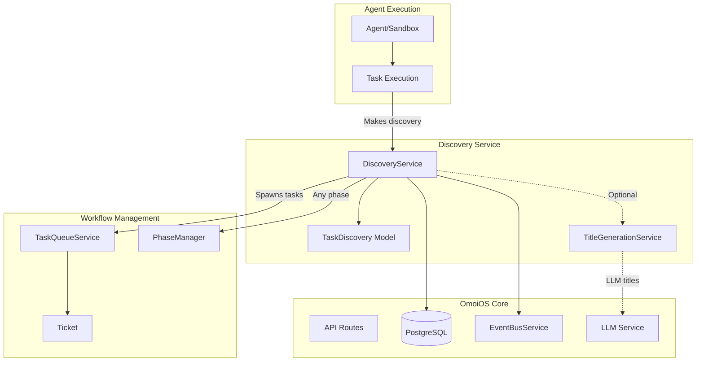
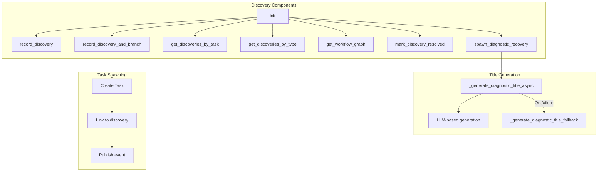
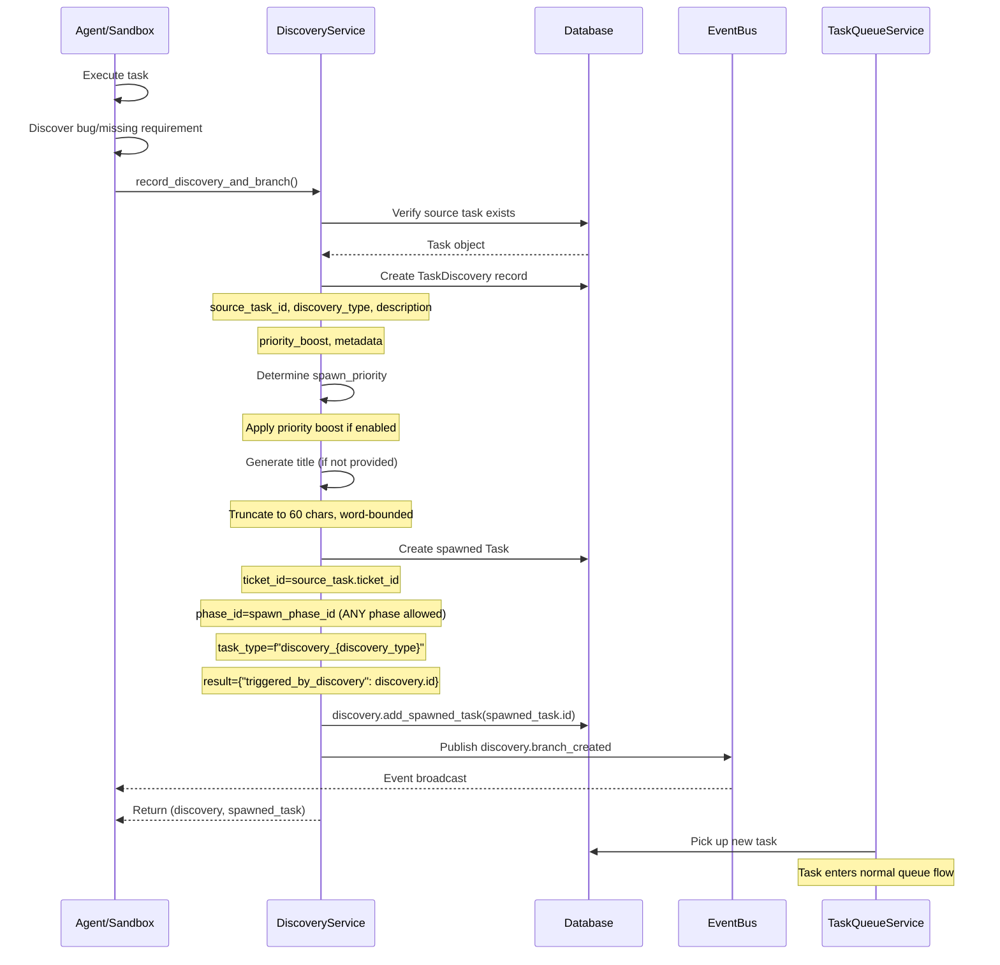
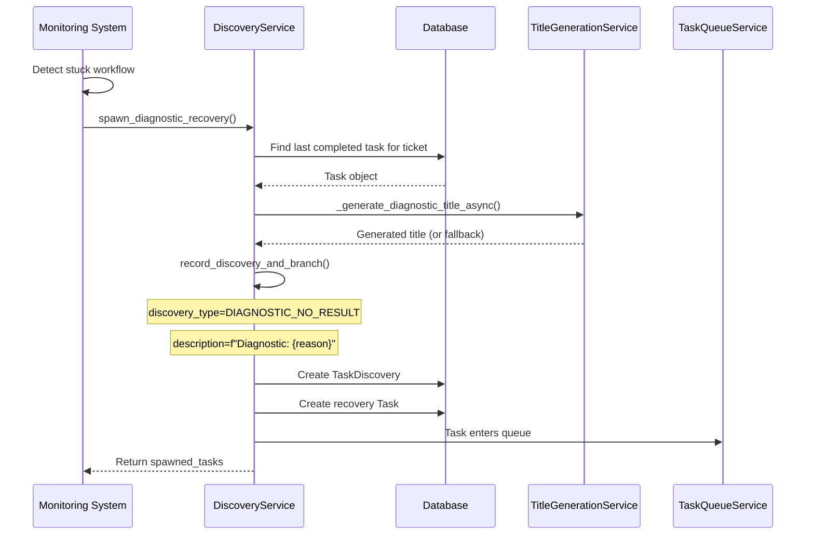
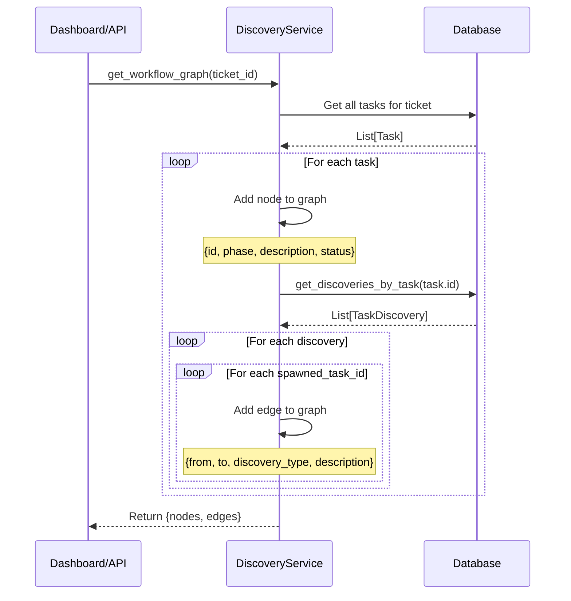

# Discovery Service Design Document

**Date:** 2026-04-22  
**Status:** Active  
**Purpose:** Design documentation for the Discovery service enabling adaptive workflow branching and agent-driven task discovery in OmoiOS.  
**Related Docs:** [Orchestrator Service](./orchestrator_service.md), [Guardian Monitoring](./guardian_monitoring.md), [Conductor Coherence](./conductor_coherence.md), [Phase Manager](./phase_manager.md)

---

## 1. Overview

The Discovery Service implements the Hephaestus pattern for adaptive workflow branching in OmoiOS. It tracks WHY workflows branch and WHAT agents discover during task execution, enabling autonomous task generation based on runtime findings.

### Key Responsibilities

- **Discovery Recording**: Capture agent discoveries during task execution
- **Automatic Branching**: Spawn new tasks when discoveries are made
- **Workflow Graph Building**: Visualize branching structure for tickets
- **Diagnostic Recovery**: Spawn recovery tasks for stuck workflows
- **Title Generation**: Create meaningful task titles from discovery context

### Hephaestus Pattern

The Discovery Service enables agents to:
1. **Discover** new requirements, bugs, or optimizations during execution
2. **Record** discoveries with context and metadata
3. **Branch** workflows by spawning tasks in appropriate phases
4. **Track** resolution status of each discovery

---

## 2. Architecture

### System Context



### Component Diagram



---

## 3. Public API Surface

### Core Discovery Methods

#### `record_discovery()`

```python
def record_discovery(
    self,
    session: Session,
    source_task_id: str,
    discovery_type: str,
    description: str,
    priority_boost: bool = False,
    metadata: Optional[Dict[str, Any]] = None,
) -> TaskDiscovery
```

Record a discovery made by an agent during task execution.

**Parameters:**
- `session`: Database session
- `source_task_id`: Task that made the discovery
- `discovery_type`: Type of discovery (use DiscoveryType constants)
- `description`: What was discovered
- `priority_boost`: Whether this discovery should escalate priority
- `metadata`: Additional context about the discovery

**Returns:** Created TaskDiscovery record

**Raises:** ValueError if source task not found

**Event Published:** `discovery.recorded`

---

#### `record_discovery_and_branch()`

```python
def record_discovery_and_branch(
    self,
    session: Session,
    source_task_id: str,
    discovery_type: str,
    description: str,
    spawn_phase_id: str,
    spawn_description: str,
    spawn_priority: Optional[str] = None,
    priority_boost: bool = False,
    spawn_metadata: Optional[Dict[str, Any]] = None,
    spawn_title: Optional[str] = None,
) -> tuple[TaskDiscovery, Task]
```

Record discovery and immediately spawn a branch task.

**Important:** This method bypasses PhaseModel.allowed_transitions restrictions for discovery-based spawning, enabling Hephaestus-style free-form branching. Normal phase transitions still enforce allowed_transitions, but discoveries can spawn tasks in ANY phase (e.g., Phase 3 validation agent can spawn Phase 1 investigation tasks).

**Parameters:**
- `session`: Database session
- `source_task_id`: Task that made the discovery
- `discovery_type`: Type of discovery
- `description`: Discovery description
- `spawn_phase_id`: Phase ID for the spawned task (can be ANY phase)
- `spawn_description`: Description for the spawned task
- `spawn_priority`: Priority for spawned task (defaults to source task priority)
- `priority_boost`: Whether to boost priority
- `spawn_metadata`: Metadata for spawned task
- `spawn_title`: Title for the spawned task (auto-generated if not provided)

**Returns:** Tuple of (discovery_record, spawned_task)

**Priority Boost Logic:**
```python
if priority_boost and spawn_priority != "CRITICAL":
    priority_map = {"LOW": "MEDIUM", "MEDIUM": "HIGH", "HIGH": "CRITICAL"}
    spawn_priority = priority_map.get(spawn_priority, "HIGH")
```

**Event Published:** `discovery.branch_created`

---

### Query Methods

#### `get_discoveries_by_task()`

```python
def get_discoveries_by_task(
    self,
    session: Session,
    task_id: str,
    resolution_status: Optional[str] = None,
) -> List[TaskDiscovery]
```

Get all discoveries made by a specific task.

**Parameters:**
- `session`: Database session
- `task_id`: Source task ID
- `resolution_status`: Optional filter by status ("open", "resolved")

---

#### `get_discoveries_by_type()`

```python
def get_discoveries_by_type(
    self,
    session: Session,
    discovery_type: str,
    limit: int = 50,
) -> List[TaskDiscovery]
```

Get discoveries by type (useful for pattern analysis).

---

#### `get_workflow_graph()`

```python
def get_workflow_graph(
    self,
    session: Session,
    ticket_id: str,
) -> Dict[str, Any]
```

Build a workflow graph showing all discoveries and branches for a ticket.

**Returns:**
```python
{
    "nodes": [
        {"id": "task-1", "phase": "PHASE_IMPLEMENTATION", "description": "...", "status": "completed"}
    ],
    "edges": [
        {"from": "task-1", "to": "task-2", "discovery_type": "BUG_FOUND", "description": "..."}
    ]
}
```

---

### Resolution Methods

#### `mark_discovery_resolved()`

```python
def mark_discovery_resolved(
    self,
    session: Session,
    discovery_id: str,
) -> TaskDiscovery
```

Mark a discovery as resolved.

**Event Published:** `discovery.resolved`

---

### Diagnostic Recovery

#### `spawn_diagnostic_recovery()`

```python
async def spawn_diagnostic_recovery(
    self,
    session: Session,
    ticket_id: str,
    diagnostic_run_id: str,
    reason: str,
    suggested_phase: str = "PHASE_FINAL",
    suggested_priority: str = "HIGH",
    max_tasks: int = 5,
) -> List[Task]
```

Spawn diagnostic recovery tasks using Discovery pattern.

**Purpose:** Creates a diagnostic discovery and spawns recovery tasks to help stuck workflows progress toward their goal.

**Parameters:**
- `session`: Database session
- `ticket_id`: Workflow (ticket) that is stuck
- `diagnostic_run_id`: ID of the diagnostic run triggering this
- `reason`: Why the diagnostic was triggered
- `suggested_phase`: Phase for recovery task(s)
- `suggested_priority`: Priority for recovery task(s)
- `max_tasks`: Maximum number of recovery tasks to spawn

**Returns:** List of spawned recovery Tasks

---

## 4. Data Flow

### Discovery and Branching Sequence



### Diagnostic Recovery Sequence



### Workflow Graph Building



---

## 5. Integration Points

### Database Models

#### TaskDiscovery Model

```python
class TaskDiscovery(Base):
    """Record of a discovery made during task execution."""
    
    id: Mapped[str] = mapped_column(primary_key=True)
    source_task_id: Mapped[str]  # Task that made the discovery
    discovery_type: Mapped[str]  # BUG_FOUND, MISSING_REQUIREMENT, OPTIMIZATION, etc.
    description: Mapped[str]  # What was discovered
    spawned_task_ids: Mapped[List[str]] = mapped_column(JSONB)  # Tasks created from this discovery
    discovered_at: Mapped[datetime]
    priority_boost: Mapped[bool]  # Whether this triggered priority escalation
    resolution_status: Mapped[str]  # "open", "resolved"
    metadata: Mapped[Optional[dict]] = mapped_column(JSONB)  # Additional context
```

#### DiscoveryType Constants

```python
class DiscoveryType:
    BUG_FOUND = "bug_found"
    MISSING_REQUIREMENT = "missing_requirement"
    OPTIMIZATION_OPPORTUNITY = "optimization_opportunity"
    SECURITY_ISSUE = "security_issue"
    PERFORMANCE_ISSUE = "performance_issue"
    REFACTORING_NEEDED = "refactoring_needed"
    DEPENDENCY_ISSUE = "dependency_issue"
    DIAGNOSTIC_NO_RESULT = "diagnostic_no_result"
```

### Service Dependencies

| Service | Purpose | Optional |
|---------|---------|----------|
| EventBusService | Publish discovery events | Yes |
| TitleGenerationService | LLM-based title generation | Yes (fallback available) |

### Event Types

| Event Type | Payload | Description |
|------------|---------|-------------|
| `discovery.recorded` | {source_task_id, discovery_type, priority_boost} | Discovery captured |
| `discovery.branch_created` | {discovery_type, spawned_task_id, spawn_phase, priority_boost} | Task spawned from discovery |
| `discovery.resolved` | {discovery_type, spawned_count} | Discovery marked resolved |

---

## 6. Error Handling

### Source Task Validation

```python
task = session.get(Task, source_task_id)
if not task:
    raise ValueError(f"Source task {source_task_id} not found")
```

### Discovery Resolution Validation

```python
discovery = session.get(TaskDiscovery, discovery_id)
if not discovery:
    raise ValueError(f"Discovery {discovery_id} not found")
```

### Title Generation Fallback

```python
async def _generate_diagnostic_title_async(...):
    # Try LLM-based generation first
    if self._title_service:
        try:
            title = await self._title_service.generate_title(...)
            return title
        except Exception as e:
            logger.warning("LLM title generation failed, using fallback")
    
    # Fallback to text extraction
    return self._generate_diagnostic_title_fallback(description)
```

### Fallback Title Extraction

The fallback method extracts meaningful titles from diagnostic reason text:
1. Look for "Root Cause:" section
2. Look for "Recommendations:" section with bullet points
3. Use first meaningful line (skipping generic prefixes)
4. Ultimate fallback: "Diagnose and recover stuck workflow"

---

## 7. Configuration

### Discovery Types

| Type | Use Case | Typical Spawn Phase |
|------|----------|---------------------|
| bug_found | Agent finds a bug | PHASE_IMPLEMENTATION |
| missing_requirement | Missing requirement discovered | PHASE_REQUIREMENTS |
| optimization_opportunity | Performance improvement found | PHASE_IMPLEMENTATION |
| security_issue | Security vulnerability found | PHASE_IMPLEMENTATION |
| performance_issue | Performance problem detected | PHASE_IMPLEMENTATION |
| refactoring_needed | Code needs restructuring | PHASE_IMPLEMENTATION |
| dependency_issue | Dependency problem found | PHASE_IMPLEMENTATION |
| diagnostic_no_result | Diagnostic run found no result | PHASE_FINAL |

### Title Generation

| Setting | Default | Description |
|---------|---------|-------------|
| Max title length | 70 chars | Truncation limit |
| Word boundary | 30-60 chars | Preferred break point |
| Ellipsis | "..." | Truncation indicator |

---

## 8. Related Documentation

- [Orchestrator Service](./orchestrator_service.md) - Task execution and sandbox management
- [Guardian Monitoring](./guardian_monitoring.md) - Emergency intervention system
- [Conductor Coherence](./conductor_coherence.md) - System-wide coherence analysis
- [Phase Manager](./phase_manager.md) - Phase transition orchestration
- [ARCHITECTURE.md](../../../ARCHITECTURE.md) - System architecture overview
- [backend/CLAUDE.md](../../../backend/CLAUDE.md) - Backend development guide

---

## Appendix: File Reference

**Source File:** `backend/omoi_os/services/discovery.py`  
**Lines:** 522  
**Key Classes:** DiscoveryService  
**Key Models:** TaskDiscovery, DiscoveryType  
**Key Functions:** record_discovery, record_discovery_and_branch, get_workflow_graph, spawn_diagnostic_recovery
