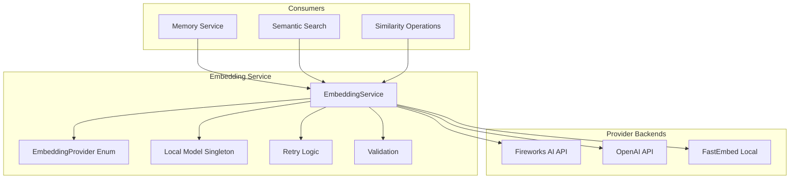
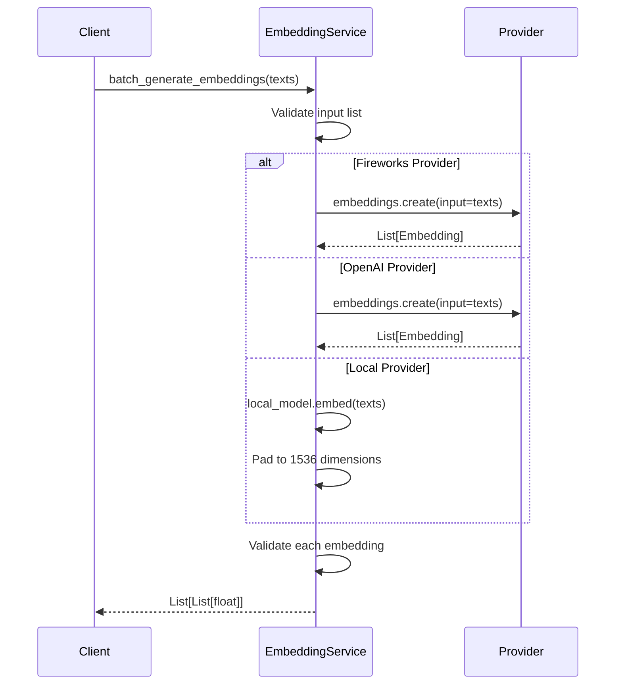
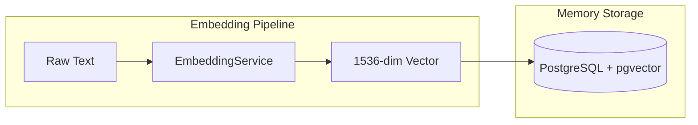
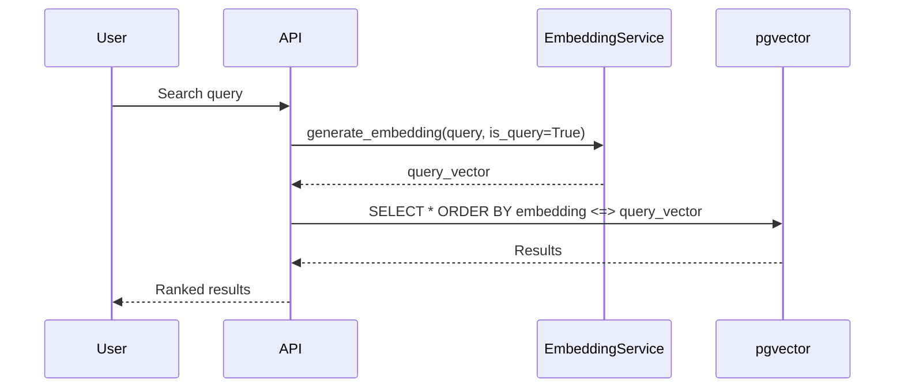

# Embedding Service Design

> **Date**: 2025-07-20 | **Status**: Active | **Version**: 1.0 | **Owner**: Deep Docs Pipeline
> **Source**: Generated from codebase analysis | **Cross-links**: See Related Documents section

## Overview

The Embedding Service provides vector embedding generation capabilities for the OmoiOS platform, supporting multiple providers (Fireworks AI, OpenAI, and local FastEmbed models). It handles text-to-vector conversion with configurable dimensions, batching, caching, and robust error handling for semantic search and similarity operations.

## Architecture



## Key Components

### EmbeddingProvider Enum

`backend/omoi_os/services/embedding.py:30-36`

```python
class EmbeddingProvider(str, Enum):
    """Embedding provider options."""
    
    FIREWORKS = "fireworks"  # Fireworks AI - fast, affordable, OpenAI-compatible
    OPENAI = "openai"
    LOCAL = "local"
```

### EmbeddingService Class

`backend/omoi_os/services/embedding.py:163-625`

The main service class providing:
- Provider-specific initialization (Fireworks, OpenAI, Local)
- Single and batch embedding generation
- Retry logic with exponential backoff
- Dimension validation and padding
- Similarity calculations (cosine, euclidean)

## Provider Abstraction

### Fireworks AI Provider

`backend/omoi_os/services/embedding.py:196-309`

```python
FIREWORKS_BASE_URL = "https://api.fireworks.ai/inference/v1"

# Default model: fireworks/qwen3-embedding-8b (1536 dimensions)
# OpenAI-compatible API with variable dimension support
```

**Configuration:**
- API Key: `EMBEDDING_FIREWORKS_API_KEY` or `embedding.fireworks_api_key`
- Model: `fireworks/qwen3-embedding-8b` (default)
- Dimensions: Configurable up to 1536 (pgvector compatibility)

### OpenAI Provider

`backend/omoi_os/services/embedding.py:310-403`

```python
# Default model: text-embedding-3-small (1536 dimensions)
# Production-grade embeddings with consistent quality
```

**Configuration:**
- API Key: `EMBEDDING_OPENAI_API_KEY` or `embedding.openai_api_key`
- Model: `text-embedding-3-small` (default)
- Dimensions: 1536 (fixed)

### Local FastEmbed Provider

`backend/omoi_os/services/embedding.py:404-508`

```python
# Default model: intfloat/multilingual-e5-large (1024 dimensions, padded to 1536)
# No API calls required - runs locally
# Supports query/passage prefixes for optimal performance
```

**Configuration:**
- Model: `intfloat/multilingual-e5-large` (default)
- Cache Dir: `embedding.cache_dir` (default: `~/.cache/fastembed`)
- Lazy Load: `embedding.lazy_load` (default: True)

## Batching Strategy

### Batch Processing Flow



### Batch Size Considerations

- **API Providers**: Limited by provider API (typically 2048 items)
- **Local Provider**: Memory-constrained by model size
- **Dimension Padding**: Local embeddings padded from 1024 to 1536 for consistency

## Caching Mechanism

### Local Model Singleton

`backend/omoi_os/services/embedding.py:38-127`

```python
# Singleton pattern for local FastEmbed model
_local_model_instance: Optional["TextEmbedding"] = None
_local_model_lock = threading.Lock()
_local_model_loading = threading.Event()

# Preload support for background initialization
def preload_embedding_model() -> None:
    """Preload local model in background thread."""
```

### Cache Benefits

1. **Model Loading**: Single load, shared across all service instances
2. **Memory Efficiency**: One model instance in memory
3. **Thread Safety**: Lock-protected initialization
4. **Health Checks**: `wait_for_model_ready()` for readiness probes

## Error Handling

### Retry Configuration

`backend/omoi_os/services/embedding.py:24-28`

```python
MAX_RETRIES = 3
RETRY_BASE_DELAY = 1.0  # seconds
RETRY_MAX_DELAY = 10.0  # seconds
```

### Retryable Errors

`backend/omoi_os/services/embedding.py:533-544`

```python
retryable = any(
    indicator in str(e).lower()
    for indicator in [
        "rate limit",
        "timeout",
        "503",
        "502",
        "429",
        "connection",
        "temporarily",
    ]
)
```

### Exponential Backoff with Jitter

`backend/omoi_os/services/embedding.py:553-561`

```python
delay = min(
    RETRY_BASE_DELAY * (2**attempt) + np.random.uniform(0, 1),
    RETRY_MAX_DELAY,
)
```

## Configuration

### Environment Variables

| Variable | Description | Default |
|----------|-------------|---------|
| `EMBEDDING_PROVIDER` | Provider selection | `fireworks` |
| `EMBEDDING_FIREWORKS_API_KEY` | Fireworks AI API key | None |
| `EMBEDDING_OPENAI_API_KEY` | OpenAI API key | None |
| `EMBEDDING_MODEL_NAME` | Override model name | Provider-specific |
| `EMBEDDING_DIMENSIONS` | Output dimensions | 1536 |
| `EMBEDDING_CACHE_DIR` | Local model cache path | `~/.cache/fastembed` |
| `EMBEDDING_LAZY_LOAD` | Defer initialization | `true` |
| `EMBEDDING_PRELOAD_BACKGROUND` | Preload in background | `false` |

### YAML Configuration

```yaml
# config/base.yaml
embedding:
  provider: fireworks  # fireworks | openai | local
  fireworks_api_key: ${EMBEDDING_FIREWORKS_API_KEY}
  openai_api_key: ${EMBEDDING_OPENAI_API_KEY}
  model_name: null  # Use provider defaults
  dimensions: 1536
  cache_dir: ~/.cache/fastembed
  lazy_load: true
  preload_in_background: false
```

## API Reference

### Core Methods

#### generate_embedding

`backend/omoi_os/services/embedding.py:354-374`

```python
def generate_embedding(self, text: str, is_query: bool = False) -> List[float]:
    """
    Generate embedding vector for text.
    
    Args:
        text: Input text to embed
        is_query: If True, adds "query: " prefix for multilingual-e5-large
    
    Returns:
        Embedding vector (dimensions depend on provider/model)
    """
```

#### batch_generate_embeddings

`backend/omoi_os/services/embedding.py:426-508`

```python
def batch_generate_embeddings(
    self, 
    texts: List[str], 
    is_query: bool = False
) -> List[List[float]]:
    """
    Generate embeddings for multiple texts in batch.
    
    Args:
        texts: List of input texts
        is_query: If True, adds "query: " prefix for multilingual-e5-large
    
    Returns:
        List of embedding vectors
    """
```

#### Similarity Methods

`backend/omoi_os/services/embedding.py:600-644`

```python
@staticmethod
def cosine_similarity(vec1: List[float], vec2: List[float]) -> float:
    """Calculate cosine similarity between two vectors."""

@staticmethod
def euclidean_distance(vec1: List[float], vec2: List[float]) -> float:
    """Calculate Euclidean distance between two vectors."""
```

## Integration Patterns

### Memory Service Integration



### Semantic Search Flow



## Performance Considerations

### Provider Comparison

| Provider | Latency | Cost | Quality | Use Case |
|----------|---------|------|---------|----------|
| Fireworks | Low | Low | Good | Default production |
| OpenAI | Medium | Medium | Excellent | High-quality needs |
| Local | Variable | Free | Good | Offline/air-gapped |

### Optimization Strategies

1. **Batch Processing**: Use `batch_generate_embeddings()` for multiple texts
2. **Lazy Loading**: Defer model initialization until first use
3. **Background Preload**: Preload local model at startup
4. **Dimension Consistency**: All providers output 1536 dimensions
5. **Caching**: Reuse embedding results where possible

## Error Scenarios

### Provider Failures

| Scenario | Behavior | Recovery |
|----------|----------|----------|
| Rate Limit | Retry with backoff | Automatic (3 retries) |
| API Timeout | Retry with backoff | Automatic (3 retries) |
| Invalid API Key | Immediate error | Manual fix required |
| Model Not Found | Immediate error | Check model name |
| Local Model Load Fail | Immediate error | Check cache/install |

### Validation Errors

`backend/omoi_os/services/embedding.py:566-598`

```python
def _validate_embedding(self, embedding: List[float]) -> List[float]:
    """Validate embedding dimensions match expected configuration."""
    expected_dims = self.dimensions
    actual_dims = len(embedding)
    
    if actual_dims != expected_dims:
        # Truncate or pad to match
        if actual_dims > expected_dims:
            return embedding[:expected_dims]
        else:
            padded = list(embedding) + [0.0] * (expected_dims - actual_dims)
            return padded
    return embedding
```

## Testing Strategy

### Unit Tests

```python
# Test provider initialization
def test_fireworks_initialization():
    service = EmbeddingService(provider=EmbeddingProvider.FIREWORKS)
    assert service.provider == EmbeddingProvider.FIREWORKS
    assert service.dimensions == 1536

# Test embedding generation
def test_generate_embedding():
    service = EmbeddingService(provider=EmbeddingProvider.LOCAL)
    embedding = service.generate_embedding("test text")
    assert len(embedding) == 1536
    assert all(isinstance(x, float) for x in embedding)

# Test batch processing
def test_batch_embeddings():
    service = EmbeddingService(provider=EmbeddingProvider.LOCAL)
    texts = ["text 1", "text 2", "text 3"]
    embeddings = service.batch_generate_embeddings(texts)
    assert len(embeddings) == 3
    assert all(len(e) == 1536 for e in embeddings)

# Test similarity calculation
def test_cosine_similarity():
    vec1 = [1.0, 0.0, 0.0]
    vec2 = [1.0, 0.0, 0.0]
    similarity = EmbeddingService.cosine_similarity(vec1, vec2)
    assert similarity == 1.0  # Identical vectors
```

### Integration Tests

```python
# Test retry logic
def test_retry_on_rate_limit():
    # Mock provider to return rate limit error twice, then success
    # Verify retry mechanism works
    pass

# Test provider fallback
def test_provider_switching():
    # Test switching between providers
    # Verify consistent output dimensions
    pass
```

## Related Documents

- Memory Service - Vector storage and retrieval
- [Database Schema](../../architecture/11-database-schema.md) - pgvector configuration
- [Configuration System](../../architecture/12-configuration-system.md) - YAML/env configuration
- LLM Service - Related AI service patterns

## Future Enhancements

1. **Caching Layer**: Redis-based embedding cache for repeated texts
2. **Dimension Compression**: Support for lower-dimensional embeddings
3. **Multi-Model Ensemble**: Combine embeddings from multiple providers
4. **Streaming Batch**: Process large batches in streaming fashion
5. **Metrics Integration**: Prometheus metrics for embedding operations
