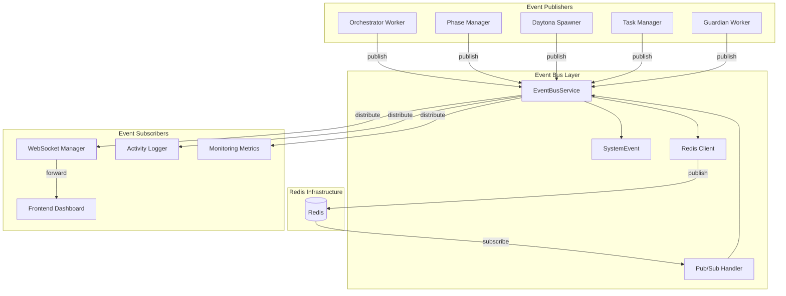
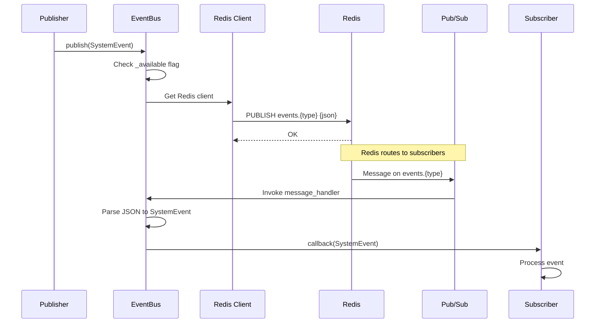

# Event Bus Service

> **Date**: 2025-07-20 | **Status**: Active | **Version**: 1.0 | **Owner**: Deep Docs Pipeline
> **Source**: Generated from codebase analysis | **Cross-links**: See Related Documents section

## Overview

The Event Bus Service provides a system-wide publish/subscribe messaging infrastructure for OmoiOS. Built on Redis Pub/Sub, it enables real-time event distribution across agents, services, and the frontend. The service implements graceful degradation—if Redis is unavailable, operations become no-ops rather than failing.

## Architecture



## Core Components

### EventBusService

`backend/omoi_os/services/event_bus.py:26-166`

The main service class managing Redis connections and event distribution:

```python
class EventBusService:
    """Manages system-wide event publishing and subscription via Redis Pub/Sub.
    
    If Redis is unavailable, operations are no-ops (graceful degradation).
    """
```

**Key Methods:**

| Method | Purpose | Lines |
|--------|---------|-------|
| `publish()` | Publish event to channel | 84-102 |
| `subscribe()` | Register callback for event type | 103-130 |
| `listen()` | Start blocking message listener | 132-143 |
| `close()` | Cleanup Redis connections | 145-150 |

### SystemEvent

`backend/omoi_os/services/event_bus.py:13-24`

Pydantic model defining the event structure:

```python
class SystemEvent(BaseModel):
    """System-wide orchestration event (not OpenHands conversation events)."""
    
    event_type: str = Field(
        ..., description="Event type: TASK_ASSIGNED, TASK_COMPLETED, etc."
    )
    entity_type: str = Field(..., description="Entity type: ticket, task, agent")
    entity_id: str = Field(..., description="ID of the entity")
    payload: Dict[str, Any] = Field(
        default_factory=dict, description="Event payload data"
    )
```

## Event Flow



## Redis Connection Management

### Initialization

`backend/omoi_os/services/event_bus.py:32-83`

```python
def __init__(self, redis_url: str | None = None):
    """
    Initialize event bus service.
    
    Connection strategy:
    1. Use provided URL if available
    2. Fall back to settings.redis.url
    3. Validate URL has proper hostname
    4. Connect with 5s socket timeouts
    5. Test connection with ping()
    """
```

**Connection Parameters:**

```python
self.redis_client = redis.from_url(
    redis_url,
    decode_responses=True,
    socket_timeout=5.0,
    socket_connect_timeout=5.0,
)
```

### Graceful Degradation

`backend/omoi_os/services/event_bus.py:77-83`

```python
except redis.exceptions.ConnectionError as e:
    logger.warning(f"Redis connection failed, EventBus disabled: {e}")
except redis.exceptions.TimeoutError as e:
    logger.warning(f"Redis connection timed out, EventBus disabled: {e}")
except Exception as e:
    logger.warning(f"Redis initialization failed, EventBus disabled: {e}")
```

When Redis is unavailable:
- `publish()` returns immediately (no-op)
- `subscribe()` returns immediately (no-op)
- `listen()` returns immediately (no-op)
- Services continue operating without real-time updates

## Publishing Events

### Basic Publish

`backend/omoi_os/services/event_bus.py:84-102`

```python
def publish(self, event: SystemEvent) -> None:
    """
    Publish event to system bus.
    
    Channel naming: events.{event_type}
    Example: events.TASK_ASSIGNED
    """
    if not self._available or not self.redis_client:
        return  # Graceful no-op when Redis unavailable
    
    channel = f"events.{event.event_type}"
    message = event.model_dump_json()  # Pydantic serialization
    try:
        self.redis_client.publish(channel, message)
    except redis.exceptions.ConnectionError:
        logger.warning("Redis connection lost during publish")
```

### Common Event Types

| Event Type | Entity | Payload | Publisher |
|------------|--------|---------|-----------|
| `TASK_ASSIGNED` | task | agent_id, sandbox_id | Orchestrator |
| `TASK_COMPLETED` | task | result, duration | Sandbox Worker |
| `TASK_FAILED` | task | error, retry_count | Sandbox Worker |
| `sandbox.spawned` | sandbox | task_id, agent_id | Daytona Spawner |
| `sandbox.terminated` | sandbox | task_id, reason | Daytona Spawner |
| `ticket.phase_transitioned` | ticket | from_phase, to_phase | Phase Manager |
| `TICKET_STATUS_CHANGED` | ticket | from_status, to_status | Phase Manager |
| `agent.started` | agent | task, model | Sandbox Worker |
| `agent.completed` | agent | success, cost_usd | Sandbox Worker |
| `agent.tool_use` | agent | tool, input | Sandbox Worker |
| `agent.subagent_invoked` | agent | subagent_type | Sandbox Worker |

## Subscribing to Events

### Subscription Registration

`backend/omoi_os/services/event_bus.py:103-130`

```python
def subscribe(
    self, event_type: str, callback: Callable[[SystemEvent], None]
) -> None:
    """
    Subscribe to event type.
    
    Args:
        event_type: Event type to subscribe to (e.g., "TASK_ASSIGNED")
        callback: Function to call when event is received
                 Signature: callback(event: SystemEvent) -> None
    """
    if not self._available or not self.pubsub:
        return  # Graceful no-op when Redis unavailable
    
    channel = f"events.{event_type}"
    
    def message_handler(message: dict) -> None:
        if message["type"] == "message":
            data = json.loads(message["data"])
            event = SystemEvent(
                event_type=data["event_type"],
                entity_type=data["entity_type"],
                entity_id=data["entity_id"],
                payload=data["payload"],
            )
            callback(event)
    
    self.pubsub.subscribe(**{channel: message_handler})
```

### Subscription Patterns

```python
# Subscribe to specific event type
event_bus.subscribe("TASK_COMPLETED", handle_task_completed)

# Subscribe to multiple event types
for event_type in ["TASK_STARTED", "TASK_COMPLETED", "TASK_FAILED"]:
    event_bus.subscribe(event_type, handle_task_event)

# Wildcard subscriptions (not directly supported, use multiple subscribe)
```

## Message Listening

### Blocking Listener

`backend/omoi_os/services/event_bus.py:132-143`

```python
def listen(self) -> None:
    """
    Start listening for events (blocking).
    
    Callbacks registered via subscribe() will be invoked automatically.
    This method blocks indefinitely until close() is called.
    """
    if not self._available or not self.pubsub:
        return  # Graceful no-op when Redis unavailable
    
    for message in self.pubsub.listen():
        # Callbacks are invoked automatically via subscribe()
        pass
```

### Usage Pattern

```python
# In a background thread or async task
def event_listener():
    event_bus = get_event_bus()
    
    # Register subscriptions
    event_bus.subscribe("TASK_COMPLETED", on_task_completed)
    event_bus.subscribe("sandbox.spawned", on_sandbox_spawned)
    
    # Start blocking listener
    event_bus.listen()

# Start listener in background
import threading
listener_thread = threading.Thread(target=event_listener, daemon=True)
listener_thread.start()
```

## WebSocket Integration

### WebSocket Manager Pattern

While the codebase references WebSocket management, the actual WebSocket forwarding is typically handled by a separate service that subscribes to EventBus events:

```python
class WebSocketManager:
    """Forwards EventBus events to connected WebSocket clients."""
    
    def __init__(self, event_bus: EventBusService):
        self.event_bus = event_bus
        self.connections: Dict[str, WebSocket] = {}
        
        # Subscribe to all relevant events
        self.event_bus.subscribe("TASK_COMPLETED", self.forward_to_clients)
        self.event_bus.subscribe("sandbox.spawned", self.forward_to_clients)
        self.event_bus.subscribe("ticket.phase_transitioned", self.forward_to_clients)
    
    def forward_to_clients(self, event: SystemEvent) -> None:
        """Forward event to all connected WebSocket clients."""
        message = event.model_dump_json()
        for client_id, websocket in self.connections.items():
            try:
                websocket.send(message)
            except Exception as e:
                logger.warning(f"Failed to send to {client_id}: {e}")
```

### Frontend Real-Time Updates

```javascript
// Frontend WebSocket client
const ws = new WebSocket('wss://api.omoios.dev/ws/events');

ws.onmessage = (event) => {
    const systemEvent = JSON.parse(event.data);
    
    switch (systemEvent.event_type) {
        case 'TASK_COMPLETED':
            updateTaskStatus(systemEvent.entity_id, 'completed');
            break;
        case 'sandbox.spawned':
            showSandboxIndicator(systemEvent.payload.sandbox_id);
            break;
        case 'ticket.phase_transitioned':
            updateTicketPhase(
                systemEvent.entity_id,
                systemEvent.payload.to_phase
            );
            break;
    }
};
```

## Error Handling

### Publish Errors

```python
def publish(self, event: SystemEvent) -> None:
    # ...
    try:
        self.redis_client.publish(channel, message)
    except redis.exceptions.ConnectionError:
        logger.warning("Redis connection lost during publish")
        # Event is lost - consider local queue for retry
```

### Connection Recovery

The EventBusService does not automatically reconnect. For production use, consider:

1. **Health checks**: Monitor `_available` flag
2. **Reconnection logic**: Re-initialize service on connection failure
3. **Local buffering**: Queue events during outages

```python
def check_and_reconnect(self) -> bool:
    """Check connection and attempt reconnection if needed."""
    if not self._available:
        try:
            self.redis_client.ping()
            self._available = True
            logger.info("Redis connection restored")
            return True
        except:
            return False
    return True
```

## Singleton Pattern

### Global Instance

`backend/omoi_os/services/event_bus.py:153-166`

```python
# Singleton instance for the event bus
_event_bus_instance: EventBusService | None = None

def get_event_bus() -> EventBusService:
    """Get or create the singleton EventBusService instance.
    
    Returns:
        EventBusService: The singleton event bus instance
    """
    global _event_bus_instance
    if _event_bus_instance is None:
        _event_bus_instance = EventBusService()
    return _event_bus_instance
```

### Usage

```python
from omoi_os.services.event_bus import get_event_bus, SystemEvent

# Get singleton instance
event_bus = get_event_bus()

# Publish event
event_bus.publish(SystemEvent(
    event_type="TASK_COMPLETED",
    entity_type="task",
    entity_id=str(task.id),
    payload={"result": result, "duration_ms": duration}
))

# Subscribe to events
event_bus.subscribe("TASK_COMPLETED", on_task_completed)
```

## Event Payload Examples

### Task Event

```python
SystemEvent(
    event_type="TASK_COMPLETED",
    entity_type="task",
    entity_id="task-123-abc",
    payload={
        "result": "Successfully implemented feature X",
        "duration_ms": 45000,
        "agent_id": "agent-456-def",
        "sandbox_id": "omoios-task12-abc123",
        "turns": 15,
        "cost_usd": 0.45,
    }
)
```

### Sandbox Event

```python
SystemEvent(
    event_type="sandbox.spawned",
    entity_type="sandbox",
    entity_id="omoios-task12-abc123",
    payload={
        "sandbox_id": "omoios-task12-abc123",
        "task_id": "task-123-abc",
        "agent_id": "agent-456-def",
        "phase_id": "PHASE_IMPLEMENTATION",
        "runtime": "claude",
        "execution_mode": "implementation",
    }
)
```

### Phase Transition Event

```python
SystemEvent(
    event_type="ticket.phase_transitioned",
    entity_type="ticket",
    entity_id="ticket-789-ghi",
    payload={
        "from_phase": "PHASE_REQUIREMENTS",
        "to_phase": "PHASE_IMPLEMENTATION",
        "from_status": "analyzing",
        "to_status": "building",
        "initiated_by": "phase-manager-auto-advance",
        "reason": "Phase gate criteria met",
        "artifacts_collected": 3,
        "tasks_spawned": 2,
    }
)
```

## Performance Considerations

### Redis Channel Naming

Channels follow the pattern `events.{event_type}`:
- Specific channels enable selective subscription
- Avoid wildcard patterns for better performance
- Use consistent naming conventions

### Message Size

Payloads should be kept under 1MB:
- Large outputs should be stored in database
- Events should contain references (IDs) not full content
- Use `model_dump_json()` for consistent serialization

### Connection Pooling

The service uses a single Redis connection:
- Suitable for moderate event volumes
- For high throughput, consider connection pooling
- Monitor Redis memory usage for pub/sub buffers

## Testing

### Mock Event Bus

```python
class MockEventBus:
    """In-memory event bus for testing."""
    
    def __init__(self):
        self.subscribers: Dict[str, List[Callable]] = {}
        self.published_events: List[SystemEvent] = []
    
    def publish(self, event: SystemEvent) -> None:
        self.published_events.append(event)
        for callback in self.subscribers.get(event.event_type, []):
            callback(event)
    
    def subscribe(self, event_type: str, callback: Callable) -> None:
        if event_type not in self.subscribers:
            self.subscribers[event_type] = []
        self.subscribers[event_type].append(callback)
```

### Event Assertions

```python
def test_task_completion_publishes_event():
    mock_bus = MockEventBus()
    service = TaskService(event_bus=mock_bus)
    
    service.complete_task(task_id="task-123")
    
    assert len(mock_bus.published_events) == 1
    event = mock_bus.published_events[0]
    assert event.event_type == "TASK_COMPLETED"
    assert event.entity_id == "task-123"
```

## Related Documents

- [Sandbox Spawner](./sandbox_spawner.md) - Publishes sandbox lifecycle events
- [Phase Manager](./phase_manager.md) - Publishes phase transition events
- `backend/omoi_os/services/event_bus.py` - Source implementation
- `docs/architecture/06-realtime-events.md` - Real-time events deep-dive
- Redis Pub/Sub documentation: https://redis.io/docs/manual/pubsub/

## API Reference

### SystemEvent

```python
class SystemEvent(BaseModel):
    """System-wide orchestration event.
    
    Attributes:
        event_type: Event type identifier (e.g., "TASK_COMPLETED")
        entity_type: Type of entity (ticket, task, agent, sandbox)
        entity_id: Unique identifier for the entity
        payload: Event-specific data dictionary
    """
```

### EventBusService Constructor

```python
def __init__(self, redis_url: str | None = None):
    """
    Initialize event bus service.
    
    Args:
        redis_url: Redis connection URL. If None, uses settings.redis.url
        
    Note:
        If Redis is unavailable, the service operates in no-op mode
        with graceful degradation.
    """
```

### close

```python
def close(self) -> None:
    """Close Redis connections and cleanup resources.
    
    Should be called on application shutdown.
    """
```
